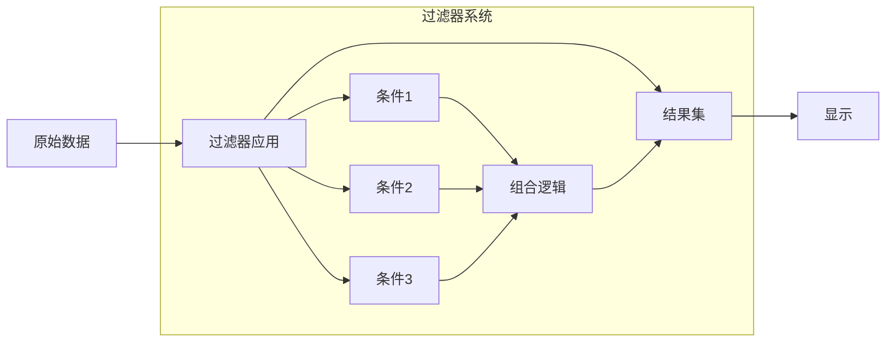

# Blender 电子表格系统 - 过滤器和排序操作

## 目录
- [1. 过滤器系统概述](#1-过滤器系统概述)
- [2. SpreadsheetRowFilter 结构体](#2-spreadsheetrowfilter-结构体)
  - [2.1. 数据结构](#21-数据结构)
  - [2.2. 过滤器标志](#22-过滤器标志)
- [3. 过滤器操作类型](#3-过滤器操作类型)
  - [3.1. 等于操作](#31-等于操作)
  - [3.2. 大于操作](#32-大于操作)
  - [3.3. 小于操作](#33-小于操作)
  - [3.4. 阈值比较](#34-阈值比较)
- [4. 过滤器应用流程](#4-过滤器应用流程)
  - [4.1. 过滤器遍历](#41-过滤器遍历)
  - [4.2. 条件匹配](#42-条件匹配)
  - [4.3. 结果集生成](#43-结果集生成)
- [5. 数据源过滤](#5-数据源过滤)
  - [5.1. 选择过滤](#51-选择过滤)
  - [5.2. 编辑模式支持](#52-编辑模式支持)
  - [5.3. Mesh 选择映射](#53-mesh-选择映射)
- [6. UI 面板管理](#6-ui-面板管理)
  - [6.1. 面板注册](#61-面板注册)
  - [6.2. 实例化面板](#62-实例化面板)
  - [6.3. 面板交互](#63-面板交互)
- [7. 过滤器配置](#7-过滤器配置)
  - [7.1. 列选择](#71-列选择)
  - [7.2. 操作选择](#72-操作选择)
  - [7.3. 值输入](#73-值输入)
- [8. 排序操作](#8-排序操作)
  - [8.1. 排序实现](#81-排序实现)
  - [8.2. 多列排序](#82-多列排序)
- [9. 高级过滤](#9-高级过滤)
  - [9.1. 复合条件](#91-复合条件)
  - [9.2. 正则表达式](#92-正则表达式)
  - [9.3. 自定义函数](#93-自定义函数)
- [10. 性能优化](#10-性能优化)
  - [10.1. 过滤器缓存](#101-过滤器缓存)
  - [10.2. 增量更新](#102-增量更新)
  - [10.3. 并行处理](#103-并行处理)

---

## 1. 过滤器系统概述

电子表格的过滤器系统允许用户基于条件筛选显示的行。过滤器应用于数据源获取数据之后，显示数据之前。



**过滤器特点**：
- **链式结构**：多个过滤器按顺序应用
- **类型感知**：根据列类型显示合适的UI控件
- **实时更新**：修改后立即生效
- **可启用/禁用**：临时关闭过滤器

---

## 2. SpreadsheetRowFilter 结构体

### 2.1. 数据结构

**定义位置**: `source/blender/makesdna/DNA_space_types.h:1256-1278`

```cpp
typedef struct SpreadsheetRowFilter {
  SpreadsheetRowFilter *next, *prev;  // 链表结构

  char column_name[64];               // 列名（最大63字符 + \0）
  uint8_t operation;                  // 操作类型
  uint8_t flag;                       // 标志位
  char _pad0[6];                      // 填充

  // 值存储（根据数据类型使用不同字段）
  int value_int;                      // 整数值
  int value_int2[2];                  // 2D整数值
  int value_int3[3];                  // 3D整数值
  char *value_string;                 // 字符串值（堆分配）
  float value_float;                  // 浮点值
  float threshold;                    // 浮点阈值（用于容差）
  float value_float2[2];              // 2D浮点值
  float value_float3[3];              // 3D浮点值
  float value_color[4];               // 颜色值（RGBA）

  char _pad1[4];                      // 填充
} SpreadsheetRowFilter;
```

#### 2.1.1. 内存布局

| 偏移量 | 字段 | 大小 | 说明 |
|--------|------|------|------|
| 0-15 | 链表指针 | 16B | next, prev |
| 16-79 | column_name | 64B | 列名 |
| 80-81 | operation | 1B | 操作 |
| 82-83 | flag | 1B | 标志 |
| 84-89 | padding | 6B | 对齐 |
| 90-93 | value_int | 4B | 整数值 |
| 94-101 | value_int2 | 8B | 2D整数 |
| 102-113 | value_int3 | 12B | 3D整数 |
| 114-121 | value_string | 8B | 字符串指针 |
| 122-125 | value_float | 4B | 浮点值 |
| 126-129 | threshold | 4B | 阈值 |
| 130-137 | value_float2 | 8B | 2D浮点 |
| 138-149 | value_float3 | 12B | 3D浮点 |
| 150-165 | value_color | 16B | RGBA |
| 166-169 | padding | 4B | 对齐 |

### 2.2. 过滤器标志

```cpp
// eSpreadsheetRowFilterFlag
#define SPREADSHEET_ROW_FILTER_ENABLED (1 << 0)
// 过滤器是否启用

#define SPREADSHEET_ROW_FILTER_BOOL_VALUE (1 << 1)
// 布尔值：0=False, 1=True

#define SPREADSHEET_ROW_FILTER_UI_EXPAND (1 << 2)
// UI面板是否展开
```

---

## 3. 过滤器操作类型

### 3.1. 操作枚举

```cpp
// eSpreadsheetFilterOperation
#define SPREADSHEET_ROW_FILTER_EQUAL    0  // 等于 (=)
#define SPREADSHEET_ROW_FILTER_GREATER  1  // 大于 (>)
#define SPREADSHEET_ROW_FILTER_LESS     2  // 小于 (<)
```

### 3.2. 操作字符串映射

**定义位置**: `spreadsheet_row_filter_ui.cc:43-60`

```cpp
static std::string operation_string(const eSpreadsheetColumnValueType data_type,
                                    const eSpreadsheetFilterOperation operation)
{
  // 布尔和实例类型只支持等于
  if (ELEM(data_type, SPREADSHEET_VALUE_TYPE_BOOL, SPREADSHEET_VALUE_TYPE_INSTANCES)) {
    return "=";
  }

  switch (operation) {
    case SPREADSHEET_ROW_FILTER_EQUAL:
      return "=";
    case SPREADSHEET_ROW_FILTER_GREATER:
      return ">";
    case SPREADSHEET_ROW_FILTER_LESS:
      return "<";
  }
  BLI_assert_unreachable();
  return "";
}
```

### 3.3. 比较逻辑

#### 3.3.1. 整数比较

```cpp
bool matches_int(const SpreadsheetRowFilter &filter, int value)
{
  switch (filter.operation) {
    case SPREADSHEET_ROW_FILTER_EQUAL:
      return value == filter.value_int;
    case SPREADSHEET_ROW_FILTER_GREATER:
      return value > filter.value_int;
    case SPREADSHEET_ROW_FILTER_LESS:
      return value < filter.value_int;
  }
  return false;
}
```

#### 3.3.2. 浮点数比较（带阈值）

```cpp
bool matches_float(const SpreadsheetRowFilter &filter, float value)
{
  switch (filter.operation) {
    case SPREADSHEET_ROW_FILTER_EQUAL:
      // 使用阈值进行容差比较
      return std::abs(value - filter.value_float) <= filter.threshold;
    case SPREADSHEET_ROW_FILTER_GREATER:
      return value > filter.value_float;
    case SPREADSHEET_ROW_FILTER_LESS:
      return value < filter.value_float;
  }
  return false;
}
```

#### 3.3.3. 向量比较

```cpp
bool matches_float3(const SpreadsheetRowFilter &filter, const float3 &value)
{
  switch (filter.operation) {
    case SPREADSHEET_ROW_FILTER_EQUAL: {
      // 逐分量比较
      for (int i = 0; i < 3; i++) {
        if (std::abs(value[i] - filter.value_float3[i]) > filter.threshold) {
          return false;
        }
      }
      return true;
    }
    // 向量不支持 > 和 < 操作
  }
  return false;
}
```

#### 3.3.4. 字符串比较

```cpp
bool matches_string(const SpreadsheetRowFilter &filter, const std::string &value)
{
  if (filter.operation != SPREADSHEET_ROW_FILTER_EQUAL) {
    return false;
  }
  return value == filter.value_string;
}
```

#### 3.3.5. 颜色比较

```cpp
bool matches_color(const SpreadsheetRowFilter &filter, const float4 &color)
{
  if (filter.operation != SPREADSHEET_ROW_FILTER_EQUAL) {
    return false;
  }

  for (int i = 0; i < 4; i++) {
    if (std::abs(color[i] - filter.value_color[i]) > filter.threshold) {
      return false;
    }
  }
  return true;
}
```

#### 3.3.6. 布尔比较

```cpp
bool matches_bool(const SpreadsheetRowFilter &filter, bool value)
{
  // 布尔只支持等于操作
  bool filter_value = (filter.flag & SPREADSHEET_ROW_FILTER_BOOL_VALUE) != 0;
  return value == filter_value;
}
```

---

## 4. 过滤器应用流程

### 4.1. 过滤器遍历

**定义位置**: `spreadsheet_row_filter.cc`

```cpp
IndexMask apply_row_filters(const SpaceSpreadsheet &sspreadsheet,
                            const DataSource &data_source,
                            IndexMaskMemory &memory)
{
  // 1. 获取所有行的初始范围
  const int total_rows = data_source.tot_rows();
  IndexMask result = IndexMask(total_rows);

  // 2. 如果过滤器未启用，返回所有行
  if (!(sspreadsheet.filter_flag & SPREADSHEET_FILTER_ENABLE)) {
    return result;
  }

  // 3. 应用每个过滤器
  LISTBASE_FOREACH (const SpreadsheetRowFilter *, filter, &sspreadsheet.row_filters) {
    if (!(filter->flag & SPREADSHEET_ROW_FILTER_ENABLED)) {
      continue;  // 跳过禁用的过滤器
    }

    // 4. 获取过滤器列的数据
    std::unique_ptr<ColumnValues> column_values = data_source.get_column_values(
        {filter->column_name});

    if (!column_values) {
      continue;  // 列不存在
    }

    // 5. 应用过滤条件
    result = filter_rows(*filter, *column_values, result, memory);
  }

  return result;
}
```

### 4.2. 条件匹配

```cpp
IndexMask filter_rows(const SpreadsheetRowFilter &filter,
                      const ColumnValues &column_values,
                      const IndexMask &input_mask,
                      IndexMaskMemory &memory)
{
  const GVArray &data = column_values.data();
  const eSpreadsheetColumnValueType type = column_values.type();

  // 根据数据类型选择匹配函数
  switch (type) {
    case SPREADSHEET_VALUE_TYPE_INT32:
      return filter_rows_typed<int>(filter, data, input_mask, memory);

    case SPREADSHEET_VALUE_TYPE_FLOAT:
      return filter_rows_typed<float>(filter, data, input_mask, memory);

    case SPREADSHEET_VALUE_TYPE_FLOAT3:
      return filter_rows_typed<float3>(filter, data, input_mask, memory);

    case SPREADSHEET_VALUE_TYPE_STRING:
      return filter_rows_typed<std::string>(filter, data, input_mask, memory);

    case SPREADSHEET_VALUE_TYPE_BOOL:
      return filter_rows_typed<bool>(filter, data, input_mask, memory);

    case SPREADSHEET_VALUE_TYPE_COLOR:
      return filter_rows_typed<float4>(filter, data, input_mask, memory);

    default:
      return input_mask;  // 不支持的类型，返回所有行
  }
}
```

### 4.3. 泛型过滤实现

```cpp
template<typename T>
IndexMask filter_rows_typed(const SpreadsheetRowFilter &filter,
                            const GVArray &data,
                            const IndexMask &input_mask,
                            IndexMaskMemory &memory)
{
  // 从GVArray转换为具体类型
  VArray<T> typed_data = data.typed<T>();

  // 使用IndexMask的from_predicate进行高效过滤
  return IndexMask::from_predicate(input_mask, GrainSize(4096), memory,
      [&](int64_t index) {
        const T &value = typed_data[index];
        return matches(filter, value);
      });
}
```

### 4.4. 匹配函数

```cpp
template<typename T>
bool matches(const SpreadsheetRowFilter &filter, const T &value)
{
  // 根据操作类型进行匹配
  switch (filter.operation) {
    case SPREADSHEET_ROW_FILTER_EQUAL:
      return value == get_filter_value<T>(filter);

    case SPREADSHEET_ROW_FILTER_GREATER:
      return value > get_filter_value<T>(filter);

    case SPREADSHEET_ROW_FILTER_LESS:
      return value < get_filter_value<T>(filter);

    default:
      return false;
  }
}

// 特化：浮点数（带阈值）
template<>
bool matches<float>(const SpreadsheetRowFilter &filter, const float &value)
{
  switch (filter.operation) {
    case SPREADSHEET_ROW_FILTER_EQUAL:
      return std::abs(value - filter.value_float) <= filter.threshold;
    case SPREADSHEET_ROW_FILTER_GREATER:
      return value > filter.value_float;
    case SPREADSHEET_ROW_FILTER_LESS:
      return value < filter.value_float;
  }
  return false;
}

// 特化：字符串（只支持等于）
template<>
bool matches<std::string>(const SpreadsheetRowFilter &filter, const std::string &value)
{
  if (filter.operation != SPREADSHEET_ROW_FILTER_EQUAL) {
    return false;
  }
  return value == filter.value_string;
}
```

---

## 5. 数据源过滤

### 5.1. 选择过滤

**定义位置**: `spreadsheet_data_source_geometry.cc:374-410`

```cpp
bool GeometryDataSource::has_selection_filter() const
{
  if (!object_orig_) {
    return false;
  }

  switch (component_->type()) {
    case bke::GeometryComponent::Type::Mesh:
      if (object_orig_->type != OB_MESH) {
        return false;
      }
      if (object_orig_->mode != OB_MODE_EDIT) {
        return false;
      }
      return true;

    case bke::GeometryComponent::Type::Curve:
      if (object_orig_->type != OB_CURVES) {
        return false;
      }
      if (!ELEM(object_orig_->mode, OB_MODE_SCULPT_CURVES, OB_MODE_EDIT)) {
        return false;
      }
      return true;

    case bke::GeometryComponent::Type::PointCloud:
      if (object_orig_->type != OB_POINTCLOUD) {
        return false;
      }
      if (object_orig_->mode != OB_MODE_EDIT) {
        return false;
      }
      return true;

    default:
      return false;
  }
}
```

### 5.2. 编辑模式支持

#### 5.2.1. Mesh 选择映射

```cpp
IndexMask GeometryDataSource::apply_selection_filter(IndexMaskMemory &memory) const
{
  std::lock_guard lock{mutex_};
  const IndexMask full_range(this->tot_rows());
  if (full_range.is_empty()) {
    return full_range;
  }

  switch (component_->type()) {
    case bke::GeometryComponent::Type::Mesh: {
      BLI_assert(object_orig_->type == OB_MESH);
      BLI_assert(object_orig_->mode == OB_MODE_EDIT);

      const Mesh *mesh_eval = geometry_set_.get_mesh();
      const Mesh *mesh_orig = static_cast<const Mesh *>(object_orig_->data);

      return calc_mesh_selection_mask(*mesh_eval, *mesh_orig, domain_, memory);
    }

    case bke::GeometryComponent::Type::Curve: {
      // 曲线选择处理
      // ...
    }

    case bke::GeometryComponent::Type::PointCloud: {
      // 点云选择处理
      // ...
    }

    default:
      return full_range;
  }
}
```

#### 5.2.2. Mesh 选择计算

```cpp
static IndexMask calc_mesh_selection_mask(const Mesh &mesh_eval,
                                          const Mesh &mesh_orig,
                                          const bke::AttrDomain domain,
                                          IndexMaskMemory &memory)
{
  const bke::AttributeAccessor attributes_eval = mesh_eval.attributes();
  const IndexRange range(attributes_eval.domain_size(domain));
  BMesh *bm = mesh_orig.runtime->edit_mesh->bm;

  switch (domain) {
    case bke::AttrDomain::Point: {
      BM_mesh_elem_table_ensure(bm, BM_VERT);

      if (mesh_eval.verts_num == bm->totvert) {
        // 顶点数量匹配，直接使用索引
        return IndexMask::from_predicate(range, GrainSize(4096), memory, [&](const int i) {
          const BMVert *vert = BM_vert_at_index(bm, i);
          return BM_elem_flag_test_bool(vert, BM_ELEM_SELECT);
        });
      }

      // 使用原始索引映射
      if (const int *orig_indices = static_cast<const int *>(
          CustomData_get_layer(&mesh_eval.vert_data, CD_ORIGINDEX))) {
        return IndexMask::from_predicate(range, GrainSize(2048), memory, [&](const int i) {
          const int orig = orig_indices[i];
          if (orig == -1) {
            return false;
          }
          const BMVert *vert = BM_vert_at_index(bm, orig);
          return BM_elem_flag_test_bool(vert, BM_ELEM_SELECT);
        });
      }

      return range;
    }

    case bke::AttrDomain::Edge: {
      // 类似处理边
      // ...
    }

    case bke::AttrDomain::Face: {
      // 面选择需要特殊处理（通过角映射）
      return calc_mesh_selection_mask_faces(mesh_eval, mesh_orig, memory);
    }

    case bke::AttrDomain::Corner: {
      // 通过面选择映射到角
      IndexMaskMemory face_memory;
      const IndexMask face_mask = calc_mesh_selection_mask_faces(
          mesh_eval, mesh_orig, face_memory);

      if (face_mask.is_empty()) {
        return {};
      }

      Array<bool> face_selection(range.size(), false);
      face_mask.to_bools(face_selection);

      const VArray<bool> corner_selection = attributes_eval.adapt_domain<bool>(
          VArray<bool>::from_span(face_selection),
          bke::AttrDomain::Face,
          bke::AttrDomain::Corner);

      return IndexMask::from_bools(corner_selection, memory);
    }

    default:
      return range;
  }
}
```

#### 5.2.3. 面选择计算

```cpp
static IndexMask calc_mesh_selection_mask_faces(const Mesh &mesh_eval,
                                                const Mesh &mesh_orig,
                                                IndexMaskMemory &memory)
{
  const bke::AttributeAccessor attributes_eval = mesh_eval.attributes();
  const IndexRange range(attributes_eval.domain_size(bke::AttrDomain::Face));
  BMesh *bm = mesh_orig.runtime->edit_mesh->bm;

  BM_mesh_elem_table_ensure(bm, BM_FACE);

  if (mesh_eval.faces_num == bm->totface) {
    return IndexMask::from_predicate(range, GrainSize(4096), memory, [&](const int i) {
      const BMFace *face = BM_face_at_index(bm, i);
      return BM_elem_flag_test_bool(face, BM_ELEM_SELECT);
    });
  }

  if (const int *orig_indices = static_cast<const int *>(
      CustomData_get_layer(&mesh_eval.face_data, CD_ORIGINDEX))) {
    return IndexMask::from_predicate(range, GrainSize(2048), memory, [&](const int i) {
      const int orig = orig_indices[i];
      if (orig == -1) {
        return false;
      }
      const BMFace *face = BM_face_at_index(bm, orig);
      return BM_elem_flag_test_bool(face, BM_ELEM_SELECT);
    });
  }

  return range;
}
```

---

## 6. UI 面板管理

### 6.1. 面板注册

**定义位置**: `spreadsheet_row_filter_ui.cc:365-392`

```cpp
void register_row_filter_panels(ARegionType ®ion_type)
{
  // 1. 过滤器列表面板
  {
    PanelType *panel_type = MEM_callocN<PanelType>(__func__);
    STRNCPY_UTF8(panel_type->idname, "SPREADSHEET_PT_row_filters");
    STRNCPY_UTF8(panel_type->label, N_("Filters"));
    STRNCPY_UTF8(panel_type->category, "Filters");
    panel_type->flag = PANEL_TYPE_NO_HEADER;
    panel_type->draw = spreadsheet_row_filters_layout;
    BLI_addtail(®ion_type.paneltypes, panel_type);
  }

  // 2. 单个过滤器面板（实例化）
  {
    PanelType *panel_type = MEM_callocN<PanelType>(__func__);
    STRNCPY_UTF8(panel_type->idname, "SPREADSHEET_PT_filter");
    STRNCPY_UTF8(panel_type->label, "");
    STRNCPY_UTF8(panel_type->category, "Filters");
    panel_type->flag = PANEL_TYPE_INSTANCED | PANEL_TYPE_HEADER_EXPAND;
    panel_type->draw_header = spreadsheet_filter_panel_draw_header;
    panel_type->draw = spreadsheet_filter_panel_draw;
    panel_type->get_list_data_expand_flag = get_filter_expand_flag;
    panel_type->set_list_data_expand_flag = set_filter_expand_flag;
    panel_type->reorder = filter_reorder;
    BLI_addtail(®ion_type.paneltypes, panel_type);
  }
}
```

### 6.2. 实例化面板

#### 6.2.1. 面板ID生成

```cpp
static void filter_panel_id_fn(void * /*row_filter_v*/, char *r_name)
{
  // 所有过滤器使用相同的面板ID
  BLI_strncpy_utf8(r_name, "SPREADSHEET_PT_filter", BKE_ST_MAXNAME);
}
```

#### 6.2.2. 面板列表管理

```cpp
static void spreadsheet_row_filters_layout(const bContext *C, Panel *panel)
{
  ui::Layout &layout = *panel->layout;
  ARegion *region = CTX_wm_region(C);
  bScreen *screen = CTX_wm_screen(C);
  SpaceSpreadsheet *sspreadsheet = CTX_wm_space_spreadsheet(C);
  ListBase *row_filters = &sspreadsheet->row_filters;

  // 1. 如果过滤器禁用，禁用布局
  if (!(sspreadsheet->filter_flag & SPREADSHEET_FILTER_ENABLE)) {
    layout.active_set(false);
  }

  // 2. 添加"添加过滤器"按钮
  layout.op("SPREADSHEET_OT_add_row_filter_rule", std::nullopt, ICON_ADD);

  // 3. 检查面板是否需要重建
  const bool panels_match = ui::panel_list_matches_data(region, row_filters, filter_panel_id_fn);

  if (!panels_match) {
    // 4. 释放旧面板
    ui::panels_free_instanced(C, region);

    // 5. 为每个过滤器创建新面板
    LISTBASE_FOREACH (SpreadsheetRowFilter *, row_filter, row_filters) {
      char panel_idname[MAX_NAME];
      filter_panel_id_fn(row_filter, panel_idname);

      PointerRNA *filter_ptr = MEM_new<PointerRNA>("panel customdata");
      *filter_ptr = RNA_pointer_create_discrete(
          &screen->id, &RNA_SpreadsheetRowFilter, row_filter);

      ui::panel_add_instanced(C, region, ®ion->panels, panel_idname, filter_ptr);
    }
  } else {
    // 6. 更新现有面板的自定义数据
    Panel *panel_iter = (Panel *)region->panels.first;
    LISTBASE_FOREACH (SpreadsheetRowFilter *, row_filter, row_filters) {
      // 移动到下一个实例化面板
      while ((panel_iter->type == nullptr) ||
             !(panel_iter->type->flag & PANEL_TYPE_INSTANCED)) {
        panel_iter = panel_iter->next;
        BLI_assert(panel_iter != nullptr);
      }

      // 更新自定义数据
      PointerRNA *filter_ptr = MEM_new<PointerRNA>("panel customdata");
      *filter_ptr = RNA_pointer_create_discrete(
          &screen->id, &RNA_SpreadsheetRowFilter, row_filter);
      ui::panel_custom_data_set(panel_iter, filter_ptr);

      panel_iter = panel_iter->next;
    }
  }
}
```

### 6.3. 面板交互

#### 6.3.1. 面板头绘制

```cpp
static void spreadsheet_filter_panel_draw_header(const bContext *C, Panel *panel)
{
  ui::Layout &layout = *panel->layout;
  SpaceSpreadsheet *sspreadsheet = CTX_wm_space_spreadsheet(C);
  PointerRNA *filter_ptr = ui::panel_custom_data_get(panel);
  const SpreadsheetRowFilter *filter = (SpreadsheetRowFilter *)filter_ptr->data;

  // 1. 启用复选框
  ui::Layout *row = &layout.row(true);
  row->emboss_set(ui::EmbossType::None);
  row->prop(filter_ptr, "enabled", ui::ITEM_R_ICON_ONLY, "", ICON_NONE);

  // 2. 显示过滤器描述
  if (filter->column_name.is_empty()) {
    row->label(IFACE_("Filter"), ICON_NONE);
  } else {
    const SpreadsheetColumn *column = lookup_visible_column_for_filter(*sspreadsheet, filter->column_name);
    if (column == nullptr) {
      row->label(filter->column_name, ICON_NONE);
    } else {
      const eSpreadsheetColumnValueType data_type = (eSpreadsheetColumnValueType)column->data_type;
      std::stringstream ss;
      ss << filter->column_name;
      ss << " ";
      ss << operation_string(data_type, (eSpreadsheetFilterOperation)filter->operation);
      ss << " ";
      ss << value_string(*filter, data_type);
      row->label(ss.str(), ICON_NONE);
    }
  }

  // 3. 删除按钮
  row = &layout.row(true);
  row->emboss_set(ui::EmbossType::None);
  const int current_index = BLI_findindex(&sspreadsheet->row_filters, filter);
  PointerRNA op_ptr = row->op("SPREADSHEET_OT_remove_row_filter_rule", "", ICON_X);
  RNA_int_set(&op_ptr, "index", current_index);

  // 4. 间距
  layout.separator(0.25f);
}
```

#### 6.3.2. 面板内容绘制

```cpp
static void spreadsheet_filter_panel_draw(const bContext *C, Panel *panel)
{
  ui::Layout &layout = *panel->layout;
  SpaceSpreadsheet *sspreadsheet = CTX_wm_space_spreadsheet(C);
  PointerRNA *filter_ptr = ui::panel_custom_data_get(panel);
  SpreadsheetRowFilter *filter = (SpreadsheetRowFilter *)filter_ptr->data;

  const StringRef column_name = filter->column_name;
  const eSpreadsheetFilterOperation operation = (eSpreadsheetFilterOperation)filter->operation;

  const SpreadsheetColumn *column = lookup_visible_column_for_filter(*sspreadsheet, column_name);

  // 如果列不存在，禁用布局
  if (!(sspreadsheet->filter_flag & SPREADSHEET_FILTER_ENABLE) ||
      !(filter->flag & SPREADSHEET_ROW_FILTER_ENABLED) ||
      (column == nullptr && !column_name.is_empty()))
  {
    layout.active_set(false);
  }

  layout.use_property_split_set(true);
  layout.use_property_decorate_set(false);

  // 1. 列名选择
  layout.prop(filter_ptr, "column_name", UI_ITEM_NONE, IFACE_("Column"), ICON_NONE);

  // 如果没有列或列不存在，不显示其他控件
  if (column == nullptr || column_name.is_empty()) {
    return;
  }

  // 2. 根据列类型显示不同控件
  switch (static_cast<eSpreadsheetColumnValueType>(column->data_type)) {
    case SPREADSHEET_VALUE_TYPE_INT8:
      layout.prop(filter_ptr, "operation", UI_ITEM_NONE, std::nullopt, ICON_NONE);
      layout.prop(filter_ptr, "value_int8", UI_ITEM_NONE, IFACE_("Value"), ICON_NONE);
      break;

    case SPREADSHEET_VALUE_TYPE_INT32:
    case SPREADSHEET_VALUE_TYPE_INT64:
      layout.prop(filter_ptr, "operation", UI_ITEM_NONE, std::nullopt, ICON_NONE);
      layout.prop(filter_ptr, "value_int", UI_ITEM_NONE, IFACE_("Value"), ICON_NONE);
      break;

    case SPREADSHEET_VALUE_TYPE_INT32_2D:
      layout.prop(filter_ptr, "operation", UI_ITEM_NONE, std::nullopt, ICON_NONE);
      layout.prop(filter_ptr, "value_int2", UI_ITEM_NONE, IFACE_("Value"), ICON_NONE);
      break;

    case SPREADSHEET_VALUE_TYPE_INT32_3D:
      layout.prop(filter_ptr, "operation", UI_ITEM_NONE, std::nullopt, ICON_NONE);
      layout.prop(filter_ptr, "value_int3", UI_ITEM_NONE, IFACE_("Value"), ICON_NONE);
      break;

    case SPREADSHEET_VALUE_TYPE_FLOAT:
      layout.prop(filter_ptr, "operation", UI_ITEM_NONE, std::nullopt, ICON_NONE);
      layout.prop(filter_ptr, "value_float", UI_ITEM_NONE, IFACE_("Value"), ICON_NONE);
      if (operation == SPREADSHEET_ROW_FILTER_EQUAL) {
        layout.prop(filter_ptr, "threshold", UI_ITEM_NONE, std::nullopt, ICON_NONE);
      }
      break;

    case SPREADSHEET_VALUE_TYPE_FLOAT2:
      layout.prop(filter_ptr, "operation", UI_ITEM_NONE, std::nullopt, ICON_NONE);
      layout.prop(filter_ptr, "value_float2", UI_ITEM_NONE, IFACE_("Value"), ICON_NONE);
      if (operation == SPREADSHEET_ROW_FILTER_EQUAL) {
        layout.prop(filter_ptr, "threshold", UI_ITEM_NONE, std::nullopt, ICON_NONE);
      }
      break;

    case SPREADSHEET_VALUE_TYPE_FLOAT3:
      layout.prop(filter_ptr, "operation", UI_ITEM_NONE, std::nullopt, ICON_NONE);
      layout.prop(filter_ptr, "value_float3", UI_ITEM_NONE, IFACE_("Value"), ICON_NONE);
      if (operation == SPREADSHEET_ROW_FILTER_EQUAL) {
        layout.prop(filter_ptr, "threshold", UI_ITEM_NONE, std::nullopt, ICON_NONE);
      }
      break;

    case SPREADSHEET_VALUE_TYPE_BOOL:
      layout.prop(filter_ptr, "value_boolean", UI_ITEM_NONE, IFACE_("Value"), ICON_NONE);
      break;

    case SPREADSHEET_VALUE_TYPE_INSTANCES:
      layout.prop(filter_ptr, "value_string", UI_ITEM_NONE, IFACE_("Value"), ICON_NONE);
      break;

    case SPREADSHEET_VALUE_TYPE_COLOR:
    case SPREADSHEET_VALUE_TYPE_BYTE_COLOR:
      layout.prop(filter_ptr, "operation", UI_ITEM_NONE, std::nullopt, ICON_NONE);
      layout.prop(filter_ptr, "value_color", UI_ITEM_NONE, IFACE_("Value"), ICON_NONE);
      if (operation == SPREADSHEET_ROW_FILTER_EQUAL) {
        layout.prop(filter_ptr, "threshold", UI_ITEM_NONE, std::nullopt, ICON_NONE);
      }
      break;

    case SPREADSHEET_VALUE_TYPE_STRING:
      layout.prop(filter_ptr, "value_string", UI_ITEM_NONE, IFACE_("Value"), ICON_NONE);
      break;

    case SPREADSHEET_VALUE_TYPE_UNKNOWN:
    case SPREADSHEET_VALUE_TYPE_QUATERNION:
    case SPREADSHEET_VALUE_TYPE_FLOAT4X4:
    case SPREADSHEET_VALUE_TYPE_BUNDLE_ITEM:
      layout.label(IFACE_("Unsupported column type"), ICON_ERROR);
      break;
  }
}
```

---

## 7. 过滤器配置

### 7.1. RNA 属性定义

**定义位置**: `source/blender/makesrna/RNA_space_types.cc`

```cpp
static const EnumPropertyItem rna_enum_spreadsheet_filter_operation_items[] = {
  {SPREADSHEET_ROW_FILTER_EQUAL, "EQUAL", 0, "Equal", "="},
  {SPREADSHEET_ROW_FILTER_GREATER, "GREATER", 0, "Greater", ">"},
  {SPREADSHEET_ROW_FILTER_LESS, "LESS", 0, "Less", "<"},
  {0, nullptr, 0, nullptr, nullptr}
};

static void rna_def_spreadsheet_row_filter(BlenderRNA *brna)
{
  StructRNA *srna = RNA_def_struct(brna, "SpreadsheetRowFilter", nullptr);
  RNA_def_struct_ui_text(srna, "Spreadsheet Row Filter", "");

  // 列名
  PropertyRNA *prop = RNA_def_property(srna, "column_name", PROP_STRING, PROP_NONE);
  RNA_def_property_ui_text(prop, "Column", "Name of the column to filter");
  RNA_def_property_string_maxlength(prop, 64);

  // 操作
  prop = RNA_def_property(srna, "operation", PROP_ENUM, PROP_NONE);
  RNA_def_property_enum_items(prop, rna_enum_spreadsheet_filter_operation_items);
  RNA_def_property_ui_text(prop, "Operation", "Filter operation");

  // 启用标志
  prop = RNA_def_property(srna, "enabled", PROP_BOOLEAN, PROP_NONE);
  RNA_def_property_ui_text(prop, "Enabled", "Enable this filter");
  RNA_def_property_boolean_negative_stdsrna(prop, "disabled");

  // 各种类型的值
  prop = RNA_def_property(srna, "value_int", PROP_INT, PROP_NONE);
  RNA_def_property_ui_text(prop, "Value", "Integer value");
  RNA_def_property_range(prop, INT_MIN, INT_MAX);

  prop = RNA_def_property(srna, "value_float", PROP_FLOAT, PROP_NONE);
  RNA_def_property_ui_text(prop, "Value", "Float value");
  RNA_def_property_range(prop, -FLT_MAX, FLT_MAX);

  prop = RNA_def_property(srna, "value_float3", PROP_FLOAT, PROP_TRANSLATION);
  RNA_def_property_ui_text(prop, "Value", "3D float value");
  RNA_def_property_range(prop, -FLT_MAX, FLT_MAX);
  RNA_def_property_float_array(prop, 3);

  prop = RNA_def_property(srna, "value_color", PROP_FLOAT, PROP_COLOR);
  RNA_def_property_ui_text(prop, "Value", "Color value");
  RNA_def_property_range(prop, 0.0f, 1.0f);
  RNA_def_property_float_array(prop, 4);

  prop = RNA_def_property(srna, "value_string", PROP_STRING, PROP_NONE);
  RNA_def_property_ui_text(prop, "Value", "String value");

  prop = RNA_def_property(srna, "threshold", PROP_FLOAT, PROP_NONE);
  RNA_def_property_ui_text(prop, "Threshold", "Tolerance for float comparison");
  RNA_def_property_range(prop, 0.0f, FLT_MAX);
  RNA_def_property_float_default(prop, 0.001f);
}
```

### 7.2. 值字符串格式化

**定义位置**: `spreadsheet_row_filter_ui.cc:62-128`

```cpp
static std::string value_string(const SpreadsheetRowFilter &row_filter,
                                const eSpreadsheetColumnValueType data_type)
{
  switch (data_type) {
    case SPREADSHEET_VALUE_TYPE_INT8:
    case SPREADSHEET_VALUE_TYPE_INT32:
    case SPREADSHEET_VALUE_TYPE_INT64:
      return std::to_string(row_filter.value_int);

    case SPREADSHEET_VALUE_TYPE_FLOAT: {
      std::ostringstream result;
      result.precision(3);
      result << std::fixed << row_filter.value_float;
      return result.str();
    }

    case SPREADSHEET_VALUE_TYPE_INT32_2D: {
      std::ostringstream result;
      result << "(" << row_filter.value_int2[0] << ", " << row_filter.value_int2[1] << ")";
      return result.str();
    }

    case SPREADSHEET_VALUE_TYPE_INT32_3D: {
      return fmt::format("({}, {}, {})",
                         row_filter.value_int3[0],
                         row_filter.value_int3[1],
                         row_filter.value_int3[2]);
    }

    case SPREADSHEET_VALUE_TYPE_FLOAT2: {
      std::ostringstream result;
      result.precision(3);
      result << std::fixed << "(" << row_filter.value_float2[0] << ", "
             << row_filter.value_float2[1] << ")";
      return result.str();
    }

    case SPREADSHEET_VALUE_TYPE_FLOAT3: {
      std::ostringstream result;
      result.precision(3);
      result << std::fixed << "(" << row_filter.value_float3[0] << ", "
             << row_filter.value_float3[1] << ", " << row_filter.value_float3[2] << ")";
      return result.str();
    }

    case SPREADSHEET_VALUE_TYPE_BOOL:
      return (row_filter.flag & SPREADSHEET_ROW_FILTER_BOOL_VALUE) ?
          IFACE_("True") : IFACE_("False");

    case SPREADSHEET_VALUE_TYPE_INSTANCES:
      if (row_filter.value_string != nullptr) {
        return row_filter.value_string;
      }
      return "";

    case SPREADSHEET_VALUE_TYPE_COLOR:
    case SPREADSHEET_VALUE_TYPE_BYTE_COLOR: {
      std::ostringstream result;
      result.precision(3);
      result << std::fixed << "(" << row_filter.value_color[0] << ", "
             << row_filter.value_color[1] << ", " << row_filter.value_color[2] << ", "
             << row_filter.value_color[3] << ")";
      return result.str();
    }

    case SPREADSHEET_VALUE_TYPE_STRING:
      return row_filter.value_string;

    case SPREADSHEET_VALUE_TYPE_QUATERNION:
    case SPREADSHEET_VALUE_TYPE_FLOAT4X4:
    case SPREADSHEET_VALUE_TYPE_BUNDLE_ITEM:
    case SPREADSHEET_VALUE_TYPE_UNKNOWN:
      return "";
  }
  return "";
}
```

---

## 8. 排序操作

### 8.1. 排序实现

电子表格系统主要关注过滤，排序可以通过以下方式实现：

#### 8.1.1. 数据源排序

```cpp
// 在数据源中实现排序
class SortedDataSource : public DataSource {
 private:
  std::unique_ptr<DataSource> base_source_;
  std::string sort_column_;
  bool ascending_;

 public:
  SortedDataSource(std::unique_ptr<DataSource> source,
                   const std::string &column,
                   bool ascending)
      : base_source_(std::move(source)),
        sort_column_(column),
        ascending_(ascending)
  {
  }

  std::unique_ptr<ColumnValues> get_column_values(
      const SpreadsheetColumnID &column_id) const override
  {
    // 获取所有行的索引排序
    auto sorted_indices = get_sorted_indices();

    // 获取原始数据
    auto original_values = base_source_->get_column_values(column_id);
    if (!original_values) {
      return nullptr;
    }

    // 创建排序后的数据
    GVArray sorted_data = create_sorted_array(original_values->data(), sorted_indices);

    return std::make_unique<ColumnValues>(
        original_values->name(),
        sorted_data,
        original_values->display_hint());
  }

 private:
  std::vector<int64_t> get_sorted_indices() const
  {
    // 获取排序列的数据
    SpreadsheetColumnID sort_id{(char *)sort_column_.c_str()};
    auto sort_values = base_source_->get_column_values(sort_id);
    if (!sort_values) {
      return {};
    }

    // 创建索引数组
    std::vector<int64_t> indices(sort_values->size());
    std::iota(indices.begin(), indices.end(), 0);

    // 排序索引
    const GVArray &data = sort_values->data();
    std::sort(indices.begin(), indices.end(),
        [&](int64_t a, int64_t b) {
          if (ascending_) {
            return data[a] < data[b];
          } else {
            return data[b] < data[a];
          }
        });

    return indices;
  }

  GVArray create_sorted_array(const GVArray &original,
                              const std::vector<int64_t> &indices) const
  {
    // 创建排序后的虚拟数组
    return GVArray::from_func(original.size(),
        [original, indices](int64_t index) {
          return original[indices[index]];
        });
  }
};
```

### 8.2. 多列排序

```cpp
struct SortColumn {
  std::string name;
  bool ascending;
};

class MultiSortedDataSource : public DataSource {
 private:
  std::unique_ptr<DataSource> base_source_;
  std::vector<SortColumn> sort_columns_;

 public:
  std::vector<int64_t> get_sorted_indices() const
  {
    std::vector<int64_t> indices(base_source_->tot_rows());
    std::iota(indices.begin(), indices.end(), 0);

    // 获取所有排序列的数据
    std::vector<std::unique_ptr<ColumnValues>> sort_values;
    for (const auto &col : sort_columns_) {
      SpreadsheetColumnID id{(char *)col.name.c_str()};
      sort_values.push_back(base_source_->get_column_values(id));
    }

    // 多列排序
    std::sort(indices.begin(), indices.end(),
        [&](int64_t a, int64_t b) {
          for (size_t i = 0; i < sort_columns_.size(); i++) {
            const auto &col = sort_columns_[i];
            const GVArray &data = sort_values[i]->data();

            if (data[a] < data[b]) {
              return col.ascending;
            }
            if (data[a] > data[b]) {
              return !col.ascending;
            }
          }
          return false;  // 相等
        });

    return indices;
  }
};
```

---

## 9. 高级过滤

### 9.1. 复合条件

虽然当前实现只支持简单过滤，但可以扩展为复合条件：

```cpp
enum class FilterLogic {
  AND,
  OR,
  NOT,
};

struct CompositeFilter {
  FilterLogic logic;
  std::vector<SpreadsheetRowFilter> filters;
  std::vector<CompositeFilter> sub_filters;
};
```

### 9.2. 正则表达式

对于字符串列，可以添加正则表达式支持：

```cpp
#include <regex>

bool matches_regex(const SpreadsheetRowFilter &filter, const std::string &value)
{
  try {
    std::regex pattern(filter.value_string);
    return std::regex_match(value, pattern);
  } catch (const std::regex_error&) {
    return false;
  }
}
```

### 9.3. 自定义函数

```cpp
using FilterFunction = std::function<bool(const void* value)>;

class CustomFilterDataSource : public DataSource {
 private:
  std::unique_ptr<DataSource> base_source_;
  std::unordered_map<std::string, FilterFunction> custom_filters_;

 public:
  void add_filter(const std::string &column_name, FilterFunction filter)
  {
    custom_filters_[column_name] = filter;
  }

  std::unique_ptr<ColumnValues> get_column_values(
      const SpreadsheetColumnID &column_id) const override
  {
    auto base_values = base_source_->get_column_values(column_id);
    if (!base_values || custom_filters_.empty()) {
      return base_values;
    }

    // 应用自定义过滤器
    // ...
  }
};
```

---

## 10. 性能优化

### 10.1. 过滤器缓存

```cpp
class FilterCache {
 private:
  struct CacheEntry {
    std::vector<SpreadsheetRowFilter> filters;
    IndexMask result;
    uint64_t data_hash;
  };

  std::optional<CacheEntry> cache_;

 public:
  IndexMask apply_filters(const SpaceSpreadsheet &sspreadsheet,
                          const DataSource &data_source,
                          IndexMaskMemory &memory)
  {
    // 计算当前过滤器的哈希
    uint64_t current_hash = hash_filters(sspreadsheet.row_filters);
    uint64_t data_hash = hash_data_source(data_source);

    // 检查缓存
    if (cache_ && cache_->data_hash == data_hash && cache_->filters == get_filter_list(sspreadsheet)) {
      return cache_->result;
    }

    // 重新计算
    IndexMask result = apply_row_filters(sspreadsheet, data_source, memory);

    // 更新缓存
    cache_ = CacheEntry{
      get_filter_list(sspreadsheet),
      result,
      data_hash
    };

    return result;
  }

 private:
  uint64_t hash_filters(const ListBase &filters)
  {
    uint64_t hash = 0;
    LISTBASE_FOREACH (const SpreadsheetRowFilter *, filter, &filters) {
      hash = BLI_hash_uint64(hash ^ filter->column_name[0]);
      hash = BLI_hash_uint64(hash ^ filter->operation);
      // ... 其他字段
    }
    return hash;
  }
};
```

### 10.2. 增量更新

```cpp
class IncrementalFilter {
 private:
  IndexMask last_result_;
  std::vector<SpreadsheetRowFilter> last_filters_;

 public:
  IndexMask apply_incremental(const SpaceSpreadsheet &sspreadsheet,
                              const DataSource &data_source,
                              IndexMaskMemory &memory)
  {
    // 检查过滤器是否改变
    bool filters_changed = compare_filters(sspreadsheet.row_filters, last_filters_);

    if (!filters_changed) {
      // 过滤器未变，检查数据是否改变
      if (data_source_is_unchanged(data_source)) {
        return last_result_;  // 使用缓存结果
      }
    }

    // 重新应用过滤器
    IndexMask result = apply_row_filters(sspreadsheet, data_source, memory);
    last_result_ = result;
    last_filters_ = copy_filters(sspreadsheet.row_filters);

    return result;
  }
};
```

### 10.3. 并行处理

对于大型数据集，可以使用并行过滤：

```cpp
IndexMask filter_rows_parallel(const SpreadsheetRowFilter &filter,
                               const ColumnValues &column_values,
                               const IndexMask &input_mask,
                               IndexMaskMemory &memory)
{
  const GVArray &data = column_values.data();

  // 使用tbb或OpenMP并行
  return IndexMask::from_predicate_parallel(
      input_mask,
      GrainSize(1024),  // 每个任务处理1024行
      memory,
      [&](int64_t index) {
        return matches(filter, data[index]);
      });
}
```

---

## 总结

过滤器系统的关键特性：

1. **类型安全**：根据列类型自动选择合适的UI和比较逻辑
2. **高效过滤**：使用IndexMask进行高效的位操作
3. **编辑模式集成**：支持Mesh、Curve、PointCloud的选择过滤
4. **UI友好**：实例化面板，动态UI生成
5. **可扩展**：支持多种数据类型和操作
6. **性能优化**：缓存、增量更新、并行处理

这些机制使电子表格能够处理复杂的数据过滤需求，同时保持良好的用户体验。

---

**文档版本**: 1.0
**最后更新**: 2025-12-19
**适用版本**: Blender 4.3+
