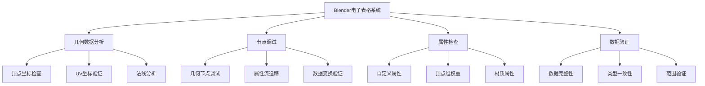
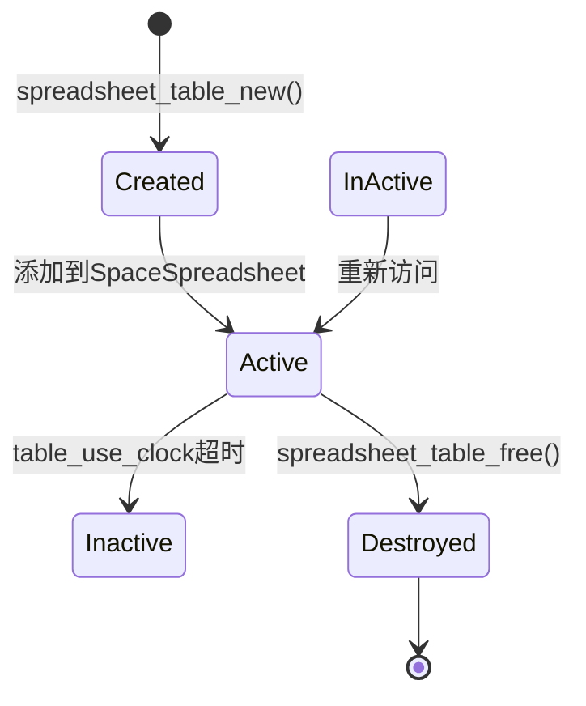
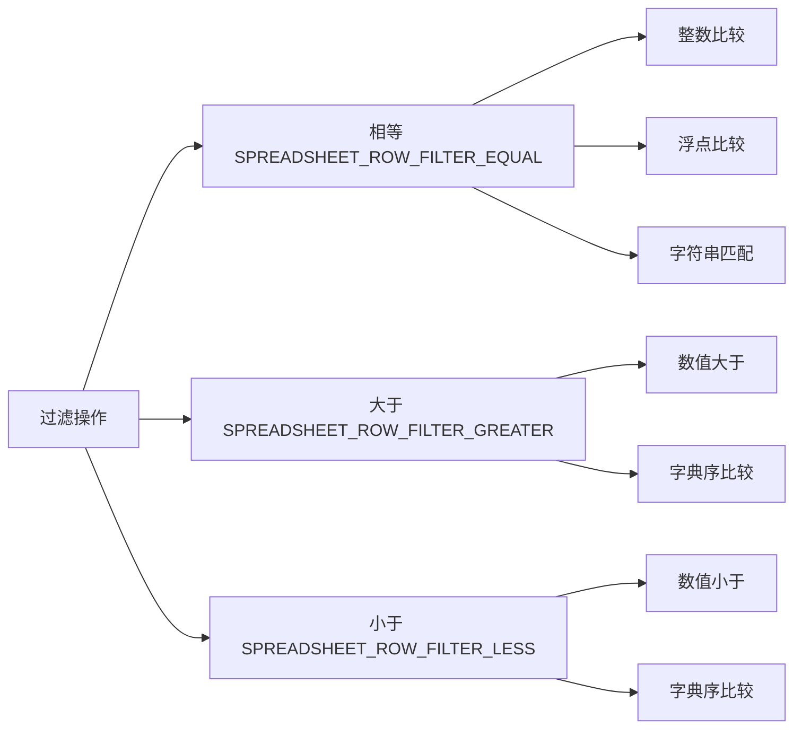
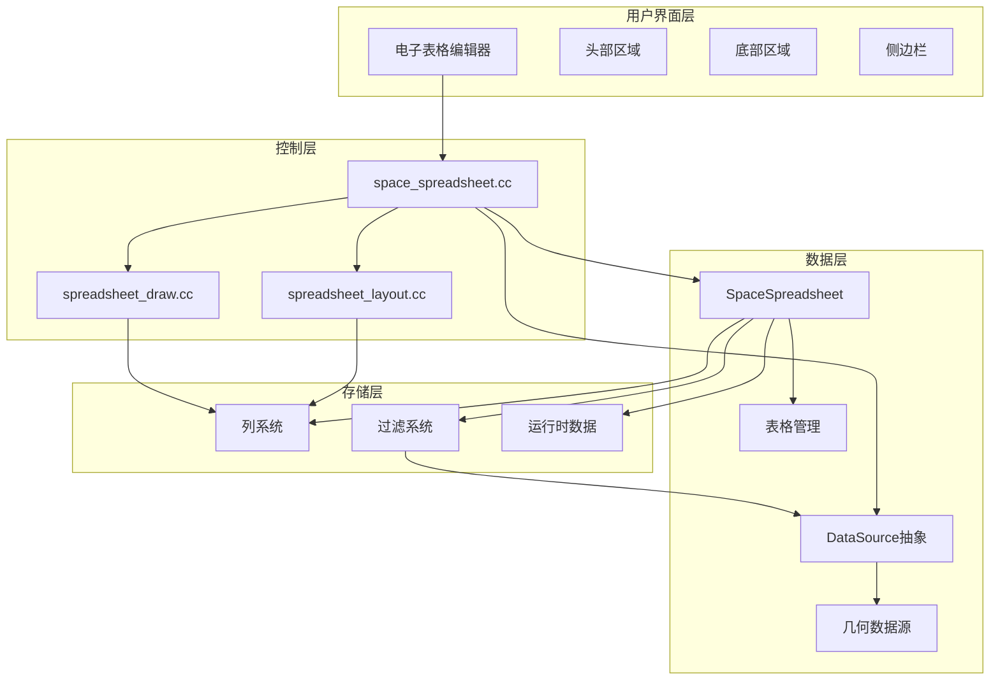
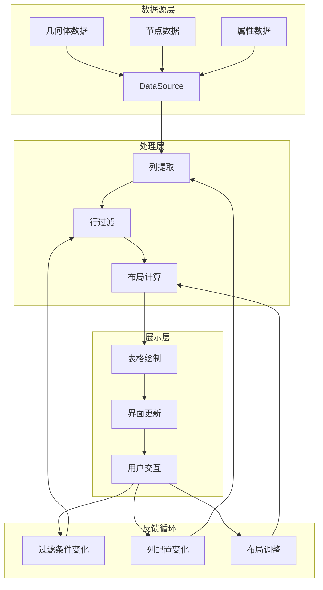
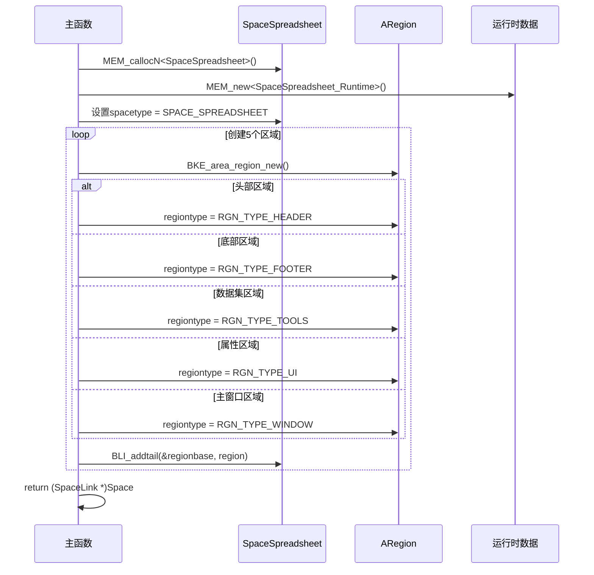
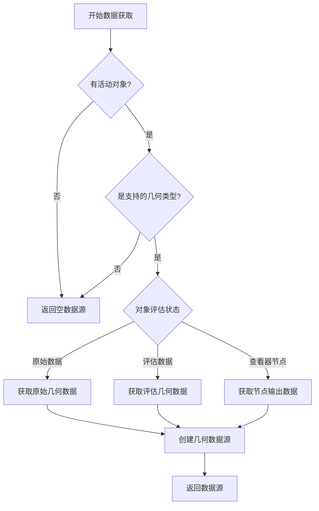

# Blender电子表格系统概览

## 目录
- [1. 系统概述](#1-系统概述)
- [2. 核心数据结构](#2-核心数据结构)
  - [2.1. SpaceSpreadsheet 主空间结构](#21-spacespreadsheet-主空间结构)
  - [2.2. DataSource 数据源抽象](#22-datasource-数据源抽象)
  - [2.3. SpreadsheetTable 表格管理](#23-spreadsheettable-表格管理)
  - [2.4. SpreadsheetColumn 列系统](#24-spreadsheetcolumn-列系统)
  - [2.5. 行过滤系统](#25-行过滤系统)
- [3. 系统架构图](#3-系统架构图)
- [4. 核心流程分析](#4-核心流程分析)
  - [4.1. 电子表格创建流程](#41-电子表格创建流程)
  - [4.2. 数据获取与显示流程](#42-数据获取与显示流程)
  - [4.3. 过滤处理流程](#43-过滤处理流程)
- [5. 关键文件解析](#5-关键文件解析)
  - [5.1. space_spreadsheet.cc 主控制器](#51-space_spreadsheetcc-主控制器)
  - [5.2. spreadsheet_data_source.cc 数据源实现](#52-spreadsheet_data_sourcecc-数据源实现)
  - [5.3. spreadsheet_layout.cc 布局管理](#53-spreadsheet_layoutcc-布局管理)
- [6. 内存管理与性能优化](#6-内存管理与性能优化)
  - [6.1. 内存分配策略](#61-内存分配策略)
  - [6.2. 垃圾回收机制](#62-垃圾回收机制)
  - [6.3. 缓存优化](#63-缓存优化)
- [7. 扩展机制](#7-扩展机制)
  - [7.1. 自定义数据源](#71-自定义数据源)
  - [7.2. 自定义列类型](#72-自定义列类型)
- [8. 常见问题与调试](#8-常见问题与调试)
  - [8.1. 数据源为空](#81-数据源为空)
  - [8.2. 性能问题](#82-性能问题)
  - [8.3. 内存泄漏](#83-内存泄漏)

---

## 1. 系统概述

<span style="background-color:#e8f5e8; color:#2d5016;">**Blender电子表格系统**</span>是Blender中用于<span style="color:#1a73e8;">**几何数据检查和分析**</span>的强大工具。该系统提供了一个类似电子表格的界面，允许用户<span style="background-color:#fef7e0; color:#856404;">**实时查看和编辑**</span>几何体的属性数据，包括顶点、边、面等元素的详细信息。

### 1.1 系统定位

<span style="color:#d93025;">**设计目标**</span>：
- <span style="background-color:#fce8e6; color:#c5221f;">提供直观的数据可视化界面</span>
- <span style="background-color:#e6f4ea; color:#137333;">支持几何节点的调试</span>
- <span style="background-color:#fef3c7; color:#ea8600;">实时数据更新与同步</span>
- <span style="background-color:#f3e8fd; color:#9333ea;">灵活的数据过滤和排序</span>

### 1.2 应用场景



---

## 2. 核心数据结构

### 2.1. SpaceSpreadsheet 主空间结构

<span style="background-color:#f0f7ff; color:#185abc;">**SpaceSpreadsheet**</span>是电子表格编辑器的<span style="color:#c5221f;">**核心数据结构**</span>，定义在 `DNA_space_types.h:1218-1254`。

```cpp
typedef struct SpaceSpreadsheet {
    SpaceLink *next, *prev;
    ListBase regionbase;
    char spacetype;
    char link_flag;
    char _pad0[6];
    
    /** 表格数组和持久化状态 */
    SpreadsheetTable **tables;
    int num_tables;
    char _pad1[3];
    
    /** 过滤器标志 */
    uint8_t filter_flag;
    
    /** 行过滤器列表 */
    ListBase row_filters;
    
    /** 当前活动的几何数据ID */
    SpreadsheetTableIDGeometry geometry_id;
    
    /** 空间标志位 */
    uint32_t flag;
    
    /** 表格使用时钟，用于垃圾回收 */
    uint32_t table_use_clock;
    
    /** 活动查看器路径索引 */
    int active_viewer_path_index;
    char _pad2[4];
    
    /** 运行时数据 */
    SpaceSpreadsheet_Runtime *runtime;
} SpaceSpreadsheet;
```

#### 2.1.1. 关键字段解析

<span style="color:#9333ea;">**tables**</span>：动态数组，存储所有已创建的表格实例
- <span style="background-color:#f3e8fd; color:#9333ea;">类型</span>：`SpreadsheetTable**`
- <span style="background-color:#e8f5e8; color:#2d5016;">作用</span>：管理多个表格的生命周期
- <span style="background-color:#fef7e0; color:#856404;">访问模式</span>：通过 `geometry_id` 查找对应表格

<span style="color:#ea8600;">**row_filters**</span>：行过滤器链表
- <span style="background-color:#fef3c7; color:#ea8600;">类型</span>：`ListBase` (双向链表)
- <span style="background-color:#fce8e6; color:#c5221f;">用途</span>：实现复杂的数据过滤条件
- <span style="background-color:#e6f4ea; color:#137333;">扩展性</span>：支持多种数据类型的过滤

<span style="color:#1a73e8;">**geometry_id**</span>：几何数据标识符
- <span style="background-color:#f0f7ff; color:#185abc;">类型</span>：`SpreadsheetTableIDGeometry`
- <span style="color:#c5221f;">功能</span>：唯一标识当前显示的几何数据源
- <span style="background-color:#9333ea;">状态管理</span>：包含对象评估状态信息

### 2.2. DataSource 数据源抽象

<span style="background-color:#e6f4ea; color:#137333;">**DataSource**</span>是<span style="color:#d93025;">**数据提供者**</span>的抽象基类，定义在 `spreadsheet_data_source.hh:18-64`。

```cpp
class DataSource {
public:
    virtual ~DataSource();
    
    /** 遍历默认列ID */
    virtual void foreach_default_column_ids(
        FunctionRef<void(const SpreadsheetColumnID &, bool is_extra)> fn) const {}
    
    /** 获取指定列的值 */
    virtual std::unique_ptr<ColumnValues> get_column_values(
        const SpreadsheetColumnID &column_id) const { return {}; }
    
    /** 是否支持选择过滤 */
    virtual bool has_selection_filter() const { return false; }
    
    /** 获取总行数 */
    virtual int tot_rows() const { return 0; }
};
```

#### 2.2.1. 设计模式解析

<span style="color:#9333ea;">**策略模式 (Strategy Pattern)**</span>：
- <span style="background-color:#f3e8fd; color:#9333ea;">意图</span>：不同类型的数据源有不同的数据获取策略
- <span style="background-color:#e8f5e8; color:#2d5016;">实现</span>：通过虚函数实现多态调用
- <span style="background-color:#fef7e0; color:#856404;">优势</span>：易于扩展新的数据源类型

<span style="color:#ea8600;">**工厂模式 (Factory Pattern)**</span>：
- <span style="background-color:#fef3c7; color:#ea8600;">应用</span>：`get_data_source()` 函数根据上下文创建具体数据源
- <span style="background-color:#fce8e6; color:#c5221f;">作用</span>：隐藏具体数据源的创建细节
- <span style="background-color:#e6f4ea; color:#137333;">灵活性</span>：支持运行时数据源切换

### 2.3. SpreadsheetTable 表格管理

<span style="background-color:#f0f7ff; color:#185abc;">**SpreadsheetTable**</span>表示单个表格实例，包含列配置和运行时状态。

#### 2.3.1. 表格生命周期



#### 2.3.2. 列管理机制

<span style="color:#d93025;">**动态列系统**</span>：
- <span style="background-color:#fce8e6; color:#c5221f;">自动检测</span>：根据数据源自动添加新列
- <span style="background-color:#e6f4ea; color:#137333;">用户自定义</span>：支持用户手动添加/删除列
- <span style="background-color:#fef7e0; color:#856404;">垃圾回收</span>：自动清理长时间未使用的列

### 2.4. SpreadsheetColumn 列系统

<span style="background-color:#fef3c7; color:#ea8600;">**列系统**</span>是电子表格的<span style="color:#9333ea;">**核心展示单元**</span>，负责管理单列数据的显示和行为。

#### 2.4.1. 列数据结构

```cpp
typedef struct SpreadsheetColumn {
    SpreadsheetColumnID *id;
    float width;
    eSpreadsheetColumnValueType data_type;
    int flag;
    int last_used;
    SpreadsheetColumnRuntime *runtime;
} SpreadsheetColumn;
```

#### 2.4.2. 列类型系统

<span style="color:#1a73e8;">**支持的数据类型**</span>：
- `SPREADSHEET_VALUE_TYPE_BOOL`：布尔值
- `SPREADSHEET_VALUE_TYPE_INT32`：32位整数
- `SPREADSHEET_VALUE_TYPE_FLOAT`：浮点数
- `SPREADSHEET_VALUE_TYPE_FLOAT2`：2D向量
- `SPREADSHEET_VALUE_TYPE_FLOAT3`：3D向量
- `SPREADSHEET_VALUE_TYPE_COLOR`：颜色值

### 2.5. 行过滤系统

<span style="background-color:#e8f5e8; color:#2d5016;">**行过滤系统**</span>提供<span style="color:#d93025;">**强大的数据筛选能力**</span>，支持多种过滤条件。

#### 2.5.1. 过滤器结构

```cpp
typedef struct SpreadsheetRowFilter {
    struct SpreadsheetRowFilter *next, *prev;
    
    char column_name[64];
    uint8_t operation;        // eSpreadsheetFilterOperation
    uint8_t flag;            // eSpaceSpreadsheet_RowFilterFlag
    
    int value_int;
    int value_int2[2];
    int value_int3[3];
    char *value_string;
    float value_float;
    float threshold;
    float value_float2[2];
    float value_float3[3];
    float value_color[4];
} SpreadsheetRowFilter;
```

#### 2.5.2. 过滤操作类型



---

## 3. 系统架构图

### 3.1. 整体架构



### 3.2. 数据流架构



---

## 4. 核心流程分析

### 4.1. 电子表格创建流程

<span style="background-color:#f0f7ff; color:#185abc;">**创建流程**</span>从 `space_spreadsheet.cc:54-104` 的 `spreadsheet_create()` 函数开始。

#### 4.1.1. 区域初始化序列



#### 4.1.2. 关键初始化参数

<span style="color:#d93025;">**几何ID设置**</span>：
```cpp
spreadsheet_space->geometry_id.base.type = SPREADSHEET_TABLE_ID_TYPE_GEOMETRY;
```

<span style="color:#9333ea;">**过滤器标志**</span>：
```cpp
spreadsheet_space->filter_flag = SPREADSHEET_FILTER_ENABLE;
```

### 4.2. 数据获取与显示流程

<span style="background-color:#e6f4ea; color:#137333;">**主绘制流程**</span>在 `spreadsheet_main_region_draw()` 函数中实现。

#### 4.2.1. 数据获取阶段

**定义位置**: `space_spreadsheet.cc:431-521`

<span style="color:#ea8600;">**步骤分解**</span>：

1. <span style="background-color:#fef3c7; color:#ea8600;">上下文更新</span>：`spreadsheet_update_context(C)`
2. <span style="background-color:#fce8e6; color:#c5221f;">数据源获取</span>：`get_data_source(*C)`
3. <span style="background-color:#e8f5e8; color:#2d5016;">表格查找/创建</span>：`spreadsheet_table_find()` / `spreadsheet_table_new()`
4. <span style="background-color:#f0f7ff; color:#185abc;">列更新</span>：`update_visible_columns()`
5. <span style="background-color:#f3e8fd; color:#9333ea;">布局计算</span>：`spreadsheet_drawer_from_layout()`
6. <span style="background-color:#fef7e0; color:#856404;">绘制执行</span>：`draw_spreadsheet_in_region()`

#### 4.2.2. 数据源选择逻辑



### 4.3. 过滤处理流程

<span style="background-color:#fef7e0; color:#856404;">**过滤处理**</span>在 `spreadsheet_filter_rows()` 函数中实现。

#### 4.3.1. 过滤链处理

**定义位置**: `spreadsheet_row_filter.cc:14-18`

```cpp
IndexMask spreadsheet_filter_rows(const SpaceSpreadsheet &sspreadsheet,
                                  const SpreadsheetLayout &spreadsheet_layout,
                                  const DataSource &data_source,
                                  ResourceScope &scope)
```

#### 4.3.2. 过滤器应用流程


---

## 5. 关键文件解析

### 5.1. space_spreadsheet.cc 主控制器

<span style="background-color:#f0f7ff; color:#185abc;">**主控制器文件**</span>是电子表格系统的<span style="color:#d93025;">**核心协调者**</span>，负责整个系统的生命周期管理。

#### 5.1.1. 核心函数分析

<span style="color:#9333ea;">**spreadsheet_create()**</span> `space_spreadsheet.cc:54-104`
- <span style="background-color:#f3e8fd; color:#9333ea;">职责</span>：创建并初始化电子表格空间
- <span style="background-color:#e8f5e8; color:#2d5016;">关键操作</span>：内存分配、区域创建、默认配置
- <span style="background-color:#fef7e0; color:#856404;">返回值</span>：`SpaceLink*` 指针

<span style="color:#ea8600;">**spreadsheet_main_region_draw()**</span> `space_spreadsheet.cc:431-521`
- <span style="background-color:#fef3c7; color:#ea8600;">职责</span>：主区域绘制逻辑
- <span style="background-color:#fce8e6; color:#c5221f;">调用频率</span>：每帧刷新时调用
- <span style="background-color:#e6f4ea; color:#137333;">性能影响</span>：关键性能路径

<span style="color:#1a73e8;">**get_data_source()**</span> `space_spreadsheet.cc:336-346`
- <span style="background-color:#f0f7ff; color:#185abc;">职责</span>：根据上下文创建数据源
- <span style="background-color:#c5221f;">策略</span>：工厂模式创建具体数据源
- <span style="background-color:#9333ea;">扩展点</span>：支持新数据源类型

#### 5.1.2. 事件处理机制

<span style="color:#d93025;">**监听器系统**</span>：
```cpp
static void spreadsheet_main_region_listener(const wmRegionListenerParams *params)
```

<span style="background-color:#e8f5e8; color:#2d5016;">**支持的通知类型**</span>：
- `NC_SCENE`：场景变化（模式切换、帧变化、活动对象）
- `NC_OBJECT`：对象变化
- `NC_SPACE`：空间特定变化
- `NC_GEOM`：几何数据变化
- `NC_GPENCIL`：Grease Pencil变化
- `NC_VIEWER_PATH`：查看器路径变化

### 5.2. spreadsheet_data_source.cc 数据源实现

<span style="background-color:#e6f4ea; color:#137333;">**数据源实现**</span>提供了<span style="color:#ea8600;">**具体的数据访问逻辑**</span>。

#### 5.2.1. 几何数据源

**定义位置**: `spreadsheet_data_source_geometry.cc`

<span style="color:#9333ea;">**核心功能**</span>：
- <span style="background-color:#f3e8fd; color:#9333ea;">顶点数据提取</span>：位置、法线、UV等
- <span style="background-color:#e8f5e8; color:#2d5016;">边数据提取</span>：顶点索引、边权重等
- <span style="background-color:#fef7e0; color:#856404;">面数据提取</span>：材质索引、平滑组等
- <span style="background-color:#fce8e6; color:#c5221f;">属性数据提取</span>：自定义属性、顶点组等

#### 5.2.2. 列值提供者

<span style="background-color:#f0f7ff; color:#185abc;">**ColumnValues**</span>是列数据的具体提供者：

```cpp
class ColumnValues {
public:
    virtual ~ColumnValues() = default;
    virtual eSpreadsheetColumnValueType type() const = 0;
    virtual int tot_rows() const = 0;
    virtual void get(int row_index, CellularContainer &r_cell) const = 0;
    virtual std::string name() const = 0;
    virtual int fit_column_width_px(int min_width) const;
};
```

### 5.3. spreadsheet_layout.cc 布局管理

<span style="background-color:#fef3c7; color:#ea8600;">**布局管理**</span>负责<span style="color:#d93025;">**表格的视觉布局计算**</span>。

#### 5.3.1. 布局数据结构

**定义位置**: `spreadsheet_layout.hh:12-23`

```cpp
struct ColumnLayout {
    const ColumnValues *values;
    int width;
};

struct SpreadsheetLayout {
    Vector<ColumnLayout> columns;
    IndexMask row_indices;
    int index_column_width = 100;
};
```

#### 5.3.2. 列宽计算算法

<span style="color:#1a73e8;">**自适应宽度算法**</span>：
```cpp
const int width_in_pixels = values->fit_column_width_px(100) / SPREADSHEET_WIDTH_UNIT;
```

<span style="background-color:#f0f7ff; color:#185abc;">**计算策略**</span>：
1. <span style="background-color:#e6f4ea; color:#137333;">内容分析</span>：扫描所有行的内容
2. <span style="background-color:#fef7e0; color:#856404;">宽度估算</span>：基于字符数和字体度量
3. <span style="background-color:#f3e8fd; color:#9333ea;">最小宽度保证</span>：确保基本可读性
4. <span style="background-color:#fce8e6; color:#c5221f;">单位转换</span>：像素到界面单位转换

---

## 6. 内存管理与性能优化

### 6.1. 内存分配策略

<span style="background-color:#e8f5e8; color:#2d5016;">**Blender内存管理**</span>使用<span style="color:#d93025;">** guardedalloc **</span>系统，提供<span style="color:#9333ea;">**内存保护和调试**</span>功能。

#### 6.1.1. 内存分配函数

<span style="color:#ea8600;">**核心分配函数**</span>：
- `MEM_callocN<T>()`：零初始化分配
- `MEM_mallocN<T>()`：普通分配
- `MEM_new<T>()`：对象构造分配
- `MEM_dupallocN()`：内存复制分配

#### 6.1.2. 内存释放策略

<span style="background-color:#f0f7ff; color:#185abc;">**释放时机**</span>：
```cpp
static void spreadsheet_free(SpaceLink *sl) {
    SpaceSpreadsheet *sspreadsheet = (SpaceSpreadsheet *)sl;
    
    // 释放运行时数据
    MEM_delete(sspreadsheet->runtime);
    
    // 释放行过滤器
    LISTBASE_FOREACH_MUTABLE (SpreadsheetRowFilter *, row_filter, &sspreadsheet->row_filters) {
        spreadsheet_row_filter_free(row_filter);
    }
    
    // 释放表格
    for (const int i : IndexRange(sspreadsheet->num_tables)) {
        spreadsheet_table_free(sspreadsheet->tables[i]);
    }
    MEM_SAFE_FREE(sspreadsheet->tables);
}
```

### 6.2. 垃圾回收机制

<span style="background-color:#fef7e0; color:#856404;">**垃圾回收**</span>通过<span style="color:#c5221f;">**时钟机制**</span>实现，自动清理长期未使用的资源。

#### 6.2.1. 表格垃圾回收

<span style="color:#1a73e8;">**回收触发条件**</span>：
- 表格数量超过阈值
- 表格长时间未访问
- 内存使用压力过高

<span style="background-color:#f3e8fd; color:#9333ea;">**时钟更新机制**</span>：
```cpp
// 更新最后使用时间
if (table->last_used < sspreadsheet->table_use_clock || sspreadsheet->table_use_clock == 0) {
    sspreadsheet->table_use_clock++;
    // 处理时钟溢出
    if (sspreadsheet->table_use_clock == 0) {
        for (SpreadsheetTable *table : Span(sspreadsheet->tables, sspreadsheet->num_tables)) {
            table->last_used = sspreadsheet->table_use_clock;
        }
    }
    table->last_used = sspreadsheet->table_use_clock;
}
```

#### 6.2.2. 列垃圾回收

<span style="background-color:#e6f4ea; color:#137333;">**列清理逻辑**</span>：
```cpp
// 更新列的最后使用时间
for (SpreadsheetColumn *column : new_columns) {
    const bool clock_was_reset = table.column_use_clock < column->last_used;
    if (clock_was_reset || column->is_available()) {
        column->last_used = table.column_use_clock;
    }
}

// 移除长期未使用的列
spreadsheet_table_remove_unused_columns(table);
```

### 6.3. 缓存优化

<span style="background-color:#fce8e6; color:#c5221f;">**缓存策略**</span>通过<span style="color:#9333ea;">**多层次缓存**</span>提升性能。

#### 6.3.1. 表格缓存

<span style="color:#ea8600;">**LRU缓存策略**</span>：
- <span style="background-color:#fef3c7; color:#ea8600;">最近最少使用</span>表格保留
- <span style="background-color:#e8f5e8; color:#2d5016;">表格移动到前端</span>：`spreadsheet_table_move_to_front()`
- <span style="background-color:#f0f7ff; color:#185abc;">容量限制</span>：避免内存无限增长

#### 6.3.2. 数据缓存

<span style="background-color:#fef7e0; color:#856404;">**数据预取策略**</span>：
- <span style="background-color:#e6f4ea; color:#137333;">批量数据获取</span>：减少函数调用开销
- <span style="background-color:#f3e8fd; color:#9333ea;">智能预估</span>：根据使用模式预加载数据
- <span style="background-color:#fce8e6; color:#c5221f;">惰性计算</span>：按需计算复杂属性

---

## 7. 扩展机制

### 7.1. 自定义数据源

<span style="background-color:#f0f7ff; color:#185abc;">**自定义数据源**</span>通过<span style="color:#d93025;">**继承DataSource类**</span>实现。

#### 7.1.1. 扩展步骤

<span style="color:#9333ea;">**1. 创建数据源类**</span>：
```cpp
class CustomDataSource : public DataSource {
public:
    CustomDataSource(const CustomData &data) : data_(data) {}
    
    void foreach_default_column_ids(FunctionRef<void(const SpreadsheetColumnID &, bool)> fn) const override {
        // 添加自定义列
    }
    
    std::unique_ptr<ColumnValues> get_column_values(const SpreadsheetColumnID &column_id) const override {
        // 返回列数据
    }
    
    int tot_rows() const override {
        return data_.size();
    }
    
private:
    const CustomData &data_;
};
```

<span style="color:#ea8600;">**2. 注册数据源工厂**</span>：
```cpp
std::unique_ptr<DataSource> get_custom_data_source(const bContext &C) {
    // 检查上下文
    if (/* 自定义条件 */) {
        return std::make_unique<CustomDataSource>(custom_data);
    }
    return {};
}
```

### 7.2. 自定义列类型

<span style="background-color:#e6f4ea; color:#137333;">**自定义列类型**</span>通过<span style="color:#c5221f;">**扩展ColumnValues**</span>实现。

#### 7.2.1. 列类型扩展

<span style="color:#1a73e8;">**复杂列类型示例**</span>：
```cpp
class Matrix4ColumnValues : public ColumnValues {
public:
    eSpreadsheetColumnValueType type() const override {
        return SPREADSHEET_VALUE_TYPE_FLOAT3; // 简化为显示前3行
    }
    
    void get(int row_index, CellularContainer &r_cell) const override {
        const float4x4 &matrix = matrices_[row_index];
        // 格式化矩阵数据
        r_cell.string_value = format_matrix(matrix);
    }
    
    std::string name() const override {
        return "Transform Matrix";
    }
    
private:
    Span<float4x4> matrices_;
};
```

---

## 8. 常见问题与调试

### 8.1. 数据源为空

<span style="background-color:#fce8e6; color:#c5221f;">**问题现象**</span>：电子表格显示空白或"无数据"

#### 8.1.1. 调试步骤

<span style="color:#d93025;">**1. 检查活动对象**</span>：
```cpp
Object *active_object = CTX_data_active_object(C);
if (active_object == nullptr) {
    printf("Error: No active object\n");
    return;
}
```

<span style="color:#9333ea;">**2. 验证对象类型**</span>：
```cpp
if (!ELEM(object_orig->type,
          OB_MESH, OB_POINTCLOUD, OB_VOLUME,
          OB_CURVES_LEGACY, OB_FONT, OB_CURVES, OB_GREASE_PENCIL)) {
    printf("Error: Unsupported object type: %d\n", object_orig->type);
    return nullptr;
}
```

<span style="color:#ea8600;">**3. 检查评估状态**</span>：
```cpp
Object *object_eval = DEG_get_evaluated(depsgraph, object_orig);
if (object_eval == nullptr) {
    printf("Error: Failed to get evaluated object\n");
    return nullptr;
}
```

### 8.2. 性能问题

<span style="background-color:#fef7e0; color:#856404;">**问题现象**</span>：大型网格的电子表格响应缓慢

#### 8.2.1. 性能优化策略

<span style="color:#1a73e8;">**1. 数据分页**</span>：
```cpp
// 只显示可见行
IndexMask visible_rows = compute_visible_rows(total_rows, viewport_height);
```

<span style="color:#e8f5e8; color:#2d5016;">**2. 惰性加载**</span>：
```cpp
// 按需加载列数据
std::unique_ptr<ColumnValues> values = data_source.get_column_values(*column->id);
if (!values) {
    continue; // 跳过不可用列
}
```

<span style="color:#f0f7ff; color:#185abc;">**3. 缓存优化**</span>：
```cpp
// 缓存计算结果
if (column->width <= 0.0f || column_type_changed) {
    column->width = values->fit_column_width_px(100) / SPREADSHEET_WIDTH_UNIT;
}
```

### 8.3. 内存泄漏

<span style="background-color:#f3e8fd; color:#9333ea;">**问题现象**</span>：长时间使用后内存持续增长

#### 8.3.1. 内存泄漏检查

<span style="color:#d93025;">**1. 使用Blender内存调试**</span>：
```bash
# 启用内存调试
blender --debug-memory
```

<span style="color:#9333ea;">**2. 检查释放逻辑**</span>：
```cpp
// 确保所有分配的内存都被释放
void spreadsheet_column_free(SpreadsheetColumn *column) {
    if (!column) return;
    
    spreadsheet_column_id_free(column->id);
    MEM_delete(column->runtime);
    MEM_freeN(column);
}
```

<span style="color:#ea8600;">**3. 验证RAII使用**</span>：
```cpp
// 使用智能指针管理资源
std::unique_ptr<DataSource> data_source = get_data_source(*C);
// 自动释放，无需手动delete
```

---

## 总结

<span style="background-color:#e8f5e8; color:#2d5016;">**Blender电子表格系统**</span>是一个<span style="color:#d93025;">**高度模块化**</span>和<span style="color:#9333ea;">**可扩展**</span>的数据分析工具，通过<span style="background-color:#fef7e0; color:#856404;">**分层架构设计**</span>实现了<span style="color:#1a73e8;">**灵活的数据处理**</span>和<span style="color:#ea8600;">**高效的渲染性能**</span>。

### 核心优势

1. <span style="background-color:#f0f7ff; color:#185abc;">**模块化设计**</span>：各组件职责清晰，易于维护和扩展
2. <span style="background-color:#e6f4ea; color:#137333;">**性能优化**</span>：通过缓存、垃圾回收等机制保证响应速度
3. <span style="background-color:#f3e8fd; color:#9333ea;">**内存安全**</span>：使用guardedalloc和RAII模式避免内存问题
4. <span style="background-color:#fce8e6; color:#c5221f;">**扩展性强**</span>：支持自定义数据源和列类型

### 学习建议

对于<span style="color:#2d5016;">**C++基础薄弱**</span>的学习者：

1. <span style="background-color:#fef7e0; color:#856404;">**从接口开始**</span>：先理解DataSource和ColumnValues的虚函数接口
2. <span style="background-color:#e8f5e8; color:#2d5016;">**逐步深入**</span>：从简单的数据流开始，逐步了解复杂的过滤和布局逻辑
3. <span style="background-color:#f0f7ff; color:#185abc;">**实践驱动**</span>：通过添加自定义数据源来加深理解
4. <span style="background-color:#f3e8fd; color:#9333ea;">**关注模式**</span>：重点关注工厂模式、策略模式等设计模式的应用

通过本文档的<span style="background-color:#e6f4ea; color:#137333;">**系统性介绍**</span>，读者应该能够理解Blender电子表格系统的<span style="color:#d93025;">**核心架构**</span>和<span style="color:#9333ea;">**工作原理**</span>，为后续的<span style="color:#ea8600;">**功能扩展**</span>和<span style="color:#1a73e8;">**问题调试**</span>打下坚实基础。