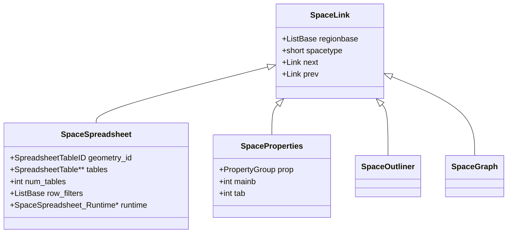
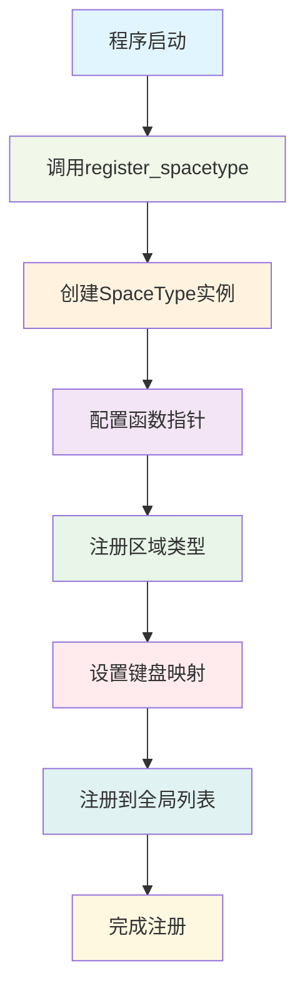
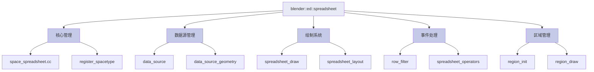
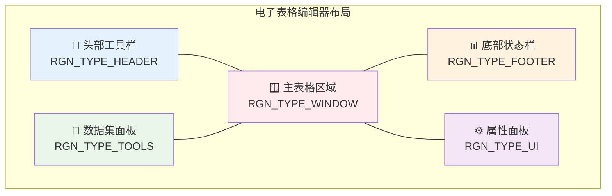
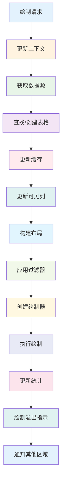

# <center><span style="background: linear-gradient(45deg, #4CAF50, #45a049); color: white; padding: 15px 30px; border-radius: 10px; font-size: 2em; font-weight: bold;">🔬 核心空间实现详解</span></center>

---

## <span style="background-color: #2196F3; color: white; padding: 5px 10px; border-radius: 5px;">📋 目录</span>

1. [SpaceSpreadsheet核心结构详解](#spacespreadsheet核心结构详解)
2. [SpaceLink继承体系分析](#spacelink继承体系分析)  
3. [ED_spreadsheet_命名空间功能](#ed_spreadsheet_命名空间功能)
4. [区域管理系统](#区域管理系统)
5. [数据源与表格管理](#数据源与表格管理)
6. [事件处理与监听机制](#事件处理与监听机制)
7. [绘制系统架构](#绘制系统架构)
8. [内存管理与生命周期](#内存管理与生命周期)

---

## <span style="background-color: #FF5722; color: white; padding: 10px 20px; border-radius: 8px;">🏗️ SpaceSpreadsheet核心结构详解</span>

### <span style="color: #9C27B0; font-weight: bold;">1.1 什么是SpaceSpreadsheet？</span>

<span style="background-color: #E3F2FD; padding: 8px; border-radius: 5px; display: inline-block;">**SpaceSpreadsheet**</span> 是Blender中<span style="color: #D32F2F; font-weight: bold;">电子表格编辑器</span>的核心数据结构，它继承自基础的`SpaceLink`类，专门用于管理和显示几何体数据的表格视图。

```cpp
// 在 DNA_space_types.h 中定义
typedef struct SpaceSpreadsheet {
  SpaceLink base;                    // 🔗 基础空间链接
  ListBase regionbase;              // 📋 区域列表（头部、底部、主区域等）
  short spacetype;                  // 🏷️ 空间类型：SPACE_SPREADSHEET
  
  // 🎯 几何体标识符
  SpreadsheetTableID geometry_id;   // 📍 当前显示的几何体ID
  
  // 📊 表格管理
  SpreadsheetTable **tables;       // 📚 表格指针数组
  int num_tables;                   // 🔢 表格数量
  int table_use_clock;              // ⏰ 表格使用时钟（用于LRU缓存）
  
  // 🔍 行过滤器
  ListBase row_filters;             // 🎛️ 行过滤器列表
  int filter_flag;                  // 🚩 过滤器标志
  
  // ⚙️ 配置标志
  int flag;                         // 🏳️ 各种配置标志（如固定模式）
  
  // 🏃 运行时数据
  struct SpaceSpreadsheet_Runtime *runtime;  // 💾 运行时状态
} SpaceSpreadsheet;
```

### <span style="color: #9C27B0; font-weight: bold;">1.2 SpaceSpreadsheet_Runtime运行时结构</span>

<span style="background-color: #FFF3E0; padding: 8px; border-radius: 5px; display: inline-block;">**运行时数据**</span> 不被保存到文件，仅在程序运行期间存在：

```cpp
struct SpaceSpreadsheet_Runtime {
  int visible_rows = 0;             // 👁️ 当前可见行数
  int tot_rows = 0;                 // 📊 总行数
  int tot_columns = 0;              // 📋 总列数
  int top_row_height = 0;           // 📏 顶部行高度
  int left_column_width = 0;        // 📐 左列宽度
  
  // 🔄 列重排序可视化数据
  std::optional<ReorderColumnVisualizationData> reorder_column_visualization_data;
};
```

### <span style="color: #9C27B0; font-weight: bold;">1.3 核心功能枚举</span>

```cpp
// 🔍 对象评估状态
typedef enum eSpaceSpreadsheet_ObjectEvalState {
  SPREADSHEET_OBJECT_EVAL_STATE_ORIGINAL = 0,    // 📄 原始数据
  SPREADSHEET_OBJECT_EVAL_STATE_EVALUATED = 1,   // ⚡ 评估后数据  
  SPREADSHEET_OBJECT_EVAL_STATE_VIEWER_NODE = 2  // 👁️ 查看器节点数据
} eSpaceSpreadsheet_ObjectEvalState;

// 🚩 过滤器标志
#define SPREADSHEET_FILTER_ENABLE (1 << 0)  // ✅ 启用过滤器

// 🏳️ 空间标志
#define SPREADSHEET_FLAG_PINNED (1 << 0)     // 📌 固定模式
```

---

## <span style="background-color: #FF5722; color: white; padding: 10px 20px; border-radius: 8px;">🔗 SpaceLink继承体系分析</span>

### <span style="color: #9C27B0; font-weight: bold;">2.1 什么是SpaceLink？</span>

<span style="background-color: #E8F5E8; padding: 8px; border-radius: 5px; display: inline-block;">**SpaceLink**</span> 是Blender所有编辑器空间的<span style="color: #2E7D32; font-weight: bold;">基础抽象类</span>，定义了编辑器的基本接口和生命周期管理。



### <span style="color: #9C27B0; font-weight: bold;">2.2 SpaceLink核心成员</span>

```cpp
typedef struct SpaceLink {
  struct SpaceLink *next, *prev;     // 🔗 链表指针
  ListBase regionbase;              // 📋 编辑器区域列表
  short spacetype;                  // 🏷️ 空间类型标识
} SpaceLink;
```

### <span style="color: #9C27B0; font-weight: bold;">2.3 空间类型注册系统</span>

Blender使用<span style="background-color: #F3E5F5; padding: 5px; border-radius: 3px;">**SpaceType**</span>结构注册每种编辑器类型：

```cpp
typedef struct SpaceType {
  int spaceid;                      // 🆔 空间ID
  char name[64];                    // 📝 空间名称
  
  // 🏭 生命周期函数
  SpaceLink *(*create)(const ScrArea *area, const Scene *scene);
  void (*free)(SpaceLink *sl);
  void (*init)(wmWindowManager *wm, ScrArea *area);
  SpaceLink *(*duplicate)(SpaceLink *sl);
  
  // 📋 区域类型列表
  ListBase regiontypes;
  
  // 🎹 键盘映射
  void (*keymap)(wmKeyConfig *keyconf);
  
  // 📡 通知系统
  void (*listener)(const wmNotifier *wmn);
  
  // 💾 文件操作
  void (*blend_read_data)(BlendDataReader *reader, SpaceLink *sl);
  void (*blend_write)(BlendWriter *writer, SpaceLink *sl);
} SpaceType;
```

### <span style="color: #9C27B0; font-weight: bold;">2.4 注册流程详解</span>



---

## <span style="background-color: #FF5722; color: white; padding: 10px 20px; border-radius: 8px;">🧩 ED_spreadsheet_命名空间功能</span>

### <span style="color: #9C27B0; font-weight: bold;">3.1 ED前缀含义</span>

<span style="background-color: #FFE0B2; padding: 8px; border-radius: 5px; display: inline-block;">**ED_**</span> 前缀表示<span style="color: #E65100; font-weight: bold;">Editor（编辑器）</span>模块，是Blender编辑器系统的核心组件：

- **ED** = <span style="color: #FF6F00;">E</span>ditor + <span style="color: #FF6F00;">D</span>ata（编辑器数据）
- 属于`source/blender/editors/`模块
- 提供编辑器的<span style="color: #F57C00;">通用接口</span>和<span style="color: #F57C00;">核心功能</span>

### <span style="color: #9C27B0; font-weight: bold;">3.2 ED_spreadsheet_核心函数分类</span>

#### <span style="color: #1976D2; font-weight: bold;">🏗️ 创建与销毁函数</span>

```cpp
// 🆕 创建新的电子表格空间
static SpaceLink *spreadsheet_create(const ScrArea *area, const Scene *scene);

// 🗑️ 释放电子表格空间资源  
static void spreadsheet_free(SpaceLink *sl);

// 🔄 复制电子表格空间
static SpaceLink *spreadsheet_duplicate(SpaceLink *sl);
```

#### <span style="color: #1976D2; font-weight: bold;">📊 数据获取函数</span>

```cpp
// 🎯 获取当前数据源
std::unique_ptr<DataSource> get_data_source(const bContext &C);

// 📍 获取活动表格ID
const SpreadsheetTableID *get_active_table_id(const SpaceSpreadsheet &sspreadsheet);

// 📋 获取活动表格
SpreadsheetTable *get_active_table(SpaceSpreadsheet &sspreadsheet);

// 🆔 获取当前关联的ID
ID *get_current_id(const SpaceSpreadsheet *sspreadsheet);
```

#### <span style="color: #1976D2; font-weight: bold;">🔧 工具函数</span>

```cpp
// ⚡ 获取评估后的对象
Object *spreadsheet_get_object_eval(const SpaceSpreadsheet *sspreadsheet,
                                   const Depsgraph *depsgraph);

// 🔄 更新上下文信息
static void spreadsheet_update_context(const bContext *C);

// 📡 ID重映射
static void spreadsheet_id_remap(ScrArea *area, SpaceLink *slink,
                                 const blender::bke::id::IDRemapper &mappings);
```

### <span style="color: #9C27B0; font-weight: bold;">3.3 命名空间组织结构</span>



---

## <span style="background-color: #FF5722; color: white; padding: 10px 20px; border-radius: 8px;">🗺️ 区域管理系统</span>

### <span style="color: #9C27B0; font-weight: bold;">4.1 区域类型定义</span>

Blender电子表格编辑器包含<span style="background-color: #E0F7FA; padding: 8px; border-radius: 5px; display: inline-block;">**5个主要区域**</span>：

| 区域类型 | 标识符 | 用途 | 位置 |
|---------|--------|------|------|
| <span style="color: #1565C0;">**主窗口**</span> | `RGN_TYPE_WINDOW` | 表格数据显示 | 中央 |
| <span style="color: #2E7D32;">**头部**</span> | `RGN_TYPE_HEADER` | 工具栏 | 顶部/底部 |
| <span style="color: #6A1B9A;">**底部**</span> | `RGN_TYPE_FOOTER` | 状态信息 | 底部/顶部 |
| <span style="color: #C62828;">**数据集**</span> | `RGN_TYPE_TOOLS` | 数据源选择 | 左侧 |
| <span style="color: #EF6C00;">**侧边栏**</span> | `RGN_TYPE_UI` | 过滤器面板 | 右侧 |

### <span style="color: #9C27B0; font-weight: bold;">4.2 区域创建流程</span>

```cpp
static SpaceLink *spreadsheet_create(const ScrArea * /*area*/, const Scene * /*scene*/)
{
  SpaceSpreadsheet *spreadsheet_space = MEM_callocN<SpaceSpreadsheet>("spreadsheet space");
  spreadsheet_space->runtime = MEM_new<SpaceSpreadsheet_Runtime>(__func__);
  spreadsheet_space->spacetype = SPACE_SPREADSHEET;

  // 🏷️ 头部区域
  {
    ARegion *region = BKE_area_region_new();
    BLI_addtail(&spreadsheet_space->regionbase, region);
    region->regiontype = RGN_TYPE_HEADER;
    region->alignment = (U.uiflag & USER_HEADER_BOTTOM) ? RGN_ALIGN_BOTTOM : RGN_ALIGN_TOP;
  }

  // 📊 底部区域
  {
    ARegion *region = BKE_area_region_new();
    BLI_addtail(&spreadsheet_space->regionbase, region);
    region->regiontype = RGN_TYPE_FOOTER;
    region->alignment = (U.uiflag & USER_HEADER_BOTTOM) ? RGN_ALIGN_TOP : RGN_ALIGN_BOTTOM;
  }

  // 🎯 数据集区域
  {
    ARegion *region = BKE_area_region_new();
    BLI_addtail(&spreadsheet_space->regionbase, region);
    region->regiontype = RGN_TYPE_TOOLS;
    region->alignment = RGN_ALIGN_LEFT;
  }

  // ⚙️ 属性区域
  {
    ARegion *region = BKE_area_region_new();
    BLI_addtail(&spreadsheet_space->regionbase, region);
    region->regiontype = RGN_TYPE_UI;
    region->alignment = RGN_ALIGN_RIGHT;
    region->flag = RGN_FLAG_HIDDEN;  // 默认隐藏
  }

  // 🪟 主窗口区域
  {
    ARegion *region = BKE_area_region_new();
    BLI_addtail(&spreadsheet_space->regionbase, region);
    region->regiontype = RGN_TYPE_WINDOW;
  }

  return (SpaceLink *)spreadsheet_space;
}
```

### <span style="color: #9C27B0; font-weight: bold;">4.3 区域初始化详解</span>

#### <span style="color: #1976D2; font-weight: bold;">主窗口区域初始化</span>

```cpp
static void spreadsheet_main_region_init(wmWindowManager *wm, ARegion *region)
{
  // 📐 2D视图配置
  region->v2d.scroll = V2D_SCROLL_RIGHT | V2D_SCROLL_BOTTOM | 
                       V2D_SCROLL_VERTICAL_HIDE | V2D_SCROLL_HORIZONTAL_HIDE;
  region->v2d.align = V2D_ALIGN_NO_NEG_X | V2D_ALIGN_NO_POS_Y;
  region->v2d.keepzoom = V2D_LOCKZOOM_X | V2D_LOCKZOOM_Y | V2D_LIMITZOOM | V2D_KEEPASPECT;
  region->v2d.keeptot = V2D_KEEPTOT_STRICT;
  region->v2d.minzoom = region->v2d.maxzoom = 1.0f;  // 锁定缩放

  // 🖼️ 2D视图重新初始化
  view2d_region_reinit(&region->v2d, ui::V2D_COMMONVIEW_LIST, region->winx, region->winy);

  // 🚩 设置溢出指示标志
  region->flag |= RGN_FLAG_INDICATE_OVERFLOW;

  // ⌨️ 键盘映射
  {
    wmKeyMap *keymap = WM_keymap_ensure(
        wm->runtime->defaultconf, "View2D Buttons List", SPACE_EMPTY, RGN_TYPE_WINDOW);
    WM_event_add_keymap_handler(&region->runtime->handlers, keymap);
  }
  {
    wmKeyMap *keymap = WM_keymap_ensure(
        wm->runtime->defaultconf, "Spreadsheet Generic", SPACE_SPREADSHEET, RGN_TYPE_WINDOW);
    WM_event_add_keymap_handler(&region->runtime->handlers, keymap);
  }
}
```

### <span style="color: #9C27B0; font-weight: bold;">4.4 区域布局示意</span>



---

## <span style="background-color: #FF5722; color: white; padding: 10px 20px; border-radius: 8px;">💾 数据源与表格管理</span>

### <span style="color: #9C27B0; font-weight: bold;">5.1 数据源抽象层</span>

<span style="background-color: #F1F8E9; padding: 8px; border-radius: 5px; display: inline-block;">**DataSource**</span> 是数据源的<span style="color: #558B2F; font-weight: bold;">抽象基类</span>，定义了获取表格数据的统一接口：

```cpp
class DataSource {
public:
  virtual ~DataSource() = default;
  
  // 📊 获取总行数
  virtual int tot_rows() const = 0;
  
  // 📋 遍历默认列ID
  virtual void foreach_default_column_ids(FunctionRef<void(const SpreadsheetColumnID &, bool)> fn) const = 0;
  
  // 🎯 获取列值
  virtual std::unique_ptr<ColumnValues> get_column_values(const SpreadsheetColumnID &column_id) const = 0;
};
```

### <span style="color: #9C27B0; font-weight: bold;">5.2 几何体数据源实现</span>

<span style="background-color: #E8F5E8; padding: 8px; border-radius: 5px; display: inline-block;">**几何体数据源**</span> 是最常用的数据源实现：

```cpp
std::unique_ptr<DataSource> get_data_source(const bContext &C)
{
  Depsgraph *depsgraph = CTX_data_depsgraph_pointer(&C);
  SpaceSpreadsheet *sspreadsheet = CTX_wm_space_spreadsheet(&C);

  Object *object_eval = spreadsheet_get_object_eval(sspreadsheet, depsgraph);
  if (object_eval) {
    return data_source_from_geometry(&C, object_eval);
  }
  return {};
}
```

### <span style="color: #9C27B0; font-weight: bold;">5.3 表格管理系统</span>

#### <span style="color: #1976D2; font-weight: bold;">表格缓存机制</span>

```cpp
// 📋 表格结构定义
typedef struct SpreadsheetTable {
  SpreadsheetTableID *id;           // 🆔 表格唯一标识
  SpreadsheetColumn **columns;       // 📊 列指针数组
  int num_columns;                  // 🔢 列数量
  int column_use_clock;             // ⏰ 列使用时钟
  int last_used;                    // 🕐 最后使用时间
} SpreadsheetTable;

// 🔍 查找表格
SpreadsheetTable *spreadsheet_table_find(const SpaceSpreadsheet &sspreadsheet,
                                        const SpreadsheetTableID &table_id);

// 🆕 创建新表格
SpreadsheetTable *spreadsheet_table_new(SpreadsheetTableID *table_id);

// 📌 移动表格到前面
void spreadsheet_table_move_to_front(SpaceSpreadsheet &sspreadsheet, SpreadsheetTable &table);
```

#### <span style="color: #1976D2; font-weight: bold;">LRU缓存策略</span>

```cpp
// ⏰ 时钟机制实现LRU
if (table->last_used < sspreadsheet->table_use_clock || sspreadsheet->table_use_clock == 0) {
  sspreadsheet->table_use_clock++;
  // 处理时钟溢出
  if (sspreadsheet->table_use_clock == 0) {
    for (SpreadsheetTable *table : Span(sspreadsheet->tables, sspreadsheet->num_tables)) {
      table->last_used = sspreadsheet->table_use_clock;
    }
  }
  table->last_used = sspreadsheet->table_use_clock;
}
```

### <span style="color: #9C27B0; font-weight: bold;">5.4 列管理详解</span>

#### <span style="color: #1976D2; font-weight: bold;">列更新流程</span>

```cpp
static void update_visible_columns(SpreadsheetTable &table, DataSource &data_source)
{
  Set<std::reference_wrapper<const SpreadsheetColumnID>> handled_columns;
  Vector<SpreadsheetColumn *, 32> new_columns;
  
  // 🔄 遍历现有列
  for (SpreadsheetColumn *column : Span{table.columns, table.num_columns}) {
    if (handled_columns.add(*column->id)) {
      const bool has_data = data_source.get_column_values(*column->id) != nullptr;
      SET_FLAG_FROM_TEST(column->flag, !has_data, SPREADSHEET_COLUMN_FLAG_UNAVAILABLE);
      new_columns.append(column);
    }
  }

  // ➕ 添加新列
  data_source.foreach_default_column_ids(
      [&](const SpreadsheetColumnID &column_id, const bool is_extra) {
        if (handled_columns.contains(column_id)) {
          return;
        }
        std::unique_ptr<ColumnValues> values = data_source.get_column_values(column_id);
        if (!values) {
          return;
        }
        table.column_use_clock++;
        SpreadsheetColumn *column = spreadsheet_column_new(spreadsheet_column_id_copy(&column_id));
        if (is_extra) {
          new_columns.insert(0, column);  // 额外列插入到前面
        }
        else {
          new_columns.append(column);    // 普通列追加到后面
        }
        handled_columns.add(*column->id);
      });

  // 🔄 更新列指针数组
  if (Span(table.columns, table.num_columns) != new_columns.as_span()) {
    // 更新使用时间
    for (SpreadsheetColumn *column : new_columns) {
      const bool clock_was_reset = table.column_use_clock < column->last_used;
      if (clock_was_reset || column->is_available()) {
        column->last_used = table.column_use_clock;
      }
    }

    // 重新分配内存
    MEM_SAFE_FREE(table.columns);
    table.columns = MEM_calloc_arrayN<SpreadsheetColumn *>(new_columns.size(), __func__);
    table.num_columns = new_columns.size();
    std::copy_n(new_columns.begin(), new_columns.size(), table.columns);

    // 清理未使用的列
    spreadsheet_table_remove_unused_columns(table);
  }
}
```

#### <span style="color: #1976D2; font-weight: bold;">列宽自动调整</span>

```cpp
// 📏 自动计算列宽
for (SpreadsheetColumn *column : Span{table->columns, table.num_columns}) {
  std::unique_ptr<ColumnValues> values_ptr = data_source->get_column_values(*column->id);
  if (!values_ptr) {
    continue;
  }
  const ColumnValues *values = scope.add(std::move(values_ptr));
  const eSpreadsheetColumnValueType column_type = values->type();

  if (column->width <= 0.0f ||
      !ELEM(column_type, column->data_type, SPREADSHEET_VALUE_TYPE_UNKNOWN))
  {
    column->width = values->fit_column_width_px(100) / SPREADSHEET_WIDTH_UNIT;
  }
  const int width_in_pixels = column->width * SPREADSHEET_WIDTH_UNIT;
  
  // 存储运行时位置信息
  column->runtime->left_x = x;
  x += width_in_pixels;
  column->runtime->right_x = x;
}
```

---

## <span style="background-color: #FF5722; color: white; padding: 10px 20px; border-radius: 8px;">📡 事件处理与监听机制</span>

### <span style="color: #9C27B0; font-weight: bold;">6.1 通知系统架构</span>

Blender使用<span style="background-color: #FFF3E0; padding: 8px; border-radius: 5px; display: inline-block;">**通知者-监听者模式**</span>来处理编辑器间的事件通信：

```cpp
// 📡 通知监听器
static void spreadsheet_main_region_listener(const wmRegionListenerParams *params)
{
  ARegion *region = params->region;
  const wmNotifier *wmn = params->notifier;
  SpaceSpreadsheet *sspreadsheet = static_cast<SpaceSpreadsheet *>(params->area->spacedata.first);

  switch (wmn->category) {
    case NC_SCENE: {                    // 🎬 场景变化
      switch (wmn->data) {
        case ND_MODE:                   // 🎮 模式切换
        case ND_FRAME:                  // 🎞️ 帧变化
        case ND_OB_ACTIVE: {            // 🎯 活动对象变化
          ED_region_tag_redraw(region);
          break;
        }
      }
      break;
    }
    case NC_OBJECT: {                   // 🎲 对象变化
      ED_region_tag_redraw(region);
      break;
    }
    case NC_SPACE: {                    // 🗺️ 空间变化
      if (wmn->data == ND_SPACE_SPREADSHEET) {
        ED_region_tag_redraw(region);
      }
      break;
    }
    case NC_TEXTURE:                    // 🎨 纹理变化
    case NC_GEOM: {                     // 📐 几何体变化
      ED_region_tag_redraw(region);
      break;
    }
    case NC_GPENCIL: {                  // ✏️ 蜡笔变化
      ED_region_tag_redraw(region);
      break;
    }
    case NC_VIEWER_PATH: {              // 👁️ 查看器路径变化
      if (sspreadsheet->geometry_id.object_eval_state == SPREADSHEET_OBJECT_EVAL_STATE_VIEWER_NODE)
      {
        ED_region_tag_redraw(region);
      }
      break;
    }
  }
}
```

### <span style="color: #9C27B0; font-weight: bold;">6.2 上下文更新机制</span>

#### <span style="color: #1976D2; font-weight: bold;">智能上下文更新</span>

```cpp
static void spreadsheet_update_context(const bContext *C)
{
  using blender::ed::viewer_path::ViewerPathForGeometryNodesViewer;

  SpaceSpreadsheet *sspreadsheet = CTX_wm_space_spreadsheet(C);
  Object *active_object = CTX_data_active_object(C);
  Object *context_object = blender::ed::viewer_path::parse_object_only(
      sspreadsheet->geometry_id.viewer_path);
      
  switch (eSpaceSpreadsheet_ObjectEvalState(sspreadsheet->geometry_id.object_eval_state)) {
    case SPREADSHEET_OBJECT_EVAL_STATE_ORIGINAL:
    case SPREADSHEET_OBJECT_EVAL_STATE_EVALUATED: {
      if (sspreadsheet->flag & SPREADSHEET_FLAG_PINNED) {
        // 📌 固定模式：检查对象是否仍然存在
        if (context_object == nullptr) {
          sspreadsheet->flag &= ~SPREADSHEET_FLAG_PINNED;  // 清除固定
        }
      }
      else {
        // 🔗 非固定模式：跟随活动对象
        if (active_object != context_object) {
          view_active_object(C, sspreadsheet);
        }
      }
      break;
    }
    case SPREADSHEET_OBJECT_EVAL_STATE_VIEWER_NODE: {
      // 👁️ 查看器节点模式：检查节点是否仍然活跃
      WorkSpace *workspace = CTX_wm_workspace(C);
      if (sspreadsheet->flag & SPREADSHEET_FLAG_PINNED) {
        const std::optional<ViewerPathForGeometryNodesViewer> parsed_path =
            blender::ed::viewer_path::parse_geometry_nodes_viewer(
                sspreadsheet->geometry_id.viewer_path);
        if (parsed_path.has_value()) {
          if (blender::ed::viewer_path::exists_geometry_nodes_viewer(*parsed_path)) {
            break;  // 路径仍然有效
          }
          sspreadsheet->flag &= ~SPREADSHEET_FLAG_PINNED;  // 清除固定
        }
      }
      
      // 🔄 尝试从工作区更新查看器路径
      const std::optional<ViewerPathForGeometryNodesViewer> workspace_parsed_path =
          blender::ed::viewer_path::parse_geometry_nodes_viewer(workspace->viewer_path);
      if (workspace_parsed_path.has_value()) {
        if (!BKE_viewer_path_equal(&sspreadsheet->geometry_id.viewer_path,
                                   &workspace->viewer_path,
                                   VIEWER_PATH_EQUAL_FLAG_CONSIDER_UI_NAME))
        {
          // 更新查看器路径
          BKE_viewer_path_clear(&sspreadsheet->geometry_id.viewer_path);
          BKE_viewer_path_copy(&sspreadsheet->geometry_id.viewer_path, &workspace->viewer_path);
        }
      }
      else {
        // 回退到评估对象模式
        sspreadsheet->geometry_id.object_eval_state = SPREADSHEET_OBJECT_EVAL_STATE_EVALUATED;
        view_active_object(C, sspreadsheet);
      }
      break;
    }
  }
}
```

### <span style="color: #9C27B0; font-weight: bold;">6.3 鼠标事件处理</span>

#### <span style="color: #1976D2; font-weight: bold;">光标状态管理</span>

```cpp
static void spreadsheet_cursor(wmWindow *win, ScrArea *area, ARegion *region)
{
  SpaceSpreadsheet &sspreadsheet = *static_cast<SpaceSpreadsheet *>(area->spacedata.first);

  // 🎯 计算相对坐标
  const int2 cursor_re{win->runtime->eventstate->xy[0] - region->winrct.xmin,
                       win->runtime->eventstate->xy[1] - region->winrct.ymin};
                       
  // 🔄 检查悬停状态
  if (find_hovered_column_header_edge(sspreadsheet, *region, cursor_re)) {
    WM_cursor_set(win, WM_CURSOR_X_MOVE);    // ↔️ 水平调整大小
    return;
  }
  if (find_hovered_column_header(sspreadsheet, *region, cursor_re)) {
    WM_cursor_set(win, WM_CURSOR_HAND);      // 👆 手型指针
    return;
  }
  WM_cursor_set(win, WM_CURSOR_DEFAULT);    // ⚪ 默认指针
}
```

### <span style="color: #9C27B0; font-weight: bold;">6.4 键盘映射配置</span>

```cpp
static void spreadsheet_keymap(wmKeyConfig *keyconf)
{
  // ⌨️ 确保通用键盘映射存在
  WM_keymap_ensure(keyconf, "Spreadsheet Generic", SPACE_SPREADSHEET, RGN_TYPE_WINDOW);
}
```

---

## <span style="background-color: #FF5722; color: white; padding: 10px 20px; border-radius: 8px;">🎨 绘制系统架构</span>

### <span style="color: #9C27B0; font-weight: bold;">7.1 主绘制流程</span>

<span style="background-color: #E8EAF6; padding: 8px; border-radius: 5px; display: inline-block;">**主区域绘制**</span> 是整个表格显示的核心流程：

```cpp
static void spreadsheet_main_region_draw(const bContext *C, ARegion *region)
{
  SpaceSpreadsheet *sspreadsheet = CTX_wm_space_spreadsheet(C);
  
  // 🔄 步骤1：更新上下文
  spreadsheet_update_context(C);

  // 📊 步骤2：获取数据源
  std::unique_ptr<DataSource> data_source = get_data_source(*C);
  if (!data_source) {
    data_source = std::make_unique<DataSource>();
  }

  // 📋 步骤3：获取或创建表格
  const SpreadsheetTableID *active_table_id = get_active_table_id(*sspreadsheet);
  SpreadsheetTable *table = spreadsheet_table_find(*sspreadsheet, *active_table_id);
  if (!table) {
    spreadsheet_table_remove_unused(*sspreadsheet);
    table = spreadsheet_table_new(spreadsheet_table_id_copy(*active_table_id));
    spreadsheet_table_add(*sspreadsheet, table);
  }
  
  // 📌 步骤4：更新表格使用时间（LRU缓存）
  if (table) {
    spreadsheet_table_move_to_front(*sspreadsheet, *table);
  }
  if (table->last_used < sspreadsheet->table_use_clock || sspreadsheet->table_use_clock == 0) {
    sspreadsheet->table_use_clock++;
    if (sspreadsheet->table_use_clock == 0) {
      for (SpreadsheetTable *table : Span(sspreadsheet->tables, sspreadsheet->num_tables)) {
        table->last_used = sspreadsheet->table_use_clock;
      }
    }
    table->last_used = sspreadsheet->table_use_clock;
  }

  // 📊 步骤5：更新可见列
  update_visible_columns(*table, *data_source);

  // 📐 步骤6：构建布局
  SpreadsheetLayout spreadsheet_layout;
  ResourceScope scope;
  const int tot_rows = data_source->tot_rows();
  spreadsheet_layout.index_column_width = get_index_column_width(tot_rows);

  int x = spreadsheet_layout.index_column_width;
  for (SpreadsheetColumn *column : Span{table->columns, table.num_columns}) {
    std::unique_ptr<ColumnValues> values_ptr = data_source->get_column_values(*column->id);
    if (!values_ptr) {
      continue;
    }
    const ColumnValues *values = scope.add(std::move(values_ptr));
    const eSpreadsheetColumnValueType column_type = values->type();

    if (column->width <= 0.0f ||
        !ELEM(column_type, column->data_type, SPREADSHEET_VALUE_TYPE_UNKNOWN))
    {
      column->width = values->fit_column_width_px(100) / SPREADSHEET_WIDTH_UNIT;
    }
    const int width_in_pixels = column->width * SPREADSHEET_WIDTH_UNIT;
    spreadsheet_layout.columns.append({values, width_in_pixels});

    column->runtime->left_x = x;
    x += width_in_pixels;
    column->runtime->right_x = x;

    spreadsheet_column_assign_runtime_data(column, column_type, values->name());
  }

  // 🔍 步骤7：应用行过滤器
  spreadsheet_layout.row_indices = spreadsheet_filter_rows(
      *sspreadsheet, spreadsheet_layout, *data_source, scope);

  // 📊 步骤8：更新运行时统计
  sspreadsheet->runtime->tot_columns = spreadsheet_layout.columns.size();
  sspreadsheet->runtime->tot_rows = tot_rows;
  sspreadsheet->runtime->visible_rows = spreadsheet_layout.row_indices.size();

  // 🎨 步骤9：执行绘制
  std::unique_ptr<SpreadsheetDrawer> drawer = spreadsheet_drawer_from_layout(spreadsheet_layout);
  draw_spreadsheet_in_region(C, region, *drawer);

  sspreadsheet->runtime->top_row_height = drawer->top_row_height;
  sspreadsheet->runtime->left_column_width = drawer->left_column_width;

  // 📡 步骤10：绘制溢出指示
  rcti mask;
  ui::view2d_mask_from_win(&region->v2d, &mask);
  mask.ymax -= sspreadsheet->runtime->top_row_height;
  ED_region_draw_overflow_indication(CTX_wm_area(C), region, &mask);

  // 🔄 步骤11：通知其他区域重绘
  ARegion *footer = BKE_area_find_region_type(CTX_wm_area(C), RGN_TYPE_FOOTER);
  ED_region_tag_redraw(footer);
  ARegion *sidebar = BKE_area_find_region_type(CTX_wm_area(C), RGN_TYPE_UI);
  ED_region_tag_redraw(sidebar);
}
```

### <span style="color: #9C27B0; font-weight: bold;">7.2 头部绘制</span>

```cpp
static void spreadsheet_header_region_draw(const bContext *C, ARegion *region)
{
  spreadsheet_update_context(C);
  ED_region_header(C, region);
}
```

### <span style="color: #9C27B0; font-weight: bold;">7.3 底部状态栏绘制</span>

```cpp
static void spreadsheet_footer_region_draw(const bContext *C, ARegion *region)
{
  SpaceSpreadsheet *sspreadsheet = CTX_wm_space_spreadsheet(C);
  SpaceSpreadsheet_Runtime *runtime = sspreadsheet->runtime;
  std::stringstream ss;
  
  // 📊 构建统计信息字符串
  ss << IFACE_("Rows:") << " ";
  if (runtime->visible_rows != runtime->tot_rows) {
    char visible_rows_str[BLI_STR_FORMAT_INT32_GROUPED_SIZE];
    BLI_str_format_int_grouped(visible_rows_str, runtime->visible_rows);
    ss << visible_rows_str << " / ";
  }
  char tot_rows_str[BLI_STR_FORMAT_INT32_GROUPED_SIZE];
  BLI_str_format_int_grouped(tot_rows_str, runtime->tot_rows);
  ss << tot_rows_str << "   |   " << IFACE_("Columns:") << " " << runtime->tot_columns;
  std::string stats_str = ss.str();

  // 🎨 清除背景
  ui::theme::frame_buffer_clear(TH_BACK);

  // 📦 创建UI块
  ui::Block *block = block_begin(C, region, __func__, ui::EmbossType::Emboss);
  const uiStyle *style = ui::style_get_dpi();
  ui::Layout &layout = ui::block_layout(block,
                                        ui::LayoutDirection::Horizontal,
                                        ui::LayoutType::Header,
                                        UI_HEADER_OFFSET,
                                        region->winy - (region->winy - UI_UNIT_Y) / 2.0f,
                                        region->winx,
                                        1,
                                        0,
                                        style);
  layout.separator_spacer();
  layout.alignment_set(ui::LayoutAlign::Right);
  layout.label(stats_str, ICON_NONE);
  ui::block_layout_resolve(block);
  block_align_end(block);
  block_end(C, block);
  block_draw(C, block);
}
```

### <span style="color: #9C27B0; font-weight: bold;">7.4 绘制系统架构图</span>



---

## <span style="background-color: #FF5722; color: white; padding: 10px 20px; border-radius: 8px;">🗄️ 内存管理与生命周期</span>

### <span style="color: #9C27B0; font-weight: bold;">8.1 内存分配策略</span>

Blender使用<span style="background-color: #FBE9E7; padding: 8px; border-radius: 5px; display: inline-block;">**GuardedAlloc**</span>系统进行内存管理，提供泄漏检测和边界检查：

```cpp
// 🆕 分配内存 - 使用MEM_callocN
SpaceSpreadsheet *spreadsheet_space = MEM_callocN<SpaceSpreadsheet>("spreadsheet space");

// 🏃 分配运行时数据
spreadsheet_space->runtime = MEM_new<SpaceSpreadsheet_Runtime>(__func__);

// 🗑️ 释放内存 - 使用MEM_delete和MEM_freeN
static void spreadsheet_free(SpaceLink *sl)
{
  SpaceSpreadsheet *sspreadsheet = (SpaceSpreadsheet *)sl;

  MEM_delete(sspreadsheet->runtime);

  LISTBASE_FOREACH_MUTABLE (SpreadsheetRowFilter *, row_filter, &sspreadsheet->row_filters) {
    spreadsheet_row_filter_free(row_filter);
  }
  for (const int i : IndexRange(sspreadsheet->num_tables)) {
    spreadsheet_table_free(sspreadsheet->tables[i]);
  }
  MEM_SAFE_FREE(sspreadsheet->tables);
  spreadsheet_table_id_free_content(&sspreadsheet->geometry_id.base);
}
```

### <span style="color: #9C27B0; font-weight: bold;">8.2 复制机制</span>

```cpp
static SpaceLink *spreadsheet_duplicate(SpaceLink *sl)
{
  const SpaceSpreadsheet *sspreadsheet_old = (SpaceSpreadsheet *)sl;
  
  // 📋 浅拷贝主结构
  SpaceSpreadsheet *sspreadsheet_new = (SpaceSpreadsheet *)MEM_dupallocN(sspreadsheet_old);
  
  // 🏃 深拷贝运行时数据
  sspreadsheet_new->runtime = MEM_new<SpaceSpreadsheet_Runtime>(__func__,
                                                                *sspreadsheet_old->runtime);

  // 🔄 复制行过滤器
  BLI_listbase_clear(&sspreadsheet_new->row_filters);
  LISTBASE_FOREACH (const SpreadsheetRowFilter *, src_filter, &sspreadsheet_old->row_filters) {
    SpreadsheetRowFilter *new_filter = spreadsheet_row_filter_copy(src_filter);
    BLI_addtail(&sspreadsheet_new->row_filters, new_filter);
  }
  
  // 📊 复制表格
  sspreadsheet_new->num_tables = sspreadsheet_old->num_tables;
  sspreadsheet_new->tables = MEM_calloc_arrayN<SpreadsheetTable *>(sspreadsheet_old->num_tables,
                                                                 __func__);
  for (const int i : IndexRange(sspreadsheet_old->num_tables)) {
    sspreadsheet_new->tables[i] = spreadsheet_table_copy(*sspreadsheet_old->tables[i]);
  }

  // 📍 复制几何体ID
  spreadsheet_table_id_copy_content_geometry(sspreadsheet_new->geometry_id,
                                             sspreadsheet_old->geometry_id);
  return (SpaceLink *)sspreadsheet_new;
}
```

### <span style="color: #9C27B0; font-weight: bold;">8.3 文件读写支持</span>

#### <span style="color: #1976D2; font-weight: bold;">读取数据</span>

```cpp
static void spreadsheet_blend_read_data(BlendDataReader *reader, SpaceLink *sl)
{
  SpaceSpreadsheet *sspreadsheet = (SpaceSpreadsheet *)sl;

  // 🏃 重新创建运行时数据（不保存到文件）
  sspreadsheet->runtime = MEM_new<SpaceSpreadsheet_Runtime>(__func__);
  
  // 🎛️ 读取行过滤器列表
  BLO_read_struct_list(reader, SpreadsheetRowFilter, &sspreadsheet->row_filters);
  LISTBASE_FOREACH (SpreadsheetRowFilter *, row_filter, &sspreadsheet->row_filters) {
    BLO_read_string(reader, &row_filter->value_string);  // 读取字符串
  }

  // 📊 读取表格指针数组
  BLO_read_pointer_array(
      reader, sspreadsheet->num_tables, reinterpret_cast<void **>(&sspreadsheet->tables));
  for (const int i : IndexRange(sspreadsheet->num_tables)) {
    BLO_read_struct(reader, SpreadsheetTable, &sspreadsheet->tables[i]);
    spreadsheet_table_blend_read(reader, sspreadsheet->tables[i]);
  }

  // 📍 读取几何体ID
  spreadsheet_table_id_blend_read(reader, &sspreadsheet->geometry_id.base);
}
```

#### <span style="color: #1976D2; font-weight: bold;">写入数据</span>

```cpp
static void spreadsheet_blend_write(BlendWriter *writer, SpaceLink *sl)
{
  BLO_write_struct(writer, SpaceSpreadsheet, sl);
  SpaceSpreadsheet *sspreadsheet = (SpaceSpreadsheet *)sl;

  // 🎛️ 写入行过滤器
  LISTBASE_FOREACH (SpreadsheetRowFilter *, row_filter, &sspreadsheet->row_filters) {
    BLO_write_struct(writer, SpreadsheetRowFilter, row_filter);
    BLO_write_string(writer, row_filter->value_string);
  }

  // 📊 写入表格
  BLO_write_pointer_array(writer, sspreadsheet->num_tables, sspreadsheet->tables);
  for (const int i : IndexRange(sspreadsheet->num_tables)) {
    spreadsheet_table_blend_write(writer, sspreadsheet->tables[i]);
  }

  // 📍 写入几何体ID内容
  spreadsheet_table_id_blend_write_content_geometry(writer, &sspreadsheet->geometry_id);
}
```

### <span style="color: #9C27B0; font-weight: bold;">8.4 ID重映射机制</span>

```cpp
static void spreadsheet_id_remap(ScrArea * /*area*/,
                                SpaceLink *slink,
                                const blender::bke::id::IDRemapper &mappings)
{
  SpaceSpreadsheet *sspreadsheet = (SpaceSpreadsheet *)slink;
  
  // 📍 重映射几何体ID
  spreadsheet_table_id_remap_id(sspreadsheet->geometry_id.base, mappings);
  
  // 📊 重映射表格中的ID
  for (const int i : IndexRange(sspreadsheet->num_tables)) {
    spreadsheet_table_remap_id(*sspreadsheet->tables[i], mappings);
  }
}

static void spreadsheet_foreach_id(SpaceLink *space_link, LibraryForeachIDData *data)
{
  SpaceSpreadsheet *sspreadsheet = reinterpret_cast<SpaceSpreadsheet *>(space_link);
  
  // 📍 遍历几何体ID
  spreadsheet_table_id_foreach_id(sspreadsheet->geometry_id.base, data);
  
  // 📊 遍历表格中的ID
  for (const int i : IndexRange(sspreadsheet->num_tables)) {
    spreadsheet_table_foreach_id(*sspreadsheet->tables[i], data);
  }
}
```

---

## <span style="background-color: #FF5722; color: white; padding: 10px 20px; border-radius: 8px;">🎯 核心缩写解释</span>

### <span style="color: #9C27B0; font-weight: bold;">9.1 Space相关缩写</span>

| 缩写 | 全称 | 含义 | 用途 |
|------|------|------|------|
| <span style="background-color: #E3F2FD; padding: 4px; border-radius: 3px;">**Space**</span> | Space | 编辑器空间 | Blender中的编辑器窗口类型 |
| <span style="background-color: #FFF3E0; padding: 4px; border-radius: 3px;">**Spreadsheet**</span> | Spreadsheet | 电子表格 | 表格数据显示编辑器 |
| <span style="background-color: #E8F5E8; padding: 4px; border-radius: 3px;">**SpaceLink**</span> | Space Link | 空间链接 | 所有编辑器的基础结构 |
| <span style="background-color: #F3E5F5; padding: 4px; border-radius: 3px;">**SpaceType**</span> | Space Type | 空间类型 | 编辑器类型注册结构 |

### <span style="color: #9C27B0; font-weight: bold;">9.2 ED相关缩写</span>

| 缩写 | 全称 | 含义 | 用途 |
|------|------|------|------|
| <span style="background-color: #FFEBEE; padding: 4px; border-radius: 3px;">**ED**</span> | Editor Data | 编辑器数据 | 编辑器模块前缀 |
| <span style="background-color: #E0F2F1; padding: 4px; border-radius: 3px;">**ED_spreadsheet_**</span> | Editor Spreadsheet | 编辑器电子表格 | 电子表格编辑器函数前缀 |

### <span style="color: #9C27B0; font-weight: bold;">9.3 区域相关缩写</span>

| 缩写 | 全称 | 含义 | 用途 |
|------|------|------|------|
| <span style="background-color: #E1F5FE; padding: 4px; border-radius: 3px;">**RGN**</span> | Region | 区域 | 编辑器的子区域 |
| <span style="background-color: #F1F8E9; padding: 4px; border-radius: 3px;">**ARegion**</span> | Area Region | 面积区域 | 区域的具体实现 |
| <span style="background-color: #FFF8E1; padding: 4px; border-radius: 3px;">**ScrArea**</span> | Screen Area | 屏幕区域 | 屏幕上的编辑器区域 |

### <span style="color: #9C27B0; font-weight: bold;">9.4 数据相关缩写</span>

| 缩写 | 全称 | 含义 | 用途 |
|------|------|------|------|
| <span style="background-color: #FCE4EC; padding: 4px; border-radius: 3px;">**ID**</span> | Identifier | 标识符 | Blender数据块的唯一标识 |
| <span style="background-color: #E8EAF6; padding: 4px; border-radius: 3px;">**DNA**</span> | Data Nature Archive | 数据自然存档 | Blender的序列化格式 |
| <span style="background-color: #E0F7FA; padding: 4px; border-radius: 3px;">**BKE**</span> | Blender Kernel | Blender内核 | 核心数据结构模块 |
| <span style="background-color: #F9FBE7; padding: 4px; border-radius: 3px;">**BLI**</span> | Blender Interface | Blender接口 | 通用工具函数模块 |

### <span style="color: #9C27B0; font-weight: bold;">9.5 内存管理缩写</span>

| 缩写 | 全称 | 含义 | 用途 |
|------|------|------|------|
| <span style="background-color: #FFF9C4; padding: 4px; border-radius: 3px;">**MEM**</span> | Memory | 内存 | 内存管理模块 |
| <span style="background-color: #FFCCBC; padding: 4px; border-radius: 3px;">**MEM_callocN**</span> | Memory Callocate N | 内存分配N | 分配并清零内存 |
| <span style="background-color: #D1C4E9; padding: 4px; border-radius: 3px;">**MEM_freeN**</span> | Memory Free N | 释放内存N | 释放分配的内存 |
| <span style="background-color: #B2EBF2; padding: 4px; border-radius: 3px;">**MEM_dupallocN**</span> | Memory Duplicate Allocate N | 复制分配N | 复制并分配内存 |

---

## <span style="background-color: #FF5722; color: white; padding: 10px 20px; border-radius: 8px;">🔚 总结</span>

### <span style="color: #9C27B0; font-weight: bold;">10.1 核心架构特点</span>

1. <span style="background-color: #E3F2FD; padding: 6px; border-radius: 4px;">**模块化设计**</span>：清晰的分层架构，各组件职责明确
2. <span style="background-color: #FFF3E0; padding: 6px; border-radius: 4px;">**高效缓存**</span>：LRU缓存策略优化表格访问性能
3. <span style="background-color: #E8F5E8; padding: 6px; border-radius: 4px;">**事件驱动**</span>：基于通知系统的事件响应机制
4. <span style="background-color: #F3E5F5; padding: 6px; border-radius: 4px;">**内存安全**</span>：GuardedAlloc系统确保内存安全

### <span style="color: #9C27B0; font-weight: bold;">10.2 关键技术点</span>

- 🏗️ **SpaceLink继承体系**：统一的编辑器接口
- 📊 **数据源抽象**：灵活的数据适配机制
- 🗺️ **区域管理**：多区域协同显示
- 🎨 **绘制流水线**：高效的表格渲染
- 💾 **持久化支持**：完整的文件读写机制

### <span style="color: #9C27B0; font-weight: bold;">10.3 学习建议</span>

1. 📚 **理解Blender架构**：先掌握编辑器系统的基本概念
2. 🧩 **分析数据流**：从数据源到显示的完整流程
3. 🔧 **实践内存管理**：熟悉GuardedAlloc的使用
4. 🎯 **关注性能优化**：理解缓存和过滤机制
5. 📡 **掌握事件系统**：理解Blender的通信机制

---

<span style="display: block; text-align: center; margin-top: 30px; font-size: 1.2em; color: #666;">
*<span style="background: linear-gradient(45deg, #4CAF50, #45a049); color: white; padding: 10px 20px; border-radius: 20px;">📚 文档完成 - 核心空间实现详解</span>*
</span>