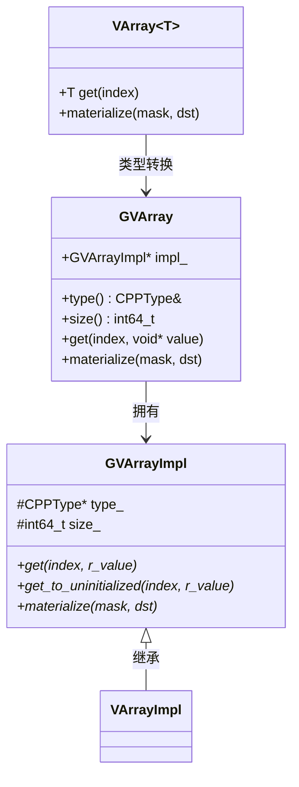
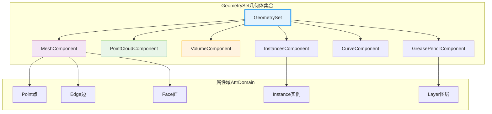
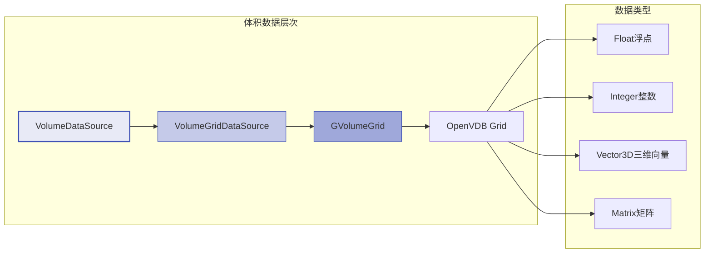
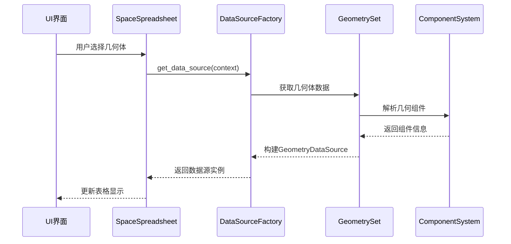
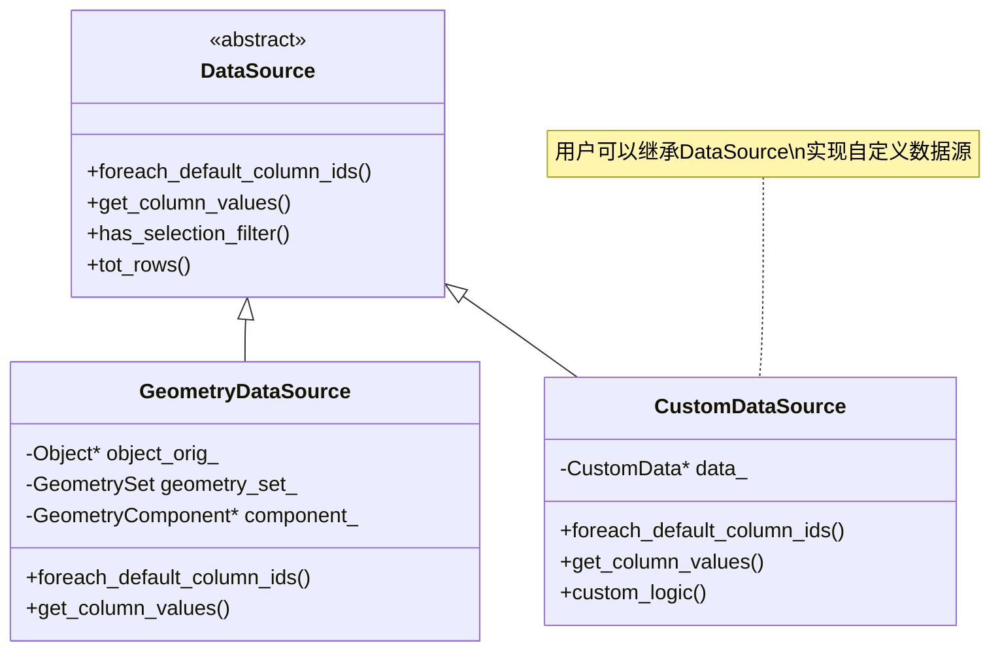
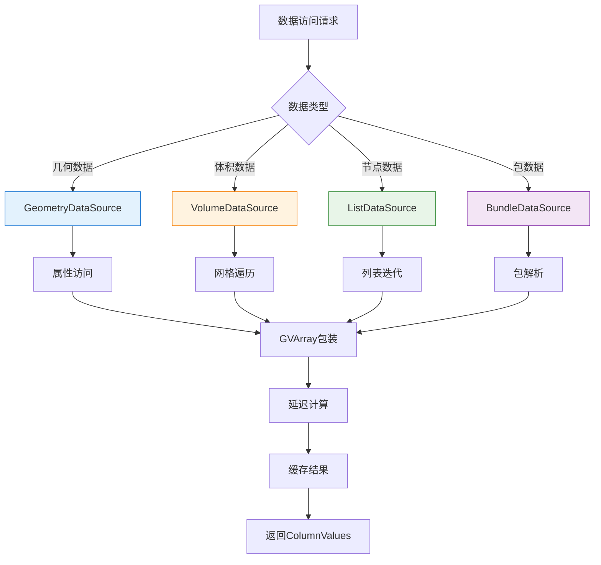

# 03_数据源架构深度分析

## <span style="color: #FF6B6B;">📋 概览</span>

<span style="background-color: #E8F4FD; color: #1976D2;">本文档深入分析Blender表格系统的数据源架构，重点解析source/blender/editors/space_spreadsheet文件夹中的核心组件。数据源是表格系统的根基，负责从各种Blender数据结构中提取、转换和提供数据给表格显示。</span>

---

## <span style="color: #4CAF50;">🏗️ 核心缩写解释</span>

### <span style="background-color: #F0F8FF; color: #2E7D32;">基础概念缩写</span>

| 缩写 | 全称 | 中文含义 | 解释 |
|------|------|----------|------|
| **<span style="color: #D32F2F;">DataSource</span>** | Data Source | 数据源 | 抽象基类，定义数据提供接口 |
| **<span style="color: #D32F2F;">GVArray</span>** | Generic Virtual Array | 通用虚拟数组 | 运行时类型的数组抽象 |
| **<span style="color: #D32F2F;">BKE</span>** | Blender Kernel | Blender内核 | 核心数据结构和算法库 |
| **<span style="color: #D32F2F;">DNA</span>** | Data Network Access | 数据网络访问 | Blender的DNA数据结构系统 |
| **<span style="color: #D32F2F;">BLI</span>** | Blender Library | Blender库 | 基础工具和容器库 |
| **<span style="color: #D32F2F;">ED</span>** | Editor | 编辑器 | 编辑器相关代码 |
| **<span style="color: #D32F2F;">CPP</span>** | C++ Type | C++类型 | C++类型系统 |

### <span style="background-color: #FFF3E0; color: #E65100;">几何相关缩写</span>

| 缩写 | 全称 | 中文含义 | 解释 |
|------|------|----------|------|
| **<span style="color: #FF6F00;">GeometrySet</span>** | Geometry Set | 几何体集合 | 包含多种几何类型的容器 |
| **<span style="color: #FF6F00;">AttrDomain</span>** | Attribute Domain | 属性域 | 属性的作用域（点、边、面等） |
| **<span style="color: #FF6F00;">bke</span>** | Blender Kernel | Blender内核 | 核心内核命名空间 |

---

## <span style="color: #9C27B0;">🔧 核心架构组件</span>

### <span style="background-color: #F3E5F5; color: #7B1FA2;">DataSource基类架构</span>

```cpp
// 位于: source/blender/editors/space_spreadsheet/spreadsheet_data_source.hh:18
class DataSource {
public:
  virtual ~DataSource();
  
  // 核心接口方法
  virtual void foreach_default_column_ids(
      FunctionRef<void(const SpreadsheetColumnID &, bool is_extra)> fn) const;
      
  virtual std::unique_ptr<ColumnValues> get_column_values(
      const SpreadsheetColumnID &column_id) const;
      
  virtual bool has_selection_filter() const;
  virtual int tot_rows() const;
};
```

#### <span style="color: #7B1FA2;">🎯 核心职责</span>

<span style="background-color: #E1BEE7; color: #4A148C;">**数据抽象层**</span>：DataSource作为所有数据源的抽象基类，定义了统一的数据访问接口，屏蔽了底层不同数据结构的复杂性。

<span style="background-color: #E1BEE7; color: #4A148C;">**列管理**</span>：通过`foreach_default_column_ids`方法提供默认列的枚举，支持动态列添加和移除。

<span style="background-color: #E1BEE7; color: #4A148C;">**数据获取**</span>：`get_column_values`方法返回具体的列数据，以ColumnValues对象形式提供。

---

### <span style="background-color: #E8F5E8; color: #388E3C;">ColumnValues数据容器</span>

```cpp
// 位于: source/blender/editors/space_spreadsheet/spreadsheet_column_values.hh:25
class ColumnValues final {
private:
  std::string name_;
  GVArray data_;                    // 🌟 核心数据容器
  ColumnValueDisplayHint display_hint_;
  
public:
  eSpreadsheetColumnValueType type() const;
  StringRefNull name() const;
  int size() const;
  const GVArray &data() const;
  float fit_column_width_px(const std::optional<int64_t> &max_sample_size) const;
};
```

#### <span style="color: #388E3C;">🌟 GVArray核心机制</span>

<span style="background-color: #C8E6C9; color: #1B5E20;">**GVArray**</span>（Generic Virtual Array）是Blender中的核心数据抽象：



<span style="background-color: #C8E6C9; color: #1B5E20;">**设计优势**</span>：
- **类型安全**：编译时和运行时类型检查
- **内存效率**：支持延迟计算和引用语义
- **统一接口**：不同数据源的统一访问方式
- **高性能**：避免不必要的数据复制

---

## <span style="color: #FF5722;">🏛️ 具体数据源实现</span>

### <span style="background-color: #FBE9E7; color: #D84315;">GeometryDataSource几何数据源</span>

```cpp
// 位于: source/blender/editors/space_spreadsheet/spreadsheet_data_source_geometry.hh:25
class GeometryDataSource : public DataSource {
private:
  Object *object_orig_;                           // 原始对象引用
  const bke::GeometrySet geometry_set_;           // 几何体集合
  const bke::GeometryComponent *component_;       // 几何组件
  bke::AttrDomain domain_;                        // 属性域
  bool show_internal_attributes_;                 // 显示内部属性
  int layer_index_;                              // 图层索引（蜡笔相关）
  
  mutable Mutex mutex_;                          // 线程安全
  mutable ResourceScope scope_;                   // 资源管理
};
```

#### <span style="color: #D84315;">🎨 几何组件系统</span>

<span style="background-color: #FFCCBC; color: #BF360C;">**GeometrySet架构**</span>：



#### <span style="color: #D84315;">🔍 属性访问机制</span>

```cpp
// GeometryDataSource的属性访问实现
std::optional<const bke::AttributeAccessor> get_component_attributes() const {
  if (!component_) {
    return std::nullopt;
  }
  return component_->attributes();
}

bool display_attribute(StringRef name, bke::AttrDomain domain) const {
  // 过滤逻辑：决定哪些属性应该显示
  if (!show_internal_attributes_ && name.startswith(".")) {
    return false;  // 隐藏内部属性
  }
  return true;
}
```

---

### <span style="background-color: #FCE4EC; color: #C2185B;">VolumeDataSource体积数据源</span>

```cpp
// 位于: source/blender/editors/space_spreadsheet/spreadsheet_data_source_geometry.hh:77
class VolumeDataSource : public DataSource {
private:
  const bke::GeometrySet geometry_set_;
  const bke::VolumeComponent *component_;
  
public:
  void foreach_default_column_ids(FunctionRef<void(const SpreadsheetColumnID &, bool)> fn) const override;
  std::unique_ptr<ColumnValues> get_column_values(const SpreadsheetColumnID &column_id) const override;
  int tot_rows() const override;
};
```

#### <span style="color: #C2185B;">🌊 体积数据特性</span>

<span style="background-color: #F8BBD0; color: #880E4F;">**OpenVDB集成**</span>：体积数据源支持OpenVDB格式的3D体积数据：



---

### <span style="background-color: #E0F2F1; color: #00695C;">几何节点数据源</span>

#### <span style="color: #00695C;">🔗 ListDataSource列表数据源</span>

```cpp
// 位于: source/blender/editors/space_spreadsheet/spreadsheet_data_source_geometry.hh:117
class ListDataSource : public DataSource {
private:
  nodes::ListPtr list_;  // 几何节点列表
  
public:
  ListDataSource(nodes::ListPtr list);
  
  void foreach_default_column_ids(FunctionRef<void(const SpreadsheetColumnID &, bool)> fn) const override;
  std::unique_ptr<ColumnValues> get_column_values(const SpreadsheetColumnID &column_id) const override;
  int tot_rows() const override;
};
```

#### <span style="color: #00695C;">📦 BundleDataSource包数据源</span>

```cpp
// 位于: source/blender/editors/space_spreadsheet/spreadsheet_data_source_geometry.hh:132
class BundleDataSource : public DataSource {
private:
  nodes::BundlePtr bundle_;                                    // 几何节点包
  Vector<std::string> flat_item_keys_;                        // 扁平化键
  Vector<const nodes::BundleItemValue *> flat_items_;          // 扁平化项
  
public:
  BundleDataSource(nodes::BundlePtr bundle);
  
private:
  void collect_flat_items(const nodes::Bundle &bundle, StringRef parent_path);
};
```

<span style="background-color: #B2DFDB; color: #004D40;">**扁平化机制**</span>：BundleDataSource将嵌套的几何节点数据结构扁平化为表格形式，支持层次化数据的表格展示。

---

## <span style="color: #673AB7;">⚙️ 系统集成与数据流</span>

### <span style="background-color: #EDE7F6; color: #512DA8;">数据源创建流程</span>



### <span style="background-color: #EDE7F6; color: #512DA8;">核心工厂函数</span>

```cpp
// 位于: source/blender/editors/space_spreadsheet/spreadsheet_intern.hh:93
std::unique_ptr<DataSource> get_data_source(const bContext &C);

// 位于: source/blender/editors/space_spreadsheet/spreadsheet_data_source_geometry.hh:185
std::unique_ptr<DataSource> data_source_from_geometry(const bContext *C, Object *object_eval);
```

#### <span style="color: #512DA8;">🏭 数据源工厂模式</span>

<span style="background-color: #D1C4E9; color: #311B92;">**智能选择机制**</span>：

```cpp
std::unique_ptr<DataSource> data_source_from_geometry(const bContext *C, Object *object_eval) {
  // 1. 获取几何体数据
  const bke::GeometrySet geometry_set = get_geometry_set_for_display(object_eval);
  
  // 2. 根据数据类型选择合适的数据源
  if (const bke::VolumeComponent *volume = geometry_set.get_component<bke::VolumeComponent>()) {
    return std::make_unique<VolumeDataSource>(geometry_set);
  }
  
  if (geometry_set.has<bke::MeshComponent>() || 
      geometry_set.has<bke::PointCloudComponent>()) {
    return std::make_unique<GeometryDataSource>(
        object_orig, geometry_set, component_type, domain, show_internal);
  }
  
  // 3. 几何节点数据源
  if (auto socket_value = geometry_display_data_get(sspreadsheet, object_eval)) {
    return create_geometry_node_data_source(socket_value);
  }
  
  return nullptr;
}
```

---

## <span style="color: #FF9800;">🔍 列值系统深度解析</span>

### <span style="background-color: #FFF8E1; color: #F57C00;">SpreadsheetColumnID列标识</span>

```cpp
// 位于: source/blender/editors/space_spreadsheet/spreadsheet_column.hh:12
inline bool operator==(const SpreadsheetColumnID &a, const SpreadsheetColumnID &b) {
  using blender::StringRef;
  return StringRef(a.name) == StringRef(b.name);
}

namespace blender {
template<> struct DefaultHash<SpreadsheetColumnID> {
  uint64_t operator()(const SpreadsheetColumnID &column_id) const {
    return get_default_hash(StringRef(column_id.name));
  }
};
}
```

#### <span style="color: #F57C00;">🏷️ 列标识特性</span>

<span style="background-color: #FFE0B2; color: #E65100;">**字符串引用优化**</span>：使用StringRef避免字符串复制，提高性能。

<span style="background-color: #FFE0B2; color: #E65100;">**哈希支持**</span>：特化DefaultHash使得SpreadsheetColumnID可以作为unordered_map的键。

---

### <span style="background-color: #F3E5F5; color: #8E24AA;">列值类型系统</span>

```cpp
// 列值类型枚举（DNA_space_types.h中定义）
enum eSpreadsheetColumnValueType {
  SPREADSHEET_VALUE_TYPE_BOOL = 0,
  SPREADSHEET_VALUE_TYPE_INT32,
  SPREADSHEET_VALUE_TYPE_FLOAT,
  SPREADSHEET_VALUE_TYPE_STRING,
  SPREADSHEET_VALUE_TYPE_INSTANCES,
};
```

#### <span style="color: #8E24AA;">🔄 类型转换机制</span>

```cpp
// 位于: source/blender/editors/space_spreadsheet/spreadsheet_column_values.hh:14
eSpreadsheetColumnValueType cpp_type_to_column_type(const CPPType &type);

// 示例转换逻辑
eSpreadsheetColumnValueType cpp_type_to_column_type(const CPPType &type) {
  if (&type == &CPPType::get<float>()) {
    return SPREADSHEET_VALUE_TYPE_FLOAT;
  }
  if (&type == &CPPType::get<int>()) {
    return SPREADSHEET_VALUE_TYPE_INT32;
  }
  if (&type == &CPPType::get<std::string>()) {
    return SPREADSHEET_VALUE_TYPE_STRING;
  }
  // ... 其他类型转换
  return SPREADSHEET_VALUE_TYPE_STRING; // 默认字符串表示
}
```

---

## <span style="color: #00BCD4;">🧵 并发与性能优化</span>

### <span style="background-color: #E0F7FA; color: #00838F;">线程安全机制</span>

```cpp
// GeometryDataSource中的线程安全设计
class GeometryDataSource : public DataSource {
private:
  mutable Mutex mutex_;              // 保护共享状态
  mutable ResourceScope scope_;       // 资源生命周期管理
  
public:
  std::unique_ptr<ColumnValues> get_column_values(
      const SpreadsheetColumnID &column_id) const override {
    
    std::lock_guard<std::mutex> lock(mutex_);  // 🔒 线程安全
    
    // 在锁保护下访问共享资源
    return compute_column_values_unsafe(column_id);
  }
};
```

#### <span style="color: #00838F;">⚡ 延迟计算优化</span>

<span style="background-color: #B2EBF2; color: #006064;">**按需计算**</span>：ColumnValues支持延迟计算，只在需要时才计算数据：

```cpp
// 智能宽度计算
float fit_column_width_px(const std::optional<int64_t> &max_sample_size) const {
  if (max_sample_size) {
    // 🎯 采样优化：只检查部分数据估算宽度
    return estimate_width_from_sample(data_, *max_sample_size);
  } else {
    // 🔍 完整计算：检查所有数据
    return compute_exact_width(data_);
  }
}
```

---

## <span style="color: #795548;">📊 内存管理与资源控制</span>

### <span style="background-color: #EFEBE9; color: #5D4037;">BLI内存管理系统</span>

<span style="background-color: #D7CCC8; color: #3E2723;">**MEM_宏系列**</span>：

```cpp
// Blender标准内存分配宏
DataSource::~DataSource() = default;  // 自动调用析构函数

// 手动内存管理示例
SpreadsheetColumn *spreadsheet_column_new(SpreadsheetColumnID *column_id) {
  SpreadsheetColumn *column = MEM_callocN<SpreadsheetColumn>("spreadsheet column");
  column->column_id = column_id;
  return column;
}

void spreadsheet_column_free(SpreadsheetColumn *column) {
  if (column->column_id) {
    spreadsheet_column_id_free(column->column_id);
  }
  MEM_freeN(column);
}
```

#### <span style="color: #5D4037;">🔄 RAII与智能指针</span>

<span style="background-color: #BCAAA4; color: #4E342E;">**现代C++实践**</span>：数据源系统大量使用智能指针和RAII：

```cpp
// 智能指针管理数据源生命周期
std::unique_ptr<DataSource> data_source = get_data_source(context);

// 自动资源管理
class ResourceScope {
  // 管理临时资源的生命周期
  template<typename T, typename... Args>
  T &construct(Args &&...args) {
    // 构造对象并注册到scope中自动清理
  }
};
```

---

## <span style="color: #607D8B;">🎨 用户界面集成</span>

### <span style="background-color: #ECEFF1; color: #455A64;">运行时数据结构</span>

```cpp
// 位于: source/blender/editors/space_spreadsheet/spreadsheet_intern.hh:38
struct SpaceSpreadsheet_Runtime {
  int visible_rows = 0;
  int tot_rows = 0;
  int tot_columns = 0;
  int top_row_height = 0;
  int left_column_width = 0;
  
  std::optional<ReorderColumnVisualizationData> reorder_column_visualization_data;
  
  SpaceSpreadsheet_Runtime() = default;
  SpaceSpreadsheet_Runtime(const SpaceSpreadsheet_Runtime &other)
      : visible_rows(other.visible_rows), 
        tot_rows(other.tot_rows), 
        tot_columns(other.tot_columns) {}
};
```

#### <span style="color: #455A64;">🖱️ 交互式列管理</span>

<span style="background-color: #CFD8DC; color: #37474F;">**列重排序可视化**</span>：

```cpp
struct ReorderColumnVisualizationData {
  int old_index = 0;
  int new_index = 0;
  int current_offset_x_px = 0;
};
```

<span style="background-color: #CFD8DC; color: #37474F;">**鼠标交互检测**</span>：

```cpp
// 鼠标悬停检测函数
SpreadsheetColumn *find_hovered_column_header(SpaceSpreadsheet &sspreadsheet,
                                               ARegion &region,
                                               const int2 &cursor_re);

SpreadsheetColumn *find_hovered_column_edge(SpaceSpreadsheet &sspreadsheet,
                                            ARegion &region,
                                            const int2 &cursor_re);
```

---

## <span style="color: #E91E63;">🔧 扩展机制与插件架构</span>

### <span style="background-color: #FCE4EC; color: #AD1457;">自定义数据源扩展</span>



#### <span style="color: #AD1457;">🎯 扩展点设计</span>

<span style="background-color: #F8BBD0; color: #880E4F;">**关键扩展方法**</span>：

1. **<span style="color: #C2185B;">列发现</span>**：`foreach_default_column_ids` - 定义默认显示的列
2. **<span style="color: #C2185B;">数据提供</span>**：`get_column_values` - 提供列的具体数据
3. **<span style="color: #C2185B;">行数计算</span>**：`tot_rows` - 返回数据行数
4. **<span style="color: #C2185B;">选择过滤</span>**：`has_selection_filter` - 支持选择状态过滤

---

## <span style="color: #3F51B5;">📈 性能分析与优化策略</span>

### <span style="background-color: #E8EAF6; color: #283593;">数据访问模式分析</span>



#### <span style="color: #283593;">🎯 性能优化策略</span>

<span style="background-color: #C5CAE9; color: #1A237E;">**1. 虚拟数组优化**</span>：
- 避免数据复制，使用引用语义
- 支持延迟计算和短路求值
- 类型特化减少运行时开销

<span style="background-color: #C5CAE9; color: #1A237E;">**2. 采样机制**</span>：
- 大数据集使用采样估算
- 可配置采样大小平衡精度与性能
- 最小宽度保证避免极端情况

<span style="background-color: #C5CAE9; color: #1A237E;">**3. 内存管理**</span>：
- ResourceScope自动清理临时资源
- 智能指针管理对象生命周期
- 内存池减少分配开销

---

## <span style="color: #009688;">🔍 调试与诊断工具</span>

### <span style="background-color: #E0F2F1; color: #00695C;">调试支持机制</span>

```cpp
// 调试辅助宏和函数
#ifdef DEBUG
  #define DS_DEBUG_PRINT(fmt, ...) \
    printf("[DataSource Debug] " fmt "\n", ##__VA_ARGS__)
#else
  #define DS_DEBUG_PRINT(fmt, ...)
#endif

// 数据源状态检查
void debug_print_data_source_info(const DataSource &source) {
  DS_DEBUG_PRINT("DataSource type: %s", typeid(source).name());
  DS_DEBUG_PRINT("Total rows: %d", source.tot_rows());
  DS_DEBUG_PRINT("Has selection filter: %s", 
                source.has_selection_filter() ? "Yes" : "No");
}
```

#### <span style="color: #00695C;">🐛 常见问题诊断</span>

<span style="background-color: #B2DFDB; color: #004D40;">**1. 空数据源问题**</span>：
```cpp
// 检查数据源有效性
bool validate_data_source(const DataSource *source) {
  if (!source) {
    DS_DEBUG_PRINT("Null data source");
    return false;
  }
  
  if (source->tot_rows() <= 0) {
    DS_DEBUG_PRINT("Empty data source");
    return false;
  }
  
  return true;
}
```

<span style="background-color: #B2DFDB; color: #004D40;">**2. 列类型不匹配**</span>：
```cpp
// 类型一致性检查
bool validate_column_type(const ColumnValues &column) {
  const GVArray &data = column.data();
  
  // 检查数组大小
  if (data.size() <= 0) {
    DS_DEBUG_PRINT("Invalid column size: %ld", data.size());
    return false;
  }
  
  // 检查类型有效性
  if (!data.type().is_printable()) {
    DS_DEBUG_PRINT("Non-printable type: %s", data.type().name());
    return false;
  }
  
  return true;
}
```

---

## <span style="color: #FF5722;">🚀 未来发展与扩展方向</span>

### <span style="background-color: #FBE9E7; color: #D84315;">架构演进规划</span>

#### <span style="color: #D84315;">🌟 短期优化</span>

<span style="background-color: #FFCCBC; color: #BF360C;">**1. 异步数据加载**</span>：
```cpp
// 异步数据源接口设计
class AsyncDataSource : public DataSource {
private:
  std::future<std::unique_ptr<ColumnValues>> loading_future_;
  
public:
  std::unique_ptr<ColumnValues> get_column_values_async(
      const SpreadsheetColumnID &column_id) override;
      
  bool is_loading_complete() const;
  void wait_for_loading() const;
};
```

<span style="background-color: #FFCCBC; color: #BF360C;">**2. 增量更新机制**</span>：
```cpp
// 增量更新支持
class IncrementalDataSource : public DataSource {
public:
  struct DataChange {
    enum Type { ROW_ADDED, ROW_REMOVED, ROW_MODIFIED, COLUMN_ADDED };
    Type type;
    int row_index = -1;
    std::string column_name;
  };
  
  virtual std::vector<DataChange> detect_changes() const = 0;
  virtual void apply_changes(const std::vector<DataChange> &changes) = 0;
};
```

#### <span style="color: #D84315;">🎯 长期愿景</span>

<span style="background-color: #FFCCBC; color: #BF360C;">**1. 多线程渲染支持**</span>：
- 数据源与UI线程完全分离
- 支持后台数据预处理
- 非阻塞用户交互

<span style="background-color: #FFCCBC; color: #BF360C;">**2. 插件化数据源**</span>：
- 动态加载数据源插件
- 标准化数据源接口
- 第三方扩展支持

<span style="background-color: #FFCCBC; color: #BF360C;">**3. 云端数据集成**</span>：
- 远程数据源支持
- 流式数据处理
- 实时数据同步

---

## <span style="color: #9C27B0;">📚 参考资料与学习路径</span>

### <span style="background-color: #F3E5F5; color: #7B1FA2;">核心文件清单</span>

| 文件路径 | 作用 | 学习优先级 |
|----------|------|------------|
| `spreadsheet_data_source.hh` | 数据源基类定义 | ⭐⭐⭐⭐⭐ |
| `spreadsheet_column_values.hh` | 列值容器 | ⭐⭐⭐⭐⭐ |
| `spreadsheet_data_source_geometry.hh` | 几何数据源 | ⭐⭐⭐⭐ |
| `spreadsheet_intern.hh` | 内部接口 | ⭐⭐⭐ |
| `BLI_generic_virtual_array.hh` | 虚拟数组系统 | ⭐⭐⭐⭐ |

### <span style="background-color: #F3E5F5; color: #7B1FA2;">学习建议</span>

<span style="background-color: #E1BEE7; color: #4A148C;">**初学者路径**</span>：
1. 理解DataSource基类设计模式
2. 掌握GVArray虚拟数组概念
3. 学习简单的GeometryDataSource实现
4. 了解列值类型转换机制

<span style="background-color: #E1BEE7; color: #4A148C;">**进阶开发者路径**</span>：
1. 深入研究BLI库的设计哲学
2. 掌握内存管理和RAII模式
3. 学习几何节点数据源集成
4. 理解并发和性能优化策略

<span style="background-color: #E1BEE7; color: #4A148C;">**架构师路径**</span>：
1. 分析整个数据流架构
2. 设计自定义数据源扩展
3. 优化性能瓶颈
4. 参与架构演进设计

---

## <span style="color: #607D8B;">🎯 总结</span>

<span style="background-color: #ECEFF1; color: #455A64;">Blender表格系统的数据源架构是一个精心设计的工程杰作，体现了现代C++最佳实践与高性能计算的完美结合。通过抽象的DataSource基类、强大的GVArray虚拟数组系统、以及灵活的几何数据集成，它为用户提供了统一、高效、可扩展的数据查看能力。</span>

<span style="background-color: #ECEFF1; color: #455A64;">无论是处理复杂的几何体数据、体积数据，还是几何节点的动态数据，这个架构都能优雅地应对，同时保持出色的性能和用户体验。它不仅是Blender技术栈的重要组成部分，也是学习现代C++软件架构设计的绝佳案例。</span>

---

<span style="background-color: #263238; color: #ECEFF1; font-size: 12px; display: block; text-align: center; padding: 10px; margin-top: 20px;">
📖 文档版本: v1.0 | 📅 创建日期: 2025-12-19 | 🔄 最后更新: 2025-12-19<br>
💡 基于Blender源码: source/blender/editors/space_spreadsheet/<br>
🏗️ 架构分析: DataSource、GVArray、GeometrySet、ColumnValues<br>
🎯 适用读者: C++开发者、Blender插件开发者、图形学工程师
</span>