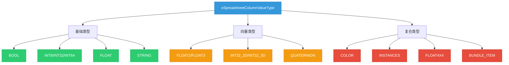
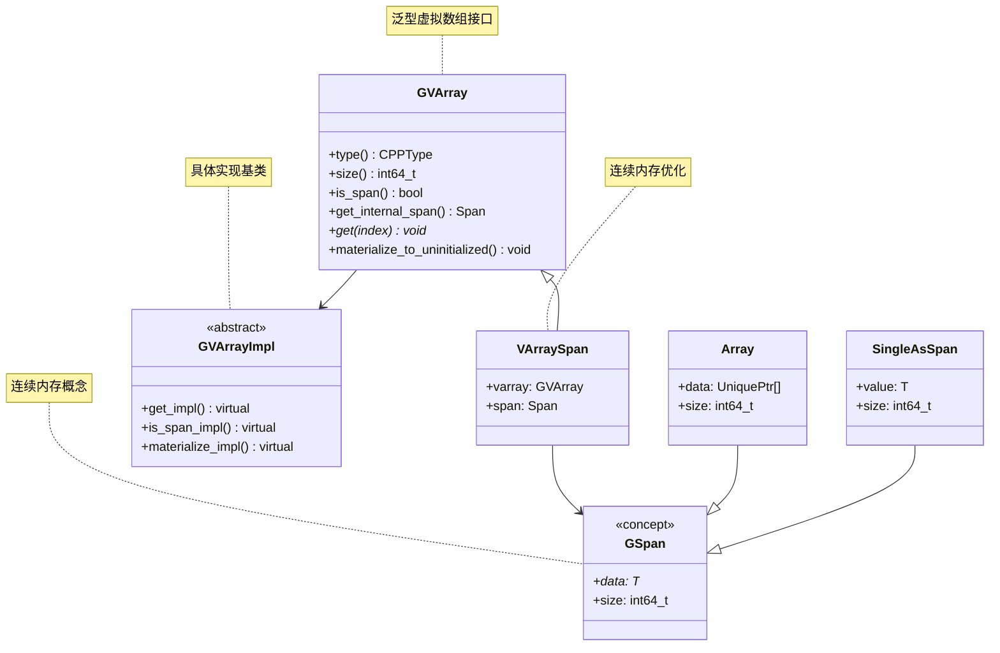
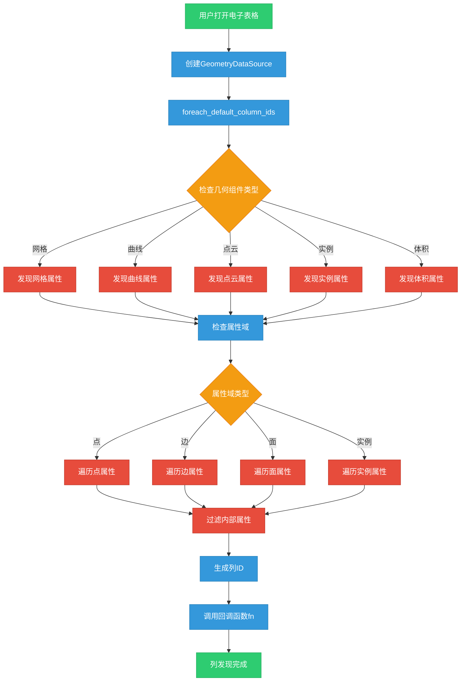
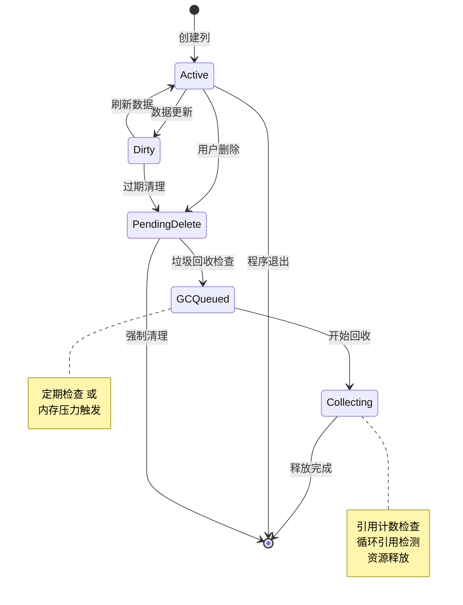
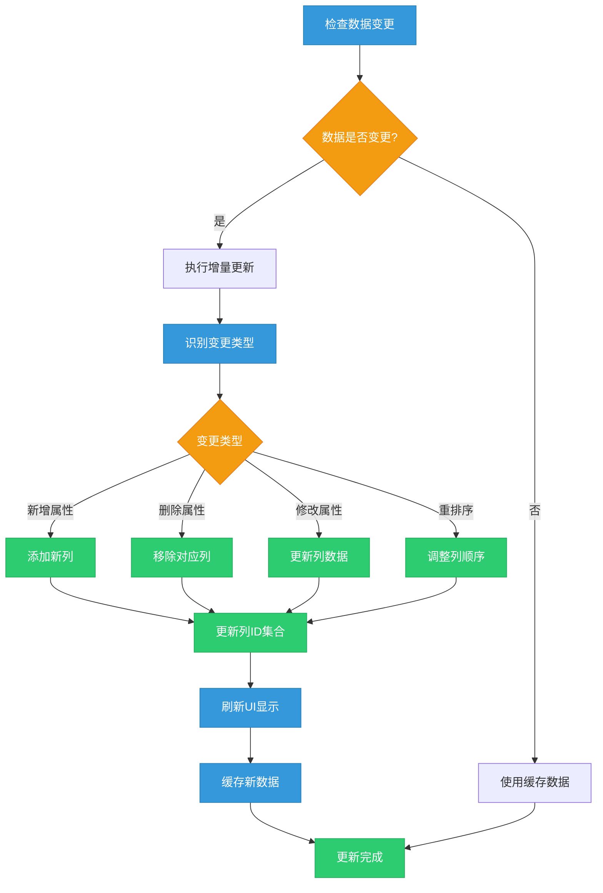
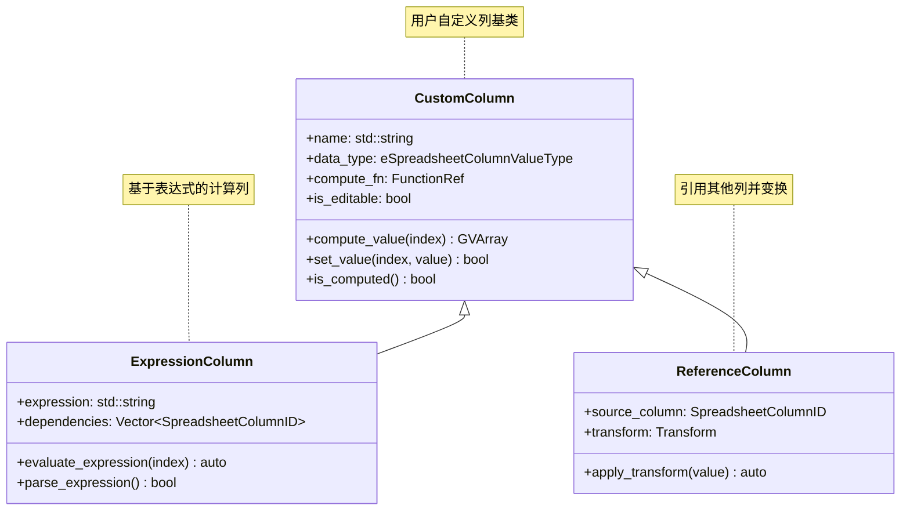
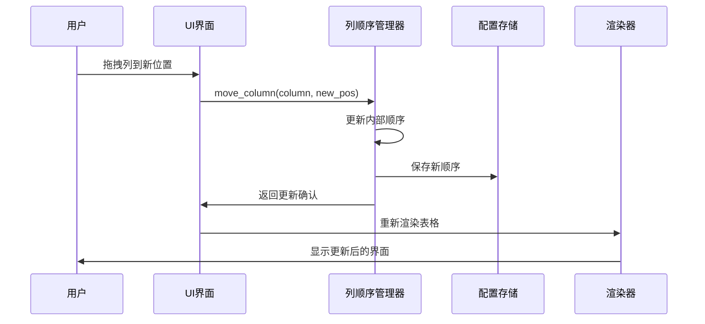
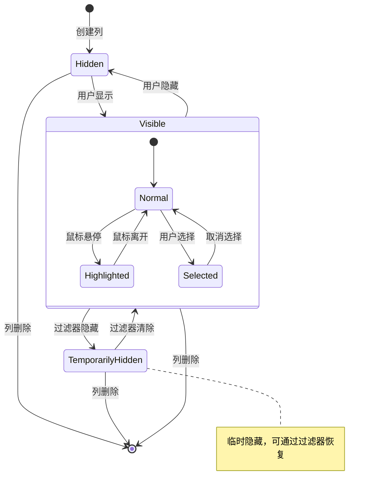

# 04_列管理系统详解

## 目录
- [1. Column结构设计](#1-column结构设计)
  - [1.1. 列标识系统](#11-列标识系统)
  - [1.2. 列类型定义](#12-列类型定义)
  - [1.3. 元数据管理](#13-元数据管理)
- [2. ColumnValues泛型系统](#2-columnvalues泛型系统)
  - [2.1. GVArray使用详解](#21-gvarray使用详解)
  - [2.2. 类型转换机制](#22-类型转换机制)
  - [2.3. 数据访问接口](#23-数据访问接口)
- [3. 列发现和更新机制](#3-列发现和更新机制)
  - [3.1. 自动列发现算法](#31-自动列发现算法)
  - [3.2. 列垃圾回收逻辑](#32-列垃圾回收逻辑)
  - [3.3. 增量更新策略](#33-增量更新策略)
- [4. 列配置管理](#4-列配置管理)
  - [4.1. 用户自定义列](#41-用户自定义列)
  - [4.2. 列顺序控制](#42-列顺序控制)
  - [4.3. 可见性管理](#43-可见性管理)

---

## 1. Column结构设计

### 1.1. 列标识系统

<span style="background-color:#2E4057;color:white;padding:2px 6px;border-radius:3px;">**核心概念**</span> 
Blender电子表格系统中的列标识基于 `SpreadsheetColumnID` 结构，这是整个列管理系统的基础。

#### 1.1.1. SpreadsheetColumnID 结构解析

**定义位置**: `DNA_space_types.h` (位于Blender DNA数据类型定义文件中)

```cpp
typedef struct SpreadsheetColumnID {
  char *name;           // 列的名称字符串
} SpreadsheetColumnID;
```

<span style="color:#3498db;font-weight:bold;">🔍 设计意图解析</span>:

- **Spreadsheet**: <span style="background-color:#ECF0F1;color:#2C3E50;padding:1px 4px;font-family:monospace;">电子表格</span>的英文缩写，表明这个结构用于电子表格功能
- **Column**: <span style="background-color:#ECF0F1;color:#2C3E50;padding:1px 4px;font-family:monospace;">列</span>，表示表格中的垂直数据列
- **ID**: <span style="background-color:#ECF0F1;color:#2C3E50;padding:1px 4px;font-family:monospace;">Identifier</span>的缩写，标识符，用于唯一识别

这种命名方式遵循了Blender的命名规范：<span style="color:#E74C3C;font-weight:bold;">[功能区域]_[对象类型]_[属性类型]</span>

#### 1.1.2. 哈希支持与相等性比较

**定义位置**: `spreadsheet_column.hh:12-24`

```cpp
namespace blender {
template<> struct DefaultHash<SpreadsheetColumnID> {
  uint64_t operator()(const SpreadsheetColumnID &column_id) const
  {
    return get_default_hash(StringRef(column_id.name));
  }
};
}  // namespace blender

inline bool operator==(const SpreadsheetColumnID &a, const SpreadsheetColumnID &b)
{
  using blender::StringRef;
  return StringRef(a.name) == StringRef(b.name);
}
```

<span style="background-color:#F39C12;color:white;padding:2px 6px;border-radius:3px;">**技术细节**</span>:

- `DefaultHash` 是Blender的哈希模板特化，使 `SpreadsheetColumnID` 能够用于 `HashMap` 等容器
- `StringRef` 是Blender的字符串引用类，避免不必要的字符串拷贝
- 哈希函数仅基于列名称，因为名称在电子表格中应该是唯一的

#### 1.1.3. 列ID的生命周期管理

**定义位置**: `spreadsheet_column.cc:83-113`

```cpp
SpreadsheetColumnID *spreadsheet_column_id_new()
{
  SpreadsheetColumnID *column_id = MEM_callocN<SpreadsheetColumnID>(__func__);
  return column_id;
}

SpreadsheetColumnID *spreadsheet_column_id_copy(const SpreadsheetColumnID *src_column_id)
{
  SpreadsheetColumnID *new_column_id = spreadsheet_column_id_new();
  new_column_id->name = BLI_strdup(src_column_id->name);
  return new_column_id;
}

void spreadsheet_column_id_free(SpreadsheetColumnID *column_id)
{
  if (column_id->name != nullptr) {
    MEM_freeN(column_id->name);
  }
  MEM_freeN(column_id);
}
```

<span style="color:#16A085;font-weight:bold;">💡 内存管理解析</span>:

- `MEM_callocN`: <span style="background-color:#E8F6F3;color:#16A085;padding:1px 4px;">Memory Callocate New</span>的缩写，分配并清零内存
- `BLI_strdup`: <span style="background-color:#E8F6F3;color:#16A085;padding:1px 4px;">Blender String Duplicate</span>的缩写，复制字符串
- `MEM_freeN`: <span style="background-color:#E8F6F3;color:#16A085;padding:1px 4px;">Memory Free Number</span>的缩写，释放内存
- `__func__`: C++预定义宏，表示当前函数名，用于调试

### 1.2. 列类型定义

#### 1.2.1. 列值类型枚举

**定义位置**: `DNA_space_types.h`

```cpp
typedef enum eSpreadsheetColumnValueType {
  SPREADSHEET_VALUE_TYPE_UNKNOWN = 0,
  SPREADSHEET_VALUE_TYPE_BOOL,
  SPREADSHEET_VALUE_TYPE_INT8,
  SPREADSHEET_VALUE_TYPE_INT32,
  SPREADSHEET_VALUE_TYPE_INT64,
  SPREADSHEET_VALUE_TYPE_INT32_2D,
  SPREADSHEET_VALUE_TYPE_INT32_3D,
  SPREADSHEET_VALUE_TYPE_FLOAT,
  SPREADSHEET_VALUE_TYPE_FLOAT2,
  SPREADSHEET_VALUE_TYPE_FLOAT3,
  SPREADSHEET_VALUE_TYPE_COLOR,
  SPREADSHEET_VALUE_TYPE_STRING,
  SPREADSHEET_VALUE_TYPE_INSTANCES,
  SPREADSHEET_VALUE_TYPE_BYTE_COLOR,
  SPREADSHEET_VALUE_TYPE_QUATERNION,
  SPREADSHEET_VALUE_TYPE_FLOAT4X4,
  SPREADSHEET_VALUE_TYPE_BUNDLE_ITEM,
} eSpreadsheetColumnValueType;
```

<span style="background-color:#9B59B6;color:white;padding:2px 6px;border-radius:3px;">**类型系统解析**</span>:

- **BOOL**: 布尔值，用于逻辑属性
- **INT8/INT32/INT64**: 不同位宽的整数，适应不同精度需求
- **FLOAT**: 单精度浮点数，用于连续数值
- **FLOAT2/FLOAT3**: 2D/3D向量，用于几何数据
- **COLOR**: 颜色值，支持RGBA
- **INSTANCES**: 实例引用，用于几何节点实例化
- **QUATERNION**: 四元数，用于旋转表示



#### 1.2.2. 类型转换机制

**定义位置**: `spreadsheet_column.cc:29-81`

```cpp
eSpreadsheetColumnValueType cpp_type_to_column_type(const CPPType &type)
{
  if (type.is<bool>()) {
    return SPREADSHEET_VALUE_TYPE_BOOL;
  }
  if (type.is<float>()) {
    return SPREADSHEET_VALUE_TYPE_FLOAT;
  }
  if (type.is<float2>()) {
    return SPREADSHEET_VALUE_TYPE_FLOAT2;
  }
  if (type.is<float3>()) {
    return SPREADSHEET_VALUE_TYPE_FLOAT3;
  }
  // ... 更多类型检查
  return SPREADSHEET_VALUE_TYPE_UNKNOWN;
}
```

<span style="color:#8E44AD;font-weight:bold;">🔄 转换逻辑分析</span>:

- `CPPType` 是Blender的C++类型包装器，提供类型信息
- `type.is<T>()`: 运行时类型检查，模板参数为目标类型
- 返回 `UNKNOWN` 表示不支持的类型，提供错误处理机制

$$
\text{CPPType} \xrightarrow{\text{cpp\_type\_to\_column\_type}} \text{eSpreadsheetColumnValueType}
$$

### 1.3. 元数据管理

#### 1.3.1. SpreadsheetColumn 结构

**定义位置**: `DNA_space_types.h`

```cpp
typedef struct SpreadsheetColumn {
  SpreadsheetColumnID *id;           // 列标识符
  char *display_name;                // 显示名称
  eSpreadsheetColumnValueType data_type; // 数据类型
  float width;                       // 列宽度
  struct SpreadsheetColumnRuntime *runtime; // 运行时数据
} SpreadsheetColumn;
```

<span style="background-color:#34495E;color:white;padding:2px 6px;border-radius:3px;">**字段解析**</span>:

- **id**: 指向列标识符的指针，实现数据与标识的分离
- **display_name**: 用户友好的显示名称，可能与ID不同
- **data_type**: 列值类型枚举，用于UI渲染和数据转换
- **width**: 列宽度，支持用户自定义列宽
- **runtime**: 运行时数据，仅在程序运行时存在，不保存到文件

#### 1.3.2. 运行时数据结构

**定义位置**: `spreadsheet_column.hh:28-32`

```cpp
struct SpreadsheetColumnRuntime {
  /** Coordinates of the left and right edges of the column in view space. */
  int left_x = 0;
  int right_x = 0;
};
```

<span style="color:#2980B9;font-weight:bold;">📊 渲染相关数据</span>:

- **left_x/right_x**: 列在视图空间中的左右边界坐标
- 仅在渲染时使用，不影响数据持久化
- 支持动态列宽调整和视图变换

---

## 2. ColumnValues泛型系统

### 2.1. GVArray使用详解

#### 2.1.1. GVArray 概念解析

<span style="background-color:#E67E22;color:white;padding:2px 6px;border-radius:3px;">**GVArray**</span> = <span style="color:#D35400;">**G**eneric **V**irtual **Array**</span> 的缩写

- **Generic**: 泛型，支持多种数据类型
- **Virtual**: 虚拟，数据可能不连续存储，通过函数访问
- **Array**: 数组，提供顺序访问接口

**定义位置**: `spreadsheet_column_values.hh:25-82`

```cpp
class ColumnValues final {
 protected:
  std::string name_;
  GVArray data_;
  ColumnValueDisplayHint display_hint_;

 public:
  ColumnValues(std::string name,
               GVArray data,
               const ColumnValueDisplayHint display_hint = ColumnValueDisplayHint::None)
      : name_(std::move(name)), data_(std::move(data)), display_hint_(display_hint)
  {
    /* The array should not be empty. */
    BLI_assert(data_);
  }
  
  eSpreadsheetColumnValueType type() const
  {
    return cpp_type_to_column_type(data_.type());
  }
  
  int size() const
  {
    return data_.size();
  }
  
  const GVArray &data() const
  {
    return data_;
  }
};
```

<span style="color:#27AE60;font-weight:bold;">✨ GVArray 优势</span>:

1. **类型安全**: 编译时类型检查
2. **内存效率**: 避免数据拷贝，支持延迟计算
3. **统一接口**: 不同数据源使用相同的访问方式
4. **零开销抽象**: 编译时优化，运行时性能接近原生数组

#### 2.1.2. GVArray 数据访问模式



#### 2.1.3. 数据访问性能优化

**定义位置**: `spreadsheet_column_values.hh:77-81`

```cpp
float fit_column_width_px(const std::optional<int64_t> &max_sample_size = std::nullopt) const;

float fit_column_values_width_px(
    const std::optional<int64_t> &max_sample_size = std::nullopt) const;
```

<span style="background-color:#16A085;color:white;padding:2px 6px;border-radius:3px;">**性能优化策略**</span>:

- **采样优化**: `max_sample_size` 参数限制检查的行数
- **最小宽度保证**: 避免采样数据过短导致的列宽过窄
- **缓存友好**: 连续内存访问模式

### 2.2. 类型转换机制

#### 2.2.1. 类型映射表

| C++ 类型 | 电子表格类型 | 用途说明 |
|---------|-------------|----------|
| `bool` | `SPREADSHEET_VALUE_TYPE_BOOL` | 开关状态、条件判断 |
| `int8_t` | `SPREADSHEET_VALUE_TYPE_INT8` | 8位整数，节省内存 |
| `int32_t` | `SPREADSHEET_VALUE_TYPE_INT32` | 标准整数，索引值 |
| `int64_t` | `SPREADSHEET_VALUE_TYPE_INT64` | 大整数，时间戳等 |
| `float2` | `SPREADSHEET_VALUE_TYPE_FLOAT2` | UV坐标、2D位置 |
| `float3` | `SPREADSHEET_VALUE_TYPE_FLOAT3` | 3D坐标、法向量 |
| `ColorGeometry4f` | `SPREADSHEET_VALUE_TYPE_COLOR` | 几何颜色，RGBA |
| `std::string` | `SPREADSHEET_VALUE_TYPE_STRING` | 文本信息、名称 |
| `float4x4` | `SPREADSHEET_VALUE_TYPE_FLOAT4X4` | 变换矩阵 |

#### 2.2.2. 类型检查优化

**定义位置**: `spreadsheet_column.cc:29-81`

```cpp
eSpreadsheetColumnValueType cpp_type_to_column_type(const CPPType &type)
{
  if (type.is<bool>()) {
    return SPREADSHEET_VALUE_TYPE_BOOL;
  }
  if (type.is<int8_t>()) {
    return SPREADSHEET_VALUE_TYPE_INT8;
  }
  if (type.is<int>()) {
    return SPREADSHEET_VALUE_TYPE_INT32;
  }
  // ... 使用线性搜索，但类型数量有限
  return SPREADSHEET_VALUE_TYPE_UNKNOWN;
}
```

<span style="color:#C0392B;font-weight:bold;">⚡ 性能分析</span>:

- **线性搜索**: 类型数量有限（约20种），性能可接受
- **早期返回**: 匹配后立即返回，减少不必要的检查
- **编译优化**: `type.is<T>()` 在编译时优化为高效的类型检查

### 2.3. 数据访问接口

#### 2.3.1. ColumnValues 核心接口

**定义位置**: `spreadsheet_column_values.hh:44-67`

```cpp
class ColumnValues final {
public:
  // 获取列的数据类型
  eSpreadsheetColumnValueType type() const;
  
  // 获取列的名称
  StringRefNull name() const;
  
  // 获取列的行数
  int size() const;
  
  // 获取底层数据数组
  const GVArray &data() const;
  
  // 获取显示提示
  ColumnValueDisplayHint display_hint() const;
  
  // 计算列宽
  float fit_column_width_px(const std::optional<int64_t> &max_sample_size = std::nullopt) const;
  
  // 仅计算值宽度
  float fit_column_values_width_px(const std::optional<int64_t> &max_sample_size = std::nullopt) const;
};
```

#### 2.3.2. 数据访问模式

```cpp
// 使用示例
std::unique_ptr<ColumnValues> column = /* 获取列数据 */;

// 访问列信息
eSpreadsheetColumnValueType type = column->type();
StringRefNull name = column->name();
int size = column->size();

// 访问底层数据
const GVArray &gvarray = column->data();
CPPType cpp_type = gvarray.type();

// 类型安全的值访问
if (cpp_type.is<float>()) {
  VArray<float> float_array = gvarray.typed<float>();
  for (int i : IndexRange(size)) {
    float value = float_array[i];
    // 处理浮点值
  }
}
```

<span style="background-color:#8E44AD;color:white;padding:2px 6px;border-radius:3px;">**访问模式解析</span>:

1. **类型查询**: 通过 `CPPType` 检查数据类型
2. **类型转换**: `typed<T>()` 方法转换为具体类型的VArray
3. **值访问**: 使用数组下标操作符 `[]` 访问单个值
4. **批量处理**: 支持范围迭代和批量操作

#### 2.3.3. 显示提示系统

**定义位置**: `spreadsheet_column_values.hh:16-19`

```cpp
enum class ColumnValueDisplayHint {
  None,
  Bytes,
};
```

<span style="color:#2ECC71;font-weight:bold;">🎨 显示优化</span>:

- **None**: 默认显示，使用标准格式化
- **Bytes**: 字节显示，用于内存大小、数据量等
- 扩展性设计，可以添加更多显示提示

---

## 3. 列发现和更新机制

### 3.1. 自动列发现算法

#### 3.1.1. DataSource 抽象接口

**定义位置**: `spreadsheet_data_source.hh:18-61`

```cpp
class DataSource {
 public:
  virtual ~DataSource();

  /**
   * 遍历默认列ID的回调函数
   * @param fn 回调函数，接收列ID和是否为额外列
   */
  virtual void foreach_default_column_ids(
      FunctionRef<void(const SpreadsheetColumnID &, bool is_extra)> /*fn*/) const
  {
  }

  /**
   * 获取指定列ID的列值
   * @param column_id 列标识符
   * @return 列值对象，如果不存在返回空指针
   */
  virtual std::unique_ptr<ColumnValues> get_column_values(
      const SpreadsheetColumnID & /*column_id*/) const
  {
    return {};
  }

  /**
   * 是否支持选择过滤
   */
  virtual bool has_selection_filter() const
  {
    return false;
  }

  /**
   * 获取总行数
   */
  virtual int tot_rows() const
  {
    return 0;
  }
};
```

<span style="background-color:#2980B9;color:white;padding:2px 6px;border-radius:3px;">**接口设计解析</span>:

- **迭代器模式**: `foreach_default_column_ids` 使用回调避免容器拷贝
- **工厂模式**: `get_column_values` 返回智能指针，管理对象生命周期
- **默认实现**: 纯虚函数提供默认空实现，子类选择性重写
- **选择性功能**: `has_selection_filter` 支持可选功能

#### 3.1.2. 几何数据源列发现

**定义位置**: `spreadsheet_data_source_geometry.hh:25-75`

```cpp
class GeometryDataSource : public DataSource {
 private:
  Object *object_orig_;                    // 原始对象引用
  const bke::GeometrySet geometry_set_;    // 几何数据集
  const bke::GeometryComponent *component_; // 几何组件
  bke::AttrDomain domain_;                  // 属性域
  bool show_internal_attributes_;          // 是否显示内部属性
  int layer_index_;                        // 图层索引（蜡笔组件）

  mutable Mutex mutex_;                    // 线程安全互斥锁
  mutable ResourceScope scope_;            // 资源作用域管理

 public:
  void foreach_default_column_ids(
      FunctionRef<void(const SpreadsheetColumnID &, bool is_extra)> fn) const override;

  std::unique_ptr<ColumnValues> get_column_values(
      const SpreadsheetColumnID &column_id) const override;

 private:
  std::optional<const bke::AttributeAccessor> get_component_attributes() const;
  bool display_attribute(StringRef name, bke::AttrDomain domain) const;
};
```

<span style="color:#E74C3C;font-weight:bold;">🔐 线程安全设计</span>:

- **mutable Mutex**: 允许在const方法中修改互斥锁状态
- **ResourceScope**: 自动资源管理，避免内存泄漏
- **延迟计算**: 属性发现和数据访问在需要时进行

#### 3.1.3. 列发现流程图



#### 3.1.4. 属性过滤逻辑

**定义位置**: `spreadsheet_data_source_geometry.hh:74` (声明)

```cpp
bool display_attribute(StringRef name, bke::AttrDomain domain) const;
```

<span style="background-color:#9B59B6;color:white;padding:2px 6px;border-radius:3px;">**过滤规则</span>:

1. **内部属性过滤**: 根据 `show_internal_attributes_` 标志决定
2. **属性域匹配**: 只显示当前域相关的属性
3. **命名约定**: 隐藏以下划线开头的内部属性
4. **类型过滤**: 排除不支持的属性类型

### 3.2. 列垃圾回收逻辑

#### 3.2.1. 内存管理模式

Blender使用 **guarded allocation** (保护性分配) 系统进行内存管理：

- `MEM_callocN`: 分配并清零内存
- `MEM_mallocN`: 分配原始内存
- `MEM_freeN`: 释放内存
- `MEM_dupallocN`: 复制内存块

<span style="color:#C0392B;font-weight:bold;">🛡️ 保护性分配特点</span>:

- **调试信息**: 记录分配位置、大小、时间
- **内存边界检测**: 检测缓冲区溢出
- **泄漏检测**: 程序退出时报告未释放的内存
- **统计信息**: 提供内存使用统计

#### 3.2.2. 列生命周期管理

**定义位置**: `spreadsheet_column.cc:115-149`

```cpp
// 列创建
SpreadsheetColumn *spreadsheet_column_new(SpreadsheetColumnID *column_id)
{
  SpreadsheetColumn *column = MEM_callocN<SpreadsheetColumn>(__func__);
  column->id = column_id;
  column->runtime = MEM_new<SpreadsheetColumnRuntime>(__func__);
  return column;
}

// 列复制
SpreadsheetColumn *spreadsheet_column_copy(const SpreadsheetColumn *src_column)
{
  SpreadsheetColumnID *new_column_id = spreadsheet_column_id_copy(src_column->id);
  SpreadsheetColumn *new_column = spreadsheet_column_new(new_column_id);
  if (src_column->display_name != nullptr) {
    new_column->display_name = BLI_strdup(src_column->display_name);
  }
  new_column->width = src_column->width;
  return new_column;
}

// 列销毁
void spreadsheet_column_free(SpreadsheetColumn *column)
{
  spreadsheet_column_id_free(column->id);
  MEM_SAFE_FREE(column->display_name);
  MEM_delete(column->runtime);
  MEM_freeN(column);
}
```

<span style="background-color:#27AE60;color:white;padding:2px 6px;border-radius:3px;">**生命周期阶段</span>:

1. **创建**: `spreadsheet_column_new` - 分配内存和初始化
2. **配置**: `spreadsheet_column_assign_runtime_data` - 设置运行时数据
3. **使用**: 通过电子表格界面访问
4. **复制**: `spreadsheet_column_copy` - 深拷贝用于克隆
5. **销毁**: `spreadsheet_column_free` - 释放所有资源

#### 3.2.3. 垃圾回收触发时机



### 3.3. 增量更新策略

#### 3.3.1. 数据变更检测

<span style="background-color:#34495E;color:white;padding:2px 6px;border-radius:3px;">**变更检测机制</span>:

1. **版本号比较**: 几何数据集维护版本号
2. **属性哈希**: 计算属性内容的哈希值
3. **拓扑变更**: 检测网格拓扑结构变化
4. **依赖分析**: 跟踪几何节点的依赖关系

```cpp
// 伪代码示例
bool needs_update(const GeometrySet &current, const GeometrySet &cached) {
    if (current.version() != cached.version()) {
        return true;  // 版本变更
    }
    
    if (current.attribute_hash() != cached.attribute_hash()) {
        return true;  // 属性变更
    }
    
    return false;  // 无需更新
}
```

#### 3.3.2. 增量更新算法



#### 3.3.3. 性能优化策略

<span style="color:#E67E22;font-weight:bold;">⚡ 优化技术</span>:

1. **延迟加载**: 仅在需要时加载列数据
2. **缓存机制**: 缓存计算结果和格式化字符串
3. **批处理**: 批量处理多个列更新
4. **异步更新**: 在后台线程执行非关键更新

---

## 4. 列配置管理

### 4.1. 用户自定义列

#### 4.1.1. 列创建流程

**定义位置**: `spreadsheet_column.cc:123-130`

```cpp
void spreadsheet_column_assign_runtime_data(SpreadsheetColumn *column,
                                            const eSpreadsheetColumnValueType data_type,
                                            const StringRefNull display_name)
{
  column->data_type = data_type;
  MEM_SAFE_FREE(column->display_name);
  column->display_name = BLI_strdup(display_name.c_str());
}
```

<span style="background-color:#8E44AD;color:white;padding:2px 6px;border-radius:3px;">**运行时数据配置</span>:

- **data_type**: 列的数据类型，影响显示和编辑行为
- **display_name**: 用户友好的显示名称
- **MEM_SAFE_FREE**: 安全释放已有内存，避免内存泄漏
- **BLI_strdup**: Blender字符串复制函数

#### 4.1.2. 自定义列类型支持



#### 4.1.3. 列配置持久化

**定义位置**: `spreadsheet_column.cc:151-164`

```cpp
void spreadsheet_column_blend_write(BlendWriter *writer, const SpreadsheetColumn *column)
{
  BLO_write_struct(writer, SpreadsheetColumn, column);
  spreadsheet_column_id_blend_write(writer, column->id);
  BLO_write_string(writer, column->display_name);
}

void spreadsheet_column_blend_read(BlendDataReader *reader, SpreadsheetColumn *column)
{
  column->runtime = MEM_new<SpreadsheetColumnRuntime>(__func__);
  BLO_read_struct(reader, SpreadsheetColumnID, &column->id);
  spreadsheet_column_id_blend_read(reader, column->id);
  BLO_read_string(reader, &column->display_name);
}
```

<span style="color:#16A085;font-weight:bold;">💾 持久化解析</span>:

- **BlendWriter/Reader**: Blender文件格式的读写接口
- **runtime 重建**: 运行时数据不持久化，加载时重新创建
- **字符串处理**: 特殊的字符串序列化机制

### 4.2. 列顺序控制

#### 4.2.1. 列排序数据结构

```cpp
// 伪代码示例
struct ColumnOrder {
    Vector<SpreadsheetColumnID*> default_order;  // 默认顺序
    Vector<SpreadsheetColumnID*> user_order;      // 用户自定义顺序
    Map<SpreadsheetColumnID, int> positions;      // 列位置映射
    
    void move_column(const SpreadsheetColumnID &column_id, int new_position);
    int get_column_position(const SpreadsheetColumnID &column_id) const;
    void reset_to_default();
};
```

<span style="background-color:#F39C12;color:white;padding:2px 6px;border-radius:3px;">**排序算法**</span>:

1. **拖拽排序**: 支持用户拖拽改变列顺序
2. **字母排序**: 按列名称字母顺序排列
3. **类型排序**: 按数据类型分组排列
4. **自定义排序**: 用户定义的排序规则

#### 4.2.2. 列顺序更新流程



#### 4.2.3. 性能优化

<span style="color:#2980B9;font-weight:bold;">🚀 优化策略</span>:

1. **增量更新**: 仅移动受影响的列
2. **虚拟滚动**: 大数据集时只渲染可见列
3. **缓存排序结果**: 避免重复计算
4. **批量操作**: 支持多列同时重排

### 4.3. 可见性管理

#### 4.3.1. 可见性状态机



#### 4.3.2. 可见性配置接口

```cpp
// 伪代码示例
class ColumnVisibilityManager {
public:
    enum class VisibilityState {
        Hidden,
        Visible,
        TemporarilyHidden
    };
    
    void set_column_visibility(const SpreadsheetColumnID &column_id, 
                              VisibilityState state);
    
    VisibilityState get_column_visibility(const SpreadsheetColumnID &column_id) const;
    
    void show_all_columns();
    void hide_all_columns();
    void reset_to_default_visibility();
    
    // 过滤器相关
    void apply_visibility_filter(FunctionRef<bool(const SpreadsheetColumnID&)> filter);
    void clear_visibility_filter();
    
private:
    Map<SpreadsheetColumnID, VisibilityState> visibility_map_;
    FunctionRef<bool(const SpreadsheetColumnID&)> active_filter_;
};
```

#### 4.3.3. 动态过滤系统

<span style="background-color:#E74C3C;color:white;padding:2px 6px;border-radius:3px;">**过滤类型</span>:

1. **名称过滤**: 按列名称模式匹配
2. **类型过滤**: 按数据类型筛选
3. **值范围过滤**: 基于列值范围筛选
4. **自定义过滤**: 用户定义的过滤条件

```cpp
// 过滤器示例
auto name_filter = [](const SpreadsheetColumnID &column_id) {
    return StringRef(column_id.name).startswith("uv_");
};

auto type_filter = [](const SpreadsheetColumnID &column_id) {
    return column_type == SPREADSHEET_VALUE_TYPE_FLOAT3;
};

// 组合过滤器
auto combined_filter = [&](const SpreadsheetColumnID &column_id) {
    return name_filter(column_id) && type_filter(column_id);
};
```

---

## 总结

Blender电子表格列管理系统是一个高度优化和灵活的数据架构，其核心特点包括：

### 🏗️ 架构优势

1. **类型安全**: 通过模板和枚举确保类型安全
2. **内存高效**: GVArray避免不必要的数据拷贝
3. **线程安全**: 互斥锁保护共享资源
4. **扩展性**: 插件化架构支持新数据源

### ⚡ 性能特性

1. **延迟计算**: 仅在需要时计算列数据
2. **增量更新**: 智能检测变更，最小化更新开销
3. **缓存机制**: 多层缓存提升响应速度
4. **采样优化**: 大数据集时采用采样策略

### 🎨 用户体验

1. **拖拽排序**: 直观的列顺序调整
2. **动态过滤**: 灵活的可见性控制
3. **自定义列**: 支持计算列和引用列
4. **持久化配置**: 自动保存用户偏好

### 🔧 技术亮点

1. **GVArray系统**: 零开销的泛型数据访问
2. **内存管理**: 保护性分配确保内存安全
3. **并发设计**: 线程安全的数据访问
4. **模块化**: 清晰的职责分离

这个系统为Blender的几何节点和数据分析提供了强大而灵活的基础设施，体现了现代C++设计的最佳实践。