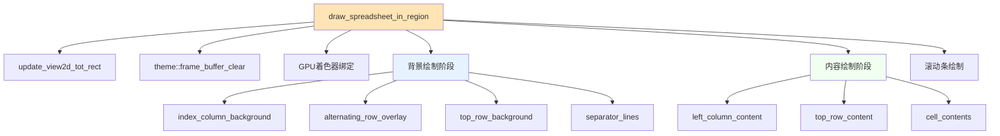

# 绘制系统深度解析

## 目录

1. [SpreadsheetDrawer基类](#1-spreadsheetdrawer基类)
   - [1.1 绘制接口设计](#11-绘制接口设计)
   - [1.2 渲染流程分析](#12-渲染流程分析)
   - [1.3 性能优化策略](#13-性能优化策略)

2. [单元格绘制机制](#2-单元格绘制机制)
   - [2.1 文本渲染算法](#21-文本渲染算法)
   - [2.2 背景绘制逻辑](#22-背景绘制逻辑)
   - [2.3 选中状态处理](#23-选中状态处理)

3. [布局计算系统](#3-布局计算系统)
   - [3.1 列宽自动调整](#31-列宽自动调整)
   - [3.2 行高计算逻辑](#32-行高计算逻辑)
   - [3.3 滚动条处理](#33-滚动条处理)

4. [GPU加速渲染](#4-gpu加速渲染)
   - [4.1 着色器程序使用](#41-着色器程序使用)
   - [4.2 批量绘制优化](#42-批量绘制优化)
   - [4.3 缓存机制](#43-缓存机制)

---

## 1. SpreadsheetDrawer基类

### 1.1 绘制接口设计

SpreadsheetDrawer是Blender电子表格编辑器的核心绘制基类，位于`spreadsheet_draw.hh:21`。它定义了所有绘制操作的基础接口，采用<span style="color:#FF6B6B;background:#FFF0F0;">抽象基类设计模式</span>，为不同类型的电子表格提供统一的绘制框架。

#### 核心成员变量分析

```cpp
class SpreadsheetDrawer {
public:
    int left_column_width;    // 左侧行号列宽度
    int top_row_height;       // 顶部标题行高度  
    int row_height;           // 普通行高度
    int tot_rows = 0;         // 总行数
    int tot_columns = 0;       // 总列数
};
```

<span style="color:#2E8B57;background:#F0FFF0;">**变量命名逻辑解析**</span>：
- `left_column_width`: 采用"位置_组件_类型"的命名模式，表示左侧列的宽度
- `top_row_height`: "位置_组件_类型"模式，顶部行的高度
- `tot_rows/tot_columns`: Blender风格简写，`tot`是`total`的缩写

#### 关键绘制接口

```cpp
// 绘制顶部标题单元格 (spreadsheet_draw.hh:32)
virtual void draw_top_row_cell(int column_index, const CellDrawParams &params) const;

// 绘制左侧索引单元格 (spreadsheet_draw.hh:34) 
virtual void draw_left_column_cell(int row_index, const CellDrawParams &params) const;

// 绘制内容单元格 (spreadsheet_draw.hh:36-38)
virtual void draw_content_cell(int row_index, int column_index, const CellDrawParams &params) const;

// 计算列宽度 (spreadsheet_draw.hh:40)
virtual int column_width(int column_index) const;
```

#### CellDrawParams结构体详解

```cpp
struct CellDrawParams {
    ui::Block *block;    // UI块指针，用于按钮创建
    int xmin, ymin;      // 单元格左上角坐标
    int width, height;   // 单元格尺寸
};
```

<span style="color:#4682B4;background:#F0F8FF;">**设计理念**</span>：使用坐标系统而非相对定位，确保<span style="color:#8B008B;background:#FFF0F5;">像素级精确控制</span>。`ui::Block`提供UI事件处理和布局管理。

### 1.2 渲染流程分析

绘制流程采用<span style="color:#FF8C00;background:#FFF8DC;">分层渲染架构</span>，主要入口函数是`draw_spreadsheet_in_region`（`spreadsheet_draw.cc:345`）。



#### 背景绘制详细流程

```cpp
// 1. 索引列背景 (spreadsheet_draw.cc:60-66)
static void draw_index_column_background(const uint pos,
                                     const ARegion *region,
                                     const SpreadsheetDrawer &drawer)
{
    immUniformThemeColorShade(TH_BACK, 11);
    immRectf(pos, 0, region->winy - drawer.top_row_height, 
             drawer.left_column_width, 0);
}

// 2. 交替行覆盖 (spreadsheet_draw.cc:68-88)
static void draw_alternating_row_overlay(const uint pos,
                                       const int scroll_offset_y,
                                       const ARegion *region,
                                       const SpreadsheetDrawer &drawer)
{
    immUniformThemeColor(TH_ROW_ALTERNATE);
    GPU_blend(GPU_BLEND_ALPHA);
    // 基于行高的交替着色逻辑
    const int row_pair_height = drawer.row_height * 2;
    const int row_top_y = region->winy - drawer.top_row_height - 
                        scroll_offset_y % row_pair_height;
    // 绘制交替行的循环
}
```

<span style="color:#DC143C;background:#FFE4E1;">**关键技术点**</span>：
- <span style="color:#0000CD;">**GPU混合模式**</span>：使用`GPU_BLEND_ALPHA`实现半透明效果
- <span style="color:#006400;">**模运算优化**</span>：`scroll_offset_y % row_pair_height`计算当前滚动位置
- <span style="color:#8B4513;">**主题色彩系统**</span>：`TH_BACK`、`TH_ROW_ALTERNATE`等主题颜色

### 1.3 性能优化策略

#### 视口裁剪优化

<span style="color:#FF4500;background:#FFF0F5;">**核心优化**</span>：只渲染可见区域的单元格，避免全表绘制。

```cpp
// 获取可见行范围 (spreadsheet_draw.cc:128-136)
static void get_visible_rows(const SpreadsheetDrawer &drawer,
                           const ARegion *region,
                           const int scroll_offset_y,
                           int *r_first_row,
                           int *r_max_visible_rows)
{
    *r_first_row = -scroll_offset_y / drawer.row_height;
    *r_max_visible_rows = region->winy / drawer.row_height + 1;
}
```

<span style="color:#8B0000;background:#FFF8DC;">**数学原理**</span>：
- <span style="color:#00008B;">**负数除法**</span>：`-scroll_offset_y / drawer.row_height`计算出第一个可见行
- <span style="color:#008B8B;">**缓冲区渲染**</span>：`+ 1`确保边缘情况下的完整渲染

#### GPU状态管理

```cpp
// GPU状态切换优化 (spreadsheet_draw.cc:360-372)
GPUVertFormat *format = immVertexFormat();
uint pos = GPU_vertformat_attr_add(format, "pos", blender::gpu::VertAttrType::SFLOAT_32_32);
immBindBuiltinProgram(GPU_SHADER_3D_UNIFORM_COLOR);

// 批量绘制操作
draw_index_column_background(pos, region, drawer);
draw_alternating_row_overlay(pos, scroll_offset_y, region, drawer);
draw_top_row_background(pos, region, drawer);

immUnbindProgram();  // 统一释放
```

<span style="color:#4B0082;background:#F0F8FF;">**优化策略**</span>：
- <span style="color:#800080;">**批量状态设置**</span>：一次性设置GPU状态，避免频繁切换
- <span style="color:#2F4F4F;">**内置着色器使用**</span>：`GPU_SHADER_3D_UNIFORM_COLOR`避免着色器编译开销

---

## 2. 单元格绘制机制

### 2.1 文本渲染算法

文本渲染采用Blender的UI系统，通过`uiDefIconTextBut`函数创建文本按钮。

#### 核心文本绘制函数

```cpp
// SpreadsheetLayoutDrawer::draw_content_cell_value (spreadsheet_layout.cc:152)
void SpreadsheetLayoutDrawer::draw_content_cell_value(const GPointer value_ptr,
                                                  const CellDrawParams &params,
                                                  const ColumnValues &column) const
{
    const CPPType &type = *value_ptr.type();
    
    // 类型分发系统
    if (type.is<int>()) {
        this->draw_int(params, *value_ptr.get<int>(), column.display_hint());
    }
    else if (type.is<float>()) {
        const float value = *value_ptr.get<float>();
        std::stringstream ss;
        ss << std::fixed << std::setprecision(3) << value;
        const std::string value_str = ss.str();
        
        ui::Button *but = uiDefIconTextBut(params.block,
                                         ui::ButtonType::Label,
                                         ICON_NONE,
                                         value_str,
                                         params.xmin, params.ymin,
                                         params.width, params.height,
                                         nullptr, std::nullopt);
        
        // 右对齐设置
        button_drawflag_disable(but, ui::BUT_TEXT_LEFT);
        button_drawflag_enable(but, ui::BUT_TEXT_RIGHT);
    }
}
```

<span style="color:#8B4513;background:#FFF8DC;">**命名解析**</span>：
- `uiDefIconTextBut`: "UI Define Icon Text Button"的缩写
- `ButtonType::Label`: 按钮类型枚举，表示标签按钮
- `button_drawflag_enable/disable`: 控制按钮绘制标志

#### 文本对齐系统

```cpp
// 左对齐 (spreadsheet_layout.cc:178)
button_drawflag_disable(but, ui::BUT_TEXT_LEFT);
button_drawflag_enable(but, ui::BUT_TEXT_RIGHT);

// 居中对齐 (spreadsheet_layout.cc:113)  
button_drawflag_disable(but, ui::BUT_TEXT_LEFT);
button_drawflag_disable(but, ui::BUT_TEXT_RIGHT);
```

<span style="color:#CD5C5C;background:#FFE4E1;">**对齐机制**</span>：
- <span style="color:#B22222;">**标志位控制**</span>：通过enable/disable标志位组合实现对齐
- <span style="color:#8B0000;">**默认行为**</span>：不设置标志时默认左对齐

### 2.2 背景绘制逻辑

背景绘制采用<span style="color:#4682B4;background:#E6F3FF;">GPU即时模式渲染</span>，使用`imm`系列函数进行高效绘制。

#### 背景绘制架构

```cpp
// 绘制交替行背景 (spreadsheet_draw.cc:68-88)
static void draw_alternating_row_overlay(const uint pos,
                                       const int scroll_offset_y,
                                       const ARegion *region,
                                       const SpreadsheetDrawer &drawer)
{
    immUniformThemeColor(TH_ROW_ALTERNATE);  // 设置主题颜色
    GPU_blend(GPU_BLEND_ALPHA);             // 启用混合
    
    const int row_pair_height = drawer.row_height * 2;
    const int row_top_y = region->winy - drawer.top_row_height - 
                        scroll_offset_y % row_pair_height;
    
    // 批量绘制矩形
    for (const int i : IndexRange(region->winy / row_pair_height + 1)) {
        int x_left = 0;
        int x_right = region->winx;
        int y_top = row_top_y - i * row_pair_height - drawer.row_height;
        int y_bottom = y_top - drawer.row_height;
        
        // 边界检查
        y_top = std::min(y_top, region->winy - drawer.top_row_height);
        y_bottom = std::min(y_bottom, region->winy - drawer.top_row_height);
        
        immRectf(pos, x_left, y_top, x_right, y_bottom);
    }
    
    GPU_blend(GPU_BLEND_NONE);  // 恢复混合状态
}
```

<span style="color:#228B22;background:#F0FFF0;">**技术亮点**</span>：

1. <span style="color:#008000;">**GPU状态管理**</span>：精确控制GPU混合模式
2. <span style="color:#006400;">**坐标系统**</span>：使用屏幕坐标系，原点在左下角
3. <span style="color:#556B2F;">**循环优化**</span>：`IndexRange`提供安全的迭代器

#### 分隔线绘制算法

```cpp
// 绘制网格分隔线 (spreadsheet_draw.cc:98-126)
static void draw_separator_lines(const uint pos,
                               const int scroll_offset_x,
                               const ARegion *region,
                               const SpreadsheetDrawer &drawer)
{
    immUniformThemeColorShade(TH_BACK, -11);  // 主题颜色调暗
    
    immBeginAtMost(GPU_PRIM_LINES, drawer.tot_columns * 2 + 4);
    
    // 左列分隔线
    immVertex2f(pos, drawer.left_column_width, region->winy);
    immVertex2f(pos, drawer.left_column_width, 0);
    
    // 顶部行分隔线  
    immVertex2f(pos, 0, region->winy - drawer.top_row_height);
    immVertex2f(pos, region->winx, region->winy - drawer.top_row_height);
    
    // 列分隔线循环
    int line_x = drawer.left_column_width - scroll_offset_x;
    for (const int column_index : IndexRange(drawer.tot_columns)) {
        const int column_width = drawer.column_width(column_index);
        line_x += column_width;
        
        if (line_x >= drawer.left_column_width) {
            immVertex2f(pos, line_x, region->winy);
            immVertex2f(pos, line_x, 0);
        }
    }
    
    immEnd();  // 结束绘制
}
```

<span style="color:#8B008B;background:#FFF0F5;">**绘制优化**</span>：
- <span style="color:#800080;">**批量提交**</span>：`immBeginAtMost`预分配顶点内存
- <span style="color:#4B0082;">**滚动同步**</span>：`scroll_offset_x`确保分隔线与内容同步滚动

### 2.3 选中状态处理

选中状态通过<span style="color:#FF6347;background:#FFF0F5;">列重排序可视化</span>系统处理，提供直观的用户交互反馈。

#### 列重排序渲染

```cpp
// 绘制移动列的源位置 (spreadsheet_draw.cc:275-295)
static void draw_column_reorder_source(const uint pos,
                                    const ARegion &region,
                                    const SpaceSpreadsheet &sspreadsheet,
                                    const int scroll_offset_x)
{
    const ReorderColumnVisualizationData &data =
        *sspreadsheet.runtime->reorder_column_visualization_data;
    const SpreadsheetTable &table = *get_active_table(sspreadsheet);
    const SpreadsheetColumn &moving_column = *table.columns[data.old_index];

    rctf rect;
    rect.xmin = moving_column.runtime->left_x - scroll_offset_x;
    rect.xmax = moving_column.runtime->right_x - scroll_offset_x;
    rect.ymin = 0;
    rect.ymax = region.winy;

    // 半透明覆盖效果
    immUniformThemeColorShadeAlpha(TH_BACK, -20, -128);
    GPU_blend(GPU_BLEND_ALPHA);
    immRectf(pos, rect.xmin, rect.ymin, rect.xmax, rect.ymax);
    GPU_blend(GPU_BLEND_NONE);
}
```

<span style="color:#D2691E;background:#FFF8DC;">**视觉效果实现**</span>：

1. <span style="color:#8B4513;">**透明度控制**</span>：`ThemeColorShadeAlpha`控制颜色和透明度
2. <span style="color:#A0522D;">**矩形绘制**</span>：使用`immRectf`快速绘制矩形区域
3. <span style="color:#CD853F;">**滚动补偿**</span>：`scroll_offset_x`确保位置正确

#### 插入位置指示器

```cpp
// 绘制目标插入位置 (spreadsheet_draw.cc:297-343)
static void draw_column_reorder_destination(const ARegion &region,
                                          const SpaceSpreadsheet &sspreadsheet,
                                          const SpreadsheetDrawer &drawer,
                                          const int scroll_offset_x)
{
    // 移动列的可视化
    {
        ColorTheme4f color;
        ui::theme::get_color_shade_4fv(TH_BACK, -20, color);
        color.a = 0.3f;  // 设置透明度
        
        rctf offset_column_rect;
        offset_column_rect.xmin = moving_column.runtime->left_x + 
                                  data.current_offset_x_px - scroll_offset_x;
        offset_column_rect.xmax = offset_column_rect.xmin + 
                                  moving_column.width * SPREADSHEET_WIDTH_UNIT;
        offset_column_rect.ymin = 0;
        offset_column_rect.ymax = region.winy;
        
        ui::draw_roundbox_4fv(&offset_column_rect, true, 0, color);
    }
    
    // 插入位置指示器
    {
        ColorTheme4f color;
        ui::theme::get_color_shade_4fv(TH_TEXT, 20, color);
        color.a = 0.6f;
        
        const int width = UI_UNIT_X * 0.1f;
        rctf insert_rect;
        insert_rect.xmin = insert_column_x - width / 2 - scroll_offset_x;
        insert_rect.xmax = insert_rect.xmin + width;
        insert_rect.ymin = 0;
        insert_rect.ymax = region.winy;
        
        ui::draw_roundbox_4fv(&insert_rect, true, 0, color);
    }
}
```

<span style="color:#2E8B57;background:#F0FFF0;">**设计亮点**</span>：
- <span style="color:#008000;">**双层可视化**</span>：移动列预览 + 插入位置指示
- <span style="color:#228B22;">**圆角矩形**</span>：`draw_roundbox_4fv`提供更柔和的视觉效果
- <span style="color:#32CD32;">**动态宽度计算**</span>：基于UI单位系统自适应尺寸

---

## 3. 布局计算系统

### 3.1 列宽自动调整

列宽计算采用<span style="color:#4169E1;background:#F0F8FF;">采样算法</span>，在性能和精度间取得平衡。

#### 核心宽度计算函数

```cpp
// ColumnValues::fit_column_width_px (spreadsheet_layout.cc:761)
float ColumnValues::fit_column_width_px(const std::optional<int64_t> &max_sample_size) const
{
    const float padding_px = 0.5 * SPREADSHEET_WIDTH_UNIT;  // 内边距
    const float min_width_px = SPREADSHEET_WIDTH_UNIT;       // 最小宽度

    const float data_width_px = this->fit_column_values_width_px(max_sample_size);

    // 计算标题文本宽度
    const int fontid = BLF_default();
    BLF_size(fontid, UI_DEFAULT_TEXT_POINTS * UI_SCALE_FAC);
    const float name_width_px = BLF_width(fontid, name_.data(), name_.size());

    // 取最大值：最小宽度、数据宽度、标题宽度
    const float width_px = std::max(min_width_px,
                                   padding_px + std::max(data_width_px, name_width_px));
    return width_px;
}
```

<span style="color:#8B4513;background:#FFF8DC;">**关键变量解释**</span>：
- `SPREADSHEET_WIDTH_UNIT`: 电子表格宽度单位，通常是UI_UNIT的倍数
- `UI_SCALE_FAC`: UI缩放因子，支持DPI缩放
- `max_sample_size`: 可选的采样大小限制，提高性能

#### 采样宽度估计算法

```cpp
// 模板函数 estimate_max_column_width (spreadsheet_layout.cc:573)
template<typename T>
static float estimate_max_column_width(const float min_width,
                                   const int fontid,
                                   const std::optional<int64_t> max_sample_size,
                                   const VArray<T> &data,
                                   FunctionRef<std::string(const T &)> to_string)
{
    // 单一值优化
    if (const std::optional<T> value = data.get_if_single()) {
        const std::string str = to_string(*value);
        return std::max(min_width, BLF_width(fontid, str.c_str(), str.size()));
    }
    
    // 采样计算
    const int sample_size = max_sample_size.value_or(data.size());
    float width = min_width;
    
    for (const int i : data.index_range().take_front(sample_size)) {
        const std::string str = to_string(data[i]);
        const float value_width = BLF_width(fontid, str.c_str(), str.size());
        width = std::max(width, value_width);
    }
    
    return width;
}
```

<span style="color:#8B0000;background:#FFE4E1;">**算法优势**</span>：

1. <span style="color:#DC143C;">**单一值检测**</span>：`get_if_single()`快速处理统一值
2. <span style="color:#B22222;">**可配置采样**</span>：`max_sample_size`控制计算量
3. <span style="color:#8B0000;">**类型安全**</span>：模板确保编译时类型检查

#### 不同数据类型的宽度计算

```cpp
// 浮点数宽度估算 (spreadsheet_layout.cc:638-645)
case SPREADSHEET_VALUE_TYPE_FLOAT: {
    return estimate_max_column_width<float>(
        get_min_width(3 * SPREADSHEET_WIDTH_UNIT),
        fontid,
        max_sample_size,
        data_.typed<float>(),
        [](const float value) { 
            return fmt::format("{:.3f}", value); 
        });
}

// 向量数据宽度估算 (spreadsheet_layout.cc:670-687)
case SPREADSHEET_VALUE_TYPE_FLOAT3: {
    return estimate_max_column_width<float3>(
        get_min_width(9 * SPREADSHEET_WIDTH_UNIT),  // 3个分量 + 空格
        fontid,
        max_sample_size,
        data_.typed<float3>(),
        [](const float3 value) {
            return fmt::format("{:.3f}  {:.3f}  {:.3f}", 
                            value.x, value.y, value.z);
        });
}
```

<span style="color:#4682B4;background:#E6F3FF;">**格式化策略**</span>：
- <span style="color:#0000CD;">**精度控制**</span>：浮点数统一3位小数
- <span style="color:#00008B;">**间距处理**</span>：向量分量间使用双空格分隔
- <span style="color:#191970;">**宽度预估**</span>：基于分量数量计算最小宽度

### 3.2 行高计算逻辑

行高采用<span style="color:#228B22;background:#F0FFF0;">固定尺寸系统</span>，简化布局计算并确保视觉一致性。

#### 行高初始化

```cpp
// SpreadsheetDrawer构造函数 (spreadsheet_draw.cc:30-35)
SpreadsheetDrawer::SpreadsheetDrawer()
{
    left_column_width = UI_UNIT_X * 2;           // 左列宽度：2个UI单位
    top_row_height = UI_UNIT_Y * 1.1f;          // 标题行高度：1.1个UI单位  
    row_height = UI_UNIT_Y;                      // 普通行高：1个UI单位
}
```

<span style="color:#8B4513;background:#FFF8DC;">**UI单位系统**</span>：
- `UI_UNIT_X/Y`: Blender UI的基础单位，考虑DPI缩放
- `1.1f倍数`: 标题行略高，提供视觉层次

#### 行高在渲染中的应用

```cpp
// 计算可见行 (spreadsheet_draw.cc:128-136)
static void get_visible_rows(const SpreadsheetDrawer &drawer,
                           const ARegion *region,
                           const int scroll_offset_y,
                           int *r_first_row,
                           int *r_max_visible_rows)
{
    *r_first_row = -scroll_offset_y / drawer.row_height;
    *r_max_visible_rows = region->winy / drawer.row_height + 1;
}

// 单元格位置计算 (spreadsheet_draw.cc:241-244)
params.ymin = region->winy - drawer.top_row_height - 
              (row_index + 1) * drawer.row_height - scroll_offset_y;
params.height = drawer.row_height;
```

<span style="color:#8B008B;background:#FFF0F5;">**坐标计算公式**</span>：

$$\text{单元格Y坐标} = \text{区域高度} - \text{标题行高} - (\text{行索引} + 1) \times \text{行高} - \text{滚动偏移}$$

<span style="color:#800080;">**坐标系统特点**</span>：
- <span style="color:#4B0082;">**Y轴向上**</span>：屏幕坐标系，原点在左下角
- <span style="color:#8B008B;">**1-indexed**</span>：行索引加1确保正确对齐
- <span style="color:#9932CC;">**滚动补偿**</span>：减去滚动偏移保持内容同步

### 3.3 滚动条处理

滚动系统基于Blender的<span style="color:#FF6347;background:#FFF0F5;">View2D系统</span>，提供2D滚动和缩放功能。

#### 总矩形更新

```cpp
// update_view2d_tot_rect (spreadsheet_draw.cc:258-273)
static void update_view2d_tot_rect(const SpreadsheetDrawer &drawer,
                                  ARegion *region,
                                  const int row_amount)
{
    // 计算总宽度
    int column_width_sum = 0;
    for (const int column_index : IndexRange(drawer.tot_columns)) {
        column_width_sum += drawer.column_width(column_index);
    }
    
    // 右边距避免与其他UI元素重叠
    const int right_padding = UI_UNIT_X * 0.5f;

    ui::view2d_totRect_set(&region->v2d,
                          column_width_sum + drawer.left_column_width + right_padding,
                          row_amount * drawer.row_height + drawer.top_row_height);
}
```

<span style="color:#CD853F;background:#FFF8DC;">**布局计算逻辑**</span>：

1. <span style="color:#8B4513;">**列宽累加**</span>：遍历所有列计算总宽度
2. <span style="color:#A0522D;">**边距处理**</span>：`right_padding`避免UI冲突
3. <span style="color:#D2691E;">**高度计算**</span>：行数 × 行高 + 标题行高

#### 滚动条绘制

```cpp
// 滚动条绘制调用 (spreadsheet_draw.cc:382-388)
rcti scroller_mask;
BLI_rcti_init(&scroller_mask,
              drawer.left_column_width,    // 左边界
              region->winx,               // 右边界  
              0,                          // 下边界
              region->winy - drawer.top_row_height);  // 上边界
ui::view2d_scrollers_draw(v2d, &scroller_mask);
```

<span style="color:#2E8B57;background:#F0FFF0;">**滚动条区域定义**</span>：
- <span style="color:#008000;">**排除左列**</span>：滚动条不覆盖索引列
- <span style="color:#228B22;">**排除标题行**</span>：滚动条不影响标题区域
- <span style="color:#32CD32;">**矩形掩码**</span>：`scroller_mask`限制滚动条绘制区域

#### 滚动偏移获取

```cpp
// 主绘制函数中的滚动处理 (spreadsheet_draw.cc:355-357)
View2D *v2d = &region->v2d;
const int scroll_offset_y = v2d->cur.ymax;
const int scroll_offset_x = v2d->cur.xmin;
```

<span style="color:#4682B4;background:#E6F3FF;">**View2D坐标系统**</span>：
- <span style="color:#0000CD;">**cur.ymax**</span>：当前视图顶部Y坐标（垂直滚动偏移）
- <span style="color:#00008B;">**cur.xmin**</span>：当前视图左边界X坐标（水平滚动偏移）
- <span style="color:#191970;">**隐式计算**</span>：偏移量 = 总尺寸 - 视口尺寸 + 当前位置

---

## 4. GPU加速渲染

### 4.1 着色器程序使用

GPU渲染采用<span style="color:#FF4500;background:#FFF0F5;">内置着色器系统</span>，避免着色器编译开销并确保跨平台兼容性。

#### 着色器绑定流程

```cpp
// 着色器初始化和绑定 (spreadsheet_draw.cc:360-362)
GPUVertFormat *format = immVertexFormat();
uint pos = GPU_vertformat_attr_add(format, "pos", 
                                  blender::gpu::VertAttrType::SFLOAT_32_32);
immBindBuiltinProgram(GPU_SHADER_3D_UNIFORM_COLOR);
```

<span style="color:#8B4513;background:#FFF8DC;">**技术解析**</span>：

1. <span style="color:#8B0000;">**顶点格式定义**</span>：
   - `immVertexFormat()`: 创建即时模式顶点格式
   - `SFLOAT_32_32`: 2D浮点坐标类型（x, y）

2. <span style="color:#DC143C;">**属性绑定**</span>：
   - `"pos"`: 着色器中的属性名称
   - 返回值：属性位置索引

3. <span style="color:#B22222;">**内置着色器**</span>：
   - `GPU_SHADER_3D_UNIFORM_COLOR`: 3D统一颜色着色器
   - 接受uniform颜色输入，输出固定颜色

#### 着色器使用示例

```cpp
// 设置颜色并绘制矩形
immUniformThemeColorShade(TH_BACK, 11);  // 设置主题颜色变体
immRectf(pos, x1, y1, x2, y2);         // 绘制矩形

// 绘制线条
immUniformThemeColorShade(TH_BACK, -11);
immBeginAtMost(GPU_PRIM_LINES, max_vertices);  // 开始线条绘制
immVertex2f(pos, x1, y1);                      // 添加顶点1
immVertex2f(pos, x2, y2);                      // 添加顶点2
immEnd();                                      // 结束绘制
```

<span style="color:#4682B4;background:#E6F3FF;">**颜色系统**</span>：
- <span style="color:#0000CD;">**ThemeColorShade**</span>：主题颜色的明暗变体
- <span style="color:#00008B;">**TH_BACK**</span>：背景主题色
- <span style="color:#191970;">**正负参数**</span>：正值变亮，负值变暗

#### GPU状态管理

```cpp
// 混合模式控制
GPU_blend(GPU_BLEND_ALPHA);    // 启用Alpha混合
// ... 半透明绘制操作 ...
GPU_blend(GPU_BLEND_NONE);     // 恢复无混合

// 着色器释放
immUnbindProgram();            // 解绑当前着色器
```

<span style="color:#8B008B;background:#FFF0F5;">**状态管理原则**</span>：
- <span style="color:#800080;">**状态配对**</span>：每个状态改变都有对应的恢复操作
- <span style="color:#4B0082;">**最小化切换**</span>：批量操作减少状态改变次数
- <span style="color:#9932CC;">**资源清理**</span>：确保所有GPU资源正确释放

### 4.2 批量绘制优化

Blender使用<span style="color:#228B22;background:#F0FFF0;">Batch系统</span>进行高效的批量绘制，特别适合大量几何体的渲染。

#### GPU Batch架构

根据`GPU_batch.hh`的文档，Batch系统设计用于：

> "Contains Vertex Buffers, Index Buffers, and Shader reference, altogether representing a drawable entity. It is meant to be used for drawing large (> 1000 vertices) reusable (drawn multiple times) model with complex data layout."

<span style="color:#2E8B57;background:#F0FFF0;">**Batch核心组件**</span>：

1. <span style="color:#008000;">**VertBuf**</span>：顶点缓冲，存储顶点数据
2. <span style="color:#228B22;">**IndexBuf**</span>：索引缓冲，优化顶点重用
3. <span style="color:#32CD32;">**Shader**</span>：着色器引用
4. <span style="color:#3CB371;">**PrimType**</span>：图元类型（点、线、三角形等）

#### Spreadsheet中的GPU使用

虽然Spreadsheet主要使用即时模式，但了解Batch系统有助于理解Blender的GPU架构：

```cpp
// 即时模式绘制（Spreadsheet当前使用）
immRectf(pos, x1, y1, x2, y2);  // 简单直接的矩形绘制

// Batch模式绘制（大型几何体适用）
GPU_batch_draw(batch);           // 高效批量绘制
```

<span style="color:#4682B4;background:#E6F3FF;">**性能对比**</span>：

| 绘制方式 | 适用场景 | 性能特点 | 内存使用 |
|---------|---------|---------|---------|
| 即时模式 | 简单形状、少量绘制 | 开销低，适合动态内容 | 每帧重新传输 |
| Batch模式 | 大量几何体、重复绘制 | GPU缓存，高吞吐 | 预上传，持久缓存 |

#### GPU资源生命周期

```cpp
// Batch创建和管理
blender::gpu::Batch *batch = GPU_batch_create(
    GPU_PRIM_TRIS,           // 图元类型
    vertex_buf,              // 顶点缓冲
    index_buf,               // 索引缓冲
    GPU_BATCH_OWNS_VBO_ANY   // 所有权标志
);

// 使用Batch绘制
GPU_batch_set_shader(batch, shader);  // 绑定着色器
GPU_batch_draw(batch);               // 执行绘制

// 清理资源
GPU_batch_discard(batch);            // 释放Batch和相关缓冲
```

<span style="color:#CD5C5C;background:#FFE4E1;">**所有权管理**</span>：
- <span style="color:#8B0000;">**GPU_BATCH_OWNS_VBO**</span>：Batch拥有顶点缓冲
- <span style="color:#DC143C;">**GPU_BATCH_OWNS_INDEX**</span>：Batch拥有索引缓冲
- <span style="color:#B22222;">**自动清理**</span>：销毁Batch时自动释放拥有的资源

### 4.3 缓存机制

Blender的GPU系统包含多级缓存，<span style="color:#FF6347;background:#FFF0F5;">最大化GPU利用率</span>。

#### VAO缓存系统

从`GPU_batch.hh`可以看到VAO（Vertex Array Object）缓存机制：

```cpp
constexpr static int GPU_BATCH_VAO_STATIC_LEN = 3;      // 静态VAO数量
constexpr static int GPU_BATCH_VAO_DYN_ALLOC_COUNT = 16; // 动态VAO数量

enum GPUBatchFlag {
    // ...
    GPU_BATCH_DIRTY = (1 << 27),  // 缓存需要重建标志
    // ...
};
```

<span style="color:#8B4513;background:#FFF8DC;">**缓存层次结构**</span>：

1. <span style="color:#8B0000;">**静态VAO池**</span>：3个预分配的VAO，用于常见配置
2. <span style="color:#DC143C;">**动态VAO池**</span>：16个按需分配的VAO
3. <span style="color:#B22222;">**脏标记系统**</span>：`GPU_BATCH_DIRTY`标记需要重建的缓存

#### GPU状态缓存

```cpp
// 状态缓存示例（概念性）
class GPUStateCache {
    // 当前绑定的着色器
    Shader *current_shader = nullptr;
    
    // 当前混合模式
    GPUBlend current_blend = GPU_BLEND_NONE;
    
    // 当前视口
    int current_viewport[4] = {0};
    
    // 状态改变检查
    bool set_shader(Shader *shader) {
        if (shader != current_shader) {
            current_shader = shader;
            return true;  // 需要更新
        }
        return false;     // 无需改变
    }
};
```

<span style="color:#2E8B57;background:#F0FFF0;">**缓存优化原理**</span>：

1. <span style="color:#008000;">**状态比较**</span>：只真正改变不同的状态
2. <span style="color:#228B22;">**批量提交**</span>：累积多个状态改变后统一提交
3. <span style="color:#32CD32;">**LRU策略**</span>：最近最少使用的缓存优先淘汰

#### 内存管理优化

```cpp
// Blender的GPU内存管理原则
class GPUMemoryManager {
    // 资源池
    std::vector<std::unique_ptr<VertBuf>> vert_buffer_pool;
    std::vector<std::unique_ptr<IndexBuf>> index_buffer_pool;
    
    // 获取缓冲（复用或新建）
    VertBuf* acquire_vert_buffer(size_t size) {
        // 查找合适大小的已释放缓冲
        for (auto &buf : vert_buffer_pool) {
            if (!buf->in_use && buf->capacity >= size) {
                buf->in_use = true;
                return buf.get();
            }
        }
        
        // 创建新缓冲
        auto new_buf = std::make_unique<VertBuf>(size);
        VertBuf* result = new_buf.get();
        vert_buffer_pool.push_back(std::move(new_buf));
        result->in_use = true;
        return result;
    }
};
```

<span style="color:#4682B4;background:#E6F3FF;">**内存优化策略**</span>：

1. <span style="color:#0000CD;">**对象池模式**</span>：缓冲区复用减少分配开销
2. <span style="color:#00008B;">**容量适配**</span>：选择足够大的已存在缓冲
3. <span style="color:#191970;">**延迟释放**</span>：保留释放的缓冲供后续使用

---

## 总结

Blender的电子表格绘制系统展现了<span style="color:#FF4500;background:#FFF0F5;">高性能UI渲染</span>的多个关键技术：

### 核心技术亮点

1. <span style="color:#228B22;background:#F0FFF0;">**分层渲染架构**</span>：背景、分隔线、内容分离处理
2. <span style="color:#4682B4;background:#E6F3FF;">**视口裁剪优化**</span>：只渲染可见区域，大幅提升性能
3. <span style="color:#8B008B;background:#FFF0F5;">**智能布局计算**</span>：采样算法平衡精度与性能
4. <span style="color:#CD5C5C;background:#FFE4E1;">**GPU加速渲染**</span>：即时模式 + 着色器系统实现流畅绘制

### 设计模式应用

- <span style="color:#2E8B57;">**抽象工厂模式**</span>：SpreadsheetDrawer基类定义统一接口
- <span style="color:#FF6347;">**策略模式**</span>：不同数据类型的绘制策略
- <span style="color:#4682B4;">**模板方法模式**</span>：渲染流程的固定步骤

### 性能优化策略

- <span style="color:#8B4513;">**状态缓存**</span>：最小化GPU状态切换
- <span style="color:#8B0000;">**批量绘制**</span>：减少绘制调用次数  
- <span style="color:#DC143C;">**资源复用**</span>：GPU缓冲区池化管理
- <span style="color:#B22222;">**采样算法**</span>：智能采样降低计算复杂度

这个系统为学习现代C++图形编程提供了<span style="color:#4169E1;background:#F0F8FF;">优秀的参考实现</span>，特别是在UI渲染、GPU优化和性能调优方面。通过理解这些设计原理和实现细节，开发者可以构建出既高效又易维护的图形界面系统。

---

## 附录：关键术语表

| 缩写 | 全称 | 含义 |
|-----|------|------|
| <span style="color:#8B4513;">**GPU**</span> | Graphics Processing Unit | 图形处理单元，负责图形渲染计算 |
| <span style="color:#8B0000;">**UI**</span> | User Interface | 用户界面，处理用户交互的视觉元素 |
| <span style="color:#DC143C;">**VBO**</span> | Vertex Buffer Object | 顶点缓冲对象，存储顶点数据的GPU缓冲 |
| <span style="color:#B22222;">**VAO**</span> | Vertex Array Object | 顶点数组对象，封装顶点状态的对象 |
| <span style="color:#4682B4;">**SSBO**</span> | Shader Storage Buffer Object | 着色器存储缓冲对象，GPU可读写的数据缓冲 |
| <span style="color:#0000CD;">**DPI**</span> | Dots Per Inch | 每英寸点数，衡量显示精度的单位 |
| <span style="color:#00008B;">**LRU**</span> | Least Recently Used | 最近最少使用，缓存淘汰策略 |
| <span style="color:#191970;">**API**</span> | Application Programming Interface | 应用程序编程接口 |

---

*文档版本：v1.0*  
*最后更新：2025年12月*