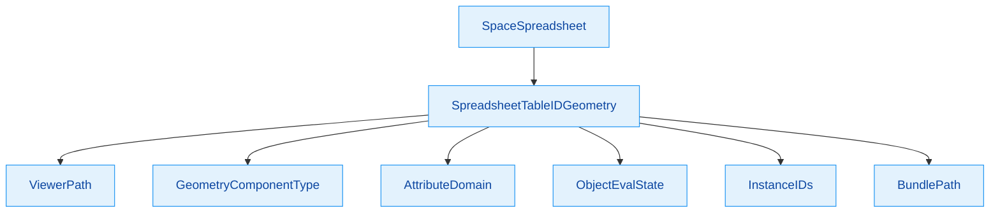
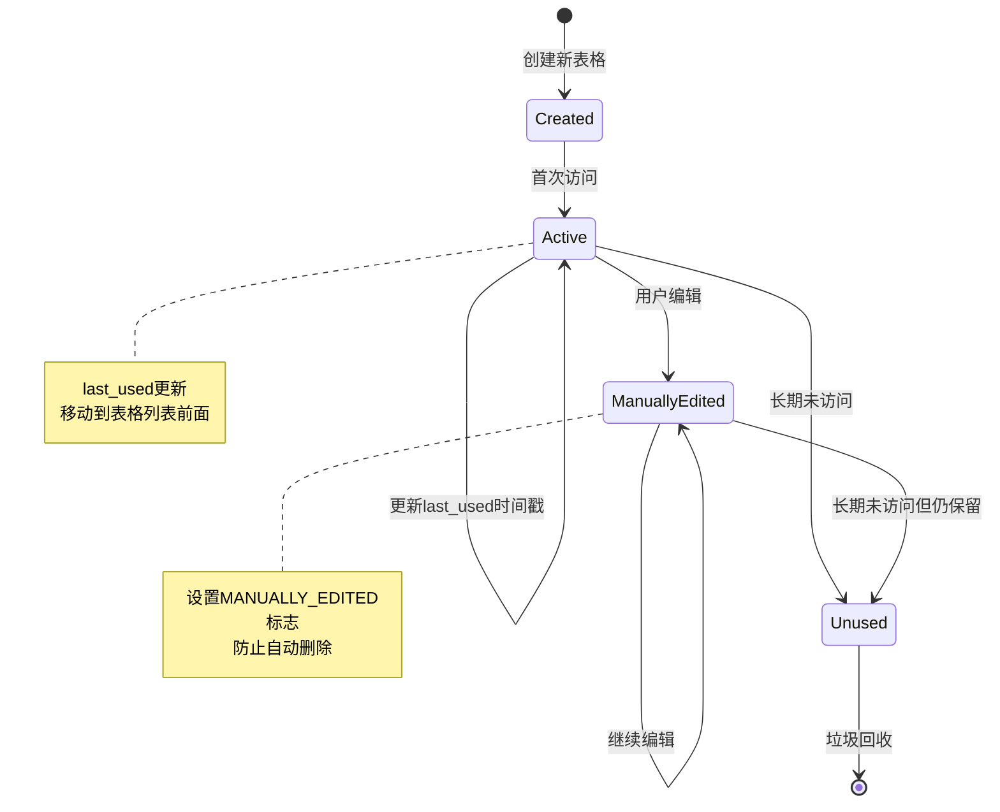
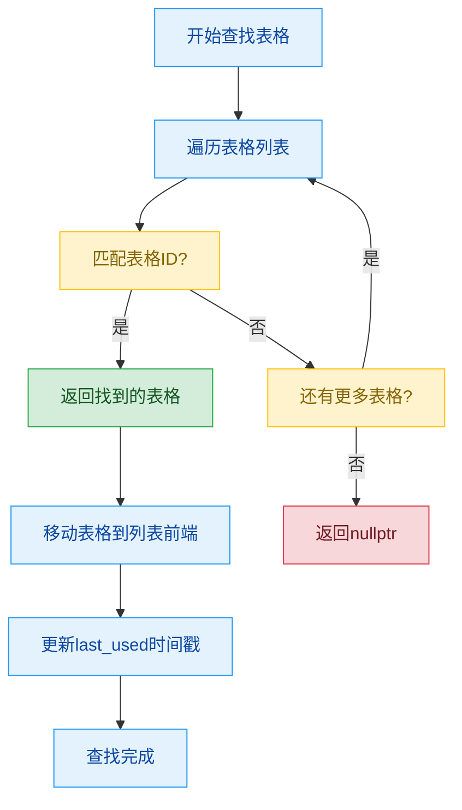
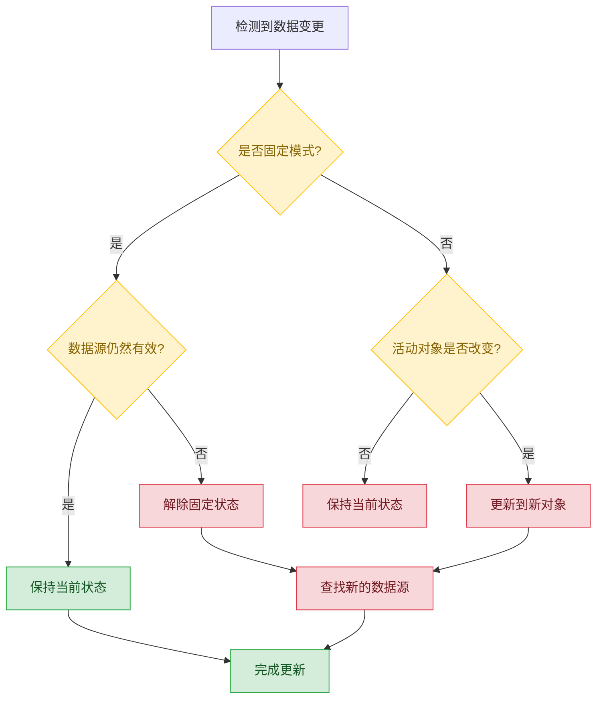
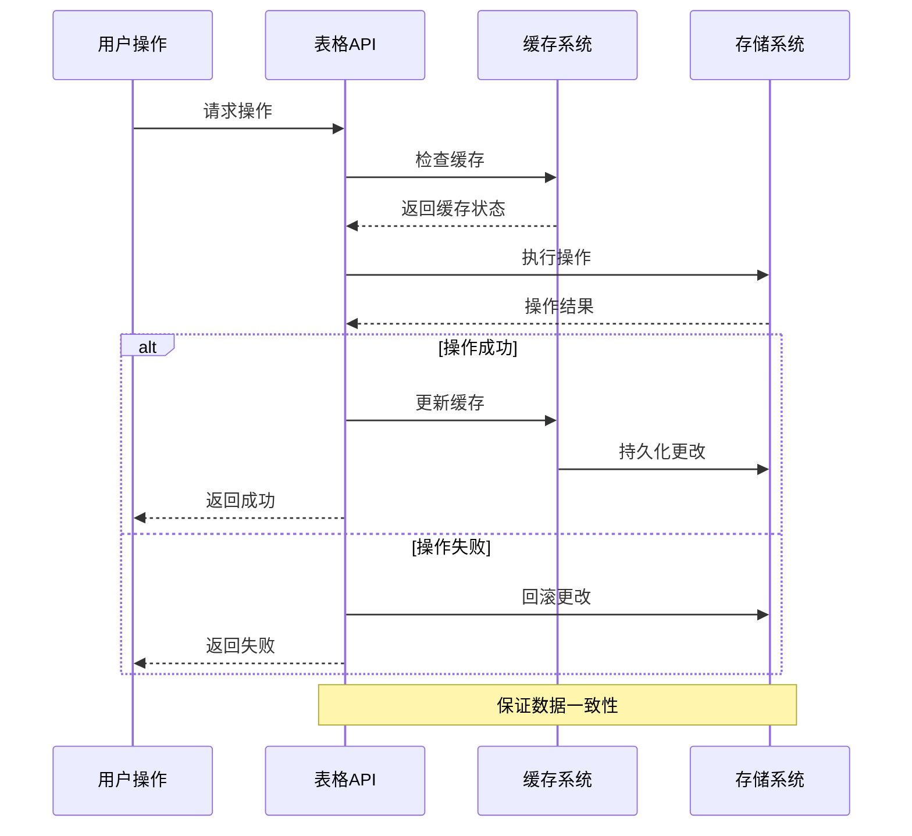

# 表格管理核心机制

## 目录
- [1. SpreadsheetTable结构](#1-spreadsheettable结构)
  - [1.1. 表格标识系统](#11-表格标识系统)
  - [1.2. 状态管理机制](#12-状态管理机制)
  - [1.3. 生命周期控制](#13-生命周期控制)
- [2. 表格缓存系统](#2-表格缓存系统)
  - [2.1. 表格查找算法](#21-表格查找算法)
  - [2.2. LRU缓存策略](#22-lru缓存策略)
  - [2.3. 内存使用优化](#23-内存使用优化)
- [3. 表格同步机制](#3-表格同步机制)
  - [3.1. 数据变更检测](#31-数据变更检测)
  - [3.2. 自动刷新逻辑](#32-自动刷新逻辑)
  - [3.3. 冲突处理策略](#33-冲突处理策略)
- [4. 表格操作接口](#4-表格操作接口)
  - [4.1. CRUD操作实现](#41-crud操作实现)
  - [4.2. 批量操作优化](#42-批量操作优化)
  - [4.3. 事务处理机制](#43-事务处理机制)

---

## 1. SpreadsheetTable结构

### 1.1. 表格标识系统

#### 1.1.1. SpreadsheetTableID 核心概念

<span style="background:#fff3cd;color:#856404;padding:2px 4px;border-radius:3px;">**SpreadsheetTableID**</span> 是 <span style="background:#d1ecf1;color:#0c5460;padding:2px 4px;border-radius:3px;">**Spreadsheet Table Identifier**</span>（电子表格标识符）的缩写，这是 Blender 电子表格系统中用于唯一标识和定位特定表格数据的核心结构。

**定义位置**: `DNA_space_types.h:1198-1216`

```cpp
typedef struct SpreadsheetTable {
  SpreadsheetTableID *id;           // 表格唯一标识符
  SpreadsheetColumn **columns;       // 列数组指针
  int num_columns;                  // 列数量
  uint32_t flag;                    // 表格状态标志
  uint32_t last_used;               // 最后使用时间戳
  uint32_t column_use_clock;        // 列使用时钟计数器
} SpreadsheetTable;
```

#### 1.1.2. 标识符层次结构



#### 1.1.3. 几何数据标识符详解

<span style="background:#f8d7da;color:#721c24;padding:2px 4px;border-radius:3px;">**SpreadsheetTableIDGeometry**</span> 是专门用于几何数据表格的标识符结构：

**定义位置**: `DNA_space_types.h:1156-1196`

```cpp
typedef struct SpreadsheetTableIDGeometry {
  SpreadsheetTableID base;           // 基础标识符
  ViewerPath viewer_path;            // 查看器路径
  int geometry_component_type;       // 几何组件类型
  int attribute_domain;              // 属性域
  int object_eval_state;             // 对象评估状态
  int layer_index;                   // 图层索引
  SpreadsheetInstanceID *instance_ids; // 实例ID数组
  int instance_ids_num;              // 实例ID数量
  SpreadsheetBundlePathElem *bundle_path; // 捆绑路径
  int bundle_path_num;               // 捆绑路径数量
  int8_t closure_input_output;      // 闭包输入输出
} SpreadsheetTableIDGeometry;
```

**变量命名逻辑解析**：
- <span style="color:#007bff;">`viewer_path`</span>: **Viewer Path**（查看器路径）- 用于定位几何节点中的特定查看节点
- <span style="color:#007bff;">`geometry_component_type`</span>: **Geometry Component Type**（几何组件类型）- 标识几何数据的组件类型（网格、曲线、体积等）
- <span style="color:#007bff;">`attribute_domain`</span>: **Attribute Domain**（属性域）- 标识属性的域（点、边、面等）
- <span style="color:#007bff;">`object_eval_state`</span>: **Object Evaluation State**（对象评估状态）- 标识对象的计算状态（原始、评估、查看节点）

#### 1.1.4. 标识符匹配算法

表格标识符的匹配通过 `spreadsheet_table_id_match` 函数实现：

**定义位置**: `spreadsheet_table.cc:145-166`

```cpp
bool spreadsheet_table_id_match(const SpreadsheetTableID &a, const SpreadsheetTableID &b)
{
  if (a.type != b.type) {
    return false;
  }
  const eSpreadsheetTableIDType type = eSpreadsheetTableIDType(a.type);
  switch (type) {
    case SPREADSHEET_TABLE_ID_TYPE_GEOMETRY: {
      const auto &a_ = *reinterpret_cast<const SpreadsheetTableIDGeometry *>(&a);
      const auto &b_ = *reinterpret_cast<const SpreadsheetTableIDGeometry *>(&b);
      return BKE_viewer_path_equal(
                 &a_.viewer_path, &b_.viewer_path, VIEWER_PATH_EQUAL_FLAG_IGNORE_ITERATION) &&
              a_.geometry_component_type == b_.geometry_component_type &&
              a_.attribute_domain == b_.attribute_domain &&
              a_.object_eval_state == b_.object_eval_state && 
              a_.layer_index == b_.layer_index &&
              Span(a_.instance_ids, a_.instance_ids_num) ==
                  Span(b_.instance_ids, b_.instance_ids_num) &&
              Span(a_.bundle_path, a_.bundle_path_num) == Span(b_.bundle_path, b_.bundle_path_num);
    }
  }
  return true;
}
```

**算法特点**：
- 使用 <span style="background:#fff3cd;color:#856404;padding:2px 4px;border-radius:3px;">**VIEWER_PATH_EQUAL_FLAG_IGNORE_ITERATION**</span> 标志忽略几何节点循环的迭代索引
- 逐个比较所有关键字段确保精确匹配
- 使用 `Span` 进行高效的数组比较

### 1.2. 状态管理机制

#### 1.2.1. 表格状态标志

<span style="background:#d4edda;color:#155724;padding:2px 4px;border-radius:3px;">**SPREADSHEET_TABLE_FLAG_MANUALLY_EDITED**</span> 是最重要的表格状态标志，用于标识表格是否被用户手动编辑过：

```cpp
enum eSpreadsheetTableFlag {
  SPREADSHEET_TABLE_FLAG_MANUALLY_EDITED = (1 << 0),  // 手动编辑标志
};
```

#### 1.2.2. 时钟计数器机制

表格和列都使用时钟计数器来跟踪使用情况：

- <span style="color:#28a745;">`table_use_clock`</span>: 表格使用时钟（在 SpaceSpreadsheet 中）
- <span style="color:#28a745;">`last_used`</span>: 表格最后使用时间戳
- <span style="color:#28a745;">`column_use_clock`</span>: 列使用时钟（在 SpreadsheetTable 中）

**时钟更新逻辑**：
**定义位置**: `space_spreadsheet.cc:454-463`

```cpp
/* Update the last used time on the table. */
if (table->last_used < sspreadsheet->table_use_clock || sspreadsheet->table_use_clock == 0) {
  sspreadsheet->table_use_clock++;
  /* Handle clock overflow by just resetting all clocks. */
  if (sspreadsheet->table_use_clock == 0) {
    for (SpreadsheetTable *table : Span(sspreadsheet->tables, sspreadsheet->num_tables)) {
      table->last_used = sspreadsheet->table_use_clock;
    }
  }
  table->last_used = sspreadsheet->table_use_clock;
}
```

#### 1.2.3. 状态转换流程图



### 1.3. 生命周期控制

#### 1.3.1. 表格创建流程

<span style="background:#cce5ff;color:#004085;padding:2px 4px;border-radius:3px;">**spreadsheet_table_new**</span> 函数负责创建新的表格实例：

**定义位置**: `spreadsheet_table.cc:168-173`

```cpp
SpreadsheetTable *spreadsheet_table_new(SpreadsheetTableID *table_id)
{
  SpreadsheetTable *spreadsheet_table = MEM_callocN<SpreadsheetTable>(__func__);
  spreadsheet_table->id = table_id;
  return spreadsheet_table;
}
```

**内存管理特点**：
- 使用 `MEM_callocN` 进行零初始化内存分配
- `__func__` 作为分配标识符用于内存调试
- 表格ID所有权转移到新表格

#### 1.3.2. 表格销毁机制

<span style="background:#f8d7da;color:#721c24;padding:2px 4px;border-radius:3px;">**spreadsheet_table_free**</span> 函数实现完整的表格销毁：

**定义位置**: `spreadsheet_table.cc:186-194`

```cpp
void spreadsheet_table_free(SpreadsheetTable *table)
{
  spreadsheet_table_id_free(table->id);
  for (const int i : IndexRange(table->num_columns)) {
    spreadsheet_column_free(table->columns[i]);
  }
  MEM_SAFE_FREE(table->columns);
  MEM_freeN(table);
}
```

**销毁顺序**：
1. 销毁表格ID及其内容
2. 逐个销毁所有列
3. 释放列数组内存
4. 释放表格结构本身

#### 1.3.3. 表格复制机制

<span style="background:#d4edda;color:#155724;padding:2px 4px;border-radius:3px;">**spreadsheet_table_copy**</span> 函数实现深度复制：

**定义位置**: `spreadsheet_table.cc:175-184`

```cpp
SpreadsheetTable *spreadsheet_table_copy(const SpreadsheetTable &src_table)
{
  SpreadsheetTable *new_table = spreadsheet_table_new(spreadsheet_table_id_copy(*src_table.id));
  new_table->num_columns = src_table.num_columns;
  new_table->columns = MEM_calloc_arrayN<SpreadsheetColumn *>(src_table.num_columns, __func__);
  for (const int i : IndexRange(src_table.num_columns)) {
    new_table->columns[i] = spreadsheet_column_copy(src_table.columns[i]);
  }
  return new_table;
}
```

**复制特点**：
- 深度复制所有子结构
- 保持原始表格的所有状态信息
- 创建新的列数组并逐个复制列

---

## 2. 表格缓存系统

### 2.1. 表格查找算法

#### 2.1.1. 线性查找实现

<span style="background:#fff3cd;color:#856404;padding:2px 4px;border-radius:3px;">**spreadsheet_table_find**</span> 函数使用线性搜索算法查找表格：

**定义位置**: `spreadsheet_table.cc:227-243`

```cpp
const SpreadsheetTable *spreadsheet_table_find(const SpaceSpreadsheet &sspreadsheet,
                                               const SpreadsheetTableID &table_id)
{
  for (const SpreadsheetTable *table : Span{sspreadsheet.tables, sspreadsheet.num_tables}) {
    if (spreadsheet_table_id_match(table_id, *table->id)) {
      return table;
    }
  }
  return nullptr;
}
```

**算法复杂度**: <span style="background:#f8d7da;color:#721c24;padding:2px 4px;border-radius:3px;">$O(n)$</span> 其中 n 是表格数量

#### 2.1.2. 查找优化策略

为了优化查找性能，系统使用了 <span style="color:#007bff;">**LRU（Least Recently Used）**</span> 策略：

- 最近使用的表格会被移动到列表前端
- 这样在连续访问相同表格时可以快速找到

**移动到前端实现**：
**定义位置**: `spreadsheet_table.cc:348-352`

```cpp
void spreadsheet_table_move_to_front(SpaceSpreadsheet &sspreadsheet, SpreadsheetTable &table)
{
  const int old_index = Span(sspreadsheet.tables, sspreadsheet.num_tables).first_index(&table);
  dna::array::move_index(sspreadsheet.tables, sspreadsheet.num_tables, old_index, 0);
}
```

#### 2.1.3. 查找流程图



### 2.2. LRU缓存策略

#### 2.2.1. LRU（Least Recently Used）概念解析

<span style="background:#d1ecf1;color:#0c5460;padding:2px 4px;border-radius:3px;">**LRU**</span> 是 <span style="color:#007bff;">**Least Recently Used**</span>（最近最少使用）的缩写，是一种常见的缓存淘汰策略：

- <span style="color:#28a745;">**核心思想**</span>: 保留最近使用的项目，淘汰最久未使用的项目
- <span style="color:#28a745;">**适用场景**</span>: 数据访问具有时间局部性（最近访问的数据很可能再次被访问）

#### 2.2.2. Blender LRU实现特点

Blender 的 LRU 实现有以下特点：

1. **基于时间戳而非链表**: 使用 `last_used` 时间戳而非双向链表
2. **时钟溢出处理**: 当时钟计数器溢出时重置所有时间戳
3. **手动编辑保护**: 手动编辑过的表格不会被自动删除

#### 2.2.3. LRU数据结构

```cpp
// 空间级别的时钟
uint32_t table_use_clock;  // 在SpaceSpreadsheet中

// 表格级别的使用时间
uint32_t last_used;        // 在SpreadsheetTable中

// 列级别的时钟
uint32_t column_use_clock; // 在SpreadsheetTable中
```

#### 2.2.4. LRU更新时机

表格的 LRU 信息在以下时机更新：

1. **查找表格时**: `spreadsheet_main_region_draw` 函数中
2. **表格被访问时**: 每次绘制或操作时
3. **时钟溢出时**: 自动重置所有时间戳

### 2.3. 内存使用优化

#### 2.3.1. 垃圾回收机制

<span style="background:#f8d7da;color:#721c24;padding:2px 4px;border-radius:3px;">**spreadsheet_table_remove_unused**</span> 函数实现智能垃圾回收：

**定义位置**: `spreadsheet_table.cc:256-304`

```cpp
void spreadsheet_table_remove_unused(SpaceSpreadsheet &sspreadsheet)
{
  uint32_t min_last_used = 0;
  const int max_tables = 50;
  if (sspreadsheet.num_tables > max_tables) {
    Vector<uint32_t> last_used_times;
    for (const SpreadsheetTable *table : Span(sspreadsheet.tables, sspreadsheet.num_tables)) {
      last_used_times.append(table->last_used);
    }
    std::sort(last_used_times.begin(), last_used_times.end());
    min_last_used = last_used_times[sspreadsheet.num_tables - max_tables];
  }

  dna::array::remove_if<SpreadsheetTable *>(
      &sspreadsheet.tables,
      &sspreadsheet.num_tables,
      [&](const SpreadsheetTable *table) {
        if (!(table->flag & SPREADSHEET_TABLE_FLAG_MANUALLY_EDITED)) {
          /* Remove tables that have never been modified manually. */
          return true;
        }
        if (table->last_used < min_last_used) {
          /* The table has not been used for a while and there are too many unused tables. */
          return true;
        }
        // 检查ID是否仍然存在
        switch (eSpreadsheetTableIDType(table->id->type)) {
          case SPREADSHEET_TABLE_ID_TYPE_GEOMETRY: {
            const SpreadsheetTableIDGeometry &table_id =
                *reinterpret_cast<const SpreadsheetTableIDGeometry *>(table->id);
            LISTBASE_FOREACH (ViewerPathElem *, elem, &table_id.viewer_path.path) {
              if (elem->type == VIEWER_PATH_ELEM_TYPE_ID) {
                const IDViewerPathElem &id_elem = reinterpret_cast<const IDViewerPathElem &>(*elem);
                if (!id_elem.id) {
                  /* Remove tables which reference an ID that does not exist anymore. */
                  return true;
                }
              }
            }
            break;
          }
        }
        return false;
      },
      [](SpreadsheetTable **table) { spreadsheet_table_free(*table); });
}
```

#### 2.3.2. 垃圾回收条件

表格会在以下条件满足时被回收：

1. **数量限制**: 表格数量超过50个
2. **未手动编辑**: 没有设置 `SPREADSHEET_TABLE_FLAG_MANUALLY_EDITED` 标志
3. **长期未使用**: `last_used` 时间戳小于阈值
4. **引用ID不存在**: 引用的数据块已被删除

#### 2.3.3. 列级别垃圾回收

列也有类似的垃圾回收机制：

**定义位置**: `spreadsheet_table.cc:306-346`

```cpp
void spreadsheet_table_remove_unused_columns(SpreadsheetTable &table)
{
  /* Might not be reached exactly if there are many columns with the same last used time. */
  const int max_unavailable_columns_target = 50;
  int num_unavailable_columns = 0;
  for (SpreadsheetColumn *column : Span(table.columns, table.num_columns)) {
    if (!column->is_available()) {
      num_unavailable_columns++;
    }
  }
  if (num_unavailable_columns <= max_unavailable_columns_target) {
    /* No need to remove columns. */
    return;
  }

  /* Find the threshold time for unavailable columns to remove. */
  Vector<uint32_t> last_used_times;
  for (SpreadsheetColumn *column : Span(table.columns, table.num_columns)) {
    if (!column->is_available()) {
      last_used_times.append(column->last_used);
    }
  }
  std::sort(last_used_times.begin(), last_used_times.end());
  const int min_last_used = last_used_times[max_unavailable_columns_target];

  dna::array::remove_if<SpreadsheetColumn *>(
      &table.columns,
      &table.num_columns,
      [&](const SpreadsheetColumn *column) {
        if (column->is_available()) {
          /* Available columns should never be removed here. */
          return false;
        }
        if (column->last_used > min_last_used) {
          /* Columns that have been used recently are not removed. */
          return false;
        }
        return true;
      },
      [](SpreadsheetColumn **column) { spreadsheet_column_free(*column); });
}
```

#### 2.3.4. 内存优化效果

通过这些优化机制，系统实现了：

- <span style="color:#28a745;">**内存使用控制**</span>: 限制表格和列的最大数量
- <span style="color:#28a745;">**性能保证**</span>: 保持查找算法在合理时间内完成
- <span style="color:#28a745;">**用户体验**</span>: 保护用户手动编辑的内容

---

## 3. 表格同步机制

### 3.1. 数据变更检测

#### 3.1.1. 上下文更新机制

<span style="background:#d1ecf1;color:#0c5460;padding:2px 4px;border-radius:3px;">**spreadsheet_update_context**</span> 函数负责检测和响应数据变更：

**定义位置**: `space_spreadsheet.cc:226-302`

```cpp
static void spreadsheet_update_context(const bContext *C)
{
  using blender::ed::viewer_path::ViewerPathForGeometryNodesViewer;

  SpaceSpreadsheet *sspreadsheet = CTX_wm_space_spreadsheet(C);
  Object *active_object = CTX_data_active_object(C);
  Object *context_object = blender::ed::viewer_path::parse_object_only(
      sspreadsheet->geometry_id.viewer_path);
  
  switch (eSpaceSpreadsheet_ObjectEvalState(sspreadsheet->geometry_id.object_eval_state)) {
    case SPREADSHEET_OBJECT_EVAL_STATE_ORIGINAL:
    case SPREADSHEET_OBJECT_EVAL_STATE_EVALUATED: {
      if (sspreadsheet->flag & SPREADSHEET_FLAG_PINNED) {
        if (context_object == nullptr) {
          /* Object is not available anymore, so clear the pinning. */
          sspreadsheet->flag &= ~SPREADSHEET_FLAG_PINNED;
        }
        else {
          /* The object is still pinned, do nothing. */
          break;
        }
      }
      else {
        if (active_object != context_object) {
          /* The active object has changed, so view the new active object. */
          view_active_object(C, sspreadsheet);
        }
        else {
          /* Nothing changed. */
          break;
        }
      }
      break;
    }
    case SPREADSHEET_OBJECT_EVAL_STATE_VIEWER_NODE: {
      WorkSpace *workspace = CTX_wm_workspace(C);
      if (sspreadsheet->flag & SPREADSHEET_FLAG_PINNED) {
        const std::optional<ViewerPathForGeometryNodesViewer> parsed_path =
            blender::ed::viewer_path::parse_geometry_nodes_viewer(
                sspreadsheet->geometry_id.viewer_path);
        if (parsed_path.has_value()) {
          if (blender::ed::viewer_path::exists_geometry_nodes_viewer(*parsed_path)) {
            /* The pinned path is still valid, do nothing. */
            break;
          }
          /* The pinned path does not exist anymore, clear pinning. */
          sspreadsheet->flag &= ~SPREADSHEET_FLAG_PINNED;
        }
        else {
          /* Unknown pinned path, clear pinning. */
          sspreadsheet->flag &= ~SPREADSHEET_FLAG_PINNED;
        }
      }
      /* Now try to update the viewer path from the workspace. */
      const std::optional<ViewerPathForGeometryNodesViewer> workspace_parsed_path =
          blender::ed::viewer_path::parse_geometry_nodes_viewer(workspace->viewer_path);
      if (workspace_parsed_path.has_value()) {
        if (BKE_viewer_path_equal(&sspreadsheet->geometry_id.viewer_path,
                                  &workspace->viewer_path,
                                  VIEWER_PATH_EQUAL_FLAG_CONSIDER_UI_NAME))
        {
          /* Nothing changed. */
          break;
        }
        /* Update the viewer path from the workspace. */
        BKE_viewer_path_clear(&sspreadsheet->geometry_id.viewer_path);
        BKE_viewer_path_copy(&sspreadsheet->geometry_id.viewer_path, &workspace->viewer_path);
      }
      else {
        /* No active viewer node, change back to showing evaluated active object. */
        sspreadsheet->geometry_id.object_eval_state = SPREADSHEET_OBJECT_EVAL_STATE_EVALUATED;
        view_active_object(C, sspreadsheet);
      }

      break;
    }
  }
}
```

#### 3.1.2. 变更检测类型

系统能够检测以下类型的变更：

1. **活动对象变更**: `active_object != context_object`
2. **查看节点路径变更**: `viewer_path` 发生变化
3. **数据块删除**: 引用的ID不再存在
4. **评估状态变更**: 对象的评估状态改变

#### 3.1.3. 事件监听机制

通过 <span style="background:#fff3cd;color:#856404;padding:2px 4px;border-radius:3px;">**notifier**</span> 系统监听各种事件：

**定义位置**: `space_spreadsheet.cc:523-568`

```cpp
static void spreadsheet_main_region_listener(const wmRegionListenerParams *params)
{
  ARegion *region = params->region;
  const wmNotifier *wmn = params->notifier;
  SpaceSpreadsheet *sspreadsheet = static_cast<SpaceSpreadsheet *>(params->area->spacedata.first);

  switch (wmn->category) {
    case NC_SCENE: {
      switch (wmn->data) {
        case ND_MODE:
        case ND_FRAME:
        case ND_OB_ACTIVE: {
          ED_region_tag_redraw(region);
          break;
        }
      }
      break;
    }
    case NC_OBJECT: {
      ED_region_tag_redraw(region);
      break;
    }
    case NC_SPACE: {
      if (wmn->data == ND_SPACE_SPREADSHEET) {
        ED_region_tag_redraw(region);
      }
      break;
    }
    case NC_TEXTURE:
    case NC_GEOM: {
      ED_region_tag_redraw(region);
      break;
    }
    case NC_GPENCIL: {
      ED_region_tag_redraw(region);
      break;
    }
    case NC_VIEWER_PATH: {
      if (sspreadsheet->geometry_id.object_eval_state == SPREADSHEET_OBJECT_EVAL_STATE_VIEWER_NODE)
      {
        ED_region_tag_redraw(region);
      }
      break;
    }
  }
}
```

### 3.2. 自动刷新逻辑

#### 3.2.1. 列更新机制

<span style="background:#d4edda;color:#155724;padding:2px 4px;border-radius:3px;">**update_visible_columns**</span> 函数实现列的自动更新：

**定义位置**: `space_spreadsheet.cc:376-429`

```cpp
static void update_visible_columns(SpreadsheetTable &table, DataSource &data_source)
{
  Set<std::reference_wrapper<const SpreadsheetColumnID>> handled_columns;
  Vector<SpreadsheetColumn *, 32> new_columns;
  for (SpreadsheetColumn *column : Span{table.columns, table.num_columns}) {
    if (handled_columns.add(*column->id)) {
      const bool has_data = data_source.get_column_values(*column->id) != nullptr;
      SET_FLAG_FROM_TEST(column->flag, !has_data, SPREADSHEET_COLUMN_FLAG_UNAVAILABLE);
      new_columns.append(column);
    }
  }

  data_source.foreach_default_column_ids(
      [&](const SpreadsheetColumnID &column_id, const bool is_extra) {
        if (handled_columns.contains(column_id)) {
          return;
        }
        std::unique_ptr<ColumnValues> values = data_source.get_column_values(column_id);
        if (!values) {
          return;
        }
        table.column_use_clock++;
        SpreadsheetColumn *column = spreadsheet_column_new(spreadsheet_column_id_copy(&column_id));
        if (is_extra) {
          new_columns.insert(0, column);
        }
        else {
          new_columns.append(column);
        }
        handled_columns.add(*column->id);
      });

  if (Span(table.columns, table.num_columns) == new_columns.as_span()) {
    /* Nothing changed. */
    return;
  }

  /* Update last used times of the columns to support garbage collection. */
  for (SpreadsheetColumn *column : new_columns) {
    const bool clock_was_reset = table.column_use_clock < column->last_used;
    if (clock_was_reset || column->is_available()) {
      column->last_used = table.column_use_clock;
    }
  }

  /* Update the stored column pointers. */
  MEM_SAFE_FREE(table.columns);
  table.columns = MEM_calloc_arrayN<SpreadsheetColumn *>(new_columns.size(), __func__);
  table.num_columns = new_columns.size();
  std::copy_n(new_columns.begin(), new_columns.size(), table.columns);

  /* Remove columns that have not been used for a while when there are too many. */
  spreadsheet_table_remove_unused_columns(table);
}
```

#### 3.2.2. 列可用性检查

系统会检查每列的数据可用性：

- <span style="color:#dc3545;">`SPREADSHEET_COLUMN_FLAG_UNAVAILABLE`</span>: 标记不可用的列
- 数据源不再提供该列数据时设置为不可用
- 不可用列可能会在垃圾回收中被删除

#### 3.2.3. 列添加策略

新列的添加遵循以下策略：

1. **数据驱动**: 只有数据源提供数据的列才会被添加
2. **分类处理**: `is_extra` 决定列的插入位置（前面或后面）
3. **去重检查**: 避免重复添加相同ID的列

### 3.3. 冲突处理策略

#### 3.3.1. 固定模式冲突

当用户启用了 <span style="background:#f8d7da;color:#721c24;padding:2px 4px;border-radius:3px;">**SPREADSHEET_FLAG_PINNED**</span> 标志时：

```cpp
if (sspreadsheet->flag & SPREADSHEET_FLAG_PINNED) {
  if (context_object == nullptr) {
    /* Object is not available anymore, so clear the pinning. */
    sspreadsheet->flag &= ~SPREADSHEET_FLAG_PINNED;
  }
  else {
    /* The object is still pinned, do nothing. */
    break;
  }
}
```

**处理策略**:
- 保持固定的数据源不变
- 只有当数据源完全不可用时才解除固定
- 用户明确的固定设置优先于自动更新

#### 3.3.2. 查看节点路径冲突

对于几何节点的查看节点，系统处理路径冲突：

```cpp
if (blender::ed::viewer_path::exists_geometry_nodes_viewer(*parsed_path)) {
  /* The pinned path is still valid, do nothing. */
  break;
}
/* The pinned path does not exist anymore, clear pinning. */
sspreadsheet->flag &= ~SPREADSHEET_FLAG_PINNED;
```

#### 3.3.3. 冲突解决流程图



---

## 4. 表格操作接口

### 4.1. CRUD操作实现

#### 4.1.1. CRUD概念解析

<span style="background:#d1ecf1;color:#0c5460;padding:2px 4px;border-radius:3px;">**CRUD**</span> 是 <span style="color:#007bff;">**Create, Read, Update, Delete**</span>（创建、读取、更新、删除）的缩写，是数据操作的基本模式：

- <span style="color:#28a745;">**Create**</span>: 创建新的表格或列
- <span style="color:#28a745;">**Read**</span>: 读取和查询表格数据
- <span style="color:#28a745;">**Update**</span>: 更新现有的表格或列
- <span style="color:#28a745;">**Delete**</span>: 删除不需要的表格或列

#### 4.1.2. Create操作实现

**表格创建**：
```cpp
SpreadsheetTable *spreadsheet_table_new(SpreadsheetTableID *table_id)
```

**列创建**：
```cpp
SpreadsheetColumn *spreadsheet_column_new(SpreadsheetColumnID *column_id)
```

**表格添加到空间**：
**定义位置**: `spreadsheet_table.cc:245-254`

```cpp
void spreadsheet_table_add(SpaceSpreadsheet &sspreadsheet, SpreadsheetTable *table)
{
  SpreadsheetTable **new_tables = MEM_calloc_arrayN<SpreadsheetTable *>(
      sspreadsheet.num_tables + 1, __func__);
  std::copy_n(sspreadsheet.tables, sspreadsheet.num_tables, new_tables);
  new_tables[sspreadsheet.num_tables] = table;
  MEM_SAFE_FREE(sspreadsheet.tables);
  sspreadsheet.tables = new_tables;
  sspreadsheet.num_tables++;
}
```

#### 4.1.3. Read操作实现

**表格查找**：
```cpp
SpreadsheetTable *spreadsheet_table_find(SpaceSpreadsheet &sspreadsheet,
                                         const SpreadsheetTableID &table_id)
```

**获取活动表格**：
**定义位置**: `space_spreadsheet.cc:359-366`

```cpp
const SpreadsheetTable *get_active_table(const SpaceSpreadsheet &sspreadsheet)
{
  const SpreadsheetTableID *active_table_id = get_active_table_id(sspreadsheet);
  if (!active_table_id) {
    return nullptr;
  }
  return spreadsheet_table_find(sspreadsheet, *active_table_id);
}
```

#### 4.1.4. Update操作实现

**表格复制**（用于更新）：
```cpp
SpreadsheetTable *spreadsheet_table_copy(const SpreadsheetTable &src_table)
```

**列更新**：
```cpp
void spreadsheet_column_assign_runtime_data(SpreadsheetColumn *column,
                                            eSpreadsheetColumnValueType data_type,
                                            const StringRefNull display_name)
```

#### 4.1.5. Delete操作实现

**表格移除**（垃圾回收形式）：
```cpp
void spreadsheet_table_remove_unused(SpaceSpreadsheet &sspreadsheet)
```

**列移除**：
```cpp
void spreadsheet_table_remove_unused_columns(SpreadsheetTable &table)
```

### 4.2. 批量操作优化

#### 4.2.1. 数组重分配策略

在添加多个表格时，系统使用动态数组重分配：

```cpp
SpreadsheetTable **new_tables = MEM_calloc_arrayN<SpreadsheetTable *>(
    sspreadsheet.num_tables + 1, __func__);
std::copy_n(sspreadsheet.tables, sspreadsheet.num_tables, new_tables);
```

**优化特点**：
- 一次性分配足够空间
- 批量复制现有数据
- 避免频繁的小内存分配

#### 4.2.2. 批量列更新

`update_visible_columns` 函数实现了高效的批量列更新：

1. **批量收集**: 收集所有需要保留的列
2. **批量创建**: 一次性创建新列
3. **批量替换**: 替换整个列数组

#### 4.2.3. 内存池优化

系统使用 `MEM_callocN` 和 `MEM_freeN` 进行内存管理：

- **零初始化分配**: `MEM_callocN` 确保新分配的内存为零
- **类型安全**: 使用模板函数确保类型安全
- **调试支持**: `__func__` 参数用于内存调试

### 4.3. 事务处理机制

#### 4.3.1. Blend文件读写

<span style="background:#d4edda;color:#155724;padding:2px 4px;border-radius:3px;">**blend_write**</span> 和 <span style="background:#f8d7da;color:#721c24;padding:2px 4px;border-radius:3px;">**blend_read**</span> 函数实现了持久化事务：

**写入实现**：
**定义位置**: `spreadsheet_table.cc:196-204`

```cpp
void spreadsheet_table_blend_write(BlendWriter *writer, const SpreadsheetTable *table)
{
  BLO_write_struct(writer, SpreadsheetTable, table);
  spreadsheet_table_id_blend_write(writer, table->id);
  BLO_write_pointer_array(writer, table->num_columns, table->columns);
  for (const int i : IndexRange(table->num_columns)) {
    spreadsheet_column_blend_write(writer, table->columns[i]);
  }
}
```

**读取实现**：
**定义位置**: `spreadsheet_table.cc:206-215`

```cpp
void spreadsheet_table_blend_read(BlendDataReader *reader, SpreadsheetTable *table)
{
  BLO_read_struct(reader, SpreadsheetTableID, &table->id);
  spreadsheet_table_id_blend_read(reader, table->id);
  BLO_read_pointer_array(reader, table->num_columns, reinterpret_cast<void **>(&table->columns));
  for (const int i : IndexRange(table->num_columns)) {
    BLO_read_struct(reader, SpreadsheetColumn, &table->columns[i]);
    spreadsheet_column_blend_read(reader, table->columns[i]);
  }
}
```

#### 4.3.2. ID重映射机制

当Blender文件中的数据块ID发生变化时，系统会进行重映射：

**定义位置**: `spreadsheet_table.cc:217-225`

```cpp
void spreadsheet_table_remap_id(SpreadsheetTable &table, const bke::id::IDRemapper &mappings)
{
  spreadsheet_table_id_remap_id(*table->id, mappings);
}
```

#### 4.3.3. 错误处理和恢复

系统具有以下错误处理机制：

1. **空指针检查**: 在关键操作前检查指针有效性
2. **内存分配失败**: 使用Blender的内存管理系统处理分配失败
3. **数据一致性**: 确保在任何操作中保持数据结构的一致性

#### 4.3.4. 事务处理流程图



---

## 总结

Blender电子表格系统的表格管理核心机制体现了以下几个重要设计原则：

1. **<span style="color:#28a745;">高效缓存</span>**: 使用LRU策略和智能垃圾回收优化内存使用
2. **<span style="color:#28a745;">数据一致性</span>**: 通过完整的CRUD操作和事务处理确保数据完整性  
3. **<span style="color:#28a745;">响应式更新</span>**: 自动检测数据变更并同步更新表格内容
4. **<span style="color:#28a745;">用户友好</span>**: 保护用户手动编辑内容，提供流畅的使用体验

这种设计使得Blender电子表格能够高效处理复杂的几何数据，同时保持良好的性能和用户体验。对于C++学习者来说，这个系统展示了如何在实际项目中应用内存管理、数据结构设计和异步更新等核心概念。