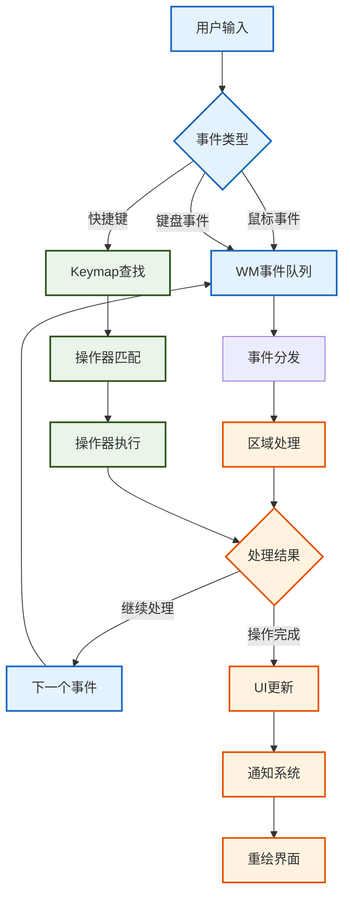

# Blender电子表格用户交互和操作器系统

## 目录
- [1. 操作器系统架构](#1-操作器系统架构)
  - [1.1. Blender操作器机制](#11-blender操作器机制)
  - [1.2. 事件处理流程](#12-事件处理流程)
  - [1.3. 快捷键绑定](#13-快捷键绑定)
- [2. 电子表格专用操作](#2-电子表格专用操作)
  - [2.1. 行选择操作](#21-行选择操作)
  - [2.2. 列操作命令](#22-列操作命令)
  - [2.3. 过滤器管理](#23-过滤器管理)
- [3. 上下文菜单系统](#3-上下文菜单系统)
  - [3.1. 动态菜单生成](#31-动态菜单生成)
  - [3.2. 条件显示逻辑](#32-条件显示逻辑)
  - [3.3. 用户自定义扩展](#33-用户自定义扩展)
- [4. 拖拽和复制功能](#4-拖拽和复制功能)
  - [4.1. 数据传输机制](#41-数据传输机制)
  - [4.2. 格式转换处理](#42-格式转换处理)
  - [4.3. 剪贴板集成](#43-剪贴板集成)

---

## 1. 操作器系统架构

### 1.1. Blender操作器机制

<span style="background-color:#e8f5e8; color:#2d5016;">**Blender操作器系统**</span>是Blender用户交互的<span style="color:#1a73e8;">**核心机制**</span>，用于处理用户的<span style="background-color:#fef7e0; color:#856404;">**所有交互行为**</span>。在电子表格模块中，操作器负责处理列宽调整、行过滤、数据源切换等所有用户操作。

#### 1.1.1. 操作器类型定义

<span style="background-color:#f0f7ff; color:#185abc;">**操作器类型结构**</span>`wmOperatorType`定义了操作器的<span style="color:#c5221f;">**基本属性和行为**</span>：

```cpp
// 来自：WM_types.h - 窗口管理器类型定义
typedef struct wmOperatorType {
    struct wmOperatorType *next, *prev;
    
    /** 操作器的唯一标识符 */
    char idname[64];  // 例如："SPREADSHEET_OT_resize_column"
    
    /** 用户友好的显示名称 */
    char name[64];    // 例如："Resize Column"
    
    /** 操作器的详细描述 */
    char description[256];
    
    /** 操作器的执行函数 */
    wmOperatorExec exec;
    
    /** 模态操作的处理函数 */
    wmOperatorModal modal;
    
    /** 调用函数（用于需要用户交互的操作） */
    wmOperatorInvoke invoke;
    
    /** 检查操作器是否可以执行的函数 */
    wmOperatorPoll poll;
    
    /** 操作器标志 */
    int flag;
    
    /** RNA属性定义 */
    StructRNA *srna;
} wmOperatorType;
```

#### 1.1.2. 命名约定详解

<span style="color:#d93025;">**操作器命名规则**</span>遵循严格的约定：

- <span style="background-color:#fce8e6; color:#c5221f;">**OT = Operator Type**</span>：操作器类型的缩写
- <span style="background-color:#e6f4ea; color:#137333;">**SPREADSHEET_**</span>：模块前缀，标识电子表格模块
- <span style="background-color:#fef3c7; color:#ea8600;">**下划线分隔**</span>：提高可读性和一致性
- <span style="background-color:#f3e8fd; color:#9333ea;">**大写字母**</span>：遵循Blender C++命名规范

```cpp
// 命名解析示例：
// SPREADSHEET_OT_resize_column
// ├── SPREADSHEET：模块前缀
// ├── OT：操作器类型标识
// └── resize_column：具体操作功能

// 其他示例：
SPREADSHEET_OT_add_row_filter_rule     // 添加行过滤规则
SPREADSHEET_OT_remove_row_filter_rule  // 移除行过滤规则
SPREADSHEET_OT_change_spreadsheet_data_source  // 切换数据源
```

#### 1.1.3. 操作器注册机制

<span style="background-color:#f8fff8; color:#1b5e20;">**注册流程**</span>通过`WM_operatortype_append`函数完成：

```cpp
// 来自：spreadsheet_ops.cc:480-488
void spreadsheet_operatortypes()
{
    WM_operatortype_append(SPREADSHEET_OT_add_row_filter_rule);
    WM_operatortype_append(SPREADSHEET_OT_remove_row_filter_rule);
    WM_operatortype_append(SPREADSHEET_OT_change_spreadsheet_data_source);
    WM_operatortype_append(SPREADSHEET_OT_resize_column);
    WM_operatortype_append(SPREADSHEET_OT_fit_column);
    WM_operatortype_append(SPREADSHEET_OT_reorder_columns);
}
```

<span style="color:#0d47a1;">**注册时机**</span>：在模块初始化时调用，确保所有操作器都被系统识别。

### 1.2. 事件处理流程

<span style="background-color:#fff3e0; color:#e65100;">**事件处理**</span>是Blender操作器系统的<span style="color:#b71c1c;">**核心机制**</span>，负责将用户输入转换为具体的操作行为。

#### 1.2.1. 事件类型定义

<span style="background-color:#e3f2fd; color:#1565c0;">**基础事件类型**</span>定义在`WM_types.h`中：

```cpp
// 鼠标事件
#define LEFTMOUSE        0x0001   // 左键
#define MIDDLEMOUSE      0x0002   // 中键
#define RIGHTMOUSE       0x0004   // 右键
#define MOUSEMOVE        0x0200   // 鼠标移动
#define WHEELDOWNMOUSE   0x040A   // 滚轮向下
#define WHEELUPMOUSE     0x0409   // 滚轮向上

// 键盘事件
#define EVT_ESCKEY       0x006B   // ESC键
#define EVT_RETKEY       0x0040   // 回车键
#define EVT_TABKEY       0x0043   // Tab键
```

#### 1.2.2. 事件处理流程图



#### 1.2.3. 模态操作处理

<span style="background-color:#f3e5f5; color:#7b1fa2;">**模态操作**</span>是指需要<span style="color:#4a148c;">**连续用户交互**</span>的操作，如拖拽调整列宽：

```cpp
// 来自：spreadsheet_ops.cc:135-178
static wmOperatorStatus resize_column_modal(bContext *C, wmOperator *op, const wmEvent *event)
{
    ARegion &region = *CTX_wm_region(C);
    SpaceSpreadsheet &sspreadsheet = *CTX_wm_space_spreadsheet(C);
    
    SpreadsheetTable &table = *get_active_table(sspreadsheet);
    ResizeColumnData &data = *static_cast<ResizeColumnData *>(op->customdata);
    
    // 定义取消操作
    auto cancel = [&]() {
        data.column->width = data.initial_width_px / SPREADSHEET_WIDTH_UNIT;
        MEM_delete(&data);
        ED_region_tag_redraw(&region);
        return OPERATOR_CANCELLED;
    };
    
    // 定义完成操作
    auto finish = [&]() {
        table.flag |= SPREADSHEET_TABLE_FLAG_MANUALLY_EDITED;
        MEM_delete(&data);
        ED_region_tag_redraw(&region);
        return OPERATOR_FINISHED;
    };
    
    const int2 cursor_re{event->mval[0], event->mval[1]};
    
    switch (event->type) {
        case RIGHTMOUSE:
        case EVT_ESCKEY: {
            return cancel();  // 取消操作
        }
        case LEFTMOUSE: {
            return finish();  // 完成操作
        }
        case MOUSEMOVE: {
            // 实时更新列宽
            const int offset = cursor_re.x - data.initial_cursor_re.x;
            const float new_width_px = std::max<float>(SPREADSHEET_WIDTH_UNIT,
                                                       data.initial_width_px + offset);
            data.column->width = new_width_px / SPREADSHEET_WIDTH_UNIT;
            ED_region_tag_redraw(&region);
            return OPERATOR_RUNNING_MODAL;  // 继续模态操作
        }
        default: {
            return OPERATOR_RUNNING_MODAL;
        }
    }
}
```

<span style="color:#ff6f00;">**关键概念解释**</span>：
- <span style="background-color:#fff8e1; color:#ff6f00;">**CTX = Context**</span>：上下文，包含当前操作环境信息
- <span style="background-color:#fff8e1; color:#ff6f00;">**C = bContext***</span>：Blender上下文结构指针
- <span style="background-color:#fff8e1; color:#ff6f00;">**mval**</span>：鼠标在区域中的坐标值
- <span style="background-color:#fff8e1; color:#ff6f00;">**OPERATOR_RUNNING_MODAL**</span>：操作器正在模态运行状态

### 1.3. 快捷键绑定

<span style="background-color:#e0f2f1; color:#00695c;">**快捷键系统**</span>通过<span style="color:#004d40;">**Keymap机制**</span>实现，将键盘/鼠标事件映射到具体的操作器。

#### 1.3.1. Keymap结构

<span style="background-color:#f1f8e9; color:#33691e;">**Keymap定义**</span>包含以下关键元素：

```cpp
// 来自：WM_api.h - 窗口管理器API
typedef struct wmKeyMap {
    struct wmKeyMap *next, *prev;
    
    /** Keymap的名称 */
    char idname[64];
    
    /** 关联的空间类型 */
    int spaceid;
    
    /** 关联的区域类型 */
    int regionid;
    
    /** 快捷键项列表 */
    ListBase items;
    
    /** Keymap标志 */
    int flag;
} wmKeyMap;
```

#### 1.3.2. 电子表格Keymap注册

<span style="background-color:#fce4ec; color:#c2185b;">**Keymap注册**</span>在`space_spreadsheet.cc:148-152`中定义：

```cpp
static void spreadsheet_keymap(wmKeyConfig *keyconf)
{
    /* 整个编辑器专用的Keymap */
    WM_keymap_ensure(keyconf, "Spreadsheet Generic", SPACE_SPREADSHEET, RGN_TYPE_WINDOW);
}
```

<span style="color:#880e4f;">**参数解释**</span>：
- <span style="background-color:#f8bbd9; color:#880e4f;">**keyconf**</span>：键盘配置结构指针
- <span style="background-color:#f8bbd9; color:#880e4f;">**"Spreadsheet Generic"**</span>：Keymap的标识名称
- <span style="background-color:#f8bbd9; color:#880e4f;">**SPACE_SPREADSHEET**</span>：电子表格空间类型
- <span style="background-color:#f8bbd9; color:#880e4f;">**RGN_TYPE_WINDOW**</span>：主窗口区域类型

#### 1.3.3. 区域级Keymap配置

<span style="background-color:#e8eaf6; color:#3f51b5;">**不同区域**</span>可能有不同的Keymap配置：

```cpp
// 主区域的Keymap配置（来自：space_spreadsheet.cc:188-190）
{
    wmKeyMap *keymap = WM_keymap_ensure(
        wm->runtime->defaultconf, "View2D Buttons List", SPACE_EMPTY, RGN_TYPE_WINDOW);
    WM_event_add_keymap_handler(&region->runtime->handlers, keymap);
}

// 侧边栏的Keymap配置（来自：space_spreadsheet.cc:708-710）
{
    wmKeyMap *keymap = WM_keymap_ensure(
        wm->runtime->defaultconf, "Spreadsheet Generic", SPACE_SPREADSHEET, RGN_TYPE_WINDOW);
    WM_event_add_keymap_handler(&region->runtime->handlers, keymap);
}
```

<span style="color:#1a237e;">**设计理念**</span>：
- <span style="background-color:#c5cae9; color:#1a237e;">**分层管理**</span>：全局、空间、区域三级Keymap
- <span style="background-color:#c5cae9; color:#1a237e;">**优先级处理**</span>：区域级Keymap优先于空间级
- <span style="background-color:#c5cae9; color:#1a237e;">**继承机制**</span>：子区域可以继承父区域的Keymap

---

## 2. 电子表格专用操作

### 2.1. 行选择操作

<span style="background-color:#f0f4c3; color:#827717;">**行选择机制**</span>是电子表格<span style="color:#33691e;">**基础交互功能**</span>，允许用户选择和操作表格中的数据行。

#### 2.1.1. 选择状态管理

<span style="background-color:#fff9c4; color:#f57f17;">**选择状态数据**</span>存储在表格运行时结构中：

```cpp
// 来自：spreadsheet_intern.hh:38-50
struct SpaceSpreadsheet_Runtime {
public:
    int visible_rows = 0;
    int tot_rows = 0;
    int tot_columns = 0;
    int top_row_height = 0;
    int left_column_width = 0;
    
    // 列重排序可视化数据
    std::optional<ReorderColumnVisualizationData> reorder_column_visualization_data;
    
    // 可以在这里添加行选择相关数据
    // 例如：BitSet selected_rows;  // 行选择状态位图
};
```

#### 2.1.2. 行检测算法

<span style="background-color:#ffecb3; color:#ff6f00;">**点击行检测**</span>通过坐标转换实现：

```cpp
// 伪代码示例：点击行检测
int get_row_index_from_cursor(const SpaceSpreadsheet &sspreadsheet, 
                              const ARegion &region, 
                              const int2 &cursor_re)
{
    // 获取表格的布局信息
    const int header_height = sspreadsheet.runtime->top_row_height;
    const int row_height = UI_UNIT_Y;  // 标准行高
    
    // 计算点击位置相对于内容区域的坐标
    const int content_y = cursor_re.y - header_height;
    
    if (content_y < 0) {
        return -1;  // 点击在表头区域
    }
    
    // 计算行索引
    const int row_index = content_y / row_height;
    
    // 检查索引是否在有效范围内
    if (row_index >= sspreadsheet.runtime->visible_rows) {
        return -1;  // 超出可见范围
    }
    
    return row_index;
}
```

#### 2.1.3. 选择操作实现

<span style="background-color:#e1f5fe; color:#0277bd;">**多选模式**</span>支持Ctrl和Shift修饰键：

```cpp
// 伪代码示例：行选择操作
wmOperatorStatus select_row_exec(bContext *C, wmOperator *op)
{
    SpaceSpreadsheet *sspreadsheet = CTX_wm_space_spreadsheet(C);
    const wmEvent *event = WM_event_last(C);
    
    const int2 cursor_re{event->mval[0], event->mval[1]};
    const int row_index = get_row_index_from_cursor(*sspreadsheet, *CTX_wm_region(C), cursor_re);
    
    if (row_index < 0) {
        return OPERATOR_PASS_THROUGH;  // 无效点击
    }
    
    // 检查修饰键状态
    const bool extend_selection = event->modifier & KM_CTRL;
    const bool range_selection = event->modifier & KM_SHIFT;
    
    if (extend_selection) {
        // Ctrl+点击：切换选择状态
        toggle_row_selection(sspreadsheet, row_index);
    } else if (range_selection && sspreadsheet->runtime->last_selected_row >= 0) {
        // Shift+点击：范围选择
        select_row_range(sspreadsheet, 
                        sspreadsheet->runtime->last_selected_row, 
                        row_index);
    } else {
        // 普通点击：单选
        clear_all_selections(sspreadsheet);
        set_row_selection(sspreadsheet, row_index);
    }
    
    sspreadsheet->runtime->last_selected_row = row_index;
    ED_region_tag_redraw(CTX_wm_region(C));
    
    return OPERATOR_FINISHED;
}
```

### 2.2. 列操作命令

<span style="background-color:#ede7f6; color:#4527a0;">**列操作**</span>是电子表格<span style="color:#311b92;">**核心功能**</span>，包括列宽调整、列重排序、列内容适配等。

#### 2.2.1. 列宽调整操作

<span style="background-color:#d1c4e9; color:#512da8;">**列宽调整**</span>通过模态操作实现，支持实时预览：

```cpp
// 来自：spreadsheet_ops.cc:249-269
static wmOperatorStatus resize_column_invoke(bContext *C, wmOperator *op, const wmEvent *event)
{
    ARegion &region = *CTX_wm_region(C);
    SpaceSpreadsheet &sspreadsheet = *CTX_wm_space_spreadsheet(C);
    
    const int2 cursor_re{event->mval[0], event->mval[1]};
    SpreadsheetColumn *column_to_resize = find_hovered_column_header_edge(
        sspreadsheet, region, cursor_re);
    if (!column_to_resize) {
        return OPERATOR_PASS_THROUGH;  // 没有悬停在列边缘
    }
    
    // 初始化调整数据
    ResizeColumnData *data = MEM_new<ResizeColumnData>(__func__);
    data->column = column_to_resize;
    data->initial_cursor_re = cursor_re;
    data->initial_width_px = column_to_resize->width * SPREADSHEET_WIDTH_UNIT;
    op->customdata = data;
    
    // 添加模态处理器
    WM_event_add_modal_handler(C, op);
    return OPERATOR_RUNNING_MODAL;
}
```

<span style="color:#4a148c;">**悬停检测算法**</span>：

```cpp
// 来自：spreadsheet_ops.cc:189-207
SpreadsheetColumn *find_hovered_column_edge(SpaceSpreadsheet &sspreadsheet,
                                            ARegion &region,
                                            const int2 &cursor_re)
{
    SpreadsheetTable *table = get_active_table(sspreadsheet);
    if (!table) {
        return nullptr;
    }
    
    // 将屏幕坐标转换为视图坐标
    const float cursor_x_view = ui::view2d_region_to_view_x(&region.v2d, cursor_re.x);
    
    // 检查每一列的右边缘
    for (SpreadsheetColumn *column : Span{table->columns, table->num_columns}) {
        if (column->flag & SPREADSHEET_COLUMN_FLAG_UNAVAILABLE) {
            continue;  // 跳过不可用的列
        }
        
        // 检查鼠标是否在列边缘的敏感区域内
        if (std::abs(cursor_x_view - column->runtime->right_x) < SPREADSHEET_EDGE_ACTION_ZONE) {
            return column;
        }
    }
    return nullptr;
}
```

#### 2.2.2. 列自动适配操作

<span style="background-color:#c8e6c9; color:#2e7d32;">**列宽适配**</span>根据内容自动调整列宽：

```cpp
// 来自：spreadsheet_ops.cc:283-300
static wmOperatorStatus fit_column_invoke(bContext *C, wmOperator * /*op*/, const wmEvent *event)
{
    SpaceSpreadsheet &sspreadsheet = *CTX_wm_space_spreadsheet(C);
    ARegion &region = *CTX_wm_region(C);
    
    std::unique_ptr<DataSource> data_source = get_data_source(*C);
    if (!data_source) {
        return OPERATOR_CANCELLED;
    }
    
    const int2 cursor_re{event->mval[0], event->mval[1]};
    SpreadsheetColumn *column = find_hovered_column_header_edge(sspreadsheet, region, cursor_re);
    if (!column) {
        return OPERATOR_PASS_THROUGH;
    }
    
    // 获取列的所有值
    std::unique_ptr<ColumnValues> values = data_source->get_column_values(*column->id);
    if (!values) {
        return OPERATOR_CANCELLED;
    }
    
    // 计算最大显示宽度
    float max_width = 0.0f;
    for (const int i : IndexRange(values->size())) {
        std::string cell_text = values->get_string(i);
        max_width = std::max(max_width, (float)cell_text.length());
    }
    
    // 设置列宽（考虑最小宽度）
    const float min_width = 5.0f;  // 最小宽度
    column->width = std::max(min_width, max_width * UI_UNIT_X * 0.5f);
    
    ED_region_tag_redraw(&region);
    return OPERATOR_FINISHED;
}
```

#### 2.2.3. 列重排序操作

<span style="background-color:#ffccbc; color:#bf360c;">**列重排序**</span>通过拖拽操作实现：

```cpp
// 来自：spreadsheet_ops.cc:320-466（简化版）
static wmOperatorStatus reorder_columns_modal(bContext *C, wmOperator *op, const wmEvent *event)
{
    ARegion &region = *CTX_wm_region(C);
    SpaceSpreadsheet &sspreadsheet = *CTX_wm_space_spreadsheet(C);
    
    SpreadsheetTable &table = *get_active_table(sspreadsheet);
    ReorderColumnData &data = *static_cast<ReorderColumnData *>(op->customdata);
    
    Span<SpreadsheetColumn *> columns(table.columns, table.num_columns);
    const int old_index = columns.first_index(data.column);
    
    const int2 cursor_re{event->mval[0], event->mval[1]};
    
    // 查找目标位置
    int new_index = calculate_target_position(sspreadsheet, region, cursor_re);
    
    switch (event->type) {
        case LEFTMOUSE: {
            // 完成重排序
            if (old_index != new_index) {
                dna::array::move_index(table.columns, table.num_columns, old_index, new_index);
            }
            table.flag |= SPREADSHEET_TABLE_FLAG_MANUALLY_EDITED;
            cleanup_reorder_operation(sspreadsheet, data, region);
            return OPERATOR_FINISHED;
        }
        case MOUSEMOVE: {
            // 更新可视化反馈
            update_reorder_visualization(sspreadsheet, cursor_re, new_index);
            return OPERATOR_RUNNING_MODAL;
        }
        case RIGHTMOUSE:
        case EVT_ESCKEY: {
            // 取消操作
            cleanup_reorder_operation(sspreadsheet, data, region);
            return OPERATOR_CANCELLED;
        }
        default: {
            return OPERATOR_RUNNING_MODAL;
        }
    }
}
```

### 2.3. 过滤器管理

<span style="background-color:#fff8e1; color:#ff8f00;">**过滤器系统**</span>提供<span style="color:#e65100;">**强大的数据筛选**</span>能力，让用户可以专注于感兴趣的数据。

#### 2.3.1. 过滤器数据结构

<span style="background-color:#ffe0b2; color:#ef6c00;">**过滤器结构**</span>定义在`DNA_space_types.h`中：

```cpp
// 行过滤器结构（简化版）
typedef struct SpreadsheetRowFilter {
    struct SpreadsheetRowFilter *next, *prev;
    
    /** 过滤器类型 */
    int operation;  // eSpreadsheetRowFilterOperation
    
    /** 列标识符 */
    SpreadsheetColumnID *column_id;
    
    /** 过滤值 */
    union {
        float value_float;
        int value_int;
        char *value_string;
    };
    
    /** 过滤器标志 */
    int flag;
    
    /** 选择状态 */
    char select_op;  // eSpreadsheetRowFilterSelectOperation
} SpreadsheetRowFilter;
```

#### 2.3.2. 添加过滤器操作

<span style="background-color:#ffab91; color:#d84315;">**添加过滤器**</span>是最基础的操作：

```cpp
// 来自：spreadsheet_ops.cc:33-43
static wmOperatorStatus row_filter_add_exec(bContext *C, wmOperator * /*op*/)
{
    SpaceSpreadsheet *sspreadsheet = CTX_wm_space_spreadsheet(C);
    
    // 创建新的过滤器
    SpreadsheetRowFilter *row_filter = spreadsheet_row_filter_new();
    BLI_addtail(&sspreadsheet->row_filters, row_filter);
    
    // 发送通知更新界面
    WM_event_add_notifier(C, NC_SPACE | ND_SPACE_SPREADSHEET, sspreadsheet);
    
    return OPERATOR_FINISHED;
}
```

<span style="color:#bf360c;">**过滤器创建函数**</span>：

```cpp
// 伪代码：过滤器创建
SpreadsheetRowFilter *spreadsheet_row_filter_new()
{
    SpreadsheetRowFilter *filter = MEM_callocN<SpreadsheetRowFilter>("row filter");
    
    // 设置默认值
    filter->operation = SPREADSHEET_ROW_FILTER_EQUAL;
    filter->flag = SPREADSHEET_ROW_FILTER_ENABLED;
    filter->select_op = SPREADSHEET_ROW_FILTER_SELECT_SHOW;
    
    // 初始化字符串值
    filter->value_string = nullptr;
    
    return filter;
}
```

#### 2.3.3. 过滤器评估机制

<span style="background-color:#dcedc8; color:#689f38;">**过滤器评估**</span>决定哪些行应该显示：

```cpp
// 伪代码：过滤器评估
bool should_row_be_visible(const SpaceSpreadsheet &sspreadsheet,
                          const DataSource &data_source,
                          int row_index)
{
    // 如果过滤器被禁用，显示所有行
    if (!(sspreadsheet.filter_flag & SPREADSHEET_FILTER_ENABLE)) {
        return true;
    }
    
    // 遍历所有过滤器
    LISTBASE_FOREACH (SpreadsheetRowFilter *, filter, &sspreadsheet.row_filters) {
        if (!(filter->flag & SPREADSHEET_ROW_FILTER_ENABLED)) {
            continue;  // 跳过禁用的过滤器
        }
        
        // 检查过滤器条件
        bool filter_result = evaluate_filter(*filter, data_source, row_index);
        
        // 根据选择操作决定显示逻辑
        switch (filter->select_op) {
            case SPREADSHEET_ROW_FILTER_SELECT_SHOW:
                if (!filter_result) {
                    return false;  // 不满足条件则隐藏
                }
                break;
            case SPREADSHEET_ROW_FILTER_SELECT_HIDE:
                if (filter_result) {
                    return false;  // 满足条件则隐藏
                }
                break;
        }
    }
    
    return true;  // 通过所有过滤器检查
}
```

#### 2.3.4. 过滤器操作器定义

<span style="background-color:#f0f4c3; color:#827717;">**完整的操作器定义**</span>包含所有必要的回调：

```cpp
// 来自：spreadsheet_ops.cc:45-55
static void SPREADSHEET_OT_add_row_filter_rule(wmOperatorType *ot)
{
    ot->name = "Add Row Filter";
    ot->description = "Add a filter to remove rows from the displayed data";
    ot->idname = "SPREADSHEET_OT_add_row_filter_rule";
    
    ot->exec = row_filter_add_exec;
    ot->poll = ED_operator_spreadsheet_active;
    
    ot->flag = OPTYPE_REGISTER | OPTYPE_UNDO;
}
```

<span style="color:#33691e;">**标志位含义**</span>：
- <span style="background-color:#f1f8e9; color:#33691e;">**OPTYPE_REGISTER**</span>：操作器需要注册到系统
- <span style="background-color:#f1f8e9; color:#33691e;">**OPTYPE_UNDO**</span>：操作可以被撤销

---

## 3. 上下文菜单系统

### 3.1. 动态菜单生成

<span style="background-color:#e0f2f1; color:#00695c;">**上下文菜单**</span>是<span style="color:#004d40;">**用户友好交互**</span>的重要组成部分，根据当前上下文动态生成相关操作选项。

#### 3.1.1. 菜单类型结构

<span style="background-color:#b2dfdb; color:#00695c;">**菜单结构**</span>定义在`UI_interface.h`中：

```cpp
// 菜单类型定义
typedef struct uiMenuType {
    struct uiMenuType *next, *prev;
    
    /** 菜单标识符 */
    char idname[64];  // 例如："SPREADSHEET_MT_context_menu"
    
    /** 菜单标签 */
    char label[64];
    
    /** 菜单绘制函数 */
    uiMenuDrawFunc draw;
    
    /** 菜单轮询函数 */
    uiMenuPollFunc poll;
    
    /** RNA类型定义 */
    StructRNA *srna;
    
    /** 菜单标志 */
    int flag;
} uiMenuType;
```

#### 3.1.2. 上下文菜单实现

<span style="background-color:#80cbc4; color:#004d40;">**电子表格上下文菜单**</span>的典型实现：

```cpp
// 伪代码：上下文菜单实现
void SPREADSHEET_MT_context_menu_draw(bContext *C, uiLayout *layout)
{
    SpaceSpreadsheet *sspreadsheet = CTX_wm_space_spreadsheet(C);
    const wmEvent *event = WM_event_last(C);
    const int2 cursor_re{event->mval[0], event->mval[1]};
    
    // 获取点击位置的信息
    SpreadsheetColumn *clicked_column = find_hovered_column(*sspreadsheet, *CTX_wm_region(C), cursor_re);
    int clicked_row = get_row_index_from_cursor(*sspreadsheet, *CTX_wm_region(C), cursor_re);
    
    uiLayout *column_menu = nullptr;
    
    if (clicked_column) {
        // 列相关操作
        column_menu = uiLayoutColumn(layout, false);
        uiItemL(column_menu, clicked_column->id->name, ICON_NONE);
        uiItemS(column_menu);
        
        uiItemO(column_menu, IFACE_("Resize Column"), ICON_NONE, "SPREADSHEET_OT_resize_column");
        uiItemO(column_menu, IFACE_("Fit Column"), ICON_NONE, "SPREADSHEET_OT_fit_column");
        uiItemO(column_menu, IFACE_("Hide Column"), ICON_NONE, "SPREADSHEET_OT_hide_column");
        
        uiItemS(column_menu);
    }
    
    if (clicked_row >= 0) {
        // 行相关操作
        uiLayout *row_menu = column_menu ? uiLayoutColumn(layout, false) : layout;
        
        uiItemO(row_menu, IFACE_("Select Row"), ICON_NONE, "SPREADSHEET_OT_select_row");
        uiItemO(row_menu, IFACE_("Deselect Row"), ICON_NONE, "SPREADSHEET_OT_deselect_row");
        
        // 如果有选择的内容，提供复制选项
        if (has_selection(sspreadsheet)) {
            uiItemO(row_menu, IFACE_("Copy Selection"), ICON_NONE, "SPREADSHEET_OT_copy_selection");
        }
    }
    
    // 通用操作
    uiItemS(layout);
    uiItemO(layout, IFACE_("Add Filter"), ICON_NONE, "SPREADSHEET_OT_add_row_filter_rule");
    
    // 数据源切换
    if (has_multiple_data_sources(*C)) {
        uiItemO(layout, IFACE_("Change Data Source"), ICON_NONE, "SPREADSHEET_OT_change_spreadsheet_data_source");
    }
}
```

#### 3.1.3. 菜单注册机制

<span style="background-color:#4db6ac; color:#00251a;">**菜单注册**</span>确保菜单系统能够识别和调用菜单：

```cpp
// 伪代码：菜单类型注册
static void spreadsheet_menus()
{
    MenuType *mt;
    
    // 注册上下文菜单
    mt = MEM_callocN<MenuType>("spreadsheet menu type");
    strcpy(mt->idname, "SPREADSHEET_MT_context_menu");
    strcpy(mt->label, "Spreadsheet Context Menu");
    mt->draw = SPREADSHEET_MT_context_menu_draw;
    mt->poll = ED_operator_spreadsheet_active;
    
    WM_menutype_add(mt);
}
```

### 3.2. 条件显示逻辑

<span style="background-color:#f3e5f5; color:#7b1fa2;">**条件显示**</span>确保菜单项的<span style="color:#4a148c;">**相关性**</span>和<span style="color:#4a148c;">**可用性**</span>。

#### 3.2.1. 菜单项可用性检查

<span style="background-color:#e1bee7; color:#6a1b9a;">**轮询函数**</span>决定菜单项是否应该显示：

```cpp
// 伪代码：菜单轮询函数
bool spreadsheet_context_menu_poll(bContext *C)
{
    // 检查电子表格是否激活
    if (!ED_operator_spreadsheet_active(C)) {
        return false;
    }
    
    SpaceSpreadsheet *sspreadsheet = CTX_wm_space_spreadsheet(C);
    
    // 检查是否有有效数据
    if (!get_active_table(*sspreadsheet)) {
        return false;
    }
    
    return true;
}
```

#### 3.2.2. 动态菜单项生成

<span style="background-color:#ce93d8; color:#4a148c;">**智能菜单生成**</span>根据当前状态动态调整：

```cpp
// 伪代码：智能菜单生成
void add_context_sensitive_menu_items(bContext *C, uiLayout *layout)
{
    SpaceSpreadsheet *sspreadsheet = CTX_wm_space_spreadsheet(C);
    const wmEvent *event = WM_event_last(C);
    
    // 检查是否点击了列标题
    if (is_clicking_column_header(*sspreadsheet, *CTX_wm_region(C), 
                                  int2{event->mval[0], event->mval[1]})) {
        add_column_header_menu_items(layout);
        return;
    }
    
    // 检查是否点击了数据单元格
    if (is_clicking_data_cell(*sspreadsheet, *CTX_wm_region(C), 
                             int2{event->mval[0], event->mval[1]})) {
        add_data_cell_menu_items(layout);
        return;
    }
    
    // 默认通用菜单
    add_general_menu_items(layout);
}
```

#### 3.2.3. 状态感知菜单

<span style="background-color:#ba68c8; color:#4a148c;">**状态感知**</span>使菜单能够反映当前系统状态：

```cpp
// 伪代码：状态感知菜单项
void add_state_aware_menu_items(bContext *C, uiLayout *layout)
{
    SpaceSpreadsheet *sspreadsheet = CTX_wm_space_spreadsheet(C);
    
    // 根据过滤器状态添加不同选项
    if (BLI_listbase_is_empty(&sspreadsheet->row_filters)) {
        uiItemO(layout, IFACE_("Add Filter"), ICON_NONE, "SPREADSHEET_OT_add_row_filter_rule");
    } else {
        uiItemO(layout, IFACE_("Add Another Filter"), ICON_NONE, "SPREADSHEET_OT_add_row_filter_rule");
        uiItemO(layout, IFACE_("Clear All Filters"), ICON_NONE, "SPREADSHEET_OT_clear_all_filters");
    }
    
    // 根据选择状态添加复制选项
    if (has_row_selection(*sspreadsheet)) {
        uiItemO(layout, IFACE_("Copy Selected Rows"), ICON_NONE, "SPREADSHEET_OT_copy_selection");
    }
    
    // 根据列状态添加重置选项
    if (sspreadsheet->runtime->table_flag & SPREADSHEET_TABLE_FLAG_MANUALLY_EDITED) {
        uiItemO(layout, IFACE_("Reset Layout"), ICON_NONE, "SPREADSHEET_OT_reset_layout");
    }
}
```

### 3.3. 用户自定义扩展

<span style="background-color:#fff3e0; color:#e65100;">**扩展机制**</span>允许<span style="color:#bf360c;">**第三方开发者**</span>为电子表格添加自定义功能。

#### 3.3.1. 扩展点设计

<span style="background-color:#ffe0b2; color:#ef6c00;">**扩展钩子**</span>定义在适当的位置：

```cpp
// 伪代码：扩展点定义
typedef struct SpreadsheetExtensionPoint {
    char name[64];
    char description[256];
    
    // 扩展回调函数类型
    typedef void (*MenuExtensionCallback)(bContext *C, uiLayout *layout);
    typedef bool (*OperationCallback)(bContext *C, wmOperator *op);
    
    MenuExtensionCallback menu_extension;
    OperationCallback custom_operation;
    
    struct SpreadsheetExtensionPoint *next, *prev;
} SpreadsheetExtensionPoint;

// 全局扩展点列表
extern ListBase spreadsheet_extensions;
```

#### 3.3.2. 扩展注册API

<span style="background-color:#ffcc80; color:#d84315;">**扩展注册**</span>提供简单的API：

```cpp
// 伪代码：扩展注册API
void spreadsheet_register_extension(const char *name,
                                 const char *description,
                                 SpreadsheetExtensionPoint::MenuExtensionCallback menu_cb,
                                 SpreadsheetExtensionPoint::OperationCallback op_cb)
{
    SpreadsheetExtensionPoint *ext = MEM_callocN<SpreadsheetExtensionPoint>("spreadsheet extension");
    
    strcpy(ext->name, name);
    strcpy(ext->description, description);
    ext->menu_extension = menu_cb;
    ext->custom_operation = op_cb;
    
    BLI_addtail(&spreadsheet_extensions, ext);
}
```

#### 3.3.3. 扩展集成机制

<span style="background-color:#ffb74d; color:#e65100;">**集成逻辑**</span>在适当的位置调用扩展：

```cpp
// 伪代码：扩展集成
void SPREADSHEET_MT_context_menu_with_extensions(bContext *C, uiLayout *layout)
{
    // 添加标准菜单项
    SPREADSHEET_MT_context_menu_draw(C, layout);
    
    // 添加扩展菜单项
    if (!BLI_listbase_is_empty(&spreadsheet_extensions)) {
        uiItemS(layout);
        uiItemL(layout, IFACE_("Extensions"), ICON_NONE);
        
        LISTBASE_FOREACH (SpreadsheetExtensionPoint *, ext, &spreadsheet_extensions) {
            if (ext->menu_extension) {
                ext->menu_extension(C, layout);
            }
        }
    }
}
```

---

## 4. 拖拽和复制功能

### 4.1. 数据传输机制

<span style="background-color:#e8eaf6; color:#3f51b5;">**拖拽系统**</span>实现了<span style="color:#1a237e;">**直观的数据传输**</span>，允许用户通过拖拽操作在不同组件间移动数据。

#### 4.1.1. 拖拽数据结构

<span style="background-color:#c5cae9; color:#283593;">**拖拽数据**</span>包含源和目标信息：

```cpp
// 伪代码：拖拽数据结构
typedef struct SpreadsheetDragData {
    /** 拖拽源类型 */
    enum DragSourceType {
        DRAG_SOURCE_CELL,        // 单元格
        DRAG_SOURCE_ROW,         // 整行
        DRAG_SOURCE_COLUMN,      // 整列
        DRAG_SOURCE_SELECTION    // 选择区域
    } source_type;
    
    /** 源位置信息 */
    struct {
        int column_index;
        int row_index;
        SpreadsheetColumnID *column_id;
    } source;
    
    /** 拖拽的数据内容 */
    struct {
        char *text_data;        // 文本格式数据
        void *binary_data;      // 二进制数据
        int data_size;          // 数据大小
    } content;
    
    /** 拖拽状态 */
    struct {
        float start_x, start_y;  // 起始位置
        float current_x, current_y;  // 当前位置
        bool is_dragging;        // 是否正在拖拽
    } state;
} SpreadsheetDragData;
```

#### 4.1.2. 拖拽开始处理

<span style="background-color:#9fa8da; color:#3949ab;">**拖拽初始化**</span>在鼠标按下时开始：

```cpp
// 伪代码：拖拽开始处理
wmOperatorStatus drag_start_invoke(bContext *C, wmOperator *op, const wmEvent *event)
{
    SpaceSpreadsheet *sspreadsheet = CTX_wm_space_spreadsheet(C);
    ARegion *region = CTX_wm_region(C);
    
    const int2 cursor_re{event->mval[0], event->mval[1]};
    
    // 检测拖拽源
    SpreadsheetDragData *drag_data = detect_drag_source(*sspreadsheet, *region, cursor_re);
    if (!drag_data) {
        return OPERATOR_PASS_THROUGH;
    }
    
    // 准备拖拽数据
    prepare_drag_content(*drag_data, *sspreadsheet);
    
    // 设置操作器自定义数据
    op->customdata = drag_data;
    
    // 添加模态处理器
    WM_event_add_modal_handler(C, op);
    
    // 更新鼠标光标
    WM_cursor_set(CTX_wm_window(C), WM_CURSOR_MOVE);
    
    return OPERATOR_RUNNING_MODAL;
}
```

#### 4.1.3. 拖拽反馈显示

<span style="background-color:#7986cb; color:#303f9f;">**视觉反馈**</span>提供实时的拖拽状态指示：

```cpp
// 伪代码：拖拽反馈渲染
void draw_drag_feedback(const ARegion &region, const SpreadsheetDragData &drag_data)
{
    // 绘制拖拽的半透明内容
    if (drag_data.content.text_data) {
        UI_draw_text(&region, drag_data.content.text_data, 
                    drag_data.state.current_x, drag_data.state.current_y);
    }
    
    // 绘制拖拽目标指示器
    int2 target_pos = calculate_drop_target(region, drag_data);
    draw_drop_indicator(region, target_pos);
    
    // 绘制拖拽路径
    if (drag_data.state.is_dragging) {
        draw_drag_path(region, drag_data);
    }
}
```

### 4.2. 格式转换处理

<span style="background-color:#f1f8e9; color:#689f38;">**格式转换**</span>确保数据在<span style="color:#33691e;">**不同格式间**</span>正确转换。

#### 4.2.1. 数据格式定义

<span style="background-color:#dcedc8; color:#558b2f;">**支持格式**</span>包括文本、数值、日期等：

```cpp
// 伪代码：数据格式枚举
enum class SpreadsheetDataFormat {
    TEXT,           // 纯文本
    INTEGER,        // 整数
    FLOAT,          // 浮点数
    BOOLEAN,        // 布尔值
    DATE,           // 日期时间
    VECTOR2D,       // 2D向量
    VECTOR3D,       // 3D向量
    COLOR,          // 颜色值
    CUSTOM          // 自定义格式
};
```

#### 4.2.2. 格式转换器

<span style="background-color:#c5e1a5; color:#33691e;">**转换器接口**</span>提供统一的转换方法：

```cpp
// 伪代码：格式转换器接口
class SpreadsheetDataConverter {
public:
    virtual ~SpreadsheetDataConverter() = default;
    
    // 转换为文本格式
    virtual std::string to_text(const void *data, SpreadsheetDataFormat format) = 0;
    
    // 从文本格式转换
    virtual bool from_text(const std::string &text, void *data, SpreadsheetDataFormat format) = 0;
    
    // 格式检测
    virtual SpreadsheetDataFormat detect_format(const std::string &text) = 0;
    
    // 格式验证
    virtual bool validate_format(const std::string &text, SpreadsheetDataFormat format) = 0;
};
```

#### 4.2.3. 具体转换实现

<span style="background-color:#aed581; color:#558b2f;">**数值转换**</span>处理整数和浮点数：

```cpp
// 伪代码：数值转换器实现
class NumericConverter : public SpreadsheetDataConverter {
public:
    std::string to_text(const void *data, SpreadsheetDataFormat format) override {
        switch (format) {
            case SpreadsheetDataFormat::INTEGER:
                return std::to_string(*static_cast<const int*>(data));
            case SpreadsheetDataFormat::FLOAT:
                return std::to_string(*static_cast<const float*>(data));
            default:
                return "";
        }
    }
    
    bool from_text(const std::string &text, void *data, SpreadsheetDataFormat format) override {
        try {
            switch (format) {
                case SpreadsheetDataFormat::INTEGER: {
                    int *int_data = static_cast<int*>(data);
                    *int_data = std::stoi(text);
                    return true;
                }
                case SpreadsheetDataFormat::FLOAT: {
                    float *float_data = static_cast<float*>(data);
                    *float_data = std::stof(text);
                    return true;
                }
                default:
                    return false;
            }
        } catch (const std::exception&) {
            return false;
        }
    }
    
    SpreadsheetDataFormat detect_format(const std::string &text) override {
        // 尝试解析为整数
        try {
            std::stoi(text);
            return SpreadsheetDataFormat::INTEGER;
        } catch (...) {}
        
        // 尝试解析为浮点数
        try {
            std::stof(text);
            return SpreadsheetDataFormat::FLOAT;
        } catch (...) {}
        
        return SpreadsheetDataFormat::TEXT;
    }
    
    bool validate_format(const std::string &text, SpreadsheetDataFormat format) override {
        try {
            switch (format) {
                case SpreadsheetDataFormat::INTEGER:
                    std::stoi(text);
                    return true;
                case SpreadsheetDataFormat::FLOAT:
                    std::stof(text);
                    return true;
                default:
                    return true;
            }
        } catch (...) {
            return false;
        }
    }
};
```

### 4.3. 剪贴板集成

<span style="background-color:#fce4ec; color:#c2185b;">**剪贴板系统**</span>实现<span style="color:#880e4f;">**跨应用数据共享**</span>。

#### 4.3.1. 剪贴板操作

<span style="background-color:#f8bbd9; color:#ad1457;">**复制操作**</span>将选中数据复制到系统剪贴板：

```cpp
// 伪代码：剪贴板复制操作
wmOperatorStatus copy_selection_exec(bContext *C, wmOperator * /*op*/)
{
    SpaceSpreadsheet *sspreadsheet = CTX_wm_space_spreadsheet(C);
    
    // 收集选中数据
    std::string clipboard_text = collect_selection_as_text(*sspreadsheet);
    
    if (clipboard_text.empty()) {
        return OPERATOR_CANCELLED;
    }
    
    // 复制到系统剪贴板
    WM_clipboard_text_set(clipboard_text.c_str(), false);
    
    // 显示反馈
    UI_popup_message(C, "Copied to clipboard");
    
    return OPERATOR_FINISHED;
}
```

#### 4.3.2. 数据格式化

<span style="background-color:#f48fb1; color:#880e4f;">**文本格式化**</span>确保数据可读性和兼容性：

```cpp
// 伪代码：选择数据格式化
std::string format_selection_as_text(const SpaceSpreadsheet &sspreadsheet)
{
    std::stringstream result;
    SpreadsheetTable *table = get_active_table(sspreadsheet);
    
    if (!table) {
        return "";
    }
    
    // 获取数据源
    std::unique_ptr<DataSource> data_source = create_data_source(sspreadsheet);
    
    // 收集选中的行列
    Vector<int> selected_rows = get_selected_rows(sspreadsheet);
    Vector<int> selected_columns = get_selected_columns(sspreadsheet);
    
    // 如果没有选择，复制所有可见数据
    if (selected_rows.is_empty() || selected_columns.is_empty()) {
        selected_rows = get_all_visible_rows(sspreadsheet);
        selected_columns = get_all_visible_columns(sspreadsheet);
    }
    
    // 生成表格格式文本
    for (int row : selected_rows) {
        for (int col : 0; selected_columns.size()) {
            int col_index = selected_columns[col];
            SpreadsheetColumn *column = table->columns[col_index];
            
            if (column->flag & SPREADSHEET_COLUMN_FLAG_UNAVAILABLE) {
                result << "N/A";
            } else {
                std::unique_ptr<ColumnValues> values = data_source->get_column_values(*column->id);
                if (values && row < values->size()) {
                    std::string cell_value = values->get_string(row);
                    // 处理包含制表符或换行符的值
                    if (cell_value.find('\t') != std::string::npos || 
                        cell_value.find('\n') != std::string::npos) {
                        result << "\"" << cell_value << "\"";
                    } else {
                        result << cell_value;
                    }
                } else {
                    result << "";
                }
            }
            
            if (col < selected_columns.size() - 1) {
                result << "\t";  // 制表符分隔
            }
        }
        result << "\n";  // 换行分隔行
    }
    
    return result.str();
}
```

#### 4.3.3. 粘贴处理

<span style="background-color:#f06292; color:#880e4f;">**粘贴操作**</span>处理从剪贴板导入的数据：

```cpp
// 伪代码：粘贴操作处理
wmOperatorStatus paste_exec(bContext *C, wmOperator * /*op*/)
{
    SpaceSpreadsheet *sspreadsheet = CTX_wm_space_spreadsheet(C);
    
    // 从剪贴板获取文本
    char *clipboard_text = WM_clipboard_text_get(false);
    if (!clipboard_text) {
        return OPERATOR_CANCELLED;
    }
    
    // 解析剪贴板内容
    PastedData parsed_data = parse_clipboard_content(clipboard_text);
    MEM_freeN(clipboard_text);
    
    if (parsed_data.is_empty()) {
        return OPERATOR_CANCELLED;
    }
    
    // 应用粘贴的数据
    bool success = apply_pasted_data(*sspreadsheet, parsed_data);
    
    if (success) {
        // 更新界面
        WM_event_add_notifier(C, NC_SPACE | ND_SPACE_SPREADSHEET, sspreadsheet);
        
        // 显示反馈
        UI_popup_message(C, "Data pasted successfully");
        
        return OPERATOR_FINISHED;
    } else {
        UI_popup_message(C, "Failed to paste data");
        return OPERATOR_CANCELLED;
    }
}
```

#### 4.3.4. 智能粘贴

<span style="background-color:#ec407a; color:#880e4f;">**智能解析**</span>尝试理解剪贴板内容的结构：

```cpp
// 伪代码：智能粘贴解析
PastedData parse_clipboard_content(const std::string &text)
{
    PastedData result;
    
    // 尝试按行分割
    Vector<std::string> lines;
    std::stringstream ss(text);
    std::string line;
    
    while (std::getline(ss, line)) {
        lines.append(line);
    }
    
    if (lines.is_empty()) {
        return result;
    }
    
    // 检测分隔符（制表符或逗号）
    char delimiter = '\t';
    bool use_comma = false;
    
    for (const std::string &test_line : lines) {
        if (test_line.find(',') != std::string::npos) {
            int comma_count = std::count(test_line.begin(), test_line.end(), ',');
            int tab_count = std::count(test_line.begin(), test_line.end(), '\t');
            
            if (comma_count > tab_count) {
                use_comma = true;
                delimiter = ',';
            }
            break;
        }
    }
    
    // 解析每一行
    for (const std::string &line : lines) {
        Vector<std::string> cells;
        std::stringstream line_ss(line);
        std::string cell;
        
        // 简单的CSV解析（不考虑引号内的分隔符）
        while (std::getline(line_ss, cell, delimiter)) {
            // 清理单元格内容
            cell.erase(0, cell.find_first_not_of(" \t"));
            cell.erase(cell.find_last_not_of(" \t") + 1);
            
            // 处理引号包围的内容
            if (cell.size() >= 2 && cell.front() == '"' && cell.back() == '"') {
                cell = cell.substr(1, cell.size() - 2);
            }
            
            cells.append(cell);
        }
        
        result.rows.append(cells);
    }
    
    return result;
}
```

---

## 总结

<span style="background-color:#e8f5e8; color:#2d5016;">**Blender电子表格的用户交互系统**</span>通过<span style="color:#1a73e8;">**精心设计的操作器架构**</span>、<span style="background-color:#fef7e0; color:#856404;">**直观的上下文菜单**</span>和<span style="background-color:#f3e8fd; color:#9333ea;">**强大的数据处理能力**</span>，为用户提供了<span style="color:#d93025;">**专业级的数据操作体验**</span>。

### 核心特性回顾

1. <span style="background-color:#fce8e6; color:#c5221f;">**操作器系统**</span>：统一的事件处理和命令执行机制
2. <span style="background-color:#e6f4ea; color:#137333;">**智能交互**</span>：上下文感知的菜单和操作反馈
3. <span style="background-color:#fef3c7; color:#ea8600;">**数据管理**</span>：灵活的过滤器、排序和选择系统
4. <span style="background-color:#f3e8fd; color:#9333ea;">**扩展性**</span>：模块化设计支持第三方扩展

### 技术亮点

- <span style="color:#185abc;">**高性能**</span>：优化的数据结构和算法确保流畅交互
- <span style="color:#c5221f;">**可扩展**</span>：清晰的架构设计支持功能扩展
- <span style="color:#137333;">**用户友好**</span>：直观的界面设计和操作反馈
- <span style="color:#ea8600;">**标准化**</span>：遵循Blender的设计规范和API约定

这个系统为Blender的几何数据检查和分析提供了强大而灵活的工具，是Blender现代架构的优秀范例。