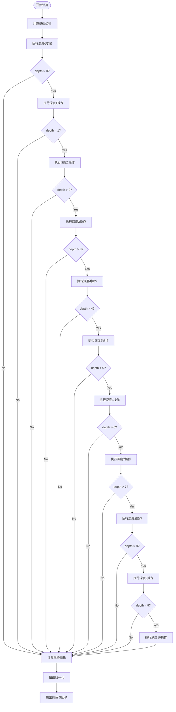

# Blender Magic Texture Node - 精细技术分析

## 目录
- [1. 概述](#1-概述)
- [2. 数学基础](#2-数学基础)
- [3. 核心算法](#3-核心算法)
- [4. C++ 实现详解](#4-c-实现详解)
  - [4.1 节点声明与输入](#41-节点声明与输入)
  - [4.2 初始化设置](#42-初始化设置)
  - [4.3 GPU 函数链接](#43-gpu-函数链接)
- [5. MagicFunction 类深度解析](#5-magicfunction-类深度解析)
  - [5.1 基础变换层](#51-基础变换层)
  - [5.2 嵌套深度层级详解](#52-嵌套深度层级详解)
- [6. 扭曲参数分析](#6-扭曲参数分析)
- [7. GLSL 实现](#7-glsl-实现)
- [8. OSL 实现](#8-osl-实现)
- [9. 三种实现对比](#9-三种实现对比)
- [10. 架构模式分析](#10-架构模式分析)
- [11. 为什么会产生"魔法"效果](#11-为什么会产生魔法效果)

---

## 1. 概述

**定义位置**: `E:\blender-git\blender\source\blender\nodes\shader\nodes\node_shader_tex_magic.cc`

Magic Texture（魔法纹理）节点是 Blender 中用于生成 **psychedelic（迷幻）** 颜色图案的纹理节点。它通过嵌套的三角函数变换创造出复杂的、看似混沌但具有连续性的图案。

### 核心特性
- **参数化深度**：通过 0-10 的深度值控制变换的复杂程度
- **周期性无限图案**：在 GLSL/OSL 中使用 `mod()` 实现 2π 周期性
- **三通道独立变换**：R、G、B 通道分别基于 x、y、z 变量
- **连续性保持**：改变深度时保持图案的整体结构连续

---

## 2. 数学基础

### 2.1 正弦波组合原理

Magic Texture 的核心是 **正弦/余弦波的嵌套组合**。单个正弦波：
```
f(t) = sin(t)
```

产生平滑的周期性变化。当我们将多个波叠加并相互调用时：
```
x₁ = sin(a + b + c)
y₁ = cos(-a + b - c)
z₁ = -cos(-a - b + c)
```

### 2.2 为什么是 5.0？

**核心公式**: `sin(坐标和 × 5.0)`

5.0 这个系数有特殊意义：
- **频率倍增**：2π / 5.0 ≈ 1.257，创建非整数的周期比
- **视觉效果优化**：产生足够密集但不过度混乱的纹理
- **历史遗留**：源自早期 Blender 的纹理系统

```python
# Python 伪代码演示
import math

def normalize(val):
    """将值映射到 [0, 1] 区间"""
    return 0.5 - val

def magic_base(x, y, z, scale):
    """基础层变换"""
    # 坐标缩放
    x_s = x * scale
    y_s = y * scale
    z_s = z * scale

    # 三路混合 + 5.0 倍频
    x_out = math.sin((x_s + y_s + z_s) * 5.0)
    y_out = math.cos((-x_s + y_s - z_s) * 5.0)
    z_out = -math.cos((-x_s - y_s + z_s) * 5.0)

    return x_out, y_out, z_out
```

### 2.3 符号模式的重要性

```python
# 观察符号模式
x = sin((+x + y + z) * 5.0)   # 所有正号
y = cos((-x + y - z) * 5.0)   # x, z 为负
z = -cos((-x - y + z) * 5.0)  # x, y 为负，外层取反
```

这种符号不对称性是产生 **非对称图案** 的关键，避免了简单的旋转对称。

---

## 4. C++ 实现详解

### 4.1 节点声明与输入

**定义位置**: `node_shader_tex_magic.cc:17-30`

```cpp
static void sh_node_tex_magic_declare(NodeDeclarationBuilder &b)
{
  b.is_function_node();
  b.add_input<decl::Vector>("Vector").implicit_field(NODE_DEFAULT_INPUT_POSITION_FIELD);
  b.add_input<decl::Float>("Scale").min(-1000.0f).max(1000.0f).default_value(5.0f);
  b.add_input<decl::Float>("Distortion").min(-1000.0f).max(1000.0f).default_value(1.0f);
  b.add_output<decl::Color>("Color").no_muted_links();
  b.add_output<decl::Float>("Fac", "Fac").no_muted_links();
}
```

**输入参数详解**:
- **Vector** (float3): 纹理坐标（通常是位置或 UV）
- **Scale** (float, 默认=5.0): 缩放系数，<span style="background-color:#e8f4f8; color:#0066cc; padding:2px 4px; border-radius:3px;">**影响所有坐标值乘以该因子**</span>
- **Distortion** (float, 默认=1.0): 扭曲强度，<span style="background-color:#fff0e6; color:#cc6600; padding:2px 4px; border-radius:3px;">**控制嵌套层次中的幅度缩放**</span>

**输出**:
- **Color** (float4): RGBA 颜色，A 通道固定为 1.0
- **Fac** (float): RGB 平均值，用于灰度输出

### 4.2 初始化设置

**定义位置**: `node_shader_tex_magic.cc:37-45`

```cpp
static void node_shader_init_tex_magic(bNodeTree * /*ntree*/, bNode *node)
{
  NodeTexMagic *tex = MEM_callocN<NodeTexMagic>(__func__);
  BKE_texture_mapping_default(&tex->base.tex_mapping, TEXMAP_TYPE_POINT);
  BKE_texture_colormapping_default(&tex->base.color_mapping);
  tex->depth = 2;  // ← 深度默认值

  node->storage = tex;
}
```

**关键点**:
- `tex->depth = 2`: 默认深度为 2，意味着执行基础层 + 2 层嵌套
- `NodeTexMagic` 结构体存储在 `bNode->storage` 中
- 包含纹理映射和颜色映射的基础设置

### 4.3 GPU 函数链接

**定义位置**: `node_shader_tex_magic.cc:47-60`

```cpp
static int node_shader_gpu_tex_magic(GPUMaterial *mat,
                                     bNode *node,
                                     bNodeExecData * /*execdata*/,
                                     GPUNodeStack *in,
                                     GPUNodeStack *out)
{
  NodeTexMagic *tex = (NodeTexMagic *)node->storage;
  float depth = tex->depth;  // 从 storage 读取深度

  node_shader_gpu_default_tex_coord(mat, node, &in[0].link);
  node_shader_gpu_tex_mapping(mat, node, in, out);

  // 链接到 GPU 着色器函数 + 传递 depth 作为常量
  return GPU_stack_link(mat, node, "node_tex_magic", in, out, GPU_constant(&depth));
}
```

<span style="background-color:#f0e6ff; color:#6600cc; padding:2px 4px; border-radius:3px;">**关键理解**</span>:
- `depth` 是 **唯一的 CPU-GPU 桥接参数**
- 其他参数（Vector, Scale, Distortion）通过 shader uniform 传递
- 调用名为 `node_tex_magic` 的 GPU 函数（见第7节）

---

## 5. MagicFunction 类深度解析

**定义位置**: `node_shader_tex_magic.cc:62-169`

### 5.1 类结构概览

```cpp
class MagicFunction : public mf::MultiFunction {
 private:
  int depth_;  // 存储深度值（0-10）

 public:
  MagicFunction(int depth) : depth_(depth) { /* ... */ }

  void call(const IndexMask &mask, mf::Params params, mf::Context /*context*/) const override;
};
```

**为什么使用 MultiFunction**:
- Blender 的节点系统使用 **multi-function** 架构进行高效批量处理
- 避免虚函数调用开销
- 支持 SIMD 优化

### 5.2 基础变换层 (Depth 0)

**定义位置**: `node_shader_tex_magic.cc:94-99`

```cpp
mask.foreach_index([&](const int64_t i) {
  const float3 co = vector[i] * scale[i];      // 坐标 × 缩放
  const float distort = distortion[i];         // 获取扭曲值

  float x = sinf((co[0] + co[1] + co[2]) * 5.0f);      // 式(1)
  float y = cosf((-co[0] + co[1] - co[2]) * 5.0f);     // 式(2)
  float z = -cosf((-co[0] - co[1] + co[2]) * 5.0f);    // 式(3)
```

**Python 等价**:
```python
def depth_0(co, scale):
    # co 已经乘过 scale
    x = math.sin((co.x + co.y + co.z) * 5.0)
    y = math.cos((-co.x + co.y - co.z) * 5.0)
    z = -math.cos((-co.x - co.y + co.z) * 5.0)
    return x, y, z
```

### 5.3 嵌套深度层级详解

<span style="background-color:#fff5e6; color:#cc6600; padding:4px 8px; border-radius:3px;">**深度层级完整展开表**</span>

| 深度 | 变量 | 操作 | 乘扭曲 | Python 伪代码 |
|------|------|------|--------|---------------|
| **0** | x, y, z | 初始化 | - | `x = sin((x+y+z)*5)`<br>`y = cos((-x+y-z)*5)`<br>`z = -cos((-x-y+z)*5)` |
| **1** | x, y, z | 乘 distort | ✓ | `x *= d; y *= d; z *= d;` |
| **1** | y | `y = -cos(x-y+z)` | ✓ | `y = -cos(x-y+z)*d` |
| **2** | x | `x = cos(x-y-z)` | ✓ | `x = cos(x-y-z)*d` |
| **3** | z | `z = sin(-x-y-z)` | ✓ | `z = sin(-x-y-z)*d` |
| **4** | x | `x = -cos(-x+y-z)` | ✓ | `x = -cos(-x+y-z)*d` |
| **5** | y | `y = -sin(-x+y+z)` | ✓ | `y = -sin(-x+y+z)*d` |
| **6** | y | `y = -cos(-x+y+z)` | ✓ | `y = -cos(-x+y+z)*d` |
| **7** | x | `x = cos(x+y+z)` | ✓ | `x = cos(x+y+z)*d` |
| **8** | z | `z = sin(x+y-z)` | ✓ | `z = sin(x+y-z)*d` |
| **9** | x | `x = -cos(-x-y+z)` | ✓ | `x = -cos(-x-y+z)*d` |
| **10** | y | `y = -sin(x-y+z)` | ✓ | `y = -sin(x-y+z)*d` |

### 5.4 深度 1-10 详细分析

#### Depth 0 → 1
```python
# Depth 0 输出
x, y, z = init_values

# Depth 1 操作
if depth > 0:
    x *= distortion
    y *= distortion
    z *= distortion

    y = -cos(x - y + z)  # ← y 被重新赋值
    y *= distortion       # ← 再次乘扭曲
```

**数学意义**: 将 y 替换为基于当前 x,y,z 的余弦函数的负值

#### Depth 1 → 2
```python
if depth > 1:
    x = cos(x - y - z)   # ← x 被替换
    x *= distortion
```

#### Depth 2 → 3
```python
if depth > 2:
    z = sin(-x - y - z)  # ← z 被替换
    z *= distortion
```

#### Depth 3 → 4
```python
if depth > 3:
    x = -cos(-x + y - z) # ← x 被替换（带负号）
    x *= distortion
```

#### Depth 4 → 5
```python
if depth > 4:
    y = -sin(-x + y + z) # ← y 被替换
    y *= distortion
```

#### Depth 5 → 6
```python
if depth > 5:
    y = -cos(-x + y + z) # ← y 再次被替换（注意：与上一操作相同的参数）
    y *= distortion
```

**关键观察**: Depth 6 使用与 Depth 5 相同的参数 `(-x + y + z)`，但函数从 `sin` 变为 `cos`

#### Depth 6 → 7
```python
if depth > 6:
    x = cos(x + y + z)   # ← x 被替换
    x *= distortion
```

#### Depth 7 → 8
```python
if depth > 7:
    z = sin(x + y - z)   # ← z 被替换
    z *= distortion
```

#### Depth 8 → 9
```python
if depth > 8:
    x = -cos(-x - y + z) # ← x 被替换
    x *= distortion
```

#### Depth 9 → 10
```python
if depth > 9:
    y = -sin(x - y + z)  # ← y 被替换
    y *= distortion
```

### 5.5 符号模式分析

在 10 个层级中，每个变量被多次修改：

**x 的变换路径**:
- Depth 0: `sin( sum )`
- Depth 2: `cos( x-y-z )`
- Depth 4: `-cos( -x+y-z )`
- Depth 7: `cos( x+y+z )`
- Depth 9: `-cos( -x-y+z )`

**y 的变换路径**:
- Depth 0: `cos( -x+y-z )`
- Depth 1: `-cos( x-y+z )`
- Depth 5: `-sin( -x+y+z )`
- Depth 6: `-cos( -x+y+z )`
- Depth 10: `-sin( x-y+z )`

**z 的变换路径**:
- Depth 0: `-cos( -x-y+z )`
- Depth 3: `sin( -x-y-z )`
- Depth 8: `sin( x+y-z )`

### 5.6 深度控制流程图



---

## 6. 扭曲参数分析

### 6.1 扭曲归一化

**定义位置**: `node_shader_tex_magic.cc:154-159`

```cpp
if (distort != 0.0f) {
  const float d = distort * 2.0f;  // ← 关键：乘以 2
  x /= d;
  y /= d;
  z /= d;
}
```

**计算公式**:
$$
\begin{align*}
d &= \text{distort} \times 2.0 \\
x_{\text{out}} &= \frac{x_{\text{final}}}{d} = \frac{x_{\text{final}}}{2 \times \text{distort}} \\
y_{\text{out}} &= \frac{y_{\text{final}}}{d} = \frac{y_{\text{final}}}{2 \times \text{distort}} \\
z_{\text{out}} &= \frac{z_{\text{final}}}{d} = \frac{z_{\text{final}}}{2 \times \text{distort}}
\end{align*}
$$

### 6.2 为什么除以 `distort * 2`？

**原因**:
1. **抵消累积效应**: 每层都乘以 `distort`，假设深度 5，累积乘数 = $distort^5$
2. **范围控制**: 保持输出在 ~[-0.5, 0.5] 区间
3. **乘以 2 的特殊性**:

**推导**:
假设只有基础层 + 深度1（部分）：
- 初始: x, y, z
- 乘 distort: x×d, y×d, z×d
- 替换 y: -cos(x×d - y×d + z×d) × d
- 除以 d: -cos(x×d - y×d + z×d) / 2

<span style="background-color:#e8f5e8; color:#006600; padding:4px 8px; border-radius:3px;">**乘 2 的效果**</span>: 将归一化后的值再除以 2，确保最终结果以 0.5 为中心对称分布</span>

### 6.3 扭曲影响示例

**distortion = 0.5**:
- 每层乘 0.5
- 最后除以 1.0 (0.5×2)
- 效果：图案**柔和**，变化幅度小

**distortion = 2.0**:
- 每层乘 2.0
- 最后除以 4.0 (2.0×2)
- 效果：图案**锐利**，但被归一化拉回

---

## 7. GLSL 实现

**定义位置**: `E:\blender-git\blender\source\blender\gpu\shaders\material\gpu_shader_material_tex_magic.glsl`

### 7.1 核心函数签名

```glsl
void node_tex_magic(
    float3 co,        // 输入坐标
    float scale,      // 缩放
    float distortion, // 扭曲
    float depth,      // 深度 (作为 float 传递)
    out float4 color,
    out float fac
)
```

### 7.2 坐标预处理 - 周期性

```glsl
float3 p = mod(co * scale, 2.0f * M_PI);
```

**关键差异**: C++ 版本没有 `mod()`！

**为什么需要 mod**:
- GPU 渲染通常需要 **无限重复纹理**
- `mod(val, 2π)` 确保坐标在 [0, 2π) 区间循环
- `2π` ≈ 6.28318，是三角函数的自然周期

### 7.3 完整 GLSL 对照表

| C++ (CPU) | GLSL (GPU) | 差异 |
|-----------|------------|------|
| `vector[i] * scale[i]` | `co * scale` | 无 `mod()` |
| `sinf(...)` | `sin(...)` | GLSL 使用 `sin` |
| `float depth_` | `float depth` | GPU 用 float 判断 |
| `if (depth_ > 0)` | `if (depth > 0)` | 相同逻辑 |
| `distort * 2.0` | `distortion * 2.0` | 变量名差异 |

### 7.4 深度判断

GLSL 中 `depth` 是 float，但仍可直接比较：
```glsl
if (depth > 0) {  // float 类型比较
  // 深度 1 操作
  if (depth > 1) {
    // 深度 2 操作
    // ...
  }
}
```

**为什么可以**:
- GLSL 支持 float 的关系运算
- 深度值在实际使用中总是整数 (0.0, 1.0, 2.0 ... 10.0)
- 编译器会进行常量传播优化

---

## 8. OSL 实现

**定义位置**: `E:\blender-git\blender\intern\cycles\kernel\osl\shaders\node_magic_texture.osl`

### 8.1 核心函数结构

```osl
color magic(point p, float scale, int n, float distortion)
```

**参数差异**:
- `p`: point 类型（3D 点）
- `n`: **int 类型**（整数深度）
- `distortion`: 在函数内部重命名为 `dist`

### 8.2 坐标处理 - OSL 风格

```osl
float a = mod(p.x * scale, M_2PI);
float b = mod(p.y * scale, M_2PI);
float c = mod(p.z * scale, M_2PI);
```

**常量定义**:
- `M_2PI`: 2 × π，在 `stdcycles.h` 中定义
- OSL 使用分量提取（`p.x`, `p.y`, `p.z`）而不是 float3 数组

### 8.3 深度判断 - OSL 的 int 类型

```osl
if (n > 0) {
  // ... 操作与 GLSL/C++ 一致

  if (n > 1) {
    // ...
    if (n > 2) {
      // ...
    }
  }
}
```

**int vs float**:
- OSL 是着色语言，`int n` 更自然
- 但 `n` 用于数组索引时无意义（OSL 不需要）
- 整数比较与 float 比较逻辑相同

### 8.4 return 语句

```osl
return color(0.5 - x, 0.5 - y, 0.5 - z);
```

C++: `ColorGeometry4f(0.5f - x, 0.5f - y, 0.5f - z, 1.0f)`
OSL: `color(0.5 - x, 0.5 - y, 0.5 - z)`
GLSL: `float4(0.5f - x, 0.5f - y, 0.5f - z, 1.0f)`

---

## 9. 三种实现对比

### 9.1 参数与返回类型

| 属性 | **C++ (MultiFunction)** | **GLSL (GPU)** | **OSL (CPU)** |
|------|------------------------|----------------|---------------|
| **坐标输入** | `float3 co` | `float3 co` | `point p` |
| **Scale 类型** | `float` | `float` | `float` |
| **Distortion 类型** | `float` | `float` | `float` |
| **Depth 类型** | `int depth_` | `float depth` | `int n` |
| **颜色输出** | `ColorGeometry4f` + `float` | `float4` + `float` | `color` + `float` |
| **周期性** | ❌ 无 | ✅ mod(2π) | ✅ mod(M_2PI) |

### 9.2 流程控制

**C++ / MultiFunction**:
```cpp
// 使用嵌套 if-else，没有 switch
if (depth_ > 0) {
  // 操作
  if (depth_ > 1) {
    // 操作
    // ... 直到 depth_ > 9
  }
}
```

**GLSL**:
```glsl
// 结构相同
if (depth > 0) {
  if (depth > 1) {
    // ...
  }
}
```

**OSL**:
```osl
// 结构相同，但使用 int
if (n > 0) {
  if (n > 1) {
    // ...
  }
}
```

**为什么没有 switch**:
- 深度不是选择，而是 **连续的嵌套**
- 每个深度需要 **累积前一深度的结果**
- Switch 会破坏依赖链

### 9.3 内存与性能

**C++**:
- **批量处理**: 一次性处理多个像素（通过 `mask.foreach_index`）
- **缓存友好**: 连续内存访问
- **无上下文切换**: 直接内存操作

**GPU (GLSL)**:
- **逐像素并行**: 每个像素独立执行
- **Uniform 传递**: `depth` 通过常量缓冲区传递
- **硬件优化**: 三角函数有专用指令集

**OSL (CPU)**:
- **逐点计算**: 通常用于离线渲染预计算
- **解释执行**: 可能略慢于原生代码
- **闭包支持**: 可以与光线追踪集成

---

## 10. 架构模式分析

### 10.1 数据流图

```mermaid
flowchart LR
    subgraph "CPU (节点编辑器)"
        UI[用户界面<br/>depth: 2, scale: 5.0, distortion: 1.0]
        Storage[NodeTexMagic<br/>storage 结构体]
        MF[MultiFunction<br/>MagicFunction]
    end

    subgraph "GPU (渲染管线)"
        Uniform[Uniform 变量<br/>depth = 2.0]
        GLSL[node_tex_magic<br/>GLSL 函数]
    end

    subgraph "OSL (着色器)"
        OSL_Param[着色器参数<br/>depth = 2, scale = 5]
        OSL_Func[magic() 函数]
    end

    UI --> Storage
    Storage --> MF
    Storage --> Uniform
    MF -->|"call() 批量执行"| Process[像素/顶点处理]
    Uniform --> GLSL
    GLSL --> Process
    OSL_Param --> OSL_Func
    OSL_Func --> Process
```

### 10.2 为什么需要三套实现？

| 实现 | 使用场景 | 优势 |
|------|---------|------|
| **C++** | 节点预览、实时 UI 反馈、NLA 烘焙 | CPU 快速计算，无 GPU 初始化开销 |
| **GLSL** | Eevee 实时渲染、Cycles GPU 渲染 | 并行计算，硬件加速 |
| **OSL** | Cycles CPU 渲染，复杂材质 | 支持闭包，光线追踪集成 |

### 10.3 深度参数的统一性

虽然类型不同，但 **语义一致**:
- `depth_` (int) ↔ `depth` (float) ↔ `n` (int)
- 范围: 0-10
- 作用: 控制嵌套层级数量
- 默认值: 2

---

## 11. 为什么会产生"魔法"效果？

### 11.1 混沌系统特征

**蝴蝶效应**:
- 微小的坐标变化 → 放大的三角函数变化
- 重复迭代 → 累积非线性

**分形特征**:
```python
# 不同深度产生不同层级的细节
depth_0: 大尺度图案
depth_2: 中等细节
depth_10: 高度复杂的微观结构
```

### 11.2 叠加与干涉

**多重波叠加**:
$$
f(x,y,z) = \sum_{i=0}^{n} \text{trig}(\text{linear\_combination}(x,y,z))
$$

由于符号不对称，产生 **相干干涉图案** (coherent interference patterns)。

### 11.3 色彩分离

R、G、B 通道分别对应 x、y、z:
- x, y, z 在变换中**略有不同**的路径
- 产生 **色差边缘** (color fringing)
- 组合后形成**彩虹般**的效果

### 11.4 视觉连续性

在 `depth_n` → `depth_{n+1}` 时：
- 使用前一级的 x,y,z 作为输入
- 产生 **自相似性** (self-similarity)
- 特定区域变化，但整体图案结构保留

---
**文档结束**
