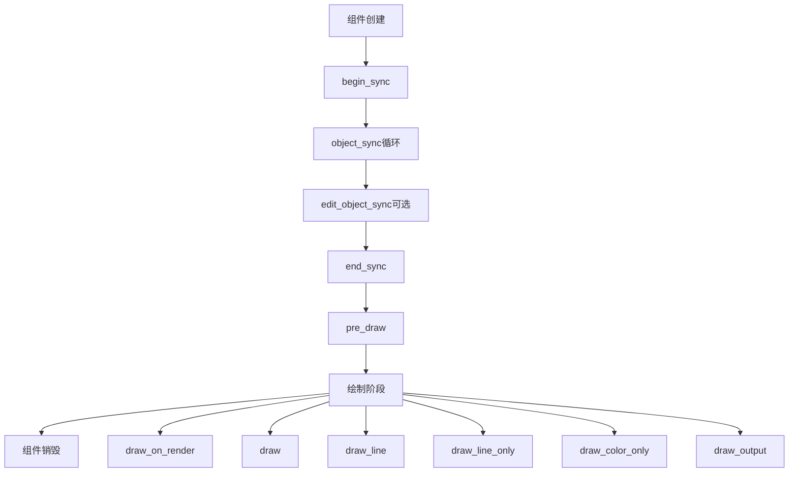

# 6. overlay_base.hh 详解

## 目录
- [1. 概述](#概述)
- [2. 核心组件分析](#核心组件分析)
  - [2.1. Overlay基类设计](#21-overlay基类设计)
  - [2.2. 核心文件分析](#22-核心文件分析)
- [3. 核心函数解析](#核心函数解析)
  - [3.1. begin_sync() 函数](#31-beginsync-函数)
  - [3.2. object_sync() 函数](#32-objectsync-函数)
  - [3.3. pre_draw() 函数](#33-predraw-函数)
  - [3.4. draw_line() 函数](#34-drawline-函数)
- [4. 实现细节](#实现细节)
  - [4.1. 组件生命周期](#41-组件生命周期)
  - [4.2. 设计模式分析](#42-设计模式分析)
  - [4.3. 实际应用示例](#43-实际应用示例)
  - [4.4. 性能考虑](#44-性能考虑)
- [5. 总结](#总结)

## 概述 [[⬆](#目录)]

`overlay_base.hh` 文件定义了Blender Overlay引擎的核心基类 `Overlay`，这是一个抽象基类，为所有具体的Overlay组件提供统一的接口和生命周期管理。该文件位于 `source/blender/draw/engines/overlay/overlay_base.hh`，共109行代码。

## 2. 核心组件分析 [[⬆](#目录)]

### 2.1. Overlay基类设计

#### 2.1.1 设计理念

Overlay基类采用了**模板方法模式**和**策略模式**的组合设计，旨在：

1. **统一接口**：为所有Overlay组件提供一致的生命周期方法
2. **灵活扩展**：允许不同类型的Overlay实现特定的渲染逻辑
3. **性能优化**：通过条件渲染和早期退出机制减少不必要的计算
4. **模块化设计**：每个Overlay组件独立管理自己的状态和资源

#### 2.1.2 核心设计原则

```cpp
// source/blender/draw/engines/overlay/overlay_base.hh:22-28
struct Overlay {
  /**
   * IMPORTANT: Overlays are used for every area using GPUViewport (i.e. View3D, UV Editor,
   * Compositor ...). They are also used for depth picking and selection. This means each overlays
   * must decide when they are active. The begin_sync method must initialize the `enabled_`
   * member depending on the context state, and every method should implement an early out cases.
   */
  bool enabled_ = false;
```

**设计要点**：
- **上下文感知**：每个Overlay必须根据上下文状态决定是否激活
- **早期退出**：所有方法都应检查 `enabled_` 状态以避免不必要的处理
- **多区域支持**：支持View3D、UV编辑器、合成器等多种编辑器类型

### 2.2. 核心文件分析

#### 2.2.1 文件结构

```cpp
// source/blender/draw/engines/overlay/overlay_base.hh:1-108
/* SPDX-FileCopyrightText: 2024 Blender Authors
 * SPDX-License-Identifier: GPL-2.0-or-later */

/** \file
 * \ingroup overlay
 */

#pragma once

#include "overlay_private.hh"

namespace blender::draw::overlay {

// ... Overlay类定义 ...

}  // namespace blender::draw::overlay
```

**文件组织**：
- **许可证头**：使用SPDX标识符，符合GPL-2.0-or-later许可证
- **Doxygen标记**：`\ingroup overlay` 表示属于Overlay模块
- **头文件保护**：使用 `#pragma once` 确保单次包含
- **命名空间**：位于 `blender::draw::overlay` 命名空间

#### 2.2.2 类成员分析

##### 2.2.2.1 启用状态标志

```cpp
// source/blender/draw/engines/overlay/overlay_base.hh:29
bool enabled_ = false;
```

**作用**：
- 控制Overlay组件是否参与当前帧的渲染
- 由 `begin_sync()` 方法根据上下文状态设置
- 所有其他方法都应首先检查此标志

##### 2.2.2.2 虚函数接口

Overlay基类定义了完整的生命周期接口：

**同步阶段**：
```cpp
// source/blender/draw/engines/overlay/overlay_base.hh:55-83
virtual void begin_sync(Resources & /*res*/, const State & /*state*/) = 0;
virtual void object_sync(Manager & /*manager*/,
                         const ObjectRef & /*ob_ref*/,
                         Resources & /*res*/,
                         const State & /*state*/) {};
virtual void edit_object_sync(Manager & /*manager*/,
                              const ObjectRef & /*ob_ref*/,
                              Resources & /*res*/,
                              const State & /*state*/) {};
virtual void end_sync(Resources & /*res*/, const State & /*state*/) {};
```

**绘制阶段**：
```cpp
// source/blender/draw/engines/overlay/overlay_base.hh:90-105
virtual void pre_draw(Manager & /*manager*/, View & /*view*/) {};
virtual void draw_on_render(gpu::FrameBuffer * /*fb*/, Manager & /*manager*/, View & /*view*/) {};
virtual void draw(Framebuffer & /*fb*/, Manager & /*manager*/, View & /*view*/) {};
virtual void draw_line(Framebuffer & /*fb*/, Manager & /*manager*/, View & /*view*/) {};
virtual void draw_line_only(Framebuffer & /*fb*/, Manager & /*manager*/, View & /*view*/) {};
virtual void draw_color_only(Framebuffer & /*fb*/, Manager & /*manager*/, View & /*view*/) {};
virtual void draw_output(Framebuffer & /*fb*/, Manager & /*manager*/, View & /*view*/) {};
```

## 3. 核心函数解析 [[⬆](#目录)]

### 3.1. begin_sync() 函数

```cpp
// source/blender/draw/engines/overlay/overlay_base.hh:47-55
/**
 * Creates passes used for object sync and enabling / disabling internal overlay types
 * (e.g. vertices, edges, faces in edit mode).
 * Runs once at the start of the sync cycle.
 * Should also contain passes setup for overlays that are not per object overlays (e.g. Grid).
 *
 * This method must be implemented.
 */
virtual void begin_sync(Resources & /*res*/, const State & /*state*/) = 0;
```

**作用和实现**：
- **必须实现**：纯虚函数，所有派生类必须提供实现
- **时机**：同步周期开始时运行一次
- **职责**：
  - 创建渲染通道
  - 启用/禁用内部Overlay类型
  - 设置非对象相关的Overlay（如网格）
  - 初始化 `enabled_` 状态

**实现示例**（来自Grid类）：
```cpp
// source/blender/draw/engines/overlay/overlay_grid.hh:43-49
void begin_sync(Resources &res, const State &state) final
{
  enabled_ = init(state);
  if (!enabled_) {
    grid_ps_.init();
    return;
  }
  // ... 初始化渲染通道 ...
}
```

### 3.2. object_sync() 函数

```cpp
// source/blender/draw/engines/overlay/overlay_base.hh:57-66
/**
 * Fills passes or buffers for each object.
 * Runs for each individual object state.
 * IMPORTANT: Can run only once for instances using the same state (#ObjectRef might contains
 * instancing data).
 */
virtual void object_sync(Manager & /*manager*/,
                         const ObjectRef & /*ob_ref*/,
                         Resources & /*res*/,
                         const State & /*state*/) {};
```

**作用和实现**：
- **对象级别同步**：为每个对象填充通道或缓冲区
- **实例化优化**：相同状态的对象只运行一次
- **参数说明**：
  - `manager`：绘制管理器，处理资源分配
  - `ob_ref`：对象引用，包含对象数据和状态
  - `res`：资源管理器，提供着色器和缓冲区
  - `state`：当前渲染状态

### 3.3. pre_draw() 函数

```cpp
// source/blender/draw/engines/overlay/overlay_base.hh:85-90
/**
 * Warms #PassMain and #PassSortable to avoid overhead of pipeline switching.
 * Should only contains calls to `generate_commands`.
 * NOTE: `view` is guaranteed to be the same view that will be passed to the draw functions.
 */
virtual void pre_draw(Manager & /*manager*/, View & /*view*/) {};
```

**作用和实现**：
- **性能优化**：预热渲染通道以避免管线切换开销
- **命令生成**：只应包含 `generate_commands` 调用
- **视图一致性**：保证传入的view与后续绘制函数相同

### 3.4. draw_line() 函数

```cpp
// source/blender/draw/engines/overlay/overlay_base.hh:102
virtual void draw_line(Framebuffer & /*fb*/, Manager & /*manager*/, View & /*view*/) {};
```

**作用和实现**：
- **线条绘制**：专门用于绘制线条类型的Overlay
- **帧缓冲区**：绘制到指定的帧缓冲区
- **管理器和视图**：提供绘制上下文和视图信息

**实现示例**（来自Grid类）：
```cpp
// source/blender/draw/engines/overlay/overlay_grid.hh:110-119
void draw_line(Framebuffer &framebuffer, Manager &manager, View &view) final
{
  if (!enabled_) {
    return;
  }

  grid_ubo_.push_update();
  GPU_framebuffer_bind(framebuffer);
  manager.submit(grid_ps_, view);
}
```

## 4. 实现细节 [[⬆](#目录)]

### 4.1. 组件生命周期

Overlay组件的完整生命周期包含以下阶段：



#### 4.1.1 创建和初始化

```cpp
// 派生类构造函数
class MyOverlay : public Overlay {
public:
  MyOverlay() {
    // 初始化成员变量
    // 创建资源句柄
  }
};
```

#### 4.1.2 每帧同步过程

**第一阶段：begin_sync**
```cpp
// 每帧开始时调用一次
void begin_sync(Resources &res, const State &state) override {
  // 1. 检查是否应该启用此Overlay
  enabled_ = should_enable(state);
  
  if (!enabled_) {
    return; // 早期退出
  }
  
  // 2. 创建和配置渲染通道
  setup_passes(res);
  
  // 3. 设置全局状态
  configure_global_state(res, state);
}
```

**第二阶段：object_sync**
```cpp
// 为每个对象调用
void object_sync(Manager &manager, 
                 const ObjectRef &ob_ref,
                 Resources &res, 
                 const State &state) override {
  if (!enabled_) {
    return; // 早期退出
  }
  
  // 1. 检查对象是否需要此Overlay
  if (!should_process_object(ob_ref, state)) {
    return;
  }
  
  // 2. 添加对象到渲染通道
  add_object_to_pass(manager, ob_ref, res);
}
```

**第三阶段：end_sync**
```cpp
// 同步周期结束时调用
void end_sync(Resources &res, const State &state) override {
  if (!enabled_) {
    return;
  }
  
  // 1. 完成缓冲区填充
  finalize_buffers();
  
  // 2. 准备绘制命令
  prepare_draw_commands(res);
}
```

#### 4.1.3 渲染阶段执行

**预热阶段**：
```cpp
void pre_draw(Manager &manager, View &view) override {
  if (!enabled_) {
    return;
  }
  
  // 预热渲染管线
  manager.generate_commands(pass_main_, view);
  manager.generate_commands(pass_sortable_, view);
}
```

**绘制阶段**：
```cpp
void draw(Framebuffer &fb, Manager &manager, View &view) override {
  if (!enabled_) {
    return;
  }
  
  // 绑定帧缓冲区
  GPU_framebuffer_bind(fb);
  
  // 提交绘制命令
  manager.submit(main_pass_, view);
}
```

#### 4.1.4 销毁和清理

```cpp
~MyOverlay() {
  // 释放GPU资源
  GPU_BATCH_DISCARD_SAFE(batch_);
  
  // 清理缓冲区
  buffer_.free();
  
  // 释放纹理
  texture_.free();
}
```

### 4.2. 设计模式分析

#### 4.2.1 模板方法模式

Overlay基类是模板方法模式的典型应用：

```cpp
// 基类定义算法骨架
class Overlay {
public:
  void sync_and_draw(Resources &res, const State &state, 
                     Manager &manager, View &view, Framebuffer &fb) {
    // 模板方法：定义执行顺序
    begin_sync(res, state);           // 步骤1：必须实现
    for (auto &ob : objects) {
      object_sync(manager, ob, res, state);  // 步骤2：可选实现
    }
    end_sync(res, state);             // 步骤3：可选实现
    pre_draw(manager, view);          // 步骤4：可选实现
    draw(fb, manager, view);          // 步骤5：可选实现
  }
};
```

**优势**：
- **一致性**：所有Overlay组件遵循相同的执行流程
- **扩展性**：派生类只需实现特定的步骤
- **维护性**：算法逻辑集中在基类中

#### 4.2.2 策略模式

不同的Overlay实现代表不同的渲染策略：

```cpp
// 不同策略的实现
class Grid : public Overlay {
  void draw_line(Framebuffer &fb, Manager &manager, View &view) override {
    // 网格绘制策略
  }
};

class Wireframe : public Overlay {
  void draw(Framebuffer &fb, Manager &manager, View &view) override {
    // 线框绘制策略
  }
};

class Armature : public Overlay {
  void object_sync(Manager &manager, const ObjectRef &ob_ref, 
                   Resources &res, const State &state) override {
    // 骨架同步策略
  }
};
```

#### 4.2.3 组件化设计优势

**1. 模块独立性**
```cpp
// 每个Overlay组件独立管理自己的状态
class Grid : public Overlay {
private:
  PassSimple grid_ps_;           // 独立的渲染通道
  UniformBuffer<GridData> ubo_;   // 独立的统一缓冲区
  StorageVectorBuffer<float4> buf_; // 独立的存储缓冲区
};
```

**2. 条件渲染**
```cpp
void draw(Framebuffer &fb, Manager &manager, View &view) override {
  if (!enabled_) {
    return; // 不活跃的组件不参与渲染
  }
  // 只渲染活跃的组件
}
```

**3. 资源管理**
```cpp
void begin_sync(Resources &res, const State &state) override {
  // 根据需要创建资源
  if (needs_extra_resources(state)) {
    create_extra_resources(res);
  }
}
```

### 4.3. 实际应用示例

#### 4.3.1 Grid Overlay实现分析

```cpp
// source/blender/draw/engines/overlay/overlay_grid.hh:29-331
class Grid : Overlay {
private:
  PassSimple grid_ps_ = {"grid_ps_"};                    // 渲染通道
  UniformBuffer<OVERLAY_GridData> grid_ubo_;            // 网格数据UBO
  StorageVectorBuffer<float4> tile_pos_buf_;             // 瓦片位置缓冲区

public:
  void begin_sync(Resources &res, const State &state) final {
    enabled_ = init(state);  // 根据状态决定是否启用
    
    if (!enabled_) {
      grid_ps_.init();       // 清理通道
      return;
    }
    
    // 设置渲染状态
    DRWState ps_draw_state = DRW_STATE_WRITE_COLOR | DRW_STATE_BLEND_ALPHA;
    grid_ps_.init();
    grid_ps_.state_set(ps_draw_state);
    
    // 绑定资源
    grid_ps_.bind_ubo(OVERLAY_GLOBALS_SLOT, &res.globals_buf);
    grid_ps_.bind_ubo(DRW_CLIPPING_UBO_SLOT, &res.clip_planes_buf);
    
    // 配置着色器和绘制调用
    setup_shader_calls(res, state);
  }
  
  void draw_line(Framebuffer &framebuffer, Manager &manager, View &view) final {
    if (!enabled_) {
      return;
    }
    
    grid_ubo_.push_update();        // 更新UBO数据
    GPU_framebuffer_bind(framebuffer);  // 绑定帧缓冲区
    manager.submit(grid_ps_, view); // 提交绘制命令
  }
};
```

#### 4.3.2 典型的使用模式

```cpp
// 在Overlay引擎中的使用
class OverlayEngine {
private:
  Vector<std::unique_ptr<Overlay>> overlays_;
  
public:
  void sync(Resources &res, const State &state) {
    for (auto &overlay : overlays_) {
      overlay->begin_sync(res, state);
    }
    
    // 同步所有对象
    for (auto &ob_ref : objects) {
      for (auto &overlay : overlays_) {
        overlay->object_sync(manager, ob_ref, res, state);
      }
    }
    
    for (auto &overlay : overlays_) {
      overlay->end_sync(res, state);
    }
  }
  
  void draw(Framebuffer &fb, Manager &manager, View &view) {
    for (auto &overlay : overlays_) {
      overlay->pre_draw(manager, view);
    }
    
    for (auto &overlay : overlays_) {
      overlay->draw(fb, manager, view);
    }
  }
};
```

### 4.4. 性能考虑

#### 4.4.1 早期退出机制

```cpp
void draw(Framebuffer &fb, Manager &manager, View &view) override {
  if (!enabled_) {
    return; // 最重要：不活跃组件立即退出
  }
  // 只有活跃组件才继续执行
}
```

#### 4.4.2 资源按需分配

```cpp
void begin_sync(Resources &res, const State &state) override {
  enabled_ = check_if_needed(state);
  
  if (!enabled_) {
    return; // 不需要时不分配资源
  }
  
  // 只有需要时才创建昂贵的资源
  if (!pass_.is_initialized()) {
    pass_.init();
  }
}
```

#### 4.4.3 批量处理优化

```cpp
void object_sync(Manager &manager, const ObjectRef &ob_ref,
                 Resources &res, const State &state) override {
  // 相同状态的对象只处理一次
  if (processed_states_.contains(ob_ref.state_hash)) {
    return;
  }
  
  processed_states_.add(ob_ref.state_hash);
  process_object_state(ob_ref, res);
}
```

## 5. 总结 [[⬆](#目录)]

Overlay基类是Blender Overlay引擎的核心抽象，它通过精心设计的接口和生命周期管理，实现了：

1. **统一的组件接口**：所有Overlay组件遵循相同的生命周期
2. **灵活的扩展机制**：支持各种类型的Overlay实现
3. **高效的性能管理**：通过条件渲染和资源优化
4. **清晰的职责分离**：同步和绘制阶段明确分工
5. **强大的设计模式**：模板方法和策略模式的完美结合

这种设计使得Blender能够高效地渲染复杂的场景Overlay，同时保持代码的可维护性和扩展性。每个Overlay组件都可以独立开发和优化，而整体架构保持一致性和稳定性。