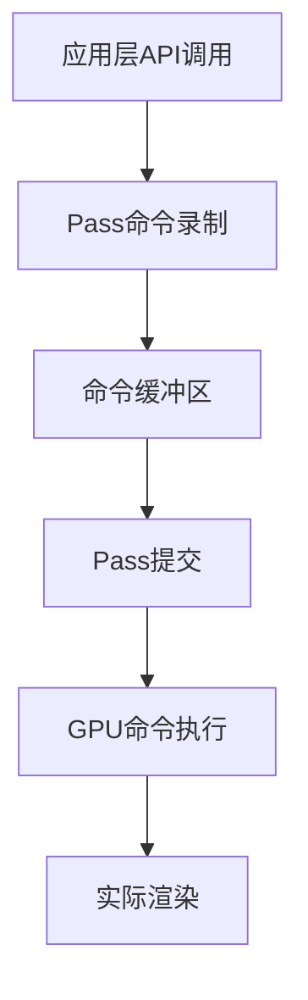

# 9. draw_pass.hh 详解

## 目录
- [1. 概述](#概述)
- [2. 核心组件分析](#核心组件分析)
  - [2.1. Pass系统的作用](#21-pass系统的作用)
  - [2.2. 核心文件分析](#22-核心文件分析)
  - [2.3. PassBase模板类](#23-passbase模板类)
  - [2.4. Pass类型详解](#24-pass类型详解)
- [3. 关键功能分析](#关键功能分析)
  - [3.1. Pass的创建和初始化](#31-pass的创建和初始化)
  - [3.2. 命令记录和提交](#32-命令记录和提交)
  - [3.3. 状态管理和优化](#33-状态管理和优化)
  - [3.4. 批处理机制](#34-批处理机制)
- [4. DrawCommand系统](#drawcommand系统)
  - [4.1. DrawCommandBuf的作用](#41-drawcommandbuf的作用)
  - [4.2. DrawMultiBuf的作用](#42-drawmultibuf的作用)
  - [4.3. 命令缓冲区管理](#43-命令缓冲区管理)
- [5. 绘制调用API](#绘制调用api)
  - [5.1. 基础绘制调用](#51-基础绘制调用)
  - [5.2. 程序化绘制](#52-程序化绘制)
  - [5.3. 图元扩展绘制](#53-图元扩展绘制)
  - [5.4. 间接绘制](#54-间接绘制)
- [6. 资源绑定系统](#资源绑定系统)
  - [6.1. 纹理绑定](#61-纹理绑定)
  - [6.2. 存储缓冲区绑定](#62-存储缓冲区绑定)
  - [6.3. 图像绑定](#63-图像绑定)
- [7. 常量推送系统](#常量推送系统)
  - [7.1. PushConstant机制](#71-pushconstant机制)
  - [7.2. 特殊常量处理](#72-特殊常量处理)
- [8. 着色器特化系统](#着色器特化系统)
  - [8.1. 特化常量API](#81-特化常量api)
  - [8.2. 特化机制](#82-特化机制)
- [9. 清除和屏障操作](#清除和屏障操作)
  - [9.1. 帧缓冲清除](#91-帧缓冲清除)
  - [9.2. 内存屏障](#92-内存屏障)
- [10. 子Pass系统](#子pass系统)
  - [10.1. 子Pass创建](#101-子pass创建)
  - [10.2. PassSortable子Pass](#102-passsortable子pass)
- [11. 材料系统](#材料系统)
  - [11.1. 材料绑定](#111-材料绑定)
  - [11.2. 延迟纹理加载](#112-延迟纹理加载)
- [12. 调试和序列化](#调试和序列化)
  - [12.1. 调试支持](#121-调试支持)
  - [12.2. 序列化功能](#122-序列化功能)
- [13. 性能优化策略](#性能优化策略)
  - [13.1. 批处理优化](#131-批处理优化)
  - [13.2. 内存优化](#132-内存优化)
  - [13.3. 状态优化](#133-状态优化)
- [14. 使用示例](#使用示例)
  - [14.1. PassSimple示例](#141-passsimple示例)
  - [14.2. PassMain示例](#142-passmain示例)
  - [14.3. PassSortable示例](#143-passsortable示例)
- [15. 总结](#总结)

## 概述 [[⬆](#目录)]

`draw_pass.hh` 是Blender绘制系统的核心文件，定义了Pass（渲染通道）系统。Pass系统是渲染管线的关键组件，负责记录、管理和执行GPU绘制命令。本文档深入分析Pass系统的设计原理、实现细节和各种Pass类型的功能特性。

## 2. 核心组件分析

### 2.1. Pass系统的作用 [[⬆](#目录)]

#### 2.1.1. Pass在渲染管线中的地位

Pass系统在Blender渲染管线中扮演着**命令录制器**的角色：

```cpp
// source/blender/draw/intern/draw_pass.hh:10-11
/**
 * Passes record draw commands. Commands are executed only when a pass is submitted for execution.
 */
```

Pass系统的主要职责包括：
- **命令录制**：将绘制调用、状态变更等操作记录为命令
- **命令优化**：对命令进行批处理、排序和剔除优化
- **延迟执行**：命令在Pass提交时才真正执行到GPU
- **资源管理**：管理着色器、纹理、缓冲区等资源的绑定

#### 2.1.2. 不同类型Pass的用途

Blender提供了三种主要的Pass类型，每种都有特定的使用场景：

#### PassMain - 高性能批处理通道
```cpp
// source/blender/draw/intern/draw_pass.hh:12-18
/**
 * `PassMain`:
 * Should be used on heavy load passes such as ones that may contain scene objects. Draw call
 * submission is optimized for large number of draw calls. But has a significant overhead per
 * #Pass. Use many #PassSub along with a main #Pass to reduce the overhead and allow groupings of
 * commands.
 */
```

**特点**：
- 适用于包含大量绘制调用的场景（如场景对象渲染）
- 支持批处理优化，合并相同状态的绘制调用
- 具有较高的单Pass开销，建议配合子Pass使用
- 绘制调用顺序不保证，适合不需要严格顺序的场景

#### PassSimple - 简单有序通道
```cpp
// source/blender/draw/intern/draw_pass.hh:20-22
/**
 * `PassSimple`:
 * Does not have the overhead of #PassMain but does not have the culling and batching optimization.
 * It should be used for passes that needs a few commands or that needs guaranteed draw call order.
 */
```

**特点**：
- 无批处理开销，执行效率高
- 保证绘制调用的执行顺序
- 适用于命令数量较少或需要严格顺序的场景
- 不支持剔除和批处理优化

#### PassSortable - 可排序透明通道
```cpp
// source/blender/draw/intern/draw_pass.hh:30-33
/**
 * `PassSortable`:
 * This is a sort of `PassMain` augmented with a per sub-pass sorting value. They can't directly
 * contain draw command, everything needs to be inside sub-passes. Sub-passes are automatically
 * sorted before submission.
 */
```

**特点**：
- 专门用于透明对象渲染
- 支持基于排序值的子Pass自动排序
- 所有绘制命令必须在子Pass中
- 确保正确的透明度混合顺序

#### 2.1.3. Pass与GPU命令的关系

Pass系统采用**延迟执行**模式：



这种设计的优势：
- **批处理优化**：可以将多个相似命令合并
- **状态缓存**：避免冗余的状态变更
- **多线程友好**：录制阶段可以在多线程中进行
- **资源复用**：Pass可以重复录制和提交

### 2.2. 核心文件分析 [[⬆](#目录)]

#### 2.2.1. 头文件依赖

```cpp
// source/blender/draw/intern/draw_pass.hh:43-65
#include "BLI_assert.h"
#include "BLI_listbase_wrapper.hh"
#include "BLI_vector.hh"

#include "BKE_image.hh"

#include "GPU_batch.hh"
#include "GPU_debug.hh"
#include "GPU_index_buffer.hh"
#include "GPU_material.hh"
#include "GPU_pass.hh"

#include "DRW_gpu_wrapper.hh"

#include "draw_command.hh"
#include "draw_handle.hh"
#include "draw_manager.hh"
#include "draw_shader_shared.hh"
#include "draw_state.hh"

#include <cstdint>
#include <sstream>
```

**关键依赖分析**：
- `BLI_*`：Blender基础库，提供容器、断言等功能
- `GPU_*`：GPU抽象层，提供底层图形API接口
- `draw_*`：绘制系统内部模块，提供命令、状态管理等功能

#### 2.2.2. 类型别名定义

```cpp
// source/blender/draw/intern/draw_pass.hh:70-71
using DispatchIndirectBuf = draw::StorageBuffer<DispatchCommand>;
using DrawIndirectBuf = draw::StorageBuffer<DrawCommand, true>;
```

**类型说明**：
- `DispatchIndirectBuf`：间接计算调度命令缓冲区
- `DrawIndirectBuf`：间接绘制命令缓冲区（支持GPU写入）

#### 2.2.3. SubPassVector容器

```cpp
// source/blender/draw/intern/draw_pass.hh:85-120
template<typename T, int64_t block_size = 16>
class SubPassVector {
 private:
  Vector<std::unique_ptr<Vector<T, block_size>>, 0> blocks_;

 public:
  void clear() { blocks_.clear(); }

  int64_t append_and_get_index(T &&elem) {
    if (blocks_.is_empty() || blocks_.last()->size() == block_size) {
      blocks_.append(std::make_unique<Vector<T, block_size>>());
    }
    return blocks_.last()->append_and_get_index(std::move(elem)) +
           (blocks_.size() - 1) * block_size;
  }

  T &operator[](int64_t index) {
    return (*blocks_[index / block_size])[index % block_size];
  }

  const T &operator[](int64_t index) const {
    return (*blocks_[index / block_size])[index % block_size];
  }
};
```

**设计特点**：
- **分块存储**：使用固定大小的块来存储元素，避免内存重新分配
- **稳定索引**：元素一旦添加，其内存地址不会改变
- **快速访问**：通过数学计算直接定位元素，无需遍历
- **内存效率**：按需分配块，避免预分配过大内存

### 2.3. PassBase模板类 [[⬆](#目录)]

#### 2.3.1. 类结构定义

```cpp
// source/blender/draw/intern/draw_pass.hh:125-165
template<typename DrawCommandBufType>
class PassBase {
  friend Manager;
  friend DrawCommandBuf;

 protected:
  /** Highest level of the command stream. Split command stream in different command types. */
  Vector<command::Header, 0> headers_;
  /** Commands referenced by headers (which contains their types). */
  Vector<command::Undetermined, 0> commands_;
  /** Reference to draw commands buffer. Either own or from parent pass. */
  DrawCommandBufType &draw_commands_buf_;
  /** Reference to sub-pass commands buffer. Either own or from parent pass. */
  SubPassVector<PassBase<DrawCommandBufType>> &sub_passes_;
  /** Currently bound shader. Used for interface queries. */
  gpu::Shader *shader_;

  uint64_t manager_fingerprint_ = 0;
  uint64_t view_fingerprint_ = 0;

  bool is_empty_ = true;

 public:
  const char *debug_name;
  bool use_custom_ids;
};
```

**核心成员分析**：

#### headers_ - 命令头向量
```cpp
Vector<command::Header, 0> headers_;
```
- 存储命令头信息，包含命令类型和索引
- 使用`Vector<command::Header, 0>`避免内联存储优化
- 命令执行时按顺序遍历headers_

#### commands_ - 命令数据向量
```cpp
Vector<command::Undetermined, 0> commands_;
```
- 存储实际的命令数据
- 使用`Undetermined`联合体支持多种命令类型
- 通过headers_中的索引访问对应命令

#### draw_commands_buf_ - 绘制命令缓冲区
```cpp
DrawCommandBufType &draw_commands_buf_;
```
- 引用类型的绘制命令缓冲区
- 可以是`DrawCommandBuf`（简单）或`DrawMultiBuf`（批处理）
- 支持从父Pass继承，实现子Pass共享

#### 2.3.2. 构造函数

```cpp
// source/blender/draw/intern/draw_pass.hh:157-165
PassBase(const char *name,
         DrawCommandBufType &draw_command_buf,
         SubPassVector<PassBase<DrawCommandBufType>> &sub_passes,
         gpu::Shader *shader = nullptr)
    : draw_commands_buf_(draw_command_buf),
      sub_passes_(sub_passes),
      shader_(shader),
      debug_name(name),
      use_custom_ids(false) {};
```

**参数说明**：
- `name`：Pass的调试名称
- `draw_command_buf`：绘制命令缓冲区引用
- `sub_passes`：子Pass容器引用
- `shader`：可选的默认着色器

### 2.4. Pass类型详解 [[⬆](#目录)]

#### 2.4.1. Pass模板类

```cpp
// source/blender/draw/intern/draw_pass.hh:497-521
template<typename DrawCommandBufType> 
class Pass : public detail::PassBase<DrawCommandBufType> {
 public:
  using Sub = detail::PassBase<DrawCommandBufType>;

 private:
  /** Sub-passes referenced by headers. */
  SubPassVector<detail::PassBase<DrawCommandBufType>> sub_passes_main_;
  /** Draws are recorded as indirect draws for compatibility with the multi-draw pipeline. */
  DrawCommandBufType draw_commands_buf_main_;

 public:
  Pass(const char *name)
      : detail::PassBase<DrawCommandBufType>(name, draw_commands_buf_main_, sub_passes_main_) {};

  void init() {
    this->manager_fingerprint_ = 0;
    this->view_fingerprint_ = 0;
    this->headers_.clear();
    this->commands_.clear();
    this->sub_passes_.clear();
    this->draw_commands_buf_.clear();
    this->is_empty_ = true;
  }
};
```

**设计特点**：
- **模板化设计**：通过模板参数支持不同的命令缓冲区类型
- **自包含管理**：每个Pass拥有自己的子Pass和命令缓冲区
- **初始化机制**：`init()`方法重置所有内部状态

#### 2.4.2. PassSimple类型定义

```cpp
// source/blender/draw/intern/draw_manager.hh:41
using PassSimple = detail::Pass<command::DrawCommandBuf>;
```

**实现特性**：
- 使用`DrawCommandBuf`作为命令缓冲区
- 每个绘制调用生成独立的命令
- 不支持批处理优化
- 保证绘制调用顺序

**适用场景**：
- UI渲染
- 后处理效果
- 调试绘制
- 少量几何体渲染

#### 2.4.3. PassMain类型定义

```cpp
// source/blender/draw/intern/draw_manager.hh:42
using PassMain = detail::Pass<command::DrawMultiBuf>;
```

**实现特性**：
- 使用`DrawMultiBuf`作为命令缓冲区
- 支持绘制调用批处理
- 自动状态优化
- GPU端命令生成

**适用场景**：
- 场景对象渲染
- 大量实例化绘制
- 复杂几何体批量渲染

#### 2.4.4. PassSortable实现

```cpp
// source/blender/draw/intern/draw_pass.hh:549-606
class PassSortable : public PassMain {
  friend Manager;

 private:
  /** Sorting value associated with each sub pass. */
  Vector<float> sorting_values_;
  bool sorted_ = false;

 public:
  PassSortable(const char *name_) : PassMain(name_) {};

  void init() {
    sorting_values_.clear();
    sorted_ = false;
    PassMain::init();
  }

  PassMain::Sub &sub(const char *name, float sorting_value) {
    int64_t index = sub_passes_.append_and_get_index(
        PassBase(name, draw_commands_buf_, sub_passes_, shader_));
    headers_.append({Type::SubPass, uint(index)});
    
    /* 确保排序值索引与子Pass索引一致 */
    int64_t sorting_index;
    do {
      sorting_index = sorting_values_.append_and_get_index(sorting_value);
    } while (sorting_index != index);
    return sub_passes_[index];
  }

 protected:
  void sort() {
    if (sorted_ == false) {
      std::sort(headers_.begin(), headers_.end(), [&](Header &a, Header &b) {
        BLI_assert(a.type == Type::SubPass && b.type == Type::SubPass);
        float a_val = sorting_values_[a.index];
        float b_val = sorting_values_[b.index];
        return a_val < b_val || (a_val == b_val && a.index < b.index);
      });
      sorted_ = true;
    }
  }
};
```

**关键特性**：
- **排序机制**：基于浮点排序值对子Pass进行排序
- **延迟排序**：在序列化或提交时才执行排序
- **索引同步**：确保排序值数组与子Pass数组索引一致
- **稳定排序**：相同排序值时保持原始顺序

## 3. 关键功能分析 [[⬆](#目录)]

### 3.1. Pass的创建和初始化 [[⬆](#目录)]

#### 3.1.1. 创建流程
```cpp
// 创建PassSimple
PassSimple simple_pass = PassSimple("MySimplePass");

// 创建PassMain  
PassMain main_pass = PassMain("MyMainPass");

// 创建PassSortable
PassSortable sortable_pass = PassSortable("MySortablePass");
```

#### 3.1.2. 初始化机制
```cpp
// source/blender/draw/intern/draw_pass.hh:511-520
void init() {
  this->manager_fingerprint_ = 0;
  this->view_fingerprint_ = 0;
  this->headers_.clear();
  this->commands_.clear();
  this->sub_passes_.clear();
  this->draw_commands_buf_.clear();
  this->is_empty_ = true;
}
```

**初始化内容**：
- 清除指纹标识，强制重新同步
- 清空命令头和命令数据
- 清空子Pass容器
- 重置绘制命令缓冲区
- 标记为空Pass

### 3.2. 命令记录和提交 [[⬆](#目录)]

#### 3.2.1. 命令创建机制
```cpp
// source/blender/draw/intern/draw_pass.hh:634-655
template<class T> 
inline command::Undetermined &PassBase<T>::create_command(command::Type type) {
  /* After render commands have been generated, the pass is read only. */
  BLI_assert_msg(this->has_generated_commands() == false, "Command added after submission");
  
  int64_t index = commands_.append_and_get_index({});
  headers_.append({type, uint(index)});

  if (ELEM(type,
           Type::Barrier,
           Type::Clear,
           Type::ClearMulti,
           Type::Dispatch,
           Type::DispatchIndirect,
           Type::Draw,
           Type::DrawIndirect)) {
    is_empty_ = false;
  }

  return commands_[index];
}
```

**创建流程**：
1. **状态检查**：确保Pass未被提交过
2. **命令分配**：在commands_中分配新命令
3. **头记录**：在headers_中记录命令类型和索引
4. **空状态更新**：根据命令类型更新is_empty_标志

#### 3.2.2. 命令提交流程
```cpp
// source/blender/draw/intern/draw_pass.hh:753-821
template<class T> 
void PassBase<T>::submit(command::RecordingState &state) const {
  if (headers_.is_empty()) {
    return;
  }

  GPU_debug_group_begin(debug_name);

  for (const command::Header &header : headers_) {
    switch (header.type) {
      case Type::SubPass:
        sub_passes_[header.index].submit(state);
        break;
      case Type::FramebufferBind:
        commands_[header.index].framebuffer_bind.execute();
        break;
      case Type::ShaderBind:
        commands_[header.index].shader_bind.execute(state);
        break;
      // ... 其他命令类型
    }
  }

  GPU_debug_group_end();
}
```

**提交特点**：
- **调试支持**：使用GPU调试组包围执行过程
- **递归提交**：子Pass递归提交
- **状态传递**：通过RecordingState维护执行状态
- **类型分发**：根据命令类型调用相应的执行函数

### 3.3. 状态管理和优化 [[⬆](#目录)]

#### 3.3.1. RecordingState结构
```cpp
// source/blender/draw/intern/draw_command.hh:46-88
struct RecordingState {
  gpu::shader::SpecializationConstants specialization_constants;
  bool specialization_constants_in_use = false;
  bool shader_use_specialization = false;
  gpu::Shader *shader = nullptr;
  bool front_facing = true;
  bool inverted_view = false;
  DRWState pipeline_state = DRW_STATE_NO_DRAW;
  int clip_plane_count = 0;
  int instance_offset = 1;

  void front_facing_set(bool facing) {
    facing = this->inverted_view == facing;
    if (assign_if_different(this->front_facing, facing)) {
      GPU_front_facing(!facing);
    }
  }

  void cleanup() {
    if (front_facing == false) {
      GPU_front_facing(false);
    }
    // 清理调试绑定
  }
};
```

**状态优化策略**：
- **冗余检测**：`assign_if_different`避免重复状态设置
- **状态缓存**：记录当前状态，跳过不必要的变更
- **自动清理**：执行完成后恢复初始状态

#### 3.3.2. 状态设置命令
```cpp
// source/blender/draw/intern/draw_pass.hh:1089-1098
template<class T> 
inline void PassBase<T>::state_set(DRWState state, int clip_plane_count) {
  if (clip_plane_count > 0) {
    state |= DRW_STATE_CLIP_PLANES;
  }
  state |= DRW_STATE_PROGRAM_POINT_SIZE;
  create_command(Type::StateSet).state_set = {state, clip_plane_count};
}
```

**状态处理**：
- **自动补充**：添加默认状态标志
- **裁剪平面**：根据数量自动启用裁剪平面状态
- **点大小**：默认启用程序点大小

### 3.4. 批处理机制 [[⬆](#目录)]

#### 3.4.1. DrawMultiBuf批处理实现
```cpp
// source/blender/draw/intern/draw_command.hh:618-746
class DrawMultiBuf {
 private:
  using DrawGroupKey = std::pair<uint, gpu::Batch *>;
  using DrawGroupMap = Map<DrawGroupKey, uint>;
  DrawGroupMap group_ids_;

  DrawGroupBuf group_buf_ = {"DrawGroupBuf"};
  DrawPrototypeBuf prototype_buf_ = {"DrawPrototypeBuf"};
  DrawCommandBuf command_buf_ = {"DrawCommandBuf"};
  ResourceIdBuf resource_id_buf_ = {"ResourceIdBuf"};

 public:
  void append_draw(Vector<Header, 0> &headers,
                   Vector<Undetermined, 0> &commands,
                   gpu::Batch *batch,
                   uint instance_len,
                   uint vertex_len,
                   uint vertex_first,
                   ResourceIndexRange index_range,
                   uint custom_id,
                   GPUPrimType expanded_prim_type,
                   uint16_t expanded_prim_len) {
    
    const bool custom_group = ((vertex_first != 0 && vertex_first != -1) || vertex_len != -1);

    /* 创建或复用DrawMulti命令 */
    if (headers.is_empty() || headers.last().type != Type::DrawMulti) {
      uint index = commands.append_and_get_index({});
      headers.append({Type::DrawMulti, index});
      commands[index].draw_multi = {batch, this, (uint)-1, header_id_counter_++};
    }

    DrawMulti &cmd = commands.last().draw_multi;
    uint &group_id = group_ids_.lookup_or_add(DrawGroupKey(cmd.uuid, batch), uint(-1));

    bool inverted = index_range.has_inverted_handedness();

    for (auto res_index : index_range.index_range()) {
      DrawPrototype &draw = prototype_buf_.get_or_resize(prototype_count_++);
      draw.res_index = uint32_t(res_index);
      draw.custom_id = custom_id;
      draw.instance_len = instance_len;
      draw.group_id = group_id;

      if (group_id == uint(-1) || custom_group) {
        /* 创建新的DrawGroup */
        uint new_group_id = group_count_++;
        draw.group_id = new_group_id;

        DrawGroup &group = group_buf_.get_or_resize(new_group_id);
        group.next = cmd.group_first;
        group.len = instance_len;
        group.front_facing_len = inverted ? 0 : instance_len;
        // ... 初始化其他字段

        group_id = new_group_id;
        cmd.group_first = new_group_id;
      }
      else {
        /* 复用现有DrawGroup */
        DrawGroup &group = group_buf_[group_id];
        group.len += instance_len;
        group.front_facing_len += inverted ? 0 : instance_len;
      }
    }
  }
};
```

**批处理策略**：
- **分组机制**：基于Batch和命令UUID创建分组
- **实例合并**：相同组的实例合并到单个绘制调用
- **状态隔离**：不同状态的绘制调用分配到不同组
- **自定义处理**：特殊参数的绘制调用创建独立组

## 4. DrawCommand系统 [[⬆](#目录)]

### 4.1. DrawCommandBuf的作用 [[⬆](#目录)]

```cpp
// source/blender/draw/intern/draw_command.hh:525-586
class DrawCommandBuf {
 private:
  using ResourceIdBuf = StorageArrayBuffer<uint, 128, false>;

  /** Array of resource id. One per instance. Generated on GPU and send to GPU. */
  ResourceIdBuf resource_id_buf_;
  /** Used items in the resource_id_buf_. Not it's allocated length. */
  uint resource_id_count_ = 0;

 public:
  void append_draw(Vector<Header, 0> &headers,
                   Vector<Undetermined, 0> &commands,
                   gpu::Batch *batch,
                   uint instance_len,
                   uint vertex_len,
                   uint vertex_first,
                   ResourceIndexRange index_range,
                   uint custom_id,
                   GPUPrimType expanded_prim_type,
                   uint16_t expanded_prim_len) {
    
    BLI_assert_msg(custom_id == 0, "Custom ID is not supported in PassSimple");
    
    for (auto res_index : index_range.index_range()) {
      int64_t index = commands.append_and_get_index({});
      headers.append({Type::Draw, uint(index)});
      commands[index].draw = {batch,
                              instance_len,
                              vertex_len,
                              vertex_first,
                              expanded_prim_type,
                              expanded_prim_len,
                              ResourceIndex(res_index)};
    }
  }
};
```

**核心功能**：
- **简单绘制**：每个绘制调用生成独立命令
- **资源ID管理**：为每个实例分配资源ID
- **顺序保证**：严格按照录制顺序执行
- **轻量级**：无复杂优化，开销最小

### 4.2. DrawMultiBuf的作用 [[⬆](#目录)]

```cpp
// source/blender/draw/intern/draw_command.hh:618-755
class DrawMultiBuf {
 private:
  using DrawGroupBuf = StorageArrayBuffer<DrawGroup, 16>;
  using DrawPrototypeBuf = StorageArrayBuffer<DrawPrototype, 16>;
  using DrawCommandBuf = StorageArrayBuffer<DrawCommand, 16, true>;
  using ResourceIdBuf = StorageArrayBuffer<uint, 128, true>;

  DrawGroupMap group_ids_;
  DrawGroupBuf group_buf_;
  DrawPrototypeBuf prototype_buf_;
  DrawCommandBuf command_buf_;
  ResourceIdBuf resource_id_buf_;

 public:
  void generate_commands(Vector<Header, 0> &headers,
                         Vector<Undetermined, 0> &commands,
                         VisibilityBuf &visibility_buf,
                         int visibility_word_per_draw,
                         int view_len,
                         bool use_custom_ids);
};
```

**高级功能**：
- **GPU端生成**：在GPU上生成最终绘制命令
- **可见性剔除**：支持基于可见性的绘制优化
- **多视图支持**：支持立体渲染等多视图场景
- **自定义ID**：支持自定义实例ID

### 4.3. 命令缓冲区管理 [[⬆](#目录)]

#### 4.3.1. 缓冲区类型
```cpp
// source/blender/draw/intern/draw_pass.hh:70-71
using DispatchIndirectBuf = draw::StorageBuffer<DispatchCommand>;
using DrawIndirectBuf = draw::StorageBuffer<DrawCommand, true>;
```

**存储策略**：
- **StorageBuffer**：GPU可读写的存储缓冲区
- **模板参数**：`true`表示GPU可写入
- **类型安全**：强类型的命令数据结构

#### 4.3.2. 内存管理
```cpp
// source/blender/draw/intern/draw_command.hh:651-662
void clear() {
  group_buf_.trim_to_next_power_of_2(group_count_);
  command_buf_.trim_to_next_power_of_2(group_count_ * 2);
  prototype_buf_.trim_to_next_power_of_2(prototype_count_);
  resource_id_buf_.trim_to_next_power_of_2(resource_id_count_);
  header_id_counter_ = 0;
  group_count_ = 0;
  prototype_count_ = 0;
  group_ids_.clear();
}
```

**优化策略**：
- **动态调整**：根据实际使用量调整缓冲区大小
- **2的幂次**：调整为2的幂次，提高内存访问效率
- **预留空间**：为命令缓冲区预留双倍空间
- **状态重置**：清空所有计数器和映射表

## 5. 绘制调用API [[⬆](#目录)]

### 5.1. 基础绘制调用 [[⬆](#目录)]

#### 5.1.1. 标准绘制
```cpp
// source/blender/draw/intern/draw_pass.hh:893-916
template<class T>
inline void PassBase<T>::draw(gpu::Batch *batch,
                              uint instance_len,
                              uint vertex_len,
                              uint vertex_first,
                              ResourceIndexRange res_index,
                              uint custom_id) {
  if (instance_len == 0 || vertex_len == 0) {
    return;
  }
  BLI_assert(batch);
  BLI_assert(shader_);
  
  draw_commands_buf_.append_draw(headers_,
                                 commands_,
                                 batch,
                                 instance_len,
                                 vertex_len,
                                 vertex_first,
                                 res_index,
                                 custom_id,
                                 GPU_PRIM_NONE,
                                 0);
  is_empty_ = false;
}
```

**参数说明**：
- `batch`：几何体批次，包含顶点和索引数据
- `instance_len`：实例数量，-1表示使用批次默认值
- `vertex_len`：顶点数量，-1表示使用批次默认值
- `vertex_first`：起始顶点索引，-1表示从0开始
- `res_index`：资源索引范围，用于实例数据访问
- `custom_id`：自定义实例ID

#### 5.1.2. 简化版本
```cpp
// source/blender/draw/intern/draw_pass.hh:918-922
template<class T>
inline void PassBase<T>::draw(gpu::Batch *batch, ResourceIndexRange res_index, uint custom_id) {
  this->draw(batch, -1, -1, -1, res_index, custom_id);
}
```

### 5.2. 程序化绘制 [[⬆](#目录)]

#### 5.2.1. 程序化几何体
```cpp
// source/blender/draw/intern/draw_pass.hh:964-977
template<class T>
inline void PassBase<T>::draw_procedural(GPUPrimType primitive,
                                         uint instance_len,
                                         uint vertex_len,
                                         uint vertex_first,
                                         ResourceIndexRange res_index,
                                         uint custom_id) {
  this->draw(procedural_batch_get(primitive),
             instance_len,
             vertex_len,
             vertex_first,
             res_index,
             custom_id);
}
```

**支持的程序化图元**：
```cpp
// source/blender/draw/intern/draw_pass.hh:672-688
template<class T> 
inline gpu::Batch *PassBase<T>::procedural_batch_get(GPUPrimType primitive) {
  switch (primitive) {
    case GPU_PRIM_POINTS:
      return GPU_batch_procedural_points_get();
    case GPU_PRIM_LINES:
      return GPU_batch_procedural_lines_get();
    case GPU_PRIM_TRIS:
      return GPU_batch_procedural_triangles_get();
    case GPU_PRIM_TRI_STRIP:
      return GPU_batch_procedural_triangle_strips_get();
    default:
      BLI_assert_unreachable();
      return nullptr;
  }
}
```

### 5.3. 图元扩展绘制 [[⬆](#目录)]

#### 5.3.1. 扩展绘制机制
```cpp
// source/blender/draw/intern/draw_pass.hh:925-949
template<class T>
inline void PassBase<T>::draw_expand(gpu::Batch *batch,
                                     GPUPrimType primitive_type,
                                     uint primitive_len,
                                     uint instance_len,
                                     uint vertex_len,
                                     uint vertex_first,
                                     ResourceIndexRange res_index,
                                     uint custom_id) {
  if (instance_len == 0 || vertex_len == 0 || primitive_len == 0) {
    return;
  }
  BLI_assert(shader_);
  
  draw_commands_buf_.append_draw(headers_,
                                 commands_,
                                 batch,
                                 instance_len,
                                 vertex_len,
                                 vertex_first,
                                 res_index,
                                 custom_id,
                                 primitive_type,
                                 primitive_len);
  is_empty_ = false;
}
```

**应用场景**：
- **粒子系统**：将点扩展为四边形
- **毛发渲染**：将线扩展为三角形条带
- **体积渲染**：将体素扩展为立方体

### 5.4. 间接绘制 [[⬆](#目录)]

#### 5.4.1. 间接绘制调用
```cpp
// source/blender/draw/intern/draw_pass.hh:985-992
template<class T>
inline void PassBase<T>::draw_indirect(gpu::Batch *batch,
                                        StorageBuffer<DrawCommand, true> &indirect_buffer,
                                        ResourceIndex res_index) {
  BLI_assert(shader_);
  create_command(Type::DrawIndirect).draw_indirect = {batch, &indirect_buffer, res_index};
}
```

**优势**：
- **GPU驱动**：绘制参数由GPU计算
- **动态调整**：可根据运行时条件调整绘制数量
- **CPU解放**：减少CPU-GPU同步

## 6. 资源绑定系统 [[⬆](#目录)]

### 6.1. 纹理绑定 [[⬆](#目录)]

#### 6.1.1. 纹理绑定API
```cpp
// source/blender/draw/intern/draw_pass.hh:356-367
void bind_texture(const char *name, gpu::Texture *texture, GPUSamplerState state = sampler_auto);
void bind_texture(const char *name, gpu::Texture **texture, GPUSamplerState state = sampler_auto);
void bind_texture(const char *name, gpu::VertBuf *buffer);
void bind_texture(const char *name, gpu::VertBuf **buffer);
void bind_texture(const char *name, gpu::VertBufPtr &buffer);
void bind_texture(int slot, gpu::Texture *texture, GPUSamplerState state = sampler_auto);
void bind_texture(int slot, gpu::Texture **texture, GPUSamplerState state = sampler_auto);
void bind_texture(int slot, gpu::VertBuf *buffer);
void bind_texture(int slot, gpu::VertBuf **buffer);
void bind_texture(int slot, gpu::VertBufPtr &buffer);
```

**绑定类型**：
- **直接绑定**：绑定纹理对象指针
- **引用绑定**：绑定纹理对象指针的引用
- **顶点缓冲纹理**：将顶点缓冲区作为纹理绑定
- **槽位绑定**：直接指定绑定槽位

#### 6.1.2. 实现示例
```cpp
// source/blender/draw/intern/draw_pass.hh:1260-1266
template<class T>
inline void PassBase<T>::bind_texture(const char *name,
                                      gpu::Texture *texture,
                                      GPUSamplerState state) {
  BLI_assert(texture != nullptr);
  this->bind_texture(GPU_shader_get_sampler_binding(shader_, name), texture, state);
}
```

### 6.2. 存储缓冲区绑定 [[⬆](#目录)]

#### 6.2.1. SSBO绑定API
```cpp
// source/blender/draw/intern/draw_pass.hh:368-385
void bind_ssbo(const char *name, gpu::StorageBuf *buffer);
void bind_ssbo(const char *name, gpu::StorageBuf **buffer);
void bind_ssbo(int slot, gpu::StorageBuf *buffer);
void bind_ssbo(int slot, gpu::StorageBuf **buffer);
void bind_ssbo(const char *name, gpu::UniformBuf *buffer);
void bind_ssbo(const char *name, gpu::UniformBuf **buffer);
void bind_ssbo(int slot, gpu::UniformBuf *buffer);
void bind_ssbo(int slot, gpu::UniformBuf **buffer);
```

**支持的缓冲区类型**：
- **StorageBuf**：标准着色器存储缓冲区
- **UniformBuf**：统一缓冲区（作为SSBO使用）
- **VertBuf**：顶点缓冲区（作为SSBO使用）
- **IndexBuf**：索引缓冲区（作为SSBO使用）

### 6.3. 图像绑定 [[⬆](#目录)]

#### 6.3.1. 图像绑定API
```cpp
// source/blender/draw/intern/draw_pass.hh:352-355
void bind_image(const char *name, gpu::Texture *image);
void bind_image(const char *name, gpu::Texture **image);
void bind_image(int slot, gpu::Texture *image);
void bind_image(int slot, gpu::Texture **image);
```

**图像绑定特点**：
- **读写访问**：支持着色器对图像的读写操作
- **格式限制**：受GPU支持的图像格式限制
- **内存屏障**：需要适当的内存屏障确保数据一致性

## 7. 常量推送系统 [[⬆](#目录)]

### 7.1. PushConstant机制 [[⬆](#目录)]

#### 7.1.1. 基础类型推送
```cpp
// source/blender/draw/intern/draw_pass.hh:402-420
void push_constant(const char *name, const float &data);
void push_constant(const char *name, const float2 &data);
void push_constant(const char *name, const float3 &data);
void push_constant(const char *name, const float4 &data);
void push_constant(const char *name, const int &data);
void push_constant(const char *name, const int2 &data);
void push_constant(const char *name, const int3 &data);
void push_constant(const char *name, const int4 &data);
void push_constant(const char *name, const bool &data);
void push_constant(const char *name, const float4x4 &data);
```

#### 7.1.2. 数组类型推送
```cpp
// source/blender/draw/intern/draw_pass.hh:412-419
void push_constant(const char *name, const float *data, int array_len = 1);
void push_constant(const char *name, const float2 *data, int array_len = 1);
void push_constant(const char *name, const float3 *data, int array_len = 1);
void push_constant(const char *name, const float4 *data, int array_len = 1);
void push_constant(const char *name, const int *data, int array_len = 1);
void push_constant(const char *name, const int2 *data, int array_len = 1);
void push_constant(const char *name, const int3 *data, int array_len = 1);
void push_constant(const char *name, const int4 *data, int array_len = 1);
```

### 7.2. 特殊常量处理 [[⬆](#目录)]

#### 7.2.1. float4x4特殊处理
```cpp
// source/blender/draw/intern/draw_pass.hh:1541-1558
template<class T> 
inline void PassBase<T>::push_constant(const char *name, const float4x4 &data) {
  /* WORKAROUND: Push 3 consecutive commands to hold the 64 bytes of the float4x4.
   * This assumes that all commands are always stored in flat array of memory. */
  Undetermined commands[3];

  PushConstant &cmd = commands[0].push_constant;
  cmd.location = push_constant_offset(name);
  cmd.array_len = 1;
  cmd.comp_len = 16;
  cmd.type = PushConstant::Type::FloatValue;
  /* Copy overrides the next 2 commands. We append them as Type::None to not evaluate them. */
  *reinterpret_cast<float4x4 *>(&cmd.float4_value) = data;

  create_command(Type::PushConstant) = commands[0];
  create_command(Type::None) = commands[1];
  create_command(Type::None) = commands[2];
}
```

**处理策略**：
- **内存布局**：float4x4需要64字节，超过单个命令大小
- **命令链**：使用3个连续命令存储矩阵数据
- **类型标记**：后续命令标记为None，避免执行

## 8. 着色器特化系统 [[⬆](#目录)]

### 8.1. 特化常量API [[⬆](#目录)]

#### 8.1.1. 基础特化
```cpp
// source/blender/draw/intern/draw_pass.hh:434-441
void specialize_constant(gpu::Shader *shader, const char *name, const float &data);
void specialize_constant(gpu::Shader *shader, const char *name, const int &data);
void specialize_constant(gpu::Shader *shader, const char *name, const uint &data);
void specialize_constant(gpu::Shader *shader, const char *name, const bool &data);
```

#### 8.1.2. 数组特化
```cpp
// source/blender/draw/intern/draw_pass.hh:438-441
void specialize_constant(gpu::Shader *shader, const char *name, const float *data);
void specialize_constant(gpu::Shader *shader, const char *name, const int *data);
void specialize_constant(gpu::Shader *shader, const char *name, const uint *data);
void specialize_constant(gpu::Shader *shader, const char *name, const bool *data);
```

### 8.2. 特化机制 [[⬆](#目录)]

#### 8.2.1. 预热特化
```cpp
// source/blender/draw/intern/draw_pass.hh:699-751
template<class T>
void PassBase<T>::warm_shader_specialization(command::RecordingState &state) const {
  GPU_debug_group_begin("warm_shader_specialization");
  GPU_debug_group_begin(this->debug_name);

  for (const command::Header &header : headers_) {
    switch (header.type) {
      case Type::SubPass:
        sub_passes_[header.index].warm_shader_specialization(state);
        break;
      case command::Type::ShaderBind:
        commands_[header.index].shader_bind.execute(state);
        break;
      case command::Type::SpecializeConstant:
        commands_[header.index].specialize_constant.execute(state);
        break;
      // ... 其他命令类型
    }
  }

  GPU_debug_group_end();
  GPU_debug_group_end();
}
```

**预热优势**：
- **编译提前**：在提交前完成着色器特化编译
- **避免卡顿**：防止运行时编译导致的性能问题
- **递归处理**：处理所有子Pass的特化需求

## 9. 清除和屏障操作 [[⬆](#目录)]

### 9.1. 帧缓冲清除 [[⬆](#目录)]

#### 9.1.1. 清除API
```cpp
// source/blender/draw/intern/draw_pass.hh:199-208
void clear_color(float4 color);
void clear_depth(float depth);
void clear_stencil(uint8_t stencil);
void clear_depth_stencil(float depth, uint8_t stencil);
void clear_color_depth_stencil(float4 color, float depth, uint8_t stencil);
void clear_multi(Span<float4> colors);
```

#### 9.1.2. 实现示例
```cpp
// source/blender/draw/intern/draw_pass.hh:1046-1054
template<class T> 
inline void PassBase<T>::clear_color(float4 color) {
  this->clear(GPU_COLOR_BIT, color, 0.0f, 0);
}

template<class T> 
inline void PassBase<T>::clear_depth(float depth) {
  this->clear(GPU_DEPTH_BIT, float4(0.0f), depth, 0);
}
```

### 9.2. 内存屏障 [[⬆](#目录)]

#### 9.2.1. 屏障API
```cpp
// source/blender/draw/intern/draw_pass.hh:338
void barrier(GPUBarrier type);
```

#### 9.2.2. 实现机制
```cpp
// source/blender/draw/intern/draw_pass.hh:1078-1081
template<class T> 
inline void PassBase<T>::barrier(GPUBarrier type) {
  create_command(Type::Barrier).barrier = {type};
}
```

**屏障类型**：
- **图像访问屏障**：确保图像读写操作同步
- **缓冲区屏障**：同步缓冲区访问
- **全局内存屏障**：全局内存操作同步

## 10. 子Pass系统 [[⬆](#目录)]

### 10.1. 子Pass创建 [[⬆](#目录)]

#### 10.1.1. 创建API
```cpp
// source/blender/draw/intern/draw_pass.hh:690-696
template<class T> 
inline PassBase<T> &PassBase<T>::sub(const char *name) {
  int64_t index = sub_passes_.append_and_get_index(
      PassBase(name, draw_commands_buf_, sub_passes_, shader_));
  headers_.append({command::Type::SubPass, uint(index)});
  return sub_passes_[index];
}
```

**创建特点**：
- **继承资源**：子Pass共享父Pass的命令缓冲区
- **独立录制**：子Pass可以独立录制命令
- **自动管理**：子Pass生命周期由父Pass管理

### 10.2. PassSortable子Pass [[⬆](#目录)]

#### 10.2.1. 排序子Pass创建
```cpp
// source/blender/draw/intern/draw_pass.hh:568-583
PassMain::Sub &sub(const char *name, float sorting_value) {
  int64_t index = sub_passes_.append_and_get_index(
      PassBase(name, draw_commands_buf_, sub_passes_, shader_));
  headers_.append({Type::SubPass, uint(index)});
  
  /* 确保排序值索引与子Pass索引一致 */
  int64_t sorting_index;
  do {
    sorting_index = sorting_values_.append_and_get_index(sorting_value);
  } while (sorting_index != index);
  return sub_passes_[index];
}
```

**排序机制**：
- **排序值关联**：每个子Pass关联一个浮点排序值
- **索引同步**：确保排序值数组与子Pass数组索引对应
- **延迟排序**：在提交时才执行实际排序操作

## 11. 材料系统 [[⬆](#目录)]

### 11.1. 材料绑定 [[⬆](#目录)]

#### 11.1.1. 材料设置API
```cpp
// source/blender/draw/intern/draw_pass.hh:1137-1192
template<class T>
inline void PassBase<T>::material_set(Manager &manager,
                                      GPUMaterial *material,
                                      bool deferred_texture_loading) {
  GPUPass *gpupass = GPU_material_get_pass(material);
  shader_set(GPU_pass_shader_get(gpupass));

  /* 绑定材料所需的所有纹理 */
  ListBase textures = GPU_material_textures(material);
  for (GPUMaterialTexture *tex : ListBaseWrapper<GPUMaterialTexture>(textures)) {
    if (tex->ima) {
      /* 图像纹理处理 */
      const bool use_tile_mapping = tex->tiled_mapping_name[0];
      ImageUser *iuser = tex->iuser_available ? &tex->iuser : nullptr;

      ImageGPUTextures gputex;
      if (deferred_texture_loading) {
        gputex = BKE_image_get_gpu_material_texture_try(tex->ima, iuser, use_tile_mapping);
      }
      else {
        gputex = BKE_image_get_gpu_material_texture(tex->ima, iuser, use_tile_mapping);
      }

      if (*gputex.texture == nullptr) {
        /* 纹理尚未加载，注册引用 */
        bind_texture(tex->sampler_name, gputex.texture, tex->sampler_state);
        if (gputex.tile_mapping) {
          bind_texture(tex->tiled_mapping_name, gputex.tile_mapping, tex->sampler_state);
        }
      }
      else {
        /* 纹理已加载，获取并绑定 */
        manager.acquire_texture(*gputex.texture);
        bind_texture(tex->sampler_name, *gputex.texture, tex->sampler_state);
        if (gputex.tile_mapping) {
          manager.acquire_texture(*gputex.tile_mapping);
          bind_texture(tex->tiled_mapping_name, *gputex.tile_mapping, tex->sampler_state);
        }
      }
    }
    else if (tex->colorband) {
      /* 颜色渐变 */
      bind_texture(tex->sampler_name, *tex->colorband);
    }
    else if (tex->sky) {
      /* 天空纹理 */
      bind_texture(tex->sampler_name, *tex->sky, tex->sampler_state);
    }
  }

  /* 绑定统一缓冲区 */
  gpu::UniformBuf *ubo = GPU_material_uniform_buffer_get(material);
  if (ubo != nullptr) {
    bind_ubo(GPU_NODE_TREE_UBO_SLOT, ubo);
  }
}
```

**材料处理流程**：
1. **着色器获取**：从材料获取GPU着色器
2. **纹理枚举**：遍历材料所有纹理
3. **纹理加载**：根据加载策略处理纹理
4. **资源绑定**：绑定纹理和统一缓冲区
5. **引用管理**：管理纹理生命周期

### 11.2. 延迟纹理加载 [[⬆](#目录)]

#### 11.2.1. 加载策略
```cpp
if (deferred_texture_loading) {
  gputex = BKE_image_get_gpu_material_texture_try(tex->ima, iuser, use_tile_mapping);
}
else {
  gputex = BKE_image_get_gpu_material_texture(tex->ima, iuser, use_tile_mapping);
}
```

**策略对比**：
- **立即加载**：同步加载纹理，可能阻塞渲染
- **延迟加载**：尝试加载，失败时注册引用
- **引用管理**：确保纹理在使用期间不被释放

## 12. 调试和序列化 [[⬆](#目录)]

### 12.1. 调试支持 [[⬆](#目录)]

#### 12.1.1. 调试组
```cpp
// source/blender/draw/intern/draw_pass.hh:759-820
template<class T> 
void PassBase<T>::submit(command::RecordingState &state) const {
  if (headers_.is_empty()) {
    return;
  }

  GPU_debug_group_begin(debug_name);
  // ... 命令执行
  GPU_debug_group_end();
}
```

#### 12.1.2. 调试名称
```cpp
// source/blender/draw/intern/draw_pass.hh:153
const char *debug_name;
```

**调试功能**：
- **调试组**：使用GPU调试组包围Pass执行
- **命名标识**：每个Pass都有调试名称
- **层次结构**：子Pass继承父Pass的调试上下文

### 12.2. 序列化功能 [[⬆](#目录)]

#### 12.2.1. 序列化API
```cpp
// source/blender/draw/intern/draw_pass.hh:457-462
std::string serialize(std::string line_prefix = "") const;

friend std::ostream &operator<<(std::ostream &stream, const PassBase &pass) {
  return stream << pass.serialize();
}
```

#### 12.2.2. 序列化实现
```cpp
// source/blender/draw/intern/draw_pass.hh:823-884
template<class T> 
std::string PassBase<T>::serialize(std::string line_prefix) const {
  std::stringstream ss;
  ss << line_prefix << "." << debug_name << std::endl;
  line_prefix += "  ";
  
  for (const command::Header &header : headers_) {
    switch (header.type) {
      case Type::SubPass:
        ss << sub_passes_[header.index].serialize(line_prefix);
        break;
      case Type::FramebufferBind:
        ss << line_prefix << commands_[header.index].framebuffer_bind.serialize() << std::endl;
        break;
      // ... 其他命令类型
    }
  }
  return ss.str();
}
```

**序列化特点**：
- **层次结构**：缩进显示Pass层次
- **命令详情**：显示每个命令的详细信息
- **调试输出**：便于调试和性能分析

## 13. 性能优化策略 [[⬆](#目录)]

### 13.1. 批处理优化 [[⬆](#目录)]

#### DrawMulti优化
- **实例合并**：相同状态的实例合并绘制
- **状态分组**：按渲染状态分组绘制调用
- **GPU排序**：在GPU上进行可见性排序
- **间接绘制**：使用间接绘制减少CPU开销

#### DrawCommand优化
- **顺序保证**：严格按录制顺序执行
- **最小开销**：无复杂优化逻辑
- **轻量级**：适合少量绘制调用

### 13.2. 内存优化 [[⬆](#目录)]

#### SubPassVector设计
- **分块分配**：避免大块内存分配
- **稳定索引**：元素地址不变
- **按需增长**：动态扩展容量

#### 缓冲区管理
- **动态调整**：根据使用量调整大小
- **幂次对齐**：内存大小对齐到2的幂次
- **预留空间**：为增长预留空间

### 13.3. 状态优化 [[⬆](#目录)]

#### 冗余检测
```cpp
void front_facing_set(bool facing) {
  facing = this->inverted_view == facing;
  if (assign_if_different(this->front_facing, facing)) {
    GPU_front_facing(!facing);
  }
}
```

**优化策略**：
- **状态缓存**：记录当前状态
- **变更检测**：只在状态实际改变时调用GPU
- **批量更新**：合并多个状态变更

## 14. 使用示例 [[⬆](#目录)]

### 14.1. PassSimple示例 [[⬆](#目录)]

```cpp
// 创建简单Pass
PassSimple simple_pass("UISurface");
simple_pass.init();

// 设置状态
simple_pass.state_set(DRW_STATE_WRITE_COLOR | DRW_STATE_BLEND_ALPHA);

// 绑定着色器
simple_pass.shader_set(ui_shader);

// 绑定资源
simple_pass.bind_texture("colorTexture", &ui_texture);
simple_pass.push_constant("transform", transform_matrix);

// 绘制UI元素
simple_pass.draw(ui_batch, {0, 1});

// 提交Pass
manager.submit(simple_pass, view);
```

### 14.2. PassMain示例 [[⬆](#目录)]

```cpp
// 创建主Pass
PassMain main_pass("SceneObjects");
main_pass.init();

// 创建子Pass
auto &opaque_pass = main_pass.sub("Opaque");
auto &transparent_pass = main_pass.sub("Transparent");

// 不透明对象渲染
opaque_pass.state_set(DRW_STATE_WRITE_COLOR | DRW_STATE_DEPTH_WRITE_EQUAL);
opaque_pass.shader_set(object_shader);
opaque_pass.bind_resources(object_resources);

for (auto &object : scene_objects) {
  if (!object.is_transparent()) {
    opaque_pass.draw(object.batch, object.resource_handle);
  }
}

// 透明对象渲染
transparent_pass.state_set(DRW_STATE_WRITE_COLOR | DRW_STATE_BLEND_ALPHA);
transparent_pass.shader_set(transparent_shader);
transparent_pass.bind_resources(transparent_resources);

for (auto &object : scene_objects) {
  if (object.is_transparent()) {
    transparent_pass.draw(object.batch, object.resource_handle);
  }
}

// 提交Pass
manager.submit(main_pass, view);
```

### 14.3. PassSortable示例 [[⬆](#目录)]

```cpp
// 创建可排序Pass
PassSortable transparent_pass("TransparentObjects");
transparent_pass.init();

// 为每个透明对象创建子Pass
for (auto &object : transparent_objects) {
  float depth = view.get_depth(object.position);
  auto &sub_pass = transparent_pass.sub(object.name, depth);
  
  sub_pass.shader_set(transparent_shader);
  sub_pass.draw(object.batch, object.resource_handle);
}

// 提交时自动按深度排序
manager.submit(transparent_pass, view);
```

## 15. 总结 [[⬆](#目录)]

#### 15.1. Pass系统的核心价值

1. **抽象层次**：提供高级的渲染抽象，隐藏GPU API复杂性
2. **性能优化**：通过批处理、状态缓存等优化提升性能
3. **灵活性**：支持多种Pass类型，适应不同渲染需求
4. **可维护性**：清晰的架构设计，便于扩展和维护

#### 15.2. 设计优势

1. **延迟执行**：录制与执行分离，支持优化
2. **类型安全**：强类型API，减少错误
3. **资源管理**：自动管理GPU资源生命周期
4. **调试友好**：丰富的调试和序列化功能

#### 15.3. 适用场景

- **PassSimple**：UI、后处理、调试绘制
- **PassMain**：场景渲染、大量对象批量处理
- **PassSortable**：透明对象、需要排序的渲染

Pass系统是Blender绘制系统的核心基础设施，为高性能渲染提供了强大而灵活的抽象层。通过合理选择Pass类型和优化策略，可以充分发挥GPU性能，实现复杂的渲染效果。