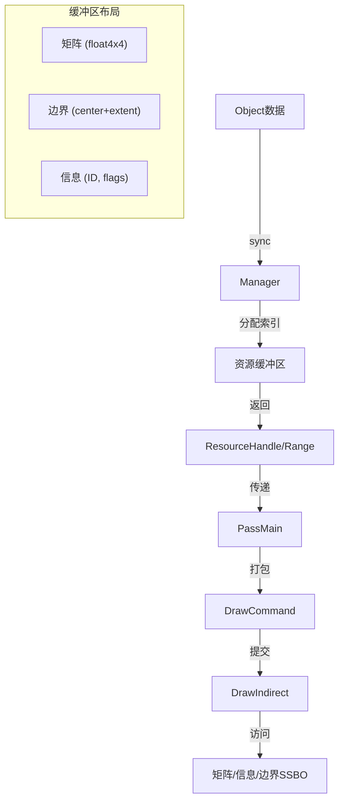

# 18. draw_handle.hh - 资源句柄系统详解

> **文件路径**: `source/blender/draw/intern/draw_handle.hh`
> **总行数**: 280+行
> **创建日期**: 2025-12-18

## 核心概念

资源句柄是Draw Manager中用于**唯一标识和访问GPU资源**的系统。它将物体、实例与GPU端的矩阵/属性数据进行映射。

## 为什么需要这个系统?

### 问题
```
同一帧中:
- 1000个物体需要渲染
- 每个物体需要: 矩阵(64字节), 边界盒(24字节), 信息(32字节)
- 总计需要管理数千个资源的生命周期
```

### 解决方案
**资源句柄** = 索引 + 元数据位

```cpp
ResourceHandle: 32位整数
  [0..30]: 资源索引 (最多2^31 - 1个资源)
  [31]: 正反手标志 (1位)
```

## 类层次结构

### 1. ResourceIndex (底层)

```cpp
struct ResourceIndex {
  uint32_t raw;  // 原始32位值

  /* 构造函数 */
  ResourceIndex() = default;
  ResourceIndex(uint raw_) : raw(raw_) {}
  ResourceIndex(uint index, bool inverted_handedness)
  {
    raw = index;
    SET_FLAG_FROM_TEST(raw, inverted_handedness, 0x80000000u);
  }

  /* 访问器 */
  bool has_inverted_handedness() const {
    return (raw & 0x80000000u) != 0;
  }

  uint resource_index() const {
    return (raw & 0x7FFFFFFFu);  // 掩码取低31位
  }
};
```

**位布局**:
```
原始32位 [IIII IIII IIII IIII IIII IIII IIII IIII]
          ↑
      最高位: 正反手标志 (1=反转)
      低31位: 索引值
```

### 2. ResourceHandle (封装类)

```cpp
class ResourceHandle {
  friend class Manager;
  friend class ResourceHandleRange;

  ResourceIndex index_;

  /* 私有构造: 只能由Manager创建 */
  ResourceHandle(uint raw) : index_(raw) {}
  ResourceHandle(uint index, bool inverted_handedness)
      : index_(index, inverted_handedness) {}

 public:
  ResourceHandle() = default;

  bool is_valid() const { return index_.raw != 0; }

  bool has_inverted_handedness() const {
    return index_.has_inverted_handedness();
  }

  uint resource_index() const {
    return index_.resource_index();
  }

  /* 隐式转换到ResourceIndex */
  operator ResourceIndex() const {
    BLI_assert(is_valid());
    return index_;
  }
};
```

### 3. ResourceIndexRange (范围句柄)

```cpp
struct ResourceIndexRange {
  ResourceIndex first;  // 起始句柄
  uint32_t count = 1;   // 数量

  ResourceIndexRange() = default;
  ResourceIndexRange(ResourceIndex index) : first(index), count(1) {}
  ResourceIndexRange(ResourceIndex index, uint len) : first(index), count(len) {}

  /* 检查第一个元素的正反手 */
  bool has_inverted_handedness() const {
    return first.has_inverted_handedness();
  }

  /* 生成迭代范围 */
  IndexRange index_range() const {
    BLI_assert(count > 0);
    return {first.raw, count};
  }
};
```

### 4. ResourceHandleRange (封装范围)

```cpp
class ResourceHandleRange {
  friend class Manager;

  ResourceHandle start_;
  uint32_t length_;

  ResourceHandleRange(ResourceHandle start, uint len)
      : start_(start), length_(len) {}

 public:
  ResourceHandleRange() = default;

  /* 访问第i个句柄 */
  ResourceHandle operator[](int i) const {
    return ResourceHandle(start_.index_.raw + i);
  }

  uint size() const { return length_; }
  bool is_empty() const { return length_ == 0; }
};
```

## 使用流程

### 1. 创建资源句柄

```cpp
// 在Manager::resource_handle()中
ResourceHandleRange Manager::resource_handle(const ObjectRef &ref)
{
  uint start_index = resource_len_;

  /* 1. 写入矩阵 */
  matrix_buf.current().get_or_resize(resource_len_).sync(*ref.object);

  /* 2. 写入边界 */
  bounds_buf.current().get_or_resize(resource_len_).sync(*ref.object);

  /* 3. 写入信息 */
  infos_buf.current().get_or_resize(resource_len_).sync(ref, ...);

  resource_len_++;

  /* 4. 返回句柄 */
  return ResourceHandleRange(
    ResourceHandle(start_index,
                   (ref.object->transflag & OB_NEG_SCALE) != 0),
    1
  );
}
```

### 2. 在Pass中使用

```cpp
// overlay_mesh.cc
void MeshOverlay::draw(Manager &manager, View &view)
{
  PassMain pass("Mesh");

  /* 1. 获取对象句柄 */
  ResourceHandleRange handle = manager.resource_handle(object_ref);

  /* 2. 在Pass中绘制 */
  pass.draw(batch, handle);  // handle会自动解包为索引范围
}
```

### 3. GPU端访问

```hlsl
// 在顶点着色器中
struct ObjectMatrix {
  float4x4 model;
};

layout(std430, binding = 0) readonly buffer matrix_buf {
  ObjectMatrix matrices[];
};

// 通过实例ID或资源索引获取
uint res_index = gl_InstanceID;  // 或其他方式
ObjectMatrix obj_mat = matrices[res_index];

gl_Position = persmat * obj_mat.model * vec4(pos, 1.0);
```

## 正反手处理

### 为什么需要正反手标志?

```
物体缩放变换:
- 正常: (1, 1, 1) → 正常三角形顺序
- 负缩放: (-1, -1, -1) → 三角形顺序反转 (正面变背面)

GPU需要知道:
- 是否需要反转正面/背面剔除
- 是否需要反转法线
```

### 在句柄中的编码

```cpp
// 管理器处
bool is_neg_scale = (ref.object->transflag & OB_NEG_SCALE) != 0;
return ResourceHandle(resource_len_++, is_neg_scale);

// 句柄访问
if (handle.has_inverted_handedness()) {
  GPU_front_facing(true);  // 反转正面判定
}
```

### 在Command中的应用

```cpp
// draw_command.hh
struct DrawCommand {
  uint32_t draw_id;       // 资源索引
  uint32_t instance_count;
  uint32_t base_instance; // 基础实例偏移

  void execute(RecordingState &state) const {
    if (state.inverted_view) {
      // 视图反转
      GPU_front_facing(true);
    }

    // 检查资源句柄的正反手
    ResourceHandle handle(draw_id & 0x7FFFFFFFu);
    if (handle.has_inverted_handedness()) {
      GPU_front_facing(true);
    }

    GPU_draw_indirect(...);
  }
};
```

## 资源索引范围

### 单个物体 vs 实例化

```cpp
// 单个物体
ResourceHandle handle = manager.resource_handle(ref);
return ResourceHandleRange(handle, 1);

// 实例化 (Dupliverts)
uint start = resource_len_;
for (DupliObject *dupli : *ref.duplis_) {
  write_matrix(dupli->mat);
  write_bounds(dupli->bounds);
  resource_len_++;
}
return ResourceHandleRange(ResourceHandle(start, false),
                          resource_len_ - start);
```

### 在DrawMultiBuf中的使用

```cpp
// draw_command.hh: DrawMultiBuf::append_draw()
void append_draw(..., ResourceIndexRange index_range, ...)
{
  // 遍历资源索引范围
  for (auto res_index : index_range.index_range()) {
    // 为每个资源创建原型
    DrawPrototype &proto = prototype_buf_.append();
    proto.res_index = res_index;
    // ...
  }
}
```

## 延迟句柄分配

### 现象
```cpp
// overlay_base.hh: ObjectRef
struct ObjectRef {
  Object *object;
  ResourceHandleRange handle_;  // 句柄缓存
  ResourceHandleRange sculpt_handle_;
};
```

### 作用
```cpp
// draw_manager.hh:315-322
inline ResourceHandleRange Manager::unique_handle(const ObjectRef &ref)
{
  if (!ref.handle_.is_valid()) {
    // 延迟分配，避免未使用对象的开销
    const_cast<ObjectRef &>(ref).handle_ = resource_handle(ref);
  }
  return ref.handle_;
}
```

**优化点**: 只有在实际需要绘制时才分配资源，节省内存。

## 整数编码技巧

### ResourceIndex 位操作

```cpp
/* 原始32位结构 */
0b 0XXXXXXX XXXXXXXX XXXXXXXX XXXXXXXX

/* 索引部分 (31位) */
MAX_INDEX = 2^31 - 1 = 2,147,483,647

/* 标志位 (1位) */
0b 10000000 00000000 00000000 00000000 = 0x80000000
```

### 掩码操作

```cpp
/* 提取索引 */
index = raw & 0x7FFFFFFF;      // 清除最高位

/* 检查标志 */
flag = (raw & 0x80000000) != 0;

/* 设置标志 */
if (flag) {
  raw |= 0x80000000;           // 位置1
} else {
  raw &= 0x7FFFFFFF;           // 位置0
}

/* 宏形式 */
SET_FLAG_FROM_TEST(raw, flag, 0x80000000u);
```

### 为什么不用位域结构体?

```cpp
// 位域方式 (不可移植, 大端/小端问题)
struct ResourceIndex {
  uint32_t index : 31;
  uint32_t inverted : 1;  // 编译器实现不同
};

// 整数位操作 (可移植, 精确控制)
struct ResourceIndex {
  uint32_t raw;  // 完全由我们控制
};
```

## 与Manager的集成

### 完整流程图



### 数据流示例

```cpp
/* 1. 绘制同步 */
Manager::begin_sync();
for (Object *ob : visible_objects) {
  ResourceHandleRange handle = manager.resource_handle(ob);
  /* 缓存到ObjectRef */
}

/* 2. Pass录制 */
PassMain pass("Main");
for (Object *ob : visible_objects) {
  pass.draw(DRW_cache_mesh_get(ob), ob_ref.handle_);
}

/* 3. 命令生成 */
Manager::generate_commands(pass, view);
  ↓
DrawMultiBuf::generate_commands();
  ↓
GPU Compute: 根据可见性过滤，输出最终命令

/* 4. 提交 */
Manager::submit(pass, view);
  ↓
资源绑定到GPU槽位
执行DrawIndirect
```

## 性能关键点

### 1. 減少分支
```cpp
// 坏: 每次都要检查
if (handle.is_valid()) {
  if (handle.has_inverted_handedness()) {
    // ...
  }
}

// 好: 位操作快速
uint32_t raw = handle.index_.raw;
bool inverted = raw & 0x80000000;
uint index = raw & 0x7FFFFFFF;
```

### 2. 批量处理
```cpp
// ResourceIndexRange支持批量
for (auto idx : range.index_range()) {
  // 连续内存访问
}
```

### 3. 零拷贝
```cpp
// 手柄直接存储索引，不占用额外内存
ResourceHandleRange handle = {start, count};
// 只占用2个uint，轻量级传递
```

## 完整数据关系

```
ObjectRef
├─ object (Object*)
├─ handle_ (ResourceHandleRange) ← 关联资源
│   ├─ start (ResourceHandle)
│   │   └─ index (ResourceIndex, 32位)
│   └─ count (uint32_t)
└─ sculpt_handle_ (同上)

Manager
├─ resource_handle(ObjectRef) → 创建/获取句柄
├─ matrix_buf (swappable buffer)
├─ bounds_buf (swappable buffer)
└─ infos_buf (swappable buffer)
```

## 使用示例

```cpp
// 1. 引擎层: object_sync
void Overlay::object_sync(Manager &manager, const ObjectRef &ref)
{
  // 延迟获取或创建
  ResourceHandleRange handle = manager.unique_handle(ref);

  // 添加到Pass
  pass.draw(batch, handle);
}

// 2. Pass层: 打包命令
void PassMain::draw(gpu::Batch *batch, ResourceHandleRange handle)
{
  draw_commands_buf_.append_draw(
    headers_, commands_, batch,
    handle.size(), -1, 0,
    handle.index_range(), 0,
    GPU_PRIM_NONE, 0
  );
}

// 3. Manager层: 生成GPU命令
void Manager::generate_commands(PassMain &pass, View &view)
{
  pass.draw_commands_buf_.generate_commands(
    pass.headers_, pass.commands_,
    view.get_visibility_buffer(),
    ...
  );
}

// 4. GPU层: 访问数据
// 顶点着色器: matrices[gl_InstanceID]
```

## 总结

**资源句柄系统的作用**:
1. **统一标识**: 所有GPU资源通过32位句柄访问
2. **内存映射**: 句柄索引直接映射到SSBO数组
3. **元数据编码**: 在同一整数中存储正反手信息
4. **批量支持**: StringRange支持实例化渲染
5. **延迟分配**: 按需创建，优化内存使用

**关键数据结构**:
- `ResourceIndex`: 32位整数位操作
- `ResourceHandle`: 单个资源封装
- `ResourceHandleRange`: 资源范围封装

**与Manager关系**:
```
Manager负责:
├─ 资源缓冲区分配
├─ 句柄创建和生命周期
└─ 提供GPU数据给Pass

Pass负责:
└─ 使用句柄打包Draw命令

GPU负责:
└─ 通过索引访问SSBO数据
```

---

**下篇**: `19. draw_cache_extract.hh` - Mesh缓存与属性提取系统
