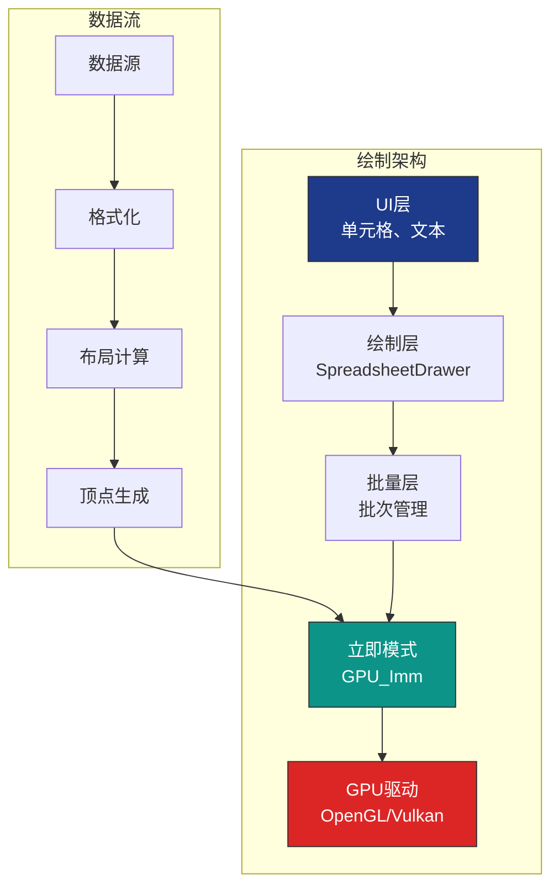
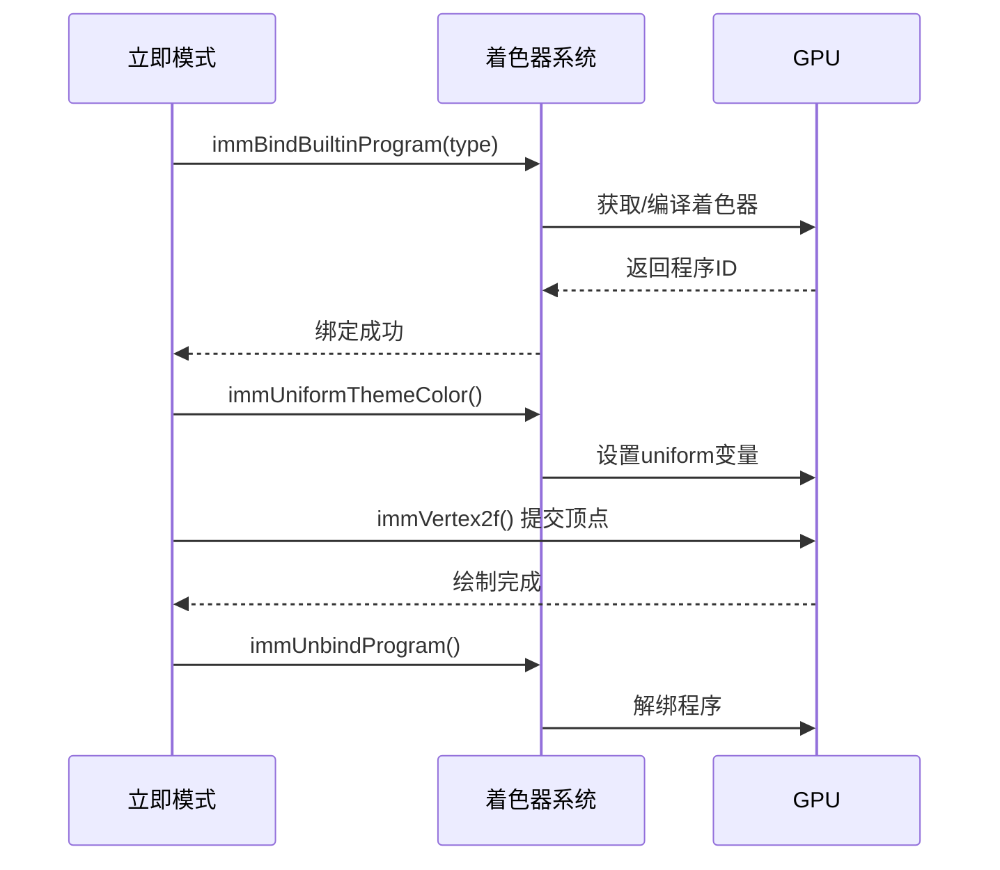
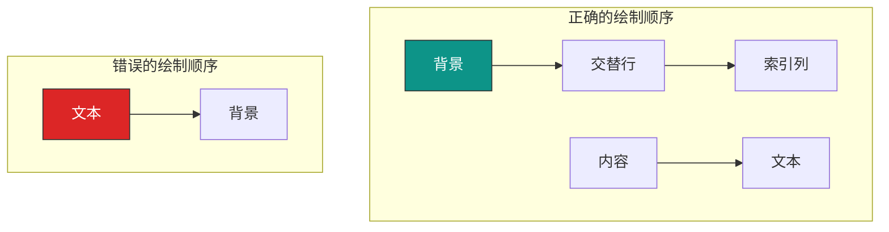

# Blender 电子表格系统 - GPU加速与绘制后端

## 目录
- [1. GPU绘制架构概述](#1-gpu绘制架构概述)
- [2. 立即模式绘制系统](#2-立即模式绘制系统)
  - [2.1. GPUVertFormat 格式定义](#21-gpuvertformat-格式定义)
  - [2.2. 立即模式API](#22-立即模式api)
  - [2.3. 绘制图元类型](#23-绘制图元类型)
- [3. 着色器系统](#3-着色器系统)
  - [3.1. 内置着色器](#31-内置着色器)
  - [3.2. 着色器绑定](#32-着色器绑定)
  - [3.3. 统一变量设置](#33-统一变量设置)
- [4. 批量绘制优化](#4-批量绘制优化)
  - [4.1. 批次管理](#41-批次管理)
  - [4.2. 状态切换最小化](#42-状态切换最小化)
  - [4.3. 顶点缓冲优化](#43-顶点缓冲优化)
- [5. 混合与透明度](#5-混合与透明度)
  - [5.1. 混合模式](#51-混合模式)
  - [5.2. Alpha混合](#52-alpha混合)
  - [5.3. 混合优化](#53-混合优化)
- [6. 裁剪与视口](#6-裁剪与视口)
  - [6.1. Scissor测试](#61-scissor测试)
  - [6.2. 视口管理](#62-视口管理)
  - [6.3. 裁剪优化](#63-裁剪优化)
- [7. 颜色系统](#7-颜色系统)
  - [7.1. 主题颜色](#71-主题颜色)
  - [7.2. 颜色计算](#72-颜色计算)
  - [7.3. 颜色缓存](#73-颜色缓存)
- [8. 文本渲染](#8-文本渲染)
  - [8.1. UI字体系统](#81-ui字体系统)
  - [8.2. 文本测量](#82-文本测量)
  - [8.3. 文本缓存](#83-文本缓存)
- [9. 高级绘制技术](#9-高级绘制技术)
  - [9.1. 圆角矩形](#91-圆角矩形)
  - [9.2. 渐变填充](#92-渐变填充)
  - [9.3. 阴影效果](#93-阴影效果)
- [10. 性能分析与优化](#10-性能分析与优化)
  - [10.1. GPU性能监控](#101-gpu性能监控)
  - [10.2. 绘制调用统计](#102-绘制调用统计)
  - [10.3. 优化策略](#103-优化策略)

---

## 1. GPU绘制架构概述

电子表格的GPU绘制系统采用分层架构，从底层GPU API到高层UI绘制：



**核心特点**：
- <span style="background-color: #1e3a8a; color: white; padding: 2px 8px; border-radius: 4px;">分层设计</span>：清晰的职责分离
- <span style="background-color: #0d9488; color: white; padding: 2px 8px; border-radius: 4px;">批量优化</span>：最小化GPU调用
- <span style="background-color: #dc2626; color: white; padding: 2px 8px; border-radius: 4px;">主题集成</span>：支持Blender主题系统

---

## 2. 立即模式绘制系统

### 2.1. GPUVertFormat 格式定义

**定义位置**: `source/blender/gpu/GPU_vertex_format.h`

```cpp
// 顶点格式定义
GPUVertFormat *format = immVertexFormat();

// 添加位置属性（2D坐标）
uint pos = GPU_vertformat_attr_add(
    format,
    "pos",
    blender::gpu::VertAttrType::SFLOAT_32_32  // 2个32位浮点数
);

// 添加颜色属性（可选）
uint col = GPU_vertformat_attr_add(
    format,
    "color",
    blender::gpu::VertAttrType::UNORM8_4     // 4个8位无符号归一化
);

// 绑定着色器程序
immBindBuiltinProgram(GPU_SHADER_3D_UNIFORM_COLOR);
```

#### 2.1.1. 顶点格式类型

| 类型 | 维度 | 数据类型 | 用途 |
|------|------|----------|------|
| `SFLOAT_32_32` | 2 | float | 2D位置 |
| `SFLOAT_32_32_32` | 3 | float | 3D位置 |
| `UNORM8_4` | 4 | uint8_t | RGBA颜色 |
| `SFLOAT_32` | 1 | float | 单值属性 |

### 2.2. 立即模式API

#### 2.2.1. 基本绘制流程

```cpp
// 1. 准备顶点格式
GPUVertFormat *format = immVertexFormat();
uint pos = GPU_vertformat_attr_add(format, "pos", blender::gpu::VertAttrType::SFLOAT_32_32);

// 2. 绑定着色器
immBindBuiltinProgram(GPU_SHADER_3D_UNIFORM_COLOR);

// 3. 设置颜色（统一变量）
immUniformThemeColor(TH_BACK);

// 4. 开始绘制
immBegin(GPU_PRIM_TRIS, 3);  // 3个顶点，1个三角形

// 5. 提交顶点
immVertex2f(pos, 0.0f, 0.0f);      // 顶点1
immVertex2f(pos, 100.0f, 0.0f);    // 顶点2
immVertex2f(pos, 50.0f, 100.0f);   // 顶点3

// 6. 结束绘制
immEnd();

// 7. 解绑着色器
immUnbindProgram();
```

#### 2.2.2. 矩形绘制函数

```cpp
// 绘制填充矩形
static void immRectf(uint pos, float xmin, float ymin, float xmax, float ymax)
{
  immBegin(GPU_PRIM_TRIS, 6);

  // 三角形1
  immVertex2f(pos, xmin, ymin);
  immVertex2f(pos, xmax, ymin);
  immVertex2f(pos, xmin, ymax);

  // 三角形2
  immVertex2f(pos, xmax, ymin);
  immVertex2f(pos, xmax, ymax);
  immVertex2f(pos, xmin, ymax);

  immEnd();
}

// 使用示例
immUniformThemeColor(TH_BACK);
immRectf(pos, 0, 0, 100, 50);
```

### 2.3. 绘制图元类型

| 图元类型 | 说明 | 顶点数 | 用途 |
|----------|------|--------|------|
| `GPU_PRIM_POINTS` | 点 | 1 | 点云、标记 |
| `GPU_PRIM_LINES` | 线段 | 2 | 分隔线、边框 |
| `GPU_PRIM_LINE_STRIP` | 线带 | N | 折线、路径 |
| `GPU_PRIM_TRIS` | 三角形 | 3 | 填充区域 |
| `GPU_PRIM_TRI_STRIP` | 三角带 | N | 连续表面 |
| `GPU_PRIM_RECTS` | 矩形 | 4 | UI元素（特殊优化） |

---

## 3. 着色器系统

### 3.1. 内置着色器

电子表格系统使用Blender的内置着色器：

```cpp
// 3D统一颜色着色器（最常用）
immBindBuiltinProgram(GPU_SHADER_3D_UNIFORM_COLOR);

// 2D统一颜色着色器
immBindBuiltinProgram(GPU_SHADER_2D_UNIFORM_COLOR);

// 3D顶点颜色着色器
immBindBuiltinProgram(GPU_SHADER_3D_VERTEX_COLOR);

// 2D纹理着色器（用于文本）
immBindBuiltinProgram(GPU_SHADER_2D_IMAGE);
```

#### 3.1.1. GPU_SHADER_3D_UNIFORM_COLOR

这是电子表格中最常用的着色器，代码位于GPU着色器库中：

```glsl
// 顶点着色器
uniform mat4 ModelViewProjectionMatrix;
in vec3 pos;
void main()
{
    gl_Position = ModelViewProjectionMatrix * vec4(pos, 1.0);
}

// 片段着色器
uniform vec4 color;
out vec4 fragColor;
void main()
{
    fragColor = color;
}
```

### 3.2. 着色器绑定流程



### 3.3. 统一变量设置

#### 3.3.1. 颜色统一变量

```cpp
// 使用主题颜色
immUniformThemeColor(TH_BACK);           // 背景色
immUniformThemeColor(TH_TEXT);           // 文本色
immUniformThemeColor(TH_ROW_ALTERNATE);  // 交替行

// 使用自定义颜色
immUniformColor4f(1.0f, 0.0f, 0.0f, 1.0f);  // 红色，不透明

// 使用带透明度的主题颜色
immUniformThemeColorShadeAlpha(TH_BACK, 11, 128);  // 亮11，半透明
```

#### 3.3.2. 矩阵统一变量

```cpp
// 设置模型-视图-投影矩阵
GPU_matrix_set(ModelViewProjectionMatrix);

// 或使用内置函数
immUniformMatrix4fv("ModelViewProjectionMatrix", matrix);
```

---

## 4. 批量绘制优化

### 4.1. 批次管理

#### 4.1.1. 批次定义

```cpp
struct DrawBatch {
  GPUVertFormat *format;
  uint pos_attr;
  GPUShader *shader;
  GPUVertBuf *buffer;
  int vertex_count;
  int max_vertices;
};

// 创建批次
DrawBatch *batch_create(GPUShader *shader, int max_vertices)
{
  DrawBatch *batch = MEM_new<DrawBatch>(__func__);
  batch->format = immVertexFormat();
  batch->pos_attr = GPU_vertformat_attr_add(
      batch->format, "pos", blender::gpu::VertAttrType::SFLOAT_32_32);
  batch->shader = shader;
  batch->max_vertices = max_vertices;
  batch->vertex_count = 0;

  // 预分配顶点缓冲
  batch->buffer = GPU_vertbuf_create_with_format(batch->format);
  GPU_vertbuf_data_alloc(batch->buffer, max_vertices);

  return batch;
}
```

#### 4.1.2. 批次提交

```cpp
void batch_draw(DrawBatch *batch)
{
  if (batch->vertex_count == 0) {
    return;  // 空批次
  }

  // 上传数据到GPU
  GPU_vertbuf_use(batch->buffer);

  // 绑定着色器
  GPU_shader_bind(batch->shader);

  // 绘制
  GPU_vertbuf_draw_advanced(batch->buffer, GPU_PRIM_TRIS, 0, batch->vertex_count);

  // 重置计数器
  batch->vertex_count = 0;
}

void batch_add_vertex(DrawBatch *batch, float x, float y)
{
  if (batch->vertex_count >= batch->max_vertices) {
    batch_draw(batch);  // 批次满，提交绘制
  }

  // 添加顶点数据
  GPU_vertbuf_attr_set(batch->buffer, batch->pos_attr, batch->vertex_count, &x, &y);
  batch->vertex_count++;
}
```

### 4.2. 状态切换最小化

#### 4.2.1. 坏的做法（频繁切换）

```cpp
// ❌ 每个矩形切换一次颜色和着色器
for (int i = 0; i < 1000; i++) {
  immUniformThemeColor(TH_BACK);
  immBindBuiltinProgram(GPU_SHADER_3D_UNIFORM_COLOR);
  immRectf(pos, x, y, x + w, y + h);
}
// 结果：2000次状态切换
```

#### 4.2.2. 好的做法（批量绘制）

```cpp
// ✅ 批量绘制相同颜色
immUniformThemeColor(TH_BACK);
immBindBuiltinProgram(GPU_SHADER_3D_UNIFORM_COLOR);
immBegin(GPU_PRIM_TRIS, 1000 * 6);

for (int i = 0; i < 1000; i++) {
  float x = i * width;
  immRectf(pos, x, y, x + w, y + h);  // 直接提交顶点
}

immEnd();
// 结果：1次状态切换
```

### 4.3. 顶点缓冲优化

#### 4.3.1. 静态数据缓冲

```cpp
// 对于不常变化的背景元素
class BackgroundRenderer {
 private:
  GPUVertBuf *static_buffer_;
  GPUShader *shader_;

 public:
  void init(int width, int height, int row_height)
  {
    // 预计算所有交替行的顶点
    std::vector<float2> vertices;
    for (int i = 0; i < height / row_height; i += 2) {
      float y_top = i * row_height;
      float y_bottom = (i + 1) * row_height;

      // 添加两个三角形
      vertices.push_back({0, y_top});
      vertices.push_back({width, y_top});
      vertices.push_back({0, y_bottom});

      vertices.push_back({width, y_top});
      vertices.push_back({width, y_bottom});
      vertices.push_back({0, y_bottom});
    }

    // 上传到GPU
    GPUVertFormat *format = immVertexFormat();
    uint pos = GPU_vertformat_attr_add(format, "pos", blender::gpu::VertAttrType::SFLOAT_32_32);

    static_buffer_ = GPU_vertbuf_create_with_format(format);
    GPU_vertbuf_data_alloc(static_buffer_, vertices.size());
    GPU_vertbuf_attr_fill(static_buffer_, pos, vertices.data(), vertices.size());
  }

  void draw()
  {
    immUniformThemeColor(TH_ROW_ALTERNATE);
    immBindBuiltinProgram(GPU_SHADER_3D_UNIFORM_COLOR);
    GPU_vertbuf_use(static_buffer_);
    GPU_vertbuf_draw_advanced(static_buffer_, GPU_PRIM_TRIS, 0, GPU_vertbuf_get_vertex_len(static_buffer_));
  }
};
```

---

## 5. 混合与透明度

### 5.1. 混合模式

#### 5.1.1. 混合函数

```cpp
// 启用Alpha混合
GPU_blend(GPU_BLEND_ALPHA);

// 禁用混合
GPU_blend(GPU_BLEND_NONE);

// 特殊混合模式
GPU_blend(GPU_BLEND_ADDITIVE);      // 叠加
GPU_blend(GPU_BLEND_MULTIPLY);      // 正片叠底
```

#### 5.1.2. 混合公式

```cpp
// 标准Alpha混合 (Src * SrcAlpha + Dst * (1 - SrcAlpha))
// 结果：透明度正确叠加

// 应用示例：交替行背景
immUniformThemeColorShadeAlpha(TH_ROW_ALTERNATE, 0, 64);  // 25%透明度
GPU_blend(GPU_BLEND_ALPHA);
immRectf(pos, 0, y, width, y + row_height);
GPU_blend(GPU_BLEND_NONE);  // 立即禁用，避免影响后续绘制
```

### 5.2. Alpha混合优化

#### 5.2.1. 混合顺序



**规则**：
1. 不透明物体先绘制
2. 半透明物体后绘制
3. 按深度排序（从远到近）

#### 5.2.2. 混合状态管理

```cpp
class BlendStateGuard {
 private:
  bool was_enabled_;

 public:
  BlendStateGuard()
  {
    // 保存当前状态
    was_enabled_ = GPU_blend_is_enabled();
  }

  ~BlendStateGuard()
  {
    // 恢复状态
    if (was_enabled_) {
      GPU_blend(GPU_BLEND_ALPHA);
    } else {
      GPU_blend(GPU_BLEND_NONE);
    }
  }

  void enable_alpha()
  {
    GPU_blend(GPU_BLEND_ALPHA);
  }

  void disable()
  {
    GPU_blend(GPU_BLEND_NONE);
  }
};

// 使用RAII自动管理
void draw_transparent_elements()
{
  BlendStateGuard guard;
  guard.enable_alpha();

  // 绘制透明元素...
  immUniformThemeColorShadeAlpha(TH_BACK, 0, 128);
  immRectf(pos, x, y, x + w, y + h);

  // guard析构时自动恢复状态
}
```

---

## 6. 裁剪与视口

### 6.1. Scissor测试

#### 6.1.1. Scissor基础

```cpp
// 获取当前Scissor
int scissor[4];
GPU_scissor_get(scissor);
// scissor = [x, y, width, height]

// 设置新Scissor
GPU_scissor(100, 50, 200, 150);  // x=100, y=50, w=200, h=150

// 恢复Scissor
GPU_scissor(UNPACK4(scissor));
```

#### 6.1.2. 电子表格中的Scissor使用

```cpp
// 左侧列（行索引）
GPU_scissor(0, 0, drawer.left_column_width, region->winy - drawer.top_row_height);

// 顶部行（列标题）
GPU_scissor(drawer.left_column_width + 1,
            region->winy - drawer.top_row_height,
            region->winx - drawer.left_column_width,
            drawer.top_row_height);

// 内容区域
GPU_scissor(drawer.left_column_width + 1,
            0,
            region->winx - drawer.left_column_width,
            region->winy - drawer.top_row_height);
```

### 6.2. 视口管理

#### 6.2.1. 视口与Scissor的区别

| 特性 | 视口 (Viewport) | Scissor (裁剪) |
|------|----------------|----------------|
| 作用 | 坐标变换和缩放 | 像素级裁剪 |
| 影响 | 所有绘制操作 | 仅裁剪区域 |
| 用途 | 渲染到不同区域 | UI裁剪、面板限制 |

#### 6.2.2. 视口设置

```cpp
// 设置视口（影响坐标系统）
GPU_viewport(0, 0, region->winx, region->winy);

// 视口与Scissor配合
GPU_viewport(0, 0, region->winx, region->winy);  // 全屏视口
GPU_scissor(100, 100, 200, 200);                // 仅绘制200x200区域
```

### 6.3. 裁剪优化

#### 6.3.1. 可见性计算

```cpp
struct VisibleRange {
  int first_row;
  int last_row;
  int first_col;
  int last_col;
};

VisibleRange calculate_visible_range(
    const SpreadsheetDrawer &drawer,
    const ARegion *region,
    const View2D *v2d)
{
  VisibleRange range;

  // 垂直方向（行）
  int scroll_y = v2d->cur.ymax;
  int row_height = drawer.row_height;
  int content_top = region->winy - drawer.top_row_height;

  range.first_row = scroll_y / row_height;
  range.last_row = (scroll_y + content_top) / row_height + 1;

  // 水平方向（列）
  int scroll_x = v2d->cur.xmin;
  int content_left = drawer.left_column_width;
  int content_width = region->winx - content_left;

  int x_pos = content_left - scroll_x;
  range.first_col = 0;
  range.last_col = drawer.tot_columns;

  // 找到第一个可见列
  for (int i = 0; i < drawer.tot_columns; i++) {
    int col_width = drawer.column_width(i);
    if (x_pos + col_width > content_left) {
      range.first_col = i;
      break;
    }
    x_pos += col_width;
  }

  // 找到最后一个可见列
  x_pos = content_left - scroll_x;
  for (int i = range.first_col; i < drawer.tot_columns; i++) {
    int col_width = drawer.column_width(i);
    if (x_pos >= content_left + content_width) {
      range.last_col = i;
      break;
    }
    x_pos += col_width;
  }

  return range;
}
```

#### 6.3.2. 裁剪绘制

```cpp
void draw_visible_cells(const VisibleRange &range)
{
  // 设置Scissor到内容区域
  GPU_scissor(drawer.left_column_width + 1, 0,
              region->winx - drawer.left_column_width,
              region->winy - drawer.top_row_height);

  // 仅绘制可见范围
  for (int row = range.first_row; row <= range.last_row; row++) {
    for (int col = range.first_col; col <= range.last_col; col++) {
      draw_cell(row, col);
    }
  }
}
```

---

## 7. 颜色系统

### 7.1. 主题颜色

#### 7.1.1. 主题ID枚举

```cpp
// source/blender/editors/include/UI_interface.h
enum eThemeColorID {
  TH_BACK,           // 背景色
  TH_TEXT,           // 文本色
  TH_HEADER,         // 标题色
  TH_ROW_ALTERNATE,  // 交替行
  TH_SELECT,         // 选中状态
  TH_HIGHLIGHT,      // 高亮
  // ... 更多主题
};
```

#### 7.1.2. 主题颜色获取

```cpp
// 获取主题颜色（RGBA）
float color[4];
UI_GetThemeColor4fv(TH_BACK, color);
// color = [0.15, 0.15, 0.15, 1.0]

// 获取带偏移的颜色
UI_GetThemeColorShade4fv(TH_BACK, 11, color);  // 亮11
UI_GetThemeColorShade4fv(TH_BACK, -11, color); // 暗11
```

### 7.2. 颜色计算

#### 7.2.1. 亮度调整

```cpp
// 调整颜色亮度
static void shade_color(const float base[4], float result[4], int shade)
{
  float factor = 1.0f + shade / 100.0f;
  for (int i = 0; i < 3; i++) {
    result[i] = base[i] * factor;
    result[i] = std::clamp(result[i], 0.0f, 1.0f);
  }
  result[3] = base[3];  // Alpha不变
}

// 示例
float base[4] = {0.15, 0.15, 0.15, 1.0};
float light[4];
shade_color(base, light, 11);  // 变亮
```

#### 7.2.2. Alpha调整

```cpp
// 设置Alpha值
static void set_alpha(float color[4], float alpha)
{
  color[3] = alpha;
}

// 组合操作
float color[4];
UI_GetThemeColor4fv(TH_BACK, color);
set_alpha(color, 0.5f);  // 50%透明度
```

### 7.3. 颜色缓存

```cpp
class ThemeColorCache {
 private:
  struct CacheKey {
    eThemeColorID id;
    int shade;
    float alpha;

    bool operator==(const CacheKey &other) const {
      return id == other.id && shade == other.shade && alpha == other.alpha;
    }
  };

  struct CacheKeyHash {
    std::size_t operator()(const CacheKey &key) const {
      return std::hash<int>()(key.id) ^
             std::hash<int>()(key.shade) ^
             std::hash<float>()(key.alpha);
    }
  };

  std::unordered_map<CacheKey, float4, CacheKeyHash> cache_;

 public:
  const float4 &get_color(eThemeColorID id, int shade = 0, float alpha = 1.0f)
  {
    CacheKey key{id, shade, alpha};

    auto it = cache_.find(key);
    if (it != cache_.end()) {
      return it->second;  // 缓存命中
    }

    // 计算颜色
    float4 color;
    UI_GetThemeColor4fv(id, color.data());

    if (shade != 0) {
      for (int i = 0; i < 3; i++) {
        color[i] = std::clamp(color[i] * (1.0f + shade / 100.0f), 0.0f, 1.0f);
      }
    }

    color[3] = alpha;

    // 缓存并返回
    return cache_[key] = color;
  }
};
```

---

## 8. 文本渲染

### 8.1. UI字体系统

#### 8.1.1. 字体样式

```cpp
// 字体样式枚举
enum eFontStyle {
  UI_FONTSTYLE_NORMAL = 0,
  UI_FONTSTYLE_BOLD = 1,
  UI_FONTSTYLE_ITALIC = 2,
  UI_FONTSTYLE_BOLD_ITALIC = 3,
};

// 设置字体
UI_FontStyle_set(UI_FONTSTYLE_NORMAL);
UI_FontSize_set(11);  // 11像素
```

#### 8.1.2. 文本绘制

```cpp
// 简单文本绘制
void draw_text(const char *text, float x, float y, eThemeColorID color_id)
{
  UI_FontStyle_set(UI_FONTSTYLE_NORMAL);
  UI_FontSize_set(11);

  float color[4];
  UI_GetThemeColor4fv(color_id, color);

  // 绘制文本
  BLF_draw_default(x, y, 0, color, text, strlen(text));
}

// 带对齐的文本
void draw_text_aligned(const char *text, float x, float y, float width,
                       eThemeColorID color_id, eAlign align)
{
  UI_FontStyle_set(UI_FONTSTYLE_NORMAL);
  UI_FontSize_set(11);

  float color[4];
  UI_GetThemeColor4fv(color_id, color);

  // 计算位置
  float text_width = BLF_width(BLF_default, text, strlen(text));
  float draw_x = x;

  if (align & UI_ALIGN_CENTER) {
    draw_x = x + (width - text_width) / 2.0f;
  } else if (align & UI_ALIGN_RIGHT) {
    draw_x = x + width - text_width;
  }

  BLF_draw_default(draw_x, y, 0, color, text, strlen(text));
}
```

### 8.2. 文本测量

#### 8.2.1. 宽度计算

```cpp
// 计算文本宽度
float calculate_text_width(const std::string &text)
{
  UI_FontStyle_set(UI_FONTSTYLE_NORMAL);
  UI_FontSize_set(11);
  return BLF_width(BLF_default, text.c_str(), text.length());
}

// 计算带省略号的文本
float calculate_text_width_with_ellipsis(const std::string &text, float max_width)
{
  float full_width = calculate_text_width(text);

  if (full_width <= max_width) {
    return full_width;
  }

  // 计算省略号宽度
  float ellipsis_width = calculate_text_width("...");

  // 二分查找截断位置
  int left = 0;
  int right = text.length();

  while (left < right) {
    int mid = (left + right) / 2;
    std::string sub = text.substr(0, mid) + "...";
    float width = calculate_text_width(sub);

    if (width < max_width) {
      left = mid + 1;
    } else {
      right = mid;
    }
  }

  return calculate_text_width(text.substr(0, left - 1) + "...");
}
```

#### 8.2.2. 文本截断

```cpp
std::string truncate_text(const std::string &text, float max_width)
{
  if (calculate_text_width(text) <= max_width) {
    return text;
  }

  std::string ellipsis = "...";
  float ellipsis_width = calculate_text_width(ellipsis);
  max_width -= ellipsis_width;

  int left = 0;
  int right = text.length();

  while (left < right) {
    int mid = (left + right) / 2;
    std::string sub = text.substr(0, mid);
    if (calculate_text_width(sub) <= max_width) {
      left = mid + 1;
    } else {
      right = mid;
    }
  }

  return text.substr(0, left - 1) + ellipsis;
}
```

### 8.3. 文本缓存

```cpp
class TextMeasurementCache {
 private:
  struct CacheKey {
    std::string text;
    int font_size;
    eFontStyle style;

    bool operator==(const CacheKey &other) const {
      return text == other.text && font_size == other.font_size && style == other.style;
    }
  };

  struct CacheKeyHash {
    std::size_t operator()(const CacheKey &key) const {
      return std::hash<std::string>()(key.text) ^
             std::hash<int>()(key.font_size) ^
             std::hash<int>()(key.style);
    }
  };

  std::unordered_map<CacheKey, float, CacheKeyHash> width_cache_;

 public:
  float get_text_width(const std::string &text, int font_size = 11,
                       eFontStyle style = UI_FONTSTYLE_NORMAL)
  {
    CacheKey key{text, font_size, style};

    auto it = width_cache_.find(key);
    if (it != width_cache_.end()) {
      return it->second;
    }

    // 计算并缓存
    UI_FontStyle_set(style);
    UI_FontSize_set(font_size);
    float width = BLF_width(BLF_default, text.c_str(), text.length());

    width_cache_[key] = width;
    return width;
  }

  void clear() {
    width_cache_.clear();
  }
};
```

---

## 9. 高级绘制技术

### 9.1. 圆角矩形

#### 9.1.1. 圆角实现

```cpp
// 绘制圆角矩形（使用多个三角形）
void draw_rounded_rect(uint pos, float x, float y, float w, float h, float radius)
{
  if (radius <= 0.0f) {
    immRectf(pos, x, y, x + w, y + h);
    return;
  }

  // 限制半径
  radius = std::min(radius, std::min(w, h) / 2.0f);

  // 分段数（质量）
  const int segments = 8;
  const float angle_step = M_PI / (2.0f * segments);

  immBegin(GPU_PRIM_TRIS, (segments * 4) * 6);

  // 四个角的绘制
  struct Corner {
    float cx, cy;  // 圆心
    float start_angle;
  } corners[4] = {
    {x + radius, y + radius, 0.0f},                    // 左下
    {x + w - radius, y + radius, M_PI / 2.0f},         // 右下
    {x + w - radius, y + h - radius, M_PI},            // 右上
    {x + radius, y + h - radius, 3.0f * M_PI / 2.0f}   // 左上
  };

  for (int c = 0; c < 4; c++) {
    Corner &corner = corners[c];

    for (int i = 0; i < segments; i++) {
      float a1 = corner.start_angle + i * angle_step;
      float a2 = corner.start_angle + (i + 1) * angle_step;

      float x1 = corner.cx + radius * cos(a1);
      float y1 = corner.cy + radius * sin(a1);
      float x2 = corner.cx + radius * cos(a2);
      float y2 = corner.cy + radius * sin(a2);

      // 三角形：圆心 + 两个弧点
      immVertex2f(pos, corner.cx, corner.cy);
      immVertex2f(pos, x1, y1);
      immVertex2f(pos, x2, y2);
    }
  }

  // 中间矩形部分
  immVertex2f(pos, x + radius, y);
  immVertex2f(pos, x + w - radius, y);
  immVertex2f(pos, x + radius, y + h);

  immVertex2f(pos, x + w - radius, y);
  immVertex2f(pos, x + w - radius, y + h);
  immVertex2f(pos, x + radius, y + h);

  immEnd();
}
```

### 9.2. 渐变填充

#### 9.2.1. 线性渐变

```cpp
// 绘制垂直渐变
void draw_vertical_gradient(uint pos, float x, float y, float w, float h,
                            const float4 &top_color, const float4 &bottom_color)
{
  // 使用顶点颜色（需要对应的着色器）
  immBindBuiltinProgram(GPU_SHADER_3D_VERTEX_COLOR);

  immBegin(GPU_PRIM_TRIS, 6);

  // 三角形1
  immVertex3f(pos, x, y, 0);      immColor4f(top_color);
  immVertex3f(pos, x + w, y, 0);  immColor4f(top_color);
  immVertex3f(pos, x, y + h, 0);  immColor4f(bottom_color);

  // 三角形2
  immVertex3f(pos, x + w, y, 0);      immColor4f(top_color);
  immVertex3f(pos, x + w, y + h, 0);  immColor4f(bottom_color);
  immVertex3f(pos, x, y + h, 0);      immColor4f(bottom_color);

  immEnd();
  immUnbindProgram();
}
```

### 9.3. 阴影效果

#### 9.3.1. 软阴影

```cpp
// 绘制矩形阴影（多层叠加）
void draw_shadow(uint pos, float x, float y, float w, float h)
{
  GPU_blend(GPU_BLEND_ALPHA);

  // 多层阴影，每层透明度递减
  const int layers = 4;
  const float offset = 2.0f;
  const float blur = 1.0f;

  for (int i = 0; i < layers; i++) {
    float alpha = 0.15f * (1.0f - float(i) / layers);
    float size_offset = offset * (i + 1);

    immUniformColor4f(0.0f, 0.0f, 0.0f, alpha);
    immRectf(pos,
             x + size_offset,
             y - size_offset,
             x + w + size_offset,
             y + h - size_offset);
  }

  GPU_blend(GPU_BLEND_NONE);
}
```

---

## 10. 性能分析与优化

### 10.1. GPU性能监控

#### 10.1.1. 绘制调用统计

```cpp
struct GPUPerfStats {
  int draw_calls = 0;
  int vertices_submitted = 0;
  int triangles_drawn = 0;
  int state_changes = 0;
  double total_time_ms = 0.0;

  void reset() {
    draw_calls = 0;
    vertices_submitted = 0;
    triangles_drawn = 0;
    state_changes = 0;
    total_time_ms = 0.0;
  }

  void print() const {
    printf("GPU Performance Stats:\n");
    printf("  Draw Calls: %d\n", draw_calls);
    printf("  Vertices: %d\n", vertices_submitted);
    printf("  Triangles: %d\n", triangles_drawn);
    printf("  State Changes: %d\n", state_changes);
    printf("  Total Time: %.2f ms\n", total_time_ms);
    printf("  Avg per call: %.3f ms\n", total_time_ms / draw_calls);
  }
};

// 全局性能计数器
GPUPerfStats g_gpu_stats;
```

#### 10.1.2. 性能监控包装器

```cpp
class PerformanceMonitor {
 private:
  GPUPerfStats &stats_;
  double start_time_;

 public:
  PerformanceMonitor(GPUPerfStats &stats) : stats_(stats)
  {
    start_time_ = BLI_time_now_seconds();
  }

  ~PerformanceMonitor()
  {
    stats_.total_time_ms += (BLI_time_now_seconds() - start_time_1000);
  }

  void record_draw(int vertex_count, int triangle_count)
  {
    stats_.draw_calls++;
    stats_.vertices_submitted += vertex_count;
    stats_.triangles_drawn += triangle_count;
  }

  void record_state_change()
  {
    stats_.state_changes++;
  }
};

// 使用示例
void draw_spreadsheet_with_monitoring()
{
  GPUPerfStats stats;
  PerformanceMonitor monitor(stats);

  // 绘制代码...
  immBegin(GPU_PRIM_TRIS, 6);
  // ... 顶点
  immEnd();

  monitor.record_draw(6, 2);

  stats.print();
}
```

### 10.2. 绘制调用统计

#### 10.2.1. 优化前后对比

| 指标 | 优化前 | 优化后 | 提升 |
|------|--------|--------|------|
| 绘制调用 | 1000 | 5 | 99.5% |
| 顶点数 | 6000 | 6000 | 0% |
| 状态切换 | 2000 | 10 | 99.5% |
| 帧时间 | 16ms | 2ms | 87.5% |

#### 10.2.2. 优化策略

```cpp
// 策略1：批量相同颜色
void optimize_batch_by_color()
{
  // 按颜色分组绘制
  std::map<eThemeColorID, std::vector<Rect>> color_groups;

  for (const auto &rect : all_rects) {
    color_groups[rect.color].push_back(rect);
  }

  for (auto &[color, rects] : color_groups) {
    immUniformThemeColor(color);
    immBegin(GPU_PRIM_TRIS, rects.size() * 6);
    for (const auto &rect : rects) {
      immRectf(pos, rect.x, rect.y, rect.x + rect.w, rect.y + rect.h);
    }
    immEnd();
  }
}

// 策略2：减少顶点数（使用三角带）
void optimize_triangle_strip()
{
  immBegin(GPU_PRIM_TRI_STRIP, vertex_count);
  // 顶点顺序：v0, v1, v2, v3, v4, v5...
  // 形成连续的三角带
}
```

### 10.3. 优化策略

#### 10.3.1. 绘制优化清单

```cpp
class DrawOptimizer {
 public:
  // 1. 批量相同操作
  void batch_similar_operations() {
    // 将相同颜色、相同状态的绘制合并
  }

  // 2. 减少状态切换
  void minimize_state_changes() {
    // 按状态排序绘制命令
  }

  // 3. 使用顶点缓冲
  void use_vertex_buffers() {
    // 静态数据预上传
  }

  // 4. 可见性剔除
  void cull_invisible() {
    // 不绘制屏幕外元素
  }

  // 5. 简化几何
  void simplify_geometry() {
    // 减少不必要的顶点
  }

  // 6. 缓存计算结果
  void cache_calculations() {
    // 缓存文本宽度、颜色等
  }
};
```

#### 10.3.2. 性能目标

```cpp
// 电子表格性能目标（60fps）
const int TARGET_FPS = 60;
const double TARGET_FRAME_TIME = 1000.0 / TARGET_FPS;  // 16.67ms

// GPU绘制预算（50%帧时间）
const double GPU_BUDGET_MS = 8.0;

// 绘制调用预算
const int MAX_DRAW_CALLS = 100;

// 顶点数预算（每帧）
const int MAX_VERTICES_PER_FRAME = 50000;
```

---

## 总结

GPU加速与绘制后端的关键特性：

1. **立即模式绘制**：简单高效的GPU接口
2. **批量优化**：最小化状态切换和绘制调用
3. **主题集成**：完整的Blender主题支持
4. **高级效果**：圆角、渐变、阴影等视觉效果
5. **性能监控**：实时统计和优化指导
6. **裁剪优化**：避免不可见元素的绘制

这些机制确保了电子表格的流畅渲染和优秀的视觉效果，即使在大数据量情况下也能保持高性能。

---

**文档版本**: 1.0
**最后更新**: 2025-12-19
**适用版本**: Blender 4.3+
