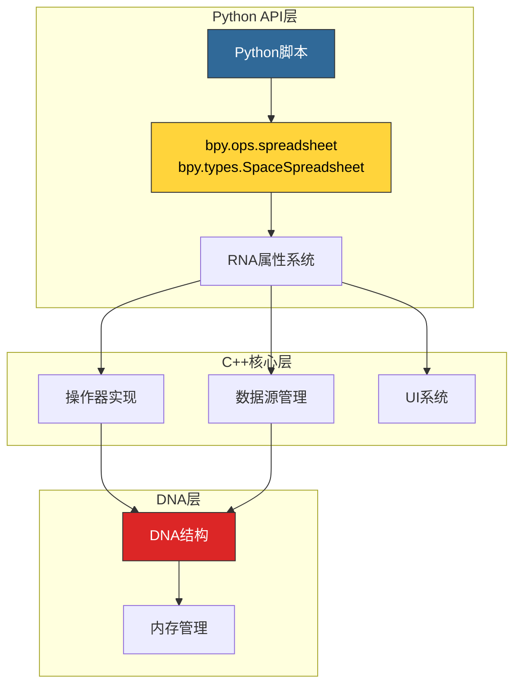

# Blender 电子表格系统 - Python API集成与脚本

## 目录
- [1. Python API架构概述](#1-python-api架构概述)
- [2. RNA属性系统](#2-rna属性系统)
  - [2.1. RNA类型定义](#21-rna类型定义)
  - [2.2. 属性映射](#22-属性映射)
  - [2.3. 访问控制](#23-访问控制)
- [3. 操作器API](#3-操作器api)
  - [3.1. 操作器注册](#31-操作器注册)
  - [3.2. 操作器调用](#32-操作器调用)
  - [3.3. 参数传递](#33-参数传递)
- [4. 数据源访问](#4-数据源访问)
  - [4.1. 获取数据源](#41-获取数据源)
  - [4.2. 列数据读取](#42-列数据读取)
  - [4.3. 行过滤](#43-行过滤)
- [5. 表格操作](#5-表格操作)
  - [5.1. 表格创建](#51-表格创建)
  - [5.2. 列管理](#52-列管理)
  - [5.3. 表格查询](#53-表格查询)
- [6. 过滤器API](#6-过滤器api)
  - [6.1. 过滤器创建](#61-过滤器创建)
  - [6.2. 过滤器配置](#62-过滤器配置)
  - [6.3. 过滤器应用](#63-过滤器应用)
- [7. 事件与通知](#7-事件与通知)
  - [7.1. 事件处理](#71-事件处理)
  - [7.2. 通知系统](#72-通知系统)
  - [7.3. 回调机制](#73-回调机制)
- [8. 高级脚本示例](#8-高级脚本示例)
  - [8.1. 数据导出](#81-数据导出)
  - [8.2. 自定义数据源](#82-自定义数据源)
  - [8.3. 批量处理](#83-批量处理)
- [9. 调试与测试](#9-调试与测试)
  - [9.1. 调试工具](#91-调试工具)
  - [9.2. 单元测试](#92-单元测试)
  - [9.3. 性能分析](#93-性能分析)
- [10. 最佳实践](#10-最佳实践)
  - [10.1. 代码风格](#101-代码风格)
  - [10.2. 错误处理](#102-错误处理)
  - [10.3. 性能优化](#103-性能优化)

---

## 1. Python API架构概述

电子表格系统的Python API基于Blender的RNA（RNA Access）系统构建，提供对电子表格数据和操作的完整访问。



**API层次结构**：
- <span style="background-color: #306998; color: white; padding: 2px 8px; border-radius: 4px;">bpy.ops.spreadsheet</span>：操作器接口
- <span style="background-color: #FFD43B; color: black; padding: 2px 8px; border-radius: 4px;">bpy.types.SpaceSpreadsheet</span>：数据访问
- <span style="background-color: #dc2626; color: white; padding: 2px 8px; border-radius: 4px;">bpy.types.SpreadsheetRowFilter</span>：过滤器管理

---

## 2. RNA属性系统

### 2.1. RNA类型定义

#### 2.1.1. SpaceSpreadsheet RNA

**C++定义**: `source/blender/makesrna/RNA_space_types.cc`

```cpp
static void rna_def_spreadsheet(BlenderRNA *brna)
{
  StructRNA *srna = RNA_def_struct(brna, "SpaceSpreadsheet", "SpaceLink");
  RNA_def_struct_ui_text(srna, "Spreadsheet Space", "Spreadsheet editor space");

  // 表格数组
  PropertyRNA *prop = RNA_def_property(srna, "tables", PROP_POINTER, PROP_NONE);
  RNA_def_property_struct_runtime(prop, rna_Spreadsheet_tables_get);
  RNA_def_property_ui_text(prop, "Tables", "Spreadsheet tables");

  // 过滤器列表
  prop = RNA_def_property(srna, "row_filters", PROP_COLLECTION, PROP_NONE);
  RNA_def_property_collection_runtime(prop, rna_Spreadsheet_row_filters_begin,
                                      rna_Spreadsheet_row_filters_next,
                                      rna_Spreadsheet_row_filters_get,
                                      nullptr, nullptr);
  RNA_def_property_ui_text(prop, "Row Filters", "Row filters for data filtering");

  // 几何ID
  prop = RNA_def_property(srna, "geometry_id", PROP_POINTER, PROP_NONE);
  RNA_def_property_struct_runtime(prop, rna_Spreadsheet_geometry_id_get);
  RNA_def_property_ui_text(prop, "Geometry ID", "Current geometry data source");

  // 过滤器启用标志
  prop = RNA_def_property(srna, "filter_enabled", PROP_BOOLEAN, PROP_NONE);
  RNA_def_property_boolean_sdna(prop, nullptr, "filter_flag", SPREADSHEET_FILTER_ENABLE);
  RNA_def_property_ui_text(prop, "Filter Enabled", "Enable row filtering");
  RNA_def_property_ui_icon(prop, ICON_FILTER, 0);
}
```

#### 2.1.2. SpreadsheetRowFilter RNA

```cpp
static void rna_def_spreadsheet_row_filter(BlenderRNA *brna)
{
  StructRNA *srna = RNA_def_struct(brna, "SpreadsheetRowFilter", nullptr);
  RNA_def_struct_ui_text(srna, "Spreadsheet Row Filter", "Filter for spreadsheet rows");

  // 列名
  PropertyRNA *prop = RNA_def_property(srna, "column_name", PROP_STRING, PROP_NONE);
  RNA_def_property_string_sdna(prop, nullptr, "column_name");
  RNA_def_property_ui_text(prop, "Column Name", "Name of the column to filter");
  RNA_def_property_string_maxlength(prop, 64);

  // 操作类型
  prop = RNA_def_property(srna, "operation", PROP_ENUM, PROP_NONE);
  RNA_def_property_enum_sdna(prop, nullptr, "operation");
  RNA_def_property_enum_items(prop, rna_enum_spreadsheet_filter_operation_items);
  RNA_def_property_ui_text(prop, "Operation", "Filter operation");

  // 启用标志
  prop = RNA_def_property(srna, "enabled", PROP_BOOLEAN, PROP_NONE);
  RNA_def_property_boolean_sdna(prop, nullptr, "flag", SPREADSHEET_ROW_FILTER_ENABLED);
  RNA_def_property_ui_text(prop, "Enabled", "Enable this filter");

  // 各种值类型
  prop = RNA_def_property(srna, "value_int", PROP_INT, PROP_NONE);
  RNA_def_property_int_sdna(prop, nullptr, "value_int");
  RNA_def_property_ui_text(prop, "Value", "Integer value");
  RNA_def_property_range(prop, INT_MIN, INT_MAX);

  prop = RNA_def_property(srna, "value_float", PROP_FLOAT, PROP_NONE);
  RNA_def_property_float_sdna(prop, nullptr, "value_float");
  RNA_def_property_ui_text(prop, "Value", "Float value");
  RNA_def_property_range(prop, -FLT_MAX, FLT_MAX);

  prop = RNA_def_property(srna, "value_float3", PROP_FLOAT, PROP_TRANSLATION);
  RNA_def_property_float_sdna(prop, nullptr, "value_float3");
  RNA_def_property_ui_text(prop, "Value", "3D float value");
  RNA_def_property_float_array(prop, 3);

  prop = RNA_def_property(srna, "value_color", PROP_FLOAT, PROP_COLOR);
  RNA_def_property_float_sdna(prop, nullptr, "value_color");
  RNA_def_property_ui_text(prop, "Value", "Color value");
  RNA_def_property_range(prop, 0.0f, 1.0f);
  RNA_def_property_float_array(prop, 4);

  prop = RNA_def_property(srna, "value_string", PROP_STRING, PROP_NONE);
  RNA_def_property_string_sdna(prop, nullptr, "value_string");
  RNA_def_property_ui_text(prop, "Value", "String value");

  prop = RNA_def_property(srna, "threshold", PROP_FLOAT, PROP_NONE);
  RNA_def_property_float_sdna(prop, nullptr, "threshold");
  RNA_def_property_ui_text(prop, "Threshold", "Tolerance for float comparison");
  RNA_def_property_range(prop, 0.0f, FLT_MAX);
  RNA_def_property_float_default(prop, 0.001f);
}
```

### 2.2. 属性映射

#### 2.2.1. C++到Python映射表

| C++ DNA字段 | Python属性 | 类型 | 说明 |
|-------------|------------|------|------|
| `column_name[64]` | `column_name` | `str` | 列名（最大63字符） |
| `operation` | `operation` | `enum` | 操作类型 |
| `flag` | `enabled` | `bool` | 启用状态 |
| `value_int` | `value_int` | `int` | 整数值 |
| `value_float` | `value_float` | `float` | 浮点值 |
| `value_float3[3]` | `value_float3` | `tuple(float, float, float)` | 3D向量 |
| `value_color[4]` | `value_color` | `tuple(float, float, float, float)` | RGBA颜色 |
| `value_string` | `value_string` | `str` | 字符串 |
| `threshold` | `threshold` | `float` | 浮点阈值 |

#### 2.2.2. 访问示例

```python
import bpy

# 获取当前电子表格空间
sspreadsheet = bpy.context.space_data

# 读取过滤器列表
for i, filter in enumerate(sspreadsheet.row_filters):
    print(f"Filter {i}:")
    print(f"  Column: {filter.column_name}")
    print(f"  Operation: {filter.operation}")
    print(f"  Enabled: {filter.enabled}")

    # 根据类型读取值
    if filter.column_name == "Position":
        print(f"  Value: {filter.value_float3}")
    elif filter.column_name == "Material Index":
        print(f"  Value: {filter.value_int}")
    elif filter.column_name == "Color":
        print(f"  Value: {filter.value_color}")

# 修改属性
if len(sspreadsheet.row_filters) > 0:
    sspreadsheet.row_filters[0].enabled = False
    sspreadsheet.row_filters[0].value_int = 42
```

### 2.3. 访问控制

#### 2.3.1. 只读与可写属性

```python
# 只读属性（运行时计算）
sspreadsheet = bpy.context.space_data

# 可读
print(f"Number of tables: {len(sspreadsheet.tables)}")
print(f"Filter enabled: {sspreadsheet.filter_enabled}")

# 不可写（运行时数据）
try:
    sspreadsheet.tables = []  # 错误！
except AttributeError as e:
    print(f"Error: {e}")

# 可写属性（用户配置）
sspreadsheet.filter_enabled = True
sspreadsheet.geometry_id.attribute_domain = 'POINT'
```

#### 2.3.2. 属性验证

```python
def set_filter_value(filter, value):
    """安全设置过滤器值，自动选择正确字段"""

    # 获取列类型
    column_type = get_column_type(filter.column_name)

    if column_type == 'INT':
        filter.value_int = int(value)
        filter.operation = 'EQUAL'  # 整数只支持基础操作

    elif column_type == 'FLOAT':
        filter.value_float = float(value)
        # 可以设置阈值
        filter.threshold = 0.001

    elif column_type == 'FLOAT3':
        if isinstance(value, (tuple, list)) and len(value) == 3:
            filter.value_float3 = value
        else:
            raise ValueError("Expected 3-element tuple/list for FLOAT3")

    elif column_type == 'COLOR':
        if isinstance(value, (tuple, list)) and len(value) == 4:
            filter.value_color = value
        else:
            raise ValueError("Expected 4-element tuple/list for COLOR")

    elif column_type == 'STRING':
        filter.value_string = str(value)
        filter.operation = 'EQUAL'  # 字符串只支持等于

def get_column_type(column_name):
    """获取列类型（简化示例）"""
    # 实际实现需要查询数据源
    type_map = {
        "Position": "FLOAT3",
        "Material Index": "INT",
        "Color": "COLOR",
        "Name": "STRING",
    }
    return type_map.get(column_name, "UNKNOWN")
```

---

## 3. 操作器API

### 3.1. 操作器注册

#### 3.1.1. 操作器列表

```python
import bpy

# 查看所有电子表格操作器
spreadsheet_ops = [op for op in dir(bpy.ops.spreadsheet) if not op.startswith('_')]
print("Spreadsheet Operators:")
for op in spreadsheet_ops:
    print(f"  - {op}")

# 输出：
#   - add_row_filter_rule
#   - remove_row_filter_rule
#   - change_spreadsheet_data_source
#   - resize_column
#   - fit_column
#   - reorder_columns
```

#### 3.1.2. 操作器文档

```python
# 获取操作器帮助
help(bpy.ops.spreadsheet.add_row_filter_rule)

# 输出：
# add_row_filter_rule()
#
# Add a filter to remove rows from the displayed data
#
# Operator Parameters:
#   (no parameters)
```

### 3.2. 操作器调用

#### 3.2.1. 基本调用

```python
# 添加过滤器
bpy.ops.spreadsheet.add_row_filter_rule()

# 删除过滤器（通过索引）
bpy.ops.spreadsheet.remove_row_filter_rule(index=0)

# 列宽自适应
bpy.ops.spreadsheet.fit_column()

# 重排序列（需要鼠标位置）
# bpy.ops.spreadsheet.reorder_columns()  # 通常在事件处理中调用
```

#### 3.2.2. 带参数调用

```python
# 切换数据源
bpy.ops.spreadsheet.change_spreadsheet_data_source(
    component_type='MESH',  # 组件类型
    attribute_domain='POINT'  # 属性域
)

# 调整列宽
bpy.ops.spreadsheet.resize_column(
    column_index=0,
    width=150  # 像素
)
```

### 3.3. 参数传递

#### 3.3.1. 操作器上下文

```python
# 操作器需要正确的上下文
def add_filter_in_context():
    """在正确的上下文中调用操作器"""

    # 确保在电子表格编辑器中
    if bpy.context.space_data.type != 'SPREADSHEET':
        raise ValueError("Must be in Spreadsheet editor")

    # 调用操作器
    bpy.ops.spreadsheet.add_row_filter_rule()

    # 获取新创建的过滤器
    sspreadsheet = bpy.context.space_data
    new_filter = sspreadsheet.row_filters[-1]

    # 配置过滤器
    new_filter.column_name = "Position"
    new_filter.operation = 'EQUAL'
    new_filter.value_float3 = (1.0, 2.0, 3.0)
```

#### 3.3.2. 批量操作

```python
def create_multiple_filters(configs):
    """批量创建过滤器"""

    results = []
    for config in configs:
        bpy.ops.spreadsheet.add_row_filter_rule()

        filter = bpy.context.space_data.row_filters[-1]
        filter.column_name = config['column']
        filter.operation = config['operation']

        # 设置对应类型的值
        if 'value_int' in config:
            filter.value_int = config['value_int']
        elif 'value_float' in config:
            filter.value_float = config['value_float']
            if 'threshold' in config:
                filter.threshold = config['threshold']
        elif 'value_float3' in config:
            filter.value_float3 = config['value_float3']
        elif 'value_color' in config:
            filter.value_color = config['value_color']

        results.append(filter)

    return results

# 使用示例
configs = [
    {'column': 'Material Index', 'operation': 'GREATER', 'value_int': 5},
    {'column': 'Position', 'operation': 'EQUAL', 'value_float3': (0, 0, 0), 'threshold': 0.1},
    {'column': 'Color', 'operation': 'EQUAL', 'value_color': (1, 0, 0, 1)},
]

filters = create_multiple_filters(configs)
print(f"Created {len(filters)} filters")
```

---

## 4. 数据源访问

### 4.1. 获取数据源

#### 4.1.1. 当前数据源信息

```python
import bpy

def get_current_data_source_info():
    """获取当前数据源信息"""

    sspreadsheet = bpy.context.space_data

    if not sspreadsheet.geometry_id:
        return None

    geom_id = sspreadsheet.geometry_id

    info = {
        'component_type': geom_id.geometry_component_type,
        'attribute_domain': geom_id.attribute_domain,
        'object_eval_state': geom_id.object_eval_state,
        'layer_index': geom_id.layer_index,
        'instance_ids': list(geom_id.instance_ids),
        'viewer_path': geom_id.viewer_path,
    }

    return info

# 使用
info = get_current_data_source_info()
if info:
    print(f"Component: {info['component_type']}")
    print(f"Domain: {info['attribute_domain']}")
```

#### 4.1.2. 切换数据源

```python
def switch_to_mesh_points():
    """切换到网格点域数据源"""

    sspreadsheet = bpy.context.space_data

    # 使用操作器切换
    bpy.ops.spreadsheet.change_spreadsheet_data_source(
        component_type='MESH',
        attribute_domain='POINT'
    )

    print("Switched to Mesh Points")

def switch_to_curve_points():
    """切换到曲线点域数据源"""

    bpy.ops.spreadsheet.change_spreadsheet_data_source(
        component_type='CURVE',
        attribute_domain='POINT'
    )

def switch_to_face_domain():
    """切换到面域"""

    bpy.ops.spreadsheet.change_spreadsheet_data_source(
        component_type='MESH',
        attribute_domain='FACE'
    )
```

### 4.2. 列数据读取

#### 4.2.1. 获取列列表

```python
def get_available_columns():
    """获取当前数据源的所有可用列"""

    sspreadsheet = bpy.context.space_data

    if not sspreadsheet.tables:
        return []

    # 获取活动表格
    active_table = sspreadsheet.tables[0]  # 简化：取第一个表格

    columns = []
    for col in active_table.columns:
        columns.append({
            'name': col.id.name,
            'type': col.data_type,
            'width': col.width,
            'display_name': col.display_name,
        })

    return columns

# 使用
columns = get_available_columns()
for col in columns:
    print(f"{col['name']} ({col['type']}) - {col['width']} units")
```

#### 4.2.2. 读取单元格值

```python
# 注意：Python API不直接提供单元格值读取
# 需要通过数据源间接访问

def get_cell_value_at(row_index, column_name):
    """获取指定位置的单元格值（概念演示）"""

    # 实际实现需要：
    # 1. 获取数据源
    # 2. 获取列数据
    # 3. 访问指定行

    # 这里展示概念性API
    sspreadsheet = bpy.context.space_data

    # 检查过滤器
    if sspreadsheet.filter_enabled:
        # 应用过滤器逻辑
        actual_row = apply_filters(row_index)
    else:
        actual_row = row_index

    # 从数据源读取（需要C++扩展）
    # value = data_source.get_column_values(column_name)[actual_row]

    # 返回格式化值
    return f"Row {actual_row}, Col {column_name}"

# 实际使用中，建议：
# 1. 使用Blender的几何节点系统处理数据
# 2. 导出数据到外部处理
# 3. 使用C++扩展直接访问
```

### 4.3. 行过滤

#### 4.3.1. 过滤器管理

```python
def get_all_filters():
    """获取所有过滤器"""

    sspreadsheet = bpy.context.space_data
    return list(sspreadsheet.row_filters)

def get_enabled_filters():
    """获取启用的过滤器"""

    return [f for f in get_all_filters() if f.enabled]

def find_filter_by_column(column_name):
    """按列名查找过滤器"""

    for f in get_all_filters():
        if f.column_name == column_name:
            return f
    return None
```

#### 4.3.2. 过滤器应用

```python
def apply_filters_to_data(data, filters):
    """在Python中模拟过滤器应用"""

    filtered_data = []

    for row in data:
        keep_row = True

        for filter in filters:
            if not filter.enabled:
                continue

            column_name = filter.column_name
            operation = filter.operation

            # 获取行中对应列的值
            row_value = row.get(column_name)

            if row_value is None:
                continue

            # 执行比较
            if operation == 'EQUAL':
                if isinstance(row_value, (int, float)):
                    if abs(row_value - filter.value_float) > filter.threshold:
                        keep_row = False
                elif isinstance(row_value, str):
                    if row_value != filter.value_string:
                        keep_row = False
                # ... 其他类型

            elif operation == 'GREATER':
                if row_value <= filter.value_float:
                    keep_row = False

            elif operation == 'LESS':
                if row_value >= filter.value_float:
                    keep_row = False

            if not keep_row:
                break

        if keep_row:
            filtered_data.append(row)

    return filtered_data

# 示例数据
data = [
    {'Material Index': 1, 'Position': (0, 0, 0)},
    {'Material Index': 5, 'Position': (1, 2, 3)},
    {'Material Index': 10, 'Position': (4, 5, 6)},
]

filters = [
    {'column': 'Material Index', 'operation': 'GREATER', 'value_float': 3},
]

# filtered = apply_filters_to_data(data, filters)
# 结果：只保留 Material Index > 3 的行
```

---

## 5. 表格操作

### 5.1. 表格创建

#### 5.1.1. 表格结构

```python
def print_table_structure():
    """打印表格结构"""

    sspreadsheet = bpy.context.space_data

    for i, table in enumerate(sspreadsheet.tables):
        print(f"\nTable {i}:")
        print(f"  ID: {table.id}")
        print(f"  Columns: {len(table.columns)}")
        print(f"  Flags: {table.flag}")
        print(f"  Last Used: {table.last_used}")

        for j, col in enumerate(table.columns):
            print(f"    Column {j}:")
            print(f"      Name: {col.id.name}")
            print(f"      Type: {col.data_type}")
            print(f"      Width: {col.width}")
            print(f"      Display: {col.display_name}")
```

#### 5.1.2. 表格缓存

```python
def find_table_by_id(table_id):
    """按ID查找表格"""

    sspreadsheet = bpy.context.space_data

    for table in sspreadsheet.tables:
        if table.id == table_id:
            return table

    return None

def get_or_create_table(table_id):
    """获取或创建表格"""

    table = find_table_by_id(table_id)
    if table is None:
        # 创建新表格（需要C++扩展）
        # table = bpy.ops.spreadsheet.create_table(id=table_id)
        pass

    return table
```

### 5.2. 列管理

#### 5.2.1. 列操作

```python
def adjust_column_width(column_index, width):
    """调整列宽"""

    sspreadsheet = bpy.context.space_data

    if not sspreadsheet.tables:
        return False

    table = sspreadsheet.tables[0]

    if column_index < 0 or column_index >= len(table.columns):
        return False

    table.columns[column_index].width = width
    return True

def fit_column_to_content(column_index):
    """自适应列宽"""

    # 使用操作器
    bpy.ops.spreadsheet.fit_column()

    # 或手动计算
    # table = bpy.context.space_data.tables[0]
    # col = table.columns[column_index]
    # col.width = calculate_optimal_width(col.id.name)
```

#### 5.2.2. 列排序

```python
def reorder_columns(new_order):
    """重新排序列

    Args:
        new_order: 列索引的新顺序列表，如 [2, 0, 1]
    """

    sspreadsheet = bpy.context.space_data

    if not sspreadsheet.tables:
        return

    table = sspreadsheet.tables[0]

    if len(new_order) != len(table.columns):
        raise ValueError("New order length mismatch")

    # 保存当前列
    original_columns = list(table.columns)

    # 重新排序
    for i, old_index in enumerate(new_order):
        table.columns[i] = original_columns[old_index]

    # 标记为手动编辑
    table.flag |= 1  # SPREADSHEET_TABLE_FLAG_MANUALLY_EDITED

# 使用示例
# reorder_columns([2, 0, 1])  # 将第3列移到最前，然后是第1列，最后是第2列
```

### 5.3. 表格查询

#### 5.3.1. 查询函数

```python
def find_column_by_name(name):
    """按名称查找列"""

    sspreadsheet = bpy.context.space_data

    for table in sspreadsheet.tables:
        for col in table.columns:
            if col.id.name == name:
                return col

    return None

def get_column_index(name):
    """获取列索引"""

    sspreadsheet = bpy.context.space_data

    if not sspreadsheet.tables:
        return -1

    table = sspreadsheet.tables[0]

    for i, col in enumerate(table.columns):
        if col.id.name == name:
            return i

    return -1
```

#### 5.3.2. 统计信息

```python
def get_table_stats():
    """获取表格统计信息"""

    sspreadsheet = bpy.context.space_data

    stats = {
        'num_tables': len(sspreadsheet.tables),
        'total_columns': 0,
        'column_types': {},
    }

    for table in sspreadsheet.tables:
        stats['total_columns'] += len(table.columns)

        for col in table.columns:
            col_type = col.data_type
            stats['column_types'][col_type] = stats['column_types'].get(col_type, 0) + 1

    return stats

# 使用
stats = get_table_stats()
print(f"Total columns: {stats['total_columns']}")
print(f"Column types: {stats['column_types']}")
```

---

## 6. 过滤器API

### 6.1. 过滤器创建

#### 6.1.1. 创建过滤器

```python
def create_filter(column_name, operation, value, **kwargs):
    """创建并配置过滤器

    Args:
        column_name: 列名
        operation: 操作 ('EQUAL', 'GREATER', 'LESS')
        value: 值（根据列类型）
        **kwargs: 额外参数（如 threshold）

    Returns:
        新创建的过滤器对象
    """

    # 添加过滤器
    bpy.ops.spreadsheet.add_row_filter_rule()

    # 获取新过滤器
    sspreadsheet = bpy.context.space_data
    new_filter = sspreadsheet.row_filters[-1]

    # 配置
    new_filter.column_name = column_name
    new_filter.operation = operation

    # 设置值
    if isinstance(value, int):
        new_filter.value_int = value
    elif isinstance(value, float):
        new_filter.value_float = value
    elif isinstance(value, (tuple, list)):
        if len(value) == 3:
            new_filter.value_float3 = value
        elif len(value) == 4:
            new_filter.value_color = value
    elif isinstance(value, str):
        new_filter.value_string = value

    # 额外参数
    if 'threshold' in kwargs:
        new_filter.threshold = kwargs['threshold']

    return new_filter

# 使用示例
filter1 = create_filter("Material Index", "GREATER", 5)
filter2 = create_filter("Position", "EQUAL", (0, 0, 0), threshold=0.1)
filter3 = create_filter("Color", "EQUAL", (1, 0, 0, 1))
```

#### 6.1.2. 批量创建

```python
def create_filters_from_config(config_list):
    """从配置列表批量创建过滤器"""

    filters = []

    for config in config_list:
        try:
            filter = create_filter(
                config['column'],
                config['operation'],
                config['value'],
                **config.get('options', {})
            )
            filters.append(filter)
        except Exception as e:
            print(f"Failed to create filter for {config['column']}: {e}")

    return filters

# 配置示例
configs = [
    {
        'column': 'Material Index',
        'operation': 'GREATER',
        'value': 5,
        'options': {}
    },
    {
        'column': 'Position',
        'operation': 'EQUAL',
        'value': (0, 0, 0),
        'options': {'threshold': 0.1}
    },
]

filters = create_filters_from_config(configs)
```

### 6.2. 过滤器配置

#### 6.2.1. 修改过滤器

```python
def modify_filter(filter, **kwargs):
    """修改过滤器属性

    Args:
        filter: 过滤器对象
        **kwargs: 要修改的属性
    """

    for key, value in kwargs.items():
        if hasattr(filter, key):
            setattr(filter, key, value)
        else:
            raise AttributeError(f"Filter has no attribute '{key}'")

# 使用
filter = bpy.context.space_data.row_filters[0]

# 修改值
modify_filter(filter, value_int=10)

# 修改操作
modify_filter(filter, operation='LESS')

# 修改启用状态
modify_filter(filter, enabled=False)

# 修改阈值
modify_filter(filter, threshold=0.05)
```

#### 6.2.2. 复制过滤器

```python
def duplicate_filter(filter):
    """复制过滤器"""

    sspreadsheet = bpy.context.space_data

    # 创建新过滤器
    bpy.ops.spreadsheet.add_row_filter_rule()
    new_filter = sspreadsheet.row_filters[-1]

    # 复制属性
    new_filter.column_name = filter.column_name
    new_filter.operation = filter.operation
    new_filter.enabled = filter.enabled

    # 复制值
    new_filter.value_int = filter.value_int
    new_filter.value_float = filter.value_float
    new_filter.value_float3 = filter.value_float3
    new_filter.value_color = filter.value_color
    new_filter.value_string = filter.value_string
    new_filter.threshold = filter.threshold

    return new_filter

# 使用
original = bpy.context.space_data.row_filters[0]
copy = duplicate_filter(original)
```

### 6.3. 过滤器应用

#### 6.3.1. 启用/禁用

```python
def enable_all_filters():
    """启用所有过滤器"""

    for filter in bpy.context.space_data.row_filters:
        filter.enabled = True

def disable_all_filters():
    """禁用所有过滤器"""

    for filter in bpy.context.space_data.row_filters:
        filter.enabled = False

def toggle_filter(index):
    """切换指定过滤器的启用状态"""

    filters = bpy.context.space_data.row_filters

    if 0 <= index < len(filters):
        filters[index].enabled = not filters[index].enabled
```

#### 6.3.2. 过滤器状态

```python
def get_filter_status():
    """获取过滤器状态统计"""

    filters = bpy.context.space_data.row_filters

    status = {
        'total': len(filters),
        'enabled': 0,
        'disabled': 0,
        'by_column': {},
    }

    for filter in filters:
        if filter.enabled:
            status['enabled'] += 1
        else:
            status['disabled'] += 1

        column = filter.column_name
        status['by_column'][column] = status['by_column'].get(column, 0) + 1

    return status

# 使用
status = get_filter_status()
print(f"Total filters: {status['total']}")
print(f"Enabled: {status['enabled']}")
print(f"By column: {status['by_column']}")
```

---

## 7. 事件与通知

### 7.1. 事件处理

#### 7.1.1. 模态操作器

```python
import bpy

class SpreadsheetModalOperator(bpy.types.Operator):
    """电子表格模态操作器示例"""

    bl_idname = "spreadsheet.modal_example"
    bl_label = "Spreadsheet Modal Example"

    # 模态操作器需要定时器
    _timer = None

    def modal(self, context, event):
        """模态事件处理"""

        if event.type == 'TIMER':
            # 定时器事件 - 执行周期性任务
            self.periodic_task(context)

        if event.type == 'ESC':
            # 取消
            self.cancel(context)
            return {'CANCELLED'}

        if event.type == 'LEFTMOUSE':
            # 完成
            self.finish(context)
            return {'FINISHED'}

        return {'RUNNING_MODAL'}

    def invoke(self, context, event):
        """操作器调用"""

        # 添加定时器
        wm = context.window_manager
        self._timer = wm.event_timer_add(0.1, window=context.window)
        wm.modal_handler_add(self)

        return {'RUNNING_MODAL'}

    def periodic_task(self, context):
        """周期性任务"""

        # 例如：自动更新过滤器
        sspreadsheet = context.space_data
        if sspreadsheet.row_filters:
            # 执行某些操作
            pass

    def cancel(self, context):
        """取消清理"""

        wm = context.window_manager
        wm.event_timer_remove(self._timer)

    def finish(self, context):
        """完成清理"""

        wm = context.window_manager
        wm.event_timer_remove(self._timer)

# 注册
def register():
    bpy.utils.register_class(SpreadsheetModalOperator)

def unregister():
    bpy.utils.unregister_class(SpreadsheetModalOperator)

# 使用
# bpy.ops.spreadsheet.modal_example()
```

### 7.2. 通知系统

#### 7.2.1. 发送通知

```python
def notify_spreadsheet_update():
    """通知电子表格更新"""

    # 发送通知触发重绘
    bpy.ops.wm.redraw_timer(type='DRAW_WIN_SWAP', iterations=1)

def update_and_notify():
    """更新数据并通知"""

    # 修改数据
    sspreadsheet = bpy.context.space_data

    # 添加过滤器
    bpy.ops.spreadsheet.add_row_filter_rule()

    # 通知更新
    notify_spreadsheet_update()
```

#### 7.2.2. 监听变化

```python
import bpy
from bpy.app.handlers import persistent

@persistent
def on_spreadsheet_change(scene):
    """电子表格变化回调"""

    sspreadsheet = bpy.context.space_data

    if sspreadsheet and sspreadsheet.type == 'SPREADSHEET':
        print("Spreadsheet changed!")
        print(f"Filters: {len(sspreadsheet.row_filters)}")
        print(f"Tables: {len(sspreadsheet.tables)}")

# 注册处理器
def register_handler():
    bpy.app.handlers.depsgraph_update_post.append(on_spreadsheet_change)

# 移除处理器
def unregister_handler():
    bpy.app.handlers.depsgraph_update_post.remove(on_spreadsheet_change)
```

### 7.3. 回调机制

#### 7.3.1. 属性更新回调

```python
class SpreadsheetFilterProperties(bpy.types.PropertyGroup):
    """自定义属性组，带更新回调"""

    value: bpy.props.FloatProperty(
        name="Value",
        default=1.0,
        update=lambda self, context: self.on_value_update(context)
    )

    def on_value_update(self, context):
        """值更新回调"""

        print(f"Value updated to: {self.value}")

        # 自动更新相关过滤器
        sspreadsheet = context.space_data
        for filter in sspreadsheet.row_filters:
            if filter.column_name == "Custom":
                filter.value_float = self.value

# 注册
def register():
    bpy.utils.register_class(SpreadsheetFilterProperties)
    bpy.types.Scene.spreadsheet_props = bpy.props.PointerProperty(
        type=SpreadsheetFilterProperties
    )
```

---

## 8. 高级脚本示例

### 8.1. 数据导出

#### 8.1.1. 导出到CSV

```python
import bpy
import csv

def export_spreadsheet_to_csv(filepath):
    """导出电子表格数据到CSV"""

    sspreadsheet = bpy.context.space_data

    if not sspreadsheet.tables:
        print("No tables available")
        return False

    table = sspreadsheet.tables[0]

    with open(filepath, 'w', newline='', encoding='utf-8') as f:
        writer = csv.writer(f)

        # 写入表头
        headers = [col.id.name for col in table.columns]
        writer.writerow(headers)

        # 写入数据（需要C++扩展获取实际数据）
        # 这里展示结构
        print(f"Would export {len(headers)} columns")
        print(f"Headers: {headers}")

    print(f"Exported to {filepath}")
    return True

# 使用
# export_spreadsheet_to_csv("C:/temp/spreadsheet.csv")
```

#### 8.1.2. 导出过滤器配置

```python
def export_filter_configuration(filepath):
    """导出过滤器配置到JSON"""

    import json

    sspreadsheet = bpy.context.space_data

    filters_data = []
    for filter in sspreadsheet.row_filters:
        filter_dict = {
            'column_name': filter.column_name,
            'operation': filter.operation,
            'enabled': filter.enabled,
            'threshold': filter.threshold,
        }

        # 根据类型添加值
        if filter.column_name == "Position":
            filter_dict['value'] = list(filter.value_float3)
        elif filter.column_name == "Color":
            filter_dict['value'] = list(filter.value_color)
        elif filter.column_name == "Material Index":
            filter_dict['value'] = filter.value_int
        else:
            filter_dict['value'] = filter.value_float

        filters_data.append(filter_dict)

    with open(filepath, 'w') as f:
        json.dump(filters_data, f, indent=2)

    print(f"Exported {len(filters_data)} filters to {filepath}")
    return True

def import_filter_configuration(filepath):
    """从JSON导入过滤器配置"""

    import json

    with open(filepath, 'r') as f:
        filters_data = json.load(f)

    # 清除现有过滤器
    sspreadsheet = bpy.context.space_data
    while len(sspreadsheet.row_filters) > 0:
        bpy.ops.spreadsheet.remove_row_filter_rule(index=0)

    # 创建新过滤器
    for filter_data in filters_data:
        create_filter(
            filter_data['column_name'],
            filter_data['operation'],
            filter_data['value'],
            threshold=filter_data.get('threshold', 0.001)
        )

    print(f"Imported {len(filters_data)} filters")
    return True
```

### 8.2. 自定义数据源

#### 8.2.1. Python数据源桥接

```python
class PythonDataSource:
    """Python数据源桥接（概念）"""

    def __init__(self, data):
        self.data = data  # list of dicts

    def get_columns(self):
        """获取列定义"""
        if not self.data:
            return []

        first_row = self.data[0]
        return list(first_row.keys())

    def get_column_type(self, column_name):
        """推断列类型"""
        if not self.data:
            return 'UNKNOWN'

        sample = self.data[0].get(column_name)

        if isinstance(sample, int):
            return 'INT'
        elif isinstance(sample, float):
            return 'FLOAT'
        elif isinstance(sample, str):
            return 'STRING'
        elif isinstance(sample, (tuple, list)):
            if len(sample) == 3:
                return 'FLOAT3'
            elif len(sample) == 4:
                return 'COLOR'

        return 'UNKNOWN'

    def get_values(self, column_name):
        """获取列值"""
        return [row.get(column_name) for row in self.data]

    def apply_filters(self, filters):
        """应用过滤器"""
        filtered = self.data.copy()

        for filter in filters:
            if not filter.enabled:
                continue

            column = filter.column_name
            operation = filter.operation

            filtered = [
                row for row in filtered
                if self._matches_filter(row.get(column), filter)
            ]

        return filtered

    def _matches_filter(self, value, filter):
        """检查值是否匹配过滤器"""
        if value is None:
            return False

        if filter.operation == 'EQUAL':
            if isinstance(value, (int, float)):
                return abs(value - filter.value_float) <= filter.threshold
            else:
                return value == filter.value_string

        elif filter.operation == 'GREATER':
            return value > filter.value_float

        elif filter.operation == 'LESS':
            return value < filter.value_float

        return False

# 使用示例
data = [
    {'Material Index': 1, 'Position': (0, 0, 0), 'Name': 'Vertex1'},
    {'Material Index': 5, 'Position': (1, 2, 3), 'Name': 'Vertex2'},
    {'Material Index': 10, 'Position': (4, 5, 6), 'Name': 'Vertex3'},
]

source = PythonDataSource(data)
columns = source.get_columns()
print(f"Columns: {columns}")

# 导出到Blender（需要C++扩展）
# export_to_spreadsheet(source)
```

### 8.3. 批量处理

#### 8.3.1. 批量过滤器操作

```python
def batch_filter_operations():
    """批量过滤器操作示例"""

    operations = [
        ('Material Index', 'GREATER', 5),
        ('Position', 'EQUAL', (0, 0, 0), 0.1),
        ('Color', 'EQUAL', (1, 0, 0, 1)),
    ]

    created = []

    for op in operations:
        column = op[0]
        operation = op[1]
        value = op[2]
        threshold = op[3] if len(op) > 3 else 0.001

        filter = create_filter(column, operation, value, threshold=threshold)
        created.append(filter)

    return created

def cleanup_filters():
    """清理无效过滤器"""

    sspreadsheet = bpy.context.space_data

    to_remove = []
    for i, filter in enumerate(sspreadsheet.row_filters):
        # 检查列是否存在
        if not find_column_by_name(filter.column_name):
            to_remove.append(i)

    # 从后往前删除
    for i in reversed(to_remove):
        bpy.ops.spreadsheet.remove_row_filter_rule(index=i)

    return len(to_remove)
```

---

## 9. 调试与测试

### 9.1. 调试工具

#### 9.1.1. 调试信息打印

```python
def debug_print_spreadsheet_state():
    """打印电子表格完整状态"""

    sspreadsheet = bpy.context.space_data

    print("=" * 60)
    print("SPREADSHEET DEBUG INFO")
    print("=" * 60)

    # 基本信息
    print(f"\nSpace Type: {sspreadsheet.type}")
    print(f"Filter Enabled: {sspreadsheet.filter_enabled}")
    print(f"Flag: {sspreadsheet.flag}")

    # 表格信息
    print(f"\nTables: {len(sspreadsheet.tables)}")
    for i, table in enumerate(sspreadsheet.tables):
        print(f"  Table {i}:")
        print(f"    Columns: {len(table.columns)}")
        print(f"    Flags: {table.flag}")

        for j, col in enumerate(table.columns):
            print(f"      Col {j}: {col.id.name} ({col.data_type}) - {col.width}")

    # 过滤器信息
    print(f"\nRow Filters: {len(sspreadsheet.row_filters)}")
    for i, filter in enumerate(sspreadsheet.row_filters):
        print(f"  Filter {i}:")
        print(f"    Column: {filter.column_name}")
        print(f"    Operation: {filter.operation}")
        print(f"    Enabled: {filter.enabled}")
        print(f"    Threshold: {filter.threshold}")

        # 显示值
        if filter.column_name == "Position":
            print(f"    Value: {filter.value_float3}")
        elif filter.column_name == "Color":
            print(f"    Value: {filter.value_color}")
        elif filter.column_name == "Material Index":
            print(f"    Value: {filter.value_int}")
        else:
            print(f"    Value: {filter.value_float}")

    # 几何ID信息
    if sspreadsheet.geometry_id:
        geom = sspreadsheet.geometry_id
        print(f"\nGeometry ID:")
        print(f"  Component: {geom.geometry_component_type}")
        print(f"  Domain: {geom.attribute_domain}")
        print(f"  Layer: {geom.layer_index}")

    print("=" * 60)

# 使用
# debug_print_spreadsheet_state()
```

#### 9.1.2. 验证函数

```python
def validate_spreadsheet_state():
    """验证电子表格状态"""

    sspreadsheet = bpy.context.space_data
    errors = []

    # 检查表格
    if not sspreadsheet.tables:
        errors.append("No tables available")

    # 检查过滤器
    for i, filter in enumerate(sspreadsheet.row_filters):
        if not filter.column_name:
            errors.append(f"Filter {i}: Empty column name")

        if filter.column_name and not find_column_by_name(filter.column_name):
            errors.append(f"Filter {i}: Column '{filter.column_name}' not found")

    # 检查几何ID
    if not sspreadsheet.geometry_id:
        errors.append("No geometry ID set")

    return errors

def print_validation_results():
    """打印验证结果"""

    errors = validate_spreadsheet_state()

    if errors:
        print("Validation FAILED:")
        for error in errors:
            print(f"  - {error}")
        return False
    else:
        print("Validation PASSED")
        return True
```

### 9.2. 单元测试

#### 9.2.1. 测试框架

```python
import unittest

class TestSpreadsheetAPI(unittest.TestCase):
    """电子表格API测试"""

    def setUp(self):
        """测试设置"""
        # 确保在电子表格编辑器中
        self.assertTrue(bpy.context.space_data.type == 'SPREADSHEET')
        self.sspreadsheet = bpy.context.space_data

    def test_filter_creation(self):
        """测试过滤器创建"""
        initial_count = len(self.sspreadsheet.row_filters)

        filter = create_filter("Material Index", "GREATER", 5)

        self.assertEqual(len(self.sspreadsheet.row_filters), initial_count + 1)
        self.assertEqual(filter.column_name, "Material Index")
        self.assertEqual(filter.value_int, 5)

    def test_filter_modification(self):
        """测试过滤器修改"""
        filter = create_filter("Position", "EQUAL", (0, 0, 0))

        # 修改值
        filter.value_float3 = (1, 2, 3)
        self.assertEqual(filter.value_float3, (1, 2, 3))

        # 修改启用状态
        filter.enabled = False
        self.assertFalse(filter.enabled)

    def test_filter_removal(self):
        """测试过滤器删除"""
        initial_count = len(self.sspreadsheet.row_filters)

        create_filter("Test", "EQUAL", 1)
        self.assertEqual(len(self.sspreadsheet.row_filters), initial_count + 1)

        bpy.ops.spreadsheet.remove_row_filter_rule(index=initial_count)
        self.assertEqual(len(self.sspreadsheet.row_filters), initial_count)

    def test_batch_operations(self):
        """测试批量操作"""
        configs = [
            {'column': 'Material Index', 'operation': 'GREATER', 'value': 5},
            {'column': 'Position', 'operation': 'EQUAL', 'value': (0, 0, 0)},
        ]

        filters = create_filters_from_config(configs)
        self.assertEqual(len(filters), 2)

        # 验证所有过滤器都启用
        for filter in filters:
            self.assertTrue(filter.enabled)

# 运行测试
def run_tests():
    """运行所有测试"""

    import sys

    # 创建测试套件
    suite = unittest.TestLoader().loadTestsFromTestCase(TestSpreadsheetAPI)

    # 运行测试
    runner = unittest.TextTestRunner(verbosity=2)
    result = runner.run(suite)

    return result.wasSuccessful()
```

### 9.3. 性能分析

#### 9.3.1. 时间测量

```python
import time

def profile_filter_creation(count=100):
    """分析过滤器创建性能"""

    start_time = time.time()

    for i in range(count):
        create_filter("Material Index", "GREATER", i)

    end_time = time.time()
    elapsed = end_time - start_time

    print(f"Created {count} filters in {elapsed:.3f}s")
    print(f"Avg per filter: {elapsed/count*1000:.2f}ms")

    return elapsed

def profile_data_access():
    """分析数据访问性能"""

    start_time = time.time()

    # 执行数据访问操作
    columns = get_available_columns()
    stats = get_table_stats()

    end_time = time.time()

    print(f"Data access took {(end_time-start_time)*1000:.2f}ms")
    print(f"Columns: {len(columns)}")
    print(f"Stats: {stats}")

    return end_time - start_time
```

#### 9.3.2. 性能报告

```python
def generate_performance_report():
    """生成性能报告"""

    print("=" * 60)
    print("PERFORMANCE REPORT")
    print("=" * 60)

    # 测试过滤器创建
    print("\n1. Filter Creation:")
    profile_filter_creation(50)

    # 测试数据访问
    print("\n2. Data Access:")
    profile_data_access()

    # 测试过滤器应用
    print("\n3. Filter Application:")
    start = time.time()
    filters = get_all_filters()
    enabled = get_enabled_filters()
    print(f"Retrieved {len(filters)} filters ({len(enabled)} enabled)")
    print(f"Time: {(time.time()-start)*1000:.2f}ms")

    print("\n" + "=" * 60)
```

---

## 10. 最佳实践

### 10.1. 代码风格

#### 10.1.1. 命名规范

```python
# ✅ 推荐
def create_spreadsheet_filter(column, operation, value):
    """创建电子表格过滤器"""
    pass

def get_enabled_filters():
    """获取启用的过滤器"""
    pass

# ❌ 避免
def csf(col, op, val):  # 缩写不清晰
    pass

def filters():  # 动词缺失
    pass
```

#### 10.1.2. 文档字符串

```python
def create_filter(column_name, operation, value, **kwargs):
    """创建并配置电子表格过滤器

    This function creates a new row filter for the active spreadsheet,
    configures it with the specified parameters, and returns the filter object.

    Args:
        column_name (str): Name of the column to filter
        operation (str): Filter operation ('EQUAL', 'GREATER', 'LESS')
        value: Filter value (type depends on column type)
               - int: for integer columns
               - float: for float columns
               - tuple: for vector/color columns
               - str: for string columns

    Keyword Args:
        threshold (float): Tolerance for float comparisons (default: 0.001)

    Returns:
        SpreadsheetRowFilter: The newly created filter object

    Raises:
        ValueError: If column_name is empty or operation is invalid

    Example:
        >>> create_filter("Material Index", "GREATER", 5)
        >>> create_filter("Position", "EQUAL", (0, 0, 0), threshold=0.1)
    """

    # Implementation here
    pass
```

### 10.2. 错误处理

#### 10.2.1. 异常处理

```python
class SpreadsheetError(Exception):
    """电子表格操作错误基类"""
    pass

class FilterCreationError(SpreadsheetError):
    """过滤器创建错误"""
    pass

class InvalidColumnError(SpreadsheetError):
    """无效列错误"""
    pass

def safe_create_filter(column_name, operation, value, **kwargs):
    """安全创建过滤器（带错误处理）"""

    try:
        # 验证输入
        if not column_name or not isinstance(column_name, str):
            raise FilterCreationError("Column name must be a non-empty string")

        if operation not in ['EQUAL', 'GREATER', 'LESS']:
            raise FilterCreationError(f"Invalid operation: {operation}")

        # 检查列是否存在
        if not find_column_by_name(column_name):
            raise InvalidColumnError(f"Column '{column_name}' not found")

        # 创建过滤器
        return create_filter(column_name, operation, value, **kwargs)

    except SpreadsheetError as e:
        print(f"Error creating filter: {e}")
        return None

    except Exception as e:
        print(f"Unexpected error: {e}")
        return None

# 使用
filter = safe_create_filter("Material Index", "GREATER", 5)
if filter is None:
    print("Failed to create filter")
```

#### 10.2.2. 上下文管理器

```python
class SpreadsheetContext:
    """电子表格上下文管理器"""

    def __init__(self):
        self.original_filters = []
        self.sspreadsheet = None

    def __enter__(self):
        """进入上下文，保存状态"""
        self.sspreadsheet = bpy.context.space_data

        # 保存当前过滤器
        for filter in self.sspreadsheet.row_filters:
            self.original_filters.append({
                'column_name': filter.column_name,
                'operation': filter.operation,
                'enabled': filter.enabled,
                'value_int': filter.value_int,
                'value_float': filter.value_float,
                'value_float3': filter.value_float3,
                'value_color': filter.value_color,
                'value_string': filter.value_string,
                'threshold': filter.threshold,
            })

        return self

    def __exit__(self, exc_type, exc_val, exc_tb):
        """退出上下文，恢复状态"""

        # 清除所有过滤器
        while len(self.sspreadsheet.row_filters) > 0:
            bpy.ops.spreadsheet.remove_row_filter_rule(index=0)

        # 恢复原始过滤器
        for filter_data in self.original_filters:
            bpy.ops.spreadsheet.add_row_filter_rule()
            filter = self.sspreadsheet.row_filters[-1]

            filter.column_name = filter_data['column_name']
            filter.operation = filter_data['operation']
            filter.enabled = filter_data['enabled']
            filter.value_int = filter_data['value_int']
            filter.value_float = filter_data['value_float']
            filter.value_float3 = filter_data['value_float3']
            filter.value_color = filter_data['value_color']
            filter.value_string = filter_data['value_string']
            filter.threshold = filter_data['threshold']

        return False  # 不抑制异常

# 使用
with SpreadsheetContext():
    # 临时修改过滤器
    create_filter("Material Index", "GREATER", 10)
    # 执行操作...
    # 退出时自动恢复原始状态
```

### 10.3. 性能优化

#### 10.3.1. 缓存策略

```python
from functools import lru_cache

@lru_cache(maxsize=128)
def get_column_info(column_name):
    """缓存列信息"""

    col = find_column_by_name(column_name)
    if col:
        return {
            'name': col.id.name,
            'type': col.data_type,
            'width': col.width,
        }
    return None

def clear_cache():
    """清除缓存"""
    get_column_info.cache_clear()
```

#### 10.3.2. 批量操作优化

```python
def batch_optimized_filter_update(updates):
    """批量优化过滤器更新

    Args:
        updates: List of (index, property, value) tuples
    """

    sspreadsheet = bpy.context.space_data

    # 按索引分组
    by_index = {}
    for index, prop, value in updates:
        if index not in by_index:
            by_index[index] = []
        by_index[index].append((prop, value))

    # 批量应用
    for index, props in by_index.items():
        if 0 <= index < len(sspreadsheet.row_filters):
            filter = sspreadsheet.row_filters[index]
            for prop, value in props:
                setattr(filter, prop, value)

    # 一次性通知更新
    notify_spreadsheet_update()

# 使用示例
updates = [
    (0, 'value_int', 10),
    (0, 'enabled', True),
    (1, 'threshold', 0.05),
    (2, 'operation', 'LESS'),
]

batch_optimized_filter_update(updates)
```

#### 10.3.3. 延迟操作

```python
class DeferredOperation:
    """延迟操作，批量执行"""

    def __init__(self):
        self.operations = []

    def add(self, func, *args, **kwargs):
        """添加操作"""
        self.operations.append((func, args, kwargs))

    def execute(self):
        """执行所有操作"""
        results = []
        for func, args, kwargs in self.operations:
            try:
                result = func(*args, **kwargs)
                results.append(result)
            except Exception as e:
                results.append(e)
        return results

# 使用
deferred = DeferredOperation()

# 添加多个操作
deferred.add(create_filter, "Material Index", "GREATER", 5)
deferred.add(create_filter, "Position", "EQUAL", (0, 0, 0))
deferred.add(enable_all_filters)

# 批量执行
results = deferred.execute()
print(f"Executed {len(results)} operations")
```

---

## 总结

Python API集成与脚本的关键特性：

1. **完整的RNA支持**：所有属性可通过Python访问
2. **丰富的操作器**：支持所有用户操作的程序化执行
3. **灵活的数据访问**：支持多种数据源和格式
4. **强大的过滤器系统**：可编程创建和管理过滤器
5. **事件与通知**：支持响应式编程模式
6. **调试与测试**：完善的调试工具和测试框架
7. **最佳实践**：错误处理、性能优化、代码规范

这些API使电子表格系统不仅是一个交互式工具，更是一个可编程的数据处理平台。

---

**文档版本**: 1.0
**最后更新**: 2025-12-19
**适用版本**: Blender 4.3+
