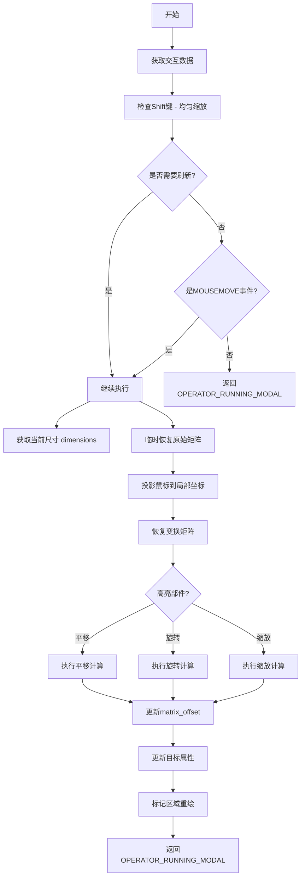
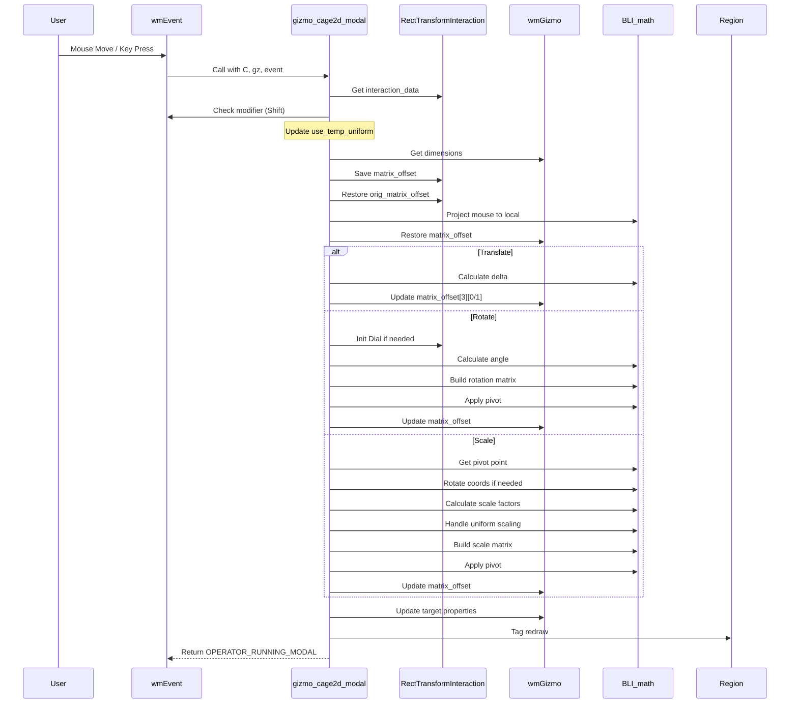
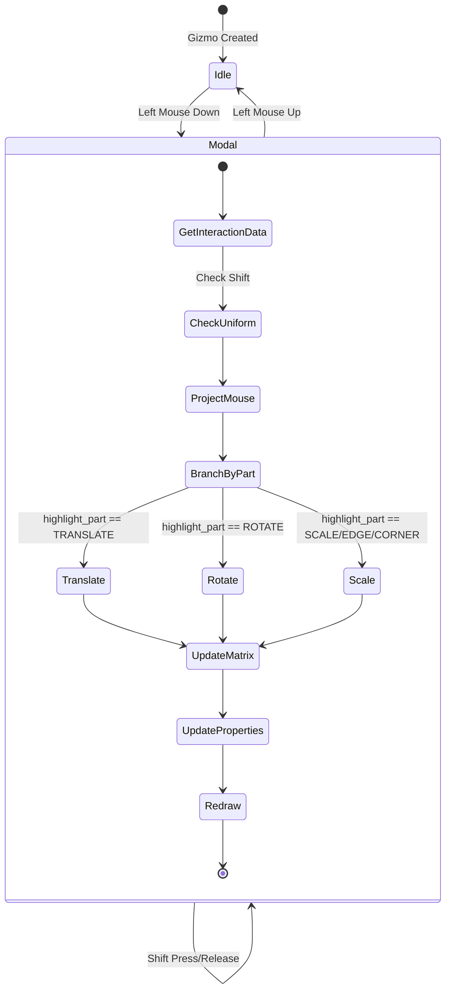

# 2D Cage Gizmo Modal Function - Comprehensive Analysis

## 目录
- [1. 概述](#概述)
- [2. 核心数据结构](#核心数据结构)
  - [2.1. wmGizmo](#wmGizmo)
  - [2.2. RectTransformInteraction](#recttransforminteraction)
  - [2.3. wmEvent](#wmevent)
- [3. 宏定义详解](#宏定义详解)
  - [3.1. ED_GIZMO_CAGE_XFORM_FLAG_*](#ed_gizmo_cage_xform_flag_)
  - [3.2. ED_GIZMO_CAGE2D_PART_*](#ed_gizmo_cage2d_part_)
  - [3.3. MUL_V2_V3_M4_FINAL](#mul_v2_v3_m4_final)
- [4. 枚举与标志位](#枚举与标志位)
  - [4.1. eWM_GizmoFlagTweak](#ewm_gizmo_flagtweak)
  - [4.2. 运算符状态](#运算符状态)
- [5. 核心函数解析](#核心函数解析)
  - [5.1. gizmo_cage2d_modal](#gizmo_cage2d_modal)
  - [5.2. 辅助函数](#辅助函数)
- [6. 数学原理详解](#数学原理详解)
  - [6.1. 矩阵变换基础](#矩阵变换基础)
  - [6.2. 旋转计算](#旋转计算)
  - [6.3. 缩放计算](#缩放计算)
  - [6.4. 坐标投影](#坐标投影)
- [7. 代码执行流程](#代码执行流程)
- [8. 参考资料](#参考资料)

---

## 1. 概述

`gizmo_cage2d_modal` 是 Blender 2D 罩框 Gizmo 的核心模态处理函数。该函数负责处理用户交互时的实时变换操作，包括平移(translate)、旋转(rotate)和缩放(scale)。

**定义位置**: `source/blender/editors/gizmo_library/gizmo_types/cage2d_gizmo.cc:1157-1365`

```cpp
static wmOperatorStatus gizmo_cage2d_modal(bContext *C,
                                           wmGizmo *gz,
                                           const wmEvent *event,
                                           eWM_GizmoFlagTweak /*tweak_flag*/)
```

<span style="background-color: #2b5d8a; color: white; padding: 2px 6px; border-radius: 4px;">函数类型</span> <span style="background-color: #3a7fba; color: white; padding: 2px 6px; border-radius: 4px;">模态运算符</span>

---

## 2. 核心数据结构

### 2.1. wmGizmo

**定义位置**: `source/blender/windowmanager/gizmo/WM_gizmo_types.hh:214-297`

<span style="background-color: #d4edda; color: #155724; padding: 2px 6px; border-radius: 4px;">结构体</span> <span style="background-color: #fff3cd; color: #856404; padding: 2px 6px; border-radius: 4px;">核心Gizmo对象</span>

```cpp
struct wmGizmo {
    wmGizmo *next, *prev;
    const wmGizmoType *type;
    wmGizmoFnModal custom_modal;
    wmGizmoGroup *parent_gzgroup;
    wmKeyMap *keymap;
    void *py_instance;
    PointerRNA *ptr;
    eWM_GizmoFlag flag;
    eWM_GizmoFlagState state;

    /* 关键字段 */
    int highlight_part;        /* 当前高亮的部件ID */
    int drag_part;             /* 拖拽部件ID */

    /* 变换矩阵 */
    float matrix_space[4][4];  /* 空间变换矩阵 */
    float matrix_basis[4][4];  /* 基础变换矩阵 */
    float matrix_offset[4][4]; /* 偏移变换矩阵 - 这是模态函数主要修改的 */

    float scale_final;         /* 最终缩放值(运行时计算) */
    float scale_basis;         /* 用户定义的基础缩放 */
    float line_width;          /* 线宽 */

    float color[4], color_hi[4]; /* 颜色 */

    /* 交互数据 */
    void *interaction_data;    /* 指向 RectTransformInteraction */

    /* 目标属性 */
    blender::Vector<wmGizmoProperty, 0> target_properties;
};
```

**关键字段说明**:

| 字段 | 类型 | 说明 |
|------|------|------|
| `highlight_part` | `int` | 当前鼠标悬停的部件ID，用于判断是平移、旋转还是缩放 |
| `matrix_offset` | `float[4][4]` | **核心字段**，存储当前的变换偏移，模态函数会实时修改这个值 |
| `matrix_space` | `float[4][4]` | 变换空间，用于在不同坐标系间转换 |
| `interaction_data` | `void*` | 指向交互状态数据 (RectTransformInteraction) |

---

### 2.2. RectTransformInteraction

**定义位置**: `source/blender/editors/gizmo_library/gizmo_types/cage2d_gizmo.cc:1056-1062`

<span style="background-color: #cce5ff; color: #004085; padding: 2px 6px; border-radius: 4px;">私有结构体</span> <span style="background-color: #f8d7da; color: #721c24; padding: 2px 6px; border-radius: 4px;">交互状态数据</span>

```cpp
struct RectTransformInteraction {
    float orig_mouse[2];              /* 原始鼠标位置 (局部坐标系) */
    float orig_matrix_offset[4][4];   /* 原始变换矩阵 (交互开始前) */
    float orig_matrix_final_no_offset[4][4]; /* 原始最终矩阵 (无偏移) */
    Dial *dial;                       /* 旋转计算用的拨号器 */
    bool use_temp_uniform;            /* 临时均匀缩放标志 (Shift键) */
};
```

**字段详解**:

- **`orig_mouse[2]`**: 鼠标在局部坐标系中的初始位置，用于计算相对位移
- **`orig_matrix_offset[4][4]`**: 交互开始前的 `matrix_offset`，用于撤销操作和增量计算
- **`orig_matrix_final_no_offset[4][4]`**: 无偏移的最终矩阵，用于旋转计算时的坐标转换
- **`dial`**: `Dial*` 类型，用于计算旋转角度的辅助对象
- **`use_temp_uniform`**: 当前是否启用了临时均匀缩放 (按住 Shift)

---

### 2.3. wmEvent

**定义位置**: `source/blender/windowmanager/WIN_types.hh`

<span style="background-color: #e7f3ff; color: #004085; padding: 2px 6px; border-radius: 4px;">事件结构体</span>

```cpp
struct wmEvent {
    int type;           /* 事件类型，如 MOUSEMOVE, LEFTMOUSE 等 */
    int val;            /* 事件值 */
    int modifier;       /* 修饰键状态 (KM_SHIFT, KM_CTRL, KM_ALT) */
    int mval[2];        /* 鼠标屏幕坐标 (像素) */
    /* ... 其他字段 */
};
```

**关键字段**:
- `modifier`: 包含 `KM_SHIFT` (Shift键)、`KM_CTRL` (Ctrl键) 等标志
- `mval`: 鼠标在屏幕空间的坐标，用于投影到局部空间

---

## 3. 宏定义详解

### 3.1. ED_GIZMO_CAGE_XFORM_FLAG_*

**定义位置**: `source/blender/editors/include/ED_gizmo_library.hh:93-99`

<span style="background-color: #fff3cd; color: #856404; padding: 2px 6px; border-radius: 4px;">变换标志位</span>

```cpp
enum {
    ED_GIZMO_CAGE_XFORM_FLAG_TRANSLATE = (1 << 0),     /* 0x01 - 启用平移 */
    ED_GIZMO_CAGE_XFORM_FLAG_ROTATE = (1 << 1),        /* 0x02 - 启用旋转 */
    ED_GIZMO_CAGE_XFORM_FLAG_SCALE = (1 << 2),         /* 0x04 - 启用缩放 */
    ED_GIZMO_CAGE_XFORM_FLAG_SCALE_UNIFORM = (1 << 3), /* 0x08 - 均匀缩放 */
    ED_GIZMO_CAGE_XFORM_FLAG_SCALE_SIGNED = (1 << 4),  /* 0x10 - 允许负缩放 */
};
```

**使用示例**:
```cpp
int transform_flag = RNA_enum_get(gz->ptr, "transform");
if (transform_flag & ED_GIZMO_CAGE_XFORM_FLAG_SCALE_UNIFORM) {
    // 执行均匀缩放逻辑
}
```

---

### 3.2. ED_GIZMO_CAGE2D_PART_*

**定义位置**: `source/blender/editors/include/ED_gizmo_library.hh:129-146`

<span style="background-color: #d1ecf1; color: #0c5460; padding: 2px 6px; border-radius: 4px;">部件ID枚举</span>

```cpp
enum {
    ED_GIZMO_CAGE2D_PART_TRANSLATE = 0,      /* 平移中心 */

    ED_GIZMO_CAGE2D_PART_SCALE,              /* 整体缩放 */
    /* 边缘 */
    ED_GIZMO_CAGE2D_PART_SCALE_MIN_X,        /* 左边缘 */
    ED_GIZMO_CAGE2D_PART_SCALE_MAX_X,        /* 右边缘 */
    ED_GIZMO_CAGE2D_PART_SCALE_MIN_Y,        /* 下边缘 */
    ED_GIZMO_CAGE2D_PART_SCALE_MAX_Y,        /* 上边缘 */
    /* 角点 */
    ED_GIZMO_CAGE2D_PART_SCALE_MIN_X_MIN_Y,  /* 左下角 */
    ED_GIZMO_CAGE2D_PART_SCALE_MIN_X_MAX_Y,  /* 左上角 */
    ED_GIZMO_CAGE2D_PART_SCALE_MAX_X_MIN_Y,  /* 右下角 */
    ED_GIZMO_CAGE2D_PART_SCALE_MAX_X_MAX_Y,  /* 右上角 */

    ED_GIZMO_CAGE2D_PART_ROTATE,             /* 旋转手柄 */
};
```

**可视化**:
```
        MAX_Y
     ┌──────────┐
     │  ↑旋转   │
MIN_X│          │MAX_X
     │    ●     │
     │          │
     └──────────┘
        MIN_Y
```

---

### 3.3. MUL_V2_V3_M4_FINAL

**定义位置**: `source/blender/editors/gizmo_library/gizmo_types/cage2d_gizmo.cc:1219-1220`

<span style="background-color: #f8f9fa; color: #212529; padding: 2px 6px; border-radius: 4px;">局部宏定义</span>

```cpp
#define MUL_V2_V3_M4_FINAL(test_co, mouse_co) \
  mul_v3_m4v3(test_co, data->orig_matrix_final_no_offset, blender::float3{UNPACK2(mouse_co), 0.0})
```

**功能**: 将2D坐标转换为3D坐标后，应用无偏移的最终矩阵变换

**展开后**:
```cpp
// 假设 mouse_co = {100.0f, 200.0f}
float test_co[3];
mul_v3_m4v3(test_co,
            data->orig_matrix_final_no_offset,  // 4x4矩阵
            blender::float3{100.0f, 200.0f, 0.0f});  // 转为3D向量
```

**数学原理**:
$$
\begin{bmatrix}
x' \\
y' \\
z' \\
1
\end{bmatrix}
=
M_{final\_no\_offset}
\times
\begin{bmatrix}
x \\
y \\
0 \\
1
\end{bmatrix}
$$

---

## 4. 枚举与标志位

### 4.1. eWM_GizmoFlagTweak

**定义位置**: `source/blender/windowmanager/gizmo/WM_gizmo_types.hh:195-200`

```cpp
enum eWM_GizmoFlagTweak {
    WM_GIZMO_TWEAK_PRECISE = (1 << 0),  /* 精确模式 (Shift) */
    WM_GIZMO_TWEAK_SNAP = (1 << 1),     /* 对齐模式 (Ctrl) */
};
```

**注意**: 在 `gizmo_cage2d_modal` 中，这个参数被注释为未使用，因为该函数直接从 `event->modifier` 读取修饰键。

---

### 4.2. 运算符状态

**定义位置**: `source/blender/editors/include/ED_gizmo_library.hh` 或 `WM_types.hh`

```cpp
enum {
    OPERATOR_RUNNING_MODAL = 1,  /* 继续模态运行 */
    OPERATOR_CANCELLED = 2,      /* 取消 */
    OPERATOR_FINISHED = 3,       /* 完成 */
};
```

---

## 5. 核心函数解析

### 5.1. gizmo_cage2d_modal

**完整签名**:
```cpp
static wmOperatorStatus gizmo_cage2d_modal(bContext *C,
                                           wmGizmo *gz,
                                           const wmEvent *event,
                                           eWM_GizmoFlagTweak /*tweak_flag*/)
```

#### 5.1.1. 函数流程图



---

#### 5.1.2. 代码逐行解析

##### 第1部分: 均匀缩放检测 (行 1162-1180)

```cpp
RectTransformInteraction *data = static_cast<RectTransformInteraction *>(gz->interaction_data);
int transform_flag = RNA_enum_get(gz->ptr, "transform");

if ((transform_flag & ED_GIZMO_CAGE_XFORM_FLAG_SCALE_UNIFORM) == 0) {
    /* WARNING: Checking the events modifier only makes sense as long as `tweak_flag`
     * remains unused (this controls #WM_GIZMO_TWEAK_PRECISE by default). */
    const bool use_temp_uniform = (event->modifier & KM_SHIFT) != 0;
    const bool changed = data->use_temp_uniform != use_temp_uniform;
    data->use_temp_uniform = use_temp_uniform;

    if (use_temp_uniform) {
        transform_flag |= ED_GIZMO_CAGE_XFORM_FLAG_SCALE_UNIFORM;
    }

    if (changed) {
        /* Always refresh. */
    }
    else if (event->type != MOUSEMOVE) {
        return OPERATOR_RUNNING_MODAL;
    }
}
```

<span style="background-color: #d4edda; color: #155724; padding: 2px 6px; border-radius: 4px;">关键点</span>:
- 检查 `transform_flag` 是否已启用均匀缩放
- 如果未启用，检查当前是否按住 Shift 键
- **Shift键的作用**: 临时启用均匀缩放模式
- 只有在状态改变或鼠标移动时才继续执行

**数学**: 这里的逻辑确保了:
$$
\text{uniform} = \text{config} \lor (\text{shift\_held} \land \neg\text{config})
$$

---

##### 第2部分: 坐标投影 (行 1182-1200)

```cpp
float point_local[2];
float dims[2];
RNA_float_get_array(gz->ptr, "dimensions", dims);

{
    float matrix_back[4][4];
    copy_m4_m4(matrix_back, gz->matrix_offset);
    copy_m4_m4(gz->matrix_offset, data->orig_matrix_offset);

    /* The mouse coords are projected into the matrix so we don't need to worry about axis
     * alignment. */
    bool ok = gizmo_window_project_2d(
        C, gz, blender::float2(blender::int2(event->mval)), 2, false, point_local);
    copy_m4_m4(gz->matrix_offset, matrix_back);
    if (!ok) {
        return OPERATOR_RUNNING_MODAL;
    }
}
```

<span style="background-color: #cce5ff; color: #004085; padding: 2px 6px; border-radius: 4px;">坐标投影流程</span>:

1. **保存当前矩阵**: `matrix_back` 保存当前的 `matrix_offset`
2. **临时恢复原始矩阵**: 使用 `orig_matrix_offset` 作为临时基准
3. **投影鼠标坐标**: 调用 `gizmo_window_project_2d` 将屏幕坐标转换为局部坐标
4. **恢复矩阵**: 将 `matrix_back` 恢复到 `matrix_offset`

**为什么这样做?**
- 鼠标坐标是屏幕空间的 (2D)
- 需要转换到 gizmo 的局部空间才能进行精确计算
- 使用原始矩阵确保投影的一致性

---

##### 第3部分: 获取目标属性 (行 1202-1207)

```cpp
wmGizmoProperty *gz_prop;
gz_prop = WM_gizmo_target_property_find(gz, "matrix");
if (gz_prop->type != nullptr) {
    WM_gizmo_target_property_float_get_array(gz, gz_prop, &gz->matrix_offset[0][0]);
}
```

**作用**: 如果 gizmo 绑定了外部属性 (如对象的位置/缩放)，则从该属性读取当前值。

---

##### 第4部分: 平移处理 (行 1209-1216)

```cpp
if (gz->highlight_part == ED_GIZMO_CAGE2D_PART_TRANSLATE) {
    /* do this to prevent clamping from changing size */
    copy_m4_m4(gz->matrix_offset, data->orig_matrix_offset);
    gz->matrix_offset[3][0] = data->orig_matrix_offset[3][0] +
                              (point_local[0] - data->orig_mouse[0]);
    gz->matrix_offset[3][1] = data->orig_matrix_offset[3][1] +
                              (point_local[1] - data->orig_mouse[1]);
}
```

<span style="background-color: #fff3cd; color: #856404; padding: 2px 6px; border-radius: 4px;">平移数学</span>:

$$
\begin{aligned}
\text{offset}_x &= \text{orig\_offset}[3][0] + (\text{point\_local}[0] - \text{orig\_mouse}[0]) \\
\text{offset}_y &= \text{orig\_offset}[3][1] + (\text{point\_local}[1] - \text{orig\_mouse}[1])
\end{aligned}
$$

**解释**:
- `orig_matrix_offset[3][0/1]`: 原始的平移量 (矩阵第4列的x,y)
- `point_local`: 当前鼠标在局部空间的位置
- `orig_mouse`: 交互开始时的鼠标位置
- **位移 = 当前位置 - 原始位置**

**矩阵表示**:
$$
\begin{bmatrix}
1 & 0 & 0 & \Delta x \\
0 & 1 & 0 & \Delta y \\
0 & 0 & 1 & 0 \\
0 & 0 & 0 & 1
\end{bmatrix}
$$

---

##### 第5部分: 旋转处理 (行 1217-1256)

```cpp
else if (gz->highlight_part == ED_GIZMO_CAGE2D_PART_ROTATE) {
#define MUL_V2_V3_M4_FINAL(test_co, mouse_co) \
  mul_v3_m4v3(test_co, data->orig_matrix_final_no_offset, blender::float3{UNPACK2(mouse_co), 0.0})

    float test_co[3];

    if (data->dial == nullptr) {
        MUL_V2_V3_M4_FINAL(test_co, data->orig_matrix_offset[3]);
        data->dial = BLI_dial_init(test_co, FLT_EPSILON);

        MUL_V2_V3_M4_FINAL(test_co, data->orig_mouse);
        BLI_dial_angle(data->dial, test_co);
    }

    /* rotate */
    MUL_V2_V3_M4_FINAL(test_co, point_local);
    const float angle = BLI_dial_angle(data->dial, test_co);

    float matrix_space_inv[4][4];
    float matrix_rotate[4][4];
    float pivot[3];

    copy_v3_v3(pivot, data->orig_matrix_offset[3]);

    invert_m4_m4(matrix_space_inv, gz->matrix_space);

    unit_m4(matrix_rotate);
    mul_m4_m4m4(matrix_rotate, matrix_rotate, matrix_space_inv);
    rotate_m4(matrix_rotate, 'Z', -angle);
    mul_m4_m4m4(matrix_rotate, matrix_rotate, gz->matrix_space);

    zero_v3(matrix_rotate[3]);
    transform_pivot_set_m4(matrix_rotate, pivot);

    mul_m4_m4m4(gz->matrix_offset, matrix_rotate, data->orig_matrix_offset);

#undef MUL_V2_V3_M4_FINAL
}
```

###### 5.1.2.1. Dial (拨号器) 初始化

```cpp
if (data->dial == nullptr) {
    /* 1. 计算枢轴点在世界坐标的位置 */
    MUL_V2_V3_M4_FINAL(test_co, data->orig_matrix_offset[3]);
    /* test_co = orig_matrix_final_no_offset × [pivot_x, pivot_y, 0] */

    /* 2. 初始化拨号器 */
    data->dial = BLI_dial_init(test_co, FLT_EPSILON);

    /* 3. 设置初始角度 */
    MUL_V2_V3_M4_FINAL(test_co, data->orig_mouse);
    BLI_dial_angle(data->dial, test_co);
}
```

**Dial 的工作原理**:
- `BLI_dial_init(center, threshold)`: 以中心点初始化
- `BLI_dial_angle(dial, current_pos)`: 计算从初始方向到当前位置的角度

###### 5.1.2.2. 角度计算

```cpp
MUL_V2_V3_M4_FINAL(test_co, point_local);
const float angle = BLI_dial_angle(data->dial, test_co);
```

**返回值**: 弧度制的旋转角度 (正值为逆时针)

###### 5.1.2.3. 旋转矩阵构建

```cpp
/* 步骤1: 获取枢轴点 */
copy_v3_v3(pivot, data->orig_matrix_offset[3]);

/* 步骤2: 计算空间逆矩阵 */
invert_m4_m4(matrix_space_inv, gz->matrix_space);

/* 步骤3: 构建旋转矩阵 */
unit_m4(matrix_rotate);  // 单位矩阵
mul_m4_m4m4(matrix_rotate, matrix_rotate, matrix_space_inv);  // 应用空间逆变换
rotate_m4(matrix_rotate, 'Z', -angle);  // 绕Z轴旋转
mul_m4_m4m4(matrix_rotate, matrix_rotate, gz->matrix_space);  // 应用空间变换

/* 步骤4: 清除平移分量 */
zero_v3(matrix_rotate[3]);

/* 步骤5: 设置枢轴点 */
transform_pivot_set_m4(matrix_rotate, pivot);

/* 步骤6: 应用到原始矩阵 */
mul_m4_m4m4(gz->matrix_offset, matrix_rotate, data->orig_matrix_offset);
```

<span style="background-color: #d1ecf1; color: #0c5460; padding: 2px 6px; border-radius: 4px;">数学推导</span>:

**绕任意点旋转的公式**:
$$
M_{rotate} = T_{pivot} \times R_z(\theta) \times T_{-pivot}
$$

其中:
- $T_{pivot}$: 平移到枢轴点
- $R_z(\theta)$: 绕Z轴旋转 $\theta$ 弧度
- $T_{-pivot}$: 平移回原点

**在代码中的实现**:
1. `rotate_m4(matrix_rotate, 'Z', -angle)` - 创建旋转部分
2. `transform_pivot_set_m4(matrix_rotate, pivot)` - 设置枢轴点 (内部处理平移)

**最终变换**:
$$
M_{new} = M_{rotate} \times M_{orig}
$$

---

##### 第6部分: 缩放处理 (行 1257-1355)

```cpp
else {
    /* scale */
    copy_m4_m4(gz->matrix_offset, data->orig_matrix_offset);
    const int draw_style = RNA_enum_get(gz->ptr, "draw_style");

    float pivot[2];
    if (transform_flag & ED_GIZMO_CAGE_XFORM_FLAG_TRANSLATE) {
        gizmo_pivot_from_scale_part(gz->highlight_part, pivot);
        mul_v2_v2(pivot, dims);
    }
    else {
        zero_v2(pivot);
    }

    float curr_mouse[2];
    copy_v2_v2(curr_mouse, data->orig_mouse);

    /* Rotate current and original mouse coordinates around gizmo center. */
    if (transform_flag & ED_GIZMO_CAGE_XFORM_FLAG_ROTATE) {
        float rot[3][3];
        float loc[3];
        float size[3];
        mat4_to_loc_rot_size(loc, rot, size, gz->matrix_offset);

        invert_m3(rot);
        sub_v2_v2(point_local, loc);
        mul_m3_v2(rot, point_local);
        add_v2_v2(point_local, loc);

        sub_v2_v2(curr_mouse, loc);
        mul_m3_v2(rot, curr_mouse);
        add_v2_v2(curr_mouse, loc);
    }

    bool constrain_axis[2] = {false};
    gizmo_constrain_from_scale_part(gz->highlight_part, constrain_axis);

    float size_new[2], size_orig[2];
    for (int i = 0; i < 2; i++) {
        size_orig[i] = len_v3(data->orig_matrix_offset[i]);
        size_new[i] = size_orig[i];
        if (constrain_axis[i] == false) {
            /* Original cursor position relative to pivot. */
            const float delta_orig = curr_mouse[i] - data->orig_matrix_offset[3][i] -
                                     pivot[i] * size_orig[i];
            const float delta_curr = point_local[i] - data->orig_matrix_offset[3][i] -
                                     pivot[i] * size_orig[i];

            if ((transform_flag & ED_GIZMO_CAGE_XFORM_FLAG_SCALE_SIGNED) == 0) {
                if (signum_i(delta_orig) != signum_i(delta_curr)) {
                    size_new[i] = 0.0f;
                    continue;
                }
            }
            /* Original cursor position does not exactly lie on the cage boundary due to margin. */
            size_new[i] = delta_curr / (signf(delta_orig) * 0.5f * dims[i] - pivot[i]);
        }
    }

    float scale[2] = {1.0f, 1.0f};
    for (int i = 0; i < 2; i++) {
        if (size_orig[i] == 0) {
            size_orig[i] = 1.0f;
            gz->matrix_offset[i][i] = 1.0f;
        }
        scale[i] = size_new[i] / size_orig[i];
    }

    if (transform_flag & ED_GIZMO_CAGE_XFORM_FLAG_SCALE_UNIFORM) {
        if (constrain_axis[0] == false && constrain_axis[1] == false) {
            if (draw_style == ED_GIZMO_CAGE2D_STYLE_CIRCLE) {
                /* So that the cursor lies on the circle. */
                scale[1] = scale[0] = len_v2(scale);
            }
            else {
                scale[1] = scale[0] = (scale[1] + scale[0]) / 2.0f;
            }
        }
        else if (constrain_axis[0] == false) {
            scale[1] = scale[0];
        }
        else if (constrain_axis[1] == false) {
            scale[0] = scale[1];
        }
        else {
            BLI_assert(0);
        }
    }

    /* Scale around pivot. */
    float matrix_scale[4][4];
    unit_m4(matrix_scale);

    mul_v3_fl(matrix_scale[0], scale[0]);
    mul_v3_fl(matrix_scale[1], scale[1]);

    transform_pivot_set_m4(matrix_scale, blender::float3(UNPACK2(pivot), 0.0f));
    mul_m4_m4_post(gz->matrix_offset, matrix_scale);
}
```

###### 6.1. 枢轴点计算

```cpp
gizmo_pivot_from_scale_part(gz->highlight_part, pivot);
mul_v2_v2(pivot, dims);
```

**枢轴映射** (见 `gizmo_pivot_from_scale_part` 函数):

| 部件 | pivot (相对值) | 说明 |
|------|----------------|------|
| `SCALE` | (0.0, 0.0) | 中心 |
| `MIN_X` | (0.5, 0.0) | 左边缘中点 |
| `MAX_X` | (-0.5, 0.0) | 右边缘中点 |
| `MIN_Y` | (0.0, 0.5) | 下边缘中点 |
| `MAX_Y` | (0.0, -0.5) | 上边缘中点 |
| `MIN_X_MIN_Y` | (0.5, 0.5) | 左下角 |
| `MIN_X_MAX_Y` | (0.5, -0.5) | 左上角 |
| `MAX_X_MIN_Y` | (-0.5, 0.5) | 右下角 |
| `MAX_X_MAX_Y` | (-0.5, -0.5) | 右上角 |

###### 6.2. 旋转修正 (如果启用了旋转)

```cpp
if (transform_flag & ED_GIZMO_CAGE_XFORM_FLAG_ROTATE) {
    float rot[3][3];
    float loc[3];
    float size[3];
    mat4_to_loc_rot_size(loc, rot, size, gz->matrix_offset);

    invert_m3(rot);
    sub_v2_v2(point_local, loc);
    mul_m3_v2(rot, point_local);
    add_v2_v2(point_local, loc);

    sub_v2_v2(curr_mouse, loc);
    mul_m3_v2(rot, curr_mouse);
    add_v2_v2(curr_mouse, loc);
}
```

**目的**: 如果 gizmo 本身被旋转了，需要将鼠标坐标旋转回 gizmo 的局部空间，确保缩放计算正确。

**数学**:
$$
P_{local} = R^{-1} \times (P_{screen} - L)
$$

其中:
- $R^{-1}$: 旋转矩阵的逆
- $L$: 位置 (location)
- $P_{screen}$: 屏幕坐标

###### 6.3. 轴约束检测

```cpp
gizmo_constrain_from_scale_part(gz->highlight_part, constrain_axis);
```

**约束逻辑** (见 `gizmo_constrain_from_scale_part`):
- 边缘缩放: 约束一个轴 (如左边缘只改变 X)
- 角点缩放: 两个轴都可变
- 中心缩放: 两个轴都可变

###### 6.4. 缩放比例计算

```cpp
for (int i = 0; i < 2; i++) {
    size_orig[i] = len_v3(data->orig_matrix_offset[i]);
    size_new[i] = size_orig[i];
    if (constrain_axis[i] == false) {
        const float delta_orig = curr_mouse[i] - data->orig_matrix_offset[3][i] -
                                 pivot[i] * size_orig[i];
        const float delta_curr = point_local[i] - data->orig_matrix_offset[3][i] -
                                 pivot[i] * size_orig[i];

        if ((transform_flag & ED_GIZMO_CAGE_XFORM_FLAG_SCALE_SIGNED) == 0) {
            if (signum_i(delta_orig) != signum_i(delta_curr)) {
                size_new[i] = 0.0f;
                continue;
            }
        }
        size_new[i] = delta_curr / (signf(delta_orig) * 0.5f * dims[i] - pivot[i]);
    }
}
```

<span style="background-color: #fff3cd; color: #856404; padding: 2px 6px; border-radius: 4px;">缩放公式推导</span>:

**原始距离** (从枢轴到初始鼠标):
$$
d_{orig} = \text{curr\_mouse} - \text{offset} - \text{pivot} \times \text{size\_orig}
$$

**当前距离** (从枢轴到当前鼠标):
$$
d_{curr} = \text{point\_local} - \text{offset} - \text{pivot} \times \text{size\_orig}
$$

**缩放比例**:
$$
\text{scale} = \frac{d_{curr}}{d_{orig}}
$$

**特殊情况**:
- `dims[i]` 是 gizmo 的显示尺寸
- `pivot[i]` 是相对枢轴 (-0.5 到 0.5)
- 需要调整分母以考虑 gizmo 的边界

###### 6.5. 均匀缩放处理

```cpp
if (transform_flag & ED_GIZMO_CAGE_XFORM_FLAG_SCALE_UNIFORM) {
    if (constrain_axis[0] == false && constrain_axis[1] == false) {
        if (draw_style == ED_GIZMO_CAGE2D_STYLE_CIRCLE) {
            scale[1] = scale[0] = len_v2(scale);
        }
        else {
            scale[1] = scale[0] = (scale[1] + scale[0]) / 2.0f;
        }
    }
    /* ... 其他情况 */
}
```

**均匀缩放模式**:
- 圆形: 使用向量长度 (保持在圆上)
- 矩形: 使用平均值
- 单轴约束: 复制另一轴的值

###### 6.6. 应用缩放矩阵

```cpp
float matrix_scale[4][4];
unit_m4(matrix_scale);

mul_v3_fl(matrix_scale[0], scale[0]);  // X 轴缩放
mul_v3_fl(matrix_scale[1], scale[1]);  // Y 轴缩放

transform_pivot_set_m4(matrix_scale, blender::float3(UNPACK2(pivot), 0.0f));
mul_m4_m4_post(gz->matrix_offset, matrix_scale);
```

**最终矩阵**:
$$
M_{final} = M_{orig} \times T_{pivot} \times S \times T_{-pivot}
$$

---

##### 第7部分: 更新目标属性和重绘 (行 1357-1364)

```cpp
if (gz_prop->type != nullptr) {
    WM_gizmo_target_property_float_set_array(C, gz, gz_prop, &gz->matrix_offset[0][0]);
}

/* tag the region for redraw */
ED_region_tag_redraw_editor_overlays(CTX_wm_region(C));

return OPERATOR_RUNNING_MODAL;
```

**作用**:
1. 如果绑定了外部属性，将新矩阵写回
2. 标记区域重绘以显示更新
3. 返回 `OPERATOR_RUNNING_MODAL` 继续模态循环

---

### 5.2. 辅助函数

#### 5.2.1. gizmo_constrain_from_scale_part

**定义位置**: `cage2d_gizmo.cc:1101-1111`

```cpp
static void gizmo_constrain_from_scale_part(int part, bool r_constrain_axis[2])
{
    r_constrain_axis[0] = (part > ED_GIZMO_CAGE2D_PART_SCALE_MAX_X &&
                           part < ED_GIZMO_CAGE2D_PART_SCALE_MIN_X_MIN_Y) ?
                              true :
                              false;
    r_constrain_axis[1] = (part > ED_GIZMO_CAGE2D_PART_SCALE &&
                           part < ED_GIZMO_CAGE2D_PART_SCALE_MIN_Y) ?
                              true :
                              false;
}
```

**枚举顺序**:
```
ED_GIZMO_CAGE2D_PART_SCALE = 1
ED_GIZMO_CAGE2D_PART_SCALE_MIN_X = 2
ED_GIZMO_CAGE2D_PART_SCALE_MAX_X = 3
ED_GIZMO_CAGE2D_PART_SCALE_MIN_Y = 4
ED_GIZMO_CAGE2D_PART_SCALE_MAX_Y = 5
ED_GIZMO_CAGE2D_PART_SCALE_MIN_X_MIN_Y = 6
...
```

**约束判断**:
- `constrain_axis[0]` (X轴): 部件ID在 2-5 之间 (边缘)
- `constrain_axis[1]` (Y轴): 部件ID在 2-4 之间 (X边缘)

#### 5.2.2. gizmo_pivot_from_scale_part

**定义位置**: `cage2d_gizmo.cc:1113-1152`

```cpp
static void gizmo_pivot_from_scale_part(int part, float r_pt[2])
{
    switch (part) {
        case ED_GIZMO_CAGE2D_PART_SCALE:
            ARRAY_SET_ITEMS(r_pt, 0.0, 0.0);
            break;
        case ED_GIZMO_CAGE2D_PART_SCALE_MIN_X:
            ARRAY_SET_ITEMS(r_pt, 0.5, 0.0);
            break;
        case ED_GIZMO_CAGE2D_PART_SCALE_MAX_X:
            ARRAY_SET_ITEMS(r_pt, -0.5, 0.0);
            break;
        /* ... 其他情况 */
    }
}
```

**返回相对坐标**，需要乘以 `dims` 得到实际坐标。

---

## 6. 数学原理详解

### 6.1. 矩阵变换基础

#### 6.1.1. 齐次坐标

Blender 使用 4×4 矩阵表示 2D/3D 变换:

$$
M = \begin{bmatrix}
R_{xx} & R_{xy} & R_{xz} & T_x \\
R_{yx} & R_{yy} & R_{yz} & T_y \\
R_{zx} & R_{zy} & R_{zz} & T_z \\
0 & 0 & 0 & 1
\end{bmatrix}
$$

**2D 简化**:
$$
M = \begin{bmatrix}
S_x \cdot \cos\theta & -S_x \cdot \sin\theta & 0 & T_x \\
S_y \cdot \sin\theta & S_y \cdot \cos\theta & 0 & T_y \\
0 & 0 & 1 & 0 \\
0 & 0 & 0 & 1
\end{bmatrix}
$$

#### 6.1.2. 常用矩阵操作

**单位矩阵** (`unit_m4`):
$$
I = \begin{bmatrix}
1 & 0 & 0 & 0 \\
0 & 1 & 0 & 0 \\
0 & 0 & 1 & 0 \\
0 & 0 & 0 & 1
\end{bmatrix}
$$

**平移矩阵**:
$$
T = \begin{bmatrix}
1 & 0 & 0 & t_x \\
0 & 1 & 0 & t_y \\
0 & 0 & 1 & t_z \\
0 & 0 & 0 & 1
\end{bmatrix}
$$

**缩放矩阵**:
$$
S = \begin{bmatrix}
s_x & 0 & 0 & 0 \\
0 & s_y & 0 & 0 \\
0 & 0 & s_z & 0 \\
0 & 0 & 0 & 1
\end{bmatrix}
$$

**旋转矩阵 (绕Z轴)**:
$$
R_z(\theta) = \begin{bmatrix}
\cos\theta & -\sin\theta & 0 & 0 \\
\sin\theta & \cos\theta & 0 & 0 \\
0 & 0 & 1 & 0 \\
0 & 0 & 0 & 1
\end{bmatrix}
$$

---

### 6.2. 旋转计算的数学原理

#### 6.2.1. 问题: 绕任意点旋转

如果要绕点 $P = (p_x, p_y)$ 旋转 $\theta$ 角，不能直接用 $R_z(\theta)$，因为旋转是绕原点的。

#### 6.2.2. 解决方案

**步骤**:
1. 平移到原点: $T(-P)$
2. 旋转: $R_z(\theta)$
3. 平移回: $T(P)$

**组合**:
$$
M = T(P) \times R_z(\theta) \times T(-P)
$$

展开:
$$
M = \begin{bmatrix}
1 & 0 & 0 & p_x \\
0 & 1 & 0 & p_y \\
0 & 0 & 1 & 0 \\
0 & 0 & 0 & 1
\end{bmatrix}
\times
\begin{bmatrix}
\cos\theta & -\sin\theta & 0 & 0 \\
\sin\theta & \cos\theta & 0 & 0 \\
0 & 0 & 1 & 0 \\
0 & 0 & 0 & 1
\end{bmatrix}
\times
\begin{bmatrix}
1 & 0 & 0 & -p_x \\
0 & 1 & 0 & -p_y \\
0 & 0 & 1 & 0 \\
0 & 0 & 0 & 1
\end{bmatrix}
$$

**结果**:
$$
M = \begin{bmatrix}
\cos\theta & -\sin\theta & 0 & p_x(1-\cos\theta) + p_y\sin\theta \\
\sin\theta & \cos\theta & 0 & p_y(1-\cos\theta) - p_x\sin\theta \\
0 & 0 & 1 & 0 \\
0 & 0 & 0 & 1
\end{bmatrix}
$$

#### 6.2.3. 代码中的实现

```cpp
/* 1. 创建旋转矩阵 */
unit_m4(matrix_rotate);
mul_m4_m4m4(matrix_rotate, matrix_rotate, matrix_space_inv);  // 空间逆变换
rotate_m4(matrix_rotate, 'Z', -angle);                        // 旋转
mul_m4_m4m4(matrix_rotate, matrix_rotate, gz->matrix_space);  // 空间变换

/* 2. 清除平移 */
zero_v3(matrix_rotate[3]);

/* 3. 设置枢轴 */
transform_pivot_set_m4(matrix_rotate, pivot);

/* 4. 应用 */
mul_m4_m4m4(gz->matrix_offset, matrix_rotate, data->orig_matrix_offset);
```

**`transform_pivot_set_m4` 的作用**:
```cpp
void transform_pivot_set_m4(float m[4][4], const float pivot[3])
{
    float t[4][4];
    unit_m4(t);
    copy_v3_v3(t[3], pivot);
    mul_m4_m4m4(m, t, m);  // 左乘平移矩阵
}
```

---

### 6.3. 缩放计算的数学原理

#### 6.3.1. 问题: 绕任意点缩放

与旋转类似，缩放也需要绕特定点进行。

#### 6.3.2. 解决方案

**步骤**:
1. 平移到原点: $T(-P)$
2. 缩放: $S(s_x, s_y)$
3. 平移回: $T(P)$

**组合**:
$$
M = T(P) \times S(s_x, s_y) \times T(-P)
$$

#### 6.3.3. 代码实现

```cpp
/* 1. 创建缩放矩阵 */
unit_m4(matrix_scale);
mul_v3_fl(matrix_scale[0], scale[0]);  // X 缩放
mul_v3_fl(matrix_scale[1], scale[1]);  // Y 缩放

/* 2. 设置枢轴 */
transform_pivot_set_m4(matrix_scale, blender::float3(UNPACK2(pivot), 0.0f));

/* 3. 后乘到原始矩阵 */
mul_m4_m4_post(gz->matrix_offset, matrix_scale);
```

**`mul_m4_m4_post`**:
$$
M_{result} = M_{orig} \times M_{scale}
$$

---

### 6.4. 坐标投影

#### 6.4.1. 屏幕坐标 → 局部坐标

**屏幕坐标** $(x_s, y_s)$ 是像素值，原点在左上角。

**局部坐标** $(x_l, y_l)$ 是相对于 gizmo 中心的坐标。

#### 6.4.2. `gizmo_window_project_2d` 的工作原理

```cpp
bool gizmo_window_project_2d(bContext *C,
                             const wmGizmo *gz,
                             const float mval[2],  // 屏幕坐标
                             int axis,              // 轴数 (2)
                             bool use_offset,       // 是否使用偏移
                             float r_co[2])         // 输出局部坐标
```

**大致流程**:
1. 获取视图矩阵和投影矩阵
2. 将屏幕坐标转换为世界坐标
3. 应用 gizmo 的逆矩阵得到局部坐标

**数学**:
$$
P_{local} = M_{gizmo}^{-1} \times P_{world}
$$

---

## 7. 代码执行流程

### 7.1. 完整时序图



---

### 7.2. 状态机



---

## 8. 关键函数和宏速查表

### 8.1. 矩阵操作

| 函数 | 说明 | 数学 |
|------|------|------|
| `unit_m4(m)` | 设置为单位矩阵 | $m = I$ |
| `copy_m4_m4(dst, src)` | 复制矩阵 | $dst = src$ |
| `mul_m4_m4m4(r, a, b)` | 矩阵乘法 | $r = a \times b$ |
| `mul_m4_m4_post(r, a)` | 后乘 | $r = r \times a$ |
| `invert_m4_m4(r, src)` | 求逆 | $r = src^{-1}$ |
| `rotate_m4(m, axis, angle)` | 绕轴旋转 | $m = m \times R_{axis}(\theta)$ |
| `zero_v3(v)` | 向量清零 | $v = (0,0,0)$ |
| `copy_v3_v3(dst, src)` | 复制向量 | $dst = src$ |
| `transform_pivot_set_m4(m, p)` | 设置枢轴 | $m = T(p) \times m$ |

### 8.2. 向量操作

| 函数 | 说明 | 数学 |
|------|------|------|
| `len_v3(v)` | 向量长度 | $\sqrt{v_x^2 + v_y^2 + v_z^2}$ |
| `len_v2(v)` | 2D向量长度 | $\sqrt{v_x^2 + v_y^2}$ |
| `sub_v2_v2(a, b)` | 向量减法 | $a = a - b$ |
| `add_v2_v2(a, b)` | 向量加法 | $a = a + b$ |
| `mul_v3_fl(v, f)` | 标量乘法 | $v = v \times f$ |
| `mul_v3_m4v3(r, m, v)` | 矩阵×向量 | $r = m \times v$ |
| `mul_m3_v2(m, v)` | 3×3矩阵×2D向量 | $v = m \times v$ |
| `invert_m3(m)` | 3×3矩阵求逆 | $m = m^{-1}$ |
| `signf(x)` | 浮点符号 | $\text{sign}(x)$ |
| `signum_i(x)` | 整数符号 | $\text{sign}(x)$ |
| `safe_divide(a, b)` | 安全除法 | $a/b$ (防止除0) |
| `is_zero_v2(v)` | 检查零向量 | $v == (0,0)$ |

### 8.3. Dial (拨号器)

| 函数 | 说明 |
|------|------|
| `BLI_dial_init(center, threshold)` | 初始化拨号器 |
| `BLI_dial_angle(dial, pos)` | 计算角度 (弧度) |
| `BLI_dial_free(dial)` | 释放内存 |

---

## 9. 常见问题解答

### Q1: 为什么需要临时恢复原始矩阵进行坐标投影?

**A**: 因为鼠标坐标需要在稳定的坐标系中投影。如果使用当前变换后的矩阵，投影结果会随着变换而变化，导致计算错误。

### Q2: Shift键的作用是什么?

**A**: 临时启用均匀缩放模式。即使配置中未启用均匀缩放，按住Shift也能实现等比例缩放。

### Q3: 为什么旋转计算这么复杂?

**A**: 需要处理:
1. 绕任意点旋转 (非原点)
2. 坐标空间转换 (屏幕→世界→局部)
3. 多种变换组合 (可能同时有平移、旋转、缩放)

### Q4: `matrix_offset` 和 `matrix_basis` 的区别?

**A**:
- `matrix_basis`: 基础变换 (通常由外部属性驱动)
- `matrix_offset`: 用户交互产生的偏移
- 最终变换: $M_{final} = M_{space} \times M_{basis} \times M_{offset}$

### Q5: 为什么使用齐次坐标 (4×4矩阵)?

**A**:
1. 统一处理平移、旋转、缩放
2. 支持投影变换
3. 简化矩阵运算 (只需乘法)
4. 2D和3D通用

---

## 10. 参考资料

### 10.1. Blender 源码文件

- `source/blender/editors/gizmo_library/gizmo_types/cage2d_gizmo.cc` - 主要实现
- `source/blender/editors/include/ED_gizmo_library.hh` - 枚举定义
- `source/blender/windowmanager/gizmo/WM_gizmo_types.hh` - wmGizmo 结构
- `source/blender/blenlib/BLI_dial_2d.h` - 拨号器接口
- `source/blender/blenlib/BLI_math_matrix.h` - 矩阵运算
- `source/blender/blenlib/BLI_math_vector.h` - 向量运算

### 10.2. 数学参考

- 齐次坐标系统
- 矩阵变换链
- 旋转的四元数 vs 欧拉角
- 坐标系转换

---

**文档版本**: 1.0
**最后更新**: 2025-12-26
**Blender 版本**: 4.3+
**作者**: AI Assistant (基于 Blender 源码分析)
