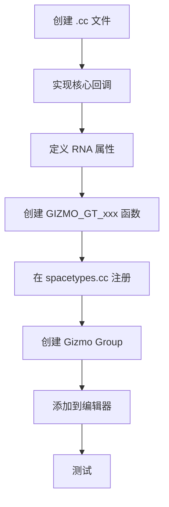

# 新增 Gizmo 完整指南

## 目录
- [1. 概述](#1-概述)
- [2. 架构概览](#2-架构概览)
- [3. 创建新 Gizmo 类型](#3-创建新-gizmo-类型)
  - [3.1. 文件结构](#31-文件结构)
  - [3.2. 核心回调函数](#32-核心回调函数)
  - [3.3. RNA 属性定义](#33-rna-属性定义)
- [4. 完整示例：自定义圆形 Gizmo](#4-完整示例自定义圆形-gizmo)
  - [4.1. 需求分析](#41-需求分析)
  - [4.2. 头文件定义](#42-头文件定义)
  - [4.3. 实现代码](#43-实现代码)
  - [4.4. 注册](#44-注册)
- [5. Gizmo Group 创建](#5-gizmo-group-创建)
  - [5.1. Group 类型定义](#51-group-类型定义)
  - [5.2. Poll 函数](#52-poll-函数)
  - [5.3. Setup 函数](#53-setup-函数)
  - [5.4. Refresh 函数](#54-refresh-函数)
- [6. 集成到编辑器](#6-集成到编辑器)
  - [6.1. 注册到空间类型](#61-注册到空间类型)
  - [6.2. 添加到 Gizmo Map](#62-添加到-gizmo-map)
- [7. 测试与调试](#7-测试与调试)
  - [7.1. 单元测试](#71-单元测试)
  - [7.2. 可视化调试](#72-可视化调试)
- [8. 最佳实践](#8-最佳实践)
- [9. 总结](#9-总结)

---

## 1. 概述

本章详细介绍如何从零开始创建一个新的 gizmo 类型，包括：

- **Gizmo 类型**：基础交互单元（如箭头、边界框）
- **Gizmo Group**：管理一组 gizmo 的容器
- **集成**：将 gizmo 添加到特定编辑器

<mark style="background-color: #2E7D32; color: white; padding: 2px 6px; border-radius: 3px;">★ Insight</mark>
创建新 gizmo 需要理解三个层次：**类型定义**（API）、**实现**（逻辑）、**集成**（使用）。

---

## 2. 架构概览

### 2.1. 注册流程



### 2.2. 文件结构

```
source/blender/editors/
├── gizmo_library/
│   └── gizmo_types/
│       └── my_gizmo.cc          ← 新 gizmo 实现
├── space_myeditor/
│   └── myeditor_gizmo.cc        ← Group 实现
└── space_api/
    └── spacetypes.cc            ← 注册
```

---

## 3. 创建新 Gizmo 类型

### 3.1. 文件结构

创建新文件 `source/blender/editors/gizmo_library/gizmo_types/my_gizmo.cc`：

```cpp
/* SPDX-FileCopyrightText: 2024 Blender Authors
 * SPDX-License-Identifier: GPL-2.0-or-later */

/** \\file
 * \\ingroup edgizmolib
 *
 * \\name My Gizmo
 *
 * \\brief 自定义 gizmo 描述
 */

#include "MEM_guardedalloc.h"

#include "BLI_math_base_safe.h"
#include "BLI_math_matrix.h"
#include "BLI_math_vector.h"
#include "BLI_math_vector_types.hh"

#include "BKE_context.hh"

#include "GPU_immediate.hh"
#include "GPU_matrix.hh"
#include "GPU_state.hh"

#include "RNA_access.hh"
#include "RNA_define.hh"

#include "WM_api.hh"
#include "WM_types.hh"

#include "ED_gizmo_library.hh"

/* own includes */
#include "../gizmo_library_intern.hh"

// ... 实现代码 ...
```

### 3.2. 核心回调函数

每个 gizmo 类型必须实现以下回调：

```cpp
// 1. 绘制函数
static void gizmo_my_draw(const bContext *C, wmGizmo *gz)
{
  // 推送矩阵
  GPU_matrix_push();
  GPU_matrix_mul(gz->matrix_offset);

  // 设置颜色
  float color[4];
  gizmo_color_get(gz, (gz->state & WM_GIZMO_STATE_HIGHLIGHT) != 0, color);
  immUniformColor4fv(color);

  // 绘制几何体
  uint pos = GPU_vertformat_attr_add(
      immVertexFormat(), \"pos\", blender::gpu::VertAttrType::SFLOAT_32_32_32);
  immBindBuiltinProgram(GPU_SHADER_3D_UNIFORM_COLOR);

  immBegin(GPU_PRIM_TRIS, 3);
  immVertex3f(pos, 0.0f, 0.0f, 0.0f);
  immVertex3f(pos, 1.0f, 0.0f, 0.0f);
  immVertex3f(pos, 0.0f, 1.0f, 0.0f);
  immEnd();

  immUnbindProgram();
  GPU_matrix_pop();
}

// 2. 选择绘制（用于点击检测）
static void gizmo_my_draw_select(const bContext *C, wmGizmo *gz, int select_id)
{
  GPU_select_load_id(select_id);
  gizmo_my_draw(C, gz);
}

// 3. 测试选择（点击检测）
static int gizmo_my_test_select(bContext *C, wmGizmo *gz, const int mval[2])
{
  float point_local[2];

  // 投影鼠标到局部空间
  if (gizmo_window_project_2d(C, gz, blender::float2(blender::int2(mval)), 2, true, point_local) == false) {
    return -1;
  }

  // 简单的点击测试（圆形）
  float radius = 0.5f;  // 从属性读取
  if (len_v2(point_local) <= radius) {
    return 0;  // 返回部件 ID
  }

  return -1;  // 未点击
}

// 4. 设置（初始化）
static void gizmo_my_setup(wmGizmo *gz)
{
  // 设置默认标志
  gz->flag |= WM_GIZMO_DRAW_MODAL | WM_GIZMO_NEEDS_UNDO;

  // 设置默认值
  gz->scale_basis = 0.05f;
}

// 5. 调用（开始交互）
static wmOperatorStatus gizmo_my_invoke(bContext *C, wmGizmo *gz, const wmEvent *event)
{
  // 分配交互数据
  MyInteractionData *data = MEM_callocN<MyInteractionData>(__func__);

  // 保存原始状态
  copy_m4_m4(data->orig_matrix, gz->matrix_offset);
  data->orig_mouse[0] = event->mval[0];
  data->orig_mouse[1] = event->mval[1];

  gz->interaction_data = data;

  return OPERATOR_RUNNING_MODAL;
}

// 6. 模态（交互中）
static wmOperatorStatus gizmo_my_modal(bContext *C,
                                       wmGizmo *gz,
                                       const wmEvent *event,
                                       eWM_GizmoFlagTweak tweak_flag)
{
  MyInteractionData *data = (MyInteractionData *)gz->interaction_data;

  // 处理修饰键
  bool precise = (tweak_flag & WM_GIZMO_TWEAK_PRECISE) != 0;
  float sensitivity = precise ? 0.01f : 0.1f;

  // 计算变换
  float delta[2] = {
    (event->mval[0] - data->orig_mouse[0]) * sensitivity,
    (event->mval[1] - data->orig_mouse[1]) * sensitivity
  };

  // 应用到矩阵
  gz->matrix_offset[3][0] = data->orig_matrix[3][0] + delta[0];
  gz->matrix_offset[3][1] = data->orig_matrix[3][1] + delta[1];

  // 更新属性
  wmGizmoProperty *gz_prop = WM_gizmo_target_property_find(gz, \"offset\");
  if (gz_prop->type != nullptr) {
    WM_gizmo_target_property_float_set_array(C, gz, gz_prop, &gz->matrix_offset[3][0]);
  }

  // 标记重绘
  ED_region_tag_redraw_editor_overlays(CTX_wm_region(C));

  return OPERATOR_RUNNING_MODAL;
}

// 7. 退出（结束交互）
static void gizmo_my_exit(bContext *C, wmGizmo *gz, const bool cancel)
{
  MyInteractionData *data = (MyInteractionData *)gz->interaction_data;

  if (cancel) {
    // 恢复原始状态
    wmGizmoProperty *gz_prop = WM_gizmo_target_property_find(gz, \"offset\");
    if (gz_prop->type != nullptr) {
      WM_gizmo_target_property_float_set_array(C, gz, gz_prop, &data->orig_matrix[3][0]);
    }
    copy_m4_m4(gz->matrix_offset, data->orig_matrix);
  }
  else {
    // 确认：自动关键帧
    wmGizmoProperty *gz_prop = WM_gizmo_target_property_find(gz, \"offset\");
    if (WM_gizmo_target_property_is_valid(gz_prop)) {
      WM_gizmo_target_property_anim_autokey(C, gz, gz_prop);
    }
  }

  // 释放交互数据
  if (data) {
    MEM_freeN(data);
  }
}

// 8. 属性更新（外部修改）
static void gizmo_my_property_update(wmGizmo *gz, wmGizmoProperty *gz_prop)
{
  if (STREQ(gz_prop->type->idname, \"offset\")) {
    WM_gizmo_target_property_float_get_array(gz, gz_prop, &gz->matrix_offset[3][0]);
  }
}

// 9. 光标（鼠标样式）
static int gizmo_my_get_cursor(wmGizmo *gz)
{
  if (gz->state & WM_GIZMO_STATE_HIGHLIGHT) {
    return WM_CURSOR_MOVE;
  }
  return WM_CURSOR_DEFAULT;
}
```

### 3.3. RNA 属性定义

```cpp
static void GIZMO_GT_my_gizmo(wmGizmoType *gzt)
{
  /* 标识符 */
  gzt->idname = \"GIZMO_GT_my_gizmo\";

  /* API 回调 */
  gzt->draw = gizmo_my_draw;
  gzt->draw_select = gizmo_my_draw_select;
  gzt->test_select = gizmo_my_test_select;
  gzt->setup = gizmo_my_setup;
  gzt->invoke = gizmo_my_invoke;
  gzt->modal = gizmo_my_modal;
  gzt->exit = gizmo_my_exit;
  gzt->property_update = gizmo_my_property_update;
  gzt->cursor_get = gizmo_my_get_cursor;

  gzt->struct_size = sizeof(wmGizmo);

  /* RNA 属性 */
  static const float unit_v2[2] = {1.0f, 1.0f};

  // 尺寸
  RNA_def_float_vector(gzt->srna, \"dimensions\", 2, unit_v2, 0, FLT_MAX,
                       \"Dimensions\", \"\", 0.0f, FLT_MAX);

  // 颜色（可选）
  static const float default_color[4] = {1.0f, 0.5f, 0.0f, 0.8f};
  RNA_def_float_vector(gzt->srna, \"color\", 4, default_color, 0.0f, 1.0f,
                       \"Color\", \"\", 0.0f, 1.0f);

  // 目标属性
  WM_gizmotype_target_property_def(gzt, \"offset\", PROP_FLOAT, 2);
}
```

---

## 4. 完整示例：自定义圆形 Gizmo

### 4.1. 需求分析

创建一个圆形 gizmo，支持：
- 平移
- 点击测试
- 颜色高亮
- 属性绑定

### 4.2. 头文件定义

```cpp
// source/blender/editors/gizmo_library/gizmo_types/circle_gizmo.h

#pragma once

#ifdef __cplusplus
extern "C" {
#endif

void ED_gizmotypes_circle_2d(void);

#ifdef __cplusplus
}
#endif
```

### 4.3. 实现代码

```cpp
// source/blender/editors/gizmo_library/gizmo_types/circle_gizmo.cc

/* SPDX-FileCopyrightText: 2024 Blender Authors
 * SPDX-License-Identifier: GPL-2.0-or-later */

#include \"MEM_guardedalloc.h\"

#include \"BLI_math_base_safe.h\"
#include \"BLI_math_matrix.h\"
#include \"BLI_math_vector.h\"
#include \"BLI_math_vector_types.hh\"

#include \"BKE_context.hh\"

#include \"GPU_immediate.hh\"
#include \"GPU_matrix.hh\"
#include \"GPU_state.hh\"

#include \"RNA_access.hh\"
#include \"RNA_define.hh\"

#include \"WM_api.hh\"
#include \"WM_types.hh\"

#include \"ED_gizmo_library.hh\"

#include \"../gizmo_library_intern.hh\"

namespace {

struct CircleGizmoInteraction {
  float orig_mouse[2];
  float orig_matrix[4][4];
};

}  // namespace

// 绘制函数
static void gizmo_circle_draw(const bContext *C, wmGizmo *gz)
{
  float dims[2];
  RNA_float_get_array(gz->ptr, \"dimensions\", dims);

  float color[4];
  gizmo_color_get(gz, (gz->state & WM_GIZMO_STATE_HIGHLIGHT) != 0, color);

  GPU_matrix_push();
  GPU_matrix_mul(gz->matrix_offset);

  // 绘制外圈
  uint pos = GPU_vertformat_attr_add(
      immVertexFormat(), \"pos\", blender::gpu::VertAttrType::SFLOAT_32_32_32);

  immBindBuiltinProgram(GPU_SHADER_3D_POLYLINE_UNIFORM_COLOR);
  immUniformColor3fv(color);
  immUniform1f(\"lineWidth\", gz->line_width * U.pixelsize);

  // 绘制圆形（使用线段）
  const int segments = 32;
  immBegin(GPU_PRIM_LINE_LOOP, segments);
  for (int i = 0; i < segments; i++) {
    float angle = (float)i / segments * 2.0f * M_PI;
    float x = cosf(angle) * dims[0] / 2.0f;
    float y = sinf(angle) * dims[1] / 2.0f;
    immVertex3f(pos, x, y, 0.0f);
  }
  immEnd();

  immUnbindProgram();

  // 绘制中心点（如果可平移）
  if (RNA_enum_get(gz->ptr, \"transform\") & ED_GIZMO_CAGE_XFORM_FLAG_TRANSLATE) {
    immBindBuiltinProgram(GPU_SHADER_3D_POINT_UNIFORM_SIZE_UNIFORM_COLOR_AA);
    immUniformColor4fv(color);
    immUniform1f(\"size\", 5.0f * U.pixelsize);
    immBegin(GPU_PRIM_POINTS, 1);
    immVertex3f(pos, 0.0f, 0.0f, 0.0f);
    immEnd();
    immUnbindProgram();
  }

  GPU_matrix_pop();
}

// 选择绘制
static void gizmo_circle_draw_select(const bContext *C, wmGizmo *gz, int select_id)
{
  GPU_select_load_id(select_id);
  gizmo_circle_draw(C, gz);
}

// 点击测试
static int gizmo_circle_test_select(bContext *C, wmGizmo *gz, const int mval[2])
{
  float point_local[2];

  if (gizmo_window_project_2d(C, gz, blender::float2(blender::int2(mval)), 2, true, point_local) == false) {
    return -1;
  }

  float dims[2];
  RNA_float_get_array(gz->ptr, \"dimensions\", dims);
  float radius = dims[0] / 2.0f;

  // 检查是否在圆内
  if (len_v2(point_local) <= radius) {
    // 检查是否在中心区域（用于平移）
    float center_radius = radius * 0.2f;
    if (len_v2(point_local) <= center_radius) {
      return 0;  // 平移部件
    }
    return 1;  // 外部区域（可用于其他功能）
  }

  return -1;
}

// 设置
static void gizmo_circle_setup(wmGizmo *gz)
{
  gz->flag |= WM_GIZMO_DRAW_MODAL | WM_GIZMO_NEEDS_UNDO;
  gz->scale_basis = 0.05f;
  gz->line_width = 2.0f;
}

// 调用
static wmOperatorStatus gizmo_circle_invoke(bContext *C, wmGizmo *gz, const wmEvent *event)
{
  CircleGizmoInteraction *data = MEM_callocN<CircleGizmoInteraction>(__func__);

  copy_m4_m4(data->orig_matrix, gz->matrix_offset);

  // 投影鼠标到局部空间
  if (gizmo_window_project_2d(C, gz, blender::float2(blender::int2(event->mval)), 2, false, data->orig_mouse) == 0) {
    zero_v2(data->orig_mouse);
  }

  gz->interaction_data = data;

  return OPERATOR_RUNNING_MODAL;
}

// 模态
static wmOperatorStatus gizmo_circle_modal(bContext *C,
                                           wmGizmo *gz,
                                           const wmEvent *event,
                                           eWM_GizmoFlagTweak tweak_flag)
{
  CircleGizmoInteraction *data = (CircleGizmoInteraction *)gz->interaction_data;
  int transform_flag = RNA_enum_get(gz->ptr, \"transform\");

  // 投影当前鼠标
  float point_local[2];
  {
    float matrix_back[4][4];
    copy_m4_m4(matrix_back, gz->matrix_offset);
    copy_m4_m4(gz->matrix_offset, data->orig_matrix);

    bool ok = gizmo_window_project_2d(
        C, gz, blender::float2(blender::int2(event->mval)), 2, false, point_local);

    copy_m4_m4(gz->matrix_offset, matrix_back);

    if (!ok) {
      return OPERATOR_RUNNING_MODAL;
    }
  }

  // 获取属性
  wmGizmoProperty *gz_prop = WM_gizmo_target_property_find(gz, \"offset\");
  if (gz_prop->type != nullptr) {
    WM_gizmo_target_property_float_get_array(gz, gz_prop, &gz->matrix_offset[3][0]);
  }

  // 处理平移
  if (gz->highlight_part == 0 && (transform_flag & ED_GIZMO_CAGE_XFORM_FLAG_TRANSLATE)) {
    // 精确模式
    bool precise = (tweak_flag & WM_GIZMO_TWEAK_PRECISE) != 0;
    float sensitivity = precise ? 0.1f : 1.0f;

    copy_m4_m4(gz->matrix_offset, data->orig_matrix);
    gz->matrix_offset[3][0] = data->orig_matrix[3][0] + (point_local[0] - data->orig_mouse[0]) * sensitivity;
    gz->matrix_offset[3][1] = data->orig_matrix[3][1] + (point_local[1] - data->orig_mouse[1]) * sensitivity;
  }

  // 更新属性
  if (gz_prop->type != nullptr) {
    WM_gizmo_target_property_float_set_array(C, gz, gz_prop, &gz->matrix_offset[3][0]);
  }

  // 标记重绘
  ED_region_tag_redraw_editor_overlays(CTX_wm_region(C));

  return OPERATOR_RUNNING_MODAL;
}

// 退出
static void gizmo_circle_exit(bContext *C, wmGizmo *gz, const bool cancel)
{
  CircleGizmoInteraction *data = (CircleGizmoInteraction *)gz->interaction_data;

  if (cancel) {
    wmGizmoProperty *gz_prop = WM_gizmo_target_property_find(gz, \"offset\");
    if (gz_prop->type != nullptr) {
      WM_gizmo_target_property_float_set_array(C, gz, gz_prop, &data->orig_matrix[3][0]);
    }
    copy_m4_m4(gz->matrix_offset, data->orig_matrix);
  }
  else {
    wmGizmoProperty *gz_prop = WM_gizmo_target_property_find(gz, \"offset\");
    if (WM_gizmo_target_property_is_valid(gz_prop)) {
      WM_gizmo_target_property_anim_autokey(C, gz, gz_prop);
    }
  }

  if (data) {
    MEM_freeN(data);
  }
}

// 属性更新
static void gizmo_circle_property_update(wmGizmo *gz, wmGizmoProperty *gz_prop)
{
  if (STREQ(gz_prop->type->idname, \"offset\")) {
    WM_gizmo_target_property_float_get_array(gz, gz_prop, &gz->matrix_offset[3][0]);
  }
}

// 光标
static int gizmo_circle_get_cursor(wmGizmo *gz)
{
  if (gz->state & WM_GIZMO_STATE_HIGHLIGHT) {
    if (gz->highlight_part == 0) {
      return WM_CURSOR_MOVE;
    }
  }
  return WM_CURSOR_DEFAULT;
}

// 类型定义
static void GIZMO_GT_circle_2d(wmGizmoType *gzt)
{
  gzt->idname = \"GIZMO_GT_circle_2d\";

  gzt->draw = gizmo_circle_draw;
  gzt->draw_select = gizmo_circle_draw_select;
  gzt->test_select = gizmo_circle_test_select;
  gzt->setup = gizmo_circle_setup;
  gzt->invoke = gizmo_circle_invoke;
  gzt->modal = gizmo_circle_modal;
  gzt->exit = gizmo_circle_exit;
  gzt->property_update = gizmo_circle_property_update;
  gzt->cursor_get = gizmo_circle_get_cursor;

  gzt->struct_size = sizeof(wmGizmo);

  // RNA 属性
  static const float unit_v2[2] = {100.0f, 100.0f};
  RNA_def_float_vector(gzt->srna, \"dimensions\", 2, unit_v2, 0, FLT_MAX,
                       \"Dimensions\", \"\", 0.0f, FLT_MAX);

  static const EnumPropertyItem transform_items[] = {
      {ED_GIZMO_CAGE_XFORM_FLAG_TRANSLATE, \"TRANSLATE\", 0, \"Move\", \"\"},
      {0, nullptr, 0, nullptr, nullptr},
  };
  RNA_def_enum_flag(gzt->srna, \"transform\", transform_items, 0, \"Transform Options\", \"\");

  WM_gizmotype_target_property_def(gzt, \"offset\", PROP_FLOAT, 2);
}

// 注册函数
void ED_gizmotypes_circle_2d()
{
  WM_gizmotype_append(GIZMO_GT_circle_2d);
}
```

### 4.4. 注册到系统

#### 4.4.1. 添加到头文件

```cpp
// source/blender/editors/include/ED_gizmo_library.hh

// 在文件末尾添加
void ED_gizmotypes_circle_2d();
```

#### 4.4.2. 添加到注册列表

```cpp
// source/blender/editors/space_api/spacetypes.cc:126-136

/* Gizmo types. */
ED_gizmotypes_button_2d();
ED_gizmotypes_dial_3d();
ED_gizmotypes_move_3d();
ED_gizmotypes_arrow_3d();
ED_gizmotypes_preselect_3d();
ED_gizmotypes_primitive_3d();
ED_gizmotypes_blank_3d();
ED_gizmotypes_cage_2d();
ED_gizmotypes_cage_3d();
ED_gizmotypes_snap_3d();
ED_gizmotypes_circle_2d();  // ← 添加这一行
```

---

## 5. Gizmo Group 创建

### 5.1. Group 类型定义

Gizmo Group 管理 gizmo 的生命周期和上下文：

```cpp
// source/blender/editors/space_myeditor/myeditor_gizmo.cc

struct MyGizmoData {
  wmGizmo *circle;
  // 可以添加多个 gizmo
};

// Poll - 决定是否显示
static bool WIDGETGROUP_my_poll(const bContext *C, wmGizmoGroupType * /*gzgt*/)
{
  SpaceMyEditor *smy = CTX_wm_space_myeditor(C);
  if (smy == nullptr) {
    return false;
  }

  // 检查编辑器状态
  if ((smy->flag & SNODE_BACKDRAW) == 0) {
    return false;
  }

  // 检查是否有活动对象
  Object *ob = CTX_data_active_object(C);
  if (ob == nullptr) {
    return false;
  }

  return true;
}

// Setup - 创建 gizmo
static void WIDGETGROUP_my_setup(const bContext * /*C*/, wmGizmoGroup *gzgroup)
{
  MyGizmoData *data = MEM_new<MyGizmoData>(__func__);

  // 创建圆形 gizmo
  data->circle = WM_gizmo_new(\"GIZMO_GT_circle_2d\", gzgroup, nullptr);

  // 配置
  RNA_enum_set(data->circle->ptr, \"transform\", ED_GIZMO_CAGE_XFORM_FLAG_TRANSLATE);
  float dims[2] = {50.0f, 50.0f};
  RNA_float_set_array(data->circle->ptr, \"dimensions\", dims);

  gzgroup->customdata = data;

  // 设置释放函数
  gzgroup->customdata_free = [](void *customdata) {
    MEM_delete(static_cast<MyGizmoData *>(customdata));
  };
}

// Refresh - 更新状态
static void WIDGETGROUP_my_refresh(const bContext *C, wmGizmoGroup *gzgroup)
{
  MyGizmoData *data = (MyGizmoData *)gzgroup->customdata;
  wmGizmo *gz = data->circle;

  // 获取上下文数据
  Object *ob = CTX_data_active_object(C);

  if (ob == nullptr) {
    WM_gizmo_set_flag(gz, WM_GIZMO_HIDDEN, true);
    return;
  }

  // 更新位置
  float pos[3] = {ob->loc[0], ob->loc[1], ob->loc[2]};
  WM_gizmo_set_matrix_location(gz, pos);

  // 绑定属性
  PointerRNA ptr = RNA_pointer_create_discrete(&ob->id, &RNA_Object, ob);
  WM_gizmo_target_property_def_rna(gz, \"offset\", &ptr, \"location\", -1);

  // 显示
  WM_gizmo_set_flag(gz, WM_GIZMO_HIDDEN, false);
}

// Draw Prepare - 绘制前准备
static void WIDGETGROUP_my_draw_prepare(const bContext *C, wmGizmoGroup *gzgroup)
{
  MyGizmoData *data = (MyGizmoData *)gzgroup->customdata;
  ARegion *region = CTX_wm_region(C);
  SpaceMyEditor *smy = CTX_wm_space_myeditor(C);

  // 计算空间矩阵
  float matrix_space[4][4];
  unit_m4(matrix_space);

  // 如果是 2D 编辑器，应用缩放和偏移
  if (smy) {
    mul_v3_fl(matrix_space[0], smy->zoom);
    mul_v3_fl(matrix_space[1], smy->zoom);
    matrix_space[3][0] = (region->winx / 2) + smy->xof;
    matrix_space[3][1] = (region->winy / 2) + smy->yof;
  }

  copy_m4_m4(data->circle->matrix_space, matrix_space);
}

// 注册 Group 类型
void MYEDITOR_GGT_my_gizmos(wmGizmoGroupType *gzgt)
{
  gzgt->name = \"My Gizmos\";
  gzgt->idname = \"MYEDITOR_GGT_my_gizmos\";

  gzgt->flag = WM_GIZMOGROUPTYPE_PERSISTENT;

  gzgt->poll = WIDGETGROUP_my_poll;
  gzgt->setup = WIDGETGROUP_my_setup;
  gzgt->refresh = WIDGETGROUP_my_refresh;
  gzgt->draw_prepare = WIDGETGROUP_my_draw_prepare;

  // 键映射
  gzgt->setup_keymap = WM_gizmogroup_setup_keymap_generic_maybe_drag;
}
```

### 5.2. 完整的 Group 实现（带多个 gizmo）

```cpp
// 复杂示例：多个 gizmo 组合

struct MultiGizmoData {
  wmGizmo *center;      // 中心点
  wmGizmo *handle1;     // 手柄 1
  wmGizmo *handle2;     // 手柄 2
};

static void WIDGETGROUP_multi_setup(const bContext * /*C*/, wmGizmoGroup *gzgroup)
{
  MultiGizmoData *data = MEM_new<MultiGizmoData>(__func__);

  // 创建多个 gizmo
  data->center = WM_gizmo_new(\"GIZMO_GT_move_3d\", gzgroup, nullptr);
  data->handle1 = WM_gizmo_new(\"GIZMO_GT_move_3d\", gzgroup, nullptr);
  data->handle2 = WM_gizmo_new(\"GIZMO_GT_move_3d\", gzgroup, nullptr);

  // 配置
  RNA_enum_set(data->center->ptr, \"draw_style\", ED_GIZMO_MOVE_STYLE_CROSS_2D);
  RNA_enum_set(data->handle1->ptr, \"draw_style\", ED_GIZMO_MOVE_STYLE_RING_2D);
  RNA_enum_set(data->handle2->ptr, \"draw_style\", ED_GIZMO_MOVE_STYLE_RING_2D);

  data->center->scale_basis = 0.05f;
  data->handle1->scale_basis = 0.03f;
  data->handle2->scale_basis = 0.03f;

  gzgroup->customdata = data;
}

static void WIDGETGROUP_multi_refresh(const bContext *C, wmGizmoGroup *gzgroup)
{
  MultiGizmoData *data = (MultiGizmoData *)gzgroup->customdata;

  // 获取数据
  Object *ob = CTX_data_active_object(C);
  if (ob == nullptr) {
    WM_gizmo_set_flag(data->center, WM_GIZMO_HIDDEN, true);
    WM_gizmo_set_flag(data->handle1, WM_GIZMO_HIDDEN, true);
    WM_gizmo_set_flag(data->handle2, WM_GIZMO_HIDDEN, true);
    return;
  }

  // 设置中心位置
  float center_pos[3] = {ob->loc[0], ob->loc[1], ob->loc[2]};
  WM_gizmo_set_matrix_location(data->center, center_pos);

  // 设置手柄位置（相对于中心）
  float handle1_pos[3] = {ob->loc[0] + 2.0f, ob->loc[1], ob->loc[2]};
  float handle2_pos[3] = {ob->loc[0], ob->loc[1] + 2.0f, ob->loc[2]};
  WM_gizmo_set_matrix_location(data->handle1, handle1_pos);
  WM_gizmo_set_matrix_location(data->handle2, handle2_pos);

  // 绑定属性
  PointerRNA ptr = RNA_pointer_create_discrete(&ob->id, &RNA_Object, ob);

  // 中心绑定到位置
  WM_gizmo_target_property_def_rna(data->center, \"offset\", &ptr, \"location\", -1);

  // 手柄绑定到自定义属性（需要在对象上定义）
  // WM_gizmo_target_property_def_rna(data->handle1, \"offset\", &ptr, \"my_handle1\", -1);
  // WM_gizmo_target_property_def_rna(data->handle2, \"offset\", &ptr, \"my_handle2\", -1);

  // 显示
  WM_gizmo_set_flag(data->center, WM_GIZMO_HIDDEN, false);
  WM_gizmo_set_flag(data->handle1, WM_GIZMO_HIDDEN, false);
  WM_gizmo_set_flag(data->handle2, WM_GIZMO_HIDDEN, false);
}
```

---

## 6. 集成到编辑器

### 6.1. 注册到空间类型

```cpp
// source/blender/editors/space_myeditor/space_myeditor.cc

// 1. 定义 gizmo 注册函数
static void myeditor_gizmos()
{
  wmGizmoMapType_Params params{SPACE_MYEDITOR, RGN_TYPE_WINDOW};
  wmGizmoMapType *gzmap_type = WM_gizmomaptype_ensure(¶ms);

  // 添加 gizmo group
  WM_gizmogrouptype_append_and_link(gzmap_type, MYEDITOR_GGT_my_gizmos);
}

// 2. 在空间类型定义中添加
static SpaceType *spacetype_myeditor()
{
  SpaceType *st = (SpaceType *)MEM_callocN(sizeof(SpaceType), "spacetype myeditor");

  st->idname = "MyEditor";
  st->name = "My Editor";
  st->icon = ICON_VIEW3D;  // 使用图标

  // ... 其他回调 ...

  st->gizmos = myeditor_gizmos;  // ← 添加 gizmos 回调

  return st;
}
```

### 6.2. 添加到 Gizmo Map

```cpp
// 在 myeditor_gizmos 函数中

static void myeditor_gizmos()
{
  wmGizmoMapType_Params params{SPACE_MYEDITOR, RGN_TYPE_WINDOW};
  wmGizmoMapType *gzmap_type = WM_gizmomaptype_ensure(¶ms);

  // 方法 1: 直接添加
  WM_gizmogrouptype_append_and_link(gzmap_type, MYEDITOR_GGT_my_gizmos);

  // 方法 2: 条件添加（如果需要多个 gizmo 组）
  if (/* 条件 */) {
    WM_gizmogrouptype_append_and_link(gzmap_type, MYEDITOR_GGT_alt_gizmos);
  }
}
```

---

## 7. 测试与调试

### 7.1. 单元测试框架

```cpp
// source/blender/editors/gizmo_library/tests/my_gizmo_test.cc

#include "testing/testing.h"
#include "BLI_math_vector.h"

TEST(MyGizmo, ClickTest)
{
  // 创建 gizmo
  wmGizmo *gz = WM_gizmo_new("GIZMO_GT_circle_2d", nullptr, nullptr);

  // 设置尺寸
  float dims[2] = {100.0f, 100.0f};
  RNA_float_set_array(gz->ptr, "dimensions", dims);

  // 测试点在圆内
  float point[2] = {20.0f, 20.0f};
  float radius = dims[0] / 2.0f;
  EXPECT_LE(len_v2(point), radius);

  // 测试点在圆外
  float point2[2] = {60.0f, 60.0f};
  EXPECT_GT(len_v2(point2), radius);

  // 清理
  WM_gizmo_free(gz);
}

TEST(MyGizmo, TransformMatrix)
{
  wmGizmo *gz = WM_gizmo_new("GIZMO_GT_circle_2d", nullptr, nullptr);

  // 设置位置
  float loc[3] = {10.0f, 20.0f, 0.0f};
  WM_gizmo_set_matrix_location(gz, loc);

  // 验证矩阵
  EXPECT_EQ(gz->matrix_offset[3][0], 10.0f);
  EXPECT_EQ(gz->matrix_offset[3][1], 20.0f);

  WM_gizmo_free(gz);
}
```

### 7.2. 可视化调试

```cpp
// 在绘制函数中添加调试信息

static void gizmo_my_draw(const bContext *C, wmGizmo *gz)
{
  // 正常绘制
  // ...

  // 调试：显示点击区域
  if (false) {  // 设置为 true 启用调试
    float dims[2];
    RNA_float_get_array(gz->ptr, \"dimensions\", dims);

    // 绘制边界框
    GPU_matrix_push();
    GPU_matrix_mul(gz->matrix_offset);

    uint pos = GPU_vertformat_attr_add(
        immVertexFormat(), \"pos\", blender::gpu::VertAttrType::SFLOAT_32_32_32);

    immBindBuiltinProgram(GPU_SHADER_3D_UNIFORM_COLOR);
    immUniformColor4f(1.0f, 0.0f, 0.0f, 0.3f);

    immBegin(GPU_PRIM_LINE_LOOP, 4);
    immVertex3f(pos, -dims[0]/2, -dims[1]/2, 0.0f);
    immVertex3f(pos,  dims[0]/2, -dims[1]/2, 0.0f);
    immVertex3f(pos,  dims[0]/2,  dims[1]/2, 0.0f);
    immVertex3f(pos, -dims[0]/2,  dims[1]/2, 0.0f);
    immEnd();

    immUnbindProgram();
    GPU_matrix_pop();
  }
}
```

### 7.3. 日志输出

```cpp
// 在关键位置添加日志

static int gizmo_my_test_select(bContext *C, wmGizmo *gz, const int mval[2])
{
  printf(\"Gizmo Test Select: mval=(%d, %d)\\n\", mval[0], mval[1]);

  float point_local[2];
  bool ok = gizmo_window_project_2d(C, gz, blender::float2(blender::int2(mval)), 2, true, point_local);

  if (!ok) {
    printf(\"  Projection failed\\n\");
    return -1;
  }

  printf(\"  Local point: (%.2f, %.2f)\\n\", point_local[0], point_local[1]);

  float dims[2];
  RNA_float_get_array(gz->ptr, \"dimensions\", dims);
  float radius = dims[0] / 2.0f;

  float dist = len_v2(point_local);
  printf(\"  Distance: %.2f, Radius: %.2f\\n\", dist, radius);

  if (dist <= radius) {
    printf(\"  HIT!\\n\");
    return 0;
  }

  printf(\"  MISS\\n\");
  return -1;
}
```

---

## 8. 最佳实践

### 8.1. 代码组织

```
✅ 推荐：
- 每个 gizmo 类型一个文件
- 使用命名空间避免符号冲突
- 交互数据使用独立结构体
- 清晰的函数命名（gizmo_xxx_yyy）

❌ 避免：
- 大文件包含多个 gizmo
- 全局变量
- 内存泄漏（忘记释放交互数据）
```

### 8.2. 性能优化

```cpp
// 优化：避免重复计算

static wmOperatorStatus gizmo_my_modal(/*...*/)
{
  // ❌ 不好：每次都重新读取属性
  float dims[2];
  RNA_float_get_array(gz->ptr, \"dimensions\", dims);

  // ✅ 好：缓存到交互数据
  if (data->dims[0] == 0.0f) {
    RNA_float_get_array(gz->ptr, \"dimensions\", data->dims);
  }

  // 使用 data->dims
}
```

### 8.3. 错误处理

```cpp
// 始终检查指针

static void gizmo_my_refresh(const bContext *C, wmGizmoGroup *gzgroup)
{
  MyGizmoData *data = (MyGizmoData *)gzgroup->customdata;
  if (data == nullptr) {
    return;  // 或创建数据
  }

  wmGizmo *gz = data->gizmo;
  if (gz == nullptr) {
    return;
  }

  // 安全的后续操作
}
```

### 8.4. 文档注释

```cpp
/**
 * \brief 我的自定义 gizmo
 *
 * 这个 gizmo 用于...
 *
 * \param C  上下文
 * \param gz gizmo 实例
 *
 * \note 使用注意事项...
 *
 * \ingroup edgizmolib
 */
static void gizmo_my_draw(const bContext *C, wmGizmo *gz)
{
  // ...
}
```

---

## 9. 总结

### 9.1. 完整创建流程

```
1. 规划需求
   ├─ 确定功能
   ├─ 选择基础类型
   └─ 设计交互

2. 创建文件
   ├─ gizmo_types/my_gizmo.cc
   ├─ 添加头文件声明
   └─ 更新 CMakeLists.txt

3. 实现核心
   ├─ 绘制函数
   ├─ 选择测试
   ├─ 交互逻辑
   └─ 属性绑定

4. 定义类型
   ├─ RNA 属性
   ├─ 回调函数
   └─ 注册函数

5. 注册系统
   ├─ 添加到 ED_gizmotypes_*
   ├─ 更新 spacetypes.cc
   └─ 编译验证

6. 创建 Group
   ├─ Poll/Setup/Refresh
   ├─ 多 gizmo 管理
   └─ 属性绑定

7. 集成编辑器
   ├─ 空间类型注册
   ├─ Gizmo Map 添加
   └─ 键映射配置

8. 测试调试
   ├─ 单元测试
   ├─ 可视化调试
   └─ 性能分析
```

### 9.2. 必须实现的函数

| 函数 | 必需 | 说明 |
|------|------|------|
| `draw` | ✅ | 绘制可视化 |
| `draw_select` | ✅ | 选择缓冲区绘制 |
| `test_select` | ✅ | 点击检测 |
| `setup` | ✅ | 初始化 |
| `invoke` | ✅ | 开始交互 |
| `modal` | ✅ | 交互处理 |
| `exit` | ✅ | 结束交互 |
| `property_update` | ⚠️ | 属性同步（推荐） |
| `cursor_get` | ❌ | 光标样式（可选） |

### 9.3. 注册检查表

- [ ] 在 `ED_gizmo_library.hh` 添加声明
- [ ] 在 `spacetypes.cc` 调用注册函数
- [ ] 创建 Gizmo Group 类型
- [ ] 在空间类型中添加 `gizmos` 回调
- [ ] 添加到 Gizmo Map
- [ ] 配置键映射
- [ ] 编译测试

### 9.4. 调试技巧

1. **使用 `printf`**：在关键函数中输出状态
2. **可视化辅助**：绘制边界框、点击区域
3. **简化测试**：先实现最小功能，逐步添加
4. **使用断言**：验证假设
5. **检查内存**：使用 Valgrind 或类似工具

---

**源码参考**:
- 箭头 gizmo: `source/blender/editors/gizmo_library/gizmo_types/arrow3d_gizmo.cc`
- Cage2d gizmo: `source/blender/editors/gizmo_library/gizmo_types/cage2d_gizmo.cc`
- 注册: `source/blender/editors/space_api/spacetypes.cc:126-136`
- Group 示例: `source/blender/editors/space_node/node_gizmo.cc`

**下一步**: 详见 `10_Gizmo_Architecture.md` 了解整体架构。
