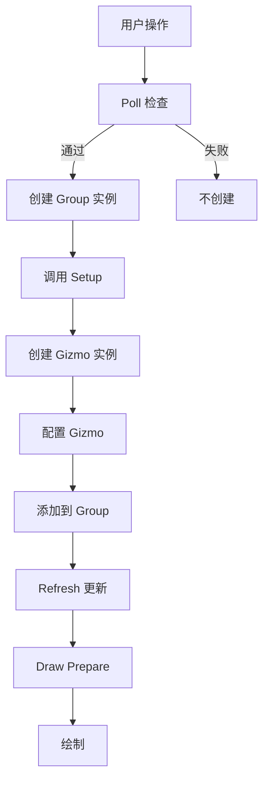

# Gizmo Group 详解

## 目录
- [1. 概述](#1-概述)
- [2. Group 类型定义](#2-group-类型定义)
  - [2.1. 核心回调](#21-核心回调)
  - [2.2. Group 标志](#22-group-标志)
- [3. Poll 函数](#3-poll-函数)
  - [3.1. 条件检查](#31-条件检查)
  - [3.2. 常见检查项](#32-常见检查项)
- [4. Setup 函数](#4-setup-函数)
  - [4.1. 创建 Gizmo](#41-创建-gizmo)
  - [4.2. 配置 Gizmo](#42-配置-gizmo)
  - [4.3. 自定义数据](#43-自定义数据)
- [5. Refresh 函数](#5-refresh-函数)
  - [5.1. 状态更新](#51-状态更新)
  - [5.2. 属性绑定](#52-属性绑定)
  - [5.3. 位置计算](#53-位置计算)
- [6. Draw Prepare 函数](#6-draw-prepare-函数)
  - [6.1. 空间矩阵](#61-空间矩阵)
  - [6.2. 可见性控制](#62-可见性控制)
- [7. 多 Gizmo 管理](#7-多-gizmo-管理)
  - [7.1. 单一 Gizmo](#71-单一-gizmo)
  - [7.2. 多个 Gizmo](#72-多个-gizmo)
  - [7.3. 动态 Gizmo](#73-动态-gizmo)
- [8. 实际案例分析](#8-实际案例分析)
  - [8.1. 背景变换](#81-背景变换)
  - [8.2. 角钉 (Corner Pin)](#82-角钉-corner-pin)
  - [8.3. 眩光 (Glare)](#83-眩光-glare)
- [9. 生命周期管理](#9-生命周期管理)
  - [9.1. 创建流程](#91-创建流程)
  - [9.2. 销毁流程](#92-销毁流程)
- [10. 高级模式](#10-高级模式)
  - [10.1. 条件 Gizmo](#101-条件-gizmo)
  - [10.2. 状态机](#102-状态机)
  - [10.3. 嵌套 Group](#103-嵌套-group)
- [11. 调试技巧](#11-调试技巧)
  - [11.1. 日志输出](#111-日志输出)
  - [11.2. 可视化辅助](#112-可视化辅助)
- [12. 总结](#12-总结)

---

## 1. 概述

Gizmo Group 是 gizmo 系统的**逻辑容器**，负责管理一组相关的 gizmo 实例。它提供了：

- **生命周期管理**: 何时显示、何时创建、何时更新
- **上下文管理**: 访问编辑器状态、选中对象等
- **协调多个 gizmo**: 管理相互关系
- **性能优化**: 按需更新

<mark style="background-color: #1976D2; color: white; padding: 2px 6px; border-radius: 3px;">★ Key Point</mark>
Group 是**策略模式**的应用：通过不同的回调函数实现，同一个 gizmo 类型可以在不同的 Group 中表现出不同的行为。

---

## 2. Group 类型定义

### 2.1. 核心回调

**源码位置**: `source/blender/windowmanager/gizmo/WM_gizmo_types.hh:162-200`

```cpp
struct wmGizmoGroupType {
  char idname[64];                      // 标识符
  char name[64];                        // 显示名称

  /* 核心回调 */
  wmGizmoGroupFnPoll poll;              // 是否显示
  wmGizmoGroupFnSetup setup;            // 创建 gizmo
  wmGizmoGroupFnRefresh refresh;        // 更新状态
  wmGizmoGroupFnDrawPrepare draw_prepare; // 绘制前准备

  /* 可选回调 */
  wmGizmoGroupFnHandleEvent handle_event; // 事件处理
  wmGizmoGroupFnMessageBus message_bus;   // 消息总线

  /* 键映射 */
  wmKeyMap *(*setup_keymap)(wmKeyConfig *keyconf);

  /* 标志 */
  int flag;                             // Group 标志

  /* 自定义数据管理 */
  void (*customdata_free)(void *);      // 释放自定义数据
};
```

### 2.2. Group 标志

**源码位置**: `source/blender/windowmanager/gizmo/WM_gizmo_types.hh:202-220`

```cpp
enum eWM_GizmoGroupTypeFlag {
  /* 持久性：即使没有交互也保持活跃 */
  WM_GIZMOGROUPTYPE_PERSISTENT = (1 << 0),

  /* 工具栏：在工具栏中显示 */
  WM_GIZMOGROUPTYPE_TOOLBAR = (1 << 1),

  /* 3D 视图：用于 3D 空间 */
  WM_GIZMOGROUPTYPE_3D = (1 << 2),

  /* 交互式：处理鼠标事件 */
  WM_GIZMOGROUPTYPE_INTERACTIVE = (1 << 3),
};
```

**标志说明**:
- `PERSISTENT`: Group 一直存在，即使没有用户交互（如背景变换）
- `TOOLBAR`: 在工具面板中显示
- `3D`: 用于 3D 视图，需要特殊的矩阵计算
- `INTERACTIVE`: 需要处理事件

---

## 3. Poll 函数

### 3.1. 条件检查

**源码位置**: `source/blender/editors/space_node/node_gizmo.cc:96-110`

```cpp
static bool WIDGETGROUP_node_transform_poll(const bContext *C, wmGizmoGroupType * /*gzgt*/)
{
  /* 1. 检查 gizmo 可见性设置 */
  if (!node_gizmo_is_set_visible(C)) {
    return false;
  }

  /* 2. 获取当前编辑器 */
  SpaceNode *snode = CTX_wm_space_node(C);
  if (!snode || !snode->edittree) {
    return false;
  }

  /* 3. 获取活动节点 */
  bNode *node = bke::node_get_active(*snode->edittree);

  /* 4. 检查节点类型 */
  if (node && node->is_type("CompositorNodeViewer")) {
    return true;
  }

  return false;
}
```

**辅助函数**:
```cpp
static bool node_gizmo_is_set_visible(const bContext *C)
{
  SpaceNode *snode = CTX_wm_space_node(C);
  if (!snode) {
    return false;
  }

  /* 必须启用背景绘制 */
  if ((snode->flag & SNODE_BACKDRAW) == 0) {
    return false;
  }

  /* 必须是合成器 */
  if (!snode->edittree || snode->edittree->type != NTREE_COMPOSIT) {
    return false;
  }

  /* 检查 gizmo 隐藏标志 */
  if (snode->gizmo_flag & (SNODE_GIZMO_HIDE | SNODE_GIZMO_HIDE_ACTIVE_NODE)) {
    return false;
  }

  return true;
}
```

### 3.2. 常见检查项

| 检查项 | 函数 | 说明 |
|--------|------|------|
| **编辑器可见性** | `CTX_wm_space_node()` | 确保在正确的编辑器 |
| **背景绘制** | `snode->flag & SNODE_BACKDRAW` | 必须启用背景显示 |
| **活动对象** | `CTX_data_active_object(C)` | 需要选中对象 |
| **节点类型** | `node->is_type()` | 特定节点类型 |
| **输入连接** | `socket->is_directly_linked()` | 检查输入是否连接 |
| **Gizmo 设置** | `snode->gizmo_flag` | 用户是否隐藏了 gizmo |

**3D 视图示例**:
```cpp
static bool WIDGETGROUP_view3d_poll(const bContext *C, wmGizmoGroupType * /*gzgt*/)
{
  /* 必须在 3D 视图 */
  if (CTX_wm_space_view3d(C) == nullptr) {
    return false;
  }

  /* 必须有活动对象 */
  Object *ob = CTX_data_active_object(C);
  if (!ob) {
    return false;
  }

  /* 对象必须在编辑模式 */
  if (ob->mode != OB_MODE_EDIT) {
    return false;
  }

  return true;
}
```

---

## 4. Setup 函数

### 4.1. 创建 Gizmo

**源码位置**: `source/blender/editors/space_node/node_gizmo.cc:150-162`

```cpp
static void WIDGETGROUP_node_transform_setup(const bContext * /*C*/, wmGizmoGroup *gzgroup)
{
  /* 1. 分配自定义数据结构 */
  wmGizmoWrapper *wwrapper = MEM_mallocN<wmGizmoWrapper>(__func__);

  /* 2. 创建 gizmo 实例 */
  wwrapper->gizmo = WM_gizmo_new("GIZMO_GT_cage_2d", gzgroup, nullptr);

  /* 3. 配置 gizmo */
  RNA_enum_set(wwrapper->gizmo->ptr, "transform",
               ED_GIZMO_CAGE_XFORM_FLAG_TRANSLATE |
               ED_GIZMO_CAGE_XFORM_FLAG_SCALE_UNIFORM);

  /* 4. 保存到 Group */
  gzgroup->customdata = wwrapper;
}
```

**WM_gizmo_new 详解**:
```cpp
wmGizmo *WM_gizmo_new(const char *idname, wmGizmoGroup *gzgroup, wmGizmo *template_gz)
{
  /* 1. 查找类型 */
  wmGizmoType *gzt = WM_gizmotype_find(idname, false);
  if (!gzt) {
    return nullptr;
  }

  /* 2. 分配实例 */
  wmGizmo *gz = (wmGizmo *)MEM_callocN(gzt->struct_size, __func__);
  gz->type = gzt;
  gz->parent_gzgroup = gzgroup;

  /* 3. 设置默认值 */
  gz->scale_basis = 0.05f;
  gz->line_width = 2.0f;
  unit_m4(gz->matrix_offset);
  unit_m4(gz->matrix_space);

  /* 4. 调用类型 setup */
  if (gzt->setup) {
    gzt->setup(gz);
  }

  /* 5. 添加到 Group */
  BLI_addtail(&gzgroup->gizmos, gz);

  return gz;
}
```

### 4.2. 配置 Gizmo

**常见配置**:
```cpp
static void WIDGETGROUP_my_setup(const bContext * /*C*/, wmGizmoGroup *gzgroup)
{
  MyGizmoData *data = MEM_new<MyGizmoData>(__func__);

  /* 创建 gizmo */
  data->circle = WM_gizmo_new("GIZMO_GT_circle_2d", gzgroup, nullptr);

  /* 配置 RNA 属性 */
  RNA_enum_set(data->circle->ptr, "transform", ED_GIZMO_CAGE_XFORM_FLAG_TRANSLATE);

  float dims[2] = {50.0f, 50.0f};
  RNA_float_set_array(data->circle->ptr, "dimensions", dims);

  /* 配置外观 */
  data->circle->scale_basis = 0.03f;
  data->circle->line_width = 3.0f;

  /* 设置标志 */
  data->circle->flag |= WM_GIZMO_DRAW_MODAL | WM_GIZMO_NEEDS_UNDO;

  gzgroup->customdata = data;
}
```

### 4.3. 自定义数据

**数据结构设计**:
```cpp
/* 简单示例：单个 gizmo */
struct wmGizmoWrapper {
  wmGizmo *gizmo;
};

/* 复杂示例：多个 gizmo */
struct NodeCornerPinWidgetGroup {
  wmGizmo *gizmos[4];  // 4 个角点

  struct {
    float2 dims;
    float2 offset;
  } state;
};

/* 带状态管理 */
struct MyAdvancedGizmoData {
  wmGizmo *primary;      // 主 gizmo
  wmGizmo *secondary;    // 辅助 gizmo

  int current_mode;      // 模式状态
  float original_matrix[4][4];  // 原始状态

  void *context_data;    // 上下文数据
};
```

**内存管理**:
```cpp
static void WIDGETGROUP_my_setup(const bContext * /*C*/, wmGizmoGroup *gzgroup)
{
  MyGizmoData *data = MEM_new<MyGizmoData>(__func__);

  /* 创建 gizmo */
  data->gizmo = WM_gizmo_new("GIZMO_GT_cage_2d", gzgroup, nullptr);

  /* 设置自定义数据 */
  gzgroup->customdata = data;

  /* 设置释放函数 */
  gzgroup->customdata_free = [](void *customdata) {
    MEM_delete(static_cast<MyGizmoData *>(customdata));
  };
}
```

---

## 5. Refresh 函数

### 5.1. 状态更新

**源码位置**: `source/blender/editors/space_node/node_gizmo.cc:163-221`

```cpp
static void WIDGETGROUP_node_transform_refresh(const bContext *C, wmGizmoGroup *gzgroup)
{
  Main *bmain = CTX_data_main(C);
  wmGizmo *cage = ((wmGizmoWrapper *)gzgroup->customdata)->gizmo;
  const ARegion *region = CTX_wm_region(C);

  /* 1. 确定中心位置 */
  const float origin[3] = {float(region->winx / 2), float(region->winy / 2), 0.0f};

  /* 2. 获取 Viewer 图像 */
  void *lock;
  Image *ima = BKE_image_ensure_viewer(bmain, IMA_TYPE_COMPOSITE, "Viewer Node");
  ImBuf *ibuf = BKE_image_acquire_ibuf(ima, nullptr, &lock);

  /* 3. 检查图像有效性 */
  if (UNLIKELY(ibuf == nullptr)) {
    WM_gizmo_set_flag(cage, WM_GIZMO_HIDDEN, true);
    BKE_image_release_ibuf(ima, ibuf, lock);
    return;
  }

  /* 4. 计算尺寸 */
  const float2 dims = node_gizmo_safe_calc_dims(ibuf, GIZMO_NODE_DEFAULT_DIMS);

  /* 5. 更新 gizmo */
  RNA_float_set_array(cage->ptr, "dimensions", dims);
  WM_gizmo_set_matrix_location(cage, origin);
  WM_gizmo_set_flag(cage, WM_GIZMO_HIDDEN, false);

  /* 6. 绑定属性 */
  SpaceNode *snode = CTX_wm_space_node(C);
  wmGizmoPropertyFnParams params{};
  params.value_get_fn = gizmo_node_backdrop_prop_matrix_get;
  params.value_set_fn = gizmo_node_backdrop_prop_matrix_set;
  params.user_data = snode;
  WM_gizmo_target_property_def_func(cage, "matrix", ¶ms);

  BKE_image_release_ibuf(ima, ibuf, lock);
}
```

### 5.2. 属性绑定

**在 Refresh 中绑定**:
```cpp
static void WIDGETGROUP_my_refresh(const bContext *C, wmGizmoGroup *gzgroup)
{
  MyGizmoData *data = (MyGizmoData *)gzgroup->customdata;

  /* 获取上下文数据 */
  Object *ob = CTX_data_active_object(C);
  if (!ob) {
    WM_gizmo_set_flag(data->gizmo, WM_GIZMO_HIDDEN, true);
    return;
  }

  /* 更新位置 */
  float pos[3] = {ob->loc[0], ob->loc[1], ob->loc[2]};
  WM_gizmo_set_matrix_location(data->gizmo, pos);

  /* 绑定属性 */
  PointerRNA ptr = RNA_pointer_create_discrete(&ob->id, &RNA_Object, ob);
  WM_gizmo_target_property_def_rna(data->gizmo, "offset", &ptr, "location", -1);

  /* 显示 */
  WM_gizmo_set_flag(data->gizmo, WM_GIZMO_HIDDEN, false);
}
```

### 5.3. 位置计算

**3D 视图中的位置**:
```cpp
static void WIDGETGROUP_my_refresh(const bContext *C, wmGizmoGroup *gzgroup)
{
  MyGizmoData *data = (MyGizmoData *)gzgroup->customdata;

  Object *ob = CTX_data_active_object(C);
  if (!ob) {
    WM_gizmo_set_flag(data->gizmo, WM_GIZMO_HIDDEN, true);
    return;
  }

  /* 转换到屏幕空间 */
  ARegion *region = CTX_wm_region(C);
  View3D *v3d = CTX_wm_space_view3d(C);

  float pos_s[3];
  project_float(region, ob->loc, pos_s, v3d->camera);

  /* 设置 gizmo 位置 */
  WM_gizmo_set_matrix_location(data->gizmo, pos_s);

  /* 设置空间矩阵（缩放） */
  float matrix_space[4][4];
  unit_m4(matrix_space);
  mul_v3_fl(matrix_space[0], v3d->camera->sensor_x / 100.0f);
  mul_v3_fl(matrix_space[1], v3d->camera->sensor_y / 100.0f);
  copy_m4_m4(data->gizmo->matrix_space, matrix_space);
}
```

---

## 6. Draw Prepare 函数

### 6.1. 空间矩阵

**源码位置**: `source/blender/editors/space_node/node_gizmo.cc:702-714`

```cpp
static void WIDGETGROUP_node_glare_draw_prepare(const bContext *C, wmGizmoGroup *gzgroup)
{
  NodeGlareWidgetGroup *glare_group = (NodeGlareWidgetGroup *)gzgroup->customdata;
  ARegion *region = CTX_wm_region(C);
  wmGizmo *gz = (wmGizmo *)gzgroup->gizmos.first;

  SpaceNode *snode = CTX_wm_space_node(C);

  /* 计算带图像尺寸的空间矩阵 */
  node_gizmo_calc_matrix_space_with_image_dims(
      snode, region, glare_group->state.dims, glare_group->state.offset, gz->matrix_space);
}
```

**基础空间矩阵**:
```cpp
static void node_gizmo_calc_matrix_space(const SpaceNode *snode,
                                         const ARegion *region,
                                         float matrix_space[4][4])
{
  unit_m4(matrix_space);

  /* 应用缩放 */
  mul_v3_fl(matrix_space[0], snode->zoom);
  mul_v3_fl(matrix_space[1], snode->zoom);

  /* 应用偏移 */
  matrix_space[3][0] = (region->winx / 2) + snode->xof;
  matrix_space[3][1] = (region->winy / 2) + snode->yof;
}
```

**带图像尺寸的空间矩阵**:
```cpp
static void node_gizmo_calc_matrix_space_with_image_dims(const SpaceNode *snode,
                                                         const ARegion *region,
                                                         const float2 &image_dims,
                                                         const float2 &image_offset,
                                                         float matrix_space[4][4])
{
  unit_m4(matrix_space);

  /* 应用缩放（考虑图像尺寸） */
  mul_v3_fl(matrix_space[0], snode->zoom * image_dims.x);
  mul_v3_fl(matrix_space[1], snode->zoom * image_dims.y);

  /* 计算中心（考虑图像偏移） */
  matrix_space[3][0] = ((region->winx / 2) + snode->xof) -
                       ((image_dims.x / 2.0f - image_offset.x) * snode->zoom);
  matrix_space[3][1] = ((region->winy / 2) + snode->yof) -
                       ((image_dims.y / 2.0f - image_offset.y) * snode->zoom);
}
```

### 6.2. 可见性控制

**动态隐藏**:
```cpp
static void WIDGETGROUP_my_draw_prepare(const bContext *C, wmGizmoGroup *gzgroup)
{
  MyGizmoData *data = (MyGizmoData *)gzgroup->customdata;

  /* 检查是否需要显示 */
  Object *ob = CTX_data_active_object(C);
  if (!ob) {
    WM_gizmo_set_flag(data->gizmo, WM_GIZMO_HIDDEN, true);
    return;
  }

  /* 检查距离（太远则隐藏） */
  float dist = len_v3(ob->loc);
  if (dist > 100.0f) {
    WM_gizmo_set_flag(data->gizmo, WM_GIZMO_HIDDEN, true);
    return;
  }

  /* 更新空间矩阵 */
  ARegion *region = CTX_wm_region(C);
  View3D *v3d = CTX_wm_space_view3d(C);

  float matrix_space[4][4];
  unit_m4(matrix_space);
  mul_v3_fl(matrix_space[0], v3d->camera->sensor_x / 100.0f);
  mul_v3_fl(matrix_space[1], v3d->camera->sensor_y / 100.0f);
  matrix_space[3][0] = region->winx / 2;
  matrix_space[3][1] = region->winy / 2;

  copy_m4_m4(data->gizmo->matrix_space, matrix_space);

  /* 显示 */
  WM_gizmo_set_flag(data->gizmo, WM_GIZMO_HIDDEN, false);
}
```

---

## 7. 多 Gizmo 管理

### 7.1. 单一 Gizmo

**最简单模式**:
```cpp
struct wmGizmoWrapper {
  wmGizmo *gizmo;
};

static void WIDGETGROUP_simple_setup(const bContext * /*C*/, wmGizmoGroup *gzgroup)
{
  wmGizmoWrapper *wrapper = MEM_mallocN<wmGizmoWrapper>(__func__);
  wrapper->gizmo = WM_gizmo_new("GIZMO_GT_cage_2d", gzgroup, nullptr);
  gzgroup->customdata = wrapper;
}

static void WIDGETGROUP_simple_refresh(const bContext *C, wmGizmoGroup *gzgroup)
{
  wmGizmoWrapper *wrapper = (wmGizmoWrapper *)gzgroup->customdata;
  /* 更新 wrapper->gizmo */
}
```

### 7.2. 多个 Gizmo

**固定数量**:
```cpp
struct MultiGizmoData {
  wmGizmo *center;
  wmGizmo *handle1;
  wmGizmo *handle2;
};

static void WIDGETGROUP_multi_setup(const bContext * /*C*/, wmGizmoGroup *gzgroup)
{
  MultiGizmoData *data = MEM_new<MultiGizmoData>(__func__);

  /* 创建多个 gizmo */
  data->center = WM_gizmo_new("GIZMO_GT_move_3d", gzgroup, nullptr);
  data->handle1 = WM_gizmo_new("GIZMO_GT_move_3d", gzgroup, nullptr);
  data->handle2 = WM_gizmo_new("GIZMO_GT_move_3d", gzgroup, nullptr);

  /* 配置 */
  RNA_enum_set(data->center->ptr, "draw_style", ED_GIZMO_MOVE_STYLE_CROSS_2D);
  RNA_enum_set(data->handle1->ptr, "draw_style", ED_GIZMO_MOVE_STYLE_RING_2D);
  RNA_enum_set(data->handle2->ptr, "draw_style", ED_GIZMO_MOVE_STYLE_RING_2D);

  data->center->scale_basis = 0.05f;
  data->handle1->scale_basis = 0.03f;
  data->handle2->scale_basis = 0.03f;

  gzgroup->customdata = data;
}

static void WIDGETGROUP_multi_refresh(const bContext *C, wmGizmoGroup *gzgroup)
{
  MultiGizmoData *data = (MultiGizmoData *)gzgroup->customdata;

  Object *ob = CTX_data_active_object(C);
  if (!ob) {
    WM_gizmo_set_flag(data->center, WM_GIZMO_HIDDEN, true);
    WM_gizmo_set_flag(data->handle1, WM_GIZMO_HIDDEN, true);
    WM_gizmo_set_flag(data->handle2, WM_GIZMO_HIDDEN, true);
    return;
  }

  /* 设置中心位置 */
  float center_pos[3] = {ob->loc[0], ob->loc[1], ob->loc[2]};
  WM_gizmo_set_matrix_location(data->center, center_pos);

  /* 设置手柄位置（相对于中心） */
  float handle1_pos[3] = {ob->loc[0] + 2.0f, ob->loc[1], ob->loc[2]};
  float handle2_pos[3] = {ob->loc[0], ob->loc[1] + 2.0f, ob->loc[2]};
  WM_gizmo_set_matrix_location(data->handle1, handle1_pos);
  WM_gizmo_set_matrix_location(data->handle2, handle2_pos);

  /* 绑定属性 */
  PointerRNA ptr = RNA_pointer_create_discrete(&ob->id, &RNA_Object, ob);
  WM_gizmo_target_property_def_rna(data->center, "offset", &ptr, "location", -1);

  /* 显示 */
  WM_gizmo_set_flag(data->center, WM_GIZMO_HIDDEN, false);
  WM_gizmo_set_flag(data->handle1, WM_GIZMO_HIDDEN, false);
  WM_gizmo_set_flag(data->handle2, WM_GIZMO_HIDDEN, false);
}
```

**动态数量**:
```cpp
struct DynamicGizmoData {
  ListBase gizmos;  // 动态列表
  int count;
};

static void WIDGETGROUP_dynamic_setup(const bContext * /*C*/, wmGizmoGroup *gzgroup)
{
  DynamicGizmoData *data = MEM_new<DynamicGizmoData>(__func__);
  BLI_listbase_clear(&data->gizmos);
  data->count = 0;

  gzgroup->customdata = data;
}

static void WIDGETGROUP_dynamic_refresh(const bContext *C, wmGizmoGroup *gzgroup)
{
  DynamicGizmoData *data = (DynamicGizmoData *)gzgroup->customdata;

  /* 清除旧的 gizmo */
  LISTBASE_FOREACH_MUTABLE(wmGizmo *, gz, &data->gizmos) {
    WM_gizmo_free(gz);
  }
  BLI_listbase_clear(&data->gizmos);
  data->count = 0;

  /* 根据条件创建新的 gizmo */
  Object *ob = CTX_data_active_object(C);
  if (!ob) {
    return;
  }

  /* 为每个顶点创建一个 gizmo */
  if (ob->type == OB_MESH && ob->mode == OB_MODE_EDIT) {
    BMEditMesh *em = BKE_editmesh_from_object(ob);
    BMesh *bm = em->bm;

    BMVert *v;
    BM_ITER_MESH(v, &bm->v, bm) {
      wmGizmo *gz = WM_gizmo_new("GIZMO_GT_move_3d", gzgroup, nullptr);

      float pos[3];
      copy_v3_v3(pos, v->co);
      mul_m4_v3(ob->obmat, pos);
      WM_gizmo_set_matrix_location(gz, pos);

      BLI_addtail(&data->gizmos, gz);
      data->count++;
    }
  }
}
```

### 7.3. 动态 Gizmo

**按需创建**:
```cpp
static void WIDGETGROUP_conditional_refresh(const bContext *C, wmGizmoGroup *gzgroup)
{
  MyGizmoData *data = (MyGizmoData *)gzgroup->customdata;

  /* 检查模式 */
  SpaceNode *snode = CTX_wm_space_node(C);
  bNode *node = bke::node_get_active(*snode->edittree);

  if (!node) {
    return;
  }

  /* 根据节点类型创建不同的 gizmo */
  if (node->is_type("CompositorNodeCrop")) {
    if (!data->crop_gizmo) {
      data->crop_gizmo = WM_gizmo_new("GIZMO_GT_cage_2d", gzgroup, nullptr);
      RNA_enum_set(data->crop_gizmo->ptr, "transform", ED_GIZMO_CAGE_XFORM_FLAG_SCALE);
    }
    /* 更新 crop gizmo */
  }
  else if (node->is_type("CompositorNodeTransform")) {
    if (!data->transform_gizmo) {
      data->transform_gizmo = WM_gizmo_new("GIZMO_GT_cage_2d", gzgroup, nullptr);
      RNA_enum_set(data->transform_gizmo->ptr, "transform",
                   ED_GIZMO_CAGE_XFORM_FLAG_TRANSLATE |
                   ED_GIZMO_CAGE_XFORM_FLAG_ROTATE |
                   ED_GIZMO_CAGE_XFORM_FLAG_SCALE);
    }
    /* 更新 transform gizmo */
  }
}
```

---

## 8. 实际案例分析

### 8.1. 背景变换

**源码**: `source/blender/editors/space_node/node_gizmo.cc:105-216`

**完整实现**:
```cpp
/* Poll: 检查是否是 Viewer 节点 */
static bool WIDGETGROUP_node_transform_poll(const bContext *C, wmGizmoGroupType * /*gzgt*/)
{
  if (!node_gizmo_is_set_visible(C)) {
    return false;
  }

  SpaceNode *snode = CTX_wm_space_node(C);
  bNode *node = bke::node_get_active(*snode->edittree);

  return (node && node->is_type("CompositorNodeViewer"));
}

/* Setup: 创建单个 cage2d gizmo */
static void WIDGETGROUP_node_transform_setup(const bContext * /*C*/, wmGizmoGroup *gzgroup)
{
  wmGizmoWrapper *wwrapper = MEM_mallocN<wmGizmoWrapper>(__func__);
  wwrapper->gizmo = WM_gizmo_new("GIZMO_GT_cage_2d", gzgroup, nullptr);

  /* 仅允许平移和等比缩放 */
  RNA_enum_set(wwrapper->gizmo->ptr, "transform",
               ED_GIZMO_CAGE_XFORM_FLAG_TRANSLATE |
               ED_GIZMO_CAGE_XFORM_FLAG_SCALE_UNIFORM);

  gzgroup->customdata = wwrapper;
}

/* Refresh: 更新位置和绑定 */
static void WIDGETGROUP_node_transform_refresh(const bContext *C, wmGizmoGroup *gzgroup)
{
  Main *bmain = CTX_data_main(C);
  wmGizmo *cage = ((wmGizmoWrapper *)gzgroup->customdata)->gizmo;
  const ARegion *region = CTX_wm_region(C);

  const float origin[3] = {float(region->winx / 2), float(region->winy / 2), 0.0f};

  void *lock;
  Image *ima = BKE_image_ensure_viewer(bmain, IMA_TYPE_COMPOSITE, "Viewer Node");
  ImBuf *ibuf = BKE_image_acquire_ibuf(ima, nullptr, &lock);

  if (UNLIKELY(ibuf == nullptr)) {
    WM_gizmo_set_flag(cage, WM_GIZMO_HIDDEN, true);
    BKE_image_release_ibuf(ima, ibuf, lock);
    return;
  }

  const float2 dims = node_gizmo_safe_calc_dims(ibuf, GIZMO_NODE_DEFAULT_DIMS);

  RNA_float_set_array(cage->ptr, "dimensions", dims);
  WM_gizmo_set_matrix_location(cage, origin);
  WM_gizmo_set_flag(cage, WM_GIZMO_HIDDEN, false);

  SpaceNode *snode = CTX_wm_space_node(C);
  wmGizmoPropertyFnParams params{};
  params.value_get_fn = gizmo_node_backdrop_prop_matrix_get;
  params.value_set_fn = gizmo_node_backdrop_prop_matrix_set;
  params.user_data = snode;
  WM_gizmo_target_property_def_func(cage, "matrix", ¶ms);

  BKE_image_release_ibuf(ima, ibuf, lock);
}

/* Draw Prepare: 无需特殊处理，使用默认空间矩阵 */
static void WIDGETGROUP_node_transform_draw_prepare(const bContext *C, wmGizmoGroup *gzgroup)
{
  /* 默认行为，无需实现 */
}
```

### 8.2. 角钉 (Corner Pin)

**源码**: `source/blender/editors/space_node/node_gizmo.cc:853-971`

**4 个独立 gizmo**:
```cpp
struct NodeCornerPinWidgetGroup {
  wmGizmo *gizmos[4];  // 4 个角点

  struct {
    float2 dims;
    float2 offset;
  } state;
};

/* Setup: 创建 4 个 move_3d gizmo */
static void WIDGETGROUP_node_corner_pin_setup(const bContext * /*C*/, wmGizmoGroup *gzgroup)
{
  NodeCornerPinWidgetGroup *cpin_group = MEM_mallocN<NodeCornerPinWidgetGroup>(__func__);
  const wmGizmoType *gzt_move_3d = WM_gizmotype_find("GIZMO_GT_move_3d", false);

  for (int i = 0; i < 4; i++) {
    cpin_group->gizmos[i] = WM_gizmo_new_ptr(gzt_move_3d, gzgroup, nullptr);
    wmGizmo *gz = cpin_group->gizmos[i];

    RNA_enum_set(gz->ptr, "draw_style", ED_GIZMO_MOVE_STYLE_CROSS_2D);
    gz->scale_basis = 0.05f / 75.0;
  }

  gzgroup->customdata = cpin_group;
}

/* Draw Prepare: 应用相同的空间矩阵到所有 gizmo */
static void WIDGETGROUP_node_corner_pin_draw_prepare(const bContext *C, wmGizmoGroup *gzgroup)
{
  NodeCornerPinWidgetGroup *cpin_group = (NodeCornerPinWidgetGroup *)gzgroup->customdata;
  ARegion *region = CTX_wm_region(C);
  SpaceNode *snode = CTX_wm_space_node(C);

  float matrix_space[4][4];
  node_gizmo_calc_matrix_space_with_image_dims(
      snode, region, cpin_group->state.dims, cpin_group->state.offset, matrix_space);

  /* 应用到所有 4 个 gizmo */
  for (int i = 0; i < 4; i++) {
    wmGizmo *gz = cpin_group->gizmos[i];
    copy_m4_m4(gz->matrix_space, matrix_space);
  }
}

/* Refresh: 绑定每个角点到节点输入 */
static void WIDGETGROUP_node_corner_pin_refresh(const bContext *C, wmGizmoGroup *gzgroup)
{
  Main *bmain = CTX_data_main(C);
  NodeCornerPinWidgetGroup *cpin_group = (NodeCornerPinWidgetGroup *)gzgroup->customdata;

  void *lock;
  Image *ima = BKE_image_ensure_viewer(bmain, IMA_TYPE_COMPOSITE, "Viewer Node");
  ImBuf *ibuf = BKE_image_acquire_ibuf(ima, nullptr, &lock);

  if (UNLIKELY(ibuf == nullptr)) {
    for (int i = 0; i < 4; i++) {
      WM_gizmo_set_flag(cpin_group->gizmos[i], WM_GIZMO_HIDDEN, true);
    }
    BKE_image_release_ibuf(ima, ibuf, lock);
    return;
  }

  cpin_group->state.dims = node_gizmo_safe_calc_dims(ibuf, GIZMO_NODE_DEFAULT_DIMS);
  copy_v2_v2(cpin_group->state.offset, ima->runtime->backdrop_offset);

  SpaceNode *snode = CTX_wm_space_node(C);
  bNode *node = bke::node_get_active(*snode->edittree);

  /* 绑定每个角点 */
  int i = 0;
  for (bNodeSocket *sock = (bNodeSocket *)node->inputs.first; sock && i < 4; sock = sock->next) {
    if (sock->type == SOCK_VECTOR) {
      wmGizmo *gz = cpin_group->gizmos[i++];

      PointerRNA sockptr = RNA_pointer_create_discrete(
          (ID *)snode->edittree, &RNA_NodeSocket, sock);
      WM_gizmo_target_property_def_rna(gz, "offset", &sockptr, "default_value", -1);

      WM_gizmo_set_flag(gz, WM_GIZMO_DRAW_MODAL, true);
    }
  }

  BKE_image_release_ibuf(ima, ibuf, lock);
}
```

### 8.3. 眩光 (Glare)

**源码**: `source/blender/editors/space_node/node_gizmo.cc:736-851`

**单个 move_3d gizmo**:
```cpp
struct NodeGlareWidgetGroup {
  wmGizmo *gizmo;

  struct {
    float2 dims;
    float2 offset;
  } state;
};

/* Poll: 仅 Sun Beams 模式且未连接输入 */
static bool WIDGETGROUP_node_glare_poll(const bContext *C, wmGizmoGroupType * /*gzgt*/)
{
  if (!node_gizmo_is_set_visible(C)) {
    return false;
  }

  SpaceNode *snode = CTX_wm_space_node(C);
  bNode *node = bke::node_get_active(*snode->edittree);

  if (!node || !node->is_type("CompositorNodeGlare")) {
    return false;
  }

  /* 检查是否是 Sun Beams */
  bNodeSocket &type_socket = *blender::bke::node_find_socket(*node, SOCK_IN, "Type");
  snode->edittree->ensure_topology_cache();
  if (type_socket.is_directly_linked()) {
    return false;
  }

  if (type_socket.default_value_typed<bNodeSocketValueMenu>()->value != CMP_NODE_GLARE_SUN_BEAMS) {
    return false;
  }

  /* 检查 Sun Position 是否连接 */
  LISTBASE_FOREACH (bNodeSocket *, input, &node->inputs) {
    if (STR_ELEM(input->name, "Sun Position") && input->is_directly_linked()) {
      return false;
    }
  }

  return true;
}

/* Setup: 创建 move_3d gizmo */
static void WIDGETGROUP_node_glare_setup(const bContext * /*C*/, wmGizmoGroup *gzgroup)
{
  NodeGlareWidgetGroup *glare_group = MEM_mallocN<NodeGlareWidgetGroup>(__func__);

  glare_group->gizmo = WM_gizmo_new("GIZMO_GT_move_3d", gzgroup, nullptr);
  wmGizmo *gz = glare_group->gizmo;

  RNA_enum_set(gz->ptr, "draw_style", ED_GIZMO_MOVE_STYLE_CROSS_2D);
  gz->scale_basis = 0.05f / 75.0f;

  gzgroup->customdata = glare_group;
}

/* Refresh: 直接绑定到节点输入 */
static void WIDGETGROUP_node_glare_refresh(const bContext *C, wmGizmoGroup *gzgroup)
{
  Main *bmain = CTX_data_main(C);
  NodeGlareWidgetGroup *glare_group = (NodeGlareWidgetGroup *)gzgroup->customdata;
  wmGizmo *gz = glare_group->gizmo;

  void *lock;
  Image *ima = BKE_image_ensure_viewer(bmain, IMA_TYPE_COMPOSITE, "Viewer Node");
  ImBuf *ibuf = BKE_image_acquire_ibuf(ima, nullptr, &lock);

  if (UNLIKELY(ibuf == nullptr)) {
    WM_gizmo_set_flag(gz, WM_GIZMO_HIDDEN, true);
    BKE_image_release_ibuf(ima, ibuf, lock);
    return;
  }

  glare_group->state.dims = node_gizmo_safe_calc_dims(ibuf, GIZMO_NODE_DEFAULT_DIMS);
  copy_v2_v2(glare_group->state.offset, ima->runtime->backdrop_offset);

  SpaceNode *snode = CTX_wm_space_node(C);
  bNode *node = bke::node_get_active(*snode->edittree);

  /* 直接绑定到 Sun Position 输入 */
  bNodeSocket *source_input = bke::node_find_socket(*node, SOCK_IN, "Sun Position");
  PointerRNA sockptr = RNA_pointer_create_discrete(
      reinterpret_cast<ID *>(snode->edittree), &RNA_NodeSocket, source_input);
  WM_gizmo_target_property_def_rna(gz, "offset", &sockptr, "default_value", -1);

  WM_gizmo_set_flag(gz, WM_GIZMO_DRAW_MODAL, true);

  BKE_image_release_ibuf(ima, ibuf, lock);
}

/* Draw Prepare: 使用带图像尺寸的空间矩阵 */
static void WIDGETGROUP_node_glare_draw_prepare(const bContext *C, wmGizmoGroup *gzgroup)
{
  NodeGlareWidgetGroup *glare_group = (NodeGlareWidgetGroup *)gzgroup->customdata;
  ARegion *region = CTX_wm_region(C);
  wmGizmo *gz = (wmGizmo *)gzgroup->gizmos.first;

  SpaceNode *snode = CTX_wm_space_node(C);

  node_gizmo_calc_matrix_space_with_image_dims(
      snode, region, glare_group->state.dims, glare_group->state.offset, gz->matrix_space);
}
```

---

## 9. 生命周期管理

### 9.1. 创建流程



**详细时序**:
```
1. 用户打开编辑器或执行操作
   ↓
2. 系统遍历所有注册的 Group Type
   ↓
3. 对每个 Group Type 调用 poll(C, gzgt)
   ↓
4. 如果 poll 返回 true:
   a. 创建 wmGizmoGroup 实例
   b. 调用 setup(C, gzgroup)
   c. 调用 refresh(C, gzgroup)
   ↓
5. 每帧绘制前:
   a. 调用 draw_prepare(C, gzgroup)
   b. 调用每个 gizmo 的 draw
   ↓
6. 用户交互:
   a. 调用 test_select 找到 gizmo
   b. 调用 invoke 开始模态
   c. 循环调用 modal
   d. 调用 exit 结束
   ↓
7. 条件变化时:
   a. 调用 refresh 更新状态
   b. 可能创建/销毁 gizmo
```

### 9.2. 销毁流程

**源码位置**: `source/blender/windowmanager/gizmo/intern/wm_gizmo_group.cc:200-250`

```cpp
void WM_gizmo_group_free(wmGizmoGroup *gzgroup)
{
  /* 1. 释放所有 gizmo */
  LISTBASE_FOREACH_MUTABLE(wmGizmo *, gz, &gzgroup->gizmos) {
    WM_gizmo_free(gz);
  }

  /* 2. 释放自定义数据 */
  if (gzgroup->customdata && gzgroup->customdata_free) {
    gzgroup->customdata_free(gzgroup->customdata);
  }
  else if (gzgroup->customdata) {
    MEM_freeN(gzgroup->customdata);
  }

  /* 3. 释放 Group 本身 */
  MEM_freeN(gzgroup);
}
```

**触发销毁的条件**:
```cpp
/* 在 Refresh 中检查 */
static void WIDGETGROUP_my_refresh(const bContext *C, wmGizmoGroup *gzgroup)
{
  MyGizmoData *data = (MyGizmoData *)gzgroup->customdata;

  /* 检查是否还需要显示 */
  if (!should_show_gizmo(C)) {
    /* 方法 1: 隐藏所有 gizmo */
    LISTBASE_FOREACH(wmGizmo *, gz, &gzgroup->gizmos) {
      WM_gizmo_set_flag(gz, WM_GIZMO_HIDDEN, true);
    }

    /* 方法 2: 标记 Group 为无效（系统会自动清理） */
    gzgroup->flag |= WM_GIZMOGROUP_INVALID;
    return;
  }

  /* 正常更新 */
  // ...
}
```

---

## 10. 高级模式

### 10.1. 条件 Gizmo

**根据状态创建不同的 gizmo**:
```cpp
struct ConditionalGizmoData {
  wmGizmo *current_gizmo;
  int last_mode;
};

static void WIDGETGROUP_conditional_refresh(const bContext *C, wmGizmoGroup *gzgroup)
{
  ConditionalGizmoData *data = (ConditionalGizmoData *)gzgroup->customdata;

  SpaceNode *snode = CTX_wm_space_node(C);
  bNode *node = bke::node_get_active(*snode->edittree);

  if (!node) {
    return;
  }

  /* 确定当前需要的模式 */
  int current_mode = 0;
  if (node->is_type("CompositorNodeCrop")) {
    current_mode = 1;
  }
  else if (node->is_type("CompositorNodeTransform")) {
    current_mode = 2;
  }

  /* 模式改变，重新创建 */
  if (current_mode != data->last_mode) {
    /* 释放旧的 */
    if (data->current_gizmo) {
      WM_gizmo_free(data->current_gizmo);
      data->current_gizmo = nullptr;
    }

    /* 创建新的 */
    if (current_mode == 1) {
      data->current_gizmo = WM_gizmo_new("GIZMO_GT_cage_2d", gzgroup, nullptr);
      RNA_enum_set(data->current_gizmo->ptr, "transform", ED_GIZMO_CAGE_XFORM_FLAG_SCALE);
    }
    else if (current_mode == 2) {
      data->current_gizmo = WM_gizmo_new("GIZMO_GT_cage_2d", gzgroup, nullptr);
      RNA_enum_set(data->current_gizmo->ptr, "transform",
                   ED_GIZMO_CAGE_XFORM_FLAG_TRANSLATE |
                   ED_GIZMO_CAGE_XFORM_FLAG_ROTATE |
                   ED_GIZMO_CAGE_XFORM_FLAG_SCALE);
    }

    data->last_mode = current_mode;
  }

  /* 更新当前 gizmo */
  if (data->current_gizmo) {
    /* ... 更新逻辑 ... */
  }
}
```

### 10.2. 状态机

**管理复杂的交互状态**:
```cpp
enum MyGizmoState {
  STATE_IDLE,
  STATE_TRANSLATING,
  STATE_SCALING,
  STATE_ROTATING,
};

struct StateMachineData {
  wmGizmo *gizmo;
  int state;
  float start_pos[3];
  float start_scale[3];
};

static void WIDGETGROUP_state_setup(const bContext * /*C*/, wmGizmoGroup *gzgroup)
{
  StateMachineData *data = MEM_new<StateMachineData>(__func__);
  data->gizmo = WM_gizmo_new("GIZMO_GT_cage_2d", gzgroup, nullptr);
  data->state = STATE_IDLE;

  gzgroup->customdata = data;
}

static wmOperatorStatus WIDGETGROUP_state_handle_event(const bContext *C,
                                                       wmGizmoGroup *gzgroup,
                                                       const wmEvent *event)
{
  StateMachineData *data = (StateMachineData *)gzgroup->customdata;

  switch (data->state) {
    case STATE_IDLE:
      if (event->type == LEFTMOUSE && event->val == KM_PRESS) {
        /* 检查点击的部件 */
        int part = WM_gizmo_test_select(C, data->gizmo, event->mval);

        if (part == ED_GIZMO_CAGE2D_PART_TRANSLATE) {
          data->state = STATE_TRANSLATING;
          copy_v3_v3(data->start_pos, data->gizmo->matrix_offset[3]);
        }
        else if (part >= ED_GIZMO_CAGE2D_PART_SCALE_MIN_X) {
          data->state = STATE_SCALING;
          /* 保存原始缩放 */
        }
      }
      break;

    case STATE_TRANSLATING:
      if (event->type == LEFTMOUSE && event->val == KM_RELEASE) {
        data->state = STATE_IDLE;
      }
      /* 处理平移 */
      break;

    case STATE_SCALING:
      if (event->type == LEFTMOUSE && event->val == KM_RELEASE) {
        data->state = STATE_IDLE;
      }
      /* 处理缩放 */
      break;
  }

  return OPERATOR_RUNNING_MODAL;
}
```

### 10.3. 嵌套 Group

**Group 管理子 Group**:
```cpp
struct NestedGroupData {
  wmGizmoGroup *sub_group1;
  wmGizmoGroup *sub_group2;
  wmGizmo *main_gizmo;
};

static void WIDGETGROUP_nested_setup(const bContext *C, wmGizmoGroup *gzgroup)
{
  NestedGroupData *data = MEM_new<NestedGroupData>(__func__);

  /* 创建主 gizmo */
  data->main_gizmo = WM_gizmo_new("GIZMO_GT_cage_2d", gzgroup, nullptr);

  /* 创建子 Group（需要手动创建） */
  // 注意：这需要更复杂的管理，通常不推荐
  // 推荐使用多个 gizmo 而不是嵌套 Group

  gzgroup->customdata = data;
}
```

---

## 11. 调试技巧

### 11.1. 日志输出

**在关键函数中添加日志**:
```cpp
static bool WIDGETGROUP_my_poll(const bContext *C, wmGizmoGroupType * /*gzgt*/)
{
  printf("=== Poll Called ===\n");

  SpaceNode *snode = CTX_wm_space_node(C);
  printf("SpaceNode: %p\n", snode);

  if (!snode) {
    printf("Result: false (no space node)\n");
    return false;
  }

  bNode *node = bke::node_get_active(*snode->edittree);
  printf("Active Node: %p, Type: %s\n", node, node ? node->idname : "none");

  bool result = (node && node->is_type("CompositorNodeViewer"));
  printf("Result: %s\n", result ? "true" : "false");

  return result;
}

static void WIDGETGROUP_my_setup(const bContext * /*C*/, wmGizmoGroup *gzgroup)
{
  printf("=== Setup Called ===\n");
  printf("Group: %s\n", gzgroup->type->idname);

  MyGizmoData *data = MEM_new<MyGizmoData>(__func__);
  data->gizmo = WM_gizmo_new("GIZMO_GT_cage_2d", gzgroup, nullptr);

  printf("Created gizmo: %s\n", data->gizmo->type->idname);

  gzgroup->customdata = data;

  printf("Customdata set: %p\n", gzgroup->customdata);
}

static void WIDGETGROUP_my_refresh(const bContext *C, wmGizmoGroup *gzgroup)
{
  printf("=== Refresh Called ===\n");

  MyGizmoData *data = (MyGizmoData *)gzgroup->customdata;
  if (!data) {
    printf("ERROR: No customdata!\n");
    return;
  }

  Object *ob = CTX_data_active_object(C);
  printf("Active Object: %p\n", ob);

  if (!ob) {
    WM_gizmo_set_flag(data->gizmo, WM_GIZMO_HIDDEN, true);
    printf("Hiding gizmo (no object)\n");
    return;
  }

  printf("Object Location: %.2f, %.2f, %.2f\n", ob->loc[0], ob->loc[1], ob->loc[2]);

  /* 更新位置 */
  float pos[3] = {ob->loc[0], ob->loc[1], ob->loc[2]};
  WM_gizmo_set_matrix_location(data->gizmo, pos);

  printf("Gizmo updated, showing\n");
  WM_gizmo_set_flag(data->gizmo, WM_GIZMO_HIDDEN, false);
}
```

### 11.2. 可视化辅助

**在 Draw 中添加调试信息**:
```cpp
static void gizmo_my_draw(const bContext *C, wmGizmo *gz)
{
  /* 正常绘制 */
  // ...

  /* 调试：显示点击区域边界 */
  if (G.debug & G_DEBUG_GIZMO) {
    float dims[2];
    RNA_float_get_array(gz->ptr, "dimensions", dims);

    GPU_matrix_push();
    GPU_matrix_mul(gz->matrix_offset);

    uint pos = GPU_vertformat_attr_add(
        immVertexFormat(), "pos", blender::gpu::VertAttrType::SFLOAT_32_32_32);

    immBindBuiltinProgram(GPU_SHADER_3D_UNIFORM_COLOR);
    immUniformColor4f(1.0f, 0.0f, 0.0f, 0.3f);

    /* 绘制边界框 */
    immBegin(GPU_PRIM_LINE_LOOP, 4);
    immVertex3f(pos, -dims[0]/2, -dims[1]/2, 0.0f);
    immVertex3f(pos,  dims[0]/2, -dims[1]/2, 0.0f);
    immVertex3f(pos,  dims[0]/2,  dims[1]/2, 0.0f);
    immVertex3f(pos, -dims[0]/2,  dims[1]/2, 0.0f);
    immEnd();

    immUnbindProgram();
    GPU_matrix_pop();
  }
}
```

**在 Test Select 中添加日志**:
```cpp
static int gizmo_my_test_select(bContext *C, wmGizmo *gz, const int mval[2])
{
  printf("=== Test Select ===\n");
  printf("Mouse: %d, %d\n", mval[0], mval[1]);

  float point_local[2];
  bool ok = gizmo_window_project_2d(C, gz, blender::float2(blender::int2(mval)), 2, true, point_local);

  if (!ok) {
    printf("Projection failed\n");
    return -1;
  }

  printf("Local point: %.2f, %.2f\n", point_local[0], point_local[1]);

  float dims[2];
  RNA_float_get_array(gz->ptr, "dimensions", dims);
  float radius = dims[0] / 2.0f;

  float dist = len_v2(point_local);
  printf("Distance: %.2f, Radius: %.2f\n", dist, radius);

  if (dist <= radius) {
    printf("HIT!\n");
    return 0;
  }

  printf("MISS\n");
  return -1;
}
```

---

## 12. 总结

### 12.1. Group 回调对比

| 回调 | 触发时机 | 用途 | 必需 |
|------|----------|------|------|
| **poll** | 每帧检查 | 决定是否显示 | ✅ |
| **setup** | 创建时一次 | 创建和配置 gizmo | ✅ |
| **refresh** | 每帧/状态变化 | 更新位置、绑定 | ✅ |
| **draw_prepare** | 绘制前 | 设置空间矩阵 | ⚠️ (3D) |
| **handle_event** | 事件时 | 自定义事件处理 | ❌ |

### 12.2. Gizmo 数量模式

| 模式 | 实现 | 适用场景 |
|------|------|----------|
| **单一** | `wmGizmoWrapper` | 简单工具 |
| **固定多个** | 结构体成员 | 角钉、多手柄 |
| **动态** | ListBase | 顶点编辑 |
| **条件创建** | 状态机 | 模式切换 |

### 12.3. 最佳实践

1. **Poll 函数要快速**
   - 避免复杂计算
   - 优先检查简单条件

2. **Setup 中分配内存**
   - 创建 gizmo
   - 配置属性
   - 设置自定义数据

3. **Refresh 中更新状态**
   - 检查上下文有效性
   - 更新位置和绑定
   - 控制可见性

4. **Draw Prepare 中设置空间**
   - 计算矩阵
   - 应用到所有 gizmo

5. **正确管理内存**
   - 使用自定义数据结构
   - 设置释放函数
   - 避免内存泄漏

### 12.4. 完整注册流程

```cpp
/* 1. 定义 Group 类型 */
static void MYEDITOR_GGT_my_gizmos(wmGizmoGroupType *gzgt)
{
  gzgt->name = "My Gizmos";
  gzgt->idname = "MYEDITOR_GGT_my_gizmos";
  gzgt->flag = WM_GIZMOGROUPTYPE_PERSISTENT;

  gzgt->poll = WIDGETGROUP_my_poll;
  gzgt->setup = WIDGETGROUP_my_setup;
  gzgt->refresh = WIDGETGROUP_my_refresh;
  gzgt->draw_prepare = WIDGETGROUP_my_draw_prepare;

  gzgt->setup_keymap = WM_gizmogroup_setup_keymap_generic_maybe_drag;
}

/* 2. 注册到 Map */
static void myeditor_gizmos()
{
  wmGizmoMapType_Params params{SPACE_MYEDITOR, RGN_TYPE_WINDOW};
  wmGizmoMapType *gzmap_type = WM_gizmomaptype_ensure(¶ms);

  WM_gizmogrouptype_append_and_link(gzmap_type, MYEDITOR_GGT_my_gizmos);
}

/* 3. 在空间类型中调用 */
static SpaceType *spacetype_myeditor()
{
  SpaceType *st = (SpaceType *)MEM_callocN(sizeof(SpaceType), "spacetype myeditor");

  st->idname = "MyEditor";
  st->name = "My Editor";

  /* ... 其他设置 ... */

  st->gizmos = myeditor_gizmos;  // 注册 gizmos

  return st;
}
```

---

**源码参考**:
- Group 类型: `source/blender/windowmanager/gizmo/WM_gizmo_types.hh:162-230`
- Group 实现: `source/blender/windowmanager/gizmo/intern/wm_gizmo_group.cc`
- 节点示例: `source/blender/editors/space_node/node_gizmo.cc`

**完整文档列表**:
1. `01_Blender_Gizmo_Types.md` - 所有 gizmo 类型
2. `02_Gizmo_Flags.md` - 标志详解
3. `03_Gizmo_Flag_Combinations.md` - 标志搭配
4. `04_Gizmo_Usage.md` - 使用指南
5. `05_Compositor_Gizmo_Example.md` - 合成器案例
6. `06_GIZMO_GT_cage2d.md` - Cage2d 详解
7. `07_Gizmo_Modifier_Keys.md` - 修饰键
8. `08_Gizmo_Modifier_Extensions.md` - 修饰键扩展
9. `09_Adding_New_Gizmos.md` - 新增 gizmo
10. `10_Gizmo_Architecture.md` - 架构概览
11. `11_Gizmo_Properties_and_RNA.md` - 属性绑定
12. `12_Gizmo_Groups.md` - Group 管理
