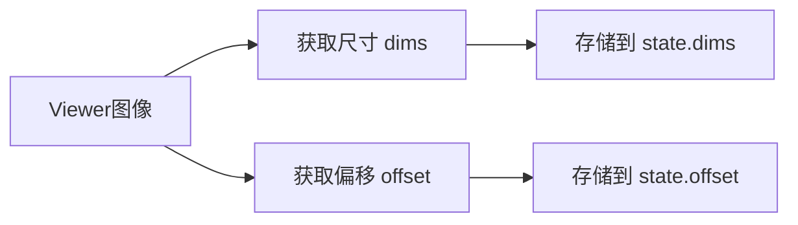
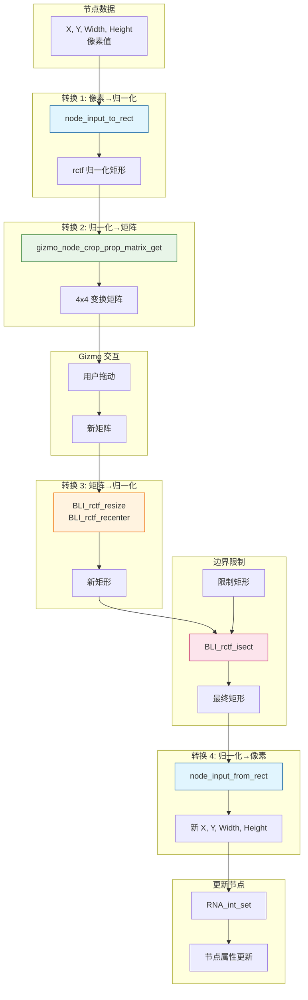

# Crop Gizmo 数学运算详解

## 目录
- [1. 概述](#1-概述)
- [2. 核心数据结构](#2-核心数据结构)
  - [2.1. NodeBBoxWidgetGroup](#21-nodebboxwidgetgroup)
  - [2.2. 状态变量](#22-状态变量)
- [3. 坐标转换函数](#3-坐标转换函数)
  - [3.1. node_input_to_rect - 像素到归一化](#31-node_input_to_rect---像素到归一化)
  - [3.2. node_input_from_rect - 归一化到像素](#32-node_input_from_rect---归一化到像素)
- [4. 矩阵转换函数](#4-矩阵转换函数)
  - [4.1. gizmo_node_crop_prop_matrix_get - 节点→Gizmo](#41-gizmo_node_crop_prop_matrix_get---节点-gizmo)
  - [4.2. gizmo_node_crop_prop_matrix_set - Gizmo→节点](#42-gizmo_node_crop_prop_matrix_set---gizmo-节点)
- [5. 数学运算详解](#5-数学运算详解)
  - [5.1. 归一化计算](#51-归一化计算)
  - [5.2. 矩阵提取](#52-矩阵提取)
  - [5.3. 矩阵构建](#53-矩阵构建)
  - [5.4. 边界限制](#54-边界限制)
- [6. 数据流图](#6-数据流图)
- [7. 完整代码分析](#7-完整代码分析)

---

## 1. 概述

<mark style="background-color: #1976D2; color: white; padding: 2px 6px; border-radius: 3px;">★ Crop Gizmo</mark> 是合成器中用于裁剪图像的交互式工具。它通过矩阵运算将节点的输入参数（X, Y, Width, Height）与 gizmo 的变换矩阵相互转换。

**关键数学概念**：
- **归一化坐标**：将像素坐标转换为 [0, 1] 范围
- **4x4 变换矩阵**：存储位置和缩放信息
- **矩形操作**：通过 `rctf` 结构进行几何计算

---

## 2. 核心数据结构

### 2.1. NodeBBoxWidgetGroup

**定义位置**: `source/blender/editors/space_node/node_gizmo.cc:224-237`

```cpp
struct NodeBBoxWidgetGroup {
  wmGizmo *border;  // 2D 网格 gizmo

  struct {
    float2 dims;    // 图像尺寸 (width, height)
    float2 offset;  // 背景偏移 (x, y)
  } state;

  struct {
    PointerRNA ptr;      // RNA 指针
    PropertyRNA *prop;   // 属性
    bContext *context;   // 上下文
  } update_data;
};
```

**命名解释**：
- `dims`: dimensions 的缩写，表示图像尺寸
- `offset`: 背景图像的偏移量
- `rct`: rectangle 的缩写，表示矩形区域

---

### 2.2. 状态变量

<mark style="background-color: #43A047; color: white; padding: 2px 6px; border-radius: 3px;">★ 状态变量作用</mark>

| 变量 | 类型 | 用途 |
|------|------|------|
| `dims` | `float2` | 存储 Viewer 图像的像素尺寸 |
| `offset` | `float2` | 存储背景图像的偏移（用于多图像布局） |
| `update_data` | struct | 触发节点属性更新 |

**数据流**：


---

## 3. 坐标转换函数

### 3.1. node_input_to_rect - 像素到归一化

**定义位置**: `source/blender/editors/space_node/node_gizmo.cc:245-275`

```cpp
static void node_input_to_rect(const bNode *node,
                               const float2 &dims,
                               const float2 offset,
                               rctf *r_rect)
{
  // 1. 从节点输入读取像素值
  const bNodeSocket *x_input = bke::node_find_socket(*node, SOCK_IN, "X");
  PointerRNA x_input_rna_pointer = RNA_pointer_create_discrete(
      nullptr, &RNA_NodeSocket, const_cast<bNodeSocket *>(x_input));
  const float xmin = float(RNA_int_get(&x_input_rna_pointer, "default_value"));

  const bNodeSocket *y_input = bke::node_find_socket(*node, SOCK_IN, "Y");
  PointerRNA y_input_rna_pointer = RNA_pointer_create_discrete(
      nullptr, &RNA_NodeSocket, const_cast<bNodeSocket *>(y_input));
  const float ymin = float(RNA_int_get(&y_input_rna_pointer, "default_value"));

  const bNodeSocket *width_input = bke::node_find_socket(*node, SOCK_IN, "Width");
  PointerRNA width_input_rna_pointer = RNA_pointer_create_discrete(
      nullptr, &RNA_NodeSocket, const_cast<bNodeSocket *>(width_input));
  const float width = float(RNA_int_get(&width_input_rna_pointer, "default_value"));

  const bNodeSocket *height_input = bke::node_find_socket(*node, SOCK_IN, "Height");
  PointerRNA height_input_rna_pointer = RNA_pointer_create_discrete(
      nullptr, &RNA_NodeSocket, const_cast<bNodeSocket *>(height_input));
  const float height = float(RNA_int_get(&height_input_rna_pointer, "default_value"));

  // 2. 转换为归一化矩形
  r_rect->xmin = (xmin + offset.x) / dims.x;
  r_rect->xmax = (xmin + width + offset.x) / dims.x;
  r_rect->ymin = (ymin + offset.y) / dims.y;
  r_rect->ymax = (ymin + height + offset.y) / dims.y;
}
```

**数学公式**：

$$
\begin{align*}
r_{xmin} &= \frac{x_{pixel} + offset_x}{width_{image}} \\
r_{xmax} &= \frac{x_{pixel} + width_{pixel} + offset_x}{width_{image}} \\
r_{ymin} &= \frac{y_{pixel} + offset_y}{height_{image}} \\
r_{ymax} &= \frac{y_{pixel} + height_{pixel} + offset_y}{height_{image}}
\end{align*}
$$

**示例**：
```cpp
// 输入: X=10, Y=20, Width=100, Height=50
// 图像: 640x480, 偏移: (0, 0)

r_rect->xmin = (10 + 0) / 640 = 0.015625
r_rect->xmax = (10 + 100 + 0) / 640 = 0.171875
r_rect->ymin = (20 + 0) / 480 = 0.041667
r_rect->ymax = (20 + 50 + 0) / 480 = 0.145833

// 结果: {0.0156, 0.1719, 0.0417, 0.1458}
```

---

### 3.2. node_input_from_rect - 归一化到像素

**定义位置**: `source/blender/editors/space_node/node_gizmo.cc:277-307`

```cpp
static void node_input_from_rect(bNode *node,
                                 const rctf *rect,
                                 const float2 &dims,
                                 const float2 &offset)
{
  // 1. 从归一化矩形计算像素值
  const float xmin = rect->xmin * dims.x - offset.x;
  const float width = rect->xmax * dims.x - offset.x - xmin;
  const float ymin = rect->ymin * dims.y - offset.y;
  const float height = rect->ymax * dims.y - offset.y - ymin;

  // 2. 写入节点输入
  bNodeSocket *x_input = bke::node_find_socket(*node, SOCK_IN, "X");
  PointerRNA x_input_rna_pointer = RNA_pointer_create_discrete(
      nullptr, &RNA_NodeSocket, const_cast<bNodeSocket *>(x_input));
  RNA_int_set(&x_input_rna_pointer, "default_value", int(xmin));

  bNodeSocket *y_input = bke::node_find_socket(*node, SOCK_IN, "Y");
  PointerRNA y_input_rna_pointer = RNA_pointer_create_discrete(
      nullptr, &RNA_NodeSocket, const_cast<bNodeSocket *>(y_input));
  RNA_int_set(&y_input_rna_pointer, "default_value", int(ymin));

  bNodeSocket *width_input = bke::node_find_socket(*node, SOCK_IN, "Width");
  PointerRNA width_input_rna_pointer = RNA_pointer_create_discrete(
      nullptr, &RNA_NodeSocket, const_cast<bNodeSocket *>(width_input));
  RNA_int_set(&width_input_rna_pointer, "default_value", int(width));

  bNodeSocket *height_input = bke::node_find_socket(*node, SOCK_IN, "Height");
  PointerRNA height_input_rna_pointer = RNA_pointer_create_discrete(
      nullptr, &RNA_NodeSocket, const_cast<bNodeSocket *>(height_input));
  RNA_int_set(&height_input_rna_pointer, "default_value", int(height));
}
```

**数学公式**：

$$
\begin{align*}
x_{pixel} &= r_{xmin} \times width_{image} - offset_x \\
width_{pixel} &= (r_{xmax} \times width_{image} - offset_x) - x_{pixel} \\
y_{pixel} &= r_{ymin} \times height_{image} - offset_y \\
height_{pixel} &= (r_{ymax} \times height_{image} - offset_y) - y_{pixel}
\end{align*}
$$

**示例**：
```cpp
// 输入: {0.0156, 0.1719, 0.0417, 0.1458}
// 图像: 640x480, 偏移: (0, 0)

xmin = 0.0156 * 640 - 0 = 10
width = 0.1719 * 640 - 0 - 10 = 100
ymin = 0.0417 * 480 - 0 = 20
height = 0.1458 * 480 - 0 - 20 = 50

// 结果: X=10, Y=20, Width=100, Height=50
```

---

## 4. 矩阵转换函数

### 4.1. gizmo_node_crop_prop_matrix_get - 节点→Gizmo

**定义位置**: `source/blender/editors/space_node/node_gizmo.cc:310-328`

```cpp
static void gizmo_node_crop_prop_matrix_get(const wmGizmo *gz,
                                            wmGizmoProperty *gz_prop,
                                            void *value_p)
{
  float (*matrix)[4] = (float (*)[4])value_p;
  BLI_assert(gz_prop->type->array_length == 16);

  NodeBBoxWidgetGroup *crop_group = (NodeBBoxWidgetGroup *)gz->parent_gzgroup->customdata;
  const float2 dims = crop_group->state.dims;
  const float2 offset = crop_group->state.offset;
  const bNode *node = (const bNode *)gz_prop->custom_func.user_data;

  // 1. 将节点输入转换为矩形
  rctf rct;
  node_input_to_rect(node, dims, offset, &rct);

  // 2. 构建 4x4 变换矩阵
  matrix[0][0] = fabsf(BLI_rctf_size_x(&rct));  // X 缩放 (宽度)
  matrix[1][1] = fabsf(BLI_rctf_size_y(&rct));  // Y 缩放 (高度)
  matrix[3][0] = (BLI_rctf_cent_x(&rct) - 0.5f) * dims[0];  // X 位置
  matrix[3][1] = (BLI_rctf_cent_y(&rct) - 0.5f) * dims[1];  // Y 位置
}
```

**矩阵结构**：

$$
\begin{bmatrix}
s_x & 0 & 0 & 0 \\
0 & s_y & 0 & 0 \\
0 & 0 & 1 & 0 \\
t_x & t_y & 0 & 1
\end{bmatrix}
$$

其中：
- $s_x = width$ (缩放X)
- $s_y = height$ (缩放Y)
- $t_x = (center_x - 0.5) \times image\_width$ (平移X)
- $t_y = (center_y - 0.5) \times image\_height$ (平移Y)

**计算步骤**：

<mark style="background-color: #7B1FA2; color: white; padding: 2px 6px; border-radius: 3px;">★ 步骤 1: 获取矩形</mark>
```cpp
rctf rct = {xmin, xmax, ymin, ymax};  // 归一化坐标
```

<mark style="background-color: #7B1FA2; color: white; padding: 2px 6px; border-radius: 3px;">★ 步骤 2: 提取缩放</mark>
```cpp
matrix[0][0] = fabsf(rct.xmax - rct.xmin) * dims.x;  // 实际宽度
matrix[1][1] = fabsf(rct.ymax - rct.ymin) * dims.y;  // 实际高度
```

<mark style="background-color: #7B1FA2; color: white; padding: 2px 6px; border-radius: 3px;">★ 步骤 3: 计算中心并平移</mark>
```cpp
float center_x = (rct.xmin + rct.xmax) / 2;
float center_y = (rct.ymin + rct.ymax) / 2;
matrix[3][0] = (center_x - 0.5f) * dims.x;  // 相对于图像中心的偏移
matrix[3][1] = (center_y - 0.5f) * dims.y;
```

---

### 4.2. gizmo_node_crop_prop_matrix_set - Gizmo→节点

**定义位置**: `source/blender/editors/space_node/node_gizmo.cc:330-353`

```cpp
static void gizmo_node_crop_prop_matrix_set(const wmGizmo *gz,
                                            wmGizmoProperty *gz_prop,
                                            const void *value_p)
{
  const float (*matrix)[4] = (const float (*)[4])value_p;
  BLI_assert(gz_prop->type->array_length == 16);

  NodeBBoxWidgetGroup *crop_group = (NodeBBoxWidgetGroup *)gz->parent_gzgroup->customdata;
  const float2 dims = crop_group->state.dims;
  const float2 offset = crop_group->state.offset;
  bNode *node = (bNode *)gz_prop->custom_func.user_data;

  // 1. 将节点输入转换为矩形
  rctf rct;
  node_input_to_rect(node, dims, offset, &rct);

  // 2. 从矩阵调整矩形大小
  BLI_rctf_resize(&rct, fabsf(matrix[0][0]), fabsf(matrix[1][1]));

  // 3. 从矩阵调整矩形中心
  BLI_rctf_recenter(&rct,
                    ((matrix[3][0]) / dims[0]) + 0.5f,
                    ((matrix[3][1]) / dims[1]) + 0.5f);

  // 4. 边界限制（防止超出图像范围）
  rctf rct_isect{};
  rct_isect.xmin = offset.x / dims.x;
  rct_isect.xmax = offset.x / dims.x + 1;
  rct_isect.ymin = offset.y / dims.y;
  rct_isect.ymax = offset.y / dims.y + 1;
  BLI_rctf_isect(&rct_isect, &rct, &rct);

  // 5. 写回节点
  node_input_from_rect(node, &rct, dims, offset);
  gizmo_node_bbox_update(crop_group);
}
```

---

## 5. 数学运算详解

### 5.1. 归一化计算

**核心公式**：

$$
\text{normalized} = \frac{\text{pixel} + \text{offset}}{\text{image\_size}}
$$

**逆运算**：

$$
\text{pixel} = \text{normalized} \times \text{image\_size} - \text{offset}
$$

**为什么需要 offset？**
- 支持多图像布局
- 背景图像可能不在 (0,0) 位置
- 确保 gizmo 在正确位置显示

---

### 5.2. 矩阵提取

**从 4x4 矩阵提取信息**：

```cpp
// 矩阵格式:
// [ sx,  0,  0,  0 ]
// [  0, sy,  0,  0 ]
// [  0,  0,  1,  0 ]
// [ tx, ty,  0,  1 ]

float width  = matrix[0][0];  // X 缩放
float height = matrix[1][1];  // Y 缩放
float tx     = matrix[3][0];  // X 平移
float ty     = matrix[3][1];  // Y 平移
```

**转换为矩形**：

$$
\begin{align*}
center_x &= \frac{tx}{width_{image}} + 0.5 \\
center_y &= \frac{ty}{height_{image}} + 0.5 \\
xmin &= center_x - \frac{width}{2 \times width_{image}} \\
xmax &= center_x + \frac{width}{2 \times width_{image}} \\
ymin &= center_y - \frac{height}{2 \times height_{image}} \\
ymax &= center_y + \frac{height}{2 \times height_{image}}
\end{align*}
$$

---

### 5.3. 矩阵构建

**从矩形构建矩阵**：

```cpp
// 已知: rct = {xmin, xmax, ymin, ymax}
// 已知: dims = {width_image, height_image}

// 1. 计算宽度和高度
float width = (rct.xmax - rct.xmin) * dims.x;
float height = (rct.ymax - rct.ymin) * dims.y;

// 2. 计算中心
float center_x = (rct.xmin + rct.xmax) / 2;
float center_y = (rct.ymin + rct.ymax) / 2;

// 3. 计算平移（相对于图像中心）
float tx = (center_x - 0.5) * dims.x;
float ty = (center_y - 0.5) * dims.y;

// 4. 构建矩阵
matrix[0][0] = width;
matrix[1][1] = height;
matrix[3][0] = tx;
matrix[3][1] = ty;
```

**可视化**：
```mermaid
graph TD
    A[矩形<br/>{0.1, 0.3, 0.2, 0.4}] --> B[计算尺寸]
    B --> C[width = 0.2 * 640 = 128]
    B --> D[height = 0.2 * 480 = 96]
    A --> E[计算中心]
    E --> F[center_x = 0.2]
    E --> G[center_y = 0.3]
    F --> H[tx = (0.2 - 0.5) * 640 = -192]
    G --> I[ty = (0.3 - 0.5) * 480 = -96]
    C --> J[矩阵]
    D --> J
    H --> J
    I --> J
```

---

### 5.4. 边界限制

**代码分析**：
```cpp
// 创建限制矩形（整个图像范围）
rctf rct_isect{};
rct_isect.xmin = offset.x / dims.x;        // 0 或 offset比例
rct_isect.xmax = offset.x / dims.x + 1;    // 1 或 offset比例+1
rct_isect.ymin = offset.y / dims.y;
rct_isect.ymax = offset.y / dims.y + 1;

// 计算交集
BLI_rctf_isect(&rct_isect, &rct, &rct);
```

**数学原理**：

$$
rct_{final} = rct_{gizmo} \cap rct_{valid\_range}
$$

**示例**：
```cpp
// 假设用户拖动 gizmo 超出边界
rct_gizmo = {-0.1, 0.3, 0.1, 0.5};  // xmin 超出 0
rct_valid = {0, 1, 0, 1};           // 有效范围

// 交集计算
rct_final.xmin = max(-0.1, 0) = 0
rct_final.xmax = min(0.3, 1) = 0.3
rct_final.ymin = max(0.1, 0) = 0.1
rct_final.ymax = min(0.5, 1) = 0.5

// 结果: {0, 0.3, 0.1, 0.5}
```

---

## 6. 数据流图

### 完整数据流（节点→Gizmo→节点）



---

## 7. 完整代码分析

### 7.1. 函数调用链

```mermaid
sequenceDiagram
    participant User as 用户
    participant Gizmo as Gizmo系统
    participant Matrix as 矩阵函数
    participant Rect as 矩形函数
    participant Node as 节点数据
    participant RNA as RNA系统

    Note over User,Node: 1. 初始化

    User->>Gizmo: 拖动 gizmo
    Gizmo->>Matrix: gizmo_node_crop_prop_matrix_set
    Matrix->>Rect: node_input_to_rect (读取当前)
    Rect->>Node: RNA_int_get
    Node->>Rect: 返回像素值
    Rect->>Rect: 转换为归一化
    Rect->>Matrix: 返回 rct

    Note over Matrix: 2. 应用变换
    Matrix->>Matrix: BLI_rctf_resize (缩放)
    Matrix->>Matrix: BLI_rctf_recenter (平移)

    Note over Matrix: 3. 边界限制
    Matrix->>Rect: BLI_rctf_isect
    Rect->>Matrix: 返回限制后矩形

    Note over Matrix: 4. 写回节点
    Matrix->>Rect: node_input_from_rect
    Rect->>Node: RNA_int_set
    Node->>RNA: 属性更新
    RNA->>User: 界面刷新
```

---

### 7.2. 关键数学运算总结

#### <span style="background-color: #FF6F00; color: white; padding: 2px 6px; border-radius: 3px;">★ 归一化转换</span>

**像素 → 归一化**:
```cpp
normalized = (pixel + offset) / image_size
```

**归一化 → 像素**:
```cpp
pixel = normalized * image_size - offset
```

#### <span style="background-color: #6A1B9A; color: white; padding: 2px 6px; border-radius: 3px;">★ 矩阵构建</span>

**从矩形构建矩阵**:
```cpp
width  = (xmax - xmin) * image_width
height = (ymax - ymin) * image_height
tx     = ((xmin + xmax) / 2 - 0.5) * image_width
ty     = ((ymin + ymax) / 2 - 0.5) * image_height

matrix = [width, 0,    0, 0]
         [0,    height,0, 0]
         [0,    0,    1, 0]
         [tx,   ty,   0, 1]
```

#### <span style="background-color: #00796B; color: white; padding: 2px 6px; border-radius: 3px;">★ 矩阵提取</span>

**从矩阵提取矩形**:
```cpp
width  = matrix[0][0]
height = matrix[1][1]
tx     = matrix[3][0]
ty     = matrix[3][1]

center_x = tx / image_width + 0.5
center_y = ty / image_height + 0.5

xmin = center_x - width / (2 * image_width)
xmax = center_x + width / (2 * image_width)
ymin = center_y - height / (2 * image_height)
ymax = center_y + height / (2 * image_height)
```

#### <span style="background-color: #C62828; color: white; padding: 2px 6px; border-radius: 3px;">★ 边界限制</span>

**交集计算**:
```cpp
result.xmin = max(input.xmin, limit.xmin)
result.xmax = min(input.xmax, limit.xmax)
result.ymin = max(input.ymin, limit.ymin)
result.ymax = min(input.ymax, limit.ymax)
```

---

### 7.3. 完整代码流程

```cpp
// ===== 1. 初始化阶段 =====
static void WIDGETGROUP_node_crop_refresh(const bContext *C, wmGizmoGroup *gzgroup)
{
  // 1.1 获取图像信息
  Image *ima = BKE_image_ensure_viewer(bmain, IMA_TYPE_COMPOSITE, "Viewer Node");
  ImBuf *ibuf = BKE_image_acquire_ibuf(ima, nullptr, &lock);

  // 1.2 保存状态
  crop_group->state.dims = node_gizmo_safe_calc_dims(ibuf, GIZMO_NODE_DEFAULT_DIMS);
  copy_v2_v2(crop_group->state.offset, ima->runtime->backdrop_offset);

  // 1.3 绑定属性函数
  wmGizmoPropertyFnParams params{};
  params.value_get_fn = gizmo_node_crop_prop_matrix_get;  // 节点→Gizmo
  params.value_set_fn = gizmo_node_crop_prop_matrix_set;  // Gizmo→节点
  params.user_data = node;
  WM_gizmo_target_property_def_func(gz, "matrix", ¶ms);
}

// ===== 2. 读取数据（节点→Gizmo） =====
static void gizmo_node_crop_prop_matrix_get(...)
{
  // 2.1 读取节点输入
  node_input_to_rect(node, dims, offset, &rct);  // 像素→归一化

  // 2.2 构建矩阵
  matrix[0][0] = fabsf(BLI_rctf_size_x(&rct));   // 宽度
  matrix[1][1] = fabsf(BLI_rctf_size_y(&rct));   // 高度
  matrix[3][0] = (BLI_rctf_cent_x(&rct) - 0.5f) * dims[0];  // X位置
  matrix[3][1] = (BLI_rctf_cent_y(&rct) - 0.5f) * dims[1];  // Y位置
}

// ===== 3. 写入数据（Gizmo→节点） =====
static void gizmo_node_crop_prop_matrix_set(...)
{
  // 3.1 读取当前节点状态
  node_input_to_rect(node, dims, offset, &rct);

  // 3.2 应用变换
  BLI_rctf_resize(&rct, fabsf(matrix[0][0]), fabsf(matrix[1][1]));  // 缩放
  BLI_rctf_recenter(&rct,
                    ((matrix[3][0]) / dims[0]) + 0.5f,
                    ((matrix[3][1]) / dims[1]) + 0.5f);  // 平移

  // 3.3 边界限制
  rctf rct_isect{};
  rct_isect.xmin = offset.x / dims.x;
  rct_isect.xmax = offset.x / dims.x + 1;
  rct_isect.ymin = offset.y / dims.y;
  rct_isect.ymax = offset.y / dims.y + 1;
  BLI_rctf_isect(&rct_isect, &rct, &rct);

  // 3.4 写回节点
  node_input_from_rect(node, &rct, dims, offset);  // 归一化→像素
  gizmo_node_bbox_update(crop_group);  // 触发更新
}
```

---

## 总结

<mark style="background-color: #1976D2; color: white; padding: 2px 6px; border-radius: 3px;">★ 核心要点</mark>

1. **双重转换系统**：像素 ↔ 归一化 ↔ 矩阵
2. **矩阵表示**：4x4 矩阵存储缩放和位置
3. **边界保护**：确保裁剪区域不超出图像
4. **数据流**：节点 → 转换 → Gizmo → 交互 → 转换 → 节点

**关键函数**：
- `node_input_to_rect`：像素 → 归一化矩形
- `node_input_from_rect`：归一化矩形 → 像素
- `gizmo_node_crop_prop_matrix_get`：节点 → 矩阵
- `gizmo_node_crop_prop_matrix_set`：矩阵 → 节点

**数学核心**：
- 归一化：`norm = (pixel + offset) / size`
- 矩阵构建：`[width, 0, 0, 0]`, `[0, height, 0, 0]`, `[tx, ty, 0, 1]`
- 边界限制：`result = input ∩ valid_range`
