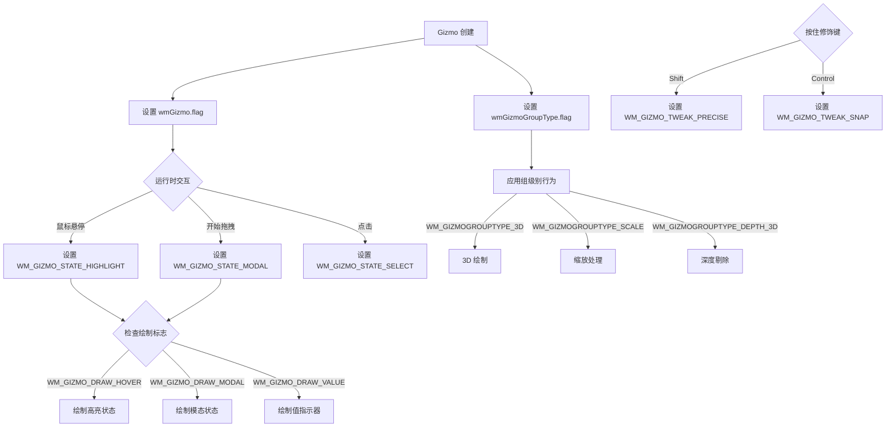

# Gizmo Flag 系统详解

## 1. 概述

### Flag 在 Gizmo 系统中的作用

<span style="color:#e74c3c">**Flag**</span> 是 Blender Gizmo（操作器）系统中的核心机制，用于控制 Gizmo 的行为状态、绘制方式和交互模式。通过位掩码（bitmask）的方式，多个 flag 可以同时设置，实现复杂的功能组合。

### Flag 的分类方式

<span style="color:#3498db">**按作用对象分类**</span>：

| 类别 | 描述 |
|------|------|
| `wmGizmo.state` | 运行时状态（高亮、拖拽、选中） |
| `wmGizmo.flag` | 单个 Gizmo 的行为和绘制配置 |
| `wmGizmoGroupType.flag` | Gizmo 组的全局行为配置 |
| `wmGizmoGroup.init_flag` | Gizmo 组的初始化状态 |
| `wmGizmoFlagTweak` | 调整操作的修饰键标志 |
| 特定 Gizmo Flags | 各类 Gizmo 专用的绘制和交互标志 |

---

## 2. wmGizmo.state Flags

**定义位置**: `source/blender/windowmanager/gizmo/WM_gizmo_types.hh:41-47`

<span style="color:#e74c3c">**运行时状态标志**</span> - 这些标志由系统在运行时自动设置，表示 Gizmo 的当前交互状态。

### WM_GIZMO_STATE_HIGHLIGHT

```cpp
WM_GIZMO_STATE_HIGHLIGHT = (1 << 0)  // 值: 1
```

- **作用**: 鼠标悬停在 Gizmo 上时设置
- **英文注释**: `/* While hovered. */`
- **使用场景**: 控制高亮绘制、工具提示显示等

**实际使用示例**:

```cpp
// 检查是否高亮
const bool is_highlight = (gz->state & WM_GIZMO_STATE_HIGHLIGHT) != 0;
// source/blender/editors/gizmo_library/gizmo_types/cage3d_gizmo.cc:423

// 仅在高亮时绘制
if (gz->state & WM_GIZMO_STATE_HIGHLIGHT) {
    // source/blender/windowmanager/gizmo/intern/wm_gizmo.cc:167
}
```

---

### WM_GIZMO_STATE_MODAL

```cpp
WM_GIZMO_STATE_MODAL = (1 << 1)  // 值: 2
```

- **作用**: 拖拽/交互过程中设置
- **英文注释**: `/* While dragging. */`
- **使用场景**: 模态操作期间，gizmo 处于激活状态，捕获用户输入

**实际使用示例**:

```cpp
// 检查是否处于模态状态
const bool is_modal = gz->state & WM_GIZMO_STATE_MODAL;
// source/blender/editors/gizmo_library/gizmo_types/move3d_gizmo.cc:226

// 在模态状态下的绘制逻辑
if (gz->state & WM_GIZMO_STATE_MODAL) {
    // source/blender/windowmanager/gizmo/intern/wm_gizmo.cc:170
}
```

---

### WM_GIZMO_STATE_SELECT

```cpp
WM_GIZMO_STATE_SELECT = (1 << 2)  // 值: 4
```

- **作用**: Gizmo 被选中时设置
- **英文注释**: （无注释）
- **使用场景**: 表示 Gizmo 处于选中状态，可用于持久化选中状态

---

## 3. wmGizmo.flag Flags

**定义位置**: `source/blender/windowmanager/gizmo/WM_gizmo_types.hh:54-92`

<span style="color:#3498db">**单个 Gizmo 的配置标志**</span> - 这些标志在 Gizmo 创建时或运行时设置，控制 Gizmo 的绘制和交互行为。

### WM_GIZMO_DRAW_HOVER

```cpp
WM_GIZMO_DRAW_HOVER = (1 << 0)  // 值: 1
```

- **作用**: 仅在鼠标悬停时绘制
- **英文注释**: `/* Draw *only* while hovering. */`
- **使用场景**: 减少视觉干扰，只在交互时显示 Gizmo

**实际使用示例**:

```cpp
// 仅在悬停时绘制的箭头 gizmo
WM_gizmo_set_flag(axis, WM_GIZMO_DRAW_HOVER, true);
// source/blender/editors/transform/transform_gizmo_3d.cc:1480

// 检查是否应该绘制
if ((gz->flag & WM_GIZMO_DRAW_HOVER) && !(gz->state & WM_GIZMO_STATE_HIGHLIGHT)) {
    // source/blender/windowmanager/gizmo/intern/wm_gizmo.cc:512
}
```

---

### WM_GIZMO_DRAW_MODAL

```cpp
WM_GIZMO_DRAW_MODAL = (1 << 1)  // 值: 2
```

- **作用**: 在拖拽/交互时绘制
- **英文注释**: `/* Draw while dragging. */`
- **使用场景**: 交互期间保持 Gizmo 可见，提供反馈

**实际使用示例**:

```cpp
// 设置 ruler gizmo 在模态时绘制
WM_gizmo_set_flag(&ruler_item->gz, WM_GIZMO_DRAW_MODAL, true);
// source/blender/editors/space_view3d/view3d_gizmo_ruler.cc:183

// navigation gizmo 模态绘制
gz->flag |= WM_GIZMO_MOVE_CURSOR | WM_GIZMO_DRAW_MODAL;
// source/blender/editors/space_view3d/view3d_gizmo_navigate.cc:174
```

---

### WM_GIZMO_DRAW_VALUE

```cpp
WM_GIZMO_DRAW_VALUE = (1 << 2)  // 值: 4
```

- **作用**: 拖拽时绘制当前值的指示器
- **英文注释**: `/* Draw an indicator for the current value while dragging. */`
- **使用场景**: 显示拖拽的数值反馈

**实际使用示例**:

```cpp
// 检查是否需要绘制值指示器
if ((gz->state & WM_GIZMO_STATE_MODAL) &&
    !(gz->flag & (WM_GIZMO_DRAW_MODAL | WM_GIZMO_DRAW_VALUE)))
// source/blender/windowmanager/gizmo/intern/wm_gizmo.cc:506-507
```

---

### WM_GIZMO_HIDDEN

```cpp
WM_GIZMO_HIDDEN = (1 << 3)  // 值: 8
```

- **作用**: 完全隐藏 Gizmo
- **英文注释**: （无注释）
- **使用场景**: 根据上下文隐藏不需要的 Gizmo

---

### WM_GIZMO_HIDDEN_SELECT

```cpp
WM_GIZMO_HIDDEN_SELECT = (1 << 4)  // 值: 16
```

- **作用**: 隐藏 Gizmo 的选择功能
- **英文注释**: （无注释）
- **使用场景**: Gizmo 可见但不可选中

---

### WM_GIZMO_HIDDEN_KEYMAP

```cpp
WM_GIZMO_HIDDEN_KEYMAP = (1 << 5)  // 值: 32
```

- **作用**: 忽略此 Gizmo 的键盘映射
- **英文注释**: `/* Ignore the key-map for this gizmo. */`
- **使用场景**: 禁用 Gizmo 的键盘交互

---

### WM_GIZMO_DRAW_OFFSET_SCALE

```cpp
WM_GIZMO_DRAW_OFFSET_SCALE = (1 << 6)  // 值: 64
```

- **作用**: `scale_final` 值也会缩放偏移量
- **英文注释**:
  ```
  /* When set 'scale_final' value also scales the offset.
   * Use when offset is to avoid screen-space overlap instead of absolute positioning. */
  ```
- **使用场景**: 避免屏幕空间重叠时使用偏移

---

### WM_GIZMO_DRAW_NO_SCALE

```cpp
WM_GIZMO_DRAW_NO_SCALE = (1 << 7)  // 值: 128
```

- **作用**: 跳过计算最终矩阵时的缩放
- **英文注释**:
  ```
  /* User should still use 'scale_final' for any handles and UI elements.
   * This simply skips scale when calculating the final matrix.
   * Needed when the gizmo needs to align with the interface underneath it. */
  ```
- **使用场景**: 当 Gizmo 需要与下方界面对齐时

**实际使用示例**:

```cpp
// 2D cage gizmo 跳过缩放
gz->flag |= WM_GIZMO_DRAW_MODAL | WM_GIZMO_DRAW_NO_SCALE;
// source/blender/editors/gizmo_library/gizmo_types/cage2d_gizmo.cc:1080
```

---

### WM_GIZMO_MOVE_CURSOR

```cpp
WM_GIZMO_MOVE_CURSOR = (1 << 8)  // 值: 256
```

- **作用**: 交互时隐藏光标并锁定其位置
- **英文注释**:
  ```
  /* Hide the cursor and lock its position while interacting with this gizmo. */
  ```
- **使用场景**: 避免光标干扰操作

**实际使用示例**:

```cpp
// navigation gizmo 移动光标
gz->flag |= WM_GIZMO_MOVE_CURSOR | WM_GIZMO_DRAW_MODAL;
// source/blender/editors/space_view3d/view3d_gizmo_navigate.cc:174

// view2d navigation gizmo
gz->flag |= WM_GIZMO_MOVE_CURSOR | WM_GIZMO_DRAW_MODAL;
// source/blender/editors/interface/view2d/view2d_gizmo_navigate.cc:167
```

---

### WM_GIZMO_SELECT_BACKGROUND

```cpp
WM_GIZMO_SELECT_BACKGROUND = (1 << 9)  // 值: 512
```

- **作用**: 选择时不写入深度缓冲区
- **英文注释**: `/* Don't write into the depth buffer when selecting. */`
- **使用场景**: 处理背景选择

---

### WM_GIZMO_OPERATOR_TOOL_INIT

```cpp
WM_GIZMO_OPERATOR_TOOL_INIT = (1 << 10)  // 值: 1024
```

- **作用**: 作为操作符运行时使用活动工具的操作符属性
- **英文注释**: `/* Use the active tools operator properties when running as an operator. */`
- **使用场景**: 与工具系统集成

---

### WM_GIZMO_EVENT_HANDLE_ALL

```cpp
WM_GIZMO_EVENT_HANDLE_ALL = (1 << 11)  // 值: 2048
```

- **作用**: 不将事件传递给其他处理程序
- **英文注释**:
  ```
  /* Don't pass through events to other handlers
   * (allows click/drag not to have its events stolen by press events in other keymaps). */
  ```
- **使用场景**: 防止事件被其他键盘映射窃取

---

### WM_GIZMO_NO_TOOLTIP

```cpp
WM_GIZMO_NO_TOOLTIP = (1 << 12)  // 值: 4096
```

- **作用**: 不为此 Gizmo 使用工具提示
- **英文注释**: `/* Don't use tool-tips for this gizmo (can be distracting). */`
- **使用场景**: 避免工具提示干扰

---

### WM_GIZMO_NEEDS_UNDO

```cpp
WM_GIZMO_NEEDS_UNDO = (1 << 13)  // 值: 8192
```

- **作用**: 每次使用 Gizmo 后推送撤销步骤
- **英文注释**: `/* Push an undo step after each use of the gizmo. */`
- **使用场景**: 自动创建撤销历史

---

## 4. wmGizmoGroupType.flag Flags

**定义位置**: `source/blender/windowmanager/gizmo/WM_gizmo_types.hh:99-158`

<span style="color:#27ae60">**Gizmo 组的全局配置标志**</span> - 影响组内所有 Gizmo 的行为。

### WM_GIZMOGROUPTYPE_3D

```cpp
WM_GIZMOGROUPTYPE_3D = (1 << 0)  // 值: 1
```

- **作用**: 将 Gizmo 组标记为 3D
- **英文注释**: `/* Mark gizmo-group as being 3D. */`
- **使用场景**: 在 3D 视图中使用的 Gizmo 组

**实际使用示例**:

```cpp
// ruler gizmo 组设置为 3D
gzgt->flag |= WM_GIZMOGROUPTYPE_3D | WM_GIZMOGROUPTYPE_SCALE | WM_GIZMOGROUPTYPE_DRAW_MODAL_ALL;
// source/blender/editors/space_view3d/view3d_gizmo_ruler.cc:1342

// camera gizmo 组
gzgt->flag = (WM_GIZMOGROUPTYPE_PERSISTENT | WM_GIZMOGROUPTYPE_3D | WM_GIZMOGROUPTYPE_DEPTH_3D);
// source/blender/editors/space_view3d/view3d_gizmo_camera.cc:312
```

---

### WM_GIZMOGROUPTYPE_SCALE

```cpp
WM_GIZMOGROUPTYPE_SCALE = (1 << 1)  // 值: 2
```

- **作用**: Gizmo 作为 3D 对象缩放，尊重缩放（否则缩放独立于绘制大小）
- **英文注释**:
  ```
  /* Scale gizmos as 3D object that respects zoom (otherwise zoom independent draw size).
   * NOTE: currently only for 3D views, 2D support needs adding. */
  ```
- **使用场景**: 3D 视图中需要随缩放变化的 Gizmo

**实际使用示例**:

```cpp
// ruler gizmo 组缩放
gzgt->flag |= WM_GIZMOGROUPTYPE_3D | WM_GIZMOGROUPTYPE_SCALE | WM_GIZMOGROUPTYPE_DRAW_MODAL_ALL;
// source/blender/editors/space_view3d/view3d_gizmo_ruler.cc:1342

// camera view gizmo 组
gzgt->flag = (WM_GIZMOGROUPTYPE_PERSISTENT | WM_GIZMOGROUPTYPE_SCALE);
// source/blender/editors/space_view3d/view3d_gizmo_camera.cc:511
```

---

### WM_GIZMOGROUPTYPE_DEPTH_3D

```cpp
WM_GIZMOGROUPTYPE_DEPTH_3D = (1 << 2)  // 值: 4
```

- **作用**: Gizmo 可以被场景物体遮挡（深度剔除）
- **英文注释**: `/* Gizmos can be depth culled with scene objects (covered by other geometry - TODO). */`
- **使用场景**: 需要深度感知的 Gizmo

**实际使用示例**:

```cpp
// camera gizmo 组
gzgt->flag = (WM_GIZMOGROUPTYPE_PERSISTENT | WM_GIZMOGROUPTYPE_3D | WM_GIZMOGROUPTYPE_DEPTH_3D);
// source/blender/editors/space_view3d/view3d_gizmo_camera.cc:312

// light gizmo 组
gzgt->flag |= (WM_GIZMOGROUPTYPE_PERSISTENT | WM_GIZMOGROUPTYPE_3D | WM_GIZMOGROUPTYPE_DEPTH_3D);
// source/blender/editors/space_view3d/view3d_gizmo_light.cc:320
```

---

### WM_GIZMOGROUPTYPE_SELECT

```cpp
WM_GIZMOGROUPTYPE_SELECT = (1 << 3)  // 值: 8
```

- **作用**: Gizmo 可以被选中
- **英文注释**: `/* Gizmos can be selected. */`
- **使用场景**: 支持选择的 Gizmo 组

---

### WM_GIZMOGROUPTYPE_PERSISTENT

```cpp
WM_GIZMOGROUPTYPE_PERSISTENT = (1 << 4)  // 值: 16
```

- **作用**: Gizmo 组将被保留（例如加载新文件时不被移除）
- **英文注释**: `/* The gizmo group is to be kept (not removed on loading a new file for eg). */`
- **使用场景**: 需要持久存在的 Gizmo 组

**实际使用示例**:

```cpp
// navigation gizmo 组持久
gzgt->flag |= (WM_GIZMOGROUPTYPE_PERSISTENT | WM_GIZMOGROUPTYPE_SCALE |
// source/blender/editors/space_view3d/view3d_gizmo_navigate.cc:400

// camera gizmo 组
gzgt->flag = (WM_GIZMOGROUPTYPE_PERSISTENT | WM_GIZMOGROUPTYPE_3D | WM_GIZMOGROUPTYPE_DEPTH_3D);
// source/blender/editors/space_view3d/view3d_gizmo_camera.cc:312
```

---

### WM_GIZMOGROUPTYPE_DRAW_MODAL_ALL

```cpp
WM_GIZMOGROUPTYPE_DRAW_MODAL_ALL = (1 << 5)  // 值: 32
```

- **作用**: 交互时显示所有其他 Gizmo，其他组交互时也显示此组
- **英文注释**:
  ```
  /* Show all other gizmos when interacting.
   * Also show this group when another group is being interacted with. */
  ```
- **使用场景**: 需要在交互时保持多个 Gizmo 可见

**实际使用示例**:

```cpp
// ruler gizmo 组
gzgt->flag |= WM_GIZMOGROUPTYPE_3D | WM_GIZMOGROUPTYPE_SCALE | WM_GIZMOGROUPTYPE_DRAW_MODAL_ALL;
// source/blender/editors/space_view3d/view3d_gizmo_ruler.cc:1342

// placement gizmo 组
gzgt->flag |= WM_GIZMOGROUPTYPE_3D | WM_GIZMOGROUPTYPE_SCALE | WM_GIZMOGROUPTYPE_DRAW_MODAL_ALL;
// source/blender/editors/space_view3d/view3d_placement.cc:1440
```

---

### WM_GIZMOGROUPTYPE_DRAW_MODAL_EXCLUDE

```cpp
WM_GIZMOGROUPTYPE_DRAW_MODAL_EXCLUDE = (1 << 6)  // 值: 64
```

- **作用**: Gizmo 组在模态时不绘制
- **英文注释**: `/* Don't draw this gizmo group when it is modal. */`
- **使用场景**: 交互时隐藏组

**实际使用示例**:

```cpp
// shear gizmo 组
gzgt->flag |= WM_GIZMOGROUPTYPE_3D | WM_GIZMOGROUPTYPE_DRAW_MODAL_EXCLUDE |
// source/blender/editors/transform/transform_gizmo_3d_shear.cc:253

// bisect gizmo 组
gzgt->flag = WM_GIZMOGROUPTYPE_3D | WM_GIZMOGROUPTYPE_DRAW_MODAL_EXCLUDE;
// source/blender/editors/mesh/editmesh_bisect.cc:767
```

---

### WM_GIZMOGROUPTYPE_TOOL_INIT

```cpp
WM_GIZMOGROUPTYPE_TOOL_INIT = (1 << 7)  // 值: 128
```

- **作用**: 与工具配合使用时，仅在激活工具时运行，而不是在工具活动期间链接 Gizmo
- **英文注释**:
  ```
  /* When used with tool, only run when activating the tool,
   * instead of linking the gizmo while the tool is active.
   *
   * \warning this option has some limitations, we might even re-implement this differently.
   * Currently it's quite minimal so we can see how it works out.
   * The main issue is controlling how a gizmo is activated with a tool
   * when a tool can activate multiple operators based on the key-map.
   * We could even move the options into the key-map item.
   * ~ campbell. */
  ```
- **使用场景**: 与工具系统集成

---

### WM_GIZMOGROUPTYPE_TOOL_FALLBACK_KEYMAP

```cpp
WM_GIZMOGROUPTYPE_TOOL_FALLBACK_KEYMAP = (1 << 8)  // 值: 256
```

- **作用**: 此 Gizmo 类型支持使用回退工具的键盘映射
- **英文注释**:
  ```
  /* This gizmo type supports using the fall back tools keymap.
   * #wmGizmoGroup.use_tool_fallback will need to be set too.
   *
   * Often useful in combination with #WM_GIZMOGROUPTYPE_DELAY_REFRESH_FOR_TWEAK
   */
  ```
- **使用场景**: 支持回退键盘映射

**实际使用示例**:

```cpp
// extrude 3d gizmo 组
gzgt->flag = WM_GIZMOGROUPTYPE_3D | WM_GIZMOGROUPTYPE_TOOL_FALLBACK_KEYMAP |
// source/blender/editors/transform/transform_gizmo_extrude_3d.cc:495

// transform 3d gizmo 组
gzgt->flag = WM_GIZMOGROUPTYPE_3D | WM_GIZMOGROUPTYPE_TOOL_FALLBACK_KEYMAP |
// source/blender/editors/transform/transform_gizmo_3d.cc:2278
```

---

### WM_GIZMOGROUPTYPE_DELAY_REFRESH_FOR_TWEAK

```cpp
WM_GIZMOGROUPTYPE_DELAY_REFRESH_FOR_TWEAK = (1 << 9)  // 值: 512
```

- **作用**: 从 Gizmo 的刷新回调中使用，推迟刷新操作直到调整操作完成
- **英文注释**:
  ```
  /* Use this from a gizmos refresh callback so we can postpone the refresh operation
   * until the tweak operation is finished.
   * Only do this when the group doesn't have a highlighted gizmo.
   *
   * The result for the user is tweak events delay the gizmo from flashing under the users cursor,
   * for selection operations. This means gizmos that use this check don't interfere
   * with click-drag events by popping up under the cursor and catching the drag-drag event.
   */
  ```
- **使用场景**: 避免 Gizmo 干扰点击拖拽选择操作

---

### WM_GIZMOGROUPTYPE_VR_REDRAWS

```cpp
WM_GIZMOGROUPTYPE_VR_REDRAWS = (1 << 10)  // 值: 1024
```

- **作用**: 导致连续重绘，即在每次主循环迭代时设置区域重绘标志
- **英文注释**:
  ```
  /* Cause continuous redraws, i.e. set the region redraw flag on every main loop iteration. This
   * should really be avoided by using proper region redraw tagging, notifiers and the message-bus,
   * however for VR it's sometimes needed. */
  ```
- **使用场景**: VR 需要连续重绘的场景

---

## 5. wmGizmoGroup.init_flag Flags

**定义位置**: `source/blender/windowmanager/gizmo/WM_gizmo_types.hh:164-169`

<span style="color:#9b59b6">**初始化状态标志**</span> - 跟踪 Gizmo 组的初始化状态。

### WM_GIZMOGROUP_INIT_SETUP

```cpp
WM_GIZMOGROUP_INIT_SETUP = (1 << 0)  // 值: 1
```

- **作用**: Gizmo 组已初始化
- **英文注释**: `/* Gizmo-group has been initialized. */`
- **使用场景**: 标记组已完成初始化

---

### WM_GIZMOGROUP_INIT_REFRESH

```cpp
WM_GIZMOGROUP_INIT_REFRESH = (1 << 1)  // 值: 2
```

- **作用**: Gizmo 组已刷新
- **英文注释**: （无注释）
- **使用场景**: 标记组已完成刷新

---

## 6. wmGizmoFlagTweak Flags

**定义位置**: `source/blender/windowmanager/gizmo/WM_gizmo_types.hh:195-200`

<span style="color:#f39c12">**调整操作标志**</span> - 传递给 Gizmo 的位标志，在调整时使用。

### WM_GIZMO_TWEAK_PRECISE

```cpp
WM_GIZMO_TWEAK_PRECISE = (1 << 0)  // 值: 1
```

- **作用**: 使用额外精度拖拽（Shift 键）
- **英文注释**: `/* Drag with extra precision (Shift). */`
- **使用场景**: 需要精细控制时按住 Shift 键

---

### WM_GIZMO_TWEAK_SNAP

```cpp
WM_GIZMO_TWEAK_SNAP = (1 << 1)  // 值: 2
```

- **作用**: 启用吸附拖拽（Control 键）
- **英文注释**: `/* Drag with snap enabled (Control). */`
- **使用场景**: 需要吸附对齐时按住 Control 键

---

## 7. 特定 Gizmo 的 Flags

### Arrow Gizmo Flags

**定义位置**: `source/blender/editors/include/ED_gizmo_library.hh:54-75`

#### ED_GIZMO_ARROW_XFORM_FLAG_INVERTED

```cpp
ED_GIZMO_ARROW_XFORM_FLAG_INVERTED = (1 << 3)  // 值: 8
```

- **作用**: 交互期间反转偏移
- **英文注释**: `/* Inverted offset during interaction - if set it also sets constrained below. */`
- **使用场景**: 需要反转交互方向时

#### ED_GIZMO_ARROW_XFORM_FLAG_CONSTRAINED

```cpp
ED_GIZMO_ARROW_XFORM_FLAG_CONSTRAINED = (1 << 4)  // 值: 16
```

- **作用**: 将箭头交互限制在属性宽度内
- **英文注释**: `/* Clamp arrow interaction to property width. */`
- **使用场景**: 限制交互范围

#### ED_GIZMO_ARROW_DRAW_FLAG_STEM

```cpp
ED_GIZMO_ARROW_DRAW_FLAG_STEM = (1 << 0)  // 值: 1
```

- **作用**: 显示箭头杆
- **英文注释**: `/* Show arrow stem. */`
- **使用场景**: 绘制带杆的箭头

#### ED_GIZMO_ARROW_DRAW_FLAG_ORIGIN

```cpp
ED_GIZMO_ARROW_DRAW_FLAG_ORIGIN = (1 << 1)  // 值: 2
```

- **作用**: 显示原点
- **英文注释**: （无注释）
- **使用场景**: 显示箭头起始点

---

### Cage Gizmo Flags

**定义位置**: `source/blender/editors/include/ED_gizmo_library.hh:93-146`

#### ED_GIZMO_CAGE_XFORM_FLAG_TRANSLATE

```cpp
ED_GIZMO_CAGE_XFORM_FLAG_TRANSLATE = (1 << 0)  // 值: 1
```

- **作用**: 允许平移
- **英文注释**: `/* Translates */`
- **使用场景**: Cage 可以平移

#### ED_GIZMO_CAGE_XFORM_FLAG_ROTATE

```cpp
ED_GIZMO_CAGE_XFORM_FLAG_ROTATE = (1 << 1)  // 值: 2
```

- **作用**: 允许旋转
- **英文注释**: `/* Rotates */`
- **使用场景**: Cage 可以旋转

#### ED_GIZMO_CAGE_XFORM_FLAG_SCALE

```cpp
ED_GIZMO_CAGE_XFORM_FLAG_SCALE = (1 << 2)  // 值: 4
```

- **作用**: 允许缩放
- **英文注释**: `/* Scales */`
- **使用场景**: Cage 可以缩放

#### ED_GIZMO_CAGE_XFORM_FLAG_SCALE_UNIFORM

```cpp
ED_GIZMO_CAGE_XFORM_FLAG_SCALE_UNIFORM = (1 << 3)  // 值: 8
```

- **作用**: 统一缩放
- **英文注释**: `/* Scales uniformly */`
- **使用场景**: Cage 保持比例缩放

#### ED_GIZMO_CAGE_XFORM_FLAG_SCALE_SIGNED

```cpp
ED_GIZMO_CAGE_XFORM_FLAG_SCALE_SIGNED = (1 << 4)  // 值: 16
```

- **作用**: 允许负缩放
- **英文注释**: `/* Negative scale allowed */`
- **使用场景**: Cage 可以镜像缩放

#### ED_GIZMO_CAGE_DRAW_FLAG_XFORM_CENTER_HANDLE

```cpp
ED_GIZMO_CAGE_DRAW_FLAG_XFORM_CENTER_HANDLE = (1 << 0)  // 值: 1
```

- **作用**: 绘制中心手柄（而不是整个区域可选择）
- **英文注释**:
  ```
  /* Draw a central handle (instead of having the entire area selectable)
   * Needed for large rectangles that we don't want to swallow all events. */
  ```
- **使用场景**: 避免大矩形吞噬所有事件

#### ED_GIZMO_CAGE_DRAW_FLAG_CORNER_HANDLES

```cpp
ED_GIZMO_CAGE_DRAW_FLAG_CORNER_HANDLES = (1 << 1)  // 值: 2
```

- **作用**: 绘制角手柄
- **英文注释**: （无注释）
- **使用场景**: 显示角点控制手柄

---

### Dial Gizmo Flags

**定义位置**: `source/blender/editors/include/ED_gizmo_library.hh:188-197`

#### ED_GIZMO_DIAL_DRAW_FLAG_CLIP

```cpp
ED_GIZMO_DIAL_DRAW_FLAG_CLIP = (1 << 0)  // 值: 1
```

- **作用**: 裁剪绘制
- **英文注释**: （无注释）
- **使用场景**: 限制绘制范围

#### ED_GIZMO_DIAL_DRAW_FLAG_FILL

```cpp
ED_GIZMO_DIAL_DRAW_FLAG_FILL = (1 << 1)  // 值: 2
```

- **作用**: 填充绘制
- **英文注释**: （无注释）
- **使用场景**: 实心拨盘

#### ED_GIZMO_DIAL_DRAW_FLAG_FILL_SELECT

```cpp
ED_GIZMO_DIAL_DRAW_FLAG_FILL_SELECT = (1 << 2)  // 值: 4
```

- **作用**: 填充选择
- **英文注释**: （无注释）
- **使用场景**: 选择时填充

#### ED_GIZMO_DIAL_DRAW_FLAG_ANGLE_MIRROR

```cpp
ED_GIZMO_DIAL_DRAW_FLAG_ANGLE_MIRROR = (1 << 3)  // 值: 8
```

- **作用**: 角度镜像
- **英文注释**: （无注释）
- **使用场景**: 镜像角度显示

#### ED_GIZMO_DIAL_DRAW_FLAG_ANGLE_START_Y

```cpp
ED_GIZMO_DIAL_DRAW_FLAG_ANGLE_START_Y = (1 << 4)  // 值: 16
```

- **作用**: 角度从 Y 轴开始
- **英文注释**: （无注释）
- **使用场景**: 设置起始角度方向

#### ED_GIZMO_DIAL_DRAW_FLAG_ANGLE_VALUE

```cpp
ED_GIZMO_DIAL_DRAW_FLAG_ANGLE_VALUE = (1 << 5)  // 值: 32
```

- **作用**: 始终显示角度值作为拨盘中的弧
- **英文注释**: `/* Always show the angle value as an arc in the dial. */`
- **使用场景**: 可视化角度值

---

### Move Gizmo Flags

**定义位置**: `source/blender/editors/include/ED_gizmo_library.hh:203-214`

#### ED_GIZMO_MOVE_DRAW_FLAG_FILL

```cpp
ED_GIZMO_MOVE_DRAW_FLAG_FILL = (1 << 0)  // 值: 1
```

- **作用**: 填充（仅用于实体形状）
- **英文注释**: `/* only for solid shapes */`
- **使用场景**: 实心移动 gizmo

#### ED_GIZMO_MOVE_DRAW_FLAG_FILL_SELECT

```cpp
ED_GIZMO_MOVE_DRAW_FLAG_FILL_SELECT = (1 << 1)  // 值: 2
```

- **作用**: 填充选择
- **英文注释**: （无注释）
- **使用场景**: 选择时填充

#### ED_GIZMO_MOVE_DRAW_FLAG_ALIGN_VIEW

```cpp
ED_GIZMO_MOVE_DRAW_FLAG_ALIGN_SELECT = (1 << 2)  // 值: 4
```

- **作用**: 对齐视图
- **英文注释**: （无注释）
- **使用场景**: Gizmo 对齐到视图方向

---

### Button Gizmo Flags

**定义位置**: `source/blender/editors/include/ED_gizmo_library.hh:219-227`

#### ED_GIZMO_BUTTON_SHOW_OUTLINE

```cpp
ED_GIZMO_BUTTON_SHOW_OUTLINE = (1 << 0)  // 值: 1
```

- **作用**: 显示轮廓
- **英文注释**: （无注释）
- **使用场景**: 绘制按钮轮廓

#### ED_GIZMO_BUTTON_SHOW_BACKDROP

```cpp
ED_GIZMO_BUTTON_SHOW_BACKDROP = (1 << 1)  // 值: 2
```

- **作用**: 显示背景
- **英文注释**: （无注释）
- **使用场景**: 绘制按钮背景

#### ED_GIZMO_BUTTON_SHOW_HELPLINE

```cpp
ED_GIZMO_BUTTON_SHOW_HELPLINE = (1 << 2)  // 值: 4
```

- **作用**: 绘制从原点到偏移的线（类似箭头）
- **英文注释**:
  ```
  /* Draw a line from the origin to the offset (similar to an arrow)
   * sometimes needed to show what the button edits. */
  ```
- **使用场景**: 显示按钮编辑的对象

---

### Primitive Gizmo Flags

**定义位置**: `source/blender/editors/include/ED_gizmo_library.hh:232-236`

#### ED_GIZMO_PRIMITIVE_STYLE_PLANE

```cpp
ED_GIZMO_PRIMITIVE_STYLE_PLANE = 0  // 值: 0
```

- **作用**: 平面样式
- **英文注释**: （无注释）
- **使用场景**: 绘制平面

#### ED_GIZMO_PRIMITIVE_STYLE_CIRCLE

```cpp
ED_GIZMO_PRIMITIVE_STYLE_CIRCLE = 1  // 值: 1
```

- **作用**: 圆形样式
- **英文注释**: （无注释）
- **使用场景**: 绘制圆形

#### ED_GIZMO_PRIMITIVE_STYLE_ANNULUS

```cpp
ED_GIZMO_PRIMITIVE_STYLE_ANNULUS = 2  // 值: 2
```

- **作用**: 圆环样式
- **英文注释**: （无注释）
- **使用场景**: 绘制圆环

---

## 8. Flag 分类总结

| 类别 | 颜色 | 描述 | Flag 数量 |
|------|------|------|-----------|
| <span style="color:#e74c3c">wmGizmo.state</span> | <span style="color:#e74c3c">红色</span> | 运行时状态 | 3 |
| <span style="color:#3498db">wmGizmo.flag</span> | <span style="color:#3498db">蓝色</span> | 单个 Gizmo 配置 | 14 |
| <span style="color:#27ae60">wmGizmoGroupType.flag</span> | <span style="color:#27ae60">绿色</span> | Gizmo 组配置 | 11 |
| <span style="color:#9b59b6">wmGizmoGroup.init_flag</span> | <span style="color:#9b59b6">紫色</span> | 初始化状态 | 2 |
| <span style="color:#f39c12">wmGizmoFlagTweak</span> | <span style="color:#f39c12">橙色</span> | 调整操作标志 | 2 |
| 特定 Gizmo Flags | 各种 | 各类 Gizmo 专用 | 20+ |

### Flag 使用流程图



---

## 相关文件

- `source/blender/windowmanager/gizmo/WM_gizmo_types.hh` - 主要 Flag 定义
- `source/blender/editors/include/ED_gizmo_library.hh` - 特定 Gizmo Flag 定义
- `source/blender/windowmanager/gizmo/intern/wm_gizmo.cc` - Flag 实现逻辑
- `source/blender/windowmanager/gizmo/intern/wm_gizmo_map.cc` - Flag 映射逻辑
