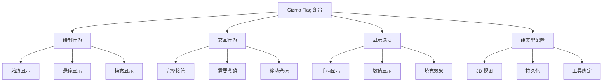
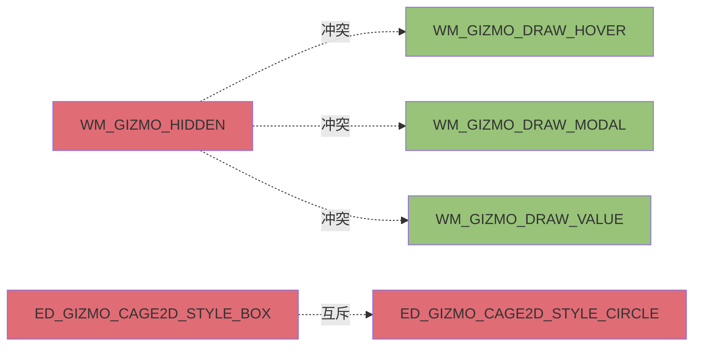
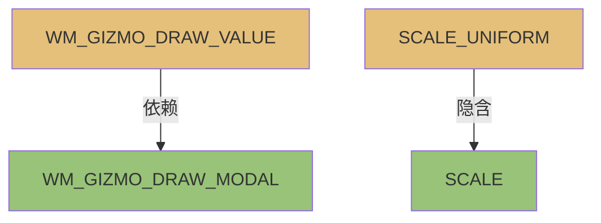

# Gizmo Flag 组合使用指南

## 1. 概述

在 Blender 的 Gizmo 系统中，<span style="color:#e06c75">Flag 组合</span>是实现复杂交互行为的核心机制。通过位运算符（`|`）组合不同的 flag，可以创建功能丰富且用户体验优秀的 gizmo。

### 1.1 Flag 组合的重要性

- <span style="color:#d19a66">灵活性</span>：单个 flag 控制一个行为，组合实现多种行为
- <span style="color:#98c379">扩展性</span>：系统化组合便于功能扩展
- <span style="color:#61afef">代码复用</span>：相同的 flag 组合可应用于不同场景

### 1.2 常见的组合场景



---

## 2. 基础组合场景

### 2.1 绘制行为组合

#### WM_GIZMO_DRAW_HOVER | WM_GIZMO_DRAW_MODAL

**用途**：创建<span style="color:#e5c07b">始终可见</span>的 gizmo

```cpp
WM_gizmo_set_flag(gz, WM_GIZMO_DRAW_HOVER | WM_GIZMO_DRAW_MODAL, true);
```

| Flag | 说明 |
|------|------|
| `WM_GIZMO_DRAW_HOVER` | 悬停时绘制 |
| `WM_GIZMO_DRAW_MODAL` | 拖拽时绘制 |
| <span style="color:#98c379">组合效果</span> | 悬停和拖拽时都显示，覆盖默认行为 |

**实际使用示例**：
- **定义位置**: `source/blender/editors/space_node/node_gizmo.cc:834`
```cpp
WM_gizmo_set_flag(gz, WM_GIZMO_DRAW_MODAL, true);
```

### 2.2 交互行为组合

#### WM_GIZMO_MOVE_CURSOR | WM_GIZMO_EVENT_HANDLE_ALL

**用途**：<span style="color:#e5c07b">完全接管交互</span>的 gizmo

```cpp
WM_gizmo_set_flag(gz, WM_GIZMO_MOVE_CURSOR | WM_GIZMO_EVENT_HANDLE_ALL, true);
```

| Flag | 说明 |
|------|------|
| `WM_GIZMO_MOVE_CURSOR` | 隐藏光标并锁定位置 |
| `WM_GIZMO_EVENT_HANDLE_ALL` | 忽略键盘映射，处理所有事件 |
| <span style="color:#98c379">组合效果</span> | 用户提供无干扰的交互体验 |

### 2.3 撤销管理组合

#### WM_GIZMO_NEEDS_UNDO | WM_GIZMO_DRAW_MODAL

**用途**：<span style="color:#e5c07b">需要撤销支持</span>的操作

```cpp
WM_gizmo_set_flag(gz, WM_GIZMO_NEEDS_UNDO | WM_GIZMO_DRAW_MODAL, true);
```

| Flag | 说明 |
|------|------|
| `WM_GIZMO_NEEDS_UNDO` | 操作可撤销 |
| `WM_GIZMO_DRAW_MODAL` | 拖拽时绘制 |
| <span style="color:#98c379">组合效果</span> | 可撤销的可视化操作 |

---

## 3. Cage Gizmo 的 Transform Flag 组合

### 3.1 平移 + 缩放

**定义位置**: `source/blender/editors/include/ED_gizmo_library.hh:94-97`

```cpp
ED_GIZMO_CAGE_XFORM_FLAG_TRANSLATE | ED_GIZMO_CAGE_XFORM_FLAG_SCALE
```

| Flag | 位值 | 说明 |
|------|------|------|
| `ED_GIZMO_CAGE_XFORM_FLAG_TRANSLATE` | 1 << 0 | 允许移动 |
| `ED_GIZMO_CAGE_XFORM_FLAG_SCALE` | 1 << 2 | 允许缩放 |
| <span style="color:#98c379">组合值</span> | 0b101 | 5 |

**效果**：允许<span style="color:#e5c07b">移动和调整大小</span>

**实际使用示例**：
- **定义位置**: `source/blender/editors/space_node/node_gizmo.cc:393-395`

```cpp
RNA_enum_set(crop_group->border->ptr,
             "transform",
             ED_GIZMO_CAGE_XFORM_FLAG_TRANSLATE | ED_GIZMO_CAGE_XFORM_FLAG_SCALE);
```

### 3.2 平移 + 旋转 + 缩放

**定义位置**: `source/blender/editors/include/ED_gizmo_library.hh:94-97`

```cpp
ED_GIZMO_CAGE_XFORM_FLAG_TRANSLATE |
ED_GIZMO_CAGE_XFORM_FLAG_ROTATE |
ED_GIZMO_CAGE_XFORM_FLAG_SCALE
```

| Flag | 位值 | 说明 |
|------|------|------|
| `ED_GIZMO_CAGE_XFORM_FLAG_TRANSLATE` | 1 << 0 | 允许移动 |
| `ED_GIZMO_CAGE_XFORM_FLAG_ROTATE` | 1 << 1 | 允许旋转 |
| `ED_GIZMO_CAGE_XFORM_FLAG_SCALE` | 1 << 2 | 允许缩放 |
| <span style="color:#98c379">组合值</span> | 0b111 | 7 |

**效果**：<span style="color:#e5c07b">完整的 2D 变换</span>能力

**实际使用示例**：
- **定义位置**: `source/blender/editors/space_node/node_gizmo.cc:589-592`

```cpp
RNA_enum_set(mask_group->border->ptr,
             "transform",
             ED_GIZMO_CAGE_XFORM_FLAG_TRANSLATE | ED_GIZMO_CAGE_XFORM_FLAG_ROTATE |
                 ED_GIZMO_CAGE_XFORM_FLAG_SCALE);
```

### 3.3 平移 + 等比缩放

**定义位置**: `source/blender/editors/include/ED_gizmo_library.hh:94-97`

```cpp
ED_GIZMO_CAGE_XFORM_FLAG_TRANSLATE | ED_GIZMO_CAGE_XFORM_FLAG_SCALE_UNIFORM
```

| Flag | 位值 | 说明 |
|------|------|------|
| `ED_GIZMO_CAGE_XFORM_FLAG_TRANSLATE` | 1 << 0 | 允许移动 |
| `ED_GIZMO_CAGE_XFORM_FLAG_SCALE_UNIFORM` | 1 << 3 | 等比缩放 |
| <span style="color:#98c379">组合值</span> | 0b1001 | 9 |

**效果**：<span style="color:#e5c07b">保持宽高比的缩放</span>

**实际使用示例**：
- **定义位置**: `source/blender/editors/space_node/node_gizmo.cc:156-158`

```cpp
RNA_enum_set(wwrapper->gizmo->ptr,
             "transform",
             ED_GIZMO_CAGE_XFORM_FLAG_TRANSLATE | ED_GIZMO_CAGE_XFORM_FLAG_SCALE_UNIFORM);
```

### 3.4 允许负向缩放

**定义位置**: `source/blender/editors/include/ED_gizmo_library.hh:94-97`

```cpp
ED_GIZMO_CAGE_XFORM_FLAG_SCALE | ED_GIZMO_CAGE_XFORM_FLAG_SCALE_SIGNED
```

| Flag | 位值 | 说明 |
|------|------|------|
| `ED_GIZMO_CAGE_XFORM_FLAG_SCALE` | 1 << 2 | 允许缩放 |
| `ED_GIZMO_CAGE_XFORM_FLAG_SCALE_SIGNED` | 1 << 4 | 允许负值 |
| <span style="color:#98c379">组合值</span> | 0b10100 | 20 |

**效果**：可以<span style="color:#e5c07b">翻转/镜像</span>物体

**实际使用示例**：
- **定义位置**: `source/blender/editors/mesh/editmesh_add_gizmo.cc:249-250`

```cpp
RNA_enum_set(gz->ptr,
             "transform",
             ED_GIZMO_CAGE_XFORM_FLAG_SCALE | ED_GIZMO_CAGE_XFORM_FLAG_TRANSLATE |
                 ED_GIZMO_CAGE_XFORM_FLAG_SCALE_SIGNED);
```

---

## 4. Cage Gizmo 的 Draw Flag 组合

### 4.1 完整交互手柄

**定义位置**: `source/blender/editors/include/ED_gizmo_library.hh:121-127`

```cpp
ED_GIZMO_CAGE_DRAW_FLAG_XFORM_CENTER_HANDLE |
ED_GIZMO_CAGE_DRAW_FLAG_CORNER_HANDLES
```

| Flag | 位值 | 说明 |
|------|------|------|
| `ED_GIZMO_CAGE_DRAW_FLAG_XFORM_CENTER_HANDLE` | 1 << 0 | 显示中心手柄 |
| `ED_GIZMO_CAGE_DRAW_FLAG_CORNER_HANDLES` | 1 << 1 | 显示角点手柄 |
| <span style="color:#98c379">组合值</span> | 0b11 | 3 |

**效果**：显示<span style="color:#e5c07b">中心和角点手柄</span>

**实际使用示例**：
- **定义位置**: `source/blender/editors/space_node/node_gizmo.cc:594-597`

```cpp
RNA_enum_set(mask_group->border->ptr,
             "draw_options",
             ED_GIZMO_CAGE_DRAW_FLAG_XFORM_CENTER_HANDLE |
                 ED_GIZMO_CAGE_DRAW_FLAG_CORNER_HANDLES);
```

### 4.2 最小化绘制

**定义位置**: `source/blender/editors/include/ED_gizmo_library.hh:121-127`

```cpp
ED_GIZMO_CAGE_DRAW_FLAG_NOP
```

| Flag | 位值 | 说明 |
|------|------|------|
| `ED_GIZMO_CAGE_DRAW_FLAG_NOP` | 0 | 不显示额外元素 |

**效果**：<span style="color:#e5c07b">不显示额外元素</span>

**实际使用示例**：
- **定义位置**: `source/blender/editors/space_node/node_gizmo.cc:1009`

```cpp
RNA_enum_set(split_group->border->ptr, "draw_options", ED_GIZMO_CAGE_DRAW_FLAG_NOP);
```

---

## 5. Dial Gizmo 的 Draw Flag 组合

### 5.1 填充 + 角度显示

**定义位置**: `source/blender/editors/include/ED_gizmo_library.hh:188-197`

```cpp
ED_GIZMO_DIAL_DRAW_FLAG_FILL | ED_GIZMO_DIAL_DRAW_FLAG_ANGLE_VALUE
```

| Flag | 位值 | 说明 |
|------|------|------|
| `ED_GIZMO_DIAL_DRAW_FLAG_FILL` | 1 << 1 | 填充刻度盘 |
| `ED_GIZMO_DIAL_DRAW_FLAG_ANGLE_VALUE` | 1 << 5 | 显示角度数值 |
| <span style="color:#98c379">组合值</span> | 0b100010 | 34 |

**效果**：填充刻度盘并<span style="color:#e5c07b">显示角度数值</span>

### 5.2 镜像 + 填充

**定义位置**: `source/blender/editors/include/ED_gizmo_library.hh:188-197`

```cpp
ED_GIZMO_DIAL_DRAW_FLAG_FILL | ED_GIZMO_DIAL_DRAW_FLAG_ANGLE_MIRROR
```

| Flag | 位值 | 说明 |
|------|------|------|
| `ED_GIZMO_DIAL_DRAW_FLAG_FILL` | 1 << 1 | 填充刻度盘 |
| `ED_GIZMO_DIAL_DRAW_FLAG_ANGLE_MIRROR` | 1 << 3 | 镜像角度 |
| <span style="color:#98c379">组合值</span> | 0b1010 | 10 |

**效果**：显示<span style="color:#e5c07b">镜像角度</span>

**实际使用示例**：
- **定义位置**: `source/blender/editors/mesh/editmesh_extrude_spin_gizmo.cc:833-834`

```cpp
RNA_enum_set(gz->ptr,
             "draw_options",
             ED_GIZMO_DIAL_DRAW_FLAG_ANGLE_MIRROR | ED_GIZMO_DIAL_DRAW_FLAG_ANGLE_START_Y |
                 ED_GIZMO_DIAL_DRAW_FLAG_FILL);
```

---

## 6. Arrow Gizmo 的组合

### 6.1 显示完整箭头

**定义位置**: `source/blender/editors/include/ED_gizmo_library.hh:71-75`

```cpp
ED_GIZMO_ARROW_DRAW_FLAG_STEM | ED_GIZMO_ARROW_DRAW_FLAG_ORIGIN
```

| Flag | 位值 | 说明 |
|------|------|------|
| `ED_GIZMO_ARROW_DRAW_FLAG_STEM` | 1 << 0 | 显示箭头杆 |
| `ED_GIZMO_ARROW_DRAW_FLAG_ORIGIN` | 1 << 1 | 显示原点 |
| <span style="color:#98c379">组合值</span> | 0b11 | 3 |

**效果**：显示<span style="color:#e5c07b">箭头杆和原点</span>

**实际使用示例**：
- **定义位置**: `source/blender/editors/transform/transform_gizmo_3d.cc:1585`

```cpp
RNA_enum_set(axis->ptr,
             "draw_options",
             ED_GIZMO_ARROW_DRAW_FLAG_STEM | ED_GIZMO_ARROW_DRAW_FLAG_ORIGIN);
```

### 6.2 约束 + 反转

**定义位置**: `source/blender/editors/include/ED_gizmo_library.hh:63-68`

```cpp
ED_GIZMO_ARROW_XFORM_FLAG_CONSTRAINED | ED_GIZMO_ARROW_XFORM_FLAG_INVERTED
```

| Flag | 位值 | 说明 |
|------|------|------|
| `ED_GIZMO_ARROW_XFORM_FLAG_CONSTRAINED` | 1 << 4 | 限制范围 |
| `ED_GIZMO_ARROW_XFORM_FLAG_INVERTED` | 1 << 3 | 反转方向 |
| <span style="color:#98c379">组合值</span> | 0b11000 | 24 |

**效果**：限制范围并<span style="color:#e5c07b">反转方向</span>

**实际使用示例**：
- **定义位置**: `source/blender/editors/space_view3d/view3d_gizmo_camera.cc:111`

```cpp
RNA_enum_set(gz->ptr, "transform", ED_GIZMO_ARROW_XFORM_FLAG_CONSTRAINED);
```

---

## 7. GizmoGroup Type Flag 组合

### 7.1 3D Gizmo 组

**定义位置**: `source/blender/windowmanager/gizmo/WM_gizmo_types.hh`

```cpp
WM_GIZMOGROUPTYPE_3D | WM_GIZMOGROUPTYPE_SCALE | WM_GIZMOGROUPTYPE_DEPTH_3D
```

| Flag | 位值 | 说明 |
|------|------|------|
| `WM_GIZMOGROUPTYPE_3D` | 1 << 0 | 标记为 3D gizmo |
| `WM_GIZMOGROUPTYPE_SCALE` | 1 << 1 | 响应缩放 |
| `WM_GIZMOGROUPTYPE_DEPTH_3D` | 1 << 2 | 深度遮挡 |
| <span style="color:#98c379">组合值</span> | 0b111 | 7 |

**使用场景**：3D 视图中的 gizmo 组

**效果**：响应缩放，可以被 3D 物体遮挡

### 7.2 持久化 + 工具初始化

**定义位置**: `source/blender/windowmanager/gizmo/WM_gizmo_types.hh`

```cpp
WM_GIZMOGROUPTYPE_PERSISTENT | WM_GIZMOGROUPTYPE_TOOL_INIT
```

| Flag | 位值 | 说明 |
|------|------|------|
| `WM_GIZMOGROUPTYPE_PERSISTENT` | 1 << 4 | 持久化 |
| `WM_GIZMOGROUPTYPE_TOOL_INIT` | 1 << 7 | 工具初始化 |
| <span style="color:#98c379">组合值</span> | 0b10010000 | 144 |

**使用场景**：与工具绑定的 gizmo

**效果**：切换文件时保持，仅在工具激活时运行

**实际使用示例**：
- **定义位置**: `source/blender/editors/space_node/node_gizmo.cc:210`

```cpp
gzgt->flag |= WM_GIZMOGROUPTYPE_PERSISTENT;
```

### 7.3 延迟刷新

**定义位置**: `source/blender/windowmanager/gizmo/WM_gizmo_types.hh`

```cpp
WM_GIZMOGROUPTYPE_DELAY_REFRESH_FOR_TWEAK
```

| Flag | 位值 | 说明 |
|------|------|------|
| `WM_GIZMOGROUPTYPE_DELAY_REFRESH_FOR_TWEAK` | 1 << 9 | 延迟刷新 |

**使用场景**：避免干扰 tweak 操作

**效果**：<span style="color:#e5c07b">延迟刷新 gizmo</span>

---

## 8. 实际代码示例分析

### 示例1：Box Mask 节点 gizmo

**定义位置**: `source/blender/editors/space_node/node_gizmo.cc:584-603`

```cpp
static void WIDGETGROUP_node_box_mask_setup(const bContext * /*C*/, wmGizmoGroup *gzgroup)
{
  NodeBBoxWidgetGroup *mask_group = MEM_new<NodeBBoxWidgetGroup>(__func__);
  mask_group->border = WM_gizmo_new("GIZMO_GT_cage_2d", gzgroup, nullptr);

  // Transform flag 组合
  RNA_enum_set(mask_group->border->ptr,
               "transform",
               ED_GIZMO_CAGE_XFORM_FLAG_TRANSLATE | ED_GIZMO_CAGE_XFORM_FLAG_ROTATE |
                   ED_GIZMO_CAGE_XFORM_FLAG_SCALE);

  // Draw flag 组合
  RNA_enum_set(mask_group->border->ptr,
               "draw_options",
               ED_GIZMO_CAGE_DRAW_FLAG_XFORM_CENTER_HANDLE |
                   ED_GIZMO_CAGE_DRAW_FLAG_CORNER_HANDLES);

  gzgroup->customdata = mask_group;
  gzgroup->customdata_free = [](void *customdata) {
    MEM_delete(static_cast<NodeBBoxWidgetGroup *>(customdata));
  };
}
```

**Flag 组合分析**：

| Flag 类型 | 组合值 | 效果 |
|-----------|--------|------|
| Transform | `TRANSLATE \| ROTATE \| SCALE` | 完整 2D 变换 |
| Draw | `XFORM_CENTER_HANDLE \| CORNER_HANDLES` | 完整手柄 |

### 示例2：Viewer backdrop gizmo

**定义位置**: `source/blender/editors/space_node/node_gizmo.cc:150-161`

```cpp
static void WIDGETGROUP_node_transform_setup(const bContext * /*C*/, wmGizmoGroup *gzgroup)
{
  wmGizmoWrapper *wwrapper = MEM_mallocN<wmGizmoWrapper>(__func__);

  wwrapper->gizmo = WM_gizmo_new("GIZMO_GT_cage_2d", gzgroup, nullptr);

  // 仅使用平移和等比缩放
  RNA_enum_set(wwrapper->gizmo->ptr,
               "transform",
               ED_GIZMO_CAGE_XFORM_FLAG_TRANSLATE | ED_GIZMO_CAGE_XFORM_FLAG_SCALE_UNIFORM);

  gzgroup->customdata = wwrapper;
}
```

**Transform flag 选择分析**：

| Flag | 原因 |
|------|------|
| `TRANSLATE` | 需要移动背景图 |
| `SCALE_UNIFORM` | 保持背景图宽高比 |
| 未使用 `ROTATE` | 背景图不需要旋转 |
| 未使用 `SCALE` | 避免非等比缩放 |

### 示例3：Crop 节点 gizmo

**定义位置**: `source/blender/editors/space_node/node_gizmo.cc:388-401`

```cpp
static void WIDGETGROUP_node_crop_setup(const bContext * /*C*/, wmGizmoGroup *gzgroup)
{
  NodeBBoxWidgetGroup *crop_group = MEM_new<NodeBBoxWidgetGroup>(__func__);
  crop_group->border = WM_gizmo_new("GIZMO_GT_cage_2d", gzgroup, nullptr);

  // 简化的 flag 组合
  RNA_enum_set(crop_group->border->ptr,
               "transform",
               ED_GIZMO_CAGE_XFORM_FLAG_TRANSLATE | ED_GIZMO_CAGE_XFORM_FLAG_SCALE);

  gzgroup->customdata = crop_group;
  gzgroup->customdata_free = [](void *customdata) {
    MEM_delete(static_cast<NodeBBoxWidgetGroup *>(customdata));
  };
}
```

**简化的 flag 组合**：

| Flag | 用途 |
|------|------|
| `TRANSLATE` | 移动裁剪框 |
| `SCALE` | 调整裁剪大小 |
| 未使用 `ROTATE` | 裁剪框不需要旋转 |
| 未使用 `SCALE_UNIFORM` | 允许非等比缩放 |

---

## 9. Flag 冲突检测

### 9.1 互斥的 flag



| Flag 组 | 冲突原因 | 解决方案 |
|---------|----------|----------|
| `WM_GIZMO_HIDDEN` vs `WM_GIZMO_DRAW_*` | 隐藏的 gizmo 不能绘制 | 使用 `WM_gizmo_set_flag` 动态切换 |
| `ED_GIZMO_CAGE2D_STYLE_BOX` vs `ED_GIZMO_CAGE2D_STYLE_CIRCLE` | 互斥的绘制风格 | 通过 `draw_style` 枚举选择 |

### 9.2 依赖关系



| Flag | 依赖 | 说明 |
|------|------|------|
| `WM_GIZMO_DRAW_VALUE` | `WM_GIZMO_DRAW_MODAL` | 数值显示需要在模态状态下 |
| `SCALE_UNIFORM` | `SCALE` | 等比缩放隐含包含普通缩放 |

---

## 10. 最佳实践

### 10.1 选择合适的 flag

```mermaid
flowchart TD
    A[功能需求] --> B{需要绘制?}
    B -->|是| C{何时绘制?}
    B -->|否| D[使用 WM_GIZMO_HIDDEN]

    C -->|悬停| E[WM_GIZMO_DRAW_HOVER]
    C -->|模态| F[WM_GIZMO_DRAW_MODAL]
    C -->|始终| G[HOVER | MODAL]

    G --> H{需要数值显示?}
    H -->|是| I[+ DRAW_VALUE]
    H -->|否| J[完成]

    style D fill:#e06c75
    style E fill:#98c379
    style F fill:#98c379
    style G fill:#61afef
    style I fill:#e5c07b
```

**选择流程**：

1. <span style="color:#e06c75">确定绘制需求</span>：是否需要绘制？何时绘制？
2. <span style="color:#98c379">选择交互模式</span>：悬停、模态、始终显示
3. <span style="color:#61afef">添加增强功能</span>：数值显示、撤销支持等
4. <span style="color:#e5c07b">优化用户体验</span>：考虑工具提示、光标行为

### 10.2 避免常见错误

| 错误类型 | 示例 | 解决方案 |
|----------|------|----------|
| <span style="color:#e06c75">过度使用 flag</span> | 同时设置 `HIDDEN` 和 `DRAW_MODAL` | 移除冲突的 flag |
| <span style="color:#e06c75">忘记清理 flag</span> | 交互后未移除 `MOVE_CURSOR` | 在 `exit` 回调中清理 |
| <span style="color:#e06c75">忽略依赖关系</span> | 单独使用 `DRAW_VALUE` | 同时设置 `DRAW_MODAL` |
| <span style="color:#e06c75">错误组合位运算</span> | 使用 `&&` 代替 `|` | 使用位或运算符 `|` |

**错误代码示例**：

```cpp
// ❌ 错误：使用逻辑与
WM_gizmo_set_flag(gz, WM_GIZMO_DRAW_HOVER && WM_GIZMO_DRAW_MODAL, true);

// ❌ 错误：冲突的 flag
WM_gizmo_set_flag(gz, WM_GIZMO_HIDDEN, true);
WM_gizmo_set_flag(gz, WM_GIZMO_DRAW_MODAL, true);

// ✅ 正确：使用位或
WM_gizmo_set_flag(gz, WM_GIZMO_DRAW_HOVER | WM_GIZMO_DRAW_MODAL, true);
```

---

## 附录：快速参考表

### Cage Transform Flag 组合矩阵

| 组合 | TRANSLATE | ROTATE | SCALE | SCALE_UNIFORM | SCALE_SIGNED | 效果 |
|------|-----------|--------|-------|---------------|--------------|------|
| 基础移动 | ✓ | ✗ | ✗ | ✗ | ✗ | 仅移动 |
| 基础缩放 | ✗ | ✗ | ✓ | ✗ | ✗ | 仅缩放 |
| 移动+缩放 | ✓ | ✗ | ✓ | ✗ | ✗ | 移动和调整大小 |
| 完整变换 | ✓ | ✓ | ✓ | ✗ | ✗ | 2D 变换 |
| 等比缩放 | ✗ | ✗ | ✓ | ✓ | ✗ | 保持宽高比 |
| 移动+等比 | ✓ | ✗ | ✓ | ✓ | ✗ | 移动+保持比例 |
| 允许翻转 | ✗ | ✗ | ✓ | ✗ | ✓ | 可镜像 |
| 完整+翻转 | ✓ | ✓ | ✓ | ✗ | ✓ | 完整+镜像 |

### Dial Draw Flag 组合矩阵

| 组合 | FILL | FILL_SELECT | CLIP | ANGLE_MIRROR | ANGLE_START_Y | ANGLE_VALUE | 效果 |
|------|------|-------------|------|--------------|---------------|-------------|------|
| 基础 | ✗ | ✗ | ✗ | ✗ | ✗ | ✗ | 最小化 |
| 填充 | ✓ | ✗ | ✗ | ✗ | ✗ | ✗ | 填充刻度盘 |
| 显示角度 | ✓ | ✗ | ✗ | ✗ | ✗ | ✓ | 填充+角度 |
| 镜像 | ✓ | ✗ | ✗ | ✓ | ✗ | ✗ | 镜像角度 |
| 剪切 | ✓ | ✗ | ✓ | ✗ | ✗ | ✗ | 剪切填充 |
| 选择填充 | ✗ | ✓ | ✗ | ✗ | ✗ | ✗ | 可选填充 |

---

## 相关文档

- [Gizmo 概述](./01-Gizmo概述.md)
- [Gizmo Flag 详解](./03-Gizmo-Flag详解.md)
- [Gizmo 实战指南](./05-Gizmo实战指南.md)

---

**文档版本**: 1.0
**最后更新**: 2025-12-25
**维护者**: Blender Development Team
