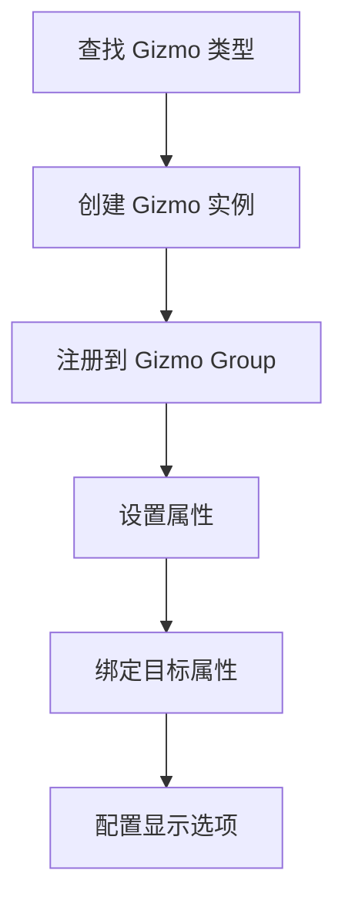
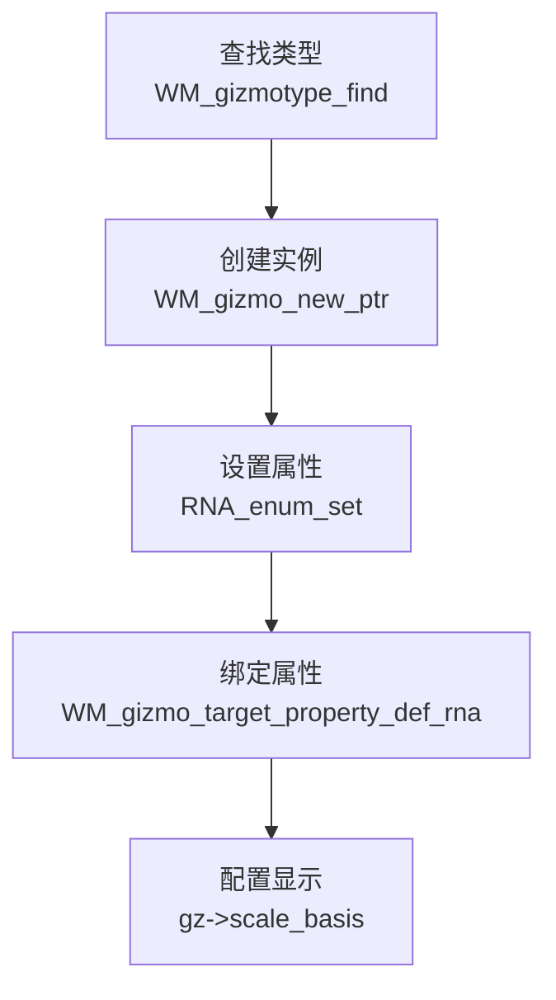

# 各类 Gizmo 的使用方法

## 1. 概述

<span style="color:#e74c3c">创建 Gizmo 的标准流程</span>包括以下步骤：



### <span style="color:#3498db">WM_gizmo_new vs WM_gizmo_new_ptr 的选择</span>

| 方法 | 使用场景 | 参数 |
|------|----------|------|
| `WM_gizmo_new` | 通过字符串查找类型 | `"GIZMO_GT_cage_2d"` |
| `WM_gizmo_new_ptr` | 已有类型指针 | `wmGizmoType *` |

**定义位置**: `source/blender/windowmanager/gizmo/WM_api.hh`

---

## 2. 通用初始化流程

### 2.1 基本步骤



### 2.2 标准初始化代码

**定义位置**: `source/blender/editors/gizmo_library/gizmo_library_utils.cc`

```cpp
// 1. 查找类型
const wmGizmoType *gzt = WM_gizmotype_find("GIZMO_GT_cage_2d", false);

// 2. 创建实例
wmGizmo *gz = WM_gizmo_new_ptr(gzt, gzgroup, nullptr);

// 3. 设置属性
RNA_enum_set(gz->ptr, "transform", flags);

// 4. 绑定属性
WM_gizmo_target_property_def_rna(gz, "matrix", &ptr, "property", -1);

// 5. 配置显示
gz->scale_basis = 1.0f;
```

---

## 3. <span style="color:#e67e22">Arrow 3D Gizmo</span> 使用

### 3.1 基础创建

**定义位置**: `source/blender/editors/space_view3d/view3d_gizmo_camera.cc:96-97`

```cpp
const wmGizmoType *gzt_arrow = WM_gizmotype_find("GIZMO_GT_arrow_3d", true);
wmGizmo *gz = cagzgroup->dop_dist = WM_gizmo_new_ptr(gzt_arrow, gzgroup, nullptr);
```

### 3.2 配置样式

**定义位置**: `source/blender/editors/space_view3d/view3d_gizmo_camera.cc:97-99`

```cpp
RNA_enum_set(gz->ptr, "draw_style", ED_GIZMO_ARROW_STYLE_CROSS);
RNA_enum_set(gz->ptr, "transform", ED_GIZMO_ARROW_XFORM_FLAG_CONSTRAINED);
```

可用样式：
- `ED_GIZMO_ARROW_STYLE_NORMAL` - 普通箭头
- `ED_GIZMO_ARROW_STYLE_CROSS` - 十字形
- `ED_GIZMO_ARROW_STYLE_BOX` - 盒子形
- `ED_GIZMO_ARROW_STYLE_CONE` - 圆锥形

### 3.3 设置方向

**定义位置**: `source/blender/editors/space_view3d/view3d_gizmo_camera.cc:91`

```cpp
float dir[3];
negate_v3_v3(dir, ob->object_to_world().ptr()[2]);
WM_gizmo_set_matrix_rotation_from_yz_axis(gz, ob->object_to_world().ptr()[1], dir);
```

### 3.4 配置范围

**定义位置**: `source/blender/editors/space_view3d/view3d_gizmo_camera.cc:239-245`

```cpp
ED_gizmo_arrow3d_set_range_fac(
    widget,
    is_ortho ?
        ((range / ca->ortho_scale) * ca->drawsize) :
        (scale_matrix * range / (0.5f * sensor_size)));
```

### 3.5 完整示例 - 相机距离箭头

```cpp
// 在 WIDGETGROUP_camera_setup 中
const wmGizmoType *gzt_arrow = WM_gizmotype_find("GIZMO_GT_arrow_3d", true);
CameraWidgetGroup *cagzgroup = MEM_callocN<CameraWidgetGroup>(__func__);

// 创建 DOF 距离箭头
wmGizmo *gz = cagzgroup->dop_dist = WM_gizmo_new_ptr(gzt_arrow, gzgroup, nullptr);
RNA_enum_set(gz->ptr, "draw_style", ED_GIZMO_ARROW_STYLE_CROSS);
WM_gizmo_set_flag(gz, WM_GIZMO_DRAW_HOVER | WM_GIZMO_DRAW_NO_SCALE, true);

blender::ui::theme::get_color_3fv(TH_GIZMO_A, gz->color);
blender::ui::theme::get_color_3fv(TH_GIZMO_HI, gz->color_hi);
```

---

## 4. <span style="color:#9b59b6">Button 2D Gizmo</span> 使用

### 4.1 基础创建

**定义位置**: `source/blender/editors/transform/transform_gizmo_2d.cc:213`

```cpp
const wmGizmoType *gzt_button = WM_gizmotype_find("GIZMO_GT_button_2d", true);
ggd->translate_xy[2] = WM_gizmo_new_ptr(gzt_button, gzgroup, nullptr);
```

### 4.2 设置图标

**定义位置**: `source/blender/editors/transform/transform_gizmo_2d.cc:501-502`

```cpp
PropertyRNA *prop = RNA_struct_find_property(gz->ptr, "icon");
RNA_property_enum_set(gz->ptr, prop, ICON_NONE);  // 或指定图标
```

### 4.3 配置显示选项

**定义位置**: `source/blender/editors/transform/transform_gizmo_2d.cc:504`

```cpp
RNA_enum_set(gz->ptr, "draw_options", ED_GIZMO_BUTTON_SHOW_BACKDROP);
```

可用选项：
- `ED_GIZMO_BUTTON_SHOW_OUTLINE` - 显示轮廓
- `ED_GIZMO_BUTTON_SHOW_BACKDROP` - 显示背景
- `ED_GIZMO_BUTTON_SHOW_HEADING` - 显示标题

### 4.4 设置位置和缩放

**定义位置**: `source/blender/editors/transform/transform_gizmo_2d.cc:511`

```cpp
WM_gizmo_set_scale(gz, 0.2f);
```

### 4.5 完整示例 - 2D 变换中心按钮

```cpp
// 在 gizmogroup2d_init 中
const wmGizmoType *gzt_button = WM_gizmotype_find("GIZMO_GT_button_2d", true);
GizmoGroup2D *ggd = MEM_callocN<GizmoGroup2D>(__func__);

ggd->translate_xy[2] = WM_gizmo_new_ptr(gzt_button, gzgroup, nullptr);

// 配置按钮样式
float color[4], color_hi[4];
ui::theme::get_color_4fv(TH_GIZMO_VIEW_ALIGN, color);
copy_v4_v4(color_hi, color);
color[3] *= 0.6f;

PropertyRNA *prop = RNA_struct_find_property(gz->ptr, "icon");
RNA_property_enum_set(gz->ptr, prop, ICON_NONE);

RNA_enum_set(gz->ptr, "draw_options", ED_GIZMO_BUTTON_SHOW_BACKDROP);
RNA_float_set(gz->ptr, "backdrop_fill_alpha", 0.0);

WM_gizmo_set_line_width(gz, 2.0f);
WM_gizmo_set_color(gz, color);
WM_gizmo_set_color_highlight(gz, color_hi);

WM_gizmo_set_scale(gz, 0.2f);
```

---

## 5. <span style="color:#27ae60">Cage 2D Gizmo</span> 使用

### 5.1 基础创建

**定义位置**: `source/blender/editors/space_node/node_gizmo.cc:154`

```cpp
wmGizmoWrapper *wwrapper = MEM_mallocN<wmGizmoWrapper>(__func__);
wwrapper->gizmo = WM_gizmo_new("GIZMO_GT_cage_2d", gzgroup, nullptr);
```

### 5.2 配置变换模式

**定义位置**: `source/blender/editors/space_node/node_gizmo.cc:156-158`

```cpp
RNA_enum_set(wwrapper->gizmo->ptr,
             "transform",
             ED_GIZMO_CAGE_XFORM_FLAG_TRANSLATE | ED_GIZMO_CAGE_XFORM_FLAG_SCALE_UNIFORM);
```

可用标志：
- `ED_GIZMO_CAGE_XFORM_FLAG_TRANSLATE` - 允许平移
- `ED_GIZMO_CAGE_XFORM_FLAG_SCALE` - 允许缩放
- `ED_GIZMO_CAGE_XFORM_FLAG_SCALE_UNIFORM` - 均匀缩放
- `ED_GIZMO_CAGE_XFORM_FLAG_ROTATE` - 允许旋转

### 5.3 设置绘制样式

**定义位置**: `source/blender/editors/space_node/node_gizmo.cc:708`

```cpp
RNA_enum_set(mask_group->border->ptr, "draw_style", ED_GIZMO_CAGE2D_STYLE_CIRCLE);
```

可用样式：
- `ED_GIZMO_CAGE2D_STYLE_BOX` - 矩形
- `ED_GIZMO_CAGE2D_STYLE_CIRCLE` - 圆形

### 5.4 设置尺寸

**定义位置**: `source/blender/editors/space_node/node_gizmo.cc:183`

```cpp
const float2 dims = node_gizmo_safe_calc_dims(ibuf, GIZMO_NODE_DEFAULT_DIMS);
RNA_float_set_array(cage->ptr, "dimensions", dims);
```

### 5.5 配置绘制选项

**定义位置**: `source/blender/editors/space_node/node_gizmo.cc:594-597`

```cpp
RNA_enum_set(mask_group->border->ptr,
             "draw_options",
             ED_GIZMO_CAGE_DRAW_FLAG_XFORM_CENTER_HANDLE |
                 ED_GIZMO_CAGE_DRAW_FLAG_CORNER_HANDLES);
```

可用选项：
- `ED_GIZMO_CAGE_DRAW_FLAG_XFORM_CENTER_HANDLE` - 显示中心手柄
- `ED_GIZMO_CAGE_DRAW_FLAG_CORNER_HANDLES` - 显示角点手柄
- `ED_GIZMO_CAGE_DRAW_FLAG_NOP` - 不显示额外元素

### 5.6 完整示例 - 裁剪节点矩形

**定义位置**: `source/blender/editors/space_node/node_gizmo.cc:388-401`

```cpp
static void WIDGETGROUP_node_crop_setup(const bContext * /*C*/, wmGizmoGroup *gzgroup)
{
  NodeBBoxWidgetGroup *crop_group = MEM_new<NodeBBoxWidgetGroup>(__func__);
  crop_group->border = WM_gizmo_new("GIZMO_GT_cage_2d", gzgroup, nullptr);

  RNA_enum_set(crop_group->border->ptr,
               "transform",
               ED_GIZMO_CAGE_XFORM_FLAG_TRANSLATE | ED_GIZMO_CAGE_XFORM_FLAG_SCALE);

  gzgroup->customdata = crop_group;
  gzgroup->customdata_free = [](void *customdata) {
    MEM_delete(static_cast<NodeBBoxWidgetGroup *>(customdata));
  };
}
```

---

## 6. <span style="color:#e74c3c">Dial 3D Gizmo</span> 使用

### 6.1 基础创建

**定义位置**: `source/blender/editors/mesh/editmesh_extrude_spin_gizmo.cc:139`

```cpp
for (int i = 0; i < ARRAY_SIZE(ggd->gizmos.xyz_view); i++) {
  wmGizmo *gz = WM_gizmo_new_ptr(gzt_dial, gzgroup, nullptr);
  blender::ui::theme::get_color_3fv(TH_GIZMO_PRIMARY, gz->color);
  WM_gizmo_set_flag(gz, WM_GIZMO_DRAW_VALUE | WM_GIZMO_HIDDEN_SELECT, true);
  ggd->gizmos.xyz_view[i] = gz;
}
```

### 6.2 设置旋转轴

**定义位置**: `source/blender/editors/mesh/editmesh_extrude_spin_gizmo.cc:196-200`

```cpp
WM_gizmo_set_matrix_rotation_from_yz_axis(gz, axis_tan, axis_vec);
// 或
WM_gizmo_set_matrix_rotation_from_z_axis(gz, axis_vec);
```

### 6.3 配置角度范围

**定义位置**: `source/blender/editors/mesh/editmesh_extrude_spin_gizmo.cc:158-160`

```cpp
RNA_float_set(gz->ptr,
              "arc_partial_angle",
              (M_PI * 2) - (dial_angle_partial * dial_angle_partial_margin));
```

### 6.4 配置绘制选项

**定义位置**: `source/blender/editors/mesh/editmesh_extrude_spin_gizmo.cc:148`

```cpp
RNA_enum_set(gz->ptr, "draw_options", ED_GIZMO_DIAL_DRAW_FLAG_CLIP);
```

可用选项：
- `ED_GIZMO_DIAL_DRAW_FLAG_FILL` - 填充
- `ED_GIZMO_DIAL_DRAW_FLAG_ANGLE_VALUE` - 显示角度值
- `ED_GIZMO_DIAL_DRAW_FLAG_CLIP` - 裁剪

### 6.5 完整示例 - 网格挤出旋转

```cpp
// 在 gizmogroup2d_init 中
const wmGizmoType *gzt_dial = WM_gizmotype_find("GIZMO_GT_dial_3d", true);

// 创建多个旋转盘
for (int i = 0; i < 4; i++) {
  wmGizmo *gz = WM_gizmo_new_ptr(gzt_dial, gzgroup, nullptr);
  blender::ui::theme::get_color_3fv(TH_GIZMO_PRIMARY, gz->color);
  WM_gizmo_set_flag(gz, WM_GIZMO_DRAW_VALUE | WM_GIZMO_HIDDEN_SELECT, true);
  ggd->gizmos.xyz_view[i] = gz;
}

// 配置颜色和缩放
for (int i = 0; i < 3; i++) {
  wmGizmo *gz = ggd->gizmos.xyz_view[i];
  WM_gizmo_set_line_width(gz, 2.0f);
  float color[4];
  blender::ui::theme::get_color_3fv(TH_AXIS_X + i, color);
  color[3] = alpha;
  WM_gizmo_set_color(gz, color);
  color[3] = alpha_hi;
  WM_gizmo_set_color_highlight(gz, color_hi);
  WM_gizmo_set_scale(gz, INIT_SCALE_BASE);
}
```

---

## 7. <span style="color:#16a085">Move 3D Gizmo</span> 使用

### 7.1 基础创建

**定义位置**: `source/blender/editors/space_node/node_gizmo.cc:784`

```cpp
glare_group->gizmo = WM_gizmo_new("GIZMO_GT_move_3d", gzgroup, nullptr);
```

### 7.2 设置绘制样式

**定义位置**: `source/blender/editors/space_node/node_gizmo.cc:787`

```cpp
RNA_enum_set(gz->ptr, "draw_style", ED_GIZMO_MOVE_STYLE_CROSS_2D);
```

可用样式：
- `ED_GIZMO_MOVE_STYLE_RING_2D` - 2D 环形
- `ED_GIZMO_MOVE_STYLE_CROSS_2D` - 2D 十字
- `ED_GIZMO_MOVE_STYLE_RING_3D` - 3D 环形
- `ED_GIZMO_MOVE_STYLE_VECTOR` - 向量箭头
- `ED_GIZMO_MOVE_STYLE_NORMAL` - 法线

### 7.3 设置缩放

**定义位置**: `source/blender/editors/space_node/node_gizmo.cc:789`

```cpp
gz->scale_basis = 0.05f / 75.0f;
```

### 7.4 完整示例 - Glare 节点位置

**定义位置**: `source/blender/editors/space_node/node_gizmo.cc:780-792`

```cpp
static void WIDGETGROUP_node_glare_setup(const bContext * /*C*/, wmGizmoGroup *gzgroup)
{
  NodeGlareWidgetGroup *glare_group = MEM_mallocN<NodeGlareWidgetGroup>(__func__);

  glare_group->gizmo = WM_gizmo_new("GIZMO_GT_move_3d", gzgroup, nullptr);
  wmGizmo *gz = glare_group->gizmo;

  RNA_enum_set(gz->ptr, "draw_style", ED_GIZMO_MOVE_STYLE_CROSS_2D);

  gz->scale_basis = 0.05f / 75.0f;

  gzgroup->customdata = glare_group;
}
```

### 7.5 完整示例 - 角钉节点四个点

**定义位置**: `source/blender/editors/space_node/node_gizmo.cc:884-899`

```cpp
static void WIDGETGROUP_node_corner_pin_setup(const bContext * /*C*/, wmGizmoGroup *gzgroup)
{
  NodeCornerPinWidgetGroup *cpin_group = MEM_mallocN<NodeCornerPinWidgetGroup>(__func__);
  const wmGizmoType *gzt_move_3d = WM_gizmotype_find("GIZMO_GT_move_3d", false);

  for (int i = 0; i < 4; i++) {
    cpin_group->gizmos[i] = WM_gizmo_new_ptr(gzt_move_3d, gzgroup, nullptr);
    wmGizmo *gz = cpin_group->gizmos[i];

    RNA_enum_set(gz->ptr, "draw_style", ED_GIZMO_MOVE_STYLE_CROSS_2D);

    gz->scale_basis = 0.05f / 75.0;
  }

  gzgroup->customdata = cpin_group;
}
```

---

## 8. <span style="color:#8e44ad">Primitive 3D Gizmo</span> 使用

### 8.1 基础创建

**定义位置**: `source/blender/editors/transform/transform_gizmo_3d.cc:1643`

```cpp
#define GIZMO_NEW_PRIM(v) \
  { \
    ggd->gizmos[v] = WM_gizmo_new_ptr(gzt_prim, gzgroup, nullptr); \
  } \
  ((void)0)

GIZMO_NEW_PRIM(MAN_AXIS_SCALE_C);
GIZMO_NEW_PRIM(MAN_AXIS_TRANS_C);
```

### 8.2 设置形状

**定义位置**: `source/blender/editors/transform/transform_gizmo_3d.cc`

```cpp
RNA_enum_set(gz->ptr, "prim_style", ED_GIZMO_PRIMITIVE_STYLE_PLANE);
```

可用样式：
- `ED_GIZMO_PRIMITIVE_STYLE_PLANE` - 平面
- `ED_GIZMO_PRIMITIVE_STYLE_SPHERE` - 球体
- `ED_GIZMO_PRIMITIVE_STYLE_CUBE` - 立方体
- `ED_GIZMO_PRIMITIVE_STYLE_CIRCLE` - 圆形

---

## 9. <span style="color:#c0392b">Snap 3D Gizmo</span> 使用

### 9.1 基础创建

**定义位置**: `source/blender/editors/space_view3d/view3d_gizmo_ruler.cc:1305-1307`

```cpp
const wmGizmoType *gzt_snap;
gzt_snap = WM_gizmotype_find("GIZMO_GT_snap_3d", true);
gizmo = WM_gizmo_new_ptr(gzt_snap, gzgroup, nullptr);
```

### 9.2 设置吸附标志

**定义位置**: `source/blender/editors/space_view3d/view3d_gizmo_ruler.cc:1309`

```cpp
ED_gizmotypes_snap_3d_flag_set(gizmo, V3D_SNAPCURSOR_SNAP_EDIT_GEOM_CAGE);
```

### 9.3 配置颜色

**定义位置**: `source/blender/editors/space_view3d/view3d_gizmo_ruler.cc:1310`

```cpp
WM_gizmo_set_color(gizmo, blender::float4(1.0f));
```

### 9.4 设置操作符

**定义位置**: `source/blender/editors/space_view3d/view3d_gizmo_ruler.cc:1312-1313`

```cpp
wmOperatorType *ot = WM_operatortype_find("VIEW3D_OT_ruler_add", true);
WM_gizmo_operator_set(gizmo, 0, ot, nullptr);
```

### 9.5 完整示例 - 标尺吸附

```cpp
// 在 WIDGETGROUP_ruler_setup 中
const wmGizmoType *gzt_snap;
gzt_snap = WM_gizmotype_find("GIZMO_GT_snap_3d", true);
gizmo = WM_gizmo_new_ptr(gzt_snap, gzgroup, nullptr);

ED_gizmotypes_snap_3d_flag_set(gizmo, V3D_SNAPCURSOR_SNAP_EDIT_GEOM_CAGE);
WM_gizmo_set_color(gizmo, blender::float4(1.0f));

wmOperatorType *ot = WM_operatortype_find("VIEW3D_OT_ruler_add", true);
WM_gizmo_operator_set(gizmo, 0, ot, nullptr);
```

---

## 10. 属性绑定方法

### 10.1 RNA 直接绑定

**定义位置**: `source/blender/editors/space_node/node_gizmo.cc:830-832`

```cpp
bNodeSocket *source_input = bke::node_find_socket(*node, SOCK_IN, "Sun Position");
PointerRNA socket_pointer = RNA_pointer_create_discrete(
    reinterpret_cast<ID *>(snode->edittree), &RNA_NodeSocket, source_input);
WM_gizmo_target_property_def_rna(gz, "offset", &socket_pointer, "default_value", -1);
```

### 10.2 自定义函数绑定

**定义位置**: `source/blender/editors/space_node/node_gizmo.cc:446-451`

```cpp
wmGizmoPropertyFnParams params{};
params.value_get_fn = gizmo_node_crop_prop_matrix_get;
params.value_set_fn = gizmo_node_crop_prop_matrix_set;
params.range_get_fn = nullptr;
params.user_data = node;
WM_gizmo_target_property_def_func(gz, "matrix", &params);
```

### 10.3 回调函数示例

**定义位置**: `source/blender/editors/space_node/node_gizmo.cc:310-328`

```cpp
static void gizmo_node_crop_prop_matrix_get(const wmGizmo *gz,
                                           wmGizmoProperty *gz_prop,
                                           void *value_p)
{
  float (*matrix)[4] = (float (*)[4])value_p;
  BLI_assert(gz_prop->type->array_length == 16);
  NodeBBoxWidgetGroup *crop_group = (NodeBBoxWidgetGroup *)gz->parent_gzgroup->customdata;
  const float2 dims = crop_group->state.dims;
  const float2 offset = crop_group->state.offset;
  const bNode *node = (const bNode *)gz_prop->custom_func.user_data;

  rctf rct;
  node_input_to_rect(node, dims, offset, &rct);

  matrix[0][0] = fabsf(BLI_rctf_size_x(&rct));
  matrix[1][1] = fabsf(BLI_rctf_size_y(&rct));
  matrix[3][0] = (BLI_rctf_cent_x(&rct) - 0.5f) * dims[0];
  matrix[3][1] = (BLI_rctf_cent_y(&rct) - 0.5f) * dims[1];
}

static void gizmo_node_crop_prop_matrix_set(const wmGizmo *gz,
                                           wmGizmoProperty *gz_prop,
                                           const void *value_p)
{
  const float (*matrix)[4] = (const float (*)[4])value_p;
  BLI_assert(gz_prop->type->array_length == 16);
  NodeBBoxWidgetGroup *crop_group = (NodeBBoxWidgetGroup *)gz->parent_gzgroup->customdata;
  const float2 dims = crop_group->state.dims;
  const float2 offset = crop_group->state.offset;
  bNode *node = (bNode *)gz_prop->custom_func.user_data;

  rctf rct;
  node_input_to_rect(node, dims, offset, &rct);
  BLI_rctf_resize(&rct, fabsf(matrix[0][0]), fabsf(matrix[1][1]));
  BLI_rctf_recenter(&rct, ((matrix[3][0]) / dims[0]) + 0.5f, ((matrix[3][1]) / dims[1]) + 0.5f);

  // 限制在图像范围内
  rctf rct_isect{};
  rct_isect.xmin = offset.x / dims.x;
  rct_isect.xmax = offset.x / dims.x + 1;
  rct_isect.ymin = offset.y;
  rct_isect.ymax = offset.y / dims.y + 1;
  BLI_rctf_isect(&rct_isect, &rct, &rct);

  node_input_from_rect(node, &rct, dims, offset);
  gizmo_node_bbox_update(crop_group);
}
```

---

## 11. 实际完整示例

### 示例 1：相机距离箭头

<span style="color:#3498db">完整流程：创建 → 配置样式 → 设置颜色 → 绑定属性</span>

**定义位置**: `source/blender/editors/space_view3d/view3d_gizmo_camera.cc:86-102`

```cpp
static void WIDGETGROUP_camera_setup(const bContext *C, wmGizmoGroup *gzgroup)
{
  const Scene *scene = CTX_data_scene(C);
  ViewLayer *view_layer = CTX_data_view_layer(C);
  BKE_view_layer_synced_ensure(scene, view_layer);
  Object *ob = BKE_view_layer_active_object_get(view_layer);
  float dir[3];

  const wmGizmoType *gzt_arrow = WM_gizmotype_find("GIZMO_GT_arrow_3d", true);

  CameraWidgetGroup *cagzgroup = MEM_callocN<CameraWidgetGroup>(__func__);
  gzgroup->customdata = cagzgroup;

  negate_v3_v3(dir, ob->object_to_world().ptr()[2]);

  /* dof distance */
  {
    wmGizmo *gz;
    gz = cagzgroup->dop_dist = WM_gizmo_new_ptr(gzt_arrow, gzgroup, nullptr);
    RNA_enum_set(gz->ptr, "draw_style", ED_GIZMO_ARROW_STYLE_CROSS);
    WM_gizmo_set_flag(gz, WM_GIZMO_DRAW_HOVER | WM_GIZMO_DRAW_NO_SCALE, true);

    blender::ui::theme::get_color_3fv(TH_GIZMO_A, gz->color);
    blender::ui::theme::get_color_3fv(TH_GIZMO_HI, gz->color_hi);
  }

  /* focal length */
  {
    wmGizmo *gz;
    gz = cagzgroup->focal_len = WM_gizmo_new_ptr(gzt_arrow, gzgroup, nullptr);
    gz->flag |= WM_GIZMO_DRAW_NO_SCALE;
    RNA_enum_set(gz->ptr, "draw_style", ED_GIZMO_ARROW_STYLE_CONE);
    RNA_enum_set(gz->ptr, "transform", ED_GIZMO_ARROW_XFORM_FLAG_CONSTRAINED);

    blender::ui::theme::get_color_3fv(TH_GIZMO_PRIMARY, gz->color);
    blender::ui::theme::get_color_3fv(TH_GIZMO_HI, gz->color_hi);

    gz = cagzgroup->ortho_scale = WM_gizmo_new_ptr(gzt_arrow, gzgroup, nullptr);
    gz->flag |= WM_GIZMO_DRAW_NO_SCALE;
    RNA_enum_set(gz->ptr, "draw_style", ED_GIZMO_ARROW_STYLE_CONE);
    RNA_enum_set(gz->ptr, "transform", ED_GIZMO_ARROW_XFORM_FLAG_CONSTRAINED);

    blender::ui::theme::get_color_3fv(TH_GIZMO_PRIMARY, gz->color);
    blender::ui::theme::get_color_3fv(TH_GIZMO_HI, gz->color_hi);
  }
}
```

---

### 示例 2：裁剪节点矩形

<span style="color:#27ae60">完整流程：创建 → 设置变换 → 自定义矩阵回调</span>

**定义位置**: `source/blender/editors/space_node/node_gizmo.cc:388-401`

```cpp
static void WIDGETGROUP_node_crop_setup(const bContext * /*C*/, wmGizmoGroup *gzgroup)
{
  NodeBBoxWidgetGroup *crop_group = MEM_new<NodeBBoxWidgetGroup>(__func__);
  crop_group->border = WM_gizmo_new("GIZMO_GT_cage_2d", gzgroup, nullptr);

  RNA_enum_set(crop_group->border->ptr,
               "transform",
               ED_GIZMO_CAGE_XFORM_FLAG_TRANSLATE | ED_GIZMO_CAGE_XFORM_FLAG_SCALE);

  gzgroup->customdata = crop_group;
  gzgroup->customdata_free = [](void *customdata) {
    MEM_delete(static_cast<NodeBBoxWidgetGroup *>(customdata));
  };
}

static void WIDGETGROUP_node_crop_refresh(const bContext *C, wmGizmoGroup *gzgroup)
{
  // ... 初始化代码 ...

  wmGizmoPropertyFnParams params{};
  params.value_get_fn = gizmo_node_crop_prop_matrix_get;
  params.value_set_fn = gizmo_node_crop_prop_matrix_set;
  params.range_get_fn = nullptr;
  params.user_data = node;
  WM_gizmo_target_property_def_func(gz, "matrix", &params);

  // ... 清理代码 ...
}
```

---

### 示例 3：角钉节点四个点

<span style="color:#16a085">完整流程：创建多个点 → 设置统一样式 → 分别绑定属性</span>

**定义位置**: `source/blender/editors/space_node/node_gizmo.cc:884-917`

```cpp
static void WIDGETGROUP_node_corner_pin_setup(const bContext * /*C*/, wmGizmoGroup *gzgroup)
{
  NodeCornerPinWidgetGroup *cpin_group = MEM_mallocN<NodeCornerPinWidgetGroup>(__func__);
  const wmGizmoType *gzt_move_3d = WM_gizmotype_find("GIZMO_GT_move_3d", false);

  for (int i = 0; i < 4; i++) {
    cpin_group->gizmos[i] = WM_gizmo_new_ptr(gzt_move_3d, gzgroup, nullptr);
    wmGizmo *gz = cpin_group->gizmos[i];

    RNA_enum_set(gz->ptr, "draw_style", ED_GIZMO_MOVE_STYLE_CROSS_2D);

    gz->scale_basis = 0.05f / 75.0;
  }

  gzgroup->customdata = cpin_group;
}

static void WIDGETGROUP_node_corner_pin_refresh(const bContext *C, wmGizmoGroup *gzgroup)
{
  // ... 初始化代码 ...

  SpaceNode *snode = CTX_wm_space_node(C);
  bNode *node = bke::node_get_active(*snode->edittree);

  int i = 0;
  for (bNodeSocket *sock = (bNodeSocket *)node->inputs.first; sock && i < 4; sock = sock->next) {
    if (sock->type == SOCK_VECTOR) {
      wmGizmo *gz = cpin_group->gizmos[i++];

      PointerRNA sockptr = RNA_pointer_create_discrete(
          (ID *)snode->edittree, &RNA_NodeSocket, sock);
      WM_gizmo_target_property_def_rna(gz, "offset", &sockptr, "default_value", -1);

      WM_gizmo_set_flag(gz, WM_GIZMO_DRAW_MODAL, true);
    }
  }

  // ... 清理代码 ...
}
```

---

## 12. 注意事项

### 12.1 创建 Gizmo 时的注意事项

<span style="color:#e74c3c">⚠️ 重要提示</span>

1. <span style="color:#e67e22">内存管理</span>：使用 `MEM_new` 或 `MEM_callocN` 创建的自定义数据结构需要设置 `customdata_free` 回调
2. <span style="color:#e67e22">属性绑定</span>：RNA 属性绑定要在 `refresh` 函数中进行，以确保属性指针有效
3. <span style="color:#e67e22">标志设置</span>：使用 `WM_GIZMO_DRAW_MODAL` 标记操作模式下的 Gizmo
4. <span style="color:#e67e22">矩阵计算</span>：在 `draw_prepare` 中更新矩阵，确保变换正确

### 12.2 常用 API 参考

| API | 描述 | 定义位置 |
|-----|------|---------|
| `WM_gizmotype_find` | 查找 Gizmo 类型 | `source/blender/windowmanager/gizmo/WM_api.hh` |
| `WM_gizmo_new_ptr` | 创建 Gizmo 实例 | `source/blender/windowmanager/gizmo/WM_api.hh` |
| `WM_gizmo_new` | 通过字符串创建 Gizmo | `source/blender/windowmanager/gizmo/WM_api.hh` |
| `WM_gizmo_target_property_def_rna` | 绑定 RNA 属性 | `source/blender/windowmanager/gizmo/WM_api.hh` |
| `WM_gizmo_target_property_def_func` | 绑定自定义函数 | `source/blender/windowmanager/gizmo/WM_api.hh` |
| `WM_gizmo_set_matrix_location` | 设置位置 | `source/blender/windowmanager/gizmo/WM_api.hh` |
| `WM_gizmo_set_scale` | 设置缩放 | `source/blender/windowmanager/gizmo/WM_api.hh` |
| `WM_gizmo_set_color` | 设置颜色 | `source/blender/windowmanager/gizmo/WM_api.hh` |
| `WM_gizmo_set_flag` | 设置标志 | `source/blender/windowmanager/gizmo/WM_api.hh` |

---

## 附录：常用常量和标志

### Gizmo 类型常量

```cpp
// Arrow 样式
ED_GIZMO_ARROW_STYLE_NORMAL
ED_GIZMO_ARROW_STYLE_CROSS
ED_GIZMO_ARROW_STYLE_BOX
ED_GIZMO_ARROW_STYLE_CONE

// Arrow 变换标志
ED_GIZMO_ARROW_XFORM_FLAG_CONSTRAINED

// Cage 变换标志
ED_GIZMO_CAGE_XFORM_FLAG_TRANSLATE
ED_GIZMO_CAGE_XFORM_FLAG_SCALE
ED_GIZMO_CAGE_XFORM_FLAG_SCALE_UNIFORM
ED_GIZMO_CAGE_XFORM_FLAG_ROTATE

// Cage 绘制样式
ED_GIZMO_CAGE2D_STYLE_BOX
ED_GIZMO_CAGE2D_STYLE_CIRCLE

// Cage 绘制选项
ED_GIZMO_CAGE_DRAW_FLAG_XFORM_CENTER_HANDLE
ED_GIZMO_CAGE_DRAW_FLAG_CORNER_HANDLES
ED_GIZMO_CAGE_DRAW_FLAG_NOP

// Dial 绘制选项
ED_GIZMO_DIAL_DRAW_FLAG_FILL
ED_GIZMO_DIAL_DRAW_FLAG_ANGLE_VALUE
ED_GIZMO_DIAL_DRAW_FLAG_CLIP

// Move 绘制样式
ED_GIZMO_MOVE_STYLE_RING_2D
ED_GIZMO_MOVE_STYLE_CROSS_2D
ED_GIZMO_MOVE_STYLE_RING_3D
ED_GIZMO_MOVE_STYLE_VECTOR
ED_GIZMO_MOVE_STYLE_NORMAL

// Primitive 样式
ED_GIZMO_PRIMITIVE_STYLE_PLANE
ED_GIZMO_PRIMITIVE_STYLE_SPHERE
ED_GIZMO_PRIMITIVE_STYLE_CUBE
ED_GIZMO_PRIMITIVE_STYLE_CIRCLE

// Button 绘制选项
ED_GIZMO_BUTTON_SHOW_OUTLINE
ED_GIZMO_BUTTON_SHOW_BACKDROP
ED_GIZMO_BUTTON_SHOW_HEADING
```

### Gizmo 标志

```cpp
// 绘制标志
WM_GIZMO_DRAW_MODAL
WM_GIZMO_DRAW_HOVER
WM_GIZMO_DRAW_NO_SCALE
WM_GIZMO_DRAW_VALUE
WM_GIZMO_HIDDEN_SELECT
WM_GIZMO_DRAW_OFFSET_SCALE

// 通用标志
WM_GIZMO_HIDDEN
WM_GIZMO_NEEDS_UNDO
```
