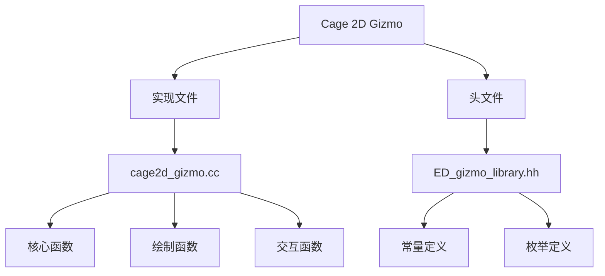
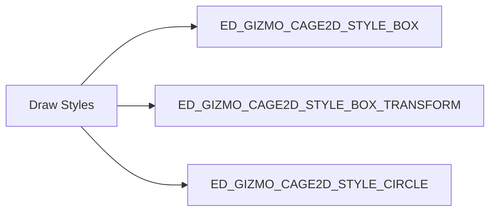
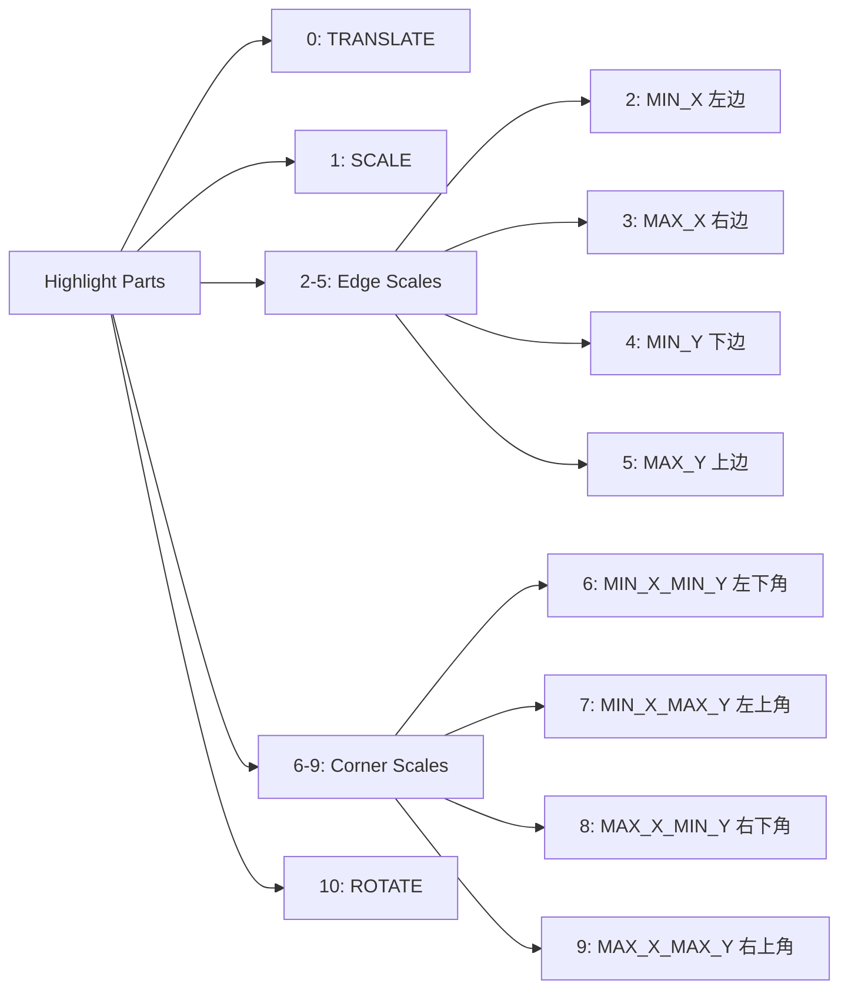
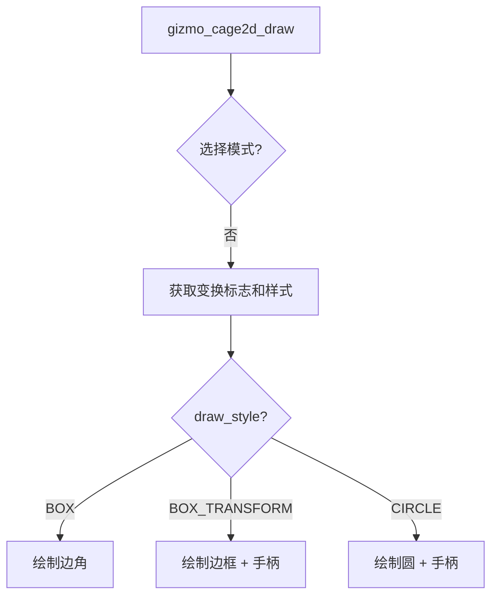
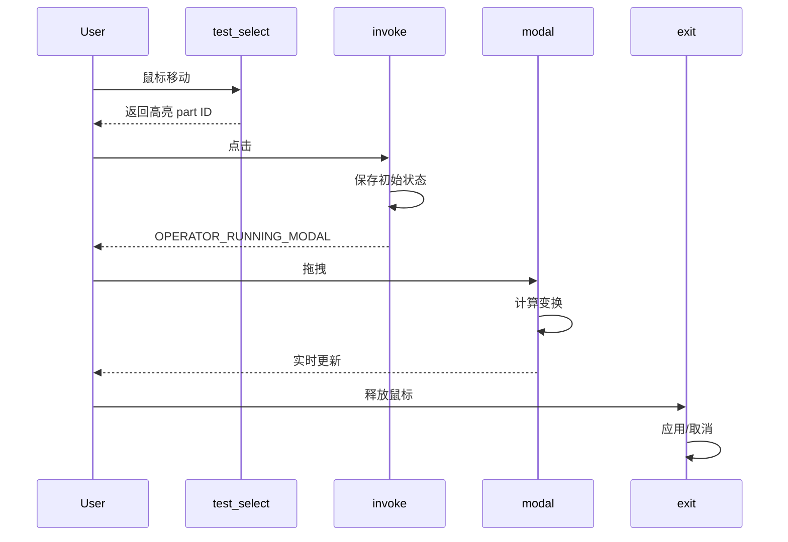
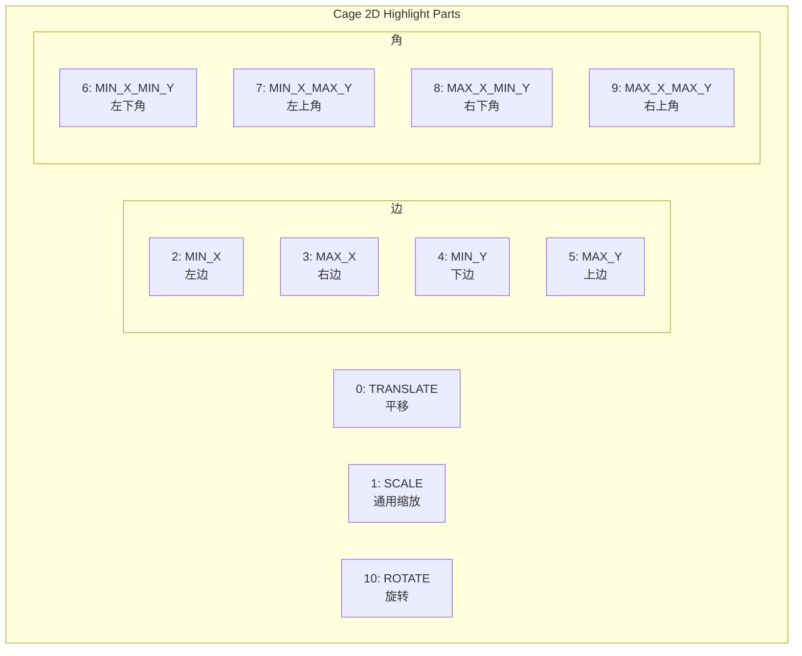

# Cage 2D Gizmo 完全指南

- [Cage 2D Gizmo 完全指南](#cage-2d-gizmo-完全指南)
  - [1. 概述](#1-概述)
    - [主要功能](#主要功能)
    - [主要用途场景](#主要用途场景)
  - [2. 文件结构](#2-文件结构)
    - [主要实现文件](#主要实现文件)
  - [3. 核心数据结构](#3-核心数据结构)
    - [RectTransformInteraction](#recttransforminteraction)
      - [字段说明](#字段说明)
  - [4. Transform Flags 详解](#4-transform-flags-详解)
    - [ED\_GIZMO\_CAGE\_XFORM\_FLAG\_TRANSLATE (1 \<\< 0)](#ed_gizmo_cage_xform_flag_translate-1--0)
    - [ED\_GIZMO\_CAGE\_XFORM\_FLAG\_ROTATE (1 \<\< 1)](#ed_gizmo_cage_xform_flag_rotate-1--1)
    - [ED\_GIZMO\_CAGE\_XFORM\_FLAG\_SCALE (1 \<\< 2)](#ed_gizmo_cage_xform_flag_scale-1--2)
    - [ED\_GIZMO\_CAGE\_XFORM\_FLAG\_SCALE\_UNIFORM (1 \<\< 3)](#ed_gizmo_cage_xform_flag_scale_uniform-1--3)
    - [ED\_GIZMO\_CAGE\_XFORM\_FLAG\_SCALE\_SIGNED (1 \<\< 4)](#ed_gizmo_cage_xform_flag_scale_signed-1--4)
  - [5. Draw Styles 详解](#5-draw-styles-详解)
    - [ED\_GIZMO\_CAGE2D\_STYLE\_BOX (0)](#ed_gizmo_cage2d_style_box-0)
    - [ED\_GIZMO\_CAGE2D\_STYLE\_BOX\_TRANSFORM](#ed_gizmo_cage2d_style_box_transform)
    - [ED\_GIZMO\_CAGE2D\_STYLE\_CIRCLE](#ed_gizmo_cage2d_style_circle)
  - [6. Draw Options 详解](#6-draw-options-详解)
    - [ED\_GIZMO\_CAGE\_DRAW\_FLAG\_XFORM\_CENTER\_HANDLE (1 \<\< 0)](#ed_gizmo_cage_draw_flag_xform_center_handle-1--0)
    - [ED\_GIZMO\_CAGE\_DRAW\_FLAG\_CORNER\_HANDLES (1 \<\< 1)](#ed_gizmo_cage_draw_flag_corner_handles-1--1)
  - [7. Highlight Parts 详解](#7-highlight-parts-详解)
  - [8. 核心函数详解](#8-核心函数详解)
    - [8.1 GIZMO\_GT\_cage\_2d](#81-gizmo_gt_cage_2d)
    - [8.2 gizmo\_cage2d\_setup](#82-gizmo_cage2d_setup)
    - [8.3 gizmo\_cage2d\_draw](#83-gizmo_cage2d_draw)
    - [8.4 gizmo\_cage2d\_draw\_select](#84-gizmo_cage2d_draw_select)
    - [8.5 gizmo\_cage2d\_test\_select](#85-gizmo_cage2d_test_select)
    - [8.6 gizmo\_cage2d\_get\_cursor](#86-gizmo_cage2d_get_cursor)
    - [8.7 gizmo\_cage2d\_invoke](#87-gizmo_cage2d_invoke)
    - [8.8 gizmo\_cage2d\_modal](#88-gizmo_cage2d_modal)
    - [8.9 gizmo\_cage2d\_exit](#89-gizmo_cage2d_exit)
  - [9. 交互流程详解](#9-交互流程详解)
    - [9.1 用户点击流程](#91-用户点击流程)
    - [9.2 不同 part 的行为](#92-不同-part-的行为)
  - [10. 等比缩放实现](#10-等比缩放实现)
    - [10.1 Shift 键检测](#101-shift-键检测)
    - [10.2 等比缩放计算](#102-等比缩放计算)
  - [11. 实际使用示例](#11-实际使用示例)
    - [示例1：Crop 节点](#示例1crop-节点)
    - [示例2：Box Mask 节点](#示例2box-mask-节点)
    - [示例3：Ellipse Mask 节点](#示例3ellipse-mask-节点)
    - [示例4：Viewer Backdrop](#示例4viewer-backdrop)
    - [示例5：Empty Object Gizmo](#示例5empty-object-gizmo)
  - [12. 与 Cage 3D 的对比](#12-与-cage-3d-的对比)
  - [13. 常见配置模式](#13-常见配置模式)
    - [模式1：简单矩形裁剪](#模式1简单矩形裁剪)
    - [模式2：完整2D变换](#模式2完整2d变换)
    - [模式3：等比缩放背景](#模式3等比缩放背景)
    - [模式4：圆形遮罩](#模式4圆形遮罩)
  - [附录：完整的 Part ID 映射表](#附录完整的-part-id-映射表)
  - [参考资源](#参考资源)


## 1. 概述

Cage 2D Gizmo 是 Blender 中用于 <span style="color:#2ECC71">二维矩形或圆形变换</span> 的强大工具。它围绕内容显示一个"笼子"（cage），允许用户通过交互进行<span style="color:#3498DB">缩放</span>和<span style="color:#E74C3C">平移</span>操作。

### 主要功能
- **矩形变换**：通过边界框对2D形状进行变换
- **圆形变换**：通过边界圆对圆形遮罩进行变换
- **多手柄控制**：支持角点、边、中心和旋转手柄
- **等比缩放**：可通过 Shift 键临时启用等比缩放

### 主要用途场景
- Compositor 节点中的 Crop、Box Mask、Ellipse Mask 操作
- Viewer Backdrop 的背景变换
- 3D 视图中 Empty 对象的图像变换

---

## 2. 文件结构



### 主要实现文件
- **实现文件**：`source/blender/editors/gizmo_library/gizmo_types/cage2d_gizmo.cc` (1475行)
- **头文件**：`source/blender/editors/include/ED_gizmo_library.hh` (常量和枚举定义)

---

## 3. 核心数据结构

### RectTransformInteraction

**定义位置**：`cage2d_gizmo.cc:1056-1062`

```cpp
struct RectTransformInteraction {
    float orig_mouse[2];
    float orig_matrix_offset[4][4];
    float orig_matrix_final_no_offset[4][4];
    Dial *dial;
    bool use_temp_uniform;
};
```

#### 字段说明

| 字段 | 类型 | 说明 |
|------|------|------|
| `orig_mouse[2]` | `float[2]` | <span style="color:#3498DB">交互开始时的鼠标位置</span>（本地坐标系） |
| `orig_matrix_offset[4][4]` | `float[4][4]` | <span style="color:#E74C3C">原始偏移矩阵</span>，用于取消时恢复 |
| `orig_matrix_final_no_offset[4][4]` | `float[4][4]` | <span style="color:#9B59B6">无偏移的最终矩阵</span>，用于坐标转换 |
| `dial` | `Dial*` | <span style="color:#F39C12">旋转交互的拨号盘对象</span>，用于计算旋转角度 |
| `use_temp_uniform` | `bool` | <span style="color:#2ECC71">临时等比缩放标志</span>，Shift 键按下时为 true |

---

## 4. Transform Flags 详解

**定义位置**：`ED_gizmo_library.hh:93-99`

```cpp
enum {
  ED_GIZMO_CAGE_XFORM_FLAG_TRANSLATE = (1 << 0),
  ED_GIZMO_CAGE_XFORM_FLAG_ROTATE = (1 << 1),
  ED_GIZMO_CAGE_XFORM_FLAG_SCALE = (1 << 2),
  ED_GIZMO_CAGE_XFORM_FLAG_SCALE_UNIFORM = (1 << 3),
  ED_GIZMO_CAGE_XFORM_FLAG_SCALE_SIGNED = (1 << 4),
};
```

### ED_GIZMO_CAGE_XFORM_FLAG_TRANSLATE (1 << 0)

**作用**：启用<span style="color:#3498DB">平移功能</span>

**使用示例**：
```cpp
// node_gizmo.cc:393-395
RNA_enum_set(gz->ptr, "transform",
    ED_GIZMO_CAGE_XFORM_FLAG_TRANSLATE |
    ED_GIZMO_CAGE_XFORM_FLAG_SCALE);
```

### ED_GIZMO_CAGE_XFORM_FLAG_ROTATE (1 << 1)

**作用**：启用<span style="color:#E74C3C">旋转功能</span>，显示旋转手柄

**使用示例**：
```cpp
// node_gizmo.cc:589-592
RNA_enum_set(mask_group->border->ptr, "transform",
    ED_GIZMO_CAGE_XFORM_FLAG_TRANSLATE |
    ED_GIZMO_CAGE_XFORM_FLAG_ROTATE |
    ED_GIZMO_CAGE_XFORM_FLAG_SCALE);
```

### ED_GIZMO_CAGE_XFORM_FLAG_SCALE (1 << 2)

**作用**：启用<span style="color:#9B59B6">自由缩放功能</span>

**使用示例**：
```cpp
// view3d_gizmo_empty.cc:131
RNA_enum_set(gz->ptr, "transform", ED_GIZMO_CAGE_XFORM_FLAG_SCALE);
```

### ED_GIZMO_CAGE_XFORM_FLAG_SCALE_UNIFORM (1 << 3)

**作用**：启用<span style="color:#F39C12">等比缩放</span>（保持宽高比）

**使用示例**：
```cpp
// node_gizmo.cc:156-158
RNA_enum_set(wwrapper->gizmo->ptr, "transform",
    ED_GIZMO_CAGE_XFORM_FLAG_TRANSLATE |
    ED_GIZMO_CAGE_XFORM_FLAG_SCALE_UNIFORM);
```

### ED_GIZMO_CAGE_XFORM_FLAG_SCALE_SIGNED (1 << 4)

**作用**：允许<span style="color:#2ECC71">负向缩放</span>（翻转/镜像）

**实现位置**：`cage2d_gizmo.cc:1305-1310`
```cpp
if ((transform_flag & ED_GIZMO_CAGE_XFORM_FLAG_SCALE_SIGNED) == 0) {
    if (signum_i(delta_orig) != signum_i(delta_curr)) {
        size_new[i] = 0.0f;
        continue;
    }
}
```

---

## 5. Draw Styles 详解

**定义位置**：`ED_gizmo_library.hh:102-112`



### ED_GIZMO_CAGE2D_STYLE_BOX (0)

**描述**：显示底层边界框的<span style="color:#3498DB">悬停区域</span>

**使用场景**：用于3D视图中，需要简洁的边界框显示

**实现位置**：`cage2d_gizmo.cc:786-822`

### ED_GIZMO_CAGE2D_STYLE_BOX_TRANSFORM

**描述**：显示<span style="color:#E74C3C">边界框 + 悬停时显示四个角的点</span>

**使用场景**：用于2D形状的变换，提供完整的控制点

**实现位置**：`cage2d_gizmo.cc:831-850`
```cpp
// 绘制边框
cage2d_draw_rect_wire(&r, margin, color, transform_flag, draw_options, line_width);

// 绘制边手柄
cage2d_draw_rect_edge_handles(&r, gz->highlight_part, size_real, margin, color, true);

// 悬停时绘制角手柄
if (is_corner_highlighted(gz->highlight_part)) {
    cage2d_draw_rect_corner_handles(&r, margin, color, true);
}
```

### ED_GIZMO_CAGE2D_STYLE_CIRCLE

**描述**：显示<span style="color:#9B59B6">悬停时的边界圆</span>

**使用场景**：用于圆形遮罩（Ellipse Mask）

**使用示例**：
```cpp
// node_gizmo.cc:708
RNA_enum_set(mask_group->border->ptr, "draw_style", ED_GIZMO_CAGE2D_STYLE_CIRCLE);
```

**实现位置**：`cage2d_gizmo.cc:851-872`

---

## 6. Draw Options 详解

**定义位置**：`ED_gizmo_library.hh:120-127`

```cpp
enum {
  ED_GIZMO_CAGE_DRAW_FLAG_NOP = 0,
  ED_GIZMO_CAGE_DRAW_FLAG_XFORM_CENTER_HANDLE = (1 << 0),
  ED_GIZMO_CAGE_DRAW_FLAG_CORNER_HANDLES = (1 << 1),
};
```

### ED_GIZMO_CAGE_DRAW_FLAG_XFORM_CENTER_HANDLE (1 << 0)

**作用**：绘制<span style="color:#3498DB">中心手柄</span>

**为什么需要**：
- 避免大矩形<span style="color:#E74C3C">吞噬所有事件</span>
- 当矩形很大时，只允许通过中心手柄进行平移

**使用示例**：
```cpp
// node_gizmo.cc:594-597
RNA_enum_set(mask_group->border->ptr, "draw_options",
    ED_GIZMO_CAGE_DRAW_FLAG_XFORM_CENTER_HANDLE |
    ED_GIZMO_CAGE_DRAW_FLAG_CORNER_HANDLES);
```

**实现位置**：`cage2d_gizmo.cc:532-543`

### ED_GIZMO_CAGE_DRAW_FLAG_CORNER_HANDLES (1 << 1)

**作用**：绘制<span style="color:#F39C12">角点手柄</span>

**使用场景**：在 BOX_TRANSFORM 和 CIRCLE 样式下显示额外的角点控制

**实现位置**：`cage2d_gizmo.cc:639-660`

---

## 7. Highlight Parts 详解

**定义位置**：`ED_gizmo_library.hh:130-146`



| 常量名 | 值 | 说明 |
|--------|-----|------|
| <span style="color:#3498DB">ED_GIZMO_CAGE2D_PART_TRANSLATE</span> | 0 | 平移整个矩形 |
| <span style="color:#9B59B6">ED_GIZMO_CAGE2D_PART_SCALE</span> | 1 | 通用缩放（未使用） |
| <span style="color:#E74C3C">ED_GIZMO_CAGE2D_PART_SCALE_MIN_X</span> | 2 | 左边缩放 |
| <span style="color:#E74C3C">ED_GIZMO_CAGE2D_PART_SCALE_MAX_X</span> | 3 | 右边缩放 |
| <span style="color:#E74C3C">ED_GIZMO_CAGE2D_PART_SCALE_MIN_Y</span> | 4 | 下边缩放 |
| <span style="color:#E74C3C">ED_GIZMO_CAGE2D_PART_SCALE_MAX_Y</span> | 5 | 上边缩放 |
| <span style="color:#F39C12">ED_GIZMO_CAGE2D_PART_SCALE_MIN_X_MIN_Y</span> | 6 | 左下角缩放 |
| <span style="color:#F39C12">ED_GIZMO_CAGE2D_PART_SCALE_MIN_X_MAX_Y</span> | 7 | 左上角缩放 |
| <span style="color:#F39C12">ED_GIZMO_CAGE2D_PART_SCALE_MAX_X_MIN_Y</span> | 8 | 右下角缩放 |
| <span style="color:#F39C12">ED_GIZMO_CAGE2D_PART_SCALE_MAX_X_MAX_Y</span> | 9 | 右上角缩放 |
| <span style="color:#2ECC71">ED_GIZMO_CAGE2D_PART_ROTATE</span> | 10 | 旋转 |

---

## 8. 核心函数详解

### 8.1 GIZMO_GT_cage_2d

**定义位置**：`cage2d_gizmo.cc:1412-1427`

```cpp
static void GIZMO_GT_cage_2d(wmGizmoType *gzt)
{
  /* identifiers */
  gzt->idname = "GIZMO_GT_cage_2d";

  /* API callbacks. */
  gzt->draw = gizmo_cage2d_draw;
  gzt->draw_select = gizmo_cage2d_draw_select;
  gzt->test_select = gizmo_cage2d_test_select;
  gzt->setup = gizmo_cage2d_setup;
  gzt->invoke = gizmo_cage2d_invoke;
  gzt->property_update = gizmo_cage2d_property_update;
  gzt->modal = gizmo_cage2d_modal;
  gzt->exit = gizmo_cage2d_exit;
  gzt->cursor_get = gizmo_cage2d_get_cursor;

  gzt->struct_size = sizeof(wmGizmo);

  /* rna */
  RNA_def_float_vector(gzt->srna, "dimensions", 2, unit_v2, 0, FLT_MAX, "Dimensions", "", 0.0f, FLT_MAX);
  RNA_def_enum_flag(gzt->srna, "transform", rna_enum_transform, 0, "Transform Options", "");
  RNA_def_enum(gzt->srna, "draw_style", rna_enum_draw_style, ED_GIZMO_CAGE2D_STYLE_BOX_TRANSFORM, "Draw Style", "");
  RNA_def_enum_flag(gzt->srna, "draw_options", rna_enum_draw_options, ED_GIZMO_CAGE_DRAW_FLAG_XFORM_CENTER_HANDLE, "Draw Options", "");

  WM_gizmotype_target_property_def(gzt, "matrix", PROP_FLOAT, 16);
}
```

**功能**：类型注册函数，设置 gizmo 类型的所有回调函数和 RNA 属性

---

### 8.2 gizmo_cage2d_setup

**定义位置**：`cage2d_gizmo.cc:1078-1081`

```cpp
static void gizmo_cage2d_setup(wmGizmo *gz)
{
  gz->flag |= WM_GIZMO_DRAW_MODAL | WM_GIZMO_DRAW_NO_SCALE;
}
```

**功能**：
- 初始化 gizmo 属性
- 设置默认标志：`WM_GIZMO_DRAW_MODAL`（模态绘制）和 `WM_GIZMO_DRAW_NO_SCALE`（不自动缩放）

---

### 8.3 gizmo_cage2d_draw

**定义位置**：`cage2d_gizmo.cc:891-895`

```cpp
static void gizmo_cage2d_draw(const bContext * /*C*/, wmGizmo *gz)
{
  const bool is_highlight = (gz->state & WM_GIZMO_STATE_HIGHLIGHT) != 0;
  gizmo_cage2d_draw_intern(gz, false, is_highlight, -1);
}
```

**功能**：
- 检查是否高亮
- 调用内部绘制函数

**绘制流程**：


---

### 8.4 gizmo_cage2d_draw_select

**定义位置**：`cage2d_gizmo.cc:886-889`

```cpp
static void gizmo_cage2d_draw_select(const bContext * /*C*/, wmGizmo *gz, int select_id)
{
  gizmo_cage2d_draw_intern(gz, true, false, select_id);
}
```

**功能**：GPU 选择绘制，用于点击检测

---

### 8.5 gizmo_cage2d_test_select

**定义位置**：`cage2d_gizmo.cc:929-1052`

```cpp
static int gizmo_cage2d_test_select(bContext *C, wmGizmo *gz, const int mval[2])
{
  // 将鼠标坐标投影到本地空间
  if (gizmo_window_project_2d(C, gz, blender::float2(blender::int2(mval)), 2, true, point_local) == false) {
    return -1;
  }

  // 检测平移区域
  if (transform_flag & ED_GIZMO_CAGE_XFORM_FLAG_TRANSLATE) {
    if (BLI_rctf_isect_pt_v(&r, point_local)) {
      return ED_GIZMO_CAGE2D_PART_TRANSLATE;
    }
  }

  // 检测缩放区域（边和角）
  if (transform_flag & (ED_GIZMO_CAGE_XFORM_FLAG_SCALE | ED_GIZMO_CAGE_XFORM_FLAG_SCALE_UNIFORM)) {
    // 检测边和角...
  }

  // 检测旋转区域
  if (transform_flag & ED_GIZMO_CAGE_XFORM_FLAG_ROTATE) {
    if (BLI_rctf_isect_pt_v(&r_rotate, point_local)) {
      return ED_GIZMO_CAGE2D_PART_ROTATE;
    }
  }

  return -1;
}
```

**功能**：
- 鼠标点击测试
- 返回 part ID 或 -1
- 矩形/圆形检测逻辑

**检测顺序**：平移 → 缩放边 → 缩放角 → 旋转

---

### 8.6 gizmo_cage2d_get_cursor

**定义位置**：`cage2d_gizmo.cc:897-927`

```cpp
static int gizmo_cage2d_get_cursor(wmGizmo *gz)
{
  int highlight_part = gz->highlight_part;

  if (gz->parent_gzgroup->type->flag & WM_GIZMOGROUPTYPE_3D) {
    return WM_CURSOR_NSEW_SCROLL;
  }

  switch (highlight_part) {
    case ED_GIZMO_CAGE2D_PART_TRANSLATE:
      return WM_CURSOR_NSEW_SCROLL;
    case ED_GIZMO_CAGE2D_PART_SCALE_MIN_X:
    case ED_GIZMO_CAGE2D_PART_SCALE_MAX_X:
      return WM_CURSOR_NSEW_SCROLL;
    case ED_GIZMO_CAGE2D_PART_SCALE_MIN_Y:
    case ED_GIZMO_CAGE2D_PART_SCALE_MAX_Y:
      return WM_CURSOR_NSEW_SCROLL;
    case ED_GIZMO_CAGE2D_PART_SCALE_MIN_X_MIN_Y:
    case ED_GIZMO_CAGE2D_PART_SCALE_MAX_X_MIN_Y:
      return WM_CURSOR_NSEW_SCROLL;
    case ED_GIZMO_CAGE2D_PART_SCALE_MIN_X_MAX_Y:
    case ED_GIZMO_CAGE2D_PART_SCALE_MAX_X_MAX_Y:
      return WM_CURSOR_NSEW_SCROLL;
    case ED_GIZMO_CAGE2D_PART_ROTATE:
      return WM_CURSOR_CROSS;
    default:
      return WM_CURSOR_DEFAULT;
  }
}
```

**功能**：根据不同 part 返回对应光标

---

### 8.7 gizmo_cage2d_invoke

**定义位置**：`cage2d_gizmo.cc:1083-1099`

```cpp
static wmOperatorStatus gizmo_cage2d_invoke(bContext *C, wmGizmo *gz, const wmEvent *event)
{
  RectTransformInteraction *data = MEM_callocN<RectTransformInteraction>("cage_interaction");

  copy_m4_m4(data->orig_matrix_offset, gz->matrix_offset);
  WM_gizmo_calc_matrix_final_no_offset(gz, data->orig_matrix_final_no_offset);

  if (gizmo_window_project_2d(
          C, gz, blender::float2(blender::int2(event->mval)), 2, false, data->orig_mouse) == 0) {
    zero_v2(data->orig_mouse);
  }

  gz->interaction_data = data;

  return OPERATOR_RUNNING_MODAL;
}
```

**功能**：点击时的激活逻辑，保存初始状态

---

### 8.8 gizmo_cage2d_modal

**定义位置**：`cage2d_gizmo.cc:1157-1365`

```cpp
static wmOperatorStatus gizmo_cage2d_modal(bContext *C,
                                           wmGizmo *gz,
                                           const wmEvent *event,
                                           eWM_GizmoFlagTweak /*tweak_flag*/)
{
  RectTransformInteraction *data = static_cast<RectTransformInteraction *>(gz->interaction_data);
  int transform_flag = RNA_enum_get(gz->ptr, "transform");

  // Shift 键检测
  if ((transform_flag & ED_GIZMO_CAGE_XFORM_FLAG_SCALE_UNIFORM) == 0) {
    const bool use_temp_uniform = (event->modifier & KM_SHIFT) != 0;
    const bool changed = data->use_temp_uniform != use_temp_uniform;
    data->use_temp_uniform = use_temp_uniform;
    if (use_temp_uniform) {
      transform_flag |= ED_GIZMO_CAGE_XFORM_FLAG_SCALE_UNIFORM;
    }
  }

  // 投影鼠标到本地空间
  bool ok = gizmo_window_project_2d(
      C, gz, blender::float2(blender::int2(event->mval)), 2, false, point_local);

  // 根据高亮部分执行不同操作
  if (gz->highlight_part == ED_GIZMO_CAGE2D_PART_TRANSLATE) {
    // 平移逻辑
  }
  else if (gz->highlight_part == ED_GIZMO_CAGE2D_PART_ROTATE) {
    // 旋转逻辑
  }
  else {
    // 缩放逻辑
  }

  // 标记区域重绘
  ED_region_tag_redraw_editor_overlays(CTX_wm_region(C));

  return OPERATOR_RUNNING_MODAL;
}
```

**功能**：拖拽交互处理，变换计算

---

### 8.9 gizmo_cage2d_exit

**定义位置**：`cage2d_gizmo.cc:1382-1406`

```cpp
static void gizmo_cage2d_exit(bContext *C, wmGizmo *gz, const bool cancel)
{
  RectTransformInteraction *data = static_cast<RectTransformInteraction *>(gz->interaction_data);

  if (data->dial) {
    BLI_dial_free(data->dial);
    data->dial = nullptr;
  }

  wmGizmoProperty *gz_prop = WM_gizmo_target_property_find(gz, "matrix");

  if (!cancel) {
    if (WM_gizmo_target_property_is_valid(gz_prop)) {
      WM_gizmo_target_property_anim_autokey(C, gz, gz_prop);
    }
    return;
  }

  /* reset properties */
  if (gz_prop->type != nullptr) {
    WM_gizmo_target_property_float_set_array(C, gz, gz_prop, &data->orig_matrix_offset[0][0]);
  }

  copy_m4_m4(gz->matrix_offset, data->orig_matrix_offset);
}
```

**功能**：交互结束清理，应用或取消更改

---

## 9. 交互流程详解

### 9.1 用户点击流程



### 9.2 不同 part 的行为

| Part | 行为描述 | 实现位置 |
|------|---------|---------|
| <span style="color:#3498DB">TRANSLATE</span> | 移动整个矩形 | `cage2d_gizmo.cc:1209-1216` |
| <span style="color:#E74C3C">SCALE_*_X</span> | 水平缩放（固定 Y） | `cage2d_gizmo.cc:1257-1355` |
| <span style="color:#E74C3C">SCALE_*_Y</span> | 垂直缩放（固定 X） | `cage2d_gizmo.cc:1257-1355` |
| <span style="color:#F39C12">SCALE_*_X_*_Y</span> | 角点双向缩放 | `cage2d_gizmo.cc:1257-1355` |
| <span style="color:#2ECC71">ROTATE</span> | 围绕中心旋转 | `cage2d_gizmo.cc:1217-1256` |

---

## 10. 等比缩放实现

### 10.1 Shift 键检测

**定义位置**：`cage2d_gizmo.cc:1164-1180`

```cpp
if ((transform_flag & ED_GIZMO_CAGE_XFORM_FLAG_SCALE_UNIFORM) == 0) {
    /* WARNING: Checking the events modifier only makes sense as long as `tweak_flag`
     * remains unused (this controls #WM_GIZMO_TWEAK_PRECISE by default). */
    const bool use_temp_uniform = (event->modifier & KM_SHIFT) != 0;
    const bool changed = data->use_temp_uniform != use_temp_uniform;
    data->use_temp_uniform = use_temp_uniform;
    if (use_temp_uniform) {
      transform_flag |= ED_GIZMO_CAGE_XFORM_FLAG_SCALE_UNIFORM;
    }

    if (changed) {
      /* Always refresh. */
    }
    else if (event->type != MOUSEMOVE) {
      return OPERATOR_RUNNING_MODAL;
    }
}
```

**功能**：
- 检测 Shift 键是否按下
- 临时启用等比缩放标志
- 只有在 Shift 键状态改变时才刷新

---

### 10.2 等比缩放计算

**定义位置**：`cage2d_gizmo.cc:1325-1344`

```cpp
if (transform_flag & ED_GIZMO_CAGE_XFORM_FLAG_SCALE_UNIFORM) {
  if (constrain_axis[0] == false && constrain_axis[1] == false) {
    if (draw_style == ED_GIZMO_CAGE2D_STYLE_CIRCLE) {
      /* So that the cursor lies on the circle. */
      scale[1] = scale[0] = len_v2(scale);
    }
    else {
      scale[1] = scale[0] = (scale[1] + scale[0]) / 2.0f;
    }
  }
  else if (constrain_axis[0] == false) {
    scale[1] = scale[0];
  }
  else if (constrain_axis[1] == false) {
    scale[0] = scale[1];
  }
  else {
    BLI_assert(0);
  }
}
```

**详细解释**：

| 情况 | 计算方式 | 说明 |
|------|---------|------|
| 两个轴都不约束 + 圆形样式 | `scale[1] = scale[0] = len_v2(scale)` | 使用向量长度，保证光标在圆上 |
| 两个轴都不约束 + 矩形样式 | `scale[1] = scale[0] = (scale[1] + scale[0]) / 2.0f` | 取平均值 |
| X 轴不约束 | `scale[1] = scale[0]` | Y 跟随 X |
| Y 轴不约束 | `scale[0] = scale[1]` | X 跟随 Y |

---

## 11. 实际使用示例

### 示例1：Crop 节点

**位置**：`node_gizmo.cc:388-401`

```cpp
static void WIDGETGROUP_node_crop_setup(const bContext * /*C*/, wmGizmoGroup *gzgroup)
{
  NodeBBoxWidgetGroup *crop_group = MEM_new<NodeBBoxWidgetGroup>(__func__);
  crop_group->border = WM_gizmo_new("GIZMO_GT_cage_2d", gzgroup, nullptr);

  RNA_enum_set(crop_group->border->ptr,
               "transform",
               ED_GIZMO_CAGE_XFORM_FLAG_TRANSLATE | ED_GIZMO_CAGE_XFORM_FLAG_SCALE);

  gzgroup->customdata = crop_group;
}
```

**配置详解**：
- 启用平移和缩放
- 不启用旋转（Crop 不需要旋转）
- 使用默认绘制样式 `BOX`

---

### 示例2：Box Mask 节点

**位置**：`node_gizmo.cc:584-603`

```cpp
static void WIDGETGROUP_node_box_mask_setup(const bContext * /*C*/, wmGizmoGroup *gzgroup)
{
  NodeBBoxWidgetGroup *mask_group = MEM_new<NodeBBoxWidgetGroup>(__func__);
  mask_group->border = WM_gizmo_new("GIZMO_GT_cage_2d", gzgroup, nullptr);

  RNA_enum_set(mask_group->border->ptr,
               "transform",
               ED_GIZMO_CAGE_XFORM_FLAG_TRANSLATE | ED_GIZMO_CAGE_XFORM_FLAG_ROTATE |
                   ED_GIZMO_CAGE_XFORM_FLAG_SCALE);

  RNA_enum_set(mask_group->border->ptr,
               "draw_options",
               ED_GIZMO_CAGE_DRAW_FLAG_XFORM_CENTER_HANDLE |
                   ED_GIZMO_CAGE_DRAW_FLAG_CORNER_HANDLES);

  gzgroup->customdata = mask_group;
}
```

**配置详解**：
- 启用完整变换：平移 + 旋转 + 缩放
- 绘制中心手柄（避免大矩形吞噬事件）
- 绘制角点手柄（增强控制）

---

### 示例3：Ellipse Mask 节点

**位置**：`node_gizmo.cc:699-718`

```cpp
static void WIDGETGROUP_node_ellipse_mask_setup(const bContext * /*C*/, wmGizmoGroup *gzgroup)
{
  NodeBBoxWidgetGroup *mask_group = MEM_new<NodeBBoxWidgetGroup>(__func__);
  mask_group->border = WM_gizmo_new("GIZMO_GT_cage_2d", gzgroup, nullptr);

  RNA_enum_set(mask_group->border->ptr,
               "transform",
               ED_GIZMO_CAGE_XFORM_FLAG_TRANSLATE | ED_GIZMO_CAGE_XFORM_FLAG_ROTATE |
                   ED_GIZMO_CAGE_XFORM_FLAG_SCALE);
  RNA_enum_set(mask_group->border->ptr, "draw_style", ED_GIZMO_CAGE2D_STYLE_CIRCLE);
  RNA_enum_set(mask_group->border->ptr,
               "draw_options",
               ED_GIZMO_CAGE_DRAW_FLAG_XFORM_CENTER_HANDLE |
                   ED_GIZMO_CAGE_DRAW_FLAG_CORNER_HANDLES);

  gzgroup->customdata = mask_group;
}
```

**配置详解**：
- 启用完整变换
- 使用圆形绘制样式
- 绘制中心手柄和角点手柄

---

### 示例4：Viewer Backdrop

**位置**：`node_gizmo.cc:150-161`

```cpp
static void WIDGETGROUP_node_transform_setup(const bContext * /*C*/, wmGizmoGroup *gzgroup)
{
  wmGizmoWrapper *wwrapper = MEM_mallocN<wmGizmoWrapper>(__func__);

  wwrapper->gizmo = WM_gizmo_new("GIZMO_GT_cage_2d", gzgroup, nullptr);

  RNA_enum_set(wwrapper->gizmo->ptr,
               "transform",
               ED_GIZMO_CAGE_XFORM_FLAG_TRANSLATE | ED_GIZMO_CAGE_XFORM_FLAG_SCALE_UNIFORM);

  gzgroup->customdata = wwrapper;
}
```

**配置详解**：
- 启用平移和等比缩放
- 保持宽高比（Backdrop 通常不希望变形）

---

### 示例5：Empty Object Gizmo

**位置**：`view3d_gizmo_empty.cc:126-161`

```cpp
static void WIDGETGROUP_empty_image_setup(const bContext * /*C*/, wmGizmoGroup *gzgroup)
{
  EmptyImageWidgetGroup *igzgroup = MEM_mallocN<EmptyImageWidgetGroup>(__func__);
  igzgroup->gizmo = WM_gizmo_new("GIZMO_GT_cage_2d", gzgroup, nullptr);
  wmGizmo *gz = igzgroup->gizmo;
  RNA_enum_set(gz->ptr, "transform", ED_GIZMO_CAGE_XFORM_FLAG_SCALE);

  gzgroup->customdata = igzgroup;

  WM_gizmo_set_flag(gz, WM_GIZMO_DRAW_HOVER, true);

  blender::ui::theme::get_color_3fv(TH_GIZMO_PRIMARY, gz->color);
  blender::ui::theme::get_color_3fv(TH_GIZMO_HI, gz->color_hi);
}
```

**配置详解**：
- 仅启用缩放
- 使用主题颜色

在 refresh 中动态添加平移和等比缩放：
```cpp
// view3d_gizmo_empty.cc:157-160
RNA_enum_set(gz->ptr,
             "transform",
             ED_GIZMO_CAGE_XFORM_FLAG_TRANSLATE | ED_GIZMO_CAGE_XFORM_FLAG_SCALE |
                 ED_GIZMO_CAGE_XFORM_FLAG_SCALE_UNIFORM);
```

---

## 12. 与 Cage 3D 的对比

| 特性 | Cage 2D | Cage 3D |
|------|---------|---------|
| 高亮部分数 | <span style="color:#3498DB">11个</span> | 27个 |
| 绘制样式 | <span style="color:#E74C3C">3种</span>（BOX, BOX_TRANSFORM, CIRCLE） | 2种（BOX, CIRCLE） |
| 修饰键支持 | <span style="color:#F39C12">Shift 临时等比缩放</span> | 无 |
| 交互数据 | 有 <span style="color:#2ECC71">use_temp_uniform</span> | 无 |
| 场景类型 | 2D 视图、节点编辑器 | 3D 视图 |
| 旋转轴 | Z 轴 | X/Y/Z 三轴 |

---

## 13. 常见配置模式

### 模式1：简单矩形裁剪

```cpp
RNA_enum_set(gz->ptr, "transform",
    ED_GIZMO_CAGE_XFORM_FLAG_TRANSLATE |
    ED_GIZMO_CAGE_XFORM_FLAG_SCALE);
```

**适用场景**：Crop 节点

---

### 模式2：完整2D变换

```cpp
RNA_enum_set(gz->ptr, "transform",
    ED_GIZMO_CAGE_XFORM_FLAG_TRANSLATE |
    ED_GIZMO_CAGE_XFORM_FLAG_ROTATE |
    ED_GIZMO_CAGE_XFORM_FLAG_SCALE);

RNA_enum_set(gz->ptr, "draw_options",
    ED_GIZMO_CAGE_DRAW_FLAG_XFORM_CENTER_HANDLE |
    ED_GIZMO_CAGE_DRAW_FLAG_CORNER_HANDLES);
```

**适用场景**：Box Mask 节点

---

### 模式3：等比缩放背景

```cpp
RNA_enum_set(gz->ptr, "transform",
    ED_GIZMO_CAGE_XFORM_FLAG_TRANSLATE |
    ED_GIZMO_CAGE_XFORM_FLAG_SCALE_UNIFORM);
```

**适用场景**：Viewer Backdrop

---

### 模式4：圆形遮罩

```cpp
RNA_enum_set(gz->ptr, "transform",
    ED_GIZMO_CAGE_XFORM_FLAG_TRANSLATE |
    ED_GIZMO_CAGE_XFORM_FLAG_ROTATE |
    ED_GIZMO_CAGE_XFORM_FLAG_SCALE);
RNA_enum_set(gz->ptr, "draw_style", ED_GIZMO_CAGE2D_STYLE_CIRCLE);
RNA_enum_set(gz->ptr, "draw_options",
    ED_GIZMO_CAGE_DRAW_FLAG_XFORM_CENTER_HANDLE |
    ED_GIZMO_CAGE_DRAW_FLAG_CORNER_HANDLES);
```

**适用场景**：Ellipse Mask 节点

---

## 附录：完整的 Part ID 映射表



---

## 参考资源

- 主实现文件：`source/blender/editors/gizmo_library/gizmo_types/cage2d_gizmo.cc`
- 头文件：`source/blender/editors/include/ED_gizmo_library.hh`
- 使用示例：`source/blender/editors/space_node/node_gizmo.cc`
- 3D 空间使用示例：`source/blender/editors/space_view3d/view3d_gizmo_empty.cc`
