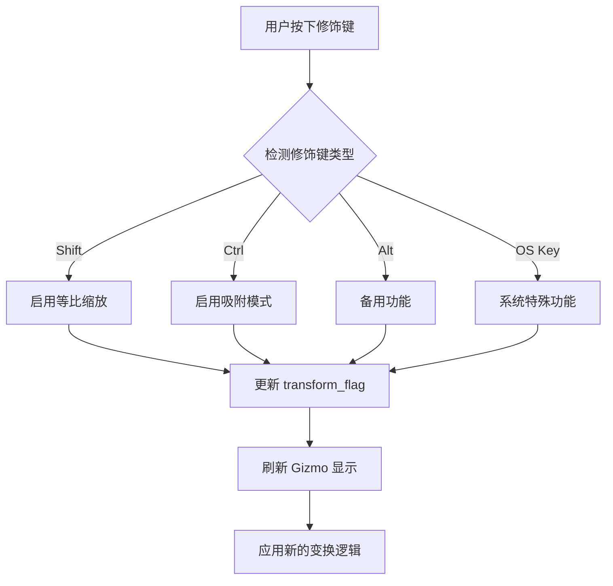
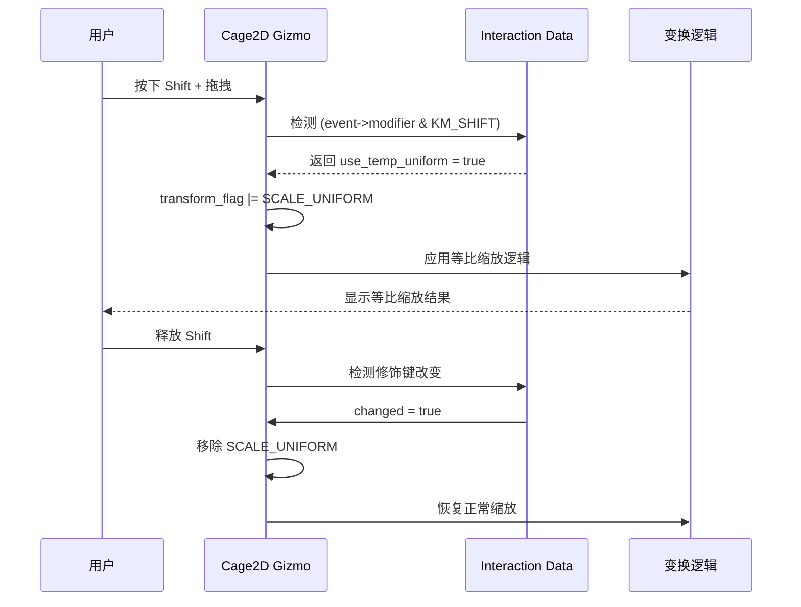
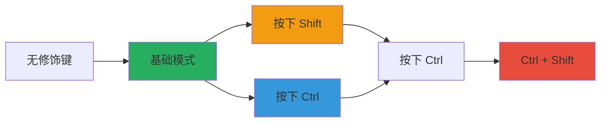

# Gizmo 修饰键机制详解

## 1. 概述

### 1.1 修饰键概念

<span style="color: #E74C3C;">修饰键（Modifier Keys）</span>是在 Gizmo 交互过程中按下的特殊按键，可以临时改变 Gizmo 的行为模式。修饰键通过位掩码（bitmask）的方式存储在事件结构中，支持组合键检测。

### 1.2 在 Gizmo 交互中的作用

修饰键在 Gizmo 交互中提供以下功能：
- <span style="color: #3498DB;">临时改变操作模式</span>（如等比缩放）
- <span style="color: #2ECC71;">提供额外精度控制</span>
- <span style="color: #F39C12;">启用或禁用特定功能</span>（如吸附）



## 2. 修饰键定义

### 2.1 wmEventModifierFlag 枚举

<span style="color: #9B59B6;">定义位置</span>: `source/blender/windowmanager/WM_types.hh:280-296`

```cpp
enum wmEventModifierFlag : uint8_t {
    KM_SHIFT = (1 << 0),
    KM_CTRL = (1 << 1),
    KM_ALT = (1 << 2),
    KM_OSKEY = (1 << 3),     // Windows: Windows键, macOS: Command键, Linux: Super键
    KM_HYPER = (1 << 4),    // Unix系统额外修饰键
};
```

### 2.2 修饰键详解

| 修饰键 | 位值 | 描述 |
|--------|------|------|
| <span style="color: #E67E22;">**KM_SHIFT**</span> | 1 | Shift键，通常用于切换精度或特殊模式 |
| <span style="color: #E67E22;">**KM_CTRL**</span> | 2 | Control键，通常用于吸附或约束 |
| <span style="color: #E67E22;">**KM_ALT**</span> | 4 | Alt键，备用功能键 |
| <span style="color: #E67E22;">**KM_OSKEY**</span> | 8 | 跨平台系统键（Windows/Command/Super） |
| <span style="color: #E67E22;">**KM_HYPER**</span> | 16 | Unix系统的额外修饰键 |

## 3. 修饰键检测机制

### 3.1 基本检测模式

```cpp
// 检测单个修饰键是否按下
const bool shift_pressed = (event->modifier & KM_SHIFT) != 0;
const bool ctrl_pressed = (event->modifier & KM_CTRL) != 0;
const bool alt_pressed = (event->modifier & KM_ALT) != 0;
```

### 3.2 组合检测

```cpp
// 检测任意一个修饰键
const bool shift_or_ctrl = (event->modifier & (KM_SHIFT | KM_CTRL)) != 0;

// 检测多个修饰键同时按下
const bool shift_and_ctrl = (event->modifier & KM_SHIFT) && (event->modifier & KM_CTRL);
```

### 3.3 状态变更检测

```cpp
// 检测修饰键状态是否改变
if (data->prev_modifiers != event->modifier) {
    // 修饰键状态改变，需要刷新或重新计算
    data->prev_modifiers = event->modifier;
}
```

## 4. eWM_GizmoFlagTweak 修饰键

### 4.1 枚举定义

<span style="color: #9B59B6;">定义位置</span>: `source/blender/windowmanager/gizmo/WM_gizmo_types.hh:195-200`

```cpp
enum eWM_GizmoFlagTweak {
    /** Drag with extra precision (Shift). */
    WM_GIZMO_TWEAK_PRECISE = (1 << 0),
    /** Drag with snap enabled (Control). */
    WM_GIZMO_TWEAK_SNAP = (1 << 1),
};
```

### 4.2 作用说明

| 标志 | 位值 | 关联修饰键 | 功能 |
|------|------|-----------|------|
| <span style="color: #27AE60;">**WM_GIZMO_TWEAK_PRECISE**</span> | 1 | Shift | 提供更精确的控制，减慢变换速度 |
| <span style="color: #27AE60;">**WM_GIZMO_TWEAK_SNAP**</span> | 2 | Control | 启用吸附功能，变换到固定增量 |

## 5. Cage 2D 修饰键实现

### 5.1 Shift 键等比缩放

<span style="color: #9B59B6;">定义位置</span>: `source/blender/editors/gizmo_library/gizmo_types/cage2d_gizmo.cc:1157-1180`

```cpp
static wmOperatorStatus gizmo_cage2d_modal(bContext *C,
                                           wmGizmo *gz,
                                           const wmEvent *event,
                                           eWM_GizmoFlagTweak /*tweak_flag*/)
{
  RectTransformInteraction *data = static_cast<RectTransformInteraction *>(gz->interaction_data);
  int transform_flag = RNA_enum_get(gz->ptr, "transform");
  
  // 检查是否已经设置为等比缩放
  if ((transform_flag & ED_GIZMO_CAGE_XFORM_FLAG_SCALE_UNIFORM) == 0) {
    /* WARNING: Checking the events modifier only makes sense as long as `tweak_flag`
     * remains unused (this controls #WM_GIZMO_TWEAK_PRECISE by default). */
    const bool use_temp_uniform = (event->modifier & KM_SHIFT) != 0;
    const bool changed = data->use_temp_uniform != use_temp_uniform;
    data->use_temp_uniform = use_temp_uniform;
    
    // 如果按住 Shift，临时启用等比缩放
    if (use_temp_uniform) {
      transform_flag |= ED_GIZMO_CAGE_XFORM_FLAG_SCALE_UNIFORM;
    }

    if (changed) {
      /* Always refresh. */
    }
    else if (event->type != MOUSEMOVE) {
      return OPERATOR_RUNNING_MODAL;
    }
  }
  
  // ... 后续的变换逻辑会使用更新后的 transform_flag
}
```

#### 实现详解



### 5.2 等比缩放计算

<span style="color: #9B59B6;">定义位置</span>: `source/blender/editors/gizmo_library/gizmo_types/cage2d_gizmo.cc:1325-1344`

```cpp
if (transform_flag & ED_GIZMO_CAGE_XFORM_FLAG_SCALE_UNIFORM) {
  if (constrain_axis[0] == false && constrain_axis[1] == false) {
    // 如果两个轴都不受约束
    if (draw_style == ED_GIZMO_CAGE2D_STYLE_CIRCLE) {
      /* So that the cursor lies on the circle. */
      scale[1] = scale[0] = len_v2(scale);
    }
    else {
      scale[1] = scale[0] = (scale[1] + scale[0]) / 2.0f;
    }
  }
  else if (constrain_axis[0] == false) {
    // X轴不受约束，将Y轴缩放设置为与X相同
    scale[1] = scale[0];
  }
  else if (constrain_axis[1] == false) {
    // Y轴不受约束，将X轴缩放设置为与Y相同
    scale[0] = scale[1];
  }
  else {
    BLI_assert(0);
  }
}
```

#### 等比缩放计算策略

```mermaid
flowchart TD
    A[等比缩放触发] --> B{约束轴状态}
    B -->|两轴均无约束| C{绘制样式}
    B -->|X轴约束| D[scale[1] = scale[0]]
    B -->|Y轴约束| E[scale[0] = scale[1]]
    C -->|圆形样式| F[使用向量长度 len_v2]
    C -->|矩形样式| G[使用平均值]
    F --> H[统一缩放值]
    G --> H
    D --> H
    E --> H
```

| 样式 | 计算方法 | 公式 | 适用场景 |
|------|---------|------|---------|
| <span style="color: #16A085;">**圆形样式**</span> | 向量长度 | `len_v2(scale)` | 保持圆形形状，光标在圆上移动 |
| <span style="color: #16A085;">**矩形样式**</span> | 平均值 | `(scale[1] + scale[0]) / 2.0f` | 矩形等比缩放，取两轴平均 |

### 5.3 交互数据结构

<span style="color: #9B59B6;">定义位置</span>: `source/blender/editors/gizmo_library/gizmo_types/cage2d_gizmo.cc:1056-1062`

```cpp
struct RectTransformInteraction {
  float orig_mouse[2];
  float orig_matrix_offset[4][4];
  float orig_matrix_final_no_offset[4][4];
  Dial *dial;
  bool use_temp_uniform;  // 存储临时等比缩放状态
};
```

## 6. 其他 Gizmo 的修饰键支持

### 6.1 Arrow 3D Gizmo

<span style="color: #9B59B6;">定义位置</span>: `source/blender/editors/gizmo_library/gizmo_types/arrow3d_gizmo.cc:328-332`

```cpp
static wmOperatorStatus gizmo_arrow_modal(bContext *C,
                                          wmGizmo *gz,
                                          const wmEvent *event,
                                          eWM_GizmoFlagTweak tweak_flag)
{
  // 没有使用 event->modifier 检测
  // 没有实现修饰键功能
}
```

**状态**: <span style="color: #E74C3C;">未实现修饰键检测</span>

### 6.2 Dial 3D Gizmo

<span style="color: #9B59B6;">定义位置</span>: `source/blender/editors/gizmo_library/gizmo_types/dial3d_gizmo.cc:502-540`

```cpp
static wmOperatorStatus gizmo_dial_modal(bContext *C,
                                         wmGizmo *gz,
                                         const wmEvent *event,
                                         eWM_GizmoFlagTweak tweak_flag)
{
  DialInteraction *inter = static_cast<DialInteraction *>(gz->interaction_data);
  if (!inter) {
    return OPERATOR_CANCELLED;
  }

  if ((event->type != MOUSEMOVE) && (inter->prev.tweak_flag == tweak_flag)) {
    return OPERATOR_RUNNING_MODAL;
  }

  // ... 角度计算 ...

  if (tweak_flag & WM_GIZMO_TWEAK_SNAP) {
    angle_increment = RNA_float_get(gz->ptr, "incremental_angle");
    angle_delta = roundf(double(angle_delta) / angle_increment) * angle_increment;
  }
  if (tweak_flag & WM_GIZMO_TWEAK_PRECISE) {
    angle_increment *= 0.2f;
    angle_delta *= 0.2f;
  }
  
  inter->tweak_flag = tweak_flag;  // 存储状态用于检测变化
  // ...
}
```

<span style="color: #9B59B6;">结构体定义</span>: `source/blender/editors/gizmo_library/gizmo_types/dial3d_gizmo.cc:51-73`

```cpp
struct DialInteraction {
  struct {
    float mval[2];
    float prop_angle;
  } init;
  struct {
    eWM_GizmoFlagTweak tweak_flag;  // 存储前一次 tweak_flag
    float angle;
  } prev;
  
  int rotations;
  bool has_drag;
  float angle_increment;
  
  struct {
    float angle_ofs;
    float angle_delta;
  } output;
};
```

**状态**: <span style="color: #F39C12;">使用 tweak_flag 参数，不直接检测 event->modifier</span>

### 6.3 Move 3D Gizmo

<span style="color: #9B59B6;">定义位置</span>: `source/blender/editors/gizmo_library/gizmo_types/move3d_gizmo.cc:64-82`

```cpp
static wmOperatorStatus gizmo_move_modal(bContext *C,
                                         wmGizmo *gz,
                                         const wmEvent *event,
                                         eWM_GizmoFlagTweak tweak_flag);

struct MoveInteraction {
  struct {
    float mval[2];
    float prop_co[3];
    float matrix_final[4][4];
  } init;
  struct {
    eWM_GizmoFlagTweak tweak_flag;  // 存储前一次 tweak_flag
  } prev;

  blender::ed::transform::SnapObjectContext *snap_context_v3d;
};
```

**状态**: <span style="color: #F39C12;">使用 tweak_flag 参数，未实现修饰键检测</span>

### 6.4 Cage 3D Gizmo

<span style="color: #9B59B6;">定义位置</span>: `source/blender/editors/gizmo_library/gizmo_types/cage3d_gizmo.cc:470-473`

```cpp
static wmOperatorStatus gizmo_cage3d_modal(bContext *C,
                                           wmGizmo *gz,
                                           const wmEvent *event,
                                           eWM_GizmoFlagTweak /*tweak_flag*/)
{
  if (event->type != MOUSEMOVE) {
    return OPERATOR_RUNNING_MODAL;
  }
  // 没有使用修饰键检测
  // 没有实现等比缩放等修饰键功能
}
```

**状态**: <span style="color: #E74C3C;">未实现修饰键检测，tweak_flag 被注释掉</span>

## 7. 修饰键在 Gizmo 系统中的限制

### 7.1 Tweak Flag 冲突警告

<span style="color: #9B59B6;">位置</span>: `source/blender/editors/gizmo_library/gizmo_types/cage2d_gizmo.cc:1165-1166`

```cpp
/* WARNING: Checking the events modifier only makes sense as long as `tweak_flag`
 * remains unused (this controls #WM_GIZMO_TWEAK_PRECISE by default). */
```

#### 警告说明

```
⚠️  重要提示：

当 tweak_flag 参数被系统使用时，它会根据当前按下的修饰键预设值：
- 按下 Shift → tweak_flag |= WM_GIZMO_TWEAK_PRECISE
- 按下 Ctrl → tweak_flag |= WM_GIZMO_TWEAK_SNAP

如果同时使用 tweak_flag 和直接检测 event->modifier，会导致：
1. 逻辑冲突和不可预测的行为
2. 难以调试的状态管理
3. 用户体验不一致

Cage 2D 当前直接检测 event->modifier，这意味着它没有利用系统的 tweak_flag 机制
```

### 7.2 当前支持的修饰键总结

| Gizmo 类型 | Shift | Ctrl | Alt | OS Key | Hyper | 实现方式 |
|-----------|-------|------|-----|--------|-------|---------|
| <span style="color: #27AE60;">**Cage 2D**</span> | ✅ 等比缩放 | ❌ | ❌ | ❌ | ❌ | 直接检测 event->modifier |
| <span style="color: #E74C3C;">**Cage 3D**</span> | ❌ | ❌ | ❌ | ❌ | ❌ | 无实现 |
| <span style="color: #E74C3C;">**Arrow 3D**</span> | ❌ | ❌ | ❌ | ❌ | ❌ | 无实现 |
| <span style="color: #F39C12;">**Dial 3D**</span> | ✅ 精度(0.2x) | ✅ 吸附 | ❌ | ❌ | ❌ | 使用 tweak_flag |
| <span style="color: #F39C12;">**Move 3D**</span> | ❌ | ❌ | ❌ | ❌ | ❌ | 使用 tweak_flag(未实现功能) |

## 8. 修饰键检测的通用模式

### 8.1 标准检测模板

```cpp
static wmOperatorStatus custom_gizmo_modal(bContext *C,
                                           wmGizmo *gz,
                                           const wmEvent *event,
                                           eWM_GizmoFlagTweak tweak_flag)
{
  CustomInteraction *data = static_cast<CustomInteraction *>(gz->interaction_data);
  
  // 1. 检测单个修饰键
  const bool shift_pressed = (event->modifier & KM_SHIFT) != 0;
  const bool ctrl_pressed = (event->modifier & KM_CTRL) != 0;
  const bool alt_pressed = (event->modifier & KM_ALT) != 0;
  
  // 2. 检测组合键
  const bool shift_and_ctrl = shift_pressed && ctrl_pressed;
  const bool all_modifiers = (event->modifier & (KM_SHIFT | KM_CTRL | KM_ALT)) != 0;
  
  // 3. 状态变更检测
  const bool modifiers_changed = (data->prev_modifiers != event->modifier);
  if (modifiers_changed) {
    data->prev_modifiers = event->modifier;
    // 更新状态或重新计算
  }
  
  // 4. 根据修饰键调整行为
  if (shift_pressed) {
    // Shift 键的特殊行为
  }
  
  if (ctrl_pressed) {
    // Ctrl 键的特殊行为
  }
  
  // 5. 返回状态
  return OPERATOR_RUNNING_MODAL;
}
```

### 8.2 交互数据结构模板

```cpp
struct CustomInteraction {
  float orig_mouse[2];
  int prev_modifiers;           // 存储前一次修饰键状态
  bool use_temp_uniform;        // 临时模式标志
  bool use_feature_x;
  bool use_feature_y;
  // ... 其他交互数据
};
```

### 8.3 修饰键优先级



```
优先级顺序（从高到低）:
1. Ctrl + Shift 组合键
2. Ctrl 单键
3. Shift 单键
4. 无修饰键（默认模式）
```

## 9. 跨平台注意事项

### 9.1 修饰键映射表

| 平台 | KM_OSKEY 对应 | 说明 |
|------|---------------|------|
| <span style="color: #2980B9;">**Windows**</span> | Windows键 | ⊞ 键 |
| <span style="color: #2980B9;">**macOS**</span> | Command键 | ⌘ 键 |
| <span style="color: #2980B9;">**Linux**</span> | Super键 | 通常带 Windows 徽标的键 |

### 9.2 兼容性考虑

```cpp
// ⚠️ 不推荐：使用 KM_OSKEY
// 原因：
// 1. 用户体验：这些键通常用于系统快捷键
// 2. 跨平台不一致：不同系统的行为可能不同
// 3. 键盘布局：部分键盘可能没有这些键

// ✅ 推荐：优先使用 Shift/Ctrl/Alt
// 原因：
// 1. 通用性：所有标准键盘都有这些键
// 2. 用户习惯：符合常用软件的操作习惯
// 3. 可靠性：跨平台行为一致

// ⚠️ 谨慎使用：KM_HYPER
// 原因：
// 1. 仅支持 Wayland & X11 平台
// 2. 需要手动映射（通常映射到 CapsLock）
// 3. 用户不熟悉
```

## 10. 实际代码示例

### 示例1：Cage 2D 的完整修饰键检测

<span style="color: #9B59B6;">位置</span>: `source/blender/editors/gizmo_library/gizmo_types/cage2d_gizmo.cc:1157-1180`

参见第 5.1 节完整代码示例。

### 示例2：Dial 3D 使用 tweak_flag

<span style="color: #9B59B6;">位置</span>: `source/blender/editors/gizmo_library/gizmo_types/dial3d_gizmo.cc:522-529`

```cpp
if (tweak_flag & WM_GIZMO_TWEAK_SNAP) {
  // Ctrl 键按下：启用角度吸附
  angle_increment = RNA_float_get(gz->ptr, "incremental_angle");
  angle_delta = roundf(double(angle_delta) / angle_increment) * angle_increment;
}
if (tweak_flag & WM_GIZMO_TWEAK_PRECISE) {
  // Shift 键按下：减慢旋转速度到 20%
  angle_increment *= 0.2f;
  angle_delta *= 0.2f;
}
```

### 示例3：Move 3D 状态检测模式

<span style="color: #9B59B6;">位置</span>: `source/blender/editors/gizmo_library/gizmo_types/move3d_gizmo.cc:77-78`

```cpp
struct MoveInteraction {
  // ...
  struct {
    eWM_GizmoFlagTweak tweak_flag;
  } prev;
  // ...
};
```

## 总结

### 关键要点

1. <span style="color: #E74C3C;">Cage 2D 是唯一直接检测修饰键的 Gizmo</span>，实现了 Shift 键等比缩放功能

2. <span style="color: #F39C12;">Dial 3D 使用标准的 tweak_flag 机制</span>，支持 Shift（精度）和 Ctrl（吸附）

3. <span style="color: #95A5A6;">Arrow 3D、Cage 3D、Move 3D 均未实现修饰键功能</span>

4. <span style="color: #9B59B6;">直接检测 event->modifier 与使用 tweak_flag 存在冲突</span>，需要谨慎选择实现方式

### 推荐实现方式

```cpp
// 方式1：直接检测修饰键（Cage 2D 模式）
const bool use_temp_uniform = (event->modifier & KM_SHIFT) != 0;

// 方式2：使用 tweak_flag（Dial 3D 模式，推荐）
if (tweak_flag & WM_GIZMO_TWEAK_PRECISE) {
  // Shift 键处理
}
if (tweak_flag & WM_GIZMO_TWEAK_SNAP) {
  // Ctrl 键处理
}
```

---

**最后更新**: 2025年12月25日
