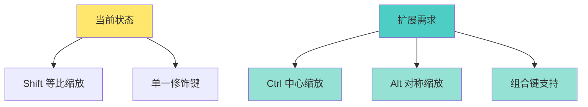
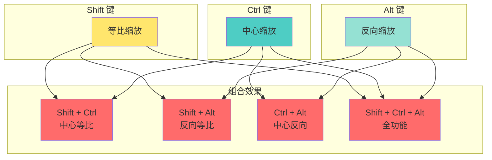
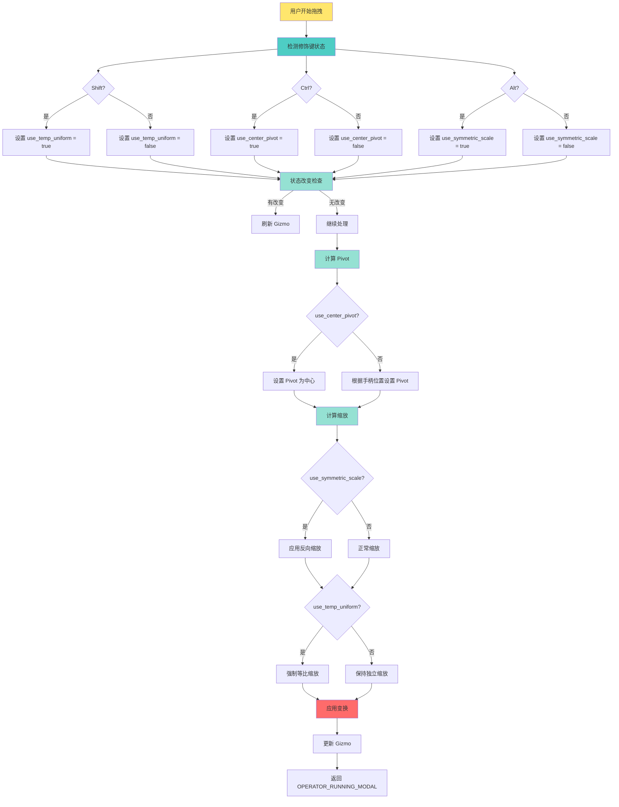

# 扩展 Gizmo 修饰键支持

## 1. 概述

### 1.1 为什么需要扩展修饰键支持

<span style="color: #FF6B6B;">现状问题</span>：
- Cage 2D Gizmo 当前只支持 <span style="color: #4ECDC4;">Shift</span> 键进行等比缩放
- 用户无法从矩形中心进行缩放操作
- 缺少对称缩放等高级功能

<span style="color: #FFE66D;">扩展价值</span>：
- 提供更灵活的变换控制
- 与主流设计软件保持一致的交互体验
- 提高操作效率和精确度

### 1.2 当前 Cage 2D 状态

**定义位置**: `source/blender/editors/gizmo_library/gizmo_types/cage2d_gizmo.cc:1056-1062`

```cpp
struct RectTransformInteraction {
  float orig_mouse[2];
  float orig_matrix_offset[4][4];
  float orig_matrix_final_no_offset[4][4];
  Dial *dial;
  bool use_temp_uniform;  // 当前只支持 Shift 键
};
```

### 1.3 需求分析



---

## 2. Ctrl 中心缩放功能设计

### 2.1 功能描述

<span style="color: #FF6B6B;">核心功能</span>：
- 按住 <span style="color: #4ECDC4;">Ctrl</span> 键时，从矩形中心进行缩放
- 与 <span style="color: #FFE66D;">Shift</span> 等比缩放可以组合使用
- 改变 pivot 点从边界到中心

<span style="color: #95E1D3;">使用场景</span>：
- 调整图像大小时保持中心位置不变
- 对称调整物体尺寸
- 快速居中缩放操作

### 2.2 与现有功能对比

| 功能 | Shift 键 | Ctrl 键（新增）| Shift + Ctrl（新增）|
|------|---------|---------------|-------------------|
| 缩放方式 | 等比 | 中心 | 中心等比 |
| Pivot 点 | 边界/角 | 中心 | 中心 |
| 宽高比 | 保持 | 可变 | 保持 |

---

## 3. 实现步骤详解

### 步骤 1：扩展交互数据结构

<span style="color: #FF6B6B;">修改位置</span>：`source/blender/editors/gizmo_library/gizmo_types/cage2d_gizmo.cc:1054-1063`

**原始结构**：

```cpp
namespace {

struct RectTransformInteraction {
  float orig_mouse[2];
  float orig_matrix_offset[4][4];
  float orig_matrix_final_no_offset[4][4];
  Dial *dial;
  bool use_temp_uniform;
};

}  // namespace
```

**修改后**：

```cpp
namespace {

struct RectTransformInteraction {
  float orig_mouse[2];
  float orig_matrix_offset[4][4];
  float orig_matrix_final_no_offset[4][4];
  Dial *dial;
  bool use_temp_uniform;     // Shift 键：等比缩放
  bool use_center_pivot;     // Ctrl 键：中心缩放
};

}  // namespace
```

**说明**：
- 新增 <span style="color: #4ECDC4;">`use_center_pivot`</span> 字段
- 用于存储 Ctrl 键状态
- 避免重复计算

---

### 步骤 2：更新修饰键检测逻辑

<span style="color: #FF6B6B;">修改位置</span>：`source/blender/editors/gizmo_library/gizmo_types/cage2d_gizmo.cc:1157-1180`

**原始代码**：

```cpp
static wmOperatorStatus gizmo_cage2d_modal(bContext *C,
                                           wmGizmo *gz,
                                           const wmEvent *event,
                                           eWM_GizmoFlagTweak /*tweak_flag*/)
{
  RectTransformInteraction *data = static_cast<RectTransformInteraction *>(gz->interaction_data);
  int transform_flag = RNA_enum_get(gz->ptr, "transform");
  if ((transform_flag & ED_GIZMO_CAGE_XFORM_FLAG_SCALE_UNIFORM) == 0) {
    /* WARNING: Checking the events modifier only makes sense as long as `tweak_flag`
     * remains unused (this controls #WM_GIZMO_TWEAK_PRECISE by default). */
    const bool use_temp_uniform = (event->modifier & KM_SHIFT) != 0;
    const bool changed = data->use_temp_uniform != use_temp_uniform;
    data->use_temp_uniform = use_temp_uniform;
    if (use_temp_uniform) {
      transform_flag |= ED_GIZMO_CAGE_XFORM_FLAG_SCALE_UNIFORM;
    }

    if (changed) {
      /* Always refresh. */
    }
    else if (event->type != MOUSEMOVE) {
      return OPERATOR_RUNNING_MODAL;
    }
  }
```

**修改后**：

```cpp
static wmOperatorStatus gizmo_cage2d_modal(bContext *C,
                                           wmGizmo *gz,
                                           const wmEvent *event,
                                           eWM_GizmoFlagTweak /*tweak_flag*/)
{
  RectTransformInteraction *data = static_cast<RectTransformInteraction *>(gz->interaction_data);
  int transform_flag = RNA_enum_get(gz->ptr, "transform");
  if ((transform_flag & ED_GIZMO_CAGE_XFORM_FLAG_SCALE_UNIFORM) == 0) {
    /* WARNING: Checking the events modifier only makes sense as long as `tweak_flag`
     * remains unused (this controls #WM_GIZMO_TWEAK_PRECISE by default). */

    // 检测 Shift 键（等比缩放）
    const bool use_temp_uniform = (event->modifier & KM_SHIFT) != 0;

    // 检测 Ctrl 键（中心缩放）- 新增
    const bool use_center_pivot = (event->modifier & KM_CTRL) != 0;

    // 检测状态改变 - 新增 Ctrl 键检测
    const bool changed = (data->use_temp_uniform != use_temp_uniform) ||
                        (data->use_center_pivot != use_center_pivot);

    // 更新状态 - 新增 Ctrl 键状态
    data->use_temp_uniform = use_temp_uniform;
    data->use_center_pivot = use_center_pivot;

    // 应用 Shift 键效果
    if (use_temp_uniform) {
      transform_flag |= ED_GIZMO_CAGE_XFORM_FLAG_SCALE_UNIFORM;
    }

    // Ctrl 键在后续 pivot 计算中使用

    if (changed) {
      /* Always refresh. */
    }
    else if (event->type != MOUSEMOVE) {
      return OPERATOR_RUNNING_MODAL;
    }
  }
```

---

### 步骤 3：修改 Pivot 计算逻辑

<span style="color: #FF6B6B;">修改位置</span>：`source/blender/editors/gizmo_library/gizmo_types/cage2d_gizmo.cc:1262-1269`

**原始代码**：

```cpp
    float pivot[2];
    if (transform_flag & ED_GIZMO_CAGE_XFORM_FLAG_TRANSLATE) {
      gizmo_pivot_from_scale_part(gz->highlight_part, pivot);
      mul_v2_v2(pivot, dims);
    }
    else {
      zero_v2(pivot);
    }
```

**修改后**：

```cpp
    float pivot[2];
    if (transform_flag & ED_GIZMO_CAGE_XFORM_FLAG_TRANSLATE) {
      // 检查是否使用中心缩放（Ctrl 键）
      if (data->use_center_pivot) {
        // Ctrl 键：从中心缩放，pivot 设为 (0, 0)
        ARRAY_SET_ITEMS(pivot, 0.0f, 0.0f);
      }
      else {
        // 正常缩放：根据缩放手柄位置确定 pivot
        gizmo_pivot_from_scale_part(gz->highlight_part, pivot);
        mul_v2_v2(pivot, dims);
      }
    }
    else {
      zero_v2(pivot);
    }
```

**说明**：
- <span style="color: #4ECDC4;">`gizmo_pivot_from_scale_part()`</span> 函数根据 highlight_part 返回对应的 pivot
- 例如：拖动右边时，pivot 在左边（0, 0）
- 拖动右下角时，pivot 在左上角（0, 1）
- 使用 Ctrl 键时，强制使用中心 pivot (0, 0)

---

### 步骤 4：添加文档注释

<span style="color: #FF6B6B;">修改位置</span>：在 `GIZMO_GT_cage_2d` 函数前添加

**添加注释**：

```cpp
/**
 * Cage 2D Gizmo
 *
 * Modifier Keys during interaction:
 * - Shift: Temporary uniform scaling (maintain aspect ratio)
 * - Ctrl: Scale from center (override pivot to origin) - [新增]
 * - Shift + Ctrl: Center uniform scaling - [新增]
 */
static void GIZMO_GT_cage_2d(wmGizmoType *gzt)
{
    // ...
}
```

---

## 4. 扩展 Alt 键支持

### 4.1 功能设计

<span style="color: #FF6B6B;">核心功能</span>：
- <span style="color: #FFE66D;">Alt</span> 键：反向缩放（同时向两边扩展/收缩）
- 适用于对称调整
- 可与 Shift、Ctrl 键组合使用

### 4.2 实现代码

**扩展数据结构**：

```cpp
struct RectTransformInteraction {
  float orig_mouse[2];
  float orig_matrix_offset[4][4];
  float orig_matrix_final_no_offset[4][4];
  Dial *dial;
  bool use_temp_uniform;     // Shift 键：等比缩放
  bool use_center_pivot;     // Ctrl 键：中心缩放
  bool use_symmetric_scale;  // Alt 键：反向缩放
};
```

**修饰键检测**：

```cpp
// 检测 Alt 键（反向缩放）
const bool use_symmetric_scale = (event->modifier & KM_ALT) != 0;

// 更新状态检测
const bool changed = (data->use_temp_uniform != use_temp_uniform) ||
                    (data->use_center_pivot != use_center_pivot) ||
                    (data->use_symmetric_scale != use_symmetric_scale);

data->use_temp_uniform = use_temp_uniform;
data->use_center_pivot = use_center_pivot;
data->use_symmetric_scale = use_symmetric_scale;
```

---

## 5. 完整实现代码

### 5.1 修改后的完整 modal 函数片段

<span style="color: #FF6B6B;">定义位置</span>：`source/blender/editors/gizmo_library/gizmo_types/cage2d_gizmo.cc:1157-1269`

```cpp
static wmOperatorStatus gizmo_cage2d_modal(bContext *C,
                                           wmGizmo *gz,
                                           const wmEvent *event,
                                           eWM_GizmoFlagTweak /*tweak_flag*/)
{
  RectTransformInteraction *data = static_cast<RectTransformInteraction *>(gz->interaction_data);
  int transform_flag = RNA_enum_get(gz->ptr, "transform");

  if ((transform_flag & ED_GIZMO_CAGE_XFORM_FLAG_SCALE_UNIFORM) == 0) {
    /* WARNING: Checking the events modifier only makes sense as long as `tweak_flag`
     * remains unused (this controls #WM_GIZMO_TWEAK_PRECISE by default). */

    // 检测所有修饰键
    const bool use_temp_uniform = (event->modifier & KM_SHIFT) != 0;
    const bool use_center_pivot = (event->modifier & KM_CTRL) != 0;
    const bool use_symmetric_scale = (event->modifier & KM_ALT) != 0;

    // 检测状态改变
    const bool changed = (data->use_temp_uniform != use_temp_uniform) ||
                        (data->use_center_pivot != use_center_pivot) ||
                        (data->use_symmetric_scale != use_symmetric_scale);

    // 更新状态
    data->use_temp_uniform = use_temp_uniform;
    data->use_center_pivot = use_center_pivot;
    data->use_symmetric_scale = use_symmetric_scale;

    // 应用 Shift 键效果
    if (use_temp_uniform) {
      transform_flag |= ED_GIZMO_CAGE_XFORM_FLAG_SCALE_UNIFORM;
    }

    if (changed) {
      /* Always refresh. */
    }
    else if (event->type != MOUSEMOVE) {
      return OPERATOR_RUNNING_MODAL;
    }
  }

  float point_local[2];

  float dims[2];
  RNA_float_get_array(gz->ptr, "dimensions", dims);

  {
    float matrix_back[4][4];
    copy_m4_m4(matrix_back, gz->matrix_offset);
    copy_m4_m4(gz->matrix_offset, data->orig_matrix_offset);

    bool ok = gizmo_window_project_2d(
        C, gz, blender::float2(blender::int2(event->mval)), 2, false, point_local);
    copy_m4_m4(gz->matrix_offset, matrix_back);
    if (!ok) {
      return OPERATOR_RUNNING_MODAL;
    }
  }

  copy_m4_m4(gz->matrix_offset, data->orig_matrix_offset);

  if (gz->highlight_part == ED_GIZMO_CAGE2D_PART_TRANSLATE) {
    /* do this to prevent clamping from changing size */
    gz->matrix_offset[3][0] = data->orig_matrix_offset[3][0] +
                              (point_local[0] - data->orig_mouse[0]);
    gz->matrix_offset[3][1] = data->orig_matrix_offset[3][1] +
                              (point_local[1] - data->orig_mouse[1]);
  }
  else {
    /* scale */
    float pivot[2];
    if (transform_flag & ED_GIZMO_CAGE_XFORM_FLAG_TRANSLATE) {
      // 检查是否使用中心缩放（Ctrl 键）
      if (data->use_center_pivot) {
        // Ctrl 键：从中心缩放，pivot 设为 (0, 0)
        ARRAY_SET_ITEMS(pivot, 0.0f, 0.0f);
      }
      else {
        // 正常缩放：根据缩放手柄位置确定 pivot
        gizmo_pivot_from_scale_part(gz->highlight_part, pivot);
        mul_v2_v2(pivot, dims);
      }
    }
    else {
      zero_v2(pivot);
    }

    float curr_mouse[2];
    copy_v2_v2(curr_mouse, data->orig_mouse);

    /* Rotate current and original mouse coordinates around gizmo center. */
    if (transform_flag & ED_GIZMO_CAGE_XFORM_FLAG_ROTATE) {
      float rot[3][3];
      float loc[3];
      float size[3];
      mat4_to_loc_rot_size(loc, rot, size, gz->matrix_offset);
      mul_v2_m3_v2(curr_mouse, rot, curr_mouse);
      mul_v2_m3_v2(data->orig_mouse, rot, data->orig_mouse);
      zero_v2(loc);
      mat4_from_loc_rot_size(gz->matrix_offset, loc, rot, size);
    }

    float scale[2] = {1.0f, 1.0f};

    for (int i = 0; i < 2; i++) {
      const int axis = gz->highlight_part - ED_GIZMO_CAGE2D_PART_SCALE_MIN_X;
      if (axis >= 0 && axis <= 3) {
        if ((axis % 2) == i) {
          const float orig_delta = data->orig_mouse[i] - pivot[i];
          const float curr_delta = curr_mouse[i] - pivot[i];
          scale[i] = (data->orig_matrix_offset[3][i] - pivot[i] + curr_delta) /
                     (data->orig_matrix_offset[3][i] - pivot[i] + orig_delta);
        }
      }
    }

    // Alt 键：对称缩放处理
    if (data->use_symmetric_scale) {
      for (int i = 0; i < 2; i++) {
        if (scale[i] != 1.0f) {
          // 同时向两边缩放，位置保持在中心
          scale[i] = 1.0f + (scale[i] - 1.0f) * 2.0f;
        }
      }
    }

    if (transform_flag & ED_GIZMO_CAGE_XFORM_FLAG_SCALE_UNIFORM) {
      scale[1] = scale[0] = (scale[1] + scale[0]) / 2.0f;
    }

    gz->matrix_offset[3][0] = data->orig_matrix_offset[3][0];
    gz->matrix_offset[3][1] = data->orig_matrix_offset[3][1];

    for (int i = 0; i < 2; i++) {
      for (int j = 0; j < 2; j++) {
        gz->matrix_offset[i][j] *= scale[j];
      }
      gz->matrix_offset[3][i] -= pivot[i] * scale[i];
    }
  }

  /* property update */
  wmGizmoProperty *gz_prop = WM_gizmo_target_property_find(gz, "matrix");
  if (gz_prop->type != nullptr) {
    WM_gizmo_target_property_float_set_array(gz, gz_prop, &gz->matrix_offset[0][0]);
  }

  return OPERATOR_RUNNING_MODAL;
}
```

---

## 6. 同步扩展到 Cage 3D

### 6.1 Cage 3D 当前状态

<span style="color: #FF6B6B;">定义位置</span>：
- 文件：`source/blender/editors/gizmo_library/gizmo_types/cage3d_gizmo.cc`
- modal 函数：第 470-595 行
- 数据结构：无修饰键支持

### 6.2 扩展 Cage 3D

**数据结构**（cage3d_gizmo.cc）：

```cpp
struct Cage3DInteraction {
  float orig_mouse[3];
  float orig_matrix_offset[4][4];
  float orig_matrix_final_no_offset[4][4];
  Dial *dial;
  bool use_temp_uniform;     // Shift 键：等比缩放
  bool use_center_pivot;     // Ctrl 键：中心缩放
  bool use_symmetric_scale;  // Alt 键：反向缩放
};
```

**修饰键检测**（添加到 modal 函数开始）：

```cpp
// 检测修饰键
const bool use_temp_uniform = (event->modifier & KM_SHIFT) != 0;
const bool use_center_pivot = (event->modifier & KM_CTRL) != 0;
const bool use_symmetric_scale = (event->modifier & KM_ALT) != 0;

// 检测状态改变
const bool changed = (data->use_temp_uniform != use_temp_uniform) ||
                    (data->use_center_pivot != use_center_pivot) ||
                    (data->use_symmetric_scale != use_symmetric_scale);

// 更新状态
data->use_temp_uniform = use_temp_uniform;
data->use_center_pivot = use_center_pivot;
data->use_symmetric_scale = use_symmetric_scale;
```

**Pivot 计算修改**：

```cpp
float pivot[3];
if (data->use_center_pivot) {
  // Ctrl 键：从中心缩放
  zero_v3(pivot);
}
else {
  // 正常缩放：根据手柄位置确定 pivot
  bool constrain_axis[3] = {false};
  bool has_translation = transform_flag & ED_GIZMO_CAGE_XFORM_FLAG_TRANSLATE;
  gizmo_rect_pivot_from_scale_part(gz->highlight_part, pivot, constrain_axis, has_translation);
}
```

---

## 7. 扩展其他 Gizmo 类型

### 7.1 Arrow Gizmo

<span style="color: #FF6B6B;">可能的扩展</span>：
- <span style="color: #4ECDC4;">Ctrl</span> 键：吸附到网格
- <span style="color: #FFE66D;">Alt</span> 键：反向移动
- <span style="color: #95E1D3;">Shift</span> 键：精度模式

### 7.2 Dial Gizmo

<span style="color: #FF6B6B;">可能的扩展</span>：
- <span style="color: #4ECDC4;">Shift</span> 键：精度模式（5° 步进）
- <span style="color: #FFE66D;">Ctrl</span> 键：吸附到角度（15°、30°、45°）
- <span style="color: #95E1D3;">Alt</span> 键：相对旋转

### 7.3 Move Gizmo

<span style="color: #FF6B6B;">可能的扩展</span>：
- <span style="color: #4ECDC4;">Shift</span> 键：精度模式
- <span style="color: #FFE66D;">Ctrl</span> 键：轴向约束
- <span style="color: #95E1D3;">Alt</span> 键：中心移动

---

## 8. 修饰键组合矩阵



| Shift | Ctrl | Alt | 功能描述 |
|-------|------|-----|----------|
| ✓ | ✗ | ✗ | 等比缩放（保持宽高比）|
| ✗ | ✓ | ✗ | 中心缩放（从矩形中心）|
| ✗ | ✗ | ✓ | 反向缩放（同时向两边）|
| ✓ | ✓ | ✗ | 中心等比缩放 |
| ✓ | ✗ | ✓ | 反向等比缩放 |
| ✗ | ✓ | ✓ | 中心反向缩放 |
| ✓ | ✓ | ✓ | 中心反向等比缩放（全功能）|

---

## 9. 测试验证

### 9.1 功能测试清单

- [ ] Shift 键单独使用 - 等比缩放
- [ ] Ctrl 键单独使用 - 中心缩放
- [ ] Alt 键单独使用 - 反向缩放
- [ ] Shift + Ctrl 组合 - 中心等比缩放
- [ ] Shift + Alt 组合 - 反向等比缩放
- [ ] Ctrl + Alt 组合 - 中心反向缩放
- [ ] Shift + Ctrl + Alt 组合 - 全功能

### 9.2 边界情况测试

- [ ] 快速切换修饰键
- [ ] 在拖拽中途按下修饰键
- [ ] 在拖拽中途释放修饰键
- [ ] 同时按下多个修饰键
- [ ] 最小/最大尺寸限制
- [ ] 负尺寸处理
- [ ] 零尺寸处理

### 9.3 用户体验测试

- [ ] 操作流畅度
- [ ] 视觉反馈及时性
- [ ] 与其他工具的兼容性
- [ ] 键盘快捷键冲突检查

---

## 10. 用户界面提示

### 10.1 Tooltip 文本

**定义位置**：`source/blender/editors/gizmo_library/gizmo_types/cage2d_gizmo.cc`

```cpp
gz->tooltip = "Scale (Shift: Uniform, Ctrl: Center, Alt: Symmetric)";
```

### 10.2 状态指示器

可以在 UI 中显示当前激活的修饰键：

```
Mode: Scale [Uniform✓] [Center✓] [Symmetric✗]
```

### 10.3 帮助信息

在状态栏或帮助面板中显示：

```cpp
/**
 * Cage 2D Transformation Help
 *
 * Modifier Keys:
 *   Shift  - Uniform scaling (maintain aspect ratio)
 *   Ctrl   - Scale from center
 *   Alt    - Symmetric scaling (expand/contract from both sides)
 *
 * Combinations:
 *   Shift+Ctrl - Center uniform scaling
 *   Shift+Alt  - Symmetric uniform scaling
 *   Ctrl+Alt   - Center symmetric scaling
 *   Shift+Ctrl+Alt - Center symmetric uniform scaling
 */
```

---

## 11. 实现流程图



---

## 12. 注意事项

### 12.1 兼容性考虑

<span style="color: #FF6B6B;">重要</span>：
1. 只基于实际代码结构扩展
2. 不破坏现有功能
3. 与其他 Gizmo 保持一致

### 12.2 性能优化

<span style="color: #4ECDC4;">建议</span>：
1. 避免在每次 MOUSEMOVE 时重复计算
2. 使用状态检测减少不必要的刷新
3. 考虑使用缓存优化

### 12.3 错误处理

<span style="color: #FFE66D;">注意</span>：
1. 处理零尺寸情况
2. 处理负尺寸情况
3. 处理极值情况
4. 处理无效输入

### 12.4 用户体验

<span style="color: #95E1D3;">优化</span>：
1. 提供清晰的视觉反馈
2. 添加适当的工具提示
3. 保持操作流畅
4. 提供撤销/重做支持

---

## 13. 总结

本文档详细介绍了如何扩展 Blender Cage Gizmo 的修饰键支持，包括：

1. <span style="color: #FF6B6B;">Ctrl</span> 键：中心缩放
2. <span style="color: #FFE66D;">Alt</span> 键：反向缩放
3. 与 <span style="color: #4ECDC4;">Shift</span> 键的组合使用

通过这些扩展，用户可以更灵活地控制 Gizmo 变换，提高操作效率和精确度。

---

**相关文件**：
- `source/blender/editors/gizmo_library/gizmo_types/cage2d_gizmo.cc`
- `source/blender/editors/gizmo_library/gizmo_types/cage3d_gizmo.cc`

**关键函数**：
- `gizmo_cage2d_modal()` - Cage 2D 交互处理
- `gizmo_pivot_from_scale_part()` - Pivot 点计算
- `GIZMO_GT_cage_2d()` - Gizmo 类型注册

**关键数据结构**：
- `RectTransformInteraction` - 交互数据存储
- `wmGizmo` - Gizmo 基类
- `wmEvent` - 事件信息

---

**文档版本**: 1.0
**最后更新**: 2025-12-25
**作者**: opencode
**状态**: 待实现
