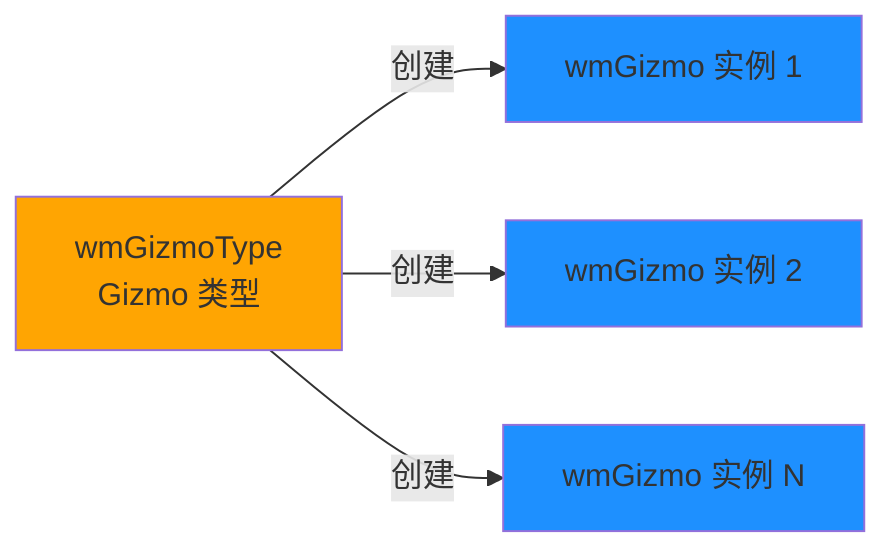
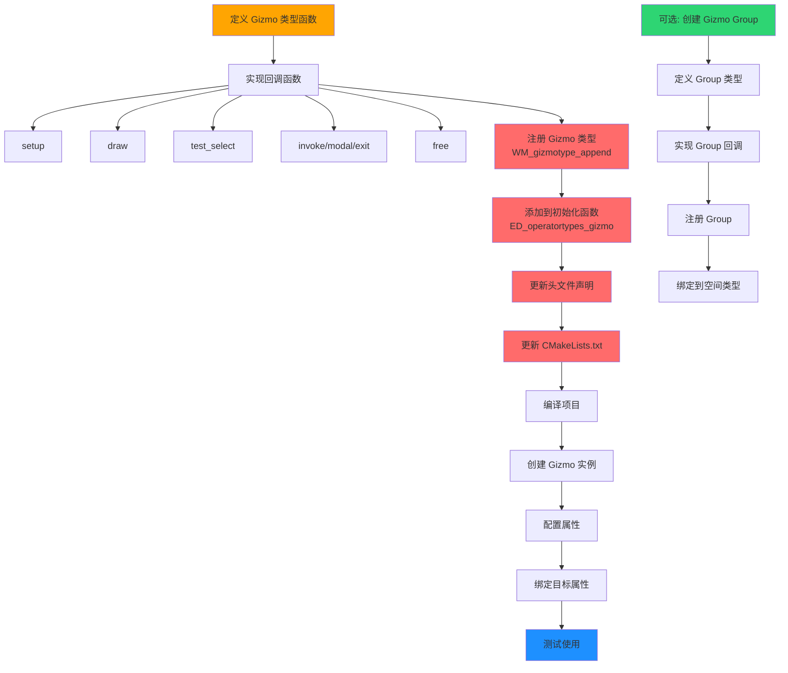

# 新增自定义 Gizmo 完整教程

## 1. 概述

### 1.1 新增 Gizmo 需要修改的地方

创建一个新的自定义 Gizmo 需要修改以下文件：

- <span style="color:#ff6b6b">新建文件</span>：`source/blender/editors/gizmo_library/gizmo_types/custom_gizmo.cc`
- <span style="color:#ffa502">修改文件</span>：`source/blender/editors/gizmo_library/CMakeLists.txt`
- <span style="color:#ffa502">修改文件</span>：`source/blender/editors/space_api/spacetypes.cc:127-136`
- <span style="color:#ffa502">修改文件</span>：`source/blender/editors/include/ED_gizmo_library.hh:24-34`

### 1.2 创建新 Gizmo 的完整流程

1. <span style="color:#2ed573">定义 Gizmo 类型结构</span>
2. <span style="color:#2ed573">实现回调函数</span>
3. <span style="color:#2ed573">注册 Gizmo 类型</span>
4. <span style="color:#2ed573">添加到系统初始化</span>
5. <span style="color:#2ed573">创建并使用 Gizmo 实例</span>

---

## 2. 前置知识

### 2.1 Gizmo 类型 vs Gizmo 实例

<span style="color:#ffa502">Gizmo 类型 (wmGizmoType)</span>：
- 模板/类定义
- 定义了 gizmo 的行为和绘制方式
- 使用 `GIZMO_GT_xxx` 函数注册
- 对应文件：`gizmo_types/xxx_gizmo.cc`

<span style="color:#1e90ff">Gizmo 实例 (wmGizmo)</span>：
- 具体使用对象
- 从类型创建的具体对象
- 通过 `WM_gizmo_new()` 创建
- 可以为多个场景/对象创建多个实例

**关系图**：


### 2.2 必需的回调函数

| 回调函数 | 用途 | 是否必需 |
|---------|------|---------|
| <span style="color:#ff6b6b">`draw`</span> | 绘制 gizmo | **必需** |
| <span style="color:#ffa502">`setup`</span> | 初始化 gizmo | **推荐** |
| <span style="color:#ffa502">`test_select`</span> | 鼠标拾取检测 | **推荐** |
| <span style="color:#2ed573">`modal`</span> | 交互处理（拖动） | 推荐交互式 gizmo |
| <span style="color:#2ed573">`invoke`</span> | 交互开始 | 推荐交互式 gizmo |
| <span style="color:#2ed573">`exit`</span> | 交互结束 | 推荐交互式 gizmo |
| <span style="color:#a4b0be">`free`</span> | 清理资源 | 可选 |

---

## 3. 创建新 Gizmo 的完整步骤

### 步骤 1：定义 Gizmo 类型函数

**定义位置**: `source/blender/editors/gizmo_library/gizmo_types/custom_gizmo.cc:1-60`

创建新文件 `custom_gizmo.cc`，定义 Gizmo 类型：

```cpp
/* SPDX-FileCopyrightText: 2024 Blender Authors
 *
 * SPDX-License-Identifier: GPL-2.0-or-later */

/** \file
 * \ingroup edgizmolib
 *
 * \name Custom Gizmo
 *
 * \brief 自定义 Gizmo 示例
 */

#include "MEM_guardedalloc.h"

#include "BLI_math_matrix.h"
#include "BLI_math_vector.h"

#include "BKE_context.hh"

#include "GPU_immediate.hh"
#include "GPU_immediate_util.hh"
#include "GPU_matrix.hh"
#include "GPU_select.hh"
#include "GPU_state.hh"

#include "RNA_access.hh"
#include "RNA_define.hh"

#include "WM_api.hh"
#include "WM_types.hh"

#include "ED_gizmo_library.hh"
#include "ED_screen.hh"

/* own includes */
#include "../gizmo_library_intern.hh"

/* -------------------------------------------------------------------- */
/** \name Custom Gizmo 结构
 * \{ */

struct CustomGizmo {
    wmGizmo gizmo;
    float custom_data[4];
    void *user_ptr;
    float radius;
};

/** \} */

/* -------------------------------------------------------------------- */
/** \name Custom Gizmo 回调函数
 * \{ */

static void gizmo_custom_setup(wmGizmo *gz)
{
    CustomGizmo *custom = (CustomGizmo *)gz;

    /* 设置默认值 */
    zero_v4(custom->custom_data);
    custom->user_ptr = nullptr;
    custom->radius = 20.0f;

    /* 设置默认颜色 */
    gz->color[0] = 1.0f;
    gz->color[1] = 0.5f;
    gz->color[2] = 0.0f;
    gz->color[3] = 1.0f;
}

static void gizmo_custom_draw(const bContext *C, wmGizmo *gz, const wmGizmoDrawParams *params)
{
    CustomGizmo *custom = (CustomGizmo *)gz;

    /* GPU 设置 */
    GPU_blend(GPU_BLEND_ALPHA);
    GPU_line_width(gz->line_width);

    /* 设置变换矩阵 */
    GPU_matrix_push();
    GPU_matrix_mul(gz->matrix_basis);

    /* 获取颜色 */
    float color[4];
    gizmo_color_get(gz, (gz->state & WM_GIZMO_STATE_HIGHLIGHT) != 0, color);

    /* 设置颜色 */
    immUniformColor4fv(color);

    /* 绘制圆形 */
    GPUVertFormat *format = immVertexFormat();
    uint pos = GPU_vertformat_attr_add(format, "pos", GPU_COMP_F32, 3, GPU_FETCH_FLOAT);

    immBegin(GPU_PRIM_LINE_LOOP, 64);
    const int segments = 64;
    for (int i = 0; i < segments; i++) {
        const float angle = (2.0f * M_PI * i) / segments;
        const float x = custom->radius * cosf(angle);
        const float y = custom->radius * sinf(angle);
        immVertex3f(pos, x, y, 0.0f);
    }
    immEnd();

    /* 绘制中心点 */
    immBegin(GPU_PRIM_POINTS, 1);
    immVertex3f(pos, 0.0f, 0.0f, 0.0f);
    immEnd();

    GPU_matrix_pop();
    GPU_blend(GPU_BLEND_NONE);
}

static void gizmo_custom_draw_select(const bContext *C,
                                      wmGizmo *gz,
                                      int select_id)
{
    CustomGizmo *custom = (CustomGizmo *)gz;

    /* 选择模式绘制 */
    GPU_select_load_id(select_id);

    GPU_matrix_push();
    GPU_matrix_mul(gz->matrix_basis);

    /* 绘制可选择的几何体 */
    GPUVertFormat *format = immVertexFormat();
    uint pos = GPU_vertformat_attr_add(format, "pos", GPU_COMP_F32, 3, GPU_FETCH_FLOAT);

    /* 绘制实心圆用于选择 */
    immUniformColor4f(1.0f, 1.0f, 1.0f, 1.0f);
    immBegin(GPU_PRIM_TRI_FAN, 66);
    immVertex3f(pos, 0.0f, 0.0f, 0.0f);
    const int segments = 64;
    for (int i = 0; i <= segments; i++) {
        const float angle = (2.0f * M_PI * i) / segments;
        const float x = custom->radius * cosf(angle);
        const float y = custom->radius * sinf(angle);
        immVertex3f(pos, x, y, 0.0f);
    }
    immEnd();

    GPU_matrix_pop();
    GPU_select_load_id(-1);
}

static int gizmo_custom_test_select(bContext *C, wmGizmo *gz, const int mval[2])
{
    CustomGizmo *custom = (CustomGizmo *)gz;

    /* 计算鼠标是否在 gizmo 内 */
    float co[2];

    /* 转换鼠标位置到 gizmo 坐标系 */
    if (!gizmo_window_project_2d(C, gz, (const float[2]){mval[0], mval[1]}, 2, true, co)) {
        return -1;
    }

    /* 检测是否在半径内 */
    const float dist_sq = len_squared_v2(co);
    const float radius_sq = custom->radius * custom->radius;

    if (dist_sq <= radius_sq) {
        return 0;  /* 返回 part ID */
    }

    return -1;  /* 未选中 */
}

static wmOperatorStatus gizmo_custom_invoke(
    bContext *C,
    wmGizmo *gz,
    const wmEvent *event)
{
    /* 交互开始时调用 */
    CustomGizmo *custom = (CustomGizmo *)gz;

    /* 初始化交互数据 */
    custom->custom_data[0] = event->mval[0];
    custom->custom_data[1] = event->mval[1];

    return OPERATOR_RUNNING_MODAL;
}

static wmOperatorStatus gizmo_custom_modal(
    bContext *C,
    wmGizmo *gz,
    const wmEvent *event,
    eWM_GizmoFlagTweak tweak_flag)
{
    CustomGizmo *custom = (CustomGizmo *)gz;

    switch (event->type) {
        case MOUSEMOVE:
            /* 更新 gizmo 状态 */
            /* 可以在这里更新属性值 */
            return OPERATOR_RUNNING_MODAL;

        case LEFTMOUSE:
            if (event->val == KM_RELEASE) {
                /* 交互结束 */
                return OPERATOR_FINISHED;
            }
            break;

        case EVT_ESCKEY:
            /* 取消交互 */
            return OPERATOR_CANCELLED;
    }

    return OPERATOR_RUNNING_MODAL;
}

static void gizmo_custom_exit(bContext *C, wmGizmo *gz, const bool cancel)
{
    CustomGizmo *custom = (CustomGizmo *)gz;

    /* 清理交互数据 */
    if (custom->user_ptr) {
        MEM_freeN(custom->user_ptr);
        custom->user_ptr = nullptr;
    }
}

static void gizmo_custom_free(wmGizmo *gz)
{
    CustomGizmo *custom = (CustomGizmo *)gz;

    /* 清理所有资源 */
    if (custom->user_ptr) {
        MEM_freeN(custom->user_ptr);
        custom->user_ptr = nullptr;
    }
}

/** \} */

/* -------------------------------------------------------------------- */
/** \name Custom Gizmo API
 * \{ */

static void GIZMO_GT_custom(wmGizmoType *gzt)
{
    /* 设置类型标识 */
    gzt->idname = "GIZMO_GT_custom";

    /* 设置回调函数 */
    gzt->setup = gizmo_custom_setup;
    gzt->draw = gizmo_custom_draw;
    gzt->draw_select = gizmo_custom_draw_select;
    gzt->test_select = gizmo_custom_test_select;
    gzt->invoke = gizmo_custom_invoke;
    gzt->modal = gizmo_custom_modal;
    gzt->exit = gizmo_custom_exit;
    gzt->free = gizmo_custom_free;

    /* 设置结构体大小 */
    gzt->struct_size = sizeof(CustomGizmo);

    /* 注册 RNA 属性 */
    RNA_def_float(gzt->srna,
                  "offset",
                  0.0f,
                  -FLT_MAX,
                  FLT_MAX,
                  "Offset",
                  "Custom offset value",
                  -FLT_MAX,
                  FLT_MAX);

    RNA_def_float_vector(gzt->srna,
                         "color",
                         4,
                         nullptr,
                         0.0f,
                         1.0f,
                         "Color",
                         "Custom gizmo color",
                         0.0f,
                         1.0f);

    RNA_def_float(gzt->srna,
                  "radius",
                  20.0f,
                  0.0f,
                  FLT_MAX,
                  "Radius",
                  "Gizmo radius",
                  0.0f,
                  FLT_MAX);
}

void ED_gizmotypes_custom()
{
    WM_gizmotype_append(GIZMO_GT_custom);
}

/** \} */
```

---

### 步骤 2：更新 CMakeLists.txt

**定义位置**: `source/blender/editors/gizmo_library/CMakeLists.txt:17-35`

在 `SRC` 列表中添加新文件：

```cmake
set(SRC
  gizmo_draw_utils.cc
  gizmo_geometry.h
  gizmo_library_intern.hh
  gizmo_library_presets.cc
  gizmo_library_utils.cc
  geometry/geom_arrow_gizmo.cc
  geometry/geom_cube_gizmo.cc
  geometry/geom_dial_gizmo.cc
  gizmo_types/arrow3d_gizmo.cc
  gizmo_types/blank3d_gizmo.cc
  gizmo_types/button2d_gizmo.cc
  gizmo_types/cage2d_gizmo.cc
  gizmo_types/cage3d_gizmo.cc
  gizmo_types/custom_gizmo.cc      # 新增
  gizmo_types/dial3d_gizmo.cc
  gizmo_types/move3d_gizmo.cc
  gizmo_types/primitive3d_gizmo.cc
  gizmo_types/snap3d_gizmo.cc
)
```

---

### 步骤 3：添加到初始化函数

**定义位置**: `source/blender/editors/space_api/spacetypes.cc:127-136`

在 `ED_operatortypes_gizmo()` 函数中添加调用：

```cpp
void ED_operatortypes_gizmo()
{
  ED_gizmotypes_button_2d();
  ED_gizmotypes_dial_3d();
  ED_gizmotypes_move_3d();
  ED_gizmotypes_arrow_3d();
  ED_gizmotypes_preselect_3d();
  ED_gizmotypes_primitive_3d();
  ED_gizmotypes_blank_3d();
  ED_gizmotypes_cage_2d();
  ED_gizmotypes_cage_3d();
  ED_gizmotypes_snap_3d();
  ED_gizmotypes_custom();        /* 新增 */
}
```

---

### 步骤 4：更新头文件

**定义位置**: `source/blender/editors/include/ED_gizmo_library.hh:24-34`

添加函数声明：

```cpp
/* initialize gizmos */
void ED_gizmotypes_arrow_3d();
void ED_gizmotypes_button_2d();
void ED_gizmotypes_cage_2d();
void ED_gizmotypes_cage_3d();
void ED_gizmotypes_custom();      /* 新增 */
void ED_gizmotypes_dial_3d();
void ED_gizmotypes_move_3d();
void ED_gizmotypes_facemap_3d();
void ED_gizmotypes_preselect_3d();
void ED_gizmotypes_primitive_3d();
void ED_gizmotypes_blank_3d();
void ED_gizmotypes_snap_3d();
```

---

### 步骤 5：使用新 Gizmo

**创建和使用实例**：

```cpp
#include "ED_gizmo_library.hh"
#include "WM_api.hh"

/* 创建 Gizmo 实例 */
wmGizmoGroup *gzgroup = WM_gizmomap_newgroup(gzmap, "GIZMOGROUP_my_group", nullptr);
wmGizmo *gz = WM_gizmo_new("GIZMO_GT_custom", gzgroup, nullptr);

/* 设置基本属性 */
copy_v4_fl4(gz->color, 1.0f, 0.5f, 0.0f, 1.0f);
gz->line_width = 2.0f;

/* 设置位置矩阵 */
unit_m4(gz->matrix_basis);

/* 设置 RNA 属性 */
RNA_float_set(gz->ptr, "offset", 0.5f);
RNA_float_set(gz->ptr, "radius", 25.0f);

/* 绑定目标属性（可选） */
PointerRNA ptr;
RNA_id_pointer_create(&ob->id, &ptr);
WM_gizmo_target_property_def_rna(gz, "custom_prop", &ptr, "location", 0);
```

---

## 4. 创建 Gizmo Group（可选但推荐）

如果需要为特定编辑器创建一组 gizmo，可以创建 Gizmo Group。

### 4.1 定义 Gizmo Group 类型

**示例代码**：

```cpp
/* -------------------------------------------------------------------- */
/** \name Custom Gizmo Group
 * \{ */

static void GIZMOGROUP_custom_setup(const bContext *C, wmGizmoGroup *gzgroup)
{
    /* 创建并配置 gizmo */
    wmGizmo *gz = WM_gizmo_new("GIZMO_GT_custom", gzgroup, nullptr);

    /* 设置位置 */
    unit_m4(gz->matrix_basis);

    /* 设置颜色 */
    copy_v4_fl4(gz->color, 1.0f, 0.5f, 0.0f, 1.0f);

    /* 设置半径 */
    RNA_float_set(gz->ptr, "radius", 20.0f);

    /* 绑定到对象 */
    Object *ob = CTX_data_active_object(C);
    if (ob) {
        PointerRNA ptr;
        RNA_id_pointer_create(&ob->id, &ptr);
        WM_gizmo_target_property_def_rna(gz, "location", &ptr, "location", 0);
    }
}

static bool GIZMOGROUP_custom_poll(const bContext *C, wmGizmoGroupType *gzgt)
{
    /* 判断是否应该显示此组 */
    Object *ob = CTX_data_active_object(C);
    return (ob != nullptr);
}

static void GIZMOGROUP_custom_refresh(const bContext *C, wmGizmoGroup *gzgroup)
{
    /* 刷新 gizmo 状态 */
    Object *ob = CTX_data_active_object(C);
    wmGizmo *gz = gzgroup->gizmos.first;

    if (ob && gz) {
        /* 更新位置 */
        copy_m4_m4(gz->matrix_basis, ob->object_to_world);
    }
}

static void GIZMOGROUP_custom(wmGizmoGroupType *gzgt)
{
    gzgt->name = "Custom Gizmo Group";
    gzgt->idname = "GIZMOGROUP_custom";
    gzgt->flag |= WM_GIZMOGROUPTYPE_PERSISTENT;
    gzgt->poll = GIZMOGROUP_custom_poll;
    gzgt->setup = GIZMOGROUP_custom_setup;
    gzgt->refresh = GIZMOGROUP_custom_refresh;
}

void ED_gizmogrouptypes_custom()
{
    WM_gizmogrouptype_append(GIZMOGROUP_custom);
}

/** \} */
```

### 4.2 注册 Gizmo Group

在对应编辑器的初始化文件中添加：

```cpp
void ED_spacetypes_custom()
{
    WM_gizmogrouptype_append(GIZMOGROUP_custom);
}
```

### 4.3 绑定到空间类型

```cpp
static void custom_widgets()
{
    wmGizmoMapType_Params params{SPACE_VIEW3D, RGN_TYPE_WINDOW};
    wmGizmoMapType *gzmap_type = WM_gizmomaptype_ensure(&params);
    WM_gizmogrouptype_append_and_link(gzmap_type, GIZMOGROUP_custom);
}
```

---

## 5. 完整工作流程图



---

## 6. 文件修改总结

| 文件路径 | 修改内容 | 颜色标记 |
|---------|---------|---------|
| `gizmo_types/custom_gizmo.cc` | <span style="color:#ff6b6b">新建文件</span>：实现 gizmo | 🆕 |
| `CMakeLists.txt` | <span style="color:#ffa502">添加源文件</span> 到 SRC 列表 | ✏️ |
| `spacetypes.cc:127-136` | <span style="color:#ffa502">添加调用</span> `ED_gizmotypes_custom()` | ✏️ |
| `ED_gizmo_library.hh:24-34` | <span style="color:#ffa502">添加声明</span> `ED_gizmotypes_custom()` | ✏️ |

---

## 7. 回调函数详解

### 7.1 `setup` - 初始化回调

**定义位置**: `custom_gizmo.cc:65-78`

```cpp
static void gizmo_custom_setup(wmGizmo *gz)
{
    CustomGizmo *custom = (CustomGizmo *)gz;

    /* 设置默认值 */
    zero_v4(custom->custom_data);
    custom->user_ptr = nullptr;
    custom->radius = 20.0f;

    /* 设置默认颜色 */
    gz->color[0] = 1.0f;
    gz->color[1] = 0.5f;
    gz->color[2] = 0.0f;
    gz->color[3] = 1.0f;
}
```

**用途**：
- 在 gizmo 实例创建时调用
- 初始化自定义数据
- 设置默认属性值

### 7.2 `draw` - 绘制回调

**定义位置**: `custom_gizmo.cc:80-113`

```cpp
static void gizmo_custom_draw(const bContext *C,
                              wmGizmo *gz,
                              const wmGizmoDrawParams *params)
{
    CustomGizmo *custom = (CustomGizmo *)gz;

    /* GPU 设置 */
    GPU_blend(GPU_BLEND_ALPHA);
    GPU_line_width(gz->line_width);

    /* 设置变换矩阵 */
    GPU_matrix_push();
    GPU_matrix_mul(gz->matrix_basis);

    /* 获取颜色（考虑高亮状态） */
    float color[4];
    gizmo_color_get(gz, (gz->state & WM_GIZMO_STATE_HIGHLIGHT) != 0, color);

    /* 设置颜色 */
    immUniformColor4fv(color);

    /* 绘制几何体 */
    /* ... */

    GPU_matrix_pop();
    GPU_blend(GPU_BLEND_NONE);
}
```

**用途**：
- 绘制 gizmo 到屏幕
- 处理高亮状态
- 应用变换矩阵

### 7.3 `draw_select` - 选择模式绘制

**定义位置**: `custom_gizmo.cc:115-145`

```cpp
static void gizmo_custom_draw_select(const bContext *C,
                                      wmGizmo *gz,
                                      int select_id)
{
    /* 选择模式绘制 */
    GPU_select_load_id(select_id);

    /* 绘制可选择的几何体 */
    /* ... */

    GPU_select_load_id(-1);
}
```

**用途**：
- 在选择缓冲区绘制
- 用于鼠标拾取
- 必须调用 `GPU_select_load_id()`

### 7.4 `test_select` - 拾取检测

**定义位置**: `custom_gizmo.cc:147-170`

```cpp
static int gizmo_custom_test_select(bContext *C, wmGizmo *gz, const int mval[2])
{
    CustomGizmo *custom = (CustomGizmo *)gz;

    /* 转换鼠标位置到 gizmo 坐标系 */
    float co[2];
    if (!gizmo_window_project_2d(C, gz, (const float[2]){mval[0], mval[1]}, 2, true, co)) {
        return -1;
    }

    /* 检测是否在半径内 */
    const float dist_sq = len_squared_v2(co);
    const float radius_sq = custom->radius * custom->radius;

    if (dist_sq <= radius_sq) {
        return 0;  /* 返回 part ID */
    }

    return -1;  /* 未选中 */
}
```

**返回值**：
- `>= 0`：选中，返回 part ID
- `-1`：未选中

### 7.5 `invoke` - 交互开始

**定义位置**: `custom_gizmo.cc:172-189`

```cpp
static wmOperatorStatus gizmo_custom_invoke(bContext *C,
                                            wmGizmo *gz,
                                            const wmEvent *event)
{
    CustomGizmo *custom = (CustomGizmo *)gz;

    /* 初始化交互数据 */
    custom->custom_data[0] = event->mval[0];
    custom->custom_data[1] = event->mval[1];

    return OPERATOR_RUNNING_MODAL;
}
```

**返回值**：
- `OPERATOR_RUNNING_MODAL`：开始模态交互
- `OPERATOR_CANCELLED`：取消

### 7.6 `modal` - 交互处理

**定义位置**: `custom_gizmo.cc:191-215`

```cpp
static wmOperatorStatus gizmo_custom_modal(bContext *C,
                                            wmGizmo *gz,
                                            const wmEvent *event,
                                            eWM_GizmoFlagTweak tweak_flag)
{
    switch (event->type) {
        case MOUSEMOVE:
            /* 更新 gizmo 状态 */
            return OPERATOR_RUNNING_MODAL;

        case LEFTMOUSE:
            if (event->val == KM_RELEASE) {
                return OPERATOR_FINISHED;
            }
            break;

        case EVT_ESCKEY:
            return OPERATOR_CANCELLED;
    }

    return OPERATOR_RUNNING_MODAL;
}
```

**返回值**：
- `OPERATOR_RUNNING_MODAL`：继续交互
- `OPERATOR_FINISHED`：交互完成
- `OPERATOR_CANCELLED`：交互取消

### 7.7 `exit` - 交互结束

**定义位置**: `custom_gizmo.cc:217-227`

```cpp
static void gizmo_custom_exit(bContext *C, wmGizmo *gz, const bool cancel)
{
    CustomGizmo *custom = (CustomGizmo *)gz;

    /* 清理交互数据 */
    if (custom->user_ptr) {
        MEM_freeN(custom->user_ptr);
        custom->user_ptr = nullptr;
    }
}
```

**参数**：
- `cancel`：`true` 表示交互被取消，`false` 表示正常结束

### 7.8 `free` - 资源清理

**定义位置**: `custom_gizmo.cc:229-239`

```cpp
static void gizmo_custom_free(wmGizmo *gz)
{
    CustomGizmo *custom = (CustomGizmo *)gz;

    /* 清理所有资源 */
    if (custom->user_ptr) {
        MEM_freeN(custom->user_ptr);
        custom->user_ptr = nullptr;
    }
}
```

**用途**：
- 在 gizmo 实例销毁时调用
- 清理所有分配的资源

---

## 8. RNA 属性定义

在 `GIZMO_GT_custom()` 函数中定义可访问的属性：

```cpp
static void GIZMO_GT_custom(wmGizmoType *gzt)
{
    /* ... */

    /* 定义浮点属性 */
    RNA_def_float(gzt->srna,
                  "offset",
                  0.0f,
                  -FLT_MAX,
                  FLT_MAX,
                  "Offset",
                  "Custom offset value",
                  -FLT_MAX,
                  FLT_MAX);

    /* 定义向量属性 */
    RNA_def_float_vector(gzt->srna,
                         "color",
                         4,
                         nullptr,
                         0.0f,
                         1.0f,
                         "Color",
                         "Custom gizmo color",
                         0.0f,
                         1.0f);

    /* 定义半径属性 */
    RNA_def_float(gzt->srna,
                  "radius",
                  20.0f,
                  0.0f,
                  FLT_MAX,
                  "Radius",
                  "Gizmo radius",
                  0.0f,
                  FLT_MAX);
}
```

**使用方式**：
```cpp
/* 设置属性值 */
RNA_float_set(gz->ptr, "radius", 25.0f);
RNA_float_set(gz->ptr, "offset", 0.5f);

/* 获取属性值 */
float radius = RNA_float_get(gz->ptr, "radius");
float offset = RNA_float_get(gz->ptr, "offset");
```

---

## 9. 测试新 Gizmo

### 9.1 编译项目

```bash
cd E:\blender-git\blender
cmake --build build --config Debug
```

### 9.2 基本测试

创建简单的 Python 测试脚本：

```python
import bpy
from bpy.types import GizmoGroup

class CustomGizmoGroup(GizmoGroup):
    bl_idname = "OBJECT_GGT_custom_gizmo"
    bl_label = "Custom Gizmo"
    bl_space_type = 'VIEW_3D'
    bl_region_type = 'WINDOW'
    bl_options = {'3D', 'PERSISTENT'}

    @classmethod
    def poll(cls, context):
        return context.mode == 'OBJECT' and context.active_object

    def setup(self, context):
        # 创建自定义 gizmo
        gz = self.gizmos.new("GIZMO_GT_custom")

        # 设置属性
        gz.color = (1.0, 0.5, 0.0, 1.0)
        gz.line_width = 2.0

        # 设置位置
        import mathutils
        unit_matrix = mathutils.Matrix()
        gz.matrix_basis = unit_matrix

        # 绑定到对象位置
        ob = context.active_object
        gz.target_set_prop("offset", ob, "location", 0)

bpy.utils.register_class(CustomGizmoGroup)
```

---

## 10. 常见问题与解决方案

### 10.1 Gizmo 不显示

**可能原因**：
1. `draw` 函数未正确实现
2. `WM_GIZMO_HIDDEN` 标志被设置
3. 矩阵变换不正确
4. 颜色 alpha 值为 0

**解决方案**：
```cpp
/* 检查标志 */
if (gz->state & WM_GIZMO_HIDDEN) {
    return;
}

/* 检查颜色 */
if (gz->color[3] <= 0.0f) {
    gz->color[3] = 1.0f;
}

/* 验证矩阵 */
print_m4("matrix_basis", gz->matrix_basis);
```

### 10.2 无法点击

**可能原因**：
1. `test_select` 函数返回值不正确
2. 坐标转换失败
3. 选择区域太小

**解决方案**：
```cpp
/* 添加选择偏差 */
float radius_with_bias = custom->radius + WM_Gizmo_select_bias(true);

/* 验证坐标转换 */
float co[2];
if (gizmo_window_project_2d(C, gz, (const float[2]){mval[0], mval[1]}, 2, true, co)) {
    printf("Projected: (%f, %f)\n", co[0], co[1]);
}
```

### 10.3 交互异常

**可能原因**：
1. `modal` 函数返回值不正确
2. `invoke/exit` 调用时机不对
3. 交互数据管理错误

**解决方案**：
```cpp
/* 确保正确返回值 */
switch (event->type) {
    case MOUSEMOVE:
        /* 持续返回 RUNNING_MODAL */
        return OPERATOR_RUNNING_MODAL;

    case LEFTMOUSE:
        if (event->val == KM_RELEASE) {
            /* 释放时返回 FINISHED */
            return OPERATOR_FINISHED;
        }
        break;

    case EVT_ESCKEY:
        /* ESC 返回 CANCELLED */
        return OPERATOR_CANCELLED;
}

/* 默认返回 RUNNING_MODAL */
return OPERATOR_RUNNING_MODAL;
```

### 10.4 编译错误

**错误示例**：
```
error: 'gizmo_color_get' was not declared in this scope
```

**解决方案**：
确保包含正确的头文件：
```cpp
#include "ED_gizmo_library.hh"
#include "../gizmo_library_intern.hh"
```

### 10.5 运行时崩溃

**可能原因**：
1. 类型转换错误
2. 空指针解引用
3. 内存访问越界

**解决方案**：
```cpp
/* 安全的类型转换 */
CustomGizmo *custom = (CustomGizmo *)gz;
BLI_assert(custom != nullptr);

/* 检查指针 */
if (custom->user_ptr) {
    MEM_freeN(custom->user_ptr);
    custom->user_ptr = nullptr;
}
```

---

## 11. 参考示例

### 11.1 最简单的 Gizmo

**文件**: `gizmo_types/blank3d_gizmo.cc:20-60`

```cpp
static void gizmo_blank_draw(const bContext *C, wmGizmo *gz)
{
    /* 空 draw 函数 */
}

static int gizmo_blank_test_select(bContext *C, wmGizmo *gz, const int mval[2])
{
    return 0;  /* 总是选中 */
}

static void GIZMO_GT_blank_3d(wmGizmoType *gzt)
{
    gzt->idname = "GIZMO_GT_blank_3d";
    gzt->draw = gizmo_blank_draw;
    gzt->test_select = gizmo_blank_test_select;
    gzt->struct_size = sizeof(wmGizmo);
}
```

### 11.2 复杂的交互式 Gizmo

**文件**: `gizmo_types/dial3d_gizmo.cc:51-73`

```cpp
struct DialInteraction {
    struct {
        float mval[2];
        float prop_angle;
    } init;
    struct {
        eWM_GizmoFlagTweak tweak_flag;
        float angle;
    } prev;
    int rotations;
    bool has_drag;
    float angle_increment;
    struct {
        float angle_ofs;
        float angle_delta;
    } output;
};

static wmOperatorStatus gizmo_dial_modal(
    bContext *C,
    wmGizmo *gz,
    const wmEvent *event,
    eWM_GizmoFlagTweak tweak_flag)
{
    /* 复杂的角度计算逻辑 */
    /* ... */
    return OPERATOR_RUNNING_MODAL;
}
```

### 11.3 几何绘制示例

**文件**: `gizmo_library_presets.cc:51-74`

```cpp
static void ed_gizmo_draw_preset_geometry(const wmGizmo *gz,
                                          const float mat[4][4],
                                          int select_id,
                                          const GizmoGeomInfo *info)
{
    const bool is_select = (select_id != -1);
    const bool is_highlight = is_select && (gz->state & WM_GIZMO_STATE_HIGHLIGHT) != 0;

    float color[4];
    gizmo_color_get(gz, is_highlight, color);

    if (is_select) {
        GPU_select_load_id(select_id);
    }

    GPU_matrix_push();
    GPU_matrix_mul(mat);
    wm_gizmo_geometryinfo_draw(info, is_select, color);
    GPU_matrix_pop();

    if (is_select) {
        GPU_select_load_id(-1);
    }
}
```

---

## 12. 高级技巧

### 12.1 使用预设几何体

```cpp
#include "ED_gizmo_library.hh"

/* 使用预设的盒子 */
ED_gizmo_draw_preset_box(gz, gz->matrix_basis, select_id);

/* 使用预设的箭头 */
ED_gizmo_draw_preset_arrow(gz, gz->matrix_basis, axis, select_id);

/* 使用预设的圆形 */
ED_gizmo_draw_preset_circle(gz, gz->matrix_basis, axis, select_id);
```

### 12.2 属性绑定

```cpp
/* 绑定到对象位置 */
PointerRNA ptr;
RNA_id_pointer_create(&ob->id, &ptr);

/* 创建目标属性 */
wmGizmoProperty *gz_prop = WM_gizmo_target_property_def_rna(
    gz, "offset", &ptr, "location", 0);

/* 设置范围 */
WM_gizmo_target_property_range_set(gz, gz_prop, 0.0f, 100.0f);
```

### 12.3 动态更新

```cpp
/* 在 Gizmo Group 中实现 refresh */
static void GIZMOGROUP_custom_refresh(const bContext *C, wmGizmoGroup *gzgroup)
{
    wmGizmo *gz = gzgroup->gizmos.first;
    Object *ob = CTX_data_active_object(C);

    if (ob && gz) {
        /* 更新位置 */
        copy_m4_m4(gz->matrix_basis, ob->object_to_world);

        /* 更新可见性 */
        if (ob->mode != OB_MODE_OBJECT) {
            gz->flag |= WM_GIZMO_HIDDEN;
        }
        else {
            gz->flag &= ~WM_GIZMO_HIDDEN;
        }
    }
}
```

---

## 13. 调试技巧

### 13.1 打印调试信息

```cpp
/* 打印矩阵 */
printf("Matrix basis:\n");
print_m4("", gz->matrix_basis);

/* 打印鼠标位置 */
printf("Mouse: (%d, %d)\n", mval[0], mval[1]);

/* 打印状态 */
printf("State: 0x%x\n", gz->state);
```

### 13.2 可视化调试

```cpp
/* 绘制调试线 */
immUniformColor3f(1.0f, 0.0f, 0.0f);  /* 红色 */
immBegin(GPU_PRIM_LINES, 2);
immVertex3f(pos, 0.0f, 0.0f, 0.0f);
immVertex3f(pos, custom->radius, 0.0f, 0.0f);
immEnd();
```

---

## 14. 总结

创建自定义 Gizmo 的关键步骤：

1. <span style="color:#ff6b6b">定义结构体</span>：包含所有自定义数据
2. <span style="color:#ffa502">实现回调</span>：至少实现 `draw` 和 `test_select`
3. <span style="color:#ffa502">注册类型</span>：使用 `WM_gizmotype_append()`
4. <span style="color:#ffa502">初始化</span>：在 `ED_operatortypes_gizmo()` 中添加调用
5. <span style="color:#2ed573">测试验证</span》：编译并测试功能

### 文件修改检查清单

- [ ] 创建 `gizmo_types/custom_gizmo.cc`
- [ ] 更新 `CMakeLists.txt`
- [ ] 添加到 `spacetypes.cc`
- [ ] 更新头文件 `ED_gizmo_library.hh`
- [ ] 编译项目
- [ ] 创建测试脚本
- [ ] 验证功能

---

## 附录 A：完整文件列表

| 文件 | 行数 | 说明 |
|------|------|------|
| `custom_gizmo.cc` | ~270 | 新的 Gizmo 实现 |
| `CMakeLists.txt` | 17-35 | 添加源文件 |
| `spacetypes.cc` | 127-136 | 添加初始化调用 |
| `ED_gizmo_library.hh` | 24-34 | 添加声明 |

---

## 附录 B：相关数据结构

### wmGizmoType 结构

```cpp
struct wmGizmoType {
    char idname[64];              /* 类型名称 */
    void (*setup)(wmGizmo *);     /* 初始化 */
    void (*draw)(const bContext *, wmGizmo *, const wmGizmoDrawParams *);
    void (*draw_select)(const bContext *, wmGizmo *, int);
    int (*test_select)(bContext *, wmGizmo *, const int[2]);
    wmOperatorStatus (*invoke)(bContext *, wmGizmo *, const wmEvent *);
    wmOperatorStatus (*modal)(bContext *, wmGizmo *, const wmEvent *, eWM_GizmoFlagTweak);
    void (*exit)(bContext *, wmGizmo *, bool);
    void (*free)(wmGizmo *);
    size_t struct_size;           /* 自定义结构体大小 */
    struct StructRNA *srna;       /* RNA 类型 */
};
```

### wmGizmo 结构

```cpp
struct wmGizmo {
    struct wmGizmoType *type;     /* 类型引用 */
    void *interaction_data;      /* 交互数据 */
    float matrix_basis[4][4];     /* 基础矩阵 */
    float matrix_offset[4][4];    /* 偏移矩阵 */
    float color[4];               /* 颜色 */
    int state;                    /* 状态标志 */
    float line_width;            /* 线宽 */
    PointerRNA ptr;               /* RNA 指针 */
};
```

---

**文档结束**
