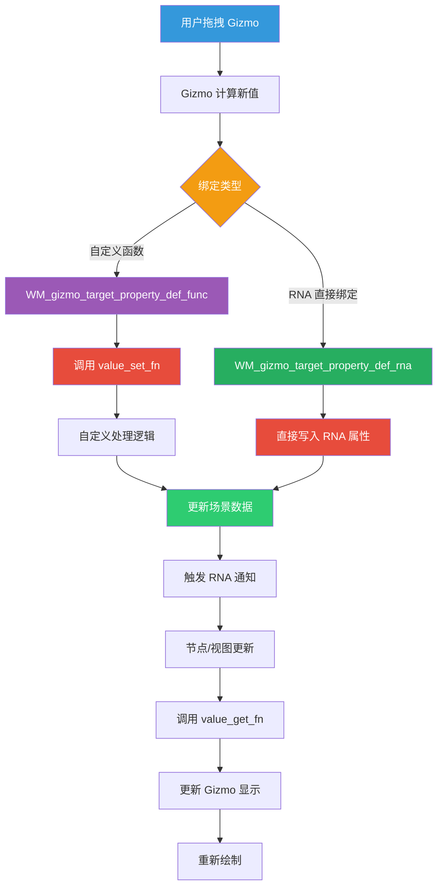

# Gizmo 属性绑定系统

## 1. 概述

Gizmo 属性绑定系统是 Blender 中将用户界面操作与场景数据连接的核心机制。通过属性绑定，Gizmo 可以：

- <span style="color: #3498db;">**双向数据同步**</span>：用户拖拽 Gizmo 时更新场景数据，场景数据变化时更新 Gizmo 显示
- <span style="color: #27ae60;">**自动撤销/重做**</span>：通过 RNA 系统自动支持撤销和重做
- <span style="color: #e67e22;">**类型安全**</span>：通过编译时类型检查确保数据类型匹配

## 2. 属性绑定系统架构

### 2.1 核心数据结构

#### <span style="color: #9b59b6;">wmGizmoProperty 结构</span>

**定义位置**: `source/blender/windowmanager/gizmo/WM_gizmo_types.hh:299-316`

```cpp
struct wmGizmoProperty {
  const wmGizmoPropertyType *type = nullptr;

  PointerRNA ptr = PointerRNA_NULL;
  PropertyRNA *prop = nullptr;
  int index = -1;

  /* Optional functions for converting to/from RNA. */
  struct {
    wmGizmoPropertyFnGet value_get_fn = nullptr;
    wmGizmoPropertyFnSet value_set_fn = nullptr;
    wmGizmoPropertyFnRangeGet range_get_fn = nullptr;
    wmGizmoPropertyFnFree free_fn = nullptr;
    wmGizmoPropertyFnForeachRNAProp foreach_rna_prop_fn = nullptr;
    void *user_data = nullptr;
  } custom_func = {};
};
```

**字段说明**：
- <span style="color: #3498db;">`type`</span>：属性类型描述符
- <span style="color: #3498db;">`ptr`</span>：RNA 指针（用于 RNA 绑定）
- <span style="color: #3498db;">`prop`</span>：RNA 属性（用于 RNA 绑定）
- <span style="color: #3498db;">`index`</span>：数组索引（用于数组属性）
- <span style="color: #27ae60;">`custom_func`</span>：自定义回调函数（用于函数绑定）

#### <span style="color: #9b59b6;">wmGizmoPropertyType 结构</span>

**定义位置**: `source/blender/windowmanager/gizmo/WM_gizmo_types.hh:318-329`

```cpp
struct wmGizmoPropertyType {
  wmGizmoPropertyType *next, *prev;
  /** #PropertyType, typically #PROP_FLOAT. */
  int data_type;
  int array_length;

  /** Index within #wmGizmoType. */
  int index_in_type;

  /** Over allocate. */
  char idname[0];
};
```

#### <span style="color: #9b59b6;">wmGizmoPropertyFnParams 结构</span>

**定义位置**: `source/blender/windowmanager/gizmo/wm_gizmo_fn.hh:81-88`

```cpp
struct wmGizmoPropertyFnParams {
  wmGizmoPropertyFnGet value_get_fn;
  wmGizmoPropertyFnSet value_set_fn;
  wmGizmoPropertyFnRangeGet range_get_fn;
  wmGizmoPropertyFnFree free_fn;
  wmGizmoPropertyFnForeachRNAProp foreach_rna_prop_fn;
  void *user_data;
};
```

**回调函数类型定义**（`source/blender/windowmanager/gizmo/wm_gizmo_fn.hh:59-79`）：
```cpp
using wmGizmoPropertyFnGet = void (*)(const wmGizmo *,
                                      wmGizmoProperty *,
                                      void *value);

using wmGizmoPropertyFnSet = void (*)(const wmGizmo *,
                                      wmGizmoProperty *,
                                      const void *value);

using wmGizmoPropertyFnRangeGet = void (*)(const wmGizmo *,
                                           wmGizmoProperty *,
                                           void *range);

using wmGizmoPropertyFnFree = void (*)(const wmGizmo *, wmGizmoProperty *);
```

## 3. 三种绑定方式详解

### 3.1 RNA 直接绑定

#### 原理
- <span style="color: #3498db;">直接将 Gizmo 的属性映射到 RNA 属性</span>
- 自动处理读写、撤销、重做
- 最简单但灵活性有限

#### API 函数

**定义位置**: `source/blender/windowmanager/gizmo/WM_gizmo_api.hh:239-240`

```cpp
void WM_gizmo_target_property_def_rna(
    wmGizmo *gz,
    const char *idname,
    PointerRNA *ptr,
    const char *propname,
    int index);
```

#### 使用示例

##### <span style="color: #e74c3c;">示例1：Glare 节点 Sun Position</span>

**位置**: `source/blender/editors/space_node/node_gizmo.cc:828-832`

```cpp
bNodeSocket *source_input = bke::node_find_socket(*node, SOCK_IN, "Sun Position");
PointerRNA socket_pointer = RNA_pointer_create_discrete(
    reinterpret_cast<ID *>(snode->edittree), &RNA_NodeSocket, source_input);
WM_gizmo_target_property_def_rna(gz, "offset", &socket_pointer, "default_value", -1);
```

##### <span style="color: #e74c3c;">示例2：Corner Pin 节点四个角</span>

**位置**: `source/blender/editors/space_node/node_gizmo.cc:943-954`

```cpp
int i = 0;
for (bNodeSocket *sock = (bNodeSocket *)node->inputs.first; sock && i < 4; sock = sock->next) {
  if (sock->type == SOCK_VECTOR) {
    wmGizmo *gz = cpin_group->gizmos[i++];

    PointerRNA sockptr = RNA_pointer_create_discrete(
        (ID *)snode->edittree, &RNA_NodeSocket, sock);
    WM_gizmo_target_property_def_rna(gz, "offset", &sockptr, "default_value", -1);

    WM_gizmo_set_flag(gz, WM_GIZMO_DRAW_MODAL, true);
  }
}
```

#### 优缺点

| 特性 | 优点 | 缺点 |
|------|------|------|
| <span style="color: #27ae60;">代码简洁</span> | 几行代码完成绑定 | 只能直接映射 |
| <span style="color: #27ae60;">自动撤销</span> | RNA 系统自动支持 | 无法执行复杂转换 |
| <span style="color: #27ae60;">类型安全</span> | 编译时检查 | 灵活性低 |

---

### 3.2 自定义函数绑定

#### 原理
- <span style="color: #3498db;">通过回调函数控制读写逻辑</span>
- 完全自定义数据转换
- 最灵活但代码量最多

#### API 函数

**定义位置**: `source/blender/windowmanager/gizmo/WM_gizmo_api.hh:245-247`

```cpp
void WM_gizmo_target_property_def_func(
    wmGizmo *gz,
    const char *idname,
    const wmGizmoPropertyFnParams *params);
```

#### 参数结构

```cpp
wmGizmoPropertyFnParams params{};
params.value_get_fn = custom_get;    // 读取函数（必需）
params.value_set_fn = custom_set;    // 写入函数（必需）
params.range_get_fn = nullptr;       // 获取范围（可选）
params.free_fn = nullptr;            // 释放函数（可选）
params.user_data = custom_data;      // 用户数据（可选）
```

#### 使用示例

##### <span style="color: #e74c3c;">示例1：Crop 节点矩阵</span>

**绑定代码**：`source/blender/editors/space_node/node_gizmo.cc:446-451`

```cpp
wmGizmoPropertyFnParams params{};
params.value_get_fn = gizmo_node_crop_prop_matrix_get;
params.value_set_fn = gizmo_node_crop_prop_matrix_set;
params.range_get_fn = nullptr;
params.user_data = node;
WM_gizmo_target_property_def_func(gz, "matrix", &params);
```

**get 函数实现**：`source/blender/editors/space_node/node_gizmo.cc:310-328`

```cpp
static void gizmo_node_crop_prop_matrix_get(const wmGizmo *gz,
                                             wmGizmoProperty *gz_prop,
                                             void *value_p)
{
  float (*matrix)[4] = (float (*)[4])value_p;
  BLI_assert(gz_prop->type->array_length == 16);
  NodeBBoxWidgetGroup *crop_group = (NodeBBoxWidgetGroup *)gz->parent_gzgroup->customdata;
  const float2 dims = crop_group->state.dims;
  const float2 offset = crop_group->state.offset;
  const bNode *node = (const bNode *)gz_prop->custom_func.user_data;

  rctf rct;
  node_input_to_rect(node, dims, offset, &rct);

  matrix[0][0] = fabsf(BLI_rctf_size_x(&rct));
  matrix[1][1] = fabsf(BLI_rctf_size_y(&rct));
  matrix[3][0] = (BLI_rctf_cent_x(&rct) - 0.5f) * dims[0];
  matrix[3][1] = (BLI_rctf_cent_y(&rct) - 0.5f) * dims[1];
}
```

**set 函数实现**：`source/blender/editors/space_node/node_gizmo.cc:330-353`

```cpp
static void gizmo_node_crop_prop_matrix_set(const wmGizmo *gz,
                                             wmGizmoProperty *gz_prop,
                                             const void *value_p)
{
  const float (*matrix)[4] = (const float (*)[4])value_p;
  BLI_assert(gz_prop->type->array_length == 16);
  NodeBBoxWidgetGroup *crop_group = (NodeBBoxWidgetGroup *)gz->parent_gzgroup->customdata;
  const float2 dims = crop_group->state.dims;
  const float2 offset = crop_group->state.offset;
  bNode *node = (bNode *)gz_prop->custom_func.user_data;

  rctf rct;
  node_input_to_rect(node, dims, offset, &rct);
  BLI_rctf_resize(&rct, fabsf(matrix[0][0]), fabsf(matrix[1][1]));
  BLI_rctf_recenter(&rct, ((matrix[3][0]) / dims[0]) + 0.5f, ((matrix[3][1]) / dims[1]) + 0.5f);
  rctf rct_isect{};
  rct_isect.xmin = offset.x / dims.x;
  rct_isect.xmax = offset.x / dims.x + 1;
  rct_isect.ymin = offset.y;
  rct_isect.ymax = offset.y / dims.y + 1;
  BLI_rctf_isect(&rct_isect, &rct, &rct);
  node_input_from_rect(node, &rct, dims, offset);
  gizmo_node_bbox_update(crop_group);
}
```

##### <span style="color: #e74c3c;">示例2：Box Mask 节点</span>

**绑定代码**：`source/blender/editors/space_node/node_gizmo.cc:647-652`

```cpp
wmGizmoPropertyFnParams params{};
params.value_get_fn = gizmo_node_box_mask_prop_matrix_get;
params.value_set_fn = gizmo_node_box_mask_prop_matrix_set;
params.range_get_fn = nullptr;
params.user_data = node;
WM_gizmo_target_property_def_func(gz, "matrix", &params);
```

**get 函数实现**：`source/blender/editors/space_node/node_gizmo.cc:476-508`

```cpp
static void gizmo_node_box_mask_prop_matrix_get(const wmGizmo *gz,
                                                 wmGizmoProperty *gz_prop,
                                                 void *value_p)
{
  float (*matrix)[4] = (float (*)[4])value_p;
  BLI_assert(gz_prop->type->array_length == 16);
  NodeBBoxWidgetGroup *mask_group = (NodeBBoxWidgetGroup *)gz->parent_gzgroup->customdata;
  const float2 dims = mask_group->state.dims;
  const float2 offset = mask_group->state.offset;
  const bNode *node = (const bNode *)gz_prop->custom_func.user_data;
  const float aspect = dims.x / dims.y;

  float loc[3], rot[3][3], size[3];
  mat4_to_loc_rot_size(loc, rot, size, matrix);

  const bNodeSocket *rotation_input = bke::node_find_socket(*node, SOCK_IN, "Rotation");
  const float rotation = rotation_input->default_value_typed<bNodeSocketValueFloat>()->value;
  axis_angle_to_mat3_single(rot, 'Z', rotation);

  const bNodeSocket *position_input = bke::node_find_socket(*node, SOCK_IN, "Position");
  const float2 position = position_input->default_value_typed<bNodeSocketValueVector>()->value;
  loc[0] = (position.x - 0.5) * dims.x + offset.x;
  loc[1] = (position.y - 0.5) * dims.y + offset.y;
  loc[2] = 0;

  const bNodeSocket *size_input = bke::node_find_socket(*node, SOCK_IN, "Size");
  const float2 size_value = size_input->default_value_typed<bNodeSocketValueVector>()->value;
  size[0] = size_value.x;
  size[1] = size_value.y * aspect;
  size[2] = 1;

  loc_rot_size_to_mat4(matrix, loc, rot, size);
}
```

**set 函数实现**：`source/blender/editors/space_node/node_gizmo.cc:510-560`

```cpp
static void gizmo_node_box_mask_prop_matrix_set(const wmGizmo *gz,
                                                 wmGizmoProperty *gz_prop,
                                                 const void *value_p)
{
  const float (*matrix)[4] = (const float (*)[4])value_p;
  BLI_assert(gz_prop->type->array_length == 16);
  NodeBBoxWidgetGroup *mask_group = (NodeBBoxWidgetGroup *)gz->parent_gzgroup->customdata;
  const float2 dims = mask_group->state.dims;
  const float2 offset = mask_group->state.offset;
  bNode *node = (bNode *)gz_prop->custom_func.user_data;

  bNodeSocket *position_input = bke::node_find_socket(*node, SOCK_IN, "Position");
  const float2 position = position_input->default_value_typed<bNodeSocketValueVector>()->value;

  bNodeSocket *size_input = bke::node_find_socket(*node, SOCK_IN, "Size");
  const float2 size_value = size_input->default_value_typed<bNodeSocketValueVector>()->value;

  const float aspect = dims.x / dims.y;
  rctf rct;
  rct.xmin = position.x - size_value.x / 2;
  rct.xmax = position.x + size_value.x / 2;
  rct.ymin = position.y - size_value.y / 2;
  rct.ymax = position.y + size_value.y / 2;

  float loc[3];
  float rot[3][3];
  float size[3];
  mat4_to_loc_rot_size(loc, rot, size, matrix);

  float eul[3];

  /* Rotation can't be extracted from matrix when the gizmo width or height is zero. */
  if (size[0] != 0 and size[1] != 0) {
    mat4_to_eul(eul, matrix);
    bNodeSocket *rotation_input = bke::node_find_socket(*node, SOCK_IN, "Rotation");
    rotation_input->default_value_typed<bNodeSocketValueFloat>()->value = eul[2];
  }

  BLI_rctf_resize(&rct, fabsf(size[0]), fabsf(size[1]) / aspect);
  BLI_rctf_recenter(
      &rct, ((loc[0] - offset.x) / dims.x) + 0.5, ((loc[1] - offset.y) / dims.y) + 0.5);

  size_input->default_value_typed<bNodeSocketValueVector>()->value[0] = size[0];
  size_input->default_value_typed<bNodeSocketValueVector>()->value[1] = size[1] / aspect;
  position_input->default_value_typed<bNodeSocketValueVector>()->value[0] = rct.xmin +
                                                                             size_value.x / 2;
  position_input->default_value_typed<bNodeSocketValueVector>()->value[1] = rct.ymin +
                                                                             size_value.y / 2;

  gizmo_node_bbox_update(mask_group);
}
```

##### <span style="color: #e74c3c;">示例3：Split 节点</span>

**绑定代码**：`source/blender/editors/space_node/node_gizmo.cc:1112-1117`

```cpp
wmGizmoPropertyFnParams params{};
params.value_get_fn = gizmo_node_split_prop_matrix_get;
params.value_set_fn = gizmo_node_split_prop_matrix_set;
params.range_get_fn = nullptr;
params.user_data = node;
WM_gizmo_target_property_def_func(gz, "matrix", &params);
```

#### 优缺点

| 特性 | 优点 | 缺点 |
|------|------|------|
| <span style="color: #27ae60;">完全灵活</span> | 可以执行复杂转换 | 代码量多 |
| <span style="color: #27ae60;">可扩展</span> | 可以触发额外操作 | 需手动管理更新 |
| <span style="color: #e74c3c;">撤销支持</span> | 需手动处理 | 需手动处理撤销 |

---

### 3.3 混合方式（Backdrop Transform）

#### 原理
- <span style="color: #3498db;">使用自定义回调</span>
- <span style="color: #3498db;">user_data 指向 SpaceNode</span>
- <span style="color: #3498db;">直接操作编辑器状态</span>

#### 使用示例

**绑定代码**：`source/blender/editors/space_node/node_gizmo.cc:195-200`

```cpp
wmGizmoPropertyFnParams params{};
params.value_get_fn = gizmo_node_backdrop_prop_matrix_get;
params.value_set_fn = gizmo_node_backdrop_prop_matrix_set;
params.range_get_fn = nullptr;
params.user_data = snode;
WM_gizmo_target_property_def_func(cage, "matrix", &params);
```

**get 函数实现**：`source/blender/editors/space_node/node_gizmo.cc:109-120`

```cpp
static void gizmo_node_backdrop_prop_matrix_get(const wmGizmo * /*gz*/,
                                                 wmGizmoProperty *gz_prop,
                                                 void *value_p)
{
  float (*matrix)[4] = (float (*)[4])value_p;
  BLI_assert(gz_prop->type->array_length == 16);
  const SpaceNode *snode = (const SpaceNode *)gz_prop->custom_func.user_data;
  matrix[0][0] = snode->zoom;
  matrix[1][1] = snode->zoom;
  matrix[3][0] = snode->xof;
  matrix[3][1] = snode->yof;
}
```

**set 函数实现**：`source/blender/editors/space_node/node_gizmo.cc:122-132`

```cpp
static void gizmo_node_backdrop_prop_matrix_set(const wmGizmo * /*gz*/,
                                                 wmGizmoProperty *gz_prop,
                                                 const void *value_p)
{
  const float (*matrix)[4] = (const float (*)[4])value_p;
  BLI_assert(gz_prop->type->array_length == 16);
  SpaceNode *snode = (SpaceNode *)gz_prop->custom_func.user_data;
  snode->zoom = matrix[0][0];
  snode->xof = matrix[3][0];
  snode->yof = matrix[3][1];
}
```

#### 特点
- <span style="color: #27ae60;">不涉及节点数据</span>
- <span style="color: #27ae60;">只修改视图状态</span>
- <span style="color: #27ae60;">无需撤销支持</span>（编辑器状态不记录到撤销栈）

## 4. 数据流向图



## 5. 坐标转换详解

### 5.1 归一化坐标系统

#### 概念
- 使用 <span style="color: #3498db;">0.0-1.0</span> 范围的坐标
- 独立于图像分辨率
- 便于相对定位

#### Crop 节点转换

**位置**: `source/blender/editors/space_node/node_gizmo.cc:271-274`

**从图像坐标 → 归一化坐标**：
```cpp
r_rect->xmin = (xmin + offset.x) / dims.x;
r_rect->xmax = (xmin + width + offset.x) / dims.x;
r_rect->ymin = (ymin + offset.y) / dims.y;
r_rect->ymax = (ymin + height + offset.y) / dims.y;
```

**位置**: `source/blender/editors/space_node/node_gizmo.cc:298-301`

**从归一化坐标 → 图像坐标**：
```cpp
const float xmin = rect->xmin * dims.x - offset.x;
const float width = rect->xmax * dims.x - offset.x - xmin;
const float ymin = rect->ymin * dims.y - offset.y;
const float height = rect->ymax * dims.y - offset.y - ymin;
```

### 5.2 矩阵构建与分解

#### 矩阵构建

**位置**: `source/blender/editors/space_node/node_gizmo.cc:507`

```cpp
// 位置 + 旋转 + 缩放 → 4x4 矩阵
loc_rot_size_to_mat4(matrix, loc, rot, size);
```

#### 矩阵分解

**位置**: `source/blender/editors/space_node/node_gizmo.cc:537`

```cpp
// 从矩阵提取位置、旋转、缩放
mat4_to_loc_rot_size(loc, rot, size, matrix);
```

#### 欧拉角提取

**位置**: `source/blender/editors/space_node/node_gizmo.cc:543`

```cpp
float eul[3];
mat4_to_eul(eul, matrix);
// eul[2] 是 Z 轴旋转角度
```

#### 旋转矩阵构建

**位置**: `source/blender/editors/space_node/node_gizmo.cc:493`

```cpp
float rotation = rotation_input->default_value_typed<bNodeSocketValueFloat>()->value;
axis_angle_to_mat3_single(rot, 'Z', rotation);
```

## 6. 更新通知机制

### 6.1 RNA 属性更新

#### 手动触发

**位置**: `source/blender/editors/space_node/node_gizmo.cc:239-243`

```cpp
static void gizmo_node_bbox_update(NodeBBoxWidgetGroup *bbox_group)
{
  RNA_property_update(
      bbox_group->update_data.context, &bbox_group->update_data.ptr, bbox_group->update_data.prop);
}
```

#### 自动触发（RNA 绑定）
- 修改 RNA 属性后自动触发
- 无需手动调用

### 6.2 Gizmo 刷新

#### 触发刷新
```cpp
WM_gizmo_tag_redraw(gz);
```

#### 强制刷新整个 Gizmo 组
```cpp
WM_gizmogroup_tag_refresh(gzgroup);
```

## 7. 属性类型支持

| 数据类型 | Gizmo 属性 | RNA 类型 | 备注 |
|---------|-----------|---------|------|
| <span style="color: #3498db;">`float`</span> | `offset` | `PROP_FLOAT` | 单个浮点数 |
| <span style="color: #3498db;">`float[2]`</span> | `offset` | `PROP_FLOAT` | 2D 向量 |
| <span style="color: #3498db;">`float[3]`</span> | `offset` | `PROP_FLOAT` | 3D 向量 |
| <span style="color: #3498db;">`float[4][4]`</span> | `matrix` | - | 4x4 矩阵（自定义） |
| <span style="color: #3498db;">`int`</span> | `draw_style` | `PROP_ENUM` | 枚举值 |

## 8. 实际完整示例

### 示例：完整实现自定义绑定

```cpp
// 1. 定义数据结构
struct CustomGizmoData {
    float offset[3];
    Object *ob;
};

// 2. 实现 get 函数
static void custom_prop_get(const wmGizmo *gz,
                             wmGizmoProperty *gz_prop,
                             void *value_p)
{
    CustomGizmoData *data = static_cast<CustomGizmoData *>(gz_prop->custom_func.user_data);
    float *offset = static_cast<float *>(value_p);

    // 从对象获取位置
    copy_v3_v3(offset, data->ob->loc);
}

// 3. 实现 set 函数
static void custom_prop_set(const wmGizmo *gz,
                             wmGizmoProperty *gz_prop,
                             const void *value_p)
{
    CustomGizmoData *data = static_cast<CustomGizmoData *>(gz_prop->custom_func.user_data);
    const float *offset = static_cast<const float *>(value_p);

    // 设置对象位置
    copy_v3_v3(data->ob->loc, offset);

    // 触发更新
    WM_event_add_notifier(C, NC_OBJECT | ND_TRANSFORM, data->ob);
}

// 4. 可选：实现 free 函数
static void custom_prop_free(const wmGizmo * /*gz*/,
                              wmGizmoProperty *gz_prop)
{
    CustomGizmoData *data = static_cast<CustomGizmoData *>(gz_prop->custom_func.user_data);
    MEM_delete(data);
}

// 5. 绑定属性
CustomGizmoData *data = MEM_new<CustomGizmoData>(__func__);
data->ob = ob;

wmGizmoPropertyFnParams params{};
params.value_get_fn = custom_prop_get;
params.value_set_fn = custom_prop_set;
params.range_get_fn = nullptr;
params.free_fn = custom_prop_free;
params.user_data = data;

WM_gizmo_target_property_def_func(gz, "offset", &params);
```

## 9. 最佳实践

### 9.1 选择绑定方式

| 场景 | 推荐方式 | 原因 |
|------|---------|------|
| <span style="color: #27ae60;">简单映射</span> | RNA 直接绑定 | 代码简洁，自动撤销 |
| <span style="color: #27ae60;">需要转换</span> | 自定义函数绑定 | 灵活，支持复杂数据转换 |
| <span style="color: #27ae60;">编辑器状态</span> | 混合方式 | 不影响场景数据，无需撤销 |

### 9.2 性能优化

- <span style="color: #e74c3c;">避免在 get 函数中重复计算</span>
- <span style="color: #e74c3c;">使用 user_data 缓存结果</span>
- <span style="color: #e74c3c;">只在必要时触发更新</span>

### 9.3 错误处理

- <span style="color: #e74c3c;">检查指针有效性</span>
- <span style="color: #e74c3c;">处理空值情况</span>
- <span style="color: #e74c3c;">提供合理的默认值</span>

## 10. 常见问题

### Q1: 为什么我的 Gizmo 不更新？

<span style="color: #3498db;">可能原因：</span>

1. <span style="color: #e74c3c;">未调用 value_set_fn</span>
2. <span style="color: #e74c3c;">未触发更新通知</span>
3. <span style="color: #e74c3c;">未调用 WM_gizmo_tag_redraw</span>

<span style="color: #27ae60;">解决方案：</span>

```cpp
// 确保 set 函数正确更新数据
params.value_set_fn = custom_prop_set;

// 确保触发更新通知
RNA_property_update(C, &ptr, prop);

// 确保 Gizmo 刷新
WM_gizmo_tag_redraw(gz);
```

### Q2: 如何实现撤销支持？

<span style="color: #3498db;">两种方式：</span>

1. <span style="color: #27ae60;">RNA 绑定自动支持</span>
2. <span style="color: #27ae60;">自定义绑定需要手动处理</span>

```cpp
// RNA 绑定（自动撤销）
WM_gizmo_target_property_def_rna(gz, "offset", &ptr, "location", -1);

// 自定义绑定（手动撤销）
static void custom_prop_set(const wmGizmo *gz, ...) {
    // 更新数据
    ...

    // 手动触发撤销
    ED_undo_push(C, "Move Object");
}
```

### Q3: 如何限制属性范围？

<span style="color: #3498db;">两种方式：</span>

1. <span style="color: #27ae60;">实现 range_get_fn</span>
2. <span style="color: #27ae60;">使用 RNA 属性的 range 参数</span>

```cpp
// 方式1：实现 range_get_fn
static void custom_range_get(const wmGizmo * /*gz*/,
                              wmGizmoProperty * /*gz_prop*/,
                              void *range)
{
    float *r = static_cast<float *>(range);
    r[0] = 0.0f;  // 最小值
    r[1] = 1.0f;  // 最大值
}

// 方式2：RNA 属性（在 RNA 定义中）
PropertyRNA *prop = RNA_def_float(...);
RNA_def_float_range(prop, 0.0f, 1.0f);
```

## 11. 关键代码位置汇总

| 组件 | 文件路径 | 行号 |
|------|---------|------|
| <span style="color: #3498db;">wmGizmoProperty 结构</span> | `source/blender/windowmanager/gizmo/WM_gizmo_types.hh` | 299-316 |
| <span style="color: #3498db;">wmGizmoPropertyType 结构</span> | `source/blender/windowmanager/gizmo/WM_gizmo_types.hh` | 318-329 |
| <span style="color: #3498db;">wmGizmoPropertyFnParams 结构</span> | `source/blender/windowmanager/gizmo/wm_gizmo_fn.hh` | 81-88 |
| <span style="color: #3498db;">回调函数类型定义</span> | `source/blender/windowmanager/gizmo/wm_gizmo_fn.hh` | 59-79 |
| <span style="color: #3498db;">WM_gizmo_target_property_def_rna</span> | `source/blender/windowmanager/gizmo/WM_gizmo_api.hh` | 239-240 |
| <span style="color: #3498db;">WM_gizmo_target_property_def_func</span> | `source/blender/windowmanager/gizmo/WM_gizmo_api.hh` | 245-247 |
| <span style="color: #27ae60;">Backdrop Transform 示例</span> | `source/blender/editors/space_node/node_gizmo.cc` | 109-200 |
| <span style="color: #27ae60;">Crop 示例</span> | `source/blender/editors/space_node/node_gizmo.cc` | 310-453 |
| <span style="color: #27ae60;">Box Mask 示例</span> | `source/blender/editors/space_node/node_gizmo.cc` | 476-652 |
| <span style="color: #27ae60;">Glare 示例（RNA）</span> | `source/blender/editors/space_node/node_gizmo.cc` | 828-832 |
| <span style="color: #27ae60;">Corner Pin 示例（RNA）</span> | `source/blender/editors/space_node/node_gizmo.cc` | 943-954 |
| <span style="color: #27ae60;">Split 示例</span> | `source/blender/editors/space_node/node_gizmo.cc` | 1017-1117 |

---

<span style="color: #95a5a6; font-size: 0.9em;">*本文档基于 Blender 源代码编写，所有示例代码均来自实际实现。*</span>
