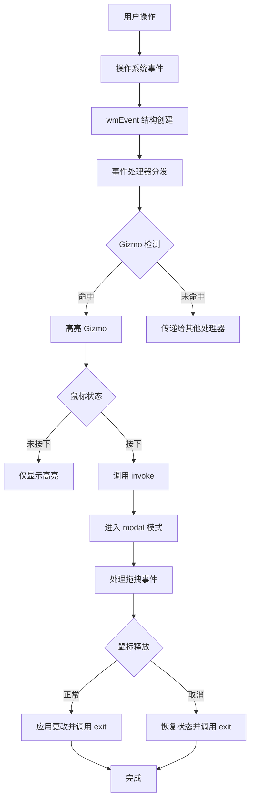
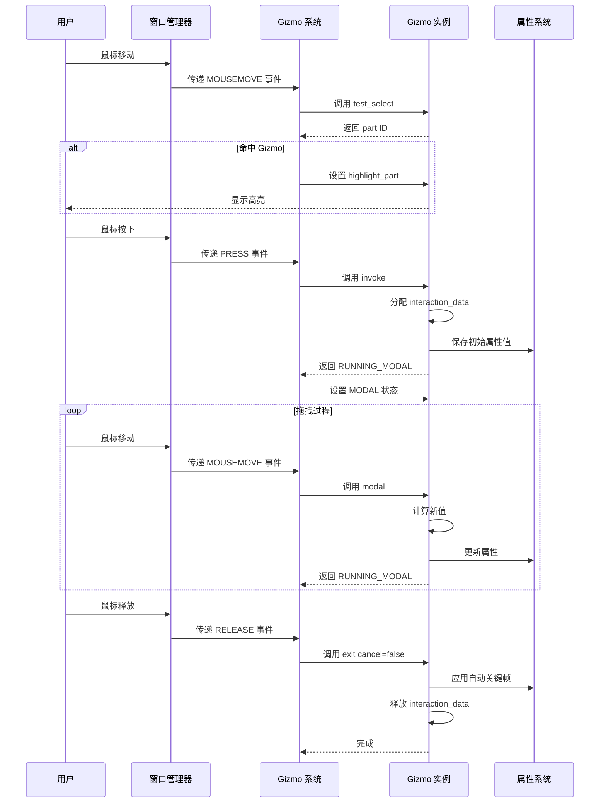
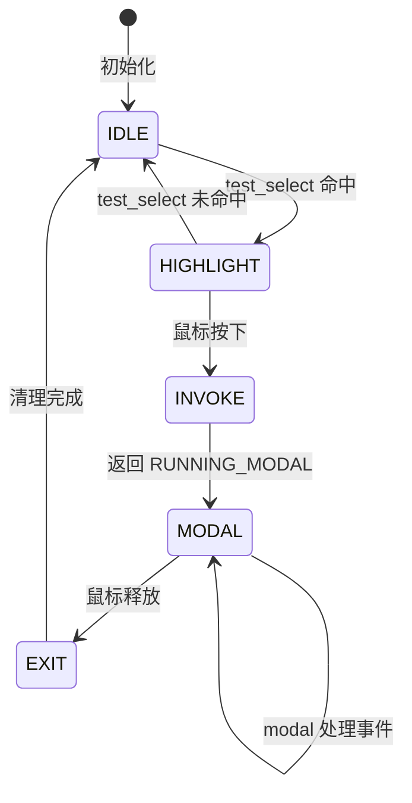
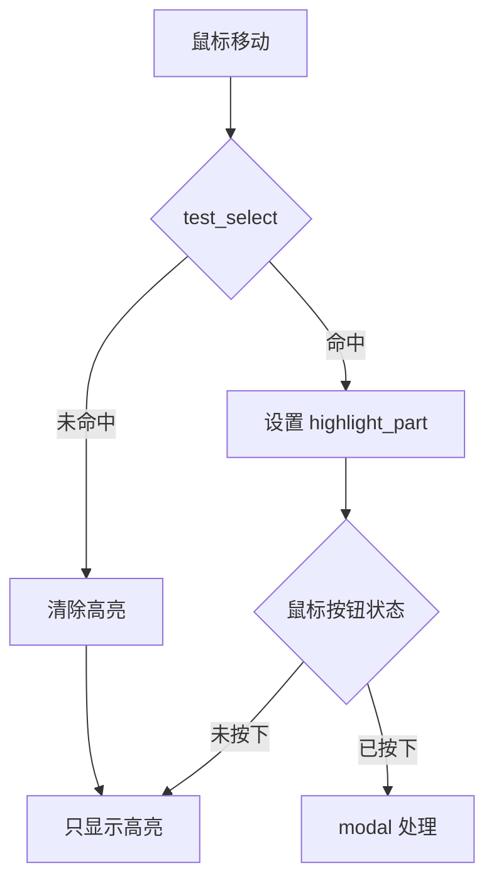
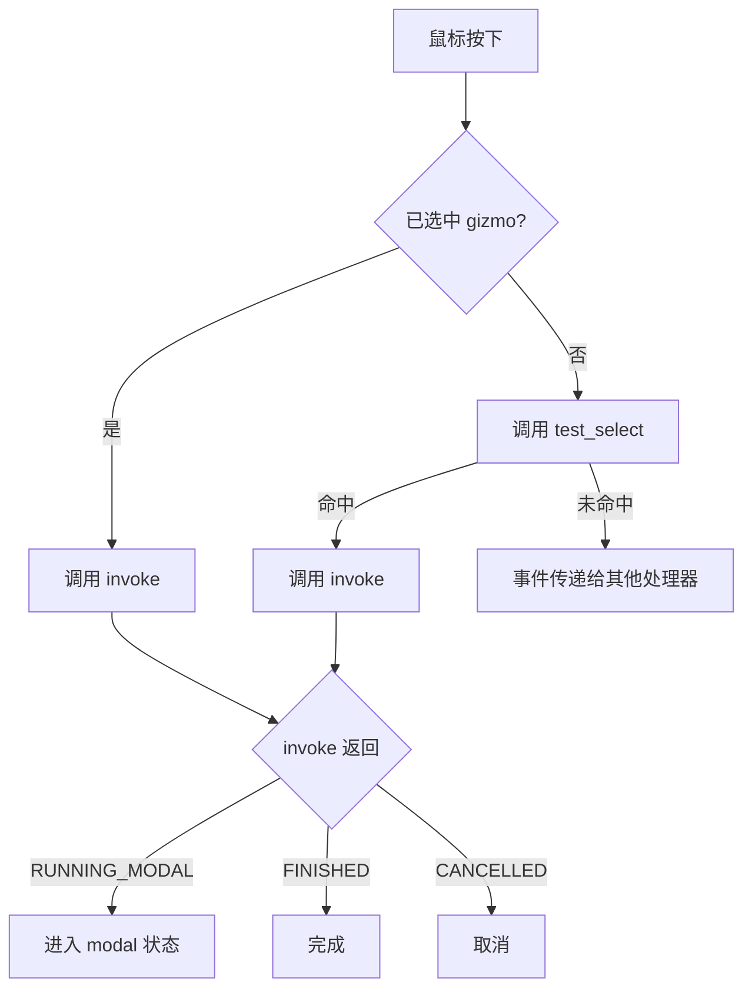
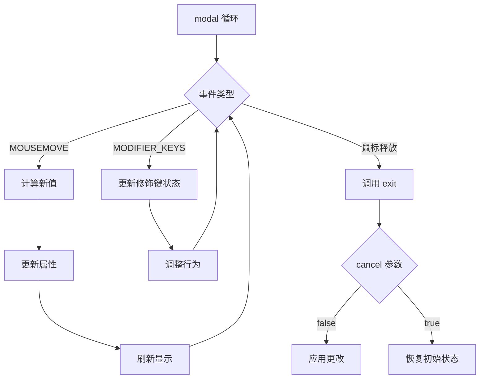
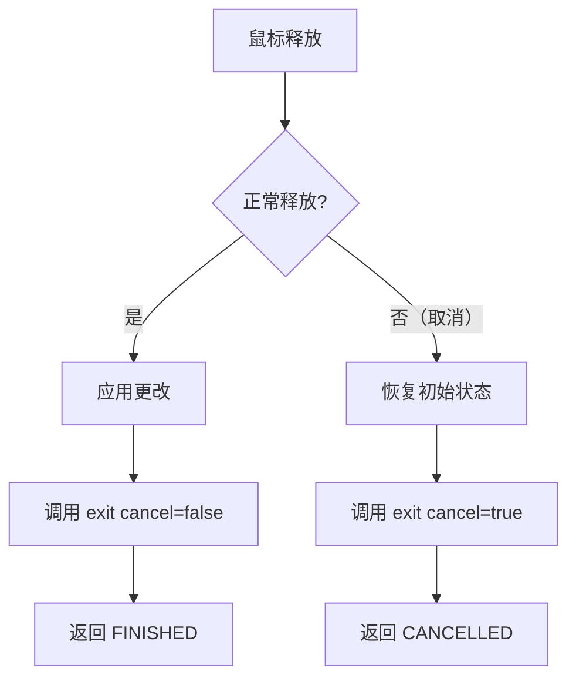

# Gizmo 事件处理机制

## 1. 概述

<span style="color: #00BFFF;">**作用**</span>：Gizmo 事件处理系统是 Blender 中实现交互式 UI 控件的核心机制，负责将用户的鼠标/键盘输入转换为 Gizmo 的状态变化和属性更新。

<span style="color: #00BFFF;">**事件流架构**</span>：用户输入 → `wmEvent` → 事件分发 → Gizmo 检测 → Gizmo 响应 → 属性更新 → 界面刷新

## 2. 事件系统架构

### 2.1 wmEvent 结构

**定义位置**：`source/blender/windowmanager/WM_types.hh:758-840`

`wmEvent` 是事件系统的核心数据结构，包含了所有事件相关信息：

```cpp
struct wmEvent {
  wmEvent *next, *prev;

  /** Event code itself (short, is also in key-map). */
  wmEventType type;
  /** Press, release, scroll-value. */
  short val;
  /** Mouse pointer position, screen coord. */
  int xy[2];
  /** Region relative mouse position (name convention before Blender 2.5). */
  int mval[2];
  /** A single UTF8 encoded character. */
  char utf8_buf[6];

  /** Modifier states: #KM_SHIFT, #KM_CTRL, #KM_ALT, #KM_OSKEY & #KM_HYPER. */
  wmEventModifierFlag modifier;

  /** The direction (for #KM_PRESS_DRAG events only). */
  int8_t direction;

  /** Raw-key modifier (allow using any key as a modifier). */
  wmEventType keymodifier;

  /** Tablet info, available for mouse move and button events. */
  wmTabletData tablet;

  eWM_EventFlag flag;

  /* Custom data. */
  short custom;
  short customdata_free;
  void *customdata;

  /* Previous State. */
  wmEventType prev_type;
  short prev_val;
  int prev_xy[2];

  /* Previous Press State (when `val == KM_PRESS`). */
  wmEventType prev_press_type;
  int prev_press_xy[2];
  wmEventModifierFlag prev_press_modifier;
  wmEventType prev_press_keymodifier;
};
```

<span style="color: #32CD32;">**基本事件类型**</span>：
- `MOUSEMOVE` - 鼠标移动
- `LEFTMOUSE`、`MIDDLEMOUSE`、`RIGHTMOUSE` - 鼠标按钮
- `WHEELUPMOUSE`、`WHEELDOWNMOUSE` - 鼠标滚轮
- `KM_PRESS` - 按下状态
- `KM_RELEASE` - 释放状态

**定义位置**：`source/blender/windowmanager/WM_types.hh:280-297`

<span style="color: #32CD32;">**修饰键类型**</span>：
```cpp
enum wmEventModifierFlag : uint8_t {
  KM_SHIFT = (1 << 0),
  KM_CTRL = (1 << 1),
  KM_ALT = (1 << 2),
  /** Use for Windows-Key on MS-Windows, Command-key on macOS and Super on Linux. */
  KM_OSKEY = (1 << 3),
  /** An additional modifier available on Unix systems. */
  KM_HYPER = (1 << 4),
};
```

### 2.2 事件分发流程



## 3. Gizmo 事件处理生命周期

### 3.1 完整事件流



### 3.2 状态转换



**定义位置**：`source/blender/windowmanager/gizmo/WM_gizmo_types.hh:41-48`

<span style="color: #FF69B4;">**Gizmo 状态枚举**</span>：
```cpp
enum eWM_GizmoFlagState {
  /** While hovered. */
  WM_GIZMO_STATE_HIGHLIGHT = (1 << 0),
  /** While dragging. */
  WM_GIZMO_STATE_MODAL = (1 << 1),
  WM_GIZMO_STATE_SELECT = (1 << 2),
};
```

## 4. 核心处理函数

### 4.1 wmGizmoType 回调函数

#### test_select

<span style="color: #00CED1;">**作用**</span>：测试鼠标是否命中 Gizmo 的某个部分

**定义位置**：`source/blender/windowmanager/gizmo/WM_gizmo_types.hh:360-362`

<span style="color: #00CED1;">**函数签名**</span>：
```cpp
wmGizmoFnTestSelect test_select;
// 实际签名: int test_select(bContext *C, wmGizmo *gz, const int mval[2])
```

<span style="color: #00CED1;">**参数说明**</span>：
- `bContext *C` - Blender 上下文
- `wmGizmo *gz` - Gizmo 实例
- `const int mval[2]` - 区域相对鼠标位置

<span style="color: #00CED1;">**返回值**</span>：
- `>= 0` - 命中的 part ID
- `-1` - 未命中

<span style="color: #00CED1;">**调用时机**</span>：鼠标移动时

**定义位置**：`source/blender/editors/gizmo_library/gizmo_types/cage2d_gizmo.cc:929-1052`

<span style="color: #00CED1;">**实现示例**</span>：
```cpp
static int gizmo_cage2d_test_select(bContext *C, wmGizmo *gz, const int mval[2])
{
  // 1. 获取 Gizmo 屏幕坐标
  float point_local[2];
  float dims[2];
  RNA_float_get_array(gz->ptr, "dimensions", dims);
  const float size_real[2] = {dims[0] / 2.0f, dims[1] / 2.0f};

  // 2. 转换鼠标位置到 Gizmo 坐标系
  if (gizmo_window_project_2d(C, gz, blender::float2(blender::int2(mval)), 2, true, point_local) ==
      false)
  {
    return -1;
  }

  // 3. 测试每个部分（平移、缩放、旋转）
  const int transform_flag = gizmo_cage2d_transform_flag_get(gz);

  if (transform_flag & ED_GIZMO_CAGE_XFORM_FLAG_TRANSLATE) {
    // 测试平移区域
    bool isect = BLI_rctf_isect_pt_v(&r, point_local);
    if (isect) {
      return ED_GIZMO_CAGE2D_PART_TRANSLATE;
    }
  }

  if (transform_flag & (ED_GIZMO_CAGE_XFORM_FLAG_SCALE | ED_GIZMO_CAGE_XFORM_FLAG_SCALE_UNIFORM)) {
    // 测试缩放区域
    // ...
    return ED_GIZMO_CAGE2D_PART_SCALE_MIN_X;
  }

  if (transform_flag & ED_GIZMO_CAGE_XFORM_FLAG_ROTATE) {
    // 测试旋转区域
    if (BLI_rctf_isect_pt_v(&r_rotate, point_local)) {
      return ED_GIZMO_CAGE2D_PART_ROTATE;
    }
  }

  // 4. 未命中任何部分
  return -1;
}
```

#### invoke

<span style="color: #FF8C00;">**作用**</span>：激活 Gizmo，开始交互

**定义位置**：`source/blender/windowmanager/gizmo/WM_gizmo_types.hh:387-389`

<span style="color: #FF8C00;">**函数签名**</span>：
```cpp
wmGizmoFnInvoke invoke;
// 实际签名: wmOperatorStatus invoke(bContext *C, wmGizmo *gz, const wmEvent *event)
```

<span style="color: #FF8C00;">**参数说明**</span>：
- `bContext *C` - Blender 上下文
- `wmGizmo *gz` - Gizmo 实例
- `const wmEvent *event` - 触发事件

<span style="color: #FF8C00;">**返回值**</span>：
- `OPERATOR_RUNNING_MODAL` - 进入模态模式
- `OPERATOR_FINISHED` - 立即完成
- `OPERATOR_CANCELLED` - 取消操作
- `OPERATOR_PASS_THROUGH` - 传递给下一个处理器

<span style="color: #FF8C00;">**调用时机**</span>：鼠标按下时

**定义位置**：`source/blender/editors/gizmo_library/gizmo_types/cage2d_gizmo.cc:1083-1099`

<span style="color: #FF8C00;">**实现示例**</span>：
```cpp
static wmOperatorStatus gizmo_cage2d_invoke(bContext *C, wmGizmo *gz, const wmEvent *event)
{
  // 分配交互数据结构
  RectTransformInteraction *data = MEM_callocN<RectTransformInteraction>("cage_interaction");

  // 保存初始状态
  copy_m4_m4(data->orig_matrix_offset, gz->matrix_offset);
  WM_gizmo_calc_matrix_final_no_offset(gz, data->orig_matrix_final_no_offset);

  // 保存初始鼠标位置
  if (gizmo_window_project_2d(
          C, gz, blender::float2(blender::int2(event->mval)), 2, false, data->orig_mouse) == 0)
  {
    zero_v2(data->orig_mouse);
  }

  // 设置交互数据
  gz->interaction_data = data;

  return OPERATOR_RUNNING_MODAL;
}
```

**定义位置**：`source/blender/editors/gizmo_library/gizmo_types/dial3d_gizmo.cc:598-618`

```cpp
static wmOperatorStatus gizmo_dial_invoke(bContext * /*C*/, wmGizmo *gz, const wmEvent *event)
{
  if (gz->custom_modal) {
    return OPERATOR_RUNNING_MODAL;
  }

  DialInteraction *inter = MEM_callocN<DialInteraction>(__func__);

  // 保存初始鼠标位置
  inter->init.mval[0] = event->mval[0];
  inter->init.mval[1] = event->mval[1];

  // 保存初始属性值
  wmGizmoProperty *gz_prop = WM_gizmo_target_property_find(gz, "offset");
  if (WM_gizmo_target_property_is_valid(gz_prop)) {
    inter->init.prop_angle = WM_gizmo_target_property_float_get(gz, gz_prop);
  }

  gz->interaction_data = inter;

  return OPERATOR_RUNNING_MODAL;
}
```

#### modal

<span style="color: #9370DB;">**作用**</span>：处理模态交互事件

**定义位置**：`source/blender/windowmanager/gizmo/WM_gizmo_types.hh:364-366`

<span style="color: #9370DB;">**函数签名**</span>：
```cpp
wmGizmoFnModal modal;
// 实际签名: wmOperatorStatus modal(bContext *C, wmGizmo *gz, const wmEvent *event, eWM_GizmoFlagTweak tweak_flag)
```

<span style="color: #9370DB;">**参数说明**</span>：
- `bContext *C` - Blender 上下文
- `wmGizmo *gz` - Gizmo 实例
- `const wmEvent *event` - 当前事件
- `eWM_GizmoFlagTweak tweak_flag` - 修饰键标志

<span style="color: #9370DB;">**返回值**</span>：同 invoke

<span style="color: #9370DB;">**调用时机**</span>：拖拽过程中的所有事件

**定义位置**：`source/blender/editors/gizmo_library/gizmo_types/cage2d_gizmo.cc:1157-1365`

```cpp
static wmOperatorStatus gizmo_cage2d_modal(bContext *C,
                                           wmGizmo *gz,
                                           const wmEvent *event,
                                           eWM_GizmoFlagTweak /*tweak_flag*/)
{
  RectTransformInteraction *data = static_cast<RectTransformInteraction *>(gz->interaction_data);
  int transform_flag = RNA_enum_get(gz->ptr, "transform");

  // 处理修饰键
  if ((transform_flag & ED_GIZMO_CAGE_XFORM_FLAG_SCALE_UNIFORM) == 0) {
    const bool use_temp_uniform = (event->modifier & KM_SHIFT) != 0;
    const bool changed = data->use_temp_uniform != use_temp_uniform;
    data->use_temp_uniform = use_temp_uniform;
    if (use_temp_uniform) {
      transform_flag |= ED_GIZMO_CAGE_XFORM_FLAG_SCALE_UNIFORM;
    }
  }

  switch (event->type) {
    case MOUSEMOVE: {
      // 处理鼠标移动
      float point_local[2];
      bool ok = gizmo_window_project_2d(
          C, gz, blender::float2(blender::int2(event->mval)), 2, false, point_local);
      if (!ok) {
        return OPERATOR_RUNNING_MODAL;
      }

      // 根据高亮部分处理不同类型的变换
      if (gz->highlight_part == ED_GIZMO_CAGE2D_PART_TRANSLATE) {
        // 处理平移
        gz->matrix_offset[3][0] = data->orig_matrix_offset[3][0] +
                                  (point_local[0] - data->orig_mouse[0]);
        gz->matrix_offset[3][1] = data->orig_matrix_offset[3][1] +
                                  (point_local[1] - data->orig_mouse[1]);
      }
      else if (gz->highlight_part == ED_GIZMO_CAGE2D_PART_ROTATE) {
        // 处理旋转
        const float angle = BLI_dial_angle(data->dial, test_co);
        // ... 应用旋转变换
      }
      else {
        // 处理缩放
        // ... 计算缩放比例并应用
      }

      // 更新属性
      wmGizmoProperty *gz_prop = WM_gizmo_target_property_find(gz, "matrix");
      if (gz_prop->type != nullptr) {
        WM_gizmo_target_property_float_set_array(C, gz, gz_prop, &gz->matrix_offset[0][0]);
      }

      // 标记重绘
      ED_region_tag_redraw_editor_overlays(CTX_wm_region(C));

      return OPERATOR_RUNNING_MODAL;
    }

    case LEFTMOUSE:
      if (event->val == KM_RELEASE) {
        // 结束交互
        return OPERATOR_FINISHED;
      }
      break;
  }

  return OPERATOR_RUNNING_MODAL;
}
```

**定义位置**：`source/blender/editors/gizmo_library/gizmo_types/dial3d_gizmo.cc:502-547`

```cpp
static wmOperatorStatus gizmo_dial_modal(bContext *C,
                                       wmGizmo *gz,
                                       const wmEvent *event,
                                       eWM_GizmoFlagTweak tweak_flag)
{
  DialInteraction *inter = static_cast<DialInteraction *>(gz->interaction_data);
  if (!inter) {
    return OPERATOR_CANCELLED;
  }

  // 只处理鼠标移动或修饰键变化
  if ((event->type != MOUSEMOVE) && (inter->prev.tweak_flag == tweak_flag)) {
    return OPERATOR_RUNNING_MODAL;
  }

  // 计算角度
  float angle_ofs, angle_delta, angle_increment = 0.0f;
  dial_ghostarc_get_angles(
      gz, event, CTX_wm_region(C), gz->matrix_basis, co_outer, &angle_ofs, &angle_delta);

  // 处理吸附（Control 键）
  if (tweak_flag & WM_GIZMO_TWEAK_SNAP) {
    angle_increment = RNA_float_get(gz->ptr, "incremental_angle");
    angle_delta = roundf(double(angle_delta) / angle_increment) * angle_increment;
  }

  // 处理精确模式（Shift 键）
  if (tweak_flag & WM_GIZMO_TWEAK_PRECISE) {
    angle_increment *= 0.2f;
    angle_delta *= 0.2f;
  }

  if (angle_delta != 0.0f) {
    inter->has_drag = true;
  }

  inter->angle_increment = angle_increment;
  inter->output.angle_delta = angle_delta;
  inter->output.angle_ofs = angle_ofs;

  // 更新属性
  wmGizmoProperty *gz_prop = WM_gizmo_target_property_find(gz, "offset");
  if (WM_gizmo_target_property_is_valid(gz_prop)) {
    WM_gizmo_target_property_float_set(C, gz, gz_prop, inter->init.prop_angle + angle_delta);
  }

  inter->prev.tweak_flag = tweak_flag;

  return OPERATOR_RUNNING_MODAL;
}
```

#### exit

<span style="color: #DC143C;">**作用**</span>：清理交互数据

**定义位置**：`source/blender/windowmanager/gizmo/WM_gizmo_types.hh:390-392`

<span style="color: #DC143C;">**函数签名**</span>：
```cpp
wmGizmoFnExit exit;
// 实际签名: void exit(bContext *C, wmGizmo *gz, const bool cancel)
```

<span style="color: #DC143C;">**参数说明**</span>：
- `bContext *C` - Blender 上下文
- `wmGizmo *gz` - Gizmo 实例
- `const bool cancel` - 是否取消操作

<span style="color: #DC143C;">**调用时机**</span>：模态交互结束时

**定义位置**：`source/blender/editors/gizmo_library/gizmo_types/cage2d_gizmo.cc:1382-1406`

```cpp
static void gizmo_cage2d_exit(bContext *C, wmGizmo *gz, const bool cancel)
{
  RectTransformInteraction *data = static_cast<RectTransformInteraction *>(gz->interaction_data);

  // 清理 Dial 结构
  if (data->dial) {
    BLI_dial_free(data->dial);
    data->dial = nullptr;
  }

  wmGizmoProperty *gz_prop = WM_gizmo_target_property_find(gz, "matrix");

  if (!cancel) {
    // 正常完成：应用自动关键帧
    if (WM_gizmo_target_property_is_valid(gz_prop)) {
      WM_gizmo_target_property_anim_autokey(C, gz, gz_prop);
    }
    return;
  }

  // 取消：恢复初始状态
  if (gz_prop->type != nullptr) {
    WM_gizmo_target_property_float_set_array(C, gz, gz_prop, &data->orig_matrix_offset[0][0]);
  }

  copy_m4_m4(gz->matrix_offset, data->orig_matrix_offset);
}
```

**定义位置**：`source/blender/editors/gizmo_library/gizmo_types/dial3d_gizmo.cc:549-588`

```cpp
static void gizmo_dial_exit(bContext *C, wmGizmo *gz, const bool cancel)
{
  DialInteraction *inter = static_cast<DialInteraction *>(gz->interaction_data);
  if (inter) {
    bool use_reset_value = false;
    float reset_value = 0.0f;

    if (cancel) {
      // 取消：恢复初始值
      wmGizmoProperty *gz_prop = WM_gizmo_target_property_find(gz, "offset");
      if (WM_gizmo_target_property_is_valid(gz_prop)) {
        use_reset_value = true;
        reset_value = inter->init.prop_angle;
      }
    }
    else {
      // 正常完成：处理无拖动点击
      if (inter->has_drag == false) {
        PropertyRNA *prop = RNA_struct_find_property(gz->ptr, "click_value");
        if (RNA_property_is_set(gz->ptr, prop)) {
          use_reset_value = true;
          reset_value = RNA_property_float_get(gz->ptr, prop);
        }
      }
    }

    if (use_reset_value) {
      wmGizmoProperty *gz_prop = WM_gizmo_target_property_find(gz, "offset");
      if (WM_gizmo_target_property_is_valid(gz_prop)) {
        WM_gizmo_target_property_float_set(C, gz, gz_prop, reset_value);
      }
    }

    if (!cancel) {
      wmGizmoProperty *gz_prop = WM_gizmo_target_property_find(gz, "offset");
      if (WM_gizmo_target_property_is_valid(gz_prop)) {
        WM_gizmo_target_property_anim_autokey(C, gz, gz_prop);
      }
    }
  }
}
```

### 4.2 wmGizmoGroupType 回调函数

#### draw_prepare

<span style="color: #20B2AA;">**作用**</span>：绘制前准备

**定义位置**：`source/blender/windowmanager/gizmo/WM_gizmo_types.hh:434-435`

<span style="color: #20B2AA;">**调用时机**</span>：每帧绘制前

```cpp
wmGizmoGroupFnDrawPrepare draw_prepare;
// 实际签名: void draw_prepare(const bContext *C, wmGizmoGroup *gzgroup)
```

#### invoke_prepare

<span style="color: #20B2AA;">**作用**</span>：激活前准备

**定义位置**：`source/blender/windowmanager/gizmo/WM_gizmo_types.hh:436-437`

<span style="color: #20B2AA;">**调用时机**</span>：激活 Gizmo 之前

```cpp
wmGizmoGroupFnInvokePrepare invoke_prepare;
// 实际签名: void invoke_prepare(const bContext *C, wmGizmoGroup *gzgroup)
```

## 5. 事件处理详解

### 5.1 鼠标移动事件



**定义位置**：`source/blender/editors/gizmo_library/gizmo_types/arrow3d_gizmo.cc:274-322`

```cpp
static int gizmo_arrow_test_select(bContext * /*C*/, wmGizmo *gz, const int mval[2])
{
  // 投影到 2D 空间简化像素阈值测试
  ArrowGizmo3D *arrow = (ArrowGizmo3D *)gz;
  const float arrow_length = RNA_float_get(arrow->gizmo.ptr, "length") * head_center_z;

  float matrix_final[4][4];
  WM_gizmo_calc_matrix_final(gz, matrix_final);

  // 箭头在像素空间的坐标
  const float arrow_start[2] = {matrix_final[3][0], matrix_final[3][1]};
  float arrow_end[2];
  {
    float co[3] = {0, 0, arrow_length};
    mul_m4_v3(matrix_final, co);
    copy_v2_v2(arrow_end, co);
  }

  const float scale_final = mat4_to_scale(matrix_final);
  const float head_width = ARROW_SELECT_THRESHOLD_PX * scale_final * head_geo_x;
  const float stem_width = ARROW_SELECT_THRESHOLD_PX * scale_final * stem_geo_x;
  float select_threshold_base = gz->line_width * U.pixelsize;

  const float mval_fl[2] = {float(mval[0]), float(mval[1])};

  // 测试到箭头的距离
  if (len_squared_v2v2(mval_fl, arrow_end) < square_f(select_threshold_base + head_width)) {
    return 0;  // 命中箭头
  }

  // 测试到箭杆的距离
  float co_isect[2];
  const float lambda = closest_to_line_v2(co_isect, mval_fl, arrow_start, arrow_end);
  if (lambda >= 0.0f && lambda <= 1.0f) {
    if (len_squared_v2v2(mval_fl, co_isect) < square_f(select_threshold_base + stem_width)) {
      return 0;  // 命中箭杆
    }
  }

  return -1;  // 未命中
}
```

### 5.2 鼠标按下事件



### 5.3 拖拽事件（Modal）



**定义位置**：`source/blender/editors/gizmo_library/gizmo_types/arrow3d_gizmo.cc:328-430`

```cpp
static wmOperatorStatus gizmo_arrow_modal(bContext *C,
                                       wmGizmo *gz,
                                       const wmEvent *event,
                                       eWM_GizmoFlagTweak tweak_flag)
{
  GizmoInteraction *inter = static_cast<GizmoInteraction *>(gz->interaction_data);

  // 可能发生：另一个 modal 操作符完成
  if (inter == nullptr) {
    return OPERATOR_CANCELLED;
  }

  // 只处理鼠标移动事件
  if (event->type != MOUSEMOVE) {
    return OPERATOR_RUNNING_MODAL;
  }

  ArrowGizmo3D *arrow = (ArrowGizmo3D *)gz;
  ARegion *region = CTX_wm_region(C);
  RegionView3D *rv3d = static_cast<RegionView3D *>(region->regiondata);

  float offset[3];
  float facdir = 1.0f;

  // 计算 3D 投影
  struct {
    blender::float2 mval;
    float ray_origin[3], ray_direction[3];
    float location[3];
  } proj[2] = {};

  proj[0].mval = {UNPACK2(inter->init_mval)};
  proj[1].mval = {float(event->mval[0]), float(event->mval[1])};

  float arrow_co[3];
  float arrow_no[3];
  copy_v3_v3(arrow_co, inter->init_matrix_basis[3]);
  normalize_v3_v3(arrow_no, arrow->gizmo.matrix_basis[2]);

  // 计算偏移
  // ...

  // 更新属性
  wmGizmoProperty *gz_prop = WM_gizmo_target_property_find(gz, "offset");
  if (WM_gizmo_target_property_is_valid(gz_prop)) {
    WM_gizmo_target_property_float_set(C, gz, gz_prop, value);
  }

  return OPERATOR_RUNNING_MODAL;
}
```

### 5.4 鼠标释放事件



## 6. 修饰键处理

### 6.1 修饰键检测

**定义位置**：`source/blender/windowmanager/WM_types.hh:280-297`

```cpp
const bool shift_pressed = (event->modifier & KM_SHIFT) != 0;
const bool ctrl_pressed = (event->modifier & KM_CTRL) != 0;
const bool alt_pressed = (event->modifier & KM_ALT) != 0;
```

### 6.2 状态变更检测

**定义位置**：`source/blender/editors/gizmo_library/gizmo_types/cage2d_gizmo.cc:1164-1169`

```cpp
const bool use_temp_uniform = (event->modifier & KM_SHIFT) != 0;
const bool changed = data->use_temp_uniform != use_temp_uniform;
data->use_temp_uniform = use_temp_uniform;
if (use_temp_uniform) {
  transform_flag |= ED_GIZMO_CAGE_XFORM_FLAG_SCALE_UNIFORM;
}

if (changed) {
  /* 总是刷新 */
}
```

### 6.3 tweak_flag 参数

**定义位置**：`source/blender/windowmanager/gizmo/WM_gizmo_types.hh:195-201`

```cpp
enum eWM_GizmoFlagTweak {
  /** Drag with extra precision (Shift). */
  WM_GIZMO_TWEAK_PRECISE = (1 << 0),
  /** Drag with snap enabled (Control). */
  WM_GIZMO_TWEAK_SNAP = (1 << 1),
};
```

<span style="color: #FF6347;">**使用示例**</span>：

**定义位置**：`source/blender/editors/gizmo_library/gizmo_types/dial3d_gizmo.cc:522-529`

```cpp
// 处理吸附（Control 键）
if (tweak_flag & WM_GIZMO_TWEAK_SNAP) {
  angle_increment = RNA_float_get(gz->ptr, "incremental_angle");
  angle_delta = roundf(double(angle_delta) / angle_increment) * angle_increment;
}

// 处理精确模式（Shift 键）
if (tweak_flag & WM_GIZMO_TWEAK_PRECISE) {
  angle_increment *= 0.2f;
  angle_delta *= 0.2f;
}
```

## 7. 操作状态码

| 常量 | 值 | 含义 |
|------|-----|------|
| <span style="color: #00FA9A;">OPERATOR_RUNNING_MODAL</span> | 1 | 模态操作继续 |
| <span style="color: #DC143C;">OPERATOR_CANCELLED</span> | 2 | 操作取消 |
| <span style="color: #00BFFF;">OPERATOR_FINISHED</span> | 3 | 操作完成 |
| <span style="color: #9370DB;">OPERATOR_PASS_THROUGH</span> | 4 | 事件传递给下一个处理器 |

## 8. 交互数据管理

### 8.1 interaction_data 结构

**定义位置**：`source/blender/windowmanager/gizmo/WM_gizmo_types.hh:277-278`

```cpp
/** Data used during interaction. */
void *interaction_data;
```

<span style="color: #00CED1;">**Cage2D 示例**</span>：

**定义位置**：`source/blender/editors/gizmo_library/gizmo_types/cage2d_gizmo.cc:1056-1064`

```cpp
struct RectTransformInteraction {
  float orig_mouse[2];
  float orig_matrix_offset[4][4];
  float orig_matrix_final_no_offset[4][4];
  Dial *dial;
  bool use_temp_uniform;
};
```

<span style="color: #00CED1;">**Dial3D 示例**</span>：

**定义位置**：`source/blender/editors/gizmo_library/gizmo_types/dial3d_gizmo.cc:51-73`

```cpp
struct DialInteraction {
  struct {
    float mval[2];
    /* Only for when using properties. */
    float prop_angle;
  } init;
  struct {
    /* Cache the last angle to detect rotations bigger than -/+ PI. */
    eWM_GizmoFlagTweak tweak_flag;
    float angle;
  } prev;

  /* Number of full rotations. */
  int rotations;
  bool has_drag;
  float angle_increment;

  /* Final output values, used for drawing. */
  struct {
    float angle_ofs;
    float angle_delta;
  } output;
};
```

<span style="color: #00CED1;">**Arrow3D 示例**</span>：

**定义位置**：`source/blender/editors/gizmo_library/gizmo_types/arrow3d_gizmo.cc:63-66`

```cpp
struct ArrowGizmoInteraction {
  GizmoInteraction inter;
  float init_arrow_length;
};
```

### 8.2 分配与释放

```cpp
// invoke 中分配
CustomInteraction *data = MEM_callocN<CustomInteraction>(__func__);
gz->interaction_data = data;

// exit 中释放
MEM_freeN(data);
gz->interaction_data = nullptr;
```

## 9. 事件过滤与优先级

### 9.1 Gizmo 事件优先级

<span style="color: #FF69B4;">**处理逻辑**</span>：

```cpp
// 高优先级：Modal Gizmo
if (modal_gizmo) {
  modal_gizmo->modal(...);
  return;
}

// 中优先级：Highlighted Gizmo
if (highlighted_gizmo) {
  highlighted_gizmo->invoke(...);
  return;
}

// 低优先级：其他 Gizmo
```

### 9.2 WM_GIZMO_EVENT_HANDLE_ALL

**定义位置**：`source/blender/windowmanager/gizmo/WM_gizmo_types.hh:84-87`

```cpp
enum eWM_GizmoFlag {
  // ...
  /** Don't pass through events to other handlers
   * (allows click/drag not to have its events stolen by press events in other keymaps). */
  WM_GIZMO_EVENT_HANDLE_ALL = (1 << 11),
  // ...
};
```

<span style="color: #32CD32;">**作用**</span>：不将事件传递给其他处理器

<span style="color: #32CD32;">**使用场景**</span>：需要完全控制交互

## 10. 实际示例分析

### 示例1：Dial Gizmo 旋转

**文件位置**：`source/blender/editors/gizmo_library/gizmo_types/dial3d_gizmo.cc`

<span style="color: #00CED1;">**完整流程**</span>：

1. **invoke** (`dial3d_gizmo.cc:598-618`)：
   - 分配 `DialInteraction` 结构
   - 保存初始鼠标位置
   - 保存初始角度属性值
   - 返回 `OPERATOR_RUNNING_MODAL`

2. **modal** (`dial3d_gizmo.cc:502-547`)：
   - 计算鼠标位置变化对应的角度变化
   - 处理修饰键：
     - `WM_GIZMO_TWEAK_SNAP` - 角度吸附
     - `WM_GIZMO_TWEAK_PRECISE` - 精确模式（0.2 倍速度）
   - 更新属性值
   - 继续返回 `RUNNING_MODAL`

3. **exit** (`dial3d_gizmo.cc:549-588`)：
   - 如果取消，恢复初始角度值
   - 如果正常完成且无拖动，使用 `click_value`
   - 应用自动关键帧（如果需要）

### 示例2：Cage 2D 缩放

**文件位置**：`source/blender/editors/gizmo_library/gizmo_types/cage2d_gizmo.cc`

<span style="color: #00CED1;">**完整流程**</span>：

1. **test_select** (`cage2d_gizmo.cc:929-1052`)：
   - 将鼠标位置投影到 Gizmo 坐标系
   - 测试平移区域
   - 测试缩放区域（包括边和角）
   - 测试旋转区域
   - 返回命中的 part ID

2. **invoke** (`cage2d_gizmo.cc:1083-1099`)：
   - 分配 `RectTransformInteraction` 结构
   - 保存初始矩阵
   - 保存初始鼠标位置
   - 返回 `OPERATOR_RUNNING_MODAL`

3. **modal** (`cage2d_gizmo.cc:1157-1365`)：
   - 处理修饰键（Shift 临时启用均匀缩放）
   - 根据 `highlight_part` 判断操作类型：
     - `TRANSLATE` - 计算平移偏移
     - `ROTATE` - 计算旋转角度
     - `SCALE_*` - 计算缩放比例
   - 更新矩阵属性
   - 标记区域重绘

4. **exit** (`cage2d_gizmo.cc:1382-1406`)：
   - 清理 Dial 结构
   - 如果取消，恢复初始矩阵
   - 如果正常完成，应用自动关键帧

### 示例3：Arrow Gizmo 拖拽

**文件位置**：`source/blender/editors/gizmo_library/gizmo_types/arrow3d_gizmo.cc`

<span style="color: #00CED1;">**完整流程**</span>：

1. **test_select** (`arrow3d_gizmo.cc:274-322`)：
   - 投影箭头到 2D 空间
   - 测试到箭头的距离
   - 测试到箭杆的距离
   - 返回 0（命中）或 -1（未命中）

2. **invoke** (`arrow3d_gizmo.cc:434-459`)：
   - 分配 `ArrowGizmoInteraction` 结构
   - 保存初始属性值
   - 保存初始偏移
   - 保存初始鼠标位置和矩阵
   - 保存箭头初始长度
   - 返回 `OPERATOR_RUNNING_MODAL`

3. **modal** (`arrow3d_gizmo.cc:328-430`)：
   - 将鼠标位置投影到 3D 空间
   - 计算沿箭头方向的偏移
   - 更新属性值
   - 返回 `RUNNING_MODAL`

4. **exit** (`arrow3d_gizmo.cc:470-505`)：
   - 如果取消，恢复初始值
   - 如果正常完成，更新偏移并应用自动关键帧

## 11. 常见问题与调试

### 11.1 Gizmo 不响应

<span style="color: #DC143C;">**可能原因**</span>：

1. **test_select 未正确实现**
   ```cpp
   // 确保返回正确的 part ID
   static int my_test_select(bContext *C, wmGizmo *gz, const int mval[2])
   {
     // ... 测试逻辑
     return part_id;  // 必须返回 >= 0 表示命中
   }
   ```

2. **坐标转换错误**
   ```cpp
   // 确保使用正确的投影函数
   gizmo_window_project_2d(C, gz, mval_fl, ...);
   ```

3. **selection_bias 设置不当**
   ```cpp
   // 设置 Gizmo 优先级
   gz->select_bias = 0.1f;
   ```

### 11.2 交互异常

<span style="color: #DC143C;">**可能原因**</span>：

1. **modal 返回值错误**
   ```cpp
   // 确保在交互期间始终返回 RUNNING_MODAL
   if (event->type == MOUSEMOVE) {
     // ... 处理逻辑
     return OPERATOR_RUNNING_MODAL;  // 必须！
   }
   ```

2. **交互数据管理错误**
   ```cpp
   // invoke 中必须分配
   MyInteraction *data = MEM_callocN<MyInteraction>(__func__);
   gz->interaction_data = data;

   // exit 中必须释放
   MEM_freeN(data);
   gz->interaction_data = nullptr;
   ```

3. **exit 未正确清理**
   ```cpp
   static void my_exit(bContext *C, wmGizmo *gz, const bool cancel)
   {
     MyInteraction *data = (MyInteraction *)gz->interaction_data;

     if (cancel) {
       // 恢复初始状态
       WM_gizmo_target_property_float_set_array(C, gz, gz_prop, initial_values);
     }

     // 清理资源
     MEM_freeN(data);
     gz->interaction_data = nullptr;
   }
   ```

### 11.3 性能问题

<span style="color: #DC143C;">**优化建议**</span>：

1. **避免在 modal 中重复计算**
   ```cpp
   // 在 invoke 中预先计算
   data->precomputed_value = compute_expensive_operation();

   // 在 modal 中直接使用
   if (event->type == MOUSEMOVE) {
     result = data->precomputed_value + event_delta;
   }
   ```

2. **使用缓存的初始值**
   ```cpp
   struct MyInteraction {
     float initial_value;
     // ...
   };

   // invoke 中保存
   data->initial_value = current_value;

   // modal 中使用
   delta = current_value - data->initial_value;
   ```

3. **最小化更新通知**
   ```cpp
   // 只在值实际改变时通知
   if (fabsf(new_value - old_value) > FLT_EPSILON) {
     WM_gizmo_target_property_float_set(C, gz, gz_prop, new_value);
     ED_region_tag_redraw_editor_overlays(CTX_wm_region(C));
   }
   ```

---

## 附录：关键代码位置索引

| 功能 | 文件 | 行号 |
|------|------|------|
| wmEvent 结构 | WM_types.hh | 758-840 |
| 修饰键枚举 | WM_types.hh | 280-297 |
| Gizmo 状态枚举 | WM_gizmo_types.hh | 41-48 |
| tweak_flag 枚举 | WM_gizmo_types.hh | 195-201 |
| Cage2D test_select | cage2d_gizmo.cc | 929-1052 |
| Cage2D invoke | cage2d_gizmo.cc | 1083-1099 |
| Cage2D modal | cage2d_gizmo.cc | 1157-1365 |
| Cage2D exit | cage2d_gizmo.cc | 1382-1406 |
| Dial3D invoke | dial3d_gizmo.cc | 598-618 |
| Dial3D modal | dial3d_gizmo.cc | 502-547 |
| Dial3D exit | dial3d_gizmo.cc | 549-588 |
| Arrow3D test_select | arrow3d_gizmo.cc | 274-322 |
| Arrow3D invoke | arrow3d_gizmo.cc | 434-459 |
| Arrow3D modal | arrow3d_gizmo.cc | 328-430 |
| Arrow3D exit | arrow3d_gizmo.cc | 470-505 |
