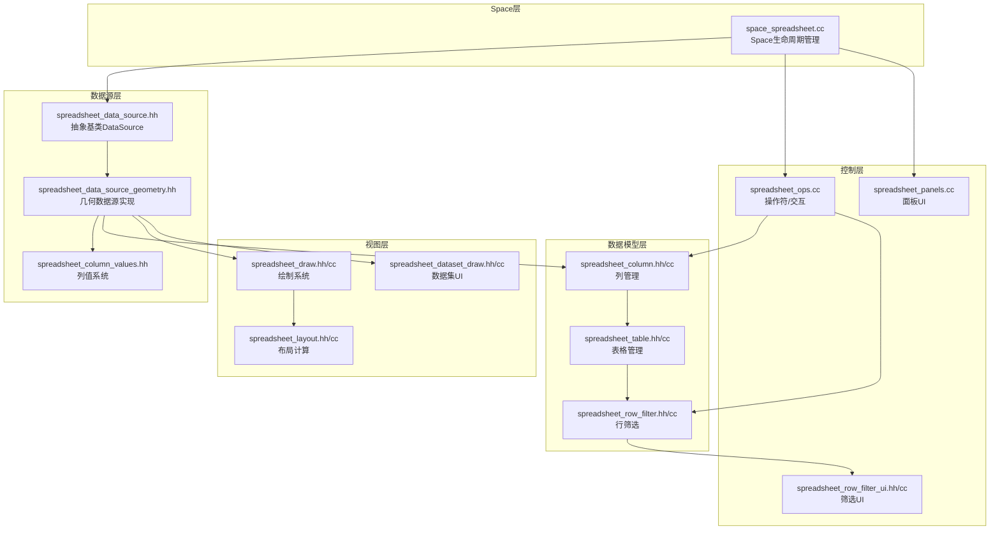
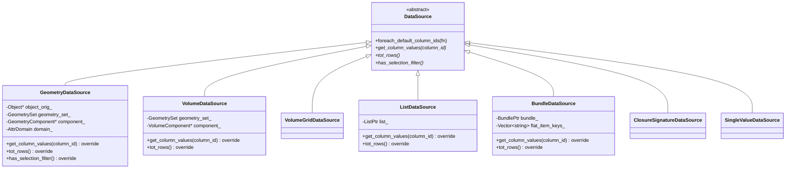
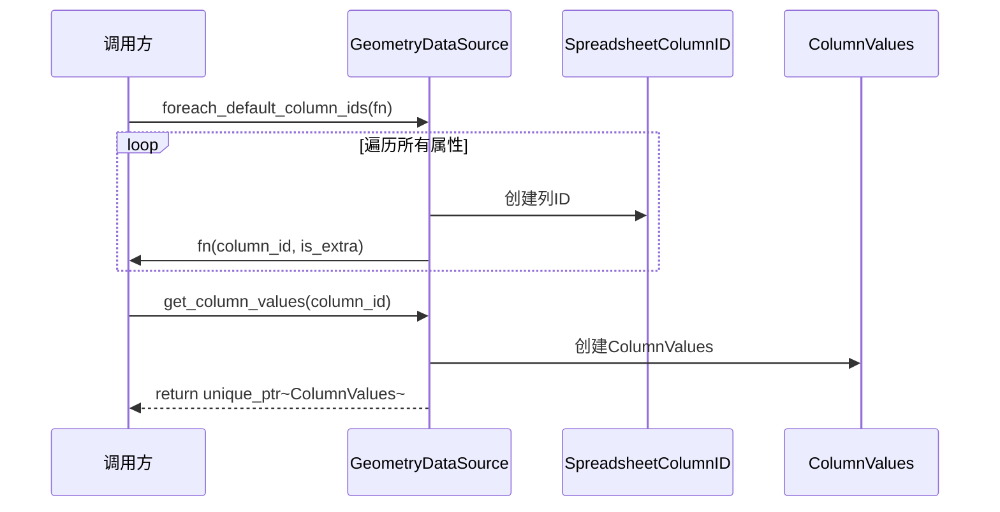
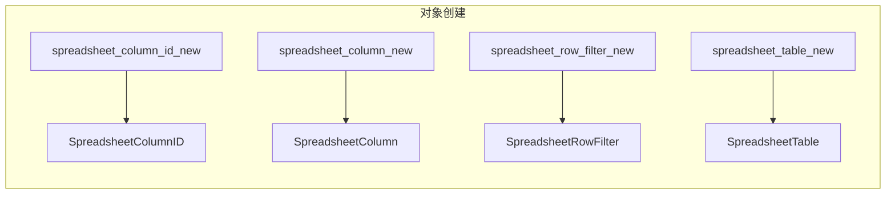
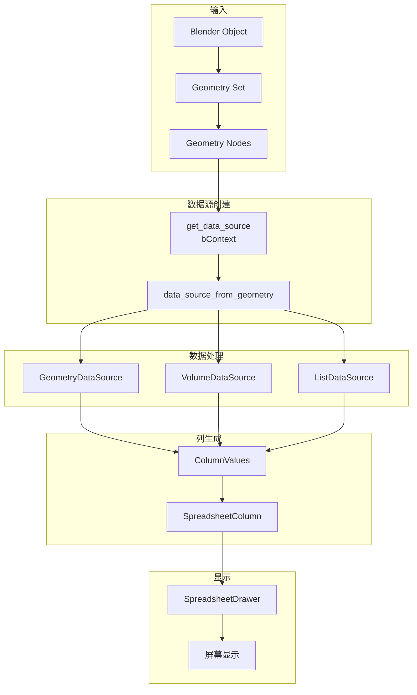
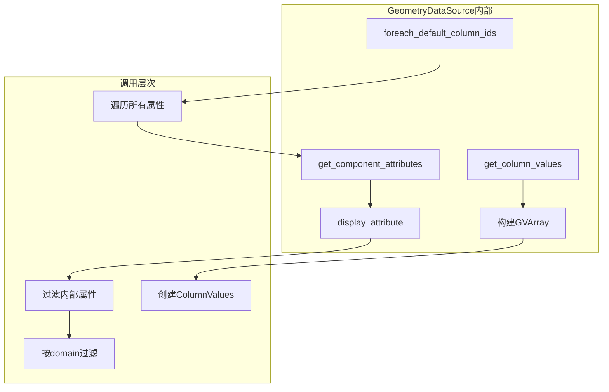
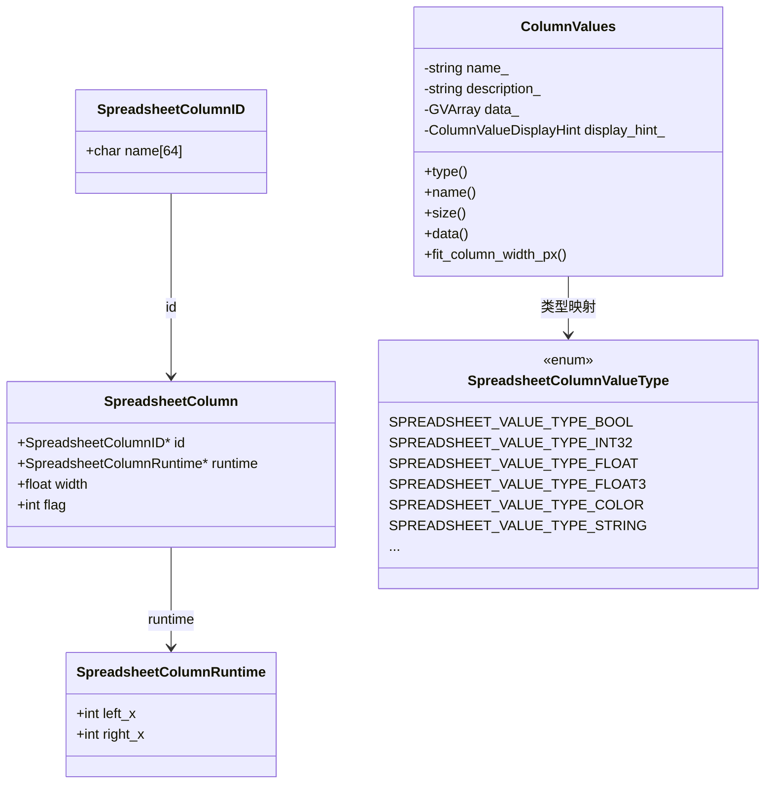
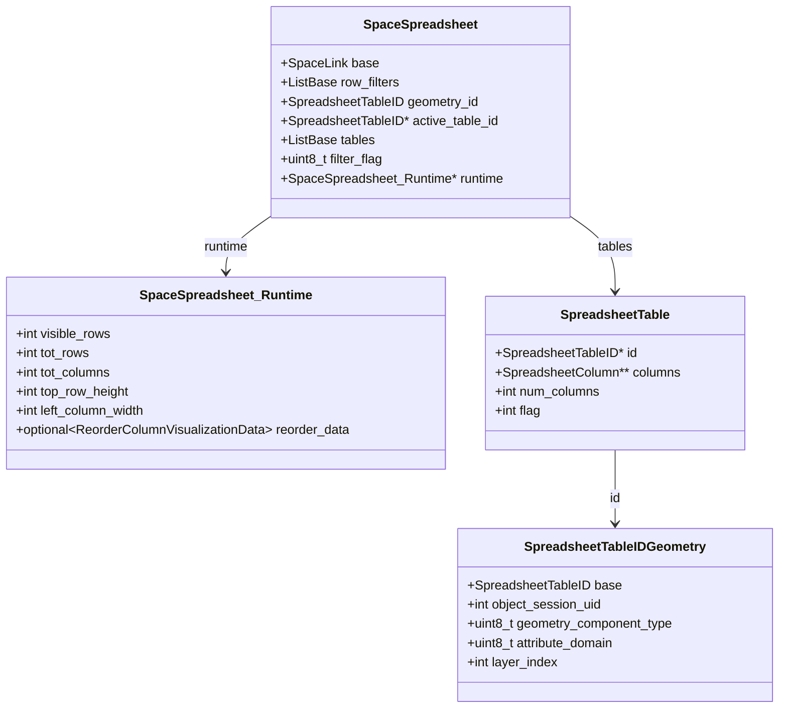
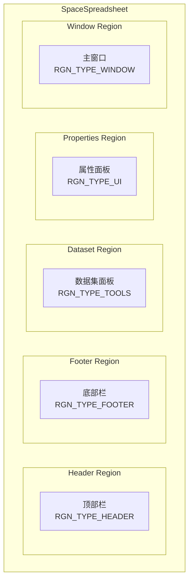
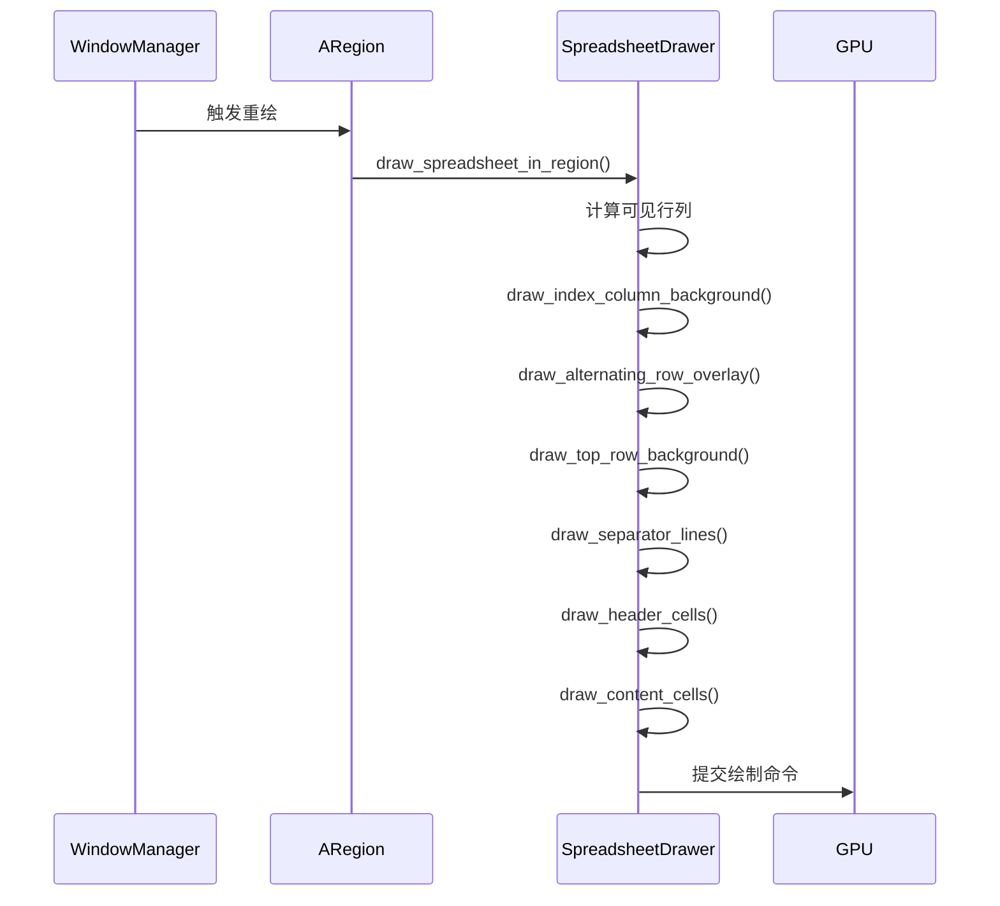

# Blender Spreadsheet Editor 架构概览

> 📍 目标：理解整个电子表格编辑器的模块职责和交互关系

---

## 1. 模块总览

---

## 2. 核心设计模式

### 2.1 策略模式 - DataSource

### 2.2 访问者模式 - 列值遍历

### 2.3 工厂模式

---

## 3. 数据流向

### 3.1 完整数据流

### 3.2 GeometryDataSource 详细数据流

---

## 4. 核心类关系

### 4.1 列相关类

### 4.2 Space运行时结构

---

## 5. UI架构

### 5.1 Region结构

### 5.2 绘制流程

---

## 6. 关键常量和配置

| 常量 | 值 | 含义 |
|-----|-----|-----|
| `SPREADSHEET_EDGE_ACTION_ZONE` | `UI_UNIT_X * 0.3f` | 列边缘拖拽触发区域 |
| `SPREADSHEET_WIDTH_UNIT` | 隐藏常量 | 列宽单位 |
| `SPREADSHEET_COLUMN_FLAG_UNAVAILABLE` | 标志位 | 列不可用标记 |
| `SPREADSHEET_FILTER_ENABLE` | 标志位 | 启用筛选 |

---

## 7. 学习建议

### 阅读顺序
1. ⭐ `spreadsheet_data_source.hh` - 理解抽象接口
2. ⭐ `spreadsheet_data_source_geometry.hh` - 理解具体实现
3. `spreadsheet_column_values.hh` - 值系统
4. `spreadsheet_draw.hh` - 绘制系统
5. `space_spreadsheet.cc` - 整合逻辑

### 重点关注
- DataSource 如何解耦数据获取和UI显示
- ColumnValues 如何统一不同类型数据的表示
- SpreadsheetDrawer 如何高效渲染大量数据

---

*文档创建: 2025年*
*基于 Blender 源代码分析*
