# Spreadsheet 数据源详细分析

> 📍 目标：深入理解 DataSource 的设计哲学和实现细节

---

## 1. DataSource 抽象基类

### 1.1 类设计意图

```mermaid
classDiagram
    note for DataSource "抽象基类 - 策略模式核心"
    class DataSource {
        <<abstract>>
        +~DataSource() virtual
        +foreach_default_column_ids(fn) const
        +get_column_values(column_id) const* unique_ptr~ColumnValues~
        +has_selection_filter() const bool
        +tot_rows() const int
    }

    note right of DataSource
        核心职责：
        1. 定义列集合
        2. 提供列值访问
        3. 报告行数
        4. 支持选择筛选
    end note
```

### 1.2 接口语义

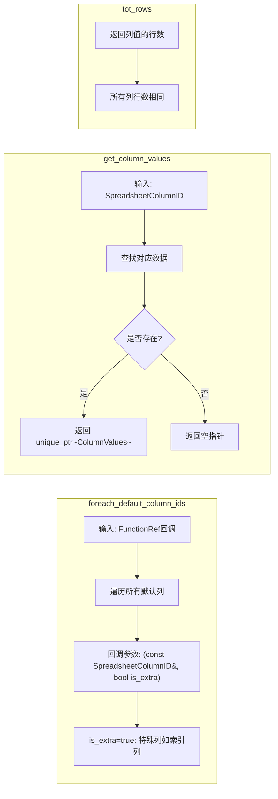

---

## 2. GeometryDataSource 详解

### 2.1 类成员分析

```mermaid
classDiagram
    class GeometryDataSource {
        // 核心数据
        -Object* object_orig_
        -GeometrySet geometry_set_
        -GeometryComponent* component_
        -AttrDomain domain_
        -bool show_internal_attributes_
        -int layer_index_

        // 线程安全
        -mutable Mutex mutex_
        -mutable ResourceScope scope_

        +GeometryDataSource(...)
        +has_selection_filter() bool
        +apply_selection_filter(memory) IndexMask
        +foreach_default_column_ids(fn) void
        +get_column_values(column_id) unique_ptr~ColumnValues~
        +tot_rows() int
        -get_component_attributes() optional~AttributeAccessor~
        -display_attribute(name, domain) bool
    }

    note right of GeometryDataSource
        object_orig_: 用于选择筛选（原始对象）
        geometry_set_: 实际几何数据
        component_: 当前组件（如Mesh/PointCloud）
        domain_: 属性域（Point/Edge/Face等）
        layer_index_: Grease Pencil图层索引
    end note
```

### 2.2 数据来源层级

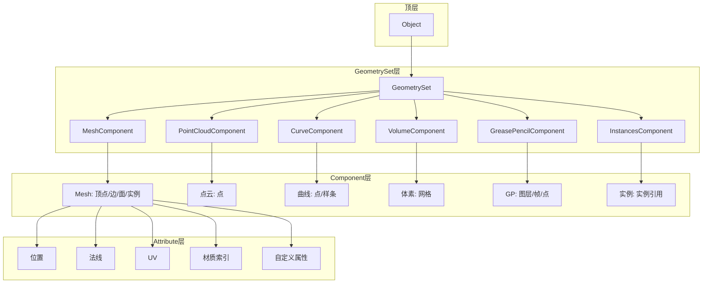

### 2.3 foreach_default_column_ids 执行流程

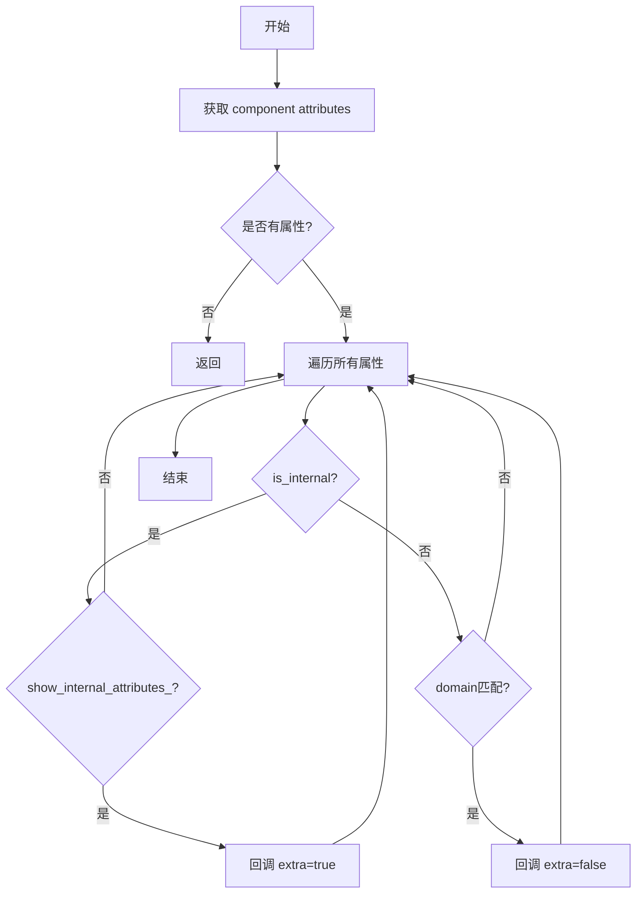

**代码对应** (`spreadsheet_data_source_geometry.cc`):
```cpp
void GeometryDataSource::foreach_default_column_ids(
    FunctionRef<void(const SpreadsheetColumnID &, bool is_extra)> fn) const
{
    std::optional<const bke::AttributeAccessor> attributes = this->get_component_attributes();
    if (!attributes) {
        return;
    }

    attributes->foreach_attribute([&](const bke::AttributeIDRef &id, const bke::AttributeMetaData meta_data) {
        if (meta_data.domain != domain_) {
            return;
        }
        if (!this->display_attribute(id.name(), meta_data.domain)) {
            return;
        }
        SpreadsheetColumnID column_id;
        column_id.name = id.name();
        fn(column_id, false);
    }, bke::AttrDomain::All);
}
```

### 2.4 get_column_values 实现

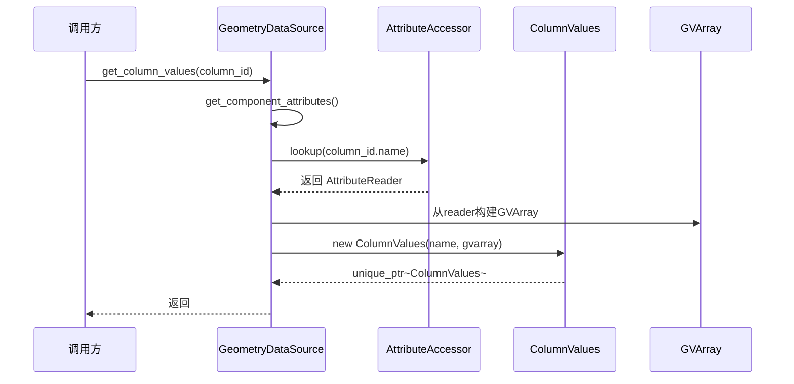

**关键设计**:
- 使用 `std::unique_ptr<ColumnValues>` 自动管理内存
- `GVArray` 提供泛型数组访问，隐藏具体类型
- `ResourceScope` 管理临时资源生命周期

---

## 3. 其他数据源实现

### 3.1 VolumeDataSource

```mermaid
classDiagram
    class VolumeDataSource {
        -GeometrySet geometry_set_
        -VolumeComponent* component_
        +foreach_default_column_ids(fn)
        +get_column_values(column_id)
        +tot_rows()
    }

    note right of VolumeDataSource
        体积数据源特性：
        1. 展示所有体素网格(grids)
        2. 每个网格作为一列
        3. 行数 = 网格中体素总数
    end note
```

### 3.2 VolumeGridDataSource (OpenVDB)

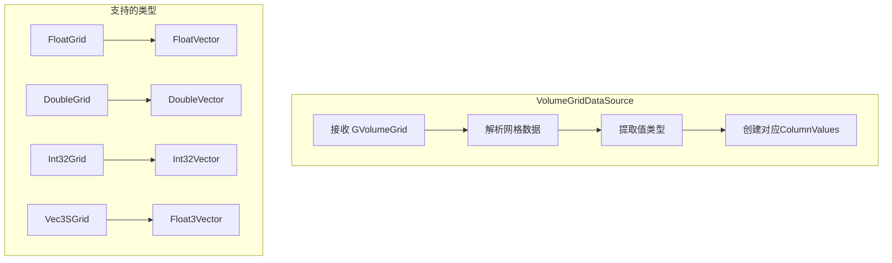

### 3.3 节点数据支持

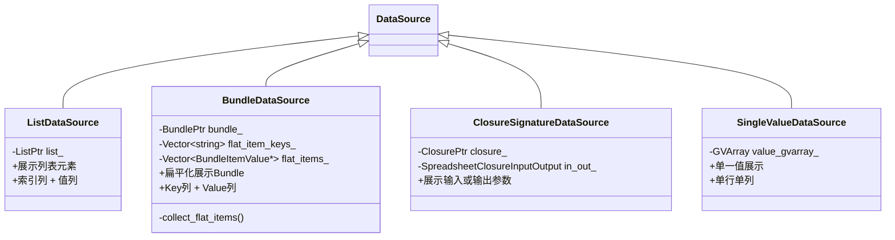

---

## 4. 实例(Instance)数据处理

### 4.1 实例层级

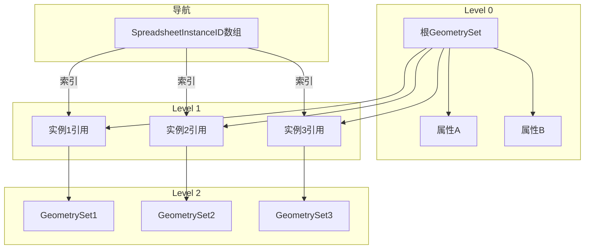

### 4.2 实例ID路径

```mermaid
flowchart LR
    subgraph 路径表示
        A[SpreadsheetInstanceID[0] = 5] --> B[选择第5个实例]
        B --> C[实例指向的GeometrySet]
        C --> D[继续展示该几何体属性]
    end
```

---

## 5. 类型映射系统

### 5.1 C++类型到电子表格类型

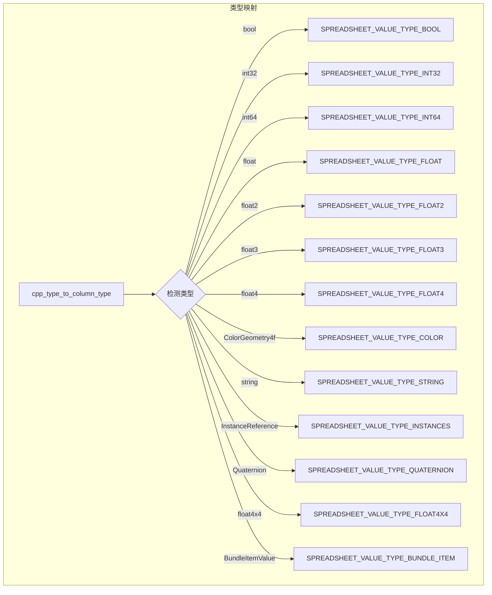

### 5.2 类型处理策略

| C++类型 | 显示方式 | 特殊处理 |
|---------|---------|---------|
| `bool` | 复选框 | THICKNESS=0 |
| `int32`/`int64` | 整数显示 | 右对齐 |
| `float` | 浮点数显示 | 固定精度 |
| `float2`/`float3`/`float4` | 向量显示 | 括号包围 |
| `ColorGeometry4f` | 颜色预览+数值 | 色块 |
| `std::string` | 文本 | 左对齐 |
| `InstanceReference` | 图标+名称 | 图标来自get_instance_reference_icon |
| `math::Quaternion` | 四元数显示 | WXYZ格式 |
| `float4x4` | 矩阵展开 | 可选折叠 |

---

## 6. 性能优化设计

### 6.1 惰性计算

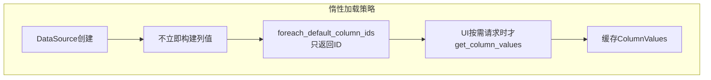

### 6.2 线程安全


### 6.3 内存管理

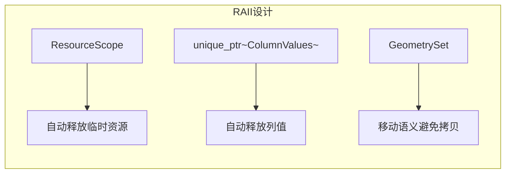

---

## 7. 扩展点分析

### 7.1 如何添加新的数据源

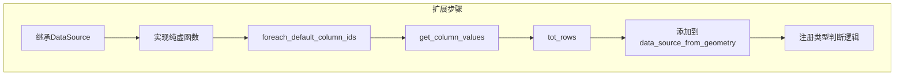

### 7.2 扩展示例：自定义数据

```cpp
// 假设：展示Python脚本的DataFrame
class DataFrameDataSource : public DataSource {
private:
    PyObject* dataframe_;

public:
    void foreach_default_column_ids(
        FunctionRef<void(const SpreadsheetColumnID&, bool)> fn) const override {
        // 遍历DataFrame列名
    }

    std::unique_ptr<ColumnValues> get_column_values(
        const SpreadsheetColumnID& column_id) const override {
        // 从DataFrame提取列数据
    }

    int tot_rows() const override {
        // 返回DataFrame行数
    }
};
```

---

## 8. 关键源码片段注释

### 8.1 DataSource 核心接口

```cpp
// spreadsheet_data_source.hh

class DataSource {
public:
    virtual ~DataSource();  // 虚析构确保正确释放

    // 核心接口1：遍历所有列ID
    // fn回调接收列ID和是否extra标记
    // is_extra=true表示特殊列（如索引）应排在最前面
    virtual void foreach_default_column_ids(
        FunctionRef<void(const SpreadsheetColumnID&, bool is_extra)> fn) const {}

    // 核心接口2：获取列值
    // 使用unique_ptr管理生命周期
    // 返回nullptr表示该列无数据
    virtual std::unique_ptr<ColumnValues> get_column_values(
        const SpreadsheetColumnID& column_id) const { return {}; }

    // 核心接口3：是否支持选择筛选
    // 几何数据支持，其他类型可能不支持
    virtual bool has_selection_filter() const { return false; }

    // 核心接口4：总行数
    virtual int tot_rows() const { return 0; }
};
```

### 8.2 FunctionRef 的使用

```cpp
// FunctionRef是一种轻量级回调，不分配内存
// 对比：std::function会类型擦除和堆分配
void foreach_default_column_ids(
    FunctionRef<void(const SpreadsheetColumnID&, bool)> fn) const;

// 使用示例：
source.foreach_default_column_ids([](const SpreadsheetColumnID& id, bool is_extra) {
    // 处理每个列ID
    printf("Column: %s, Extra: %d\n", id.name, is_extra);
});
```

---

## 9. 总结

### 9.1 设计亮点

1. **单一职责**：DataSource只负责数据，不关心UI
2. **开闭原则**：新增数据源只需继承基类
3. **类型安全**：GVArray提供泛型但不失类型信息
4. **性能优化**：惰性计算+线程安全

### 9.2 学习收获

- 掌握策略模式在数据抽象中的应用
- 理解`std::unique_ptr`和`FunctionRef`的现代C++用法
- 学习如何处理多源异构数据（几何/体积/列表等）
- 了解大型项目中模块间的解耦设计

---

*文档创建: 2025年*
*基于 spreadsheet_data_source*.hh/cc 分析*
