# Spreadsheet 列和表格系统

> 📍 目标：理解列管理、表格状态存储和Blend文件持久化

---

## 1. SpreadsheetColumn 类层次

### 1.1 三层结构

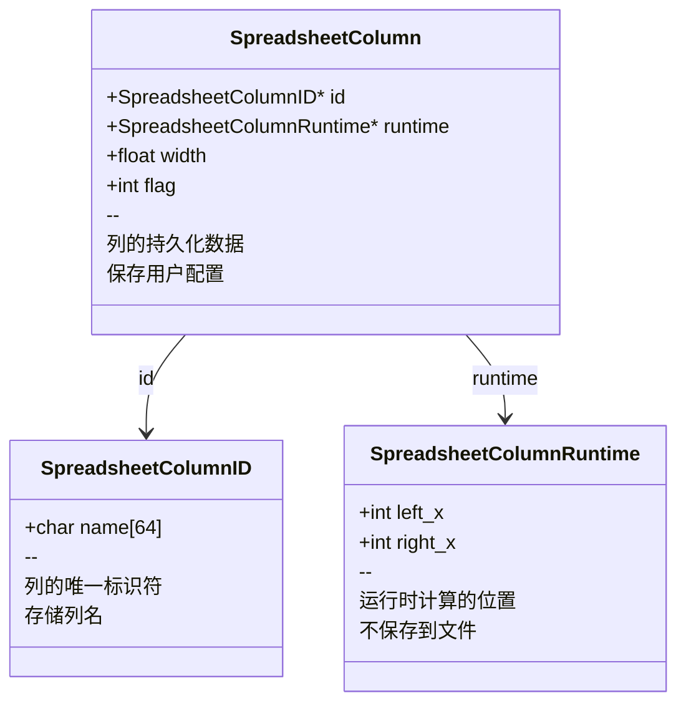

### 1.2 设计意图

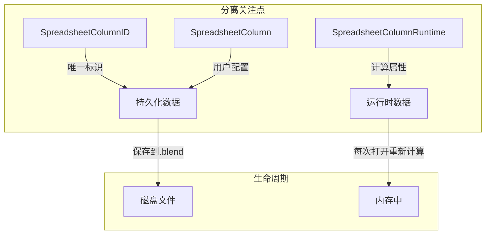

---

## 2. 列值系统 (ColumnValues)

### 2.1 类设计

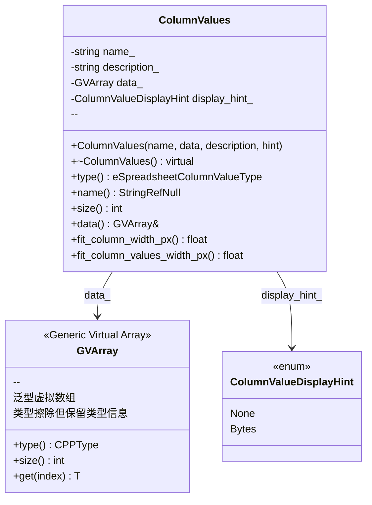

### 2.2 数据流

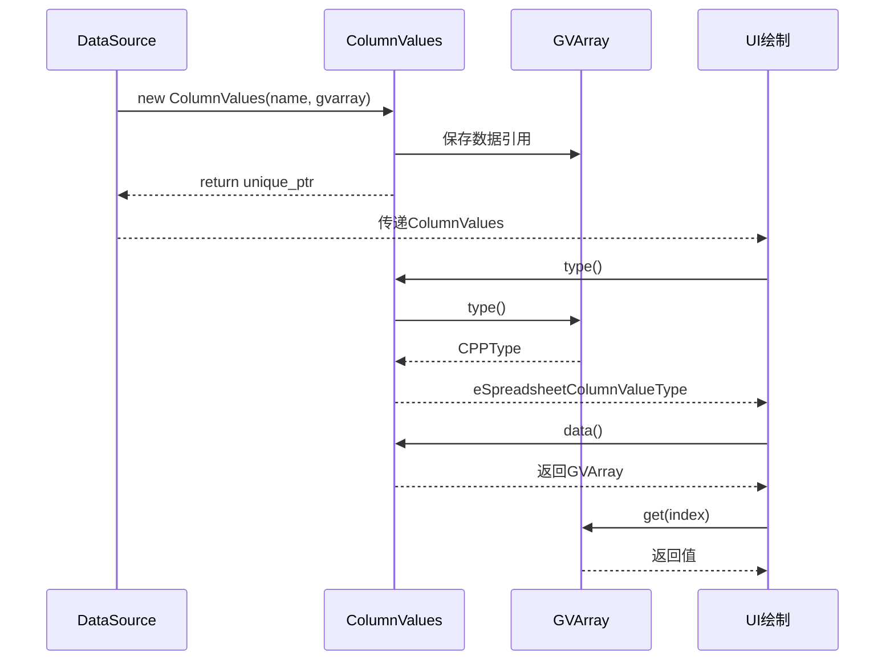

---

## 3. SpreadsheetTable 表格管理

### 3.1 数据结构

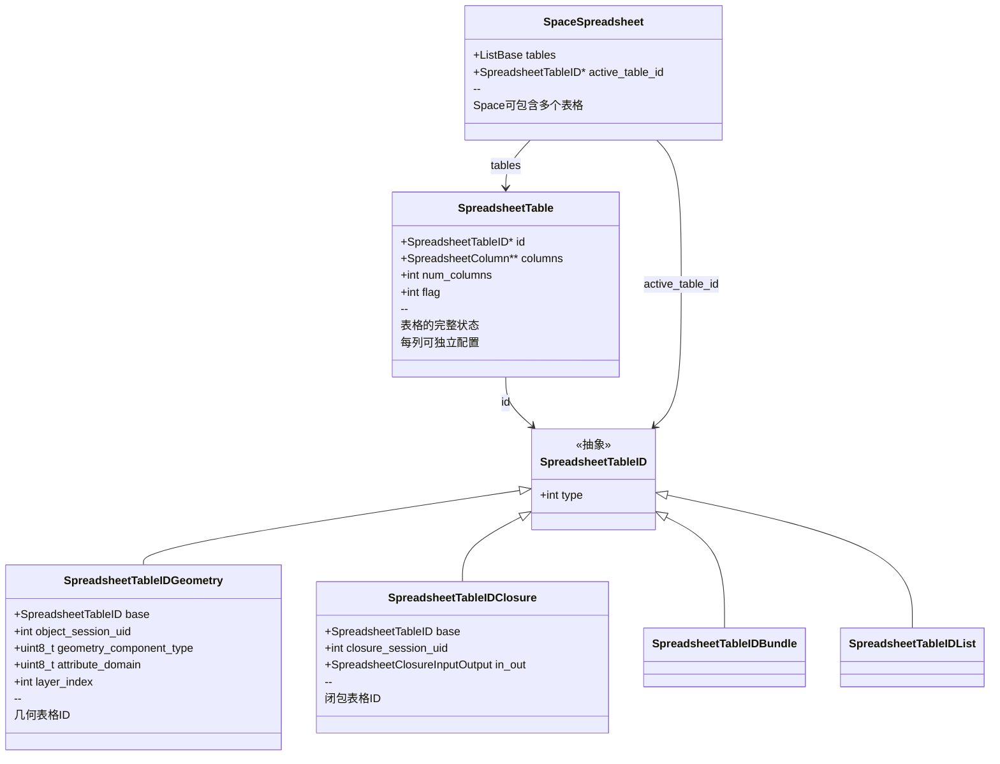

### 3.2 表格查找机制

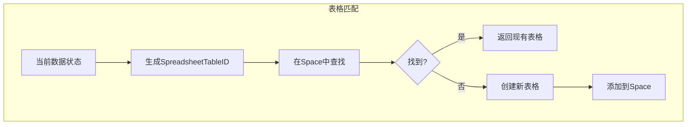

**代码对应**:
```cpp
// 匹配逻辑在 spreadsheet_table_id_match()
bool spreadsheet_table_id_match(const SpreadsheetTableID &a, const SpreadsheetTableID &b) {
    if (a.type != b.type) return false;
    switch (a.type) {
        case SPREADSHEET_TABLE_ID_TYPE_GEOMETRY:
            // 比较几何组件类型、属性域等
            // 忽略迭代索引
            break;
        // ...
    }
}
```

---

## 4. Blend文件持久化

### 4.1 写入流程

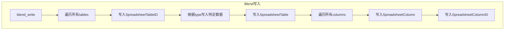

### 4.2 读取流程

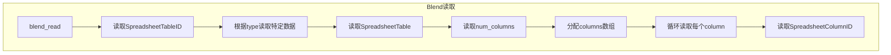

### 4.3 DNA结构版本控制

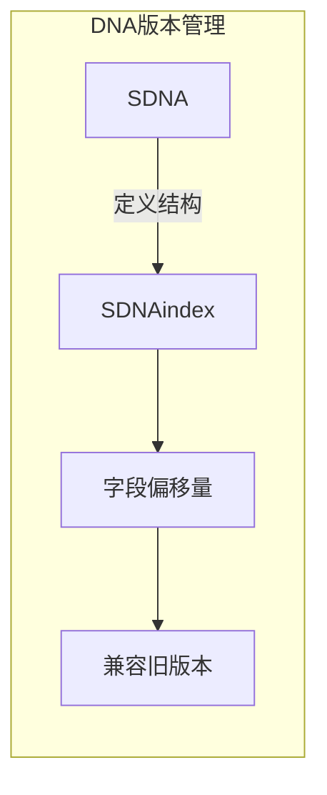

---

## 5. 内存管理

### 5.1 分配策略

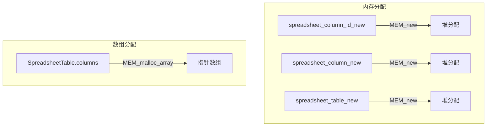

### 5.2 释放策略

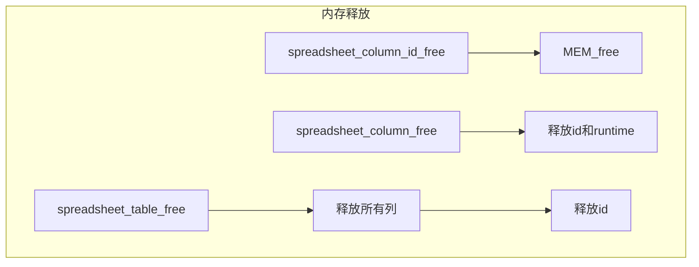

### 5.3 拷贝语义

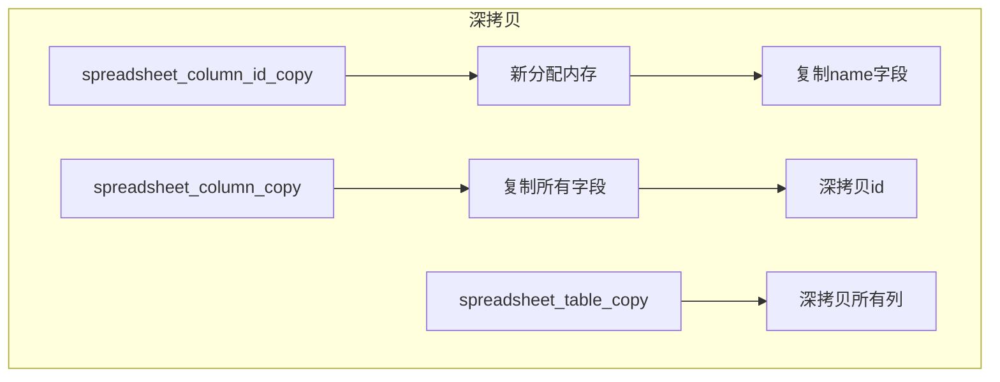

---

## 6. 行筛选系统

### 6.1 筛选器结构

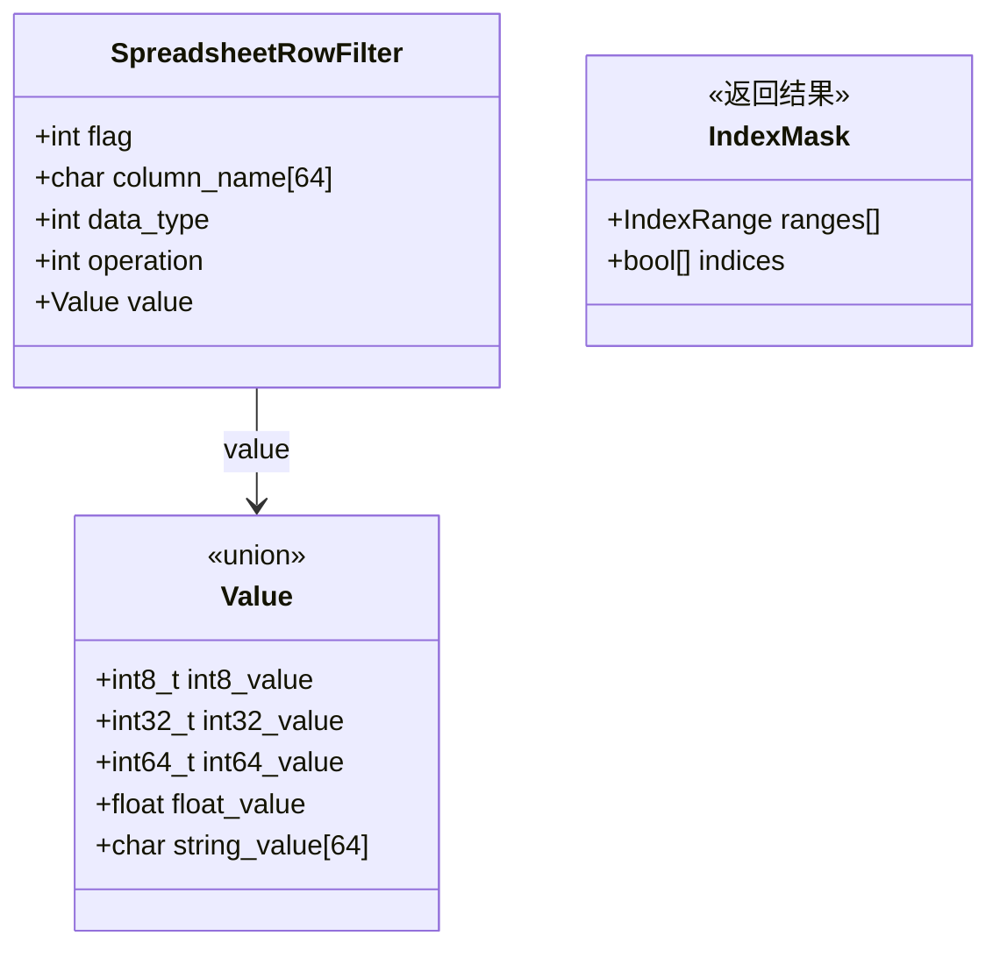

### 6.2 筛选流程

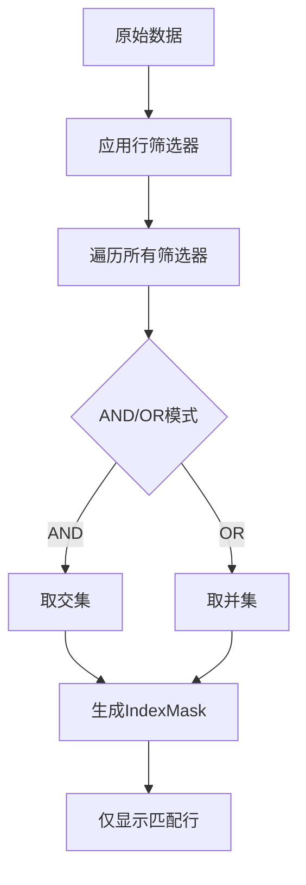

### 6.3 筛选操作

| 操作 | 含义 | 适用类型 |
|-----|------|---------|
| EQUAL | 等于 | 所有类型 |
| NOT_EQUAL | 不等于 | 所有类型 |
| GREATER_THAN | 大于 | 数值类型 |
| LESS_THAN | 小于 | 数值类型 |
| CONTAINS | 包含 | 字符串 |
| STARTS_WITH | 开头匹配 | 字符串 |
| ENDS_WITH | 结尾匹配 | 字符串 |
| IS_EMPTY | 为空 | 字符串 |
| IS_NOT_EMPTY | 非空 | 字符串 |

---

## 7. 列宽调整系统

### 7.1 列宽计算

```mermaid
flowchart TB
    subgraph 列宽来源
        A[默认值] --> B[5 * UI_UNIT_X]
        C[用户手动调整] --> D[column->width]
        E[自适应宽度] --> F[fit_column_width_px()]
    end

    subgraph 计算逻辑
        F --> G[采样部分行计算文本宽度]
        G --> H[取列名和值的最大宽度]
        H --> I[加上边距]
    end
```

### 7.2 自适应宽度实现

```cpp
float ColumnValues::fit_column_width_px(
    const std::optional<int64_t>& max_sample_size) const
{
    // 1. 计算列名宽度
    float width = BLF_width(font_id, name_.c_str(), name_.size());

    // 2. 计算值宽度（可选采样）
    if (max_sample_size) {
        // 只采样前N行
        for (int i = 0; i < std::min(*max_sample_size, size()); i++) {
            width = std::max(width, get_cell_width(i));
        }
        // 确保最小宽度
        width = std::max(width, minimum_column_width);
    } else {
        // 遍历所有行
        for (int i = 0; i < size(); i++) {
            width = std::max(width, get_cell_width(i));
        }
    }

    return width + padding;
}
```

---

## 8. 表格状态管理

### 8.1 状态标志

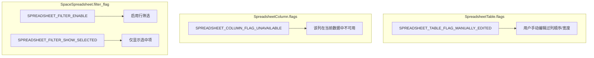

### 8.2 状态转换

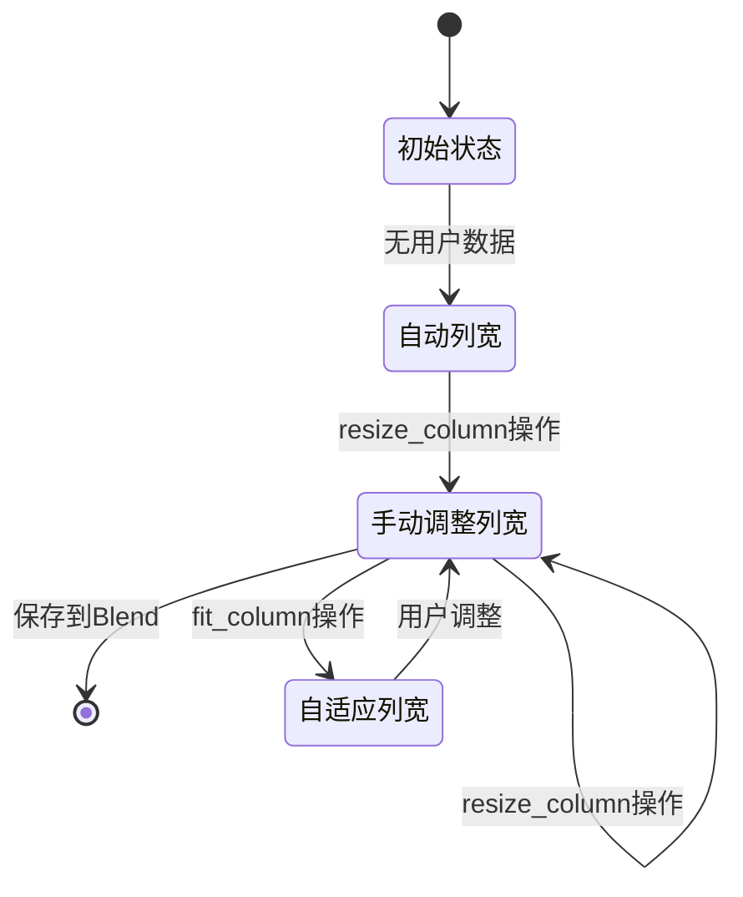

---

## 9. 实例ID处理

### 9.1 实例导航

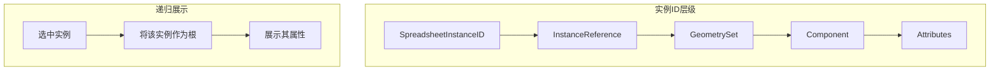

---

## 10. 关键函数清单

### 10.1 列管理函数

| 函数 | 文件 | 职责 |
|------|------|------|
| `spreadsheet_column_id_new()` | column.cc | 创建列ID |
| `spreadsheet_column_id_copy()` | column.cc | 复制列ID |
| `spreadsheet_column_id_free()` | column.cc | 释放列ID |
| `spreadsheet_column_new()` | column.cc | 创建列 |
| `spreadsheet_column_copy()` | column.cc | 复制列 |
| `spreadsheet_column_free()` | column.cc | 释放列 |

### 10.2 表格管理函数

| 函数 | 文件 | 职责 |
|------|------|------|
| `spreadsheet_table_id_new_geometry()` | table.cc | 创建几何表格ID |
| `spreadsheet_table_id_match()` | table.cc | 判断表格是否匹配 |
| `spreadsheet_table_new()` | table.cc | 创建表格 |
| `spreadsheet_table_find()` | table.cc | 查找表格 |
| `spreadsheet_table_add()` | table.cc | 添加表格到Space |
| `spreadsheet_table_remove_unused()` | table.cc | 清理未使用表格 |

### 10.3 筛选函数

| 函数 | 文件 | 职责 |
|------|------|------|
| `spreadsheet_row_filter_new()` | row_filter.cc | 创建筛选器 |
| `spreadsheet_row_filter_copy()` | row_filter.cc | 复制筛选器 |
| `spreadsheet_filter_rows()` | row_filter.cc | 应用筛选 |

---

## 11. 学习要点总结

### 11.1 设计模式应用

1. **Pimpl模式**：通过Runtime分离实现细节
2. **工厂模式**：所有create函数统一管理内存
3. **策略模式**：ColumnValues隐藏具体数据类型
4. **标识模式**：TableID区分不同表格类型

### 11.2 C++技巧

1. **智能指针**：`unique_ptr<ColumnValues>`自动管理
2. **类型擦除**：GVArray提供泛型接口
3. **内存池**：MEM_new/MEM_free统一分配
4. **字符串视图**：StringRef避免拷贝

### 11.3 文件持久化要点

1. **分离运行时数据**：runtime不保存
2. **版本兼容**：通过SDNA处理结构变化
3. **深拷贝**：copy函数处理指针成员
4. **ID重映射**：foreach_id处理库依赖

---

*文档创建: 2025年*
*基于 spreadsheet_column*.hh/cc, spreadsheet_table*.hh/cc 分析*
