# Spreadsheet 绘制系统

> 📍 目标：理解UI绘制流程、GPU渲染和性能优化策略

---

## 1. 整体架构

### 1.1 绘制层次

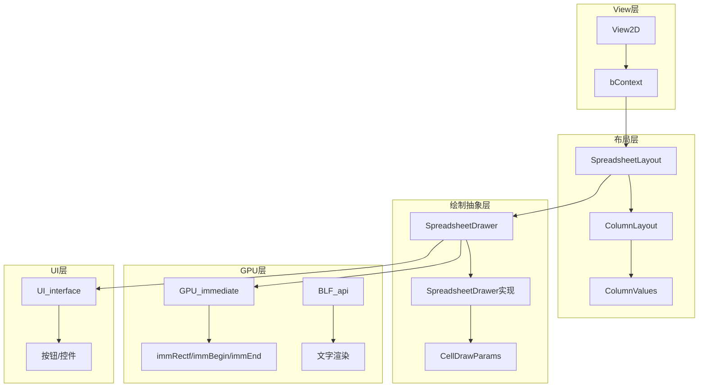

### 1.2 核心组件关系

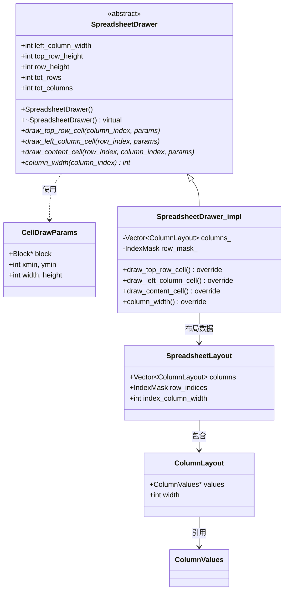

---

## 2. 绘制流程

### 2.1 主绘制流程

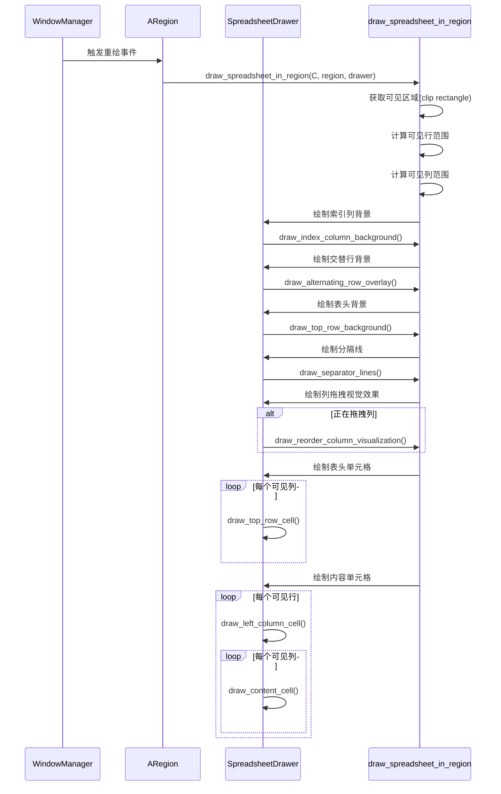

### 2.2 详细绘制步骤

```mermaid
flowchart TB
    subgraph 步骤1：背景
        A[draw_index_column_background] --> B[灰色背景]
        C[draw_alternating_row_overlay] --> D[交替行颜色]
        E[draw_top_row_background] --> F[表头背景]
    end

    subgraph 步骤2：网格
        G[draw_separator_lines] --> H[列分隔线]
        G --> I[行分隔线]
    end

    subgraph 步骤3：单元格
        J[draw_top_row_cell] --> K[表头文字]
        L[draw_left_column_cell] --> M[行索引]
        N[draw_content_cell] --> O[单元格值]
    end

    subgraph 步骤4：特效
        P[draw_reorder_column_visualization] --> Q[列拖拽效果]
    end

    A --> C --> E --> G --> J --> L --> N --> P
```

---

## 3. GPU绘制实现

### 3.1 Immediate Mode绘制

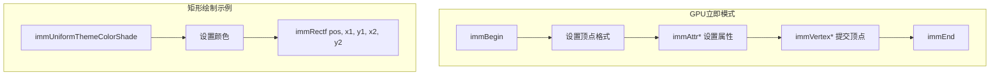

### 3.2 背景绘制代码分析

```cpp
// 索引列背景
static void draw_index_column_background(const uint pos,
                                         const ARegion *region,
                                         const SpreadsheetDrawer &drawer)
{
    // 使用主题颜色(背景色+11亮度)
    immUniformThemeColorShade(TH_BACK, 11);

    // 绘制左侧索引列矩形
    immRectf(pos,
             0,                                      // 左边界
             region->winy - drawer.top_row_height,   // 上边界(排除表头)
             drawer.left_column_width,               // 右边界
             0);                                      // 下边界
}

// 交替行覆盖
static void draw_alternating_row_overlay(const uint pos,
                                          const int scroll_offset_y,
                                          const ARegion *region,
                                          const SpreadsheetDrawer &drawer)
{
    immUniformThemeColor(TH_ROW_ALTERNATE);
    GPU_blend(GPU_BLEND_ALPHA);  // 启用透明混合

    const int row_pair_height = drawer.row_height * 2;
    // 计算第一个可见行的位置
    const int row_top_y = region->winy - drawer.top_row_height -
                          (scroll_offset_y % row_pair_height);

    // 绘制交替的半透明行
    for (const int i : IndexRange(region->winy / row_pair_height + 1)) {
        // 计算当前矩形坐标
        int y_top = row_top_y - i * row_pair_height - drawer.row_height;
        int y_bottom = y_top - drawer.row_height;

        // 限制在内容区域
        y_top = std::min(y_top, region->winy - drawer.top_row_height);
        y_bottom = std::min(y_bottom, region->winy - drawer.top_row_height);

        immRectf(pos, 0, y_top, region->winx, y_bottom);
    }

    GPU_blend(GPU_BLEND_NONE);  // 恢复混合状态
}
```

---

## 4. 单元格绘制

### 4.1 表头单元格绘制

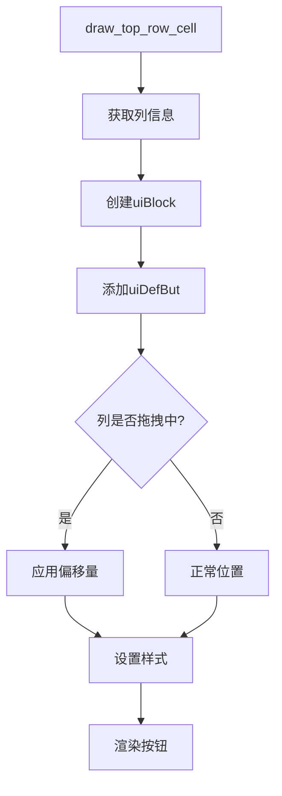

### 4.2 内容单元格绘制

```cpp
void SpreadsheetDrawer_impl::draw_content_cell(int row_index,
                                                  int column_index,
                                                  const CellDrawParams &params) const
{
    const ColumnLayout &column = columns_[column_index];
    const ColumnValues &values = *column.values;

    // 1. 获取该行的值
    const GVArray &data = values.data();
    const CPPType &type = data.type();

    // 2. 根据类型渲染
    switch (cpp_type_to_column_type(type)) {
        case SPREADSHEET_VALUE_TYPE_BOOL:
            draw_bool_cell(params, data.get<bool>(row_index));
            break;
        case SPREADSHEET_VALUE_TYPE_INT32:
            draw_int_cell(params, data.get<int32_t>(row_index));
            break;
        case SPREADSHEET_VALUE_TYPE_FLOAT:
            draw_float_cell(params, data.get<float>(row_index));
            break;
        case SPREADSHEET_VALUE_TYPE_FLOAT3:
            draw_float3_cell(params, data.get<float3>(row_index));
            break;
        case SPREADSHEET_VALUE_TYPE_COLOR:
            draw_color_cell(params, data.get<ColorGeometry4f>(row_index));
            break;
        // ... 更多类型
    }
}
```

### 4.3 各类型绘制方式

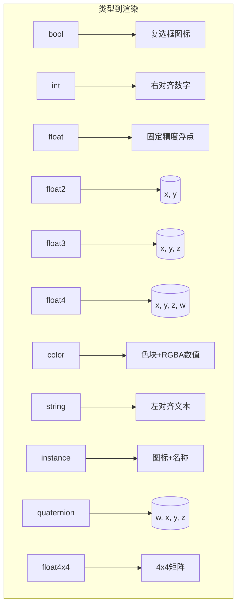

---

## 5. 布局计算

### 5.1 SpreadsheetLayout构建

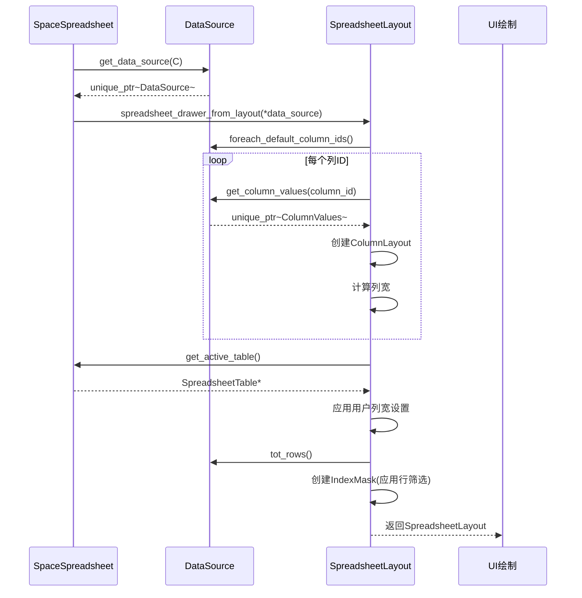

### 5.2 列宽计算逻辑

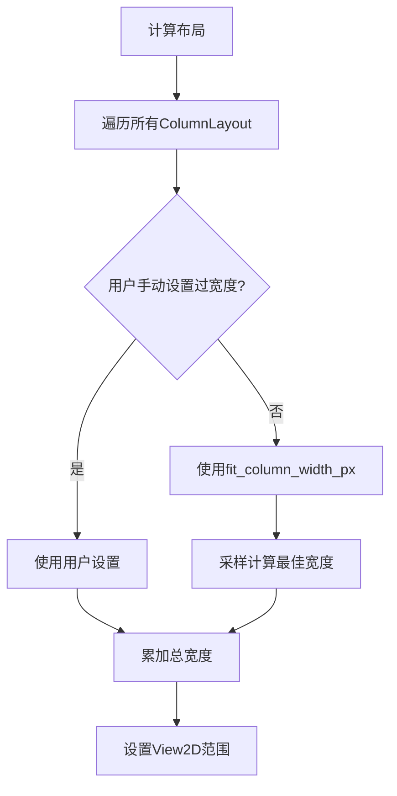

### 5.3 可见区域计算

```cpp
// 计算可见行范围
const int row_start = std::max(0, int(-scroll_offset_y / row_height));
const int row_end = std::min(
    layout.row_indices.size(),
    row_start + int(std::ceil(view_height / row_height)) + 1
);

// 计算可见列范围
float x_offset = drawer.left_column_width;
for (const int column_index : layout.columns.index_range()) {
    const ColumnLayout &column = layout.columns[column_index];
    const float column_x_start = x_offset;
    const float column_x_end = x_offset + column.width;

    if (column_x_end > clip_x_min && column_x_start < clip_x_max) {
        // 该列可见
        visible_columns.append(column_index);
    }
    x_offset = column_x_end;
}
```

---

## 6. 性能优化

### 6.1 按需渲染策略

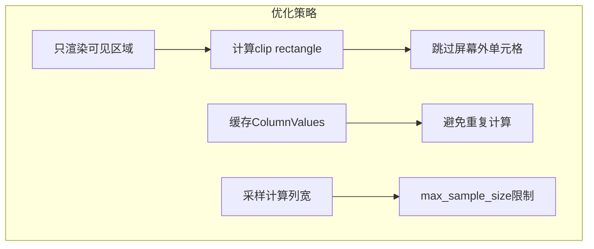

### 6.2 渲染复杂度分析

| 操作 | 复杂度 | 优化策略 |
|------|-------|---------|
| 背景绘制 | O(1) | GPU批量绘制 |
| 行数计算 | O(1) | 缓存tot_rows |
| 可见行数 | O(1) | 只渲染屏幕内 |
| 列宽计算 | O(N) 采样 | max_sample_size限制 |
| 单元格绘制 | O(可见行×可见列) | 跳过屏幕外 |
| 文本渲染 | O(字符数) | 缓存字形 |

### 6.3 大数据集处理


---

## 7. View2D 坐标系统

### 7.1 坐标转换

```mermaid
flowchart TB
    subgraph 坐标空间
        A[视图空间(View Space)] --> B[区域空间(Region Space)]
        B --> C[屏幕空间(Screen Space)]
    end

    subgraph 转换函数
        D[ui::view2d_region_to_view_x] --> E[region_x -> view_x]
        F[ui::view2d_view_to_region_x] --> G[view_x -> region_x]
    end
```

### 7.2 列位置计算

```cpp
// 计算列的视图空间位置
float x_offset = drawer.left_column_width;
for (SpreadsheetColumn *column : columns) {
    column->runtime->left_x = x_offset;
    x_offset += column->width * SPREADSHEET_WIDTH_UNIT;
    column->runtime->right_x = x_offset;
}

// 鼠标坐标转换
const float cursor_x_view = ui::view2d_region_to_view_x(&region.v2d, cursor_re.x);

// 检测鼠标悬停列
for (SpreadsheetColumn *column : columns) {
    if (cursor_x_view > column->runtime->left_x &&
        cursor_x_view <= column->runtime->right_x) {
        // 找到悬停列
    }
}
```

---

## 8. 特效和交互视觉反馈

### 8.1 列拖拽视觉效果

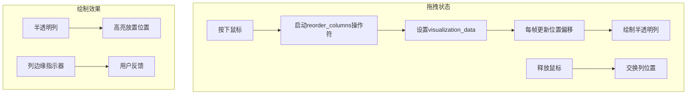

### 8.2 行高亮效果


---

## 9. 颜色主题

### 9.1 主题常量

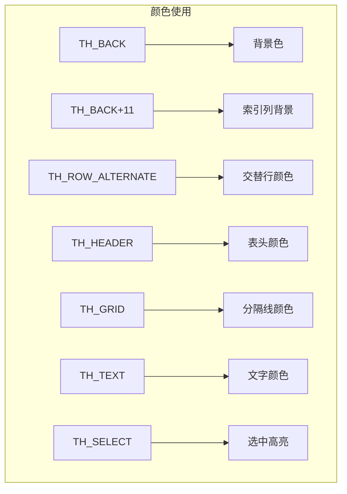

### 9.2 主题适配

```cpp
// 根据主题调整
void apply_theme_colors() {
    // 获取当前主题颜色
    const uchar *color = UI_GetThemeColor4ubv(TH_BACK);

    // 索引列背景稍亮
    immUniformThemeColorShade(TH_BACK, 11);

    // 交替行使用预设颜色
    immUniformThemeColor(TH_ROW_ALTERNATE);

    // 分隔线
    immUniformThemeColorShade(TH_GRID, -20);
}
```

---

## 10. 关键代码清单

### 10.1 绘制函数

| 函数 | 文件 | 职责 |
|------|------|------|
| `draw_spreadsheet_in_region()` | draw.cc | 主绘制入口 |
| `draw_index_column_background()` | draw.cc | 索引列背景 |
| `draw_alternating_row_overlay()` | draw.cc | 交替行 |
| `draw_top_row_background()` | draw.cc | 表头背景 |
| `draw_separator_lines()` | draw.cc | 网格线 |
| `spreadsheet_drawer_from_layout()` | layout.cc | 创建绘制器 |

### 10.2 绘制类

| 类 | 文件 | 职责 |
|----|------|------|
| `SpreadsheetDrawer` | draw.hh | 绘制抽象基类 |
| `CellDrawParams` | draw.hh | 单元格绘制参数 |
| `SpreadsheetLayout` | layout.hh | 布局信息 |
| `ColumnLayout` | layout.hh | 单列布局 |

---

## 11. 性能调优建议

### 11.1 渲染优化

1. **减少draw call**：批量绘制背景
2. **文字缓存**：避免每帧重新计算字形
3. **延迟加载**：列值按需计算
4. **裁剪**：只渲染可见区域

### 11.2 内存优化

1. **对象池**：重用CellDrawParams
2. **智能指针**：unique_ptr自动释放
3. **临时内存**：ResourceScope管理

---

*文档创建: 2025年*
*基于 spreadsheet_draw*.hh/cc, spreadsheet_layout*.hh/cc 分析*
