# Spreadsheet 操作符系统

> 📍 目标：理解用户交互、模态操作符和状态管理

---

## 1. 操作符概述

### 1.1 操作符类型

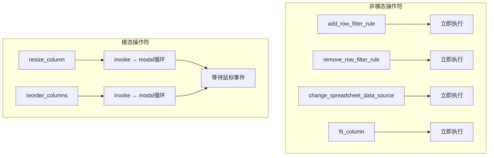

### 1.2 操作符注册

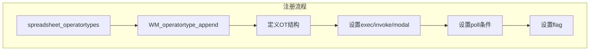

### 1.3 操作符定义模式

```cpp
// 标准定义模式
static void SPREADSHEET_OT_操作名(wmOperatorType *ot) {
    ot->name = "显示名称";                          // UI显示
    ot->description = "操作描述";                   // 工具提示
    ot->idname = "SPREADSHEET_OT_操作名";           // 唯一标识

    ot->exec = 立即执行函数;                         // 可选
    ot->invoke = 交互式调用函数;                     // 可选
    ot->modal = 模态处理函数;                        // 模态操作符必需
    ot->poll = 可用性检查函数;                        // 必需

    ot->flag = OPTYPE_REGISTER | OPTYPE_UNDO;      // 操作属性
}
```

---

## 2. 行筛选操作符

### 2.1 添加筛选器

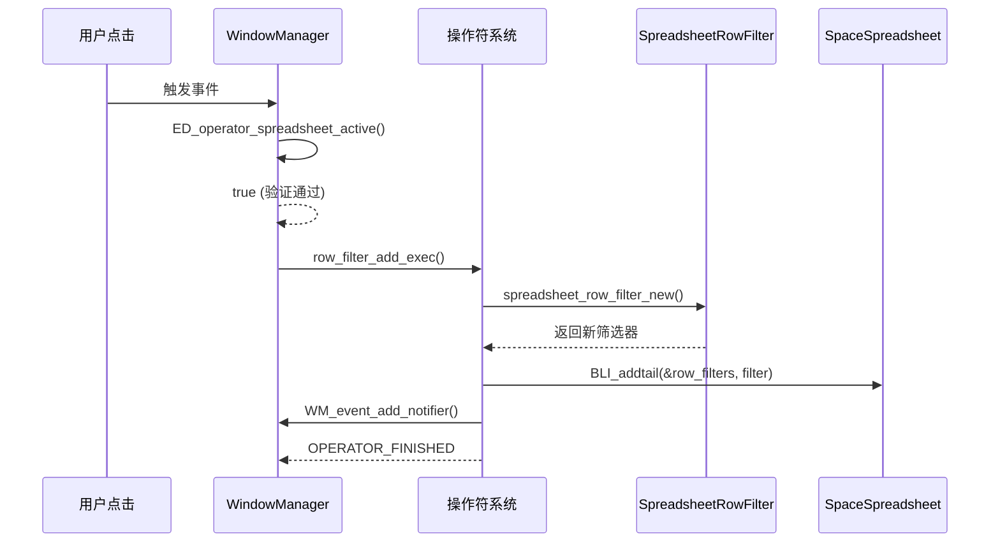

### 2.2 筛选器移除

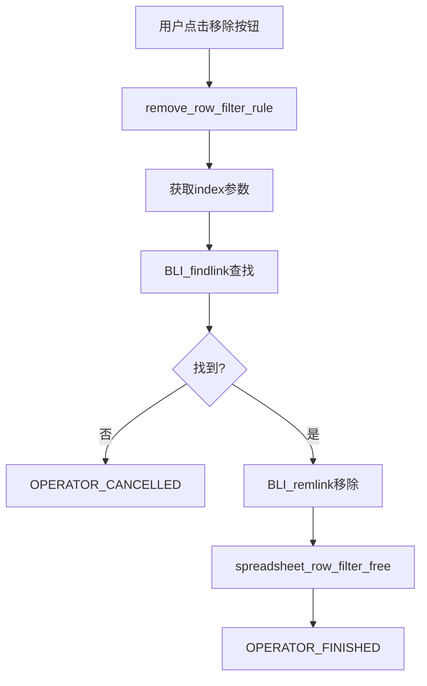

### 2.3 代码实现

```cpp
// 添加筛选器
static wmOperatorStatus row_filter_add_exec(bContext *C, wmOperator * /*op*/) {
    SpaceSpreadsheet *sspreadsheet = CTX_wm_space_spreadsheet(C);

    // 1. 创建新筛选器
    SpreadsheetRowFilter *row_filter = spreadsheet_row_filter_new();

    // 2. 添加到Space
    BLI_addtail(&sspreadsheet->row_filters, row_filter);

    // 3. 通知刷新
    WM_event_add_notifier(C, NC_SPACE | ND_SPACE_SPREADSHEET, sspreadsheet);

    return OPERATOR_FINISHED;
}

// 移除筛选器
static wmOperatorStatus row_filter_remove_exec(bContext *C, wmOperator *op) {
    SpaceSpreadsheet *sspreadsheet = CTX_wm_space_spreadsheet(C);

    // 1. 通过索引查找
    int index = RNA_int_get(op->ptr, "index");
    SpreadsheetRowFilter *row_filter = static_cast<SpreadsheetRowFilter *>(
        BLI_findlink(&sspreadsheet->row_filters, index));

    if (row_filter == nullptr) {
        return OPERATOR_CANCELLED;
    }

    // 2. 从列表移除
    BLI_remlink(&sspreadsheet->row_filters, row_filter);

    // 3. 释放内存
    spreadsheet_row_filter_free(row_filter);

    // 4. 通知刷新
    WM_event_add_notifier(C, NC_SPACE | ND_SPACE_SPREADSHEET, sspreadsheet);

    return OPERATOR_FINISHED;
}
```

---

## 3. 模态操作符 - 列调整大小

### 3.1 状态机

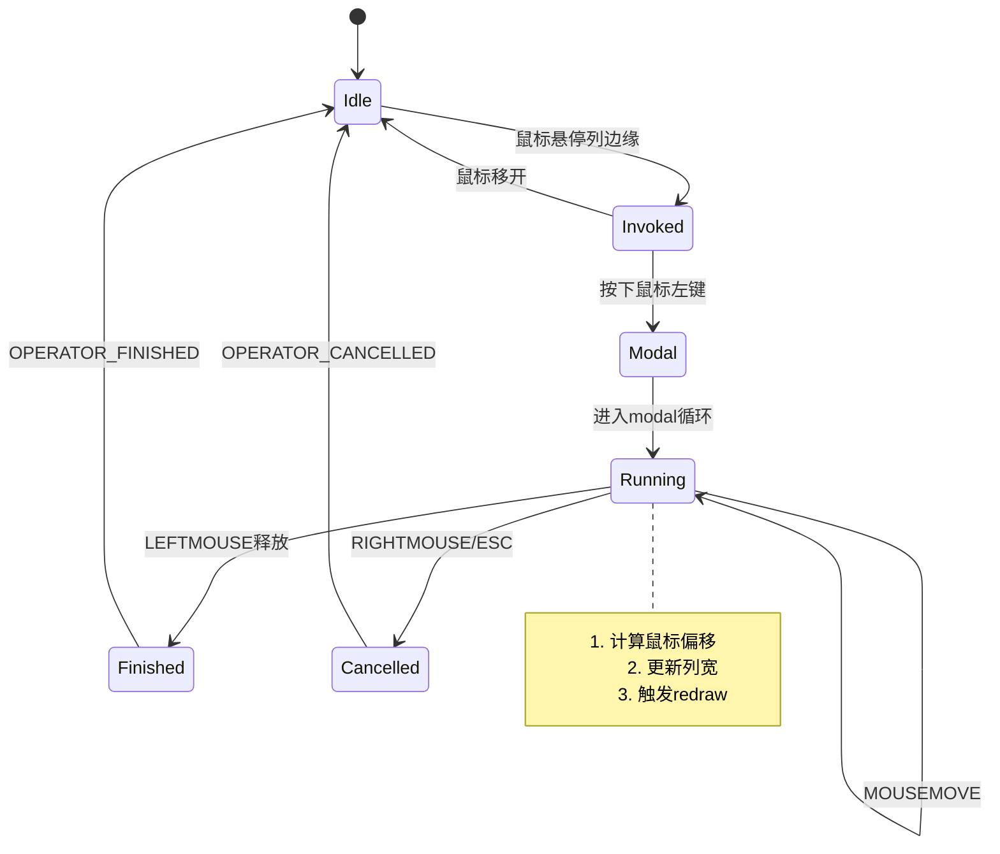

### 3.2 执行流程

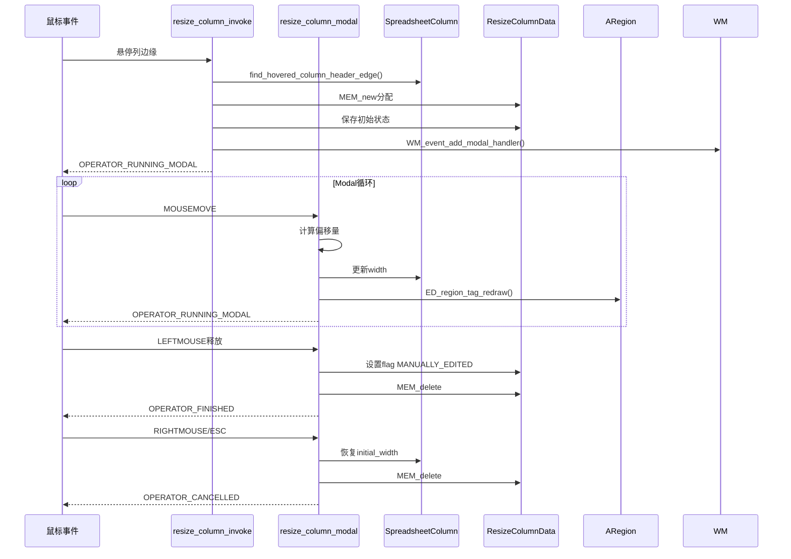

### 3.3 数据结构

```cpp
struct ResizeColumnData {
    SpreadsheetColumn *column = nullptr;      // 目标列
    int2 initial_cursor_re;                    // 初始鼠标位置(区域坐标)
    int initial_width_px;                       // 初始宽度(像素)
};
```

### 3.4 代码实现

```cpp
static wmOperatorStatus resize_column_modal(bContext *C, wmOperator *op, const wmEvent *event) {
    ARegion &region = *CTX_wm_region(C);
    SpaceSpreadsheet &sspreadsheet = *CTX_wm_space_spreadsheet(C);
    SpreadsheetTable &table = *get_active_table(sspreadsheet);
    ResizeColumnData &data = *static_cast<ResizeColumnData *>(op->customdata);

    // Lambda函数简化代码
    auto cancel = [&]() {
        data.column->width = data.initial_width_px / SPREADSHEET_WIDTH_UNIT;
        MEM_delete(&data);
        ED_region_tag_redraw(&region);
        return OPERATOR_CANCELLED;
    };

    auto finish = [&]() {
        table.flag |= SPREADSHEET_TABLE_FLAG_MANUALLY_EDITED;  // 标记用户编辑
        MEM_delete(&data);
        ED_region_tag_redraw(&region);
        return OPERATOR_FINISHED;
    };

    const int2 cursor_re{event->mval[0], event->mval[1]};

    switch (event->type) {
        case RIGHTMOUSE:
        case EVT_ESCKEY:
            return cancel();  // 取消，恢复原始宽度

        case LEFTMOUSE:
            return finish();   // 完成，保存新宽度

        case MOUSEMOVE: {
            // 计算偏移并更新宽度
            const int offset = cursor_re.x - data.initial_cursor_re.x;
            const float new_width_px = std::max<float>(SPREADSHEET_WIDTH_UNIT,
                                                       data.initial_width_px + offset);
            data.column->width = new_width_px / SPREADSHEET_WIDTH_UNIT;
            ED_region_tag_redraw(&region);
            return OPERATOR_RUNNING_MODAL;
        }
        default:
            return OPERATOR_RUNNING_MODAL;
    }
}
```

---

## 4. 模态操作符 - 列重排序

### 4.1 状态机

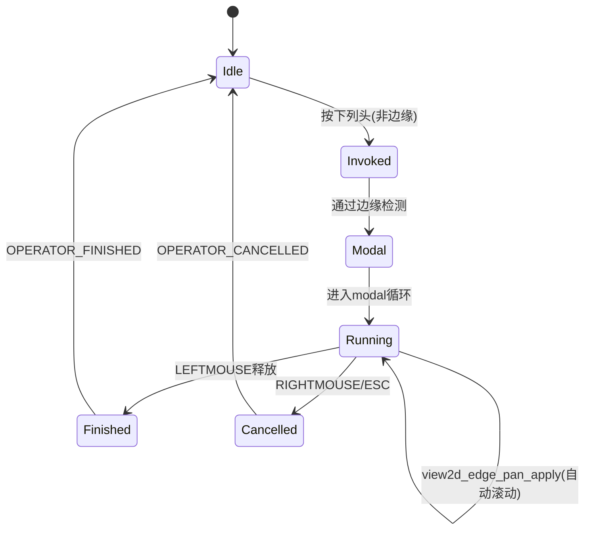

### 4.2 视觉反馈

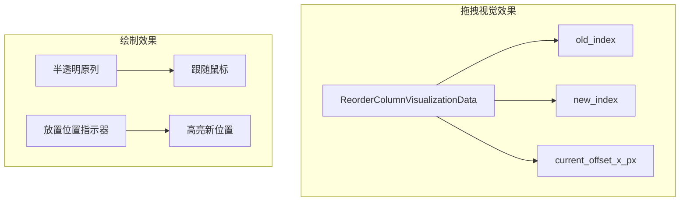

### 4.3 核心逻辑

```cpp
static wmOperatorStatus reorder_columns_modal(bContext *C, wmOperator *op, const wmEvent *event) {
    // ... 省略变量声明

    const int2 cursor_re{event->mval[0], event->mval[1]};
    ReorderColumnData &data = *static_cast<ReorderColumnData *>(op->customdata);

    SpreadsheetTable &table = *get_active_table(sspreadsheet);
    Span<SpreadsheetColumn *> columns(table.columns, table.num_columns);

    const int old_index = columns.first_index(data.column);
    int new_index = 0;

    // 查找悬停目标列
    SpreadsheetColumn *hovered_column = find_hovered_column(sspreadsheet, region, cursor_re);
    if (hovered_column) {
        new_index = columns.first_index(hovered_column);
    } else {
        // 悬停在空白区域，判断左右
        if (cursor_re.x > sspreadsheet.runtime->left_column_width) {
            new_index = *find_last_available_column_index(table);
        } else {
            new_index = *find_first_available_column_index(table);
        }
    }

    // 更新可视化数据
    ReorderColumnVisualizationData &vis_data =
        *sspreadsheet.runtime->reorder_column_visualization_data;
    vis_data.new_index = new_index;
    vis_data.current_offset_x_px = ui::view2d_region_to_view_x(&region.v2d, cursor_re.x)
                                   - data.initial_cursor_x_view;

    switch (event->type) {
        case LEFTMOUSE: {
            if (old_index != new_index) {
                // 移动列位置
                dna::array::move_index(table.columns, table.num_columns, old_index, new_index);
            }
            table.flag |= SPREADSHEET_TABLE_FLAG_MANUALLY_EDITED;
            // 清理并退出
            return OPERATOR_FINISHED;
        }
        // ... 其他case
    }
}
```

### 4.4 自动滚动机制

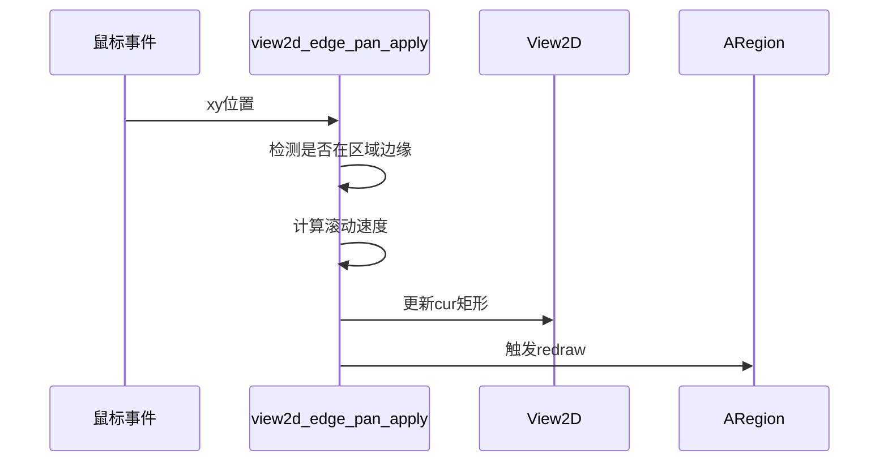

---

## 5. 自适应列宽操作符

### 5.1 执行流程

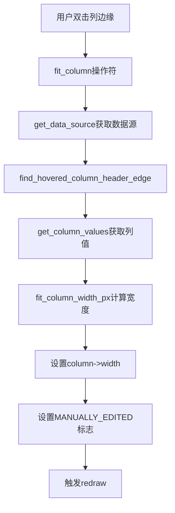

### 5.2 代码实现

```cpp
static wmOperatorStatus fit_column_invoke(bContext *C, wmOperator * /*op*/, const wmEvent *event) {
    SpaceSpreadsheet &sspreadsheet = *CTX_wm_space_spreadsheet(C);
    ARegion &region = *CTX_wm_region(C);

    // 1. 获取数据源
    std::unique_ptr<DataSource> data_source = get_data_source(*C);
    if (!data_source) {
        return OPERATOR_CANCELLED;
    }

    // 2. 找到目标列
    const int2 cursor_re{event->mval[0], event->mval[1]};
    SpreadsheetColumn *column = find_hovered_column_header_edge(sspreadsheet, region, cursor_re);
    if (!column) {
        return OPERATOR_PASS_THROUGH;
    }

    // 3. 获取列值并计算宽度
    std::unique_ptr<ColumnValues> values = data_source->get_column_values(*column->id);
    if (!values) {
        return OPERATOR_CANCELLED;
    }

    // 4. 应用新宽度
    SpreadsheetTable &table = *get_active_table(sspreadsheet);
    table.flag |= SPREADSHEET_TABLE_FLAG_MANUALLY_EDITED;

    const float width_px = values->fit_column_width_px();
    column->width = width_px / SPREADSHEET_WIDTH_UNIT;

    ED_region_tag_redraw(&region);
    return OPERATOR_FINISHED;
}
```

---

## 6. 数据源切换操作符

### 6.1 几何组件切换

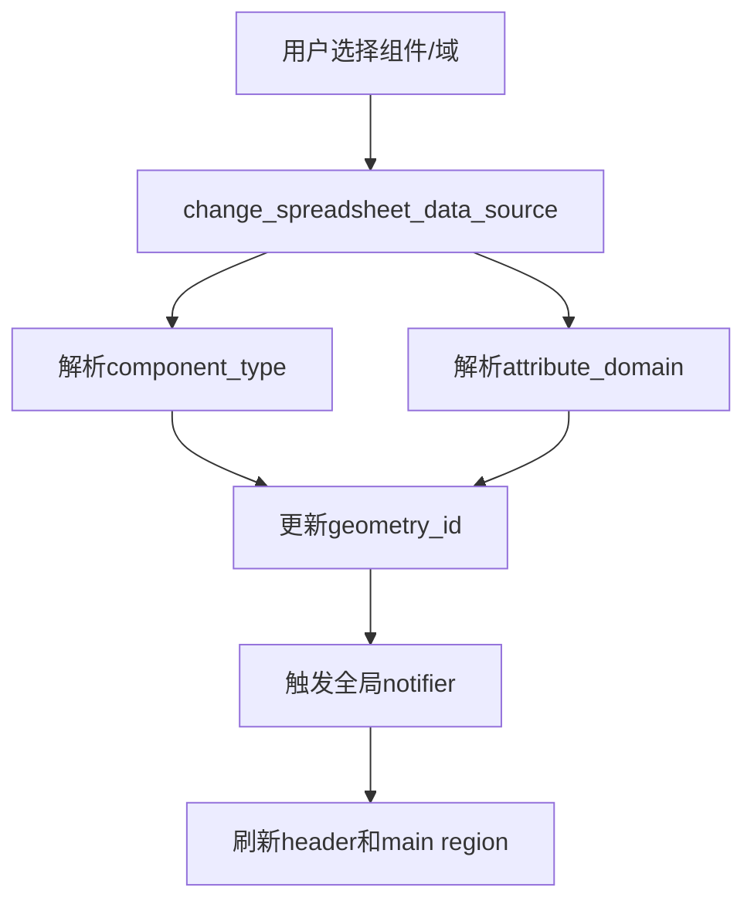

### 6.2 代码实现

```cpp
static wmOperatorStatus select_component_domain_invoke(bContext *C,
                                                        wmOperator *op,
                                                        const wmEvent * /*event*/) {
    // 解析参数
    const auto component_type = bke::GeometryComponent::Type(
        RNA_int_get(op->ptr, "component_type"));
    bke::AttrDomain domain = bke::AttrDomain(
        RNA_int_get(op->ptr, "attribute_domain_type"));

    SpaceSpreadsheet *sspreadsheet = CTX_wm_space_spreadsheet(C);

    // 更新状态
    sspreadsheet->geometry_id.geometry_component_type = uint8_t(component_type);
    sspreadsheet->geometry_id.attribute_domain = uint8_t(domain);

    // 通知刷新（nullptr表示全局更新）
    WM_main_add_notifier(NC_SPACE | ND_SPACE_SPREADSHEET, nullptr);

    return OPERATOR_FINISHED;
}
```

---

## 7. Poll函数机制

### 7.1 Poll作用

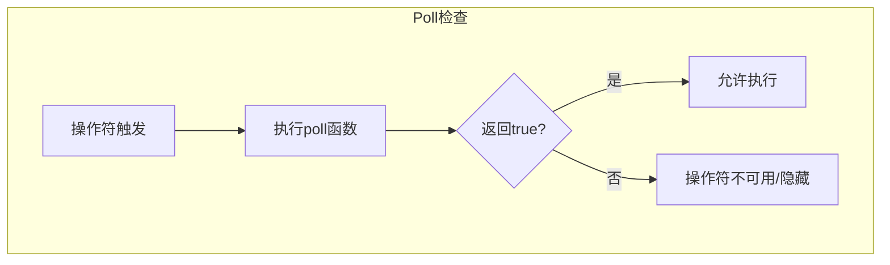

### 7.2 Spreadsheet专用Poll

```cpp
// 基础poll：检查是否在spreadsheet space
bool ED_operator_spreadsheet_active(bContext *C) {
    SpaceSpreadsheet *sspreadsheet = CTX_wm_space_spreadsheet(C);
    return sspreadsheet != nullptr;
}

// 扩展poll：检查是否有数据源
bool spreadsheet_has_data_source(bContext *C) {
    SpaceSpreadsheet *sspreadsheet = CTX_wm_space_spreadsheet(C);
    if (!sspreadsheet) return false;

    std::unique_ptr<DataSource> data_source = get_data_source(*C);
    return data_source != nullptr;
}
```

---

## 8. Notifier系统

### 8.1 Notifier类型

```mermaid
flowchart TB
    subgraph NC_SPACE类别
        A[NC_SPACE | ND_SPACE_SPREADSHEET] --> B[Space变化]
    end

    subgraph 其他可能
        C[NC_SCENE] --> D[场景变化]
        E[NC_OBJECT] --> F[对象变化]
        G[NC_GEOM] --> H[几何数据变化]
    end
```

### 8.2 通知触发时机

| 操作 | Notifier | 说明 |
|------|----------|------|
| 添加筛选器 | NC_SPACE\|ND_SPACE_SPREADSHEET | Space状态变化 |
| 移除筛选器 | NC_SPACE\|ND_SPACE_SPREADSHEET | Space状态变化 |
| 切换数据源 | NC_SPACE\|ND_SPACE_SPREADSHEET, nullptr | 全局更新 |
| 调整列宽 | 无（直接redraw） | 仅UI变化 |
| 重排序列 | 无（直接redraw） | 仅UI变化 |

### 8.3 通知处理

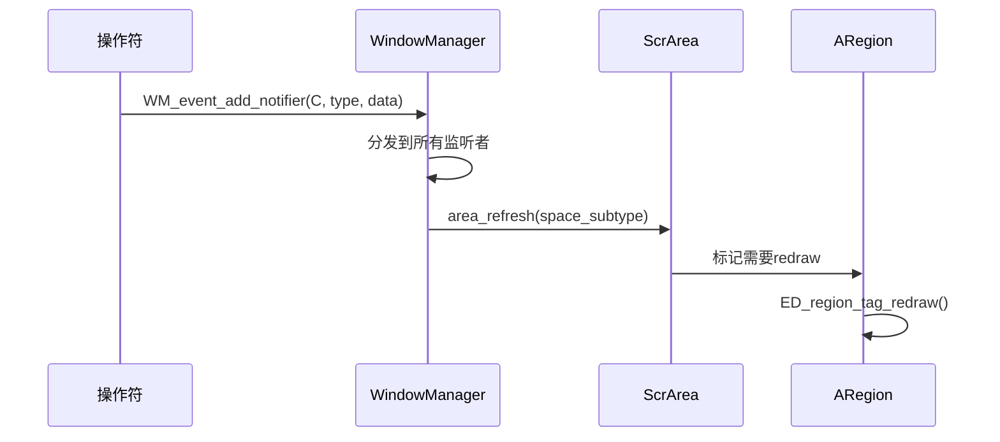

---

## 9. 操作符标志

### 9.1 常用标志

```mermaid
flowchart TB
    subgraph 标志组合
        A[OPTYPE_REGISTER] --> B[注册到撤销栈]
        C[OPTYPE_UNDO] --> D[支持撤销/重做]
        E[OPTYPE_INTERNAL] --> F[内部使用，不显示在搜索]
        G[OPTYPE_BLOCKING] --> H[阻塞其他操作符]
    end

    subgraph 典型配置
        I[筛选操作] --> J[OPTYPE_REGISTER \| OPTYPE_UNDO]
        K[列调整] --> L[OPTYPE_INTERNAL]
        M[模态操作] --> N[OPTYPE_REGISTER \| OPTYPE_UNDO \| OPTYPE_BLOCKING]
    end
```

### 9.2 标志说明

| 标志 | 值 | 作用 |
|-----|-----|------|
| OPTYPE_REGISTER | 0x0001 | 操作记录到撤销历史 |
| OPTYPE_UNDO | 0x0002 | 支持撤销/重做 |
| OPTYPE_BLOCKING | 0x0004 | 阻止其他操作符执行 |
| OPTYPE_MACRO | 0x0008 | 宏操作符 |
| OPTYPE_GRAB_CURSOR_XY | 0x0010 | 抓取光标到XY |
| OPTYPE_GRAB_CURSOR_X | 0x0020 | 抓取光标到X |
| OPTYPE_GRAB_CURSOR_Y | 0x0040 | 抓取光标到Y |
| OPTYPE_PRESET | 0x0080 | 预设操作符 |
| OPTYPE_INTERNAL | 0x0100 | 内部使用 |

---

## 10. RNA参数定义

### 10.1 参数类型

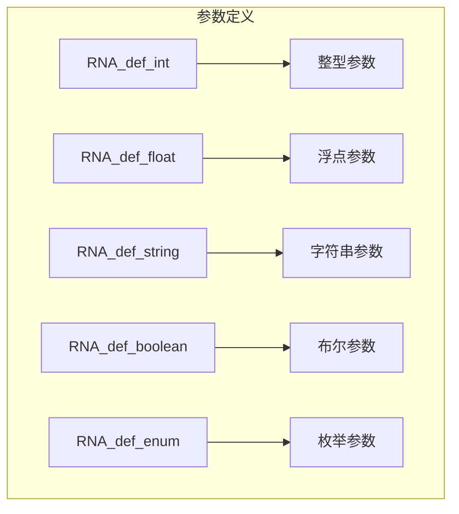

### 10.2 示例：数据源切换

```cpp
static void SPREADSHEET_OT_change_spreadsheet_data_source(wmOperatorType *ot) {
    // ... 基础定义

    // 定义component_type参数
    RNA_def_int(ot->srna,
                "component_type",     // 标识符
                0,                     // 默认值
                0,                     // 最小值
                INT16_MAX,             // 最大值
                "Component Type",      // UI名称
                "",                    // 描述
                0,                     // UI最小值
                INT16_MAX);            // UI最大值

    // 定义attribute_domain_type参数
    RNA_def_int(ot->srna,
                "attribute_domain_type",
                0,
                0,
                INT16_MAX,
                "Attribute Domain Type",
                "",
                0,
                INT16_MAX);
}
```

---

## 11. 完整操作符列表

### 11.1 Spreadsheet操作符

| 操作符ID | 名称 | 类型 | 参数 | 描述 |
|---------|------|------|------|------|
| SPREADSHEET_OT_add_row_filter_rule | Add Row Filter | Exec | 无 | 添加行筛选器 |
| SPREADSHEET_OT_remove_row_filter_rule | Remove Row Filter | Exec | index: int | 移除行筛选器 |
| SPREADSHEET_OT_change_spreadsheet_data_source | Change Visible Data Source | Invoke | component_type, attribute_domain_type | 切换数据源 |
| SPREADSHEET_OT_resize_column | Resize Column | Modal | 无(内部数据) | 调整列宽 |
| SPREADSHEET_OT_fit_column | Fit Column | Invoke | 无 | 自适应列宽 |
| SPREADSHEET_OT_reorder_columns | Reorder Columns | Modal | 无(内部数据) | 重排序列 |

### 11.2 函数对照

| 函数 | 操作符ID | 操作类型 |
|------|---------|---------|
| row_filter_add_exec | add_row_filter_rule | 立即执行 |
| row_filter_remove_exec | remove_row_filter_rule | 立即执行 |
| select_component_domain_invoke | change_spreadsheet_data_source | 立即执行 |
| resize_column_invoke/modal | resize_column | 模态 |
| fit_column_invoke | fit_column | 立即执行 |
| reorder_columns_invoke/modal | reorder_columns | 模态 |

---

## 12. 交互设计要点

### 12.1 鼠标悬停检测

```cpp
// 检测是否悬停在表头
static bool is_hovering_header_row(const SpaceSpreadsheet &sspreadsheet,
                                   const ARegion &region,
                                   const int2 &cursor_re) {
    const int region_height = BLI_rcti_size_y(&region.winrct);
    return cursor_re.y >= region_height - sspreadsheet.runtime->top_row_height &&
           cursor_re.y <= region_height;
}

// 检测列边缘
SpreadsheetColumn *find_hovered_column_header_edge(SpaceSpreadsheet &sspreadsheet,
                                                    ARegion &region,
                                                    const int2 &cursor_re) {
    if (!is_hovering_header_row(sspreadsheet, region, cursor_re)) {
        return nullptr;
    }
    return find_hovered_column_edge(sspreadsheet, region, cursor_re);
}
```

### 12.2 坐标空间转换

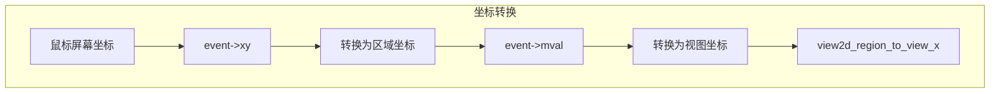

---

*文档创建: 2025年*
*基于 spreadsheet_ops.cc 分析*
