# Spreadsheet UI架构

> 📍 目标：理解面板系统、数据集UI和Blender UI框架集成

---

## 1. 整体UI结构

### 1.1 Region布局

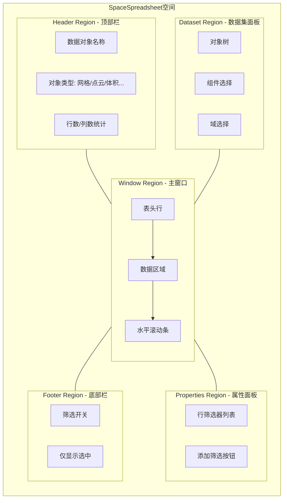

### 1.2 Region注册

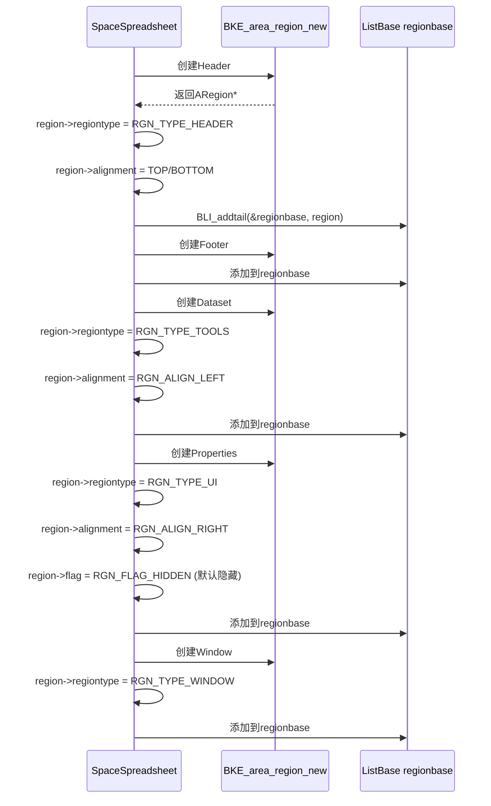

---

## 2. 数据集面板

### 2.1 面板注册

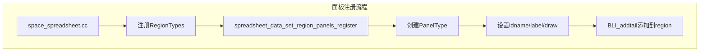

### 2.2 数据结构

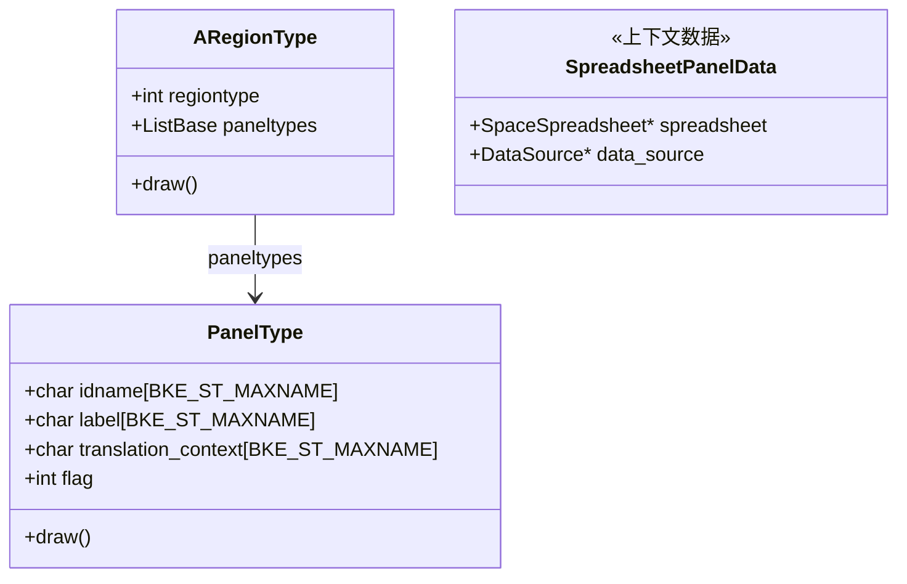

### 2.3 面板绘制

```cpp
// spreadsheet_panels.cc
void spreadsheet_data_set_region_panels_register(ARegionType &region_type) {
    PanelType *panel_type = MEM_new_zeroed<PanelType>(__func__);

    // 设置面板标识
    STRNCPY_UTF8(panel_type->idname, "SPREADSHEET_PT_data_set");
    STRNCPY_UTF8(panel_type->label, N_("Data Set"));
    STRNCPY_UTF8(panel_type->translation_context, BLT_I18NCONTEXT_DEFAULT_BPYRNA);

    // 无header，直接显示内容
    panel_type->flag = PANEL_TYPE_NO_HEADER;

    // 绑定绘制函数
    panel_type->draw = spreadsheet_data_set_panel_draw;

    // 添加到region
    BLI_addtail(&region_type.paneltypes, panel_type);
}
```

### 2.4 数据集树形结构

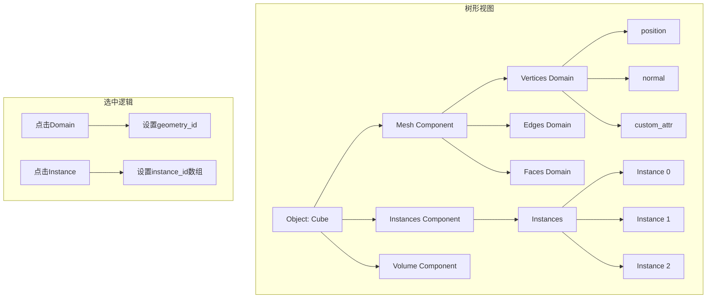

---

## 3. 数据集绘制实现

### 3.1 绘制流程

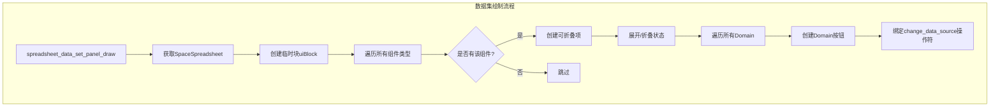

### 3.2 组件选择UI

```cpp
// 简化的绘制逻辑
void spreadsheet_data_set_panel_draw(const bContext *C, Panel *panel) {
    uiBlock *block = uiLayoutGetBlock(layout);

    // 获取当前Space
    SpaceSpreadsheet *sspreadsheet = CTX_wm_space_spreadsheet(C);

    // 绘制对象选择器
    uiItemO(layout, nullptr, ICON_OBJECT_DATA, "SPREADSHEET_OT_select_object");

    // 绘制组件列表
    for (auto component_type : component_types) {
        // 检查组件是否存在
        if (!geometry_set.has(component_type)) continue;

        // 创建折叠面板
        uiLayout *box = uiLayoutPanel(
            C, layout, component_type_to_name(component_type));

        // 绘制域选择
        for (auto domain : supported_domains(component_type)) {
            uiItemFullO(box,
                       "SPREADSHEET_OT_change_spreadsheet_data_source",
                       component_type, domain);
        }
    }
}
```

### 3.3 实例导航

```mermaid
flowchart TB
    subgraph 实例层级展示
        A[Instances Component] --> B[Instances文件夹]
        B --> C[Instance 0: Cube]
        B --> D[Instance 1: Sphere]
        B --> E[Instance 2: Cylinder]

        C --> F[点击] --> G[进入实例视图]
        D --> H[点击] --> I[进入实例视图]
        E --> J[点击] --> K[进入实例视图]
    end

    subgraph 面包屑导航
        L[返回上一级] <-- M[Object: Cube]
        M <-- N[Instances/Instance 0]
        N <-- O[Mesh Component]
    end
```

---

## 4. 行筛选器UI

### 4.1 筛选器布局

```mermaid
flowchart TB
    subgraph 筛选器面板
        A[属性面板] --> B[筛选器列表]

        B --> C[筛选器1: position.x > 0]
        B --> D[筛选器2: material_index == 1]
        B --> E[+ 添加筛选器]

        C --> F[列选择: position.x]
        C --> G[操作符: >]
        C --> H[值: 0]
        C --> I[删除按钮]

        D --> J[列选择: material_index]
        D --> K[操作符: ==]
        D --> L[值: 1]
        D --> M[删除按钮]
    end

    subgraph 组合模式
        N[所有条件(AND)] --> O[任一条件(OR)]
    end
```

### 4.2 筛选器代码结构

```cpp
// spreadsheet_row_filter_ui.cc
void spreadsheet_row_filter_panel_draw(const bContext *C, Panel *panel) {
    SpaceSpreadsheet *sspreadsheet = CTX_wm_space_spreadsheet(C);
    uiLayout *layout = panel->layout;

    // 遍历所有筛选器
    int index = 0;
    LISTBASE_FOREACH (SpreadsheetRowFilter *, filter, &sspreadsheet->row_filters) {
        uiLayout *row = uiLayoutRow(layout, true);

        // 列名选择
        uiItemR(row, filter_ptr, "column_name", UI_ITEM_R_EXPAND_EVENT, "", ICON_NONE);

        // 操作符选择
        uiItemR(row, filter_ptr, "operation", UI_ITEM_R_EXPAND_EVENT, "", ICON_NONE);

        // 值输入
        uiItemR(row, filter_ptr, "value", UI_ITEM_R_EXPAND_EVENT, "", ICON_NONE);

        // 删除按钮
        uiItemO(row, "", ICON_X,
                "SPREADSHEET_OT_remove_row_filter_rule");

        // 传递索引参数
        uiItemIntO(row, "index", index);

        index++;
    }

    // 添加筛选器按钮
    uiItemO(layout, "Add Filter", ICON_PLUS,
            "SPREADSHEET_OT_add_row_filter_rule");
}
```

### 4.3 动态类型切换

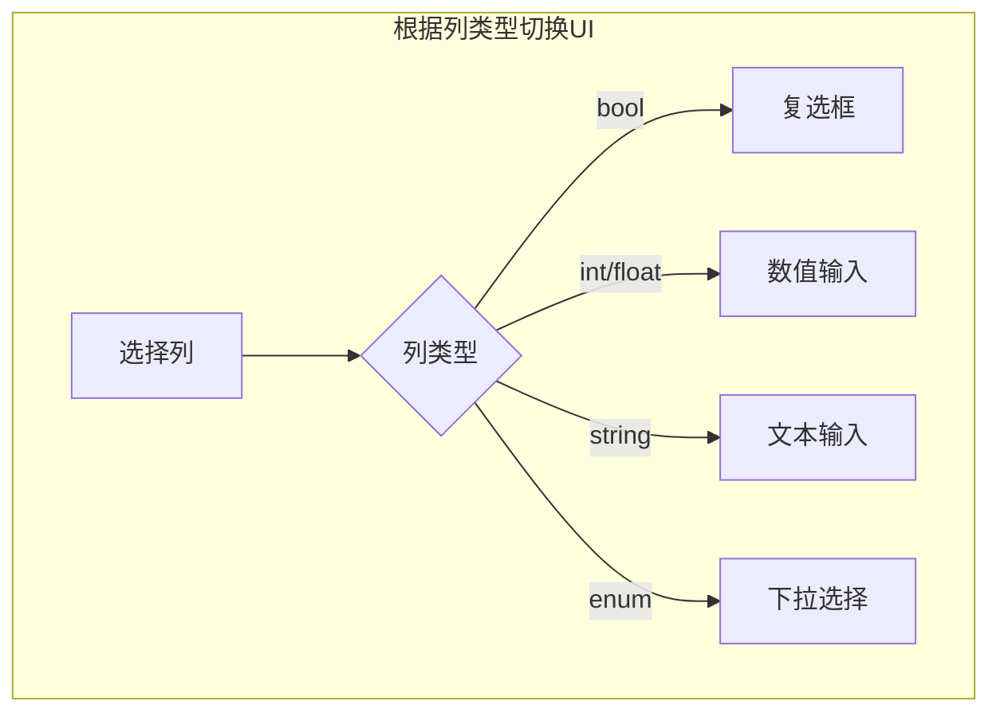

---

## 5. 表头UI

### 5.1 表头结构

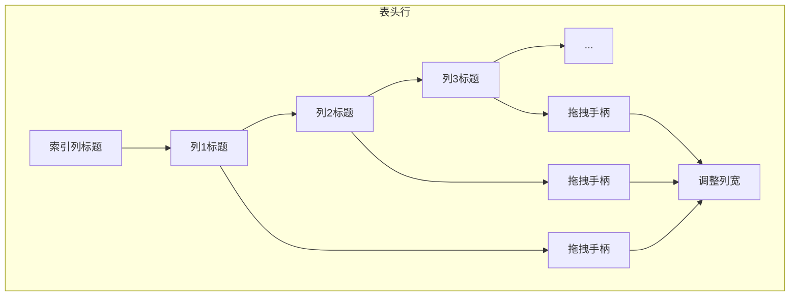

### 5.2 表头按钮

```cpp
void draw_header_cell(uiBlock *block,
                      const SpreadsheetColumn *column,
                      float x, float y,
                      float width, float height) {
    // 创建按钮
    uiBut *but = uiDefBut(block, UI_BTYPE_LABEL, 0,
                          column->id->name,
                          x, y, width, height,
                          nullptr, 0, 0, 0, 0, "");

    // 设置按钮属性
    but->flag = UI_BUT_TEXT_LEFT;
    but->drawflag = UI_BUT_TEXT_LEFT;

    // 添加工具提示
    but->tooltip = column_tooltip(column);
}
```

---

## 6. Blender UI框架集成

### 6.1 UI层级

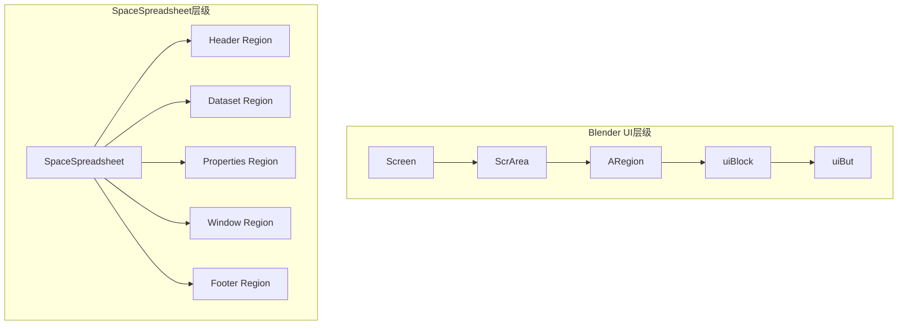

### 6.2 上下文获取

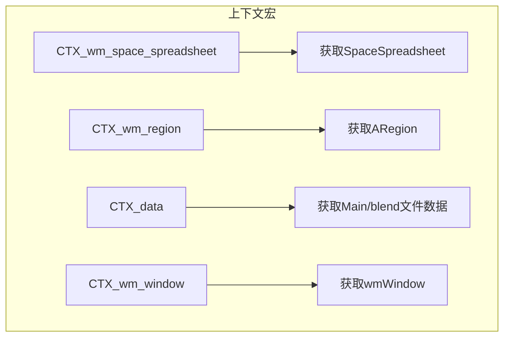

### 6.3 布局系统

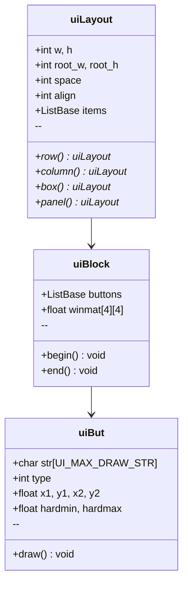

---

## 7. RNA属性绑定

### 7.1 RNA定义

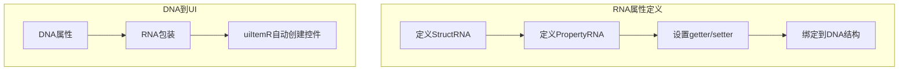

### 7.2 Spreadsheet RNA属性

```cpp
// DNA属性定义
// DNA_space_types.h
struct SpreadsheetRowFilter {
    int flag;
    char column_name[64];
    int data_type;  // eSpreadsheetColumnValueType
    int operation;  // eSpreadsheetFilterOperation
    SpreadsheetFilterValue value;
};

// RNA定义（简化）
void RNA_def_spreadsheet_row_filter(BlenderRNA *brna) {
    StructRNA *srna;
    PropertyRNA *prop;

    srna = RNA_def_struct(brna, "SpreadsheetRowFilter", nullptr);
    RNA_def_struct_sdna(srna, "SpreadsheetRowFilter");
    RNA_def_struct_ui_text(srna, "Spreadsheet Row Filter", "");

    // column_name属性
    prop = RNA_def_property(srna, "column_name", PROP_STRING, PROP_NONE);
    RNA_def_property_string_funcs(prop, "rna_SpreadsheetRowFilter_column_name_get",
                                  "rna_SpreadsheetRowFilter_column_name_length",
                                  "rna_SpreadsheetRowFilter_column_name_set");
    RNA_def_property_ui_text(prop, "Column", "Column to filter");

    // operation属性
    prop = RNA_def_property(srna, "operation", PROP_ENUM, PROP_NONE);
    RNA_def_property_enum_items(prop, rna_enum_spreadsheet_filter_operation);
    RNA_def_property_ui_text(prop, "Operation", "Filter operation");
}
```

---

## 8. 国际化支持

### 8.1 翻译标记

```mermaid
flowchart TB
    subgraph 翻译使用
        A[N_("Data Set")] --> B[标记需要翻译]
        B --> C[提取到po文件]
        C --> D[翻译人员翻译]
        D --> E[运行时加载.mo文件]
    end
```

### 8.2 代码示例

```cpp
// 定义时的翻译标记
STRNCPY_UTF8(panel_type->label, N_("Data Set"));
STRNCPY_UTF8(panel_type->translation_context, BLT_I18NCONTEXT_DEFAULT_BPYRNA);

// RNA定义中的翻译
RNA_def_property_ui_text(prop, N_("Column"), N_("Column to filter"));

// 操作符描述
ot->description = N_("Add a filter to remove rows from the displayed data");
```

---

## 9. 主题系统

### 9.1 主题集成

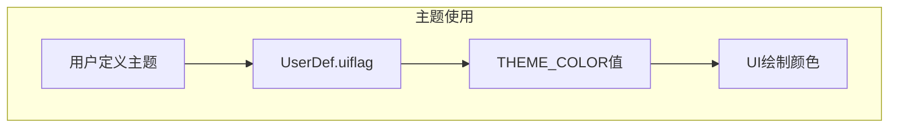

### 9.2 主题常量

```cpp
// 在绘制代码中使用
immUniformThemeColor(TH_BACK);           // 背景色
immUniformThemeColorShade(TH_BACK, 11);   // 背景色+11亮度
immUniformThemeColor(TH_ROW_ALTERNATE);   // 交替行色
immUniformThemeColor(TH_TEXT);            // 文字颜色
immUniformThemeColor(TH_HEADER);          // 表头颜色
```

---

## 10. 事件处理流程

### 10.1 鼠标事件传递

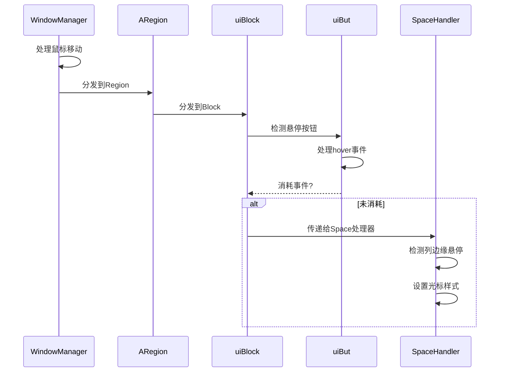

### 10.2 操作符触发

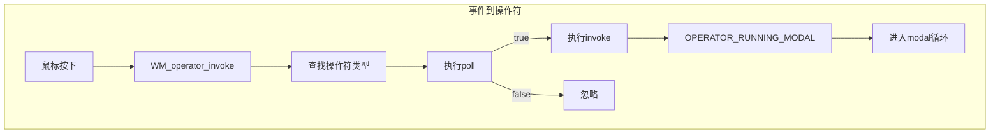

---

## 11. 关键UI函数

### 11.1 常用UI函数

| 函数 | 作用 | 示例 |
|-----|------|------|
| `uiLayoutRow` | 创建水平布局 | `uiLayoutRow(layout, true)` |
| `uiLayoutColumn` | 创建垂直布局 | `uiLayoutColumn(layout, true)` |
| `uiLayoutBox` | 创建带边框的布局 | `uiLayoutBox(layout)` |
| `uiLayoutPanel` | 创建可折叠面板 | `uiLayoutPanel(C, layout, label)` |
| `uiItemR` | 添加属性控件 | `uiItemR(layout, ptr, propname)` |
| `uiItemO` | 添加操作符按钮 | `uiItemO(layout, label, icon, opid)` |
| `uiDefBut` | 定义按钮 | `uiDefBut(block, type, retval, str...)` |

### 11.2 面板函数

| 函数 | 文件 | 作用 |
|------|------|------|
| `spreadsheet_data_set_region_panels_register` | panels.cc | 注册数据集面板 |
| `spreadsheet_data_set_panel_draw` | dataset_draw.cc | 绘制数据集面板 |
| `spreadsheet_row_filter_panel_draw` | row_filter_ui.cc | 绘制筛选器面板 |

---

## 12. UI设计原则

### 12.1 可用性考虑

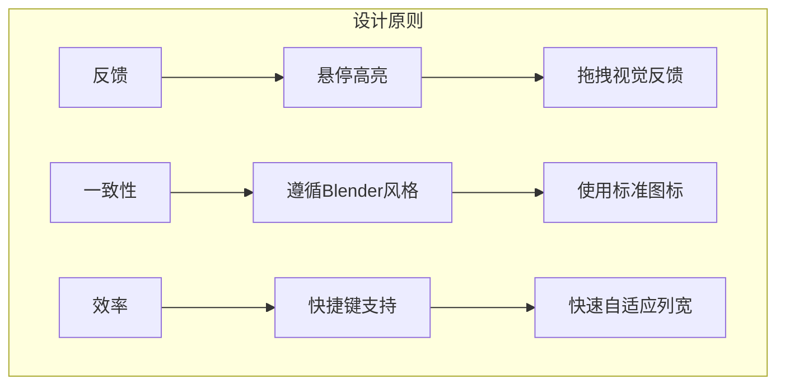

### 12.2 可访问性

| 考虑点 | 实现 |
|-------|------|
| 键盘导航 | Tab切换焦点 |
| 高对比度 | 使用主题系统 |
| 工具提示 | 所有按钮提供tooltip |
| 图标+文字 | 重要按钮同时使用 |

---

*文档创建: 2025年*
*基于 spreadsheet_panels.cc, spreadsheet_row_filter_ui.hh/cc, spreadsheet_dataset_draw.hh/cc 分析*
