# Spreadsheet 列值系统

> 📍 目标：理解列值抽象、类型系统和数据显示

---

## 1. ColumnValues 类设计

### 1.1 类结构

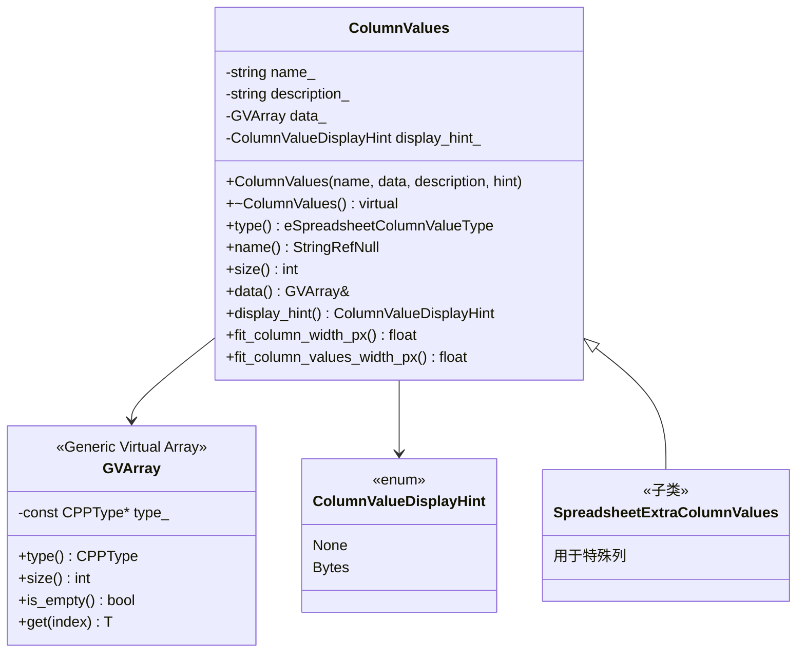

### 1.2 设计意图

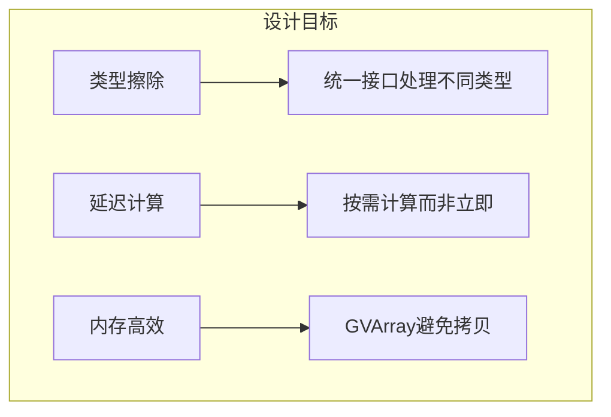

---

## 2. GVArray 详解

### 2.1 GVArray是什么

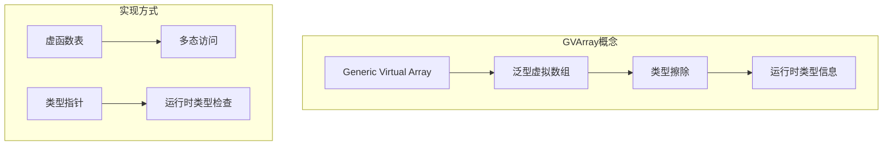

### 2.2 GVArray使用场景

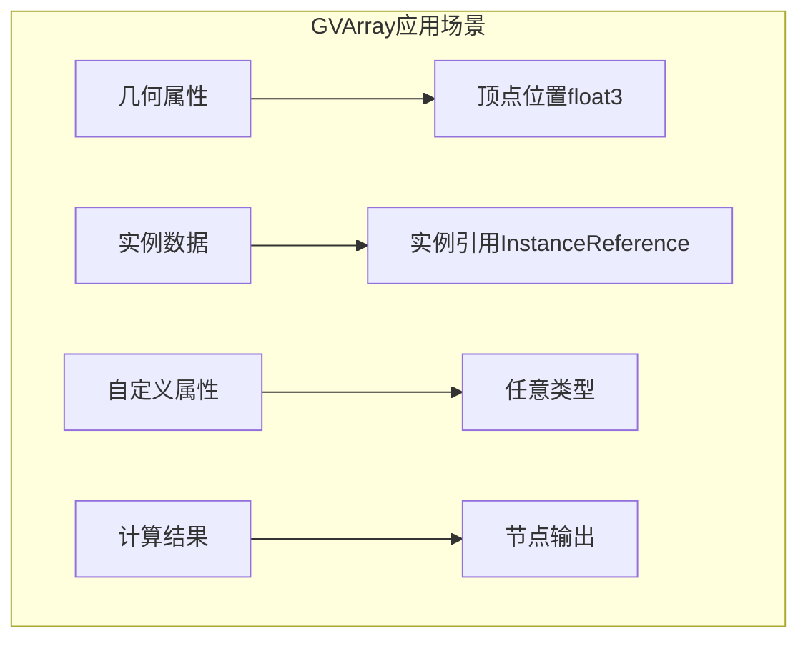

### 2.3 代码示例

```cpp
// 创建GVArray
std::unique_ptr<ColumnValues> GeometryDataSource::get_column_values(
    const SpreadsheetColumnID &column_id) const
{
    // 获取属性读取器
    const std::optional<bke::AttributeReader> reader =
        attributes->lookup(column_id.name);

    if (!reader) {
        return {};  // 属性不存在
    }

    // 转换为GVArray
    GVArray gvarray = *reader;

    // 创建ColumnValues
    return std::make_unique<ColumnValues>(
        column_id.name,
        std::move(gvarray)
    );
}
```

---

## 3. 类型映射系统

### 3.1 C++类型到列类型

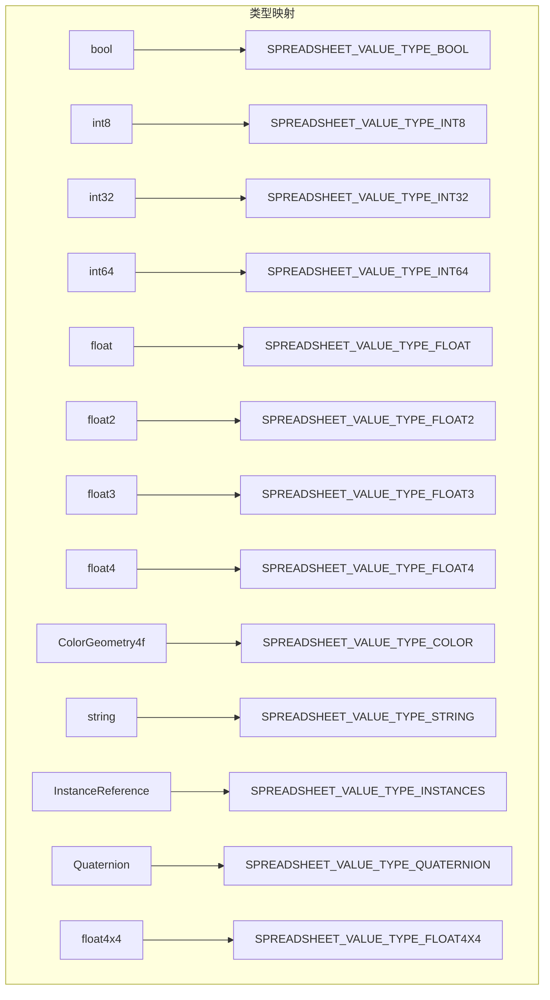

### 3.2 映射实现

```cpp
// spreadsheet_column.cc
eSpreadsheetColumnValueType cpp_type_to_column_type(const CPPType &type) {
    if (type.is<bool>()) {
        return SPREADSHEET_VALUE_TYPE_BOOL;
    }
    if (type.is<int8_t>()) {
        return SPREADSHEET_VALUE_TYPE_INT8;
    }
    if (type.is<int>()) {
        return SPREADSHEET_VALUE_TYPE_INT32;
    }
    if (type.is<int64_t>()) {
        return SPREADSHEET_VALUE_TYPE_INT64;
    }
    if (type.is_any<short2, int2>()) {
        return SPREADSHEET_VALUE_TYPE_INT32_2D;
    }
    if (type.is_any<int3>()) {
        return SPREADSHEET_VALUE_TYPE_INT32_3D;
    }
    if (type.is<float>()) {
        return SPREADSHEET_VALUE_TYPE_FLOAT;
    }
    if (type.is<float2>()) {
        return SPREADSHEET_VALUE_TYPE_FLOAT2;
    }
    if (type.is<float3>()) {
        return SPREADSHEET_VALUE_TYPE_FLOAT3;
    }
    if (type.is<float4>()) {
        return SPREADSHEET_VALUE_TYPE_FLOAT4;
    }
    if (type.is<ColorGeometry4f>()) {
        return SPREADSHEET_VALUE_TYPE_COLOR;
    }
    if (type.is<std::string>() || type.is<MStringProperty>()) {
        return SPREADSHEET_VALUE_TYPE_STRING;
    }
    if (type.is<bke::InstanceReference>()) {
        return SPREADSHEET_VALUE_TYPE_INSTANCES;
    }
    if (type.is<ColorGeometry4b>()) {
        return SPREADSHEET_VALUE_TYPE_BYTE_COLOR;
    }
    if (type.is<math::Quaternion>()) {
        return SPREADSHEET_VALUE_TYPE_QUATERNION;
    }
    if (type.is<float4x4>()) {
        return SPREADSHEET_VALUE_TYPE_FLOAT4X4;
    }
    if (type.is<nodes::BundleItemValue>()) {
        return SPREADSHEET_VALUE_TYPE_BUNDLE_ITEM;
    }
    return SPREADSHEET_VALUE_TYPE_UNKNOWN;
}
```

---

## 4. 列宽自适应

### 4.1 自适应算法

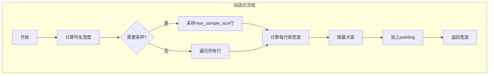

### 4.2 代码实现

```cpp
float ColumnValues::fit_column_width_px(
    const std::optional<int64_t> &max_sample_size) const
{
    // 1. 计算列名宽度
    float name_width = 0;
    if (!name_.empty()) {
        name_width = BLF_width(font_id, name_.c_str(), name_.size());
    }

    // 2. 计算值宽度
    float values_width = this->fit_column_values_width_px(max_sample_size);

    // 3. 取最大值并加边距
    float width = std::max(name_width, values_width);
    width += CELL_RIGHT_PADDING * 2;

    return width;
}

float ColumnValues::fit_column_values_width_px(
    const std::optional<int64_t> &max_sample_size) const
{
    if (data_.is_empty()) {
        return 0;
    }

    // 采样大小
    const int64_t size = data_.size();
    const int64_t sample_size = max_sample_size ?
        std::min(*max_sample_size, size) : size;

    float max_width = 0;

    // 遍历采样
    for (int64_t i = 0; i < sample_size; i++) {
        float value_width = this->compute_value_width(i);
        max_width = std::max(max_width, value_width);
    }

    // 如果是采样，确保最小宽度
    if (max_sample_size && sample_size < size) {
        max_width = std::max(max_width, MIN_COLUMN_WIDTH);
    }

    return max_width;
}
```

---

## 5. 特殊列处理

### 5.1 特殊列识别

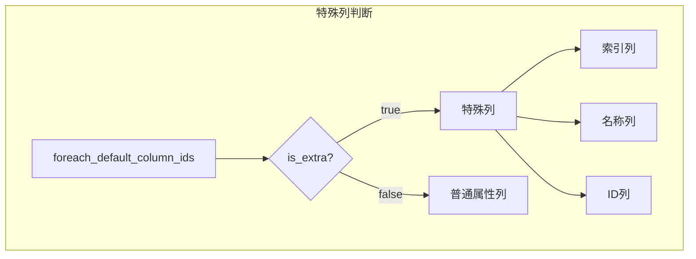

### 5.2 特殊列实现

```cpp
// GeometryDataSource中的特殊列处理
void GeometryDataSource::foreach_default_column_ids(
    FunctionRef<void(const SpreadsheetColumnID &, bool is_extra)> fn) const
{
    // 1. 特殊列（is_extra = true）
    SpreadsheetColumnID index_column;
    STRNCPY(index_column.name, "index");
    fn(index_column, true);  // 标记为extra

    SpreadsheetColumnID name_column;
    STRNCPY(name_column.name, "name");
    fn(name_column, true);   // 标记为extra

    // 2. 普通属性列（is_extra = false）
    attributes->foreach_attribute([&](const bke::AttributeIDRef &id, ...) {
        SpreadsheetColumnID column_id;
        column_id.name = id.name();
        fn(column_id, false);
    });
}
```

### 5.3 特殊列值生成

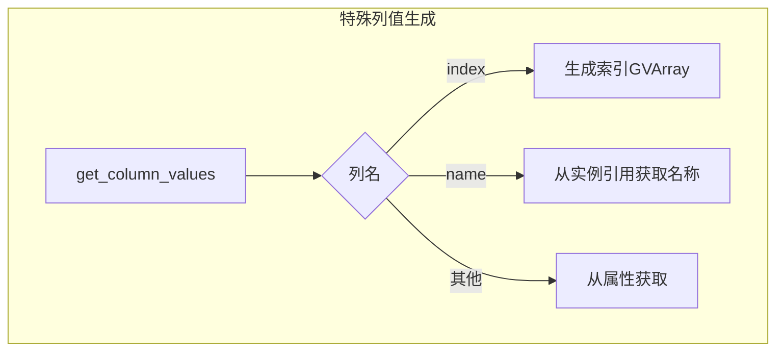

---

## 6. 显示提示系统

### 6.1 ColumnValueDisplayHint

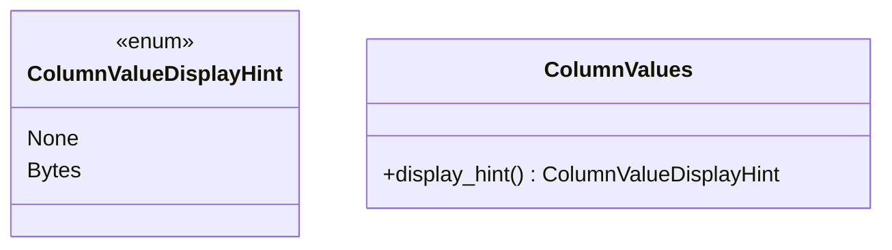

### 6.2 应用场景

| Hint值 | 作用 | 示例 |
|-------|------|------|
| None | 默认显示 | 大多数类型 |
| Bytes | 以字节格式显示 | 内存大小、文件大小 |

### 6.3 代码实现

```cpp
// 设置显示提示
ColumnValues values("memory", data, "", ColumnValueDisplayHint::Bytes);

// 绘制时使用
if (column_values.display_hint() == ColumnValueDisplayHint::Bytes) {
    draw_bytes_cell(params, value);
} else {
    draw_default_cell(params, value);
}
```

---

## 7. 性能考虑

### 7.1 惰性计算

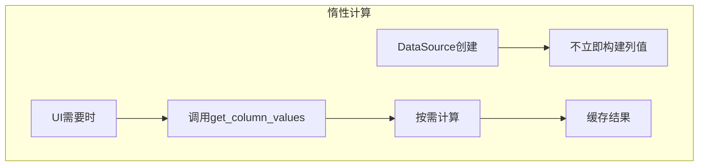

### 7.2 采样策略

```cpp
// 大数据集优化
void draw_spreadsheet(...) {
    // 绘制时只采样计算列宽
    const std::optional<int64_t> max_sample_size = 100;

    for (const auto &column : columns) {
        float width = column.values->fit_column_width_px(max_sample_size);
        // ...
    }
}
```

### 7.3 内存管理

| 技术 | 说明 |
|-----|------|
| unique_ptr | 自动管理ColumnValues生命周期 |
| ResourceScope | 管理临时计算内存 |
| move语义 | 避免不必要拷贝 |

---

## 8. 扩展指南

### 8.1 添加新列类型步骤

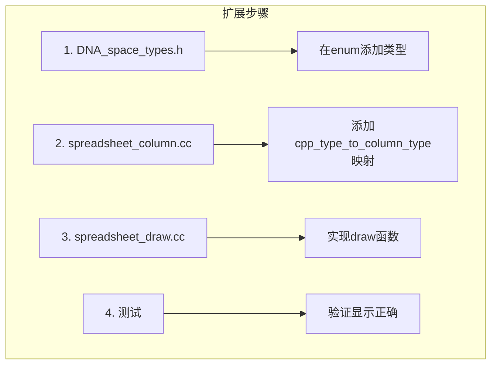

### 8.2 扩展示例

```cpp
// 步骤1: 在enum中添加
// DNA_space_types.h
typedef enum eSpreadsheetColumnValueType {
    // ... 现有类型
    SPREADSHEET_VALUE_TYPE_NEW_TYPE,
} eSpreadsheetColumnValueType;

// 步骤2: 添加类型映射
// spreadsheet_column.cc
eSpreadsheetColumnValueType cpp_type_to_column_type(const CPPType &type) {
    // ... 现有映射
    if (type.is<NewType>()) {
        return SPREADSHEET_VALUE_TYPE_NEW_TYPE;
    }
    return SPREADSHEET_VALUE_TYPE_UNKNOWN;
}

// 步骤3: 实现绘制函数
// spreadsheet_draw.cc
void draw_content_cell(int row, int col, const CellDrawParams &params) {
    switch (column_type) {
        // ... 现有case
        case SPREADSHEET_VALUE_TYPE_NEW_TYPE:
            draw_new_type_cell(params, data.get<NewType>(row));
            break;
    }
}
```

---

## 9. 关键源码分析

### 9.1 ColumnValues构造函数

```cpp
ColumnValues::ColumnValues(std::string name,
                           GVArray data,
                           std::string description,
                           const ColumnValueDisplayHint display_hint)
    : name_(std::move(name)),
      description_(std::move(description)),
      data_(std::move(data)),
      display_hint_(display_hint)
{
    // 断言：数组不能为空
    BLI_assert(data_);
}
```

### 9.2 关键方法

```cpp
// 获取类型
eSpreadsheetColumnValueType type() const {
    return cpp_type_to_column_type(data_.type());
}

// 获取名称
StringRefNull name() const {
    return name_;
}

// 获取大小
int size() const {
    return data_.size();
}

// 获取数据引用
const GVArray &data() const {
    return data_;
}
```

---

*文档创建: 2025年*
*基于 spreadsheet_column_values.hh, spreadsheet_column.cc 分析*
