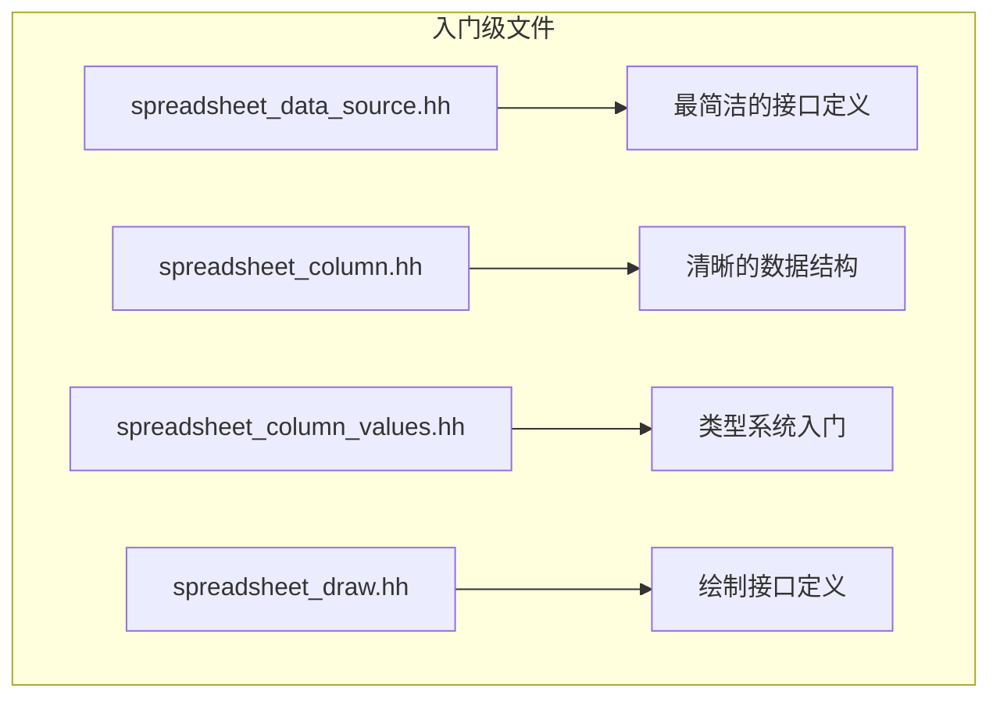
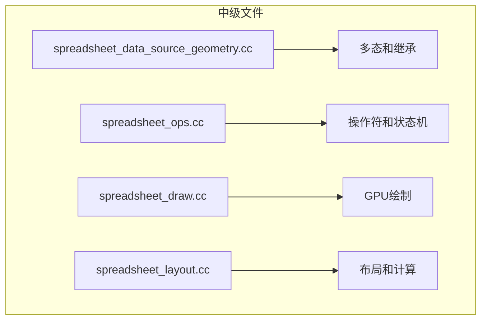
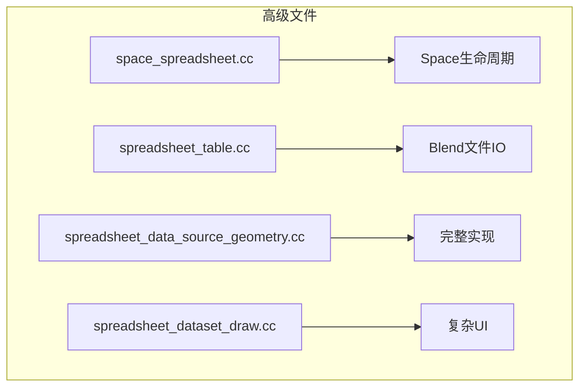
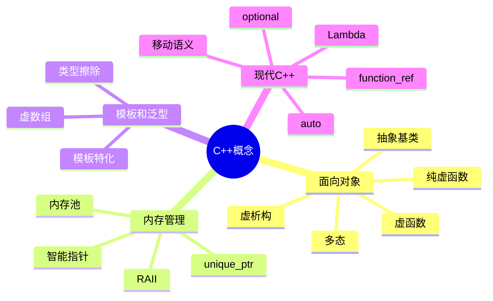
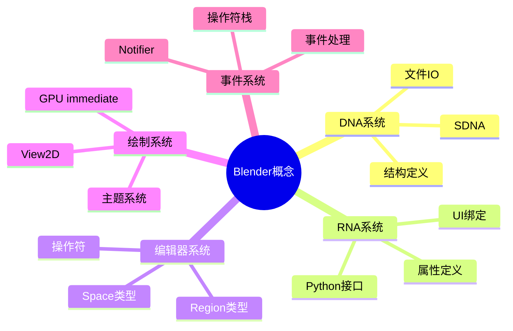
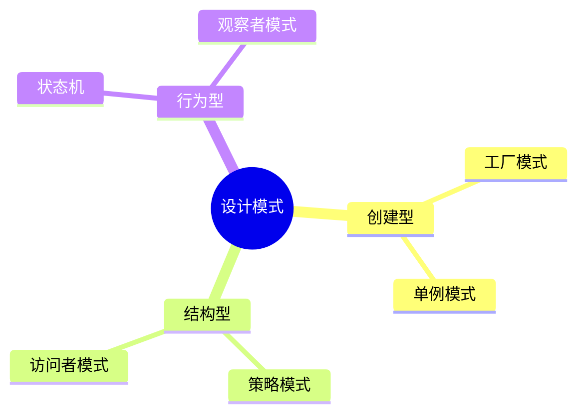
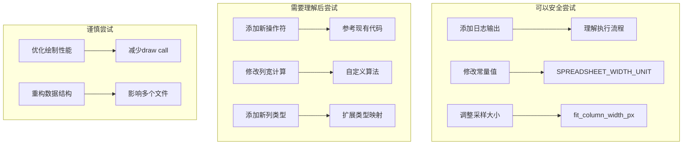
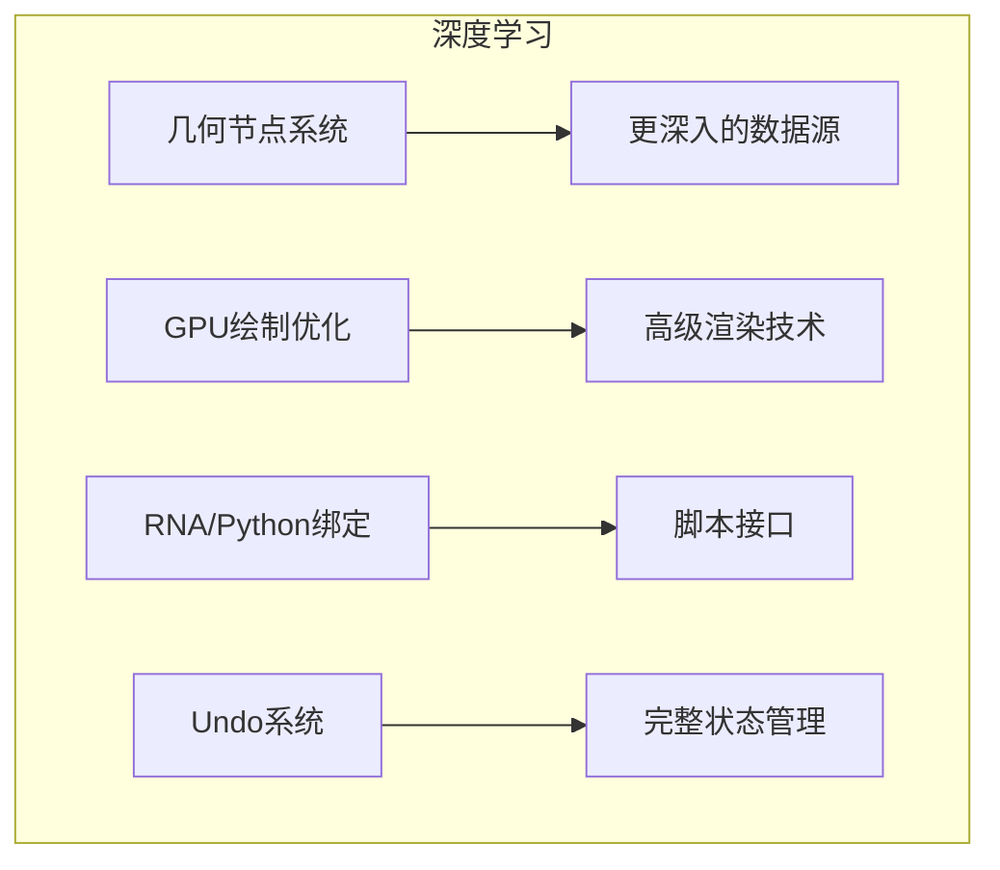

# Spreadsheet Editor 学习路径

> 📍 完整的学习路线图和推荐阅读顺序

---

## 1. 学习路线图

```mermaid
flowchart TB
    subgraph 第一阶段：架构理解 [1-2周]
        A[阅读01-架构概览.md] --> B[理解模块关系]
        B --> C[画出自己的架构图]
        C --> D[对比其他Space模块]
    end

    subgraph 第二阶段：数据层深入 [2-3周]
        E[阅读02-数据源详细分析.md] --> F[理解DataSource设计]
        F --> G[阅读03-列和表格系统.md]
        G --> H[理解内存管理]
        H --> I[阅读07-列值系统.md]
        I --> J[理解GVArray]
    end

    subgraph 第三阶段：UI层 [2-3周]
        K[阅读04-绘制系统.md] --> L[理解GPU绘制]
        L --> M[阅读05-操作符系统.md]
        M --> N[实现简单操作符]
        N --> O[阅读06-UI架构.md]
        O --> P[理解Blender UI框架]
    end

    subgraph 第四阶段：实践 [2-4周]
        Q[添加调试日志] --> R[跟踪完整数据流]
        S[修改列宽计算] --> T[实现新操作符]
        U[性能分析] --> V[优化绘制]
    end

    D --> E
    J --> K
    P --> Q
```

---

## 2. 按难度分级的源码阅读

### 2.1 入门级 (适合初学者)



**学习重点：**
- 理解类设计
- 掌握命名空间使用
- 学习头文件组织
- 理解const和virtual

### 2.2 中级 (需要C++基础)



**学习重点：**
- 虚函数和多态
- 内存管理
- GPU编程基础
- Lambda表达式

### 2.3 高级 (需要Blender知识)



**学习重点：**
- Blender Space系统
- DNA/RNA系统
- 文件持久化
- 复杂UI交互

---

## 3. 推荐学习顺序

### 第1周：概览和接口

| 天 | 文件 | 目标 |
|----|------|------|
| 1 | spreadsheet_data_source.hh | 理解DataSource接口 |
| 2 | spreadsheet_data_source_geometry.hh | 理解具体实现 |
| 3 | spreadsheet_column.hh | 理解列结构 |
| 4 | spreadsheet_column_values.hh | 理解值系统 |
| 5 | spreadsheet_table.hh | 理解表格管理 |
| 6-7 | 总结和笔记 | 画出自己的理解图 |

### 第2周：实现细节

| 天 | 文件 | 目标 |
|----|------|------|
| 1-2 | spreadsheet_data_source_geometry.cc | 理解数据源创建 |
| 3-4 | spreadsheet_column.cc | 理解类型映射 |
| 5 | spreadsheet_ops.cc | 理解操作符 |
| 6-7 | 复习和代码调试 | 设置断点跟踪 |

### 第3周：UI和绘制

| 天 | 文件 | 目标 |
|----|------|------|
| 1-2 | spreadsheet_draw.cc | 理解绘制流程 |
| 3 | spreadsheet_layout.cc | 理解布局计算 |
| 4-5 | spreadsheet_panels.cc | 理解面板系统 |
| 6-7 | 整体串联 | 理解完整UI流程 |

### 第4周：实践和扩展

| 天 | 任务 | 目标 |
|----|------|------|
| 1-2 | 修改列宽算法 | 添加新特性 |
| 3-4 | 添加调试输出 | 跟踪数据流 |
| 5-6 | 性能分析 | 理解优化点 |
| 7 | 总结文档 | 整理学习成果 |

---

## 4. 重点概念清单

### 4.1 C++概念



### 4.2 Blender概念



### 4.3 设计模式



---

## 5. 实践建议

### 5.1 代码修改实验



### 5.2 调试技巧

| 技巧 | 应用 |
|------|------|
| 设置断点在foreach_default_column_ids | 跟踪列生成 |
| 设置断点在get_column_values | 跟踪值获取 |
| 设置断点在draw_content_cell | 跟踪绘制 |
| 使用printf/CLOG_INFO输出 | 快速调试 |
| 单步跟踪resize_column_modal | 理解状态机 |

### 5.3 学习检查清单

**基础理解**
- [ ] 能画出DataSource类图
- [ ] 能解释GVArray的作用
- [ ] 能理解列宽计算流程
- [ ] 能描述操作符生命周期

**代码阅读**
- [ ] 能阅读spreadsheet_data_source.hh
- [ ] 能理解spreadsheet_ops.cc
- [ ] 能跟踪绘制流程
- [ ] 能解释Blend文件IO

**实践能力**
- [ ] 能添加简单日志
- [ ] 能修改常量值并观察效果
- [ ] 能实现简单操作符
- [ ] 能定位性能瓶颈

---

## 6. 相关资源

### 6.1 Blender内部文档

```mermaid
flowchart TB
    subgraph 相关源码目录
        A[/source/blender/editors/
        space_spreadsheet/] --> B[电子表格模块]
        C[/source/blender/blenkernel/
        BKE_geometry_set.hh] --> D[几何系统]
        E[/source/blender/makesdna/
        DNA_space_types.h] --> F[DNA结构]
        G[/source/blender/makesrna/
        RNA_space.c] --> H[RNA定义]
    end
```

### 6.2 推荐对比学习

| 模块 | 对比点 | 学习价值 |
|------|--------|----------|
| space_outliner | Space生命周期 | 相同模式 |
| space_node | 复杂交互 | 高级操作符 |
| space_view3d | GPU绘制 | 渲染技术 |
| editors/interface | UI框架 | 通用API |

---

## 7. 常见问题

### Q1: 为什么使用GVArray而不是vector<T>?

**A:** GVArray提供类型擦除，可以用统一接口处理不同类型的数据，同时保留类型信息用于运行时检查。

### Q2: DataSource为什么设计成抽象基类?

**A:** 遵循开闭原则，新的数据源类型只需继承基类，无需修改现有代码。

### Q3: 操作符的modal和exec有什么区别?

**A:** exec是立即执行，modal需要持续处理用户输入直到完成或取消。

### Q4: 如何理解Space/Region/Area的关系?

**A:** Screen包含Areas，Area包含Regions，每个Region可以有自己的Space类型。

### Q5: Blend文件的读写如何工作?

**A:** 通过DNA定义结构，使用BLO_write/write.cc进行序列化，版本兼容通过SDNA处理。

---

## 8. 下一步学习

### 8.1 深入学习方向



### 8.2 贡献建议

- 添加单元测试
- 改进文档
- 修复已知问题
- 添加新特性
- 性能优化

---

## 9. 学习成果检验

### 9.1 自测问题

1. **架构**
   - 画出DataSource继承图
   - 解释ColumnValues如何统一不同类型
   - 描述操作符状态机

2. **代码阅读**
   - 找到foreach_default_column_ids的实现
   - 解释get_column_values的工作流程
   - 描述resize_column_modal的事件处理

3. **设计决策**
   - 为什么runtime数据不保存到Blend?
   - 为什么使用unique_ptr而不是原始指针?
   - 为什么列宽使用SPREADSHEET_WIDTH_UNIT?

### 9.2 项目挑战

- [ ] 实现"重置列宽"操作符
- [ ] 添加"导出到CSV"功能
- [ ] 实现列的显示/隐藏功能
- [ ] 添加单元测试

---

## 10. 学习资源

### 10.1 文档列表

已完成的文档：
1. ✅ 01-架构概览.md
2. ✅ 02-数据源详细分析.md
3. ✅ 03-列和表格系统.md
4. ✅ 04-绘制系统.md
5. ✅ 05-操作符系统.md
6. ✅ 06-UI架构.md
7. ✅ 07-列值系统.md
8. ✅ 08-学习路径.md

### 10.2 推荐阅读

- Blender开发者文档
- C++ Core Guidelines
- GPU Programming Guide
- Blender Architecture Overview

---

**祝学习愉快！** 🎉

*记住：最好的学习方式是动手实践。不要害怕修改代码和调试！*
