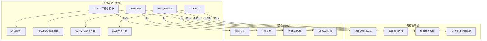
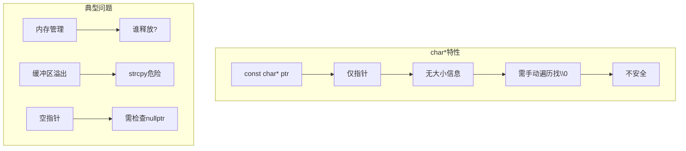
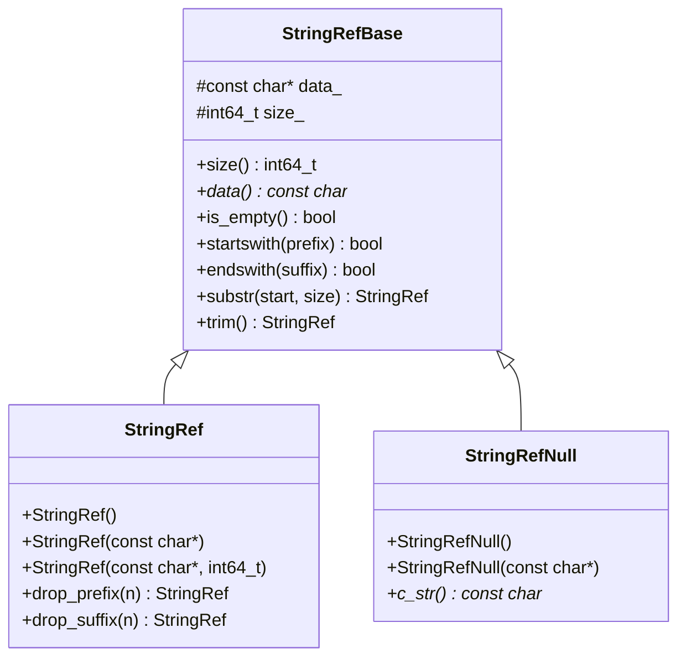
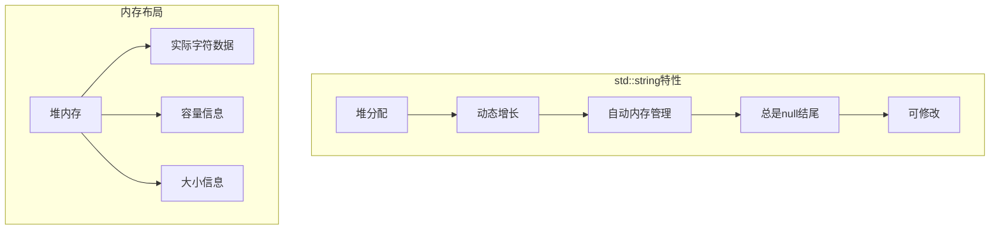
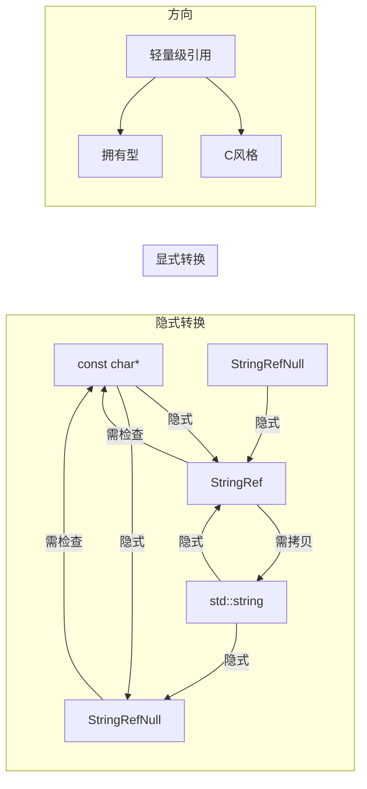
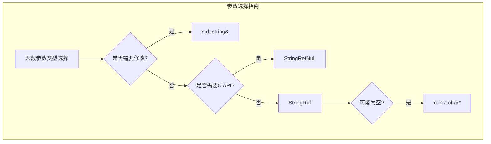
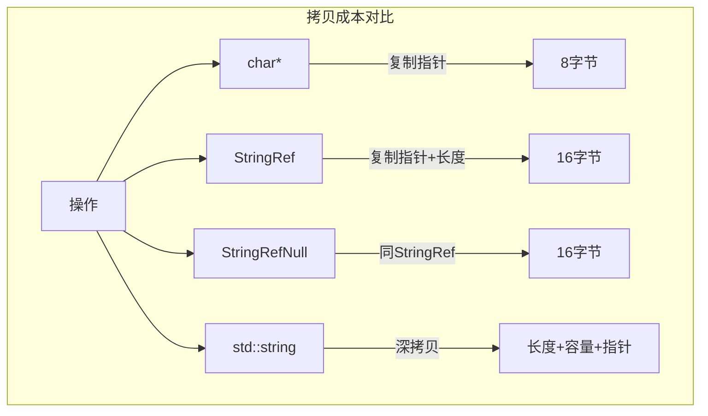
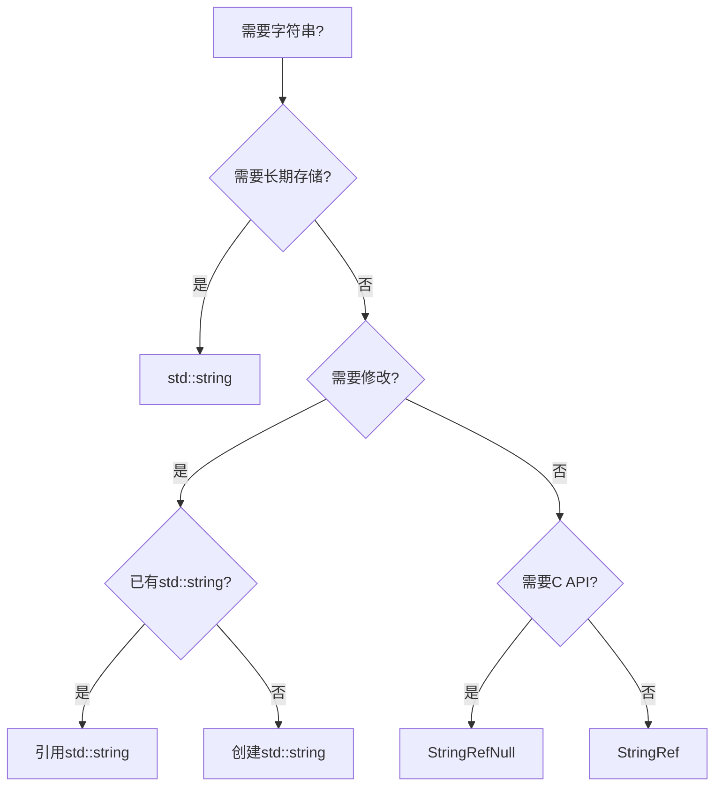
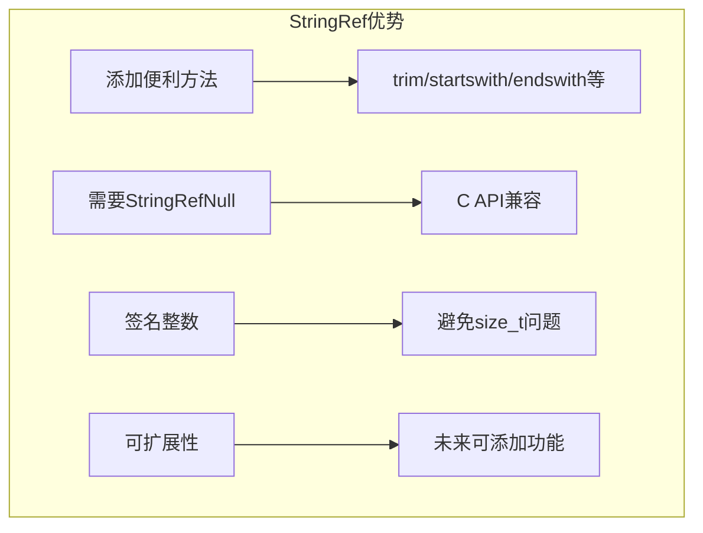
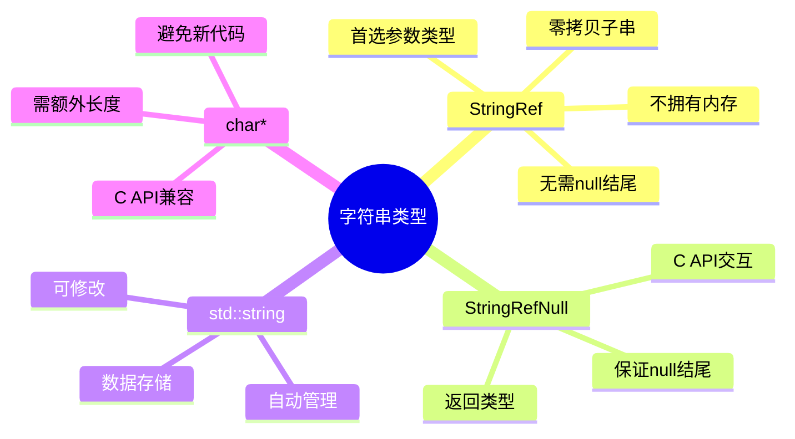

# Blender 字符串引用类型详解

> 📍 理解 `StringRef`, `StringRefNull`, `std::string` 和 `char*` 的区别与使用场景

---

## 1. 四种字符串类型概览

### 1.1 类型对比图



### 1.2 核心区别表

| 特性 | `char*` | `StringRef` | `StringRefNull` | `std::string` |
|------|---------|-------------|-----------------|---------------|
| **内存所有权** | ❌ 无 | ❌ 无 | ❌ 无 | ✅ 有 |
| **自动析构** | ❌ 手动 | ❌ N/A | ❌ N/A | ✅ 是 |
| **空终止** | ❓ 不确定 | ❌ 否 | ✅ 是 | ✅ 是 |
| **大小信息** | ❌ 无 | ✅ 有 | ✅ 有 | ✅ 有 |
| **安全性** | ⚠️ 低 | ✅ 高 | ✅ 高 | ✅ 高 |
| **拷贝成本** | 指针复制 | 指针+长度 | 指针+长度 | 深拷贝 |
| **C兼容性** | ✅ 完美 | ❌ 需转换 | ✅ 完美 | ⚠️ 需转换 |
| **使用场景** | C API交互 | 内部处理 | C API+内部 | 数据存储 |

---

## 2. 详细分析

### 2.1 char* - C风格字符串



**代码示例:**
```cpp
// ❌ 危险用法
void dangerous_func(const char* str) {
    // 不知道长度，无法安全检查
    char buffer[10];
    strcpy(buffer, str);  // 可能溢出!
}

// ✅ 安全用法(需要额外参数)
void safer_func(const char* str, size_t len) {
    // 有了长度就可以安全检查
    if (len < 10) {
        // 安全操作
    }
}
```

**使用时机:**
- ✅ 与C API交互
- ✅ 字面量字符串 `"hello"`
- ✅ 需要兼容旧代码
- ❌ 不推荐在新代码中作为首选

---

### 2.2 StringRef - Blender轻量级引用



**核心设计:**

```mermaid
flowchart TB
    subgraph StringRef设计哲学
        A[不拥有内存] --> B[零拷贝]
        B --> C[高效子串操作]
        C --> D[指针+长度]
        D --> E[无需null结尾]
    end

    subgraph 子串操作优势
        F[StringRef s = "hello world"]
        F --> G[s.substr(0, 5)]
        G --> H[新StringRef]
        H --> I[相同指针]
        I --> J[size=5]
        J --> K[零分配!]
    end
```

**代码示例:**
```cpp
// ✅ StringRef 典型用法
void process_string(StringRef str) {  // 参数用StringRef
    if (str.is_empty()) return;

    if (str.startswith("prefix_")) {
        StringRef suffix = str.substr(7);  // 零拷贝子串
        printf("Suffix: %.*s\n", (int)suffix.size(), suffix.data());
    }

    // 转换为std::string(需要时)
    std::string owned = str;
}

// 创建方式多样
StringRef s1 = "literal";                    // 从字面量
StringRef s2 = std::string("owned");         // 从std::string
StringRef s3(ptr, len);                      // 从指针+长度
StringRef s4 = s1.substr(0, 3);              // 子串
StringRef s5 = s1.trim();                    // 修剪
```

**使用时机:**
- ✅ 函数参数(首选!)
- ✅ 临时处理字符串
- ✅ 大量子串操作
- ✅ 不需要C API的场景
- ✅ 内部字符串处理

---

### 2.3 StringRefNull - 空终止保证

```mermaid
flowchart TB
    subgraph StringRefNull特性
        A[继承StringRefBase] --> B[额外保证]
        B --> C[数据必须null结尾]
        C --> D[size不包含\\0]
        D --> E[c_str()安全]
    end

    subgraph 与StringRef对比
        F[StringRef] --> G[data_可能无\\0]
        H[StringRefNull] --> I[data_必有\\0]
        I --> J[c_str()直接返回]
    end
```

**代码示例:**
```cpp
// ✅ StringRefNull 保证null结尾
void c_api_wrapper(StringRefNull str) {
    // 安全传递给C API
    printf("%s\n", str.c_str());  // 保证有效
    some_c_function(str.c_str()); // 安全
}

// 创建方式
StringRefNull s1 = "literal";     // 自动推断长度
StringRefNull s2(ptr);            // 调用strlen
StringRefNull s3(ptr, len);       // 断言ptr[len] == '\0'

// ❌ 错误用法
char data[] = {'a', 'b', 'c'};  // 无null结尾!
StringRefNull s(data);            // 未定义行为
```

**使用时机:**
- ✅ 需要传递给C API
- ✅ 函数返回值(不拥有内存)
- ✅ 从null结尾字符串创建
- ✅ 需要.c_str()方法

---

### 2.4 std::string - 标准拥有型



**代码示例:**
```cpp
// ✅ std::string 典型用法
std::string build_result() {
    std::string result;
    result += "part1_";
    result += "part2_";
    result += std::to_string(42);
    return result;  // 移动语义,不拷贝
}

// 存储在类中
class MyClass {
    std::string name_;  // 长期拥有
public:
    void set_name(StringRef name) {  // 参数用StringRef
        name_ = name;  // 拷贝到std::string
    }
    StringRefNull get_name() const {  // 返回用StringRefNull
        return name_;
    }
};
```

**使用时机:**
- ✅ 类成员变量(需要长期拥有)
- ✅ 动态构建字符串
- ✅ 需要修改字符串
- ✅ 作为数据存储
- ❌ 避免作为函数参数(用StringRef)

---

## 3. 类型转换关系

### 3.1 转换图



### 3.2 转换代码示例

```cpp
// ========== 隐式转换(总是安全) ==========

// const char* -> StringRef/StringRefNull
const char* cstr = "hello";
StringRef s1 = cstr;           // ✓ 隐式
StringRefNull s2 = cstr;       // ✓ 隐式(调用strlen)

// std::string -> StringRef/StringRefNull
std::string str = "world";
StringRef s3 = str;            // ✓ 隐式
StringRefNull s4 = str;        // ✓ 隐式

// StringRefNull -> StringRef
StringRef s5 = s4;             // ✓ 隐式(向上转换)

// ========== 显式转换(需要注意) ==========

// StringRef -> const char* (危险!)
StringRef s = "hello";
// const char* c = s;        // ✗ 编译错误!
const char* c = s.data();     // ✓ 显式访问
// ⚠️ c可能不是null结尾!

// StringRef -> std::string (拷贝)
std::string str2 = s;         // ✓ 隐式拷贝
std::string str3(s);           // ✓ 显式拷贝

// StringRef -> StringRefNull (需保证null结尾)
StringRef sr = ...;
StringRefNull srn(sr.data());  // ✓ 显式构造(调用strlen)
// 或先转换为std::string再转
```

---

## 4. Blender代码使用模式

### 4.1 函数参数约定



**示例:**
```cpp
// ✅ 推荐用法

// 1. 只读处理 - StringRef
void log_message(StringRef msg);
bool starts_with(StringRef str, StringRef prefix);

// 2. 需要C API - StringRefNull
void call_c_api(StringRefNull path);
FILE* open_file(StringRefNull filename);

// 3. 需要修改 - std::string&
void append_suffix(std::string& str, StringRef suffix);

// 4. 可选参数 - const char* (nullptr表示未提供)
void optional_name(const char* name = nullptr);

// 5. 返回值 - StringRefNull(不拥有)
StringRefNull Mesh::name() const;

// 6. 返回值 - std::string(拥有)
std::string build_full_path(StringRef base, StringRef file);
```

### 4.2 Spreadsheet中的实际应用

```cpp
// spreadsheet_column_values.hh
class ColumnValues {
    std::string name_;           // ✅ 长期存储用std::string
    std::string description_;
    // ...

public:
    StringRefNull name() const {  // ✅ 返回用StringRefNull
        return name_;
    }

    void set_name(StringRef name) {  // ✅ 参数用StringRef
        name_ = name;
    }
};

// spreadsheet_data_source_geometry.hh
void GeometryDataSource::foreach_default_column_ids(
    FunctionRef<void(const SpreadsheetColumnID &, bool)> fn) const
{
    SpreadsheetColumnID column_id;
    column_id.name = "position";  // ✅ char[64]存储
    fn(column_id, false);
}
```

---

## 5. 性能对比

### 5.1 拷贝成本



### 5.2 具体数据

| 操作 | char* | StringRef | StringRefNull | std::string |
|------|-------|-----------|---------------|-------------|
| **拷贝成本** | 8字节(指针) | 16字节(指针+长度) | 16字节 | 32字节+堆分配 |
| **子串操作** | O(n)遍历 | O(1) | O(1) | O(n)拷贝 |
| **创建开销** | 最小 | 很小 | 很小(需strlen) | 堆分配 |
| **内存占用** | 仅数据 | 仅数据 | 仅数据 | 数据+开销 |

---

## 6. 最佳实践

### 6.1 选择决策树



### 6.2 快速选择指南

| 场景 | 推荐类型 | 原因 |
|------|----------|------|
| 函数参数(只读) | `StringRef` | 最高效,接受任何字符串 |
| 函数参数(C API) | `StringRefNull` | 保证null结尾 |
| 函数参数(可选) | `const char*` | nullptr表示未提供 |
| 类成员 | `std::string` | 需要拥有数据 |
| 函数返回值(不拥有) | `StringRefNull` | 不分配内存 |
| 函数返回值(拥有) | `std::string` | 调用者获得所有权 |
| 子串操作 | `StringRef` | O(1)零拷贝 |
| 路径处理 | `StringRefNull` | 常用C文件API |
| 打印/调试 | `StringRef` | 适配fmt::format |

### 6.3 常见错误

```cpp
// ❌ 错误1: 返回StringRef指向局部变量
StringRef bad_func() {
    std::string local = "hello";
    return local;  // 悬挂引用! local已销毁
}

// ✅ 修正: 返回std::string
std::string good_func() {
    std::string local = "hello";
    return local;  // 移动语义,安全
}

// ❌ 错误2: 假设StringRef是null结尾
void bad_call(StringRef s) {
    printf("%s", s.data());  // 危险!可能无\0
}

// ✅ 修正: 使用StringRefNull或显式处理
void good_call(StringRefNull s) {
    printf("%s", s.c_str());  // 安全
}
// 或
void good_call2(StringRef s) {
    printf("%.*s", (int)s.size(), s.data());  // 指定长度
}

// ❌ 错误3: StringRef参数用const char*
void bad_param(const char* s);  // 限制了调用方式

// ✅ 修正: 使用StringRef
void good_param(StringRef s);  // 更灵活

// ❌ 错误4: StringRefNull从非null数据创建
char data[3] = {'a', 'b', 'c'};
StringRefNull s(data);  // 未定义行为!

// ✅ 修正: 确保null结尾
char data2[4] = {'a', 'b', 'c', '\0'};
StringRefNull s2(data2);  // 安全
```

---

## 7. 与std::string_view对比

### 7.1 为什么Blender用StringRef?



### 7.2 对比表

| 特性 | StringRef | std::string_view |
|------|-----------|------------------|
| 空终止变体 | ✅ StringRefNull | ❌ 无 |
| 便利方法 | ✅ 丰富 | ⚠️ 标准方法 |
| 整数类型 | ✅ int64_t | ❌ size_t |
| 标准兼容 | ⚠️ Blender特有 | ✅ 标准C++17 |
| 性能 | ✅ 相同 | ✅ 相同 |
| 转换成本 | ✅ 低 | ✅ 低 |

### 7.3 互操作

```cpp
// StringRef <-> std::string_view
StringRef sr = ...;
std::string_view sv = sr;  // ✓ 隐式转换
StringRef sr2 = sv;          // ✓ 隐式转换

// 在API边界使用std::string_view
void external_api(std::string_view str);

void blender_func(StringRef str) {
    external_api(str);  // ✓ 自动转换
}
```

---

## 8. 总结

### 8.1 核心要点



### 8.2 一句话记忆

| 类型 | 记忆口诀 |
|------|----------|
| **StringRef** | "引用他人数据，轻量又灵活" |
| **StringRefNull** | "C API专用，保证有结尾" |
| **std::string** | "自己拥有的，安全可修改" |
| **char*** | "万不得已，尽量别用" |

### 8.3 检查清单

- [ ] 函数参数首选 `StringRef`
- [ ] C API使用 `StringRefNull`
- [ ] 数据成员用 `std::string`
- [ ] 避免 `char*` 作为首选
- [ ] 注意 StringRef 不保证 null 结尾
- [ ] 返回不拥有的字符串用 `StringRefNull`
- [ ] 返回拥有的字符串用 `std::string`

---

*文档创建: 2025年*
*基于 source/blender/blenlib/BLI_string_ref.hh 分析*
