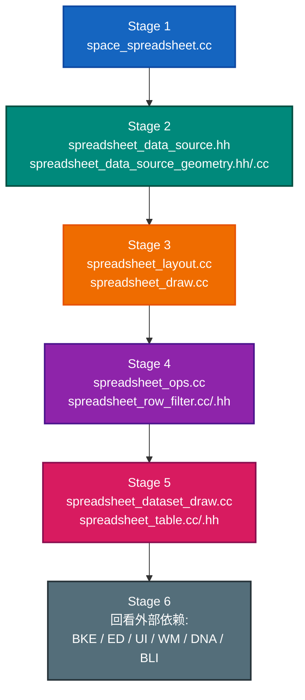
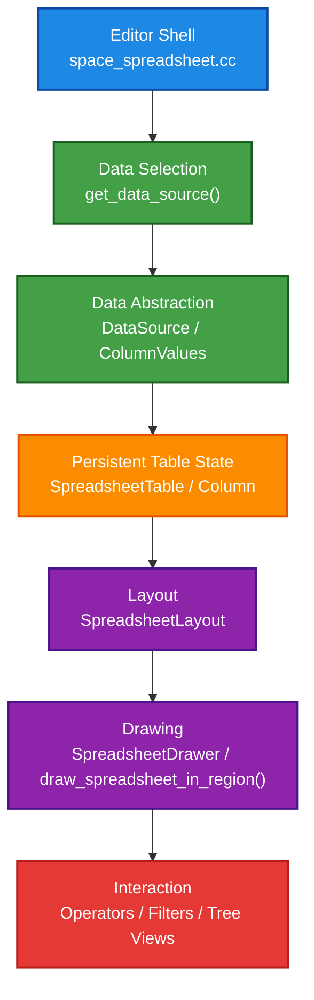

# Space Spreadsheet 学习总览

## 1. 这个文件夹适不适合作为学习入口

适合，而且是一个很好的中级切入点。

它的优点不在于“代码量小”，而在于它刚好覆盖了 Blender 编辑器开发里几种非常关键的能力：

- 编辑器框架能力：`SpaceType`、`ARegion`、listener、operator、notifier。
- UI 与绘制能力：表头、表格、滚动区域、列宽、交互反馈。
- 数据抽象能力：`DataSource` 和 `ColumnValues` 把“显示什么”与“怎么显示”分开。
- 跨模块阅读能力：会接触 `BLI`、`BKE`、`ED`、`WM`、`UI`、`DNA`、Geometry Nodes。
- 状态建模能力：`SpaceSpreadsheet`、`SpreadsheetTable`、`SpreadsheetColumn`、runtime 数据。

它也有边界，所以不会像直接从 `space_view3d` 切入那样一下子把你淹没：

- UI 结构相对集中。
- 功能闭环比较完整。
- 大部分逻辑都在一个目录里。
- 跨目录依赖虽然多，但每类依赖都比较“浅层可用”。

如果你想练的是“在大项目里读懂一个子系统，并且知道它依赖了哪些框架层”，这个目录非常合适。

## 2. 你这次学习的目标应该是什么

不要把目标定成“搞懂 Blender 基础库的全部实现”，那会非常慢。

更合理的目标是：

1. 搞懂 Spreadsheet 作为一个 editor space 是怎么注册和活起来的。
2. 搞懂它怎么决定“当前要显示哪份数据”。
3. 搞懂它怎么把数据组织成列、行、筛选和表格状态。
4. 搞懂它怎么画到 region 上，以及怎么响应交互。
5. 看到外部符号时，能判断这是“必须深挖”还是“知道职责就够”。

## 3. 先看哪几份文档

- [01-架构总览.md](./01-架构总览.md): 模块分层、职责拆分、主调用流。
- [02-阅读路径.md](./02-阅读路径.md): 推荐阅读顺序、每一阶段该看到什么程度。
- [03-外围依赖地图.md](./03-外围依赖地图.md): 这个目录用到的外围模块该学到多深。
- [05-spreadsheet_main_region_draw详解.md](./05-spreadsheet_main_region_draw详解.md): 深读 `spreadsheet_main_region_draw()` 主函数。
- [06-spreadsheet_main_region_draw依赖速查.md](./06-spreadsheet_main_region_draw依赖速查.md): `main_region_draw` 依赖对象与 helper 速查。

## 4. 推荐阅读顺序

## 5. 你需要的心智模型

把这个目录当成下面这条链来理解，读起来会顺很多：

## 6. 哪些文档最值得自己继续补

如果你准备边学边写自己的学习笔记，优先补下面几类：

1. 调用流文档
2. 数据结构关系图
3. 外部依赖速查表
4. 交互与 operator 清单
5. 易混淆概念表
6. 读码问题清单与答案

这套指南已经先把前 3 类打了底，后面你可以在此基础上继续扩写。

## 7. 文档目录与建议顺序

[00-总览.md](./00-总览.md)  
[01-架构总览.md](./01-架构总览.md)  
[02-阅读路径.md](./02-阅读路径.md)  
[03-外围依赖地图.md](./03-外围依赖地图.md)  
[04-类关系图谱.md](./04-类关系图谱.md)  
[05-spreadsheet_main_region_draw详解.md](./05-spreadsheet_main_region_draw详解.md)  
[06-spreadsheet_main_region_draw依赖速查.md](./06-spreadsheet_main_region_draw依赖速查.md)  
[07-data_source_from_geometry函数详解.md](./07-data_source_from_geometry函数详解.md)  
[08-SocketValueVariant-GeometrySet-DataSource三类实现.md](./08-SocketValueVariant-GeometrySet-DataSource三类实现.md)  
[09-draw_spreadsheet_in_region设计篇.md](./09-draw_spreadsheet_in_region设计篇.md)  
[10-draw_spreadsheet_in_region详解篇.md](./10-draw_spreadsheet_in_region详解篇.md)  
[11-spreadsheet_draw的GPU状态与imm.md](./11-spreadsheet_draw的GPU状态与imm.md)  
[12-spreadsheet_draw文件级导读.md](./12-spreadsheet_draw文件级导读.md)  
[13-View2D-Block-Button与左列绘制.md](./13-View2D-Block-Button与左列绘制.md)  
[14-Blender-UI层级总览.md](./14-Blender-UI层级总览.md)  
[15-spreadsheet_layout文件详解.md](./15-spreadsheet_layout文件详解.md)  

## 8. 一眼看懂每份文档在做什么

- `00` 总览：告诉你为什么学这个目录、整体目标是什么。
- `01` 架构总览：先建立大局观。
- `02` 阅读路径：告诉你先读什么、后读什么。
- `03` 外围依赖地图：解决“看到外部符号要不要深挖”的问题。
- `04` 类关系图谱：看类之间的继承、依赖、调用关系。
- `05` 主绘制入口详解：吃透 `spreadsheet_main_region_draw()`。
- `06` 主绘制入口速查：回头查对象和 helper 时更快。
- `07` 数据源构造函数详解：吃透 `data_source_from_geometry(...)`。
- `08` 三个核心抽象：`SocketValueVariant`、`GeometrySet`、`DataSource`。
- `09` `draw_spreadsheet_in_region()` 设计篇：为什么这么分层。
- `10` `draw_spreadsheet_in_region()` 详解篇：具体流程和依赖。
- `11` GPU 状态与 imm：理解绘制 API 为什么这样组合。
- `12` 文件级导读：把整个 `spreadsheet_draw.cc` 从文件层面串起来。
- `13` View2D / Block / Button：吃透左列内容如何通过 Blender UI 系统被构建和绘制。
- `14` Blender UI 层级总览：把 Screen、Area、Region、Block、Button 等放到同一张大图里。
- `15` spreadsheet_layout 文件详解：理解 layout 如何适配成 drawer，以及不同值类型如何显示和估算列宽。
