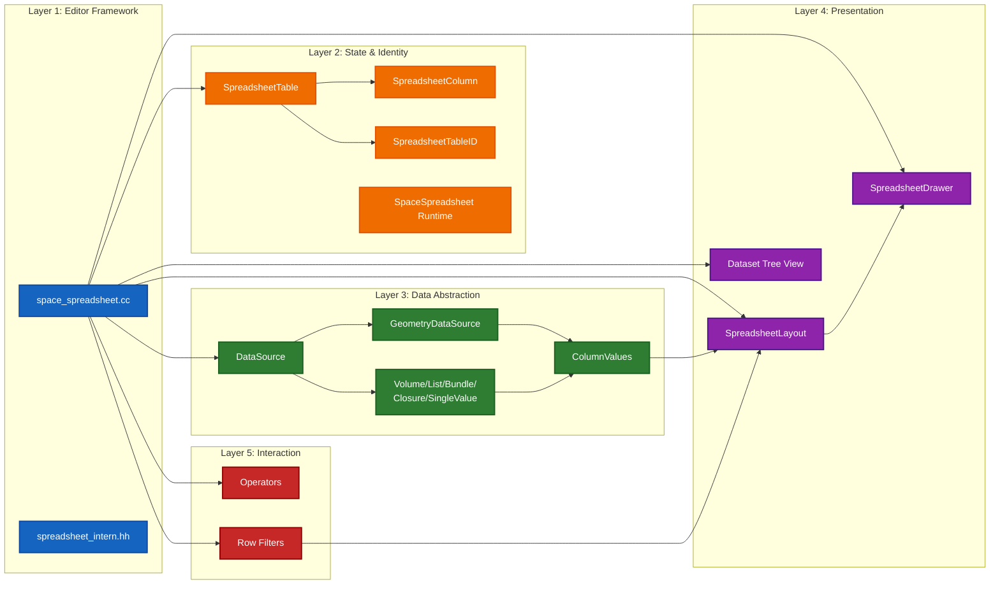
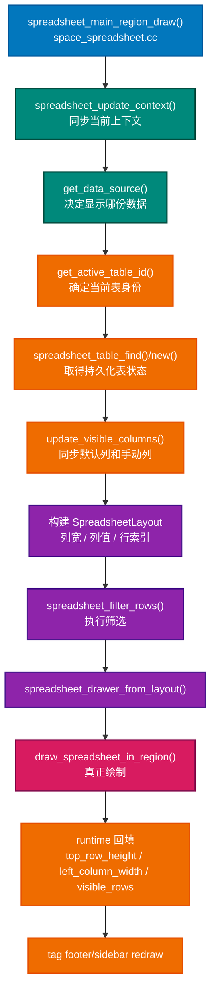
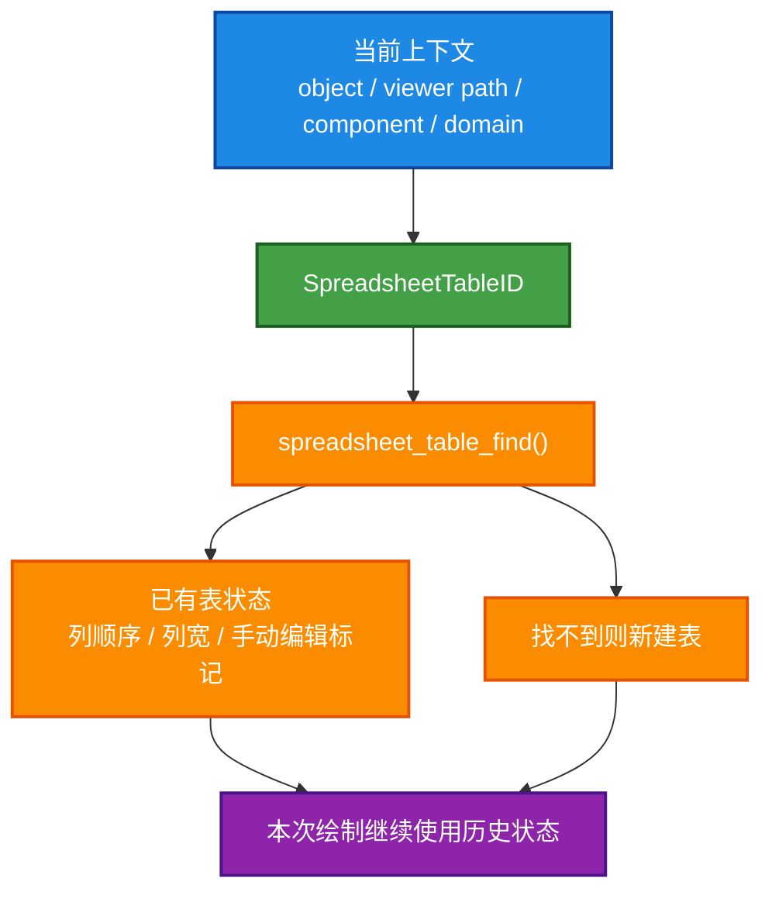

- [Architecture Notes](#architecture-notes)
  - [1. 目录里的文件大致分成哪几组](#1-目录里的文件大致分成哪几组)
    - [Editor Shell](#editor-shell)
    - [Data Model](#data-model)
    - [Presentation](#presentation)
    - [Interaction](#interaction)
  - [2. 分层图](#2-分层图)
  - [3. 主绘制调用流](#3-主绘制调用流)
  - [4. 这个模块最核心的三组对象](#4-这个模块最核心的三组对象)
    - [SpaceSpreadsheet](#spacespreadsheet)
    - [SpreadsheetTable](#spreadsheettable)
    - [SpreadsheetColumn](#spreadsheetcolumn)
  - [5. 为什么要有 TableID](#5-为什么要有-tableid)
  - [6. 读这个目录时最值钱的理解](#6-读这个目录时最值钱的理解)

# Architecture Notes

## 1. 目录里的文件大致分成哪几组

### Editor Shell

- `space_spreadsheet.cc`
- `spreadsheet_intern.hh`
- `spreadsheet_panels.cc`

这一层负责把 Spreadsheet 注册成一个 Blender editor space，并挂上 region、draw、listener、operator、panel。

### Data Model

- `spreadsheet_data_source.hh`
- `spreadsheet_data_source_geometry.hh`
- `spreadsheet_data_source_geometry.cc`
- `spreadsheet_column_values.hh`
- `spreadsheet_column.hh`
- `spreadsheet_column.cc`
- `spreadsheet_table.hh`
- `spreadsheet_table.cc`

这一层负责回答两个问题：

- 当前到底在显示什么数据。
- 这些数据如何被组织成“表格状态”。

### Presentation

- `spreadsheet_layout.hh`
- `spreadsheet_layout.cc`
- `spreadsheet_draw.hh`
- `spreadsheet_draw.cc`
- `spreadsheet_dataset_draw.hh`
- `spreadsheet_dataset_draw.cc`

这一层把数据变成屏幕上的列、行、树视图和可交互表头。

### Interaction

- `spreadsheet_ops.cc`
- `spreadsheet_row_filter.hh`
- `spreadsheet_row_filter.cc`
- `spreadsheet_row_filter_ui.hh`
- `spreadsheet_row_filter_ui.cc`

这一层处理用户动作，比如：

- 改数据源
- 加筛选器
- 删除筛选器
- 调列宽
- 拖拽列顺序

## 2. 分层图

## 3. 主绘制调用流

`space_spreadsheet.cc` 是主入口，最值得先看。你可以把 `spreadsheet_main_region_draw()` 当成一条主干线。

关键步骤大致是：

1. `spreadsheet_update_context()`
2. `get_data_source()`
3. 根据 `SpreadsheetTableID` 找或创建 `SpreadsheetTable`
4. `update_visible_columns()`
5. 生成 `SpreadsheetLayout`
6. `spreadsheet_filter_rows()`
7. `spreadsheet_drawer_from_layout()`
8. `draw_spreadsheet_in_region()`

## 4. 这个模块最核心的三组对象

### SpaceSpreadsheet

这是 editor 实例本身，更多偏“全局上下文 + region + 当前数据选择 + runtime”。

### SpreadsheetTable

这是“某一类表”的持久状态，核心是：

- 列集合
- 手动编辑标记
- 使用时钟
- 表身份 `SpreadsheetTableID`

### SpreadsheetColumn

这是列级别持久状态，核心是：

- 列 ID
- 列宽
- 数据类型
- 可用性
- runtime 位置

## 5. 为什么要有 TableID

因为 Spreadsheet 展示的并不是一张永恒固定的表，而是“随着当前对象 / component / domain / viewer path / bundle path 变化而切换的表视图”。

所以代码需要一个“当前表身份”，据此找回之前那张表的列顺序、列宽和其他 UI 状态。

## 6. 读这个目录时最值钱的理解

真正值得学到手的，不是某个函数细节，而是下面这条分离原则：

- `DataSource` 决定“数据是什么”
- `SpreadsheetTable` 决定“用户对表做过什么个性化调整”
- `SpreadsheetLayout` 决定“这次绘制怎么摆”
- `SpreadsheetDrawer` 决定“最后怎么画出来”

这是一种很成熟的 UI 架构思路。你以后读别的大型编辑器模块，也可以用同样的眼镜去拆。
