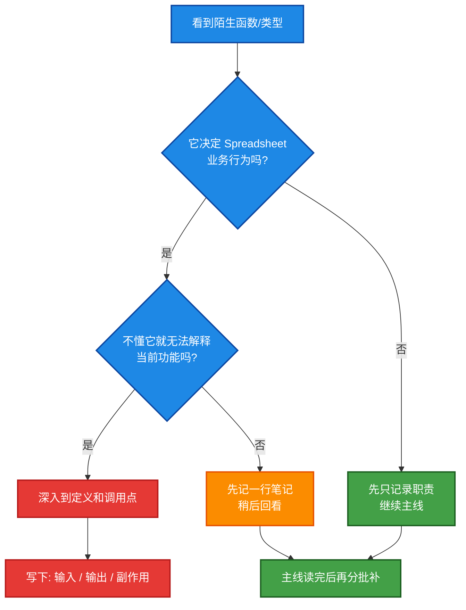

# Reading Path

## 1. 总原则

### 不要按 include 深挖到底

看到一个外部函数，不要立刻跳进去把整个依赖链追穿。先问自己：

- 这个符号是“框架入口”还是“工具函数”？
- 我现在需要知道“它怎么实现”，还是只需要知道“它负责什么”？
- 如果它只是容器、字符串、notifier、UI helper，我先知道职责就够了。

### 先跑通主线，再补细节

最容易卡住人的方式，是还没看明白 Spreadsheet 自己怎么运转，就把时间花在 `BLI`、`BKE`、`UI` 的海洋里。

更高效的策略是：

1. 先在这个目录内画完整闭环。
2. 再把外部依赖分成“必懂 / 会用 / 跳过”三层。

## 2. 推荐分阶段阅读

### Phase 1: 搞懂 editor 壳层

主看：

- `space_spreadsheet.cc`
- `spreadsheet_intern.hh`

你要回答的问题：

- 这个 space 怎么创建？
- 它有哪些 region？
- 各 region 的 draw/init/listener 在哪里挂上？
- 主 region 每次 redraw 时发生了什么？

### Phase 2: 搞懂数据抽象

主看：

- `spreadsheet_data_source.hh`
- `spreadsheet_data_source_geometry.hh`
- `spreadsheet_data_source_geometry.cc`
- `spreadsheet_column_values.hh`

你要回答的问题：

- 为什么要抽象成 `DataSource`？
- `GeometryDataSource` 之外为什么还要有 `VolumeDataSource`、`ListDataSource`、`BundleDataSource`、`SingleValueDataSource`？
- `ColumnValues` 为什么只表示一列，而不是一整张表？

### Phase 3: 搞懂布局与绘制

主看：

- `spreadsheet_layout.cc`
- `spreadsheet_draw.cc`

你要回答的问题：

- 列宽是怎么估计的？
- 可见区域怎么裁切？
- 为什么 `SpreadsheetDrawer` 是虚类？
- 布局和绘制为什么分两个文件？

### Phase 4: 搞懂状态与交互

主看：

- `spreadsheet_table.hh`
- `spreadsheet_table.cc`
- `spreadsheet_ops.cc`
- `spreadsheet_row_filter.hh`
- `spreadsheet_row_filter.cc`
- `spreadsheet_row_filter_ui.cc`

你要回答的问题：

- 哪些状态会持久存在于 `SpaceSpreadsheet` / `SpreadsheetTable`？
- 哪些状态是 runtime 临时状态？
- 操作符如何修改列和筛选条件？

### Phase 5: 搞懂 dataset tree 和外围上下文

主看：

- `spreadsheet_dataset_draw.cc`
- 与之对应的 `ED_spreadsheet.hh`
- Geometry Nodes 相关 viewer path / log 辅助

这一阶段不用每一处都深挖，但要搞懂：

- 左侧 dataset tree 如何驱动“当前显示什么”
- Geometry / Bundle / Closure / List 的切换是如何映射到数据源的

## 3. 分阶段路线图

## 4. 遇到陌生符号时怎么判断要不要深挖

## 5. 你问的关键问题: Blender 基础库要不要全搞懂

答案是：不要全搞懂，至少这个阶段完全没必要。

更实际的目标是分层掌握：

### 必须会认

- `DNA_*`: 数据结构定义来自哪里。
- `BLI_*`: 容器、字符串、数学、泛型辅助在干什么。
- `WM_*`: operator、notifier、事件系统大概怎么工作。
- `UI_*`: button、layout、view2d、tree view 的基本使用方式。
- `BKE_context.hh`: 上下文拿对象、scene、depsgraph 的入口。

### 先会用即可

- `MEM_*`
- `BLT_translation.hh`
- `RNA_*`
- `BLO_read_write.hh`

### 暂时不需要深入内部实现

- `BLI` 容器底层实现细节
- `BKE` 大量非当前模块相关的 geometry internals
- OpenVDB 细节
- 所有 Geometry Nodes 日志系统的完整实现

## 6. 适合你边读边写的笔记模板

每看一个文件，建议只写下面 5 行：

1. 这个文件的职责
2. 它对外提供什么
3. 它依赖谁
4. 谁会调用它
5. 我现在没看懂的 1 到 3 个点

坚持这样写，进步会很快，因为你会慢慢建立“模块边界感”，而不是沉进局部实现里出不来。
