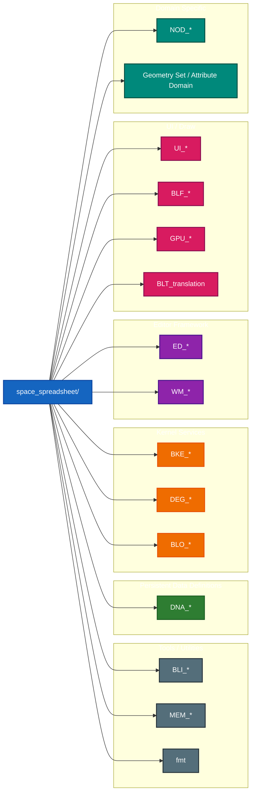
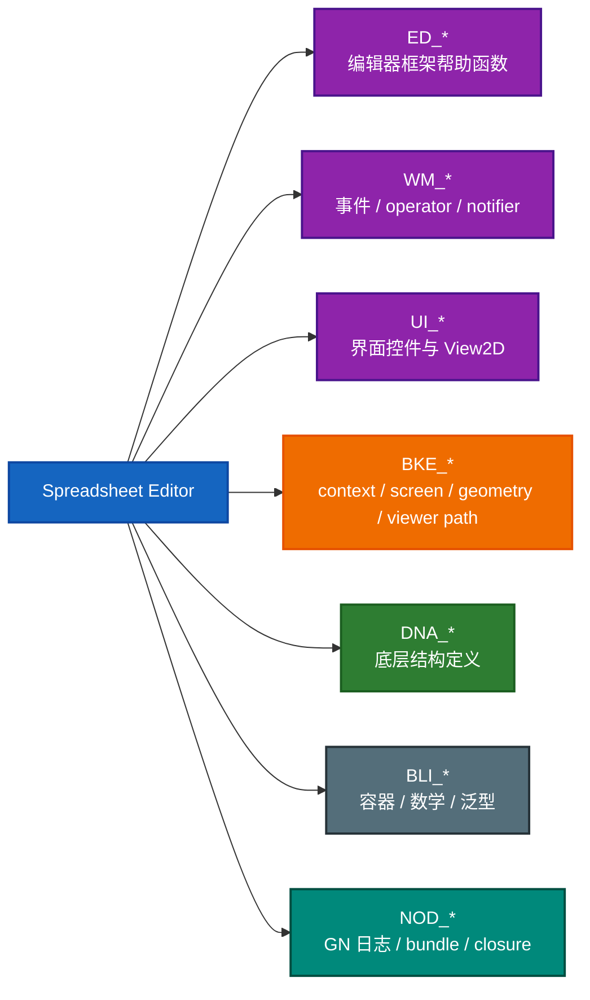
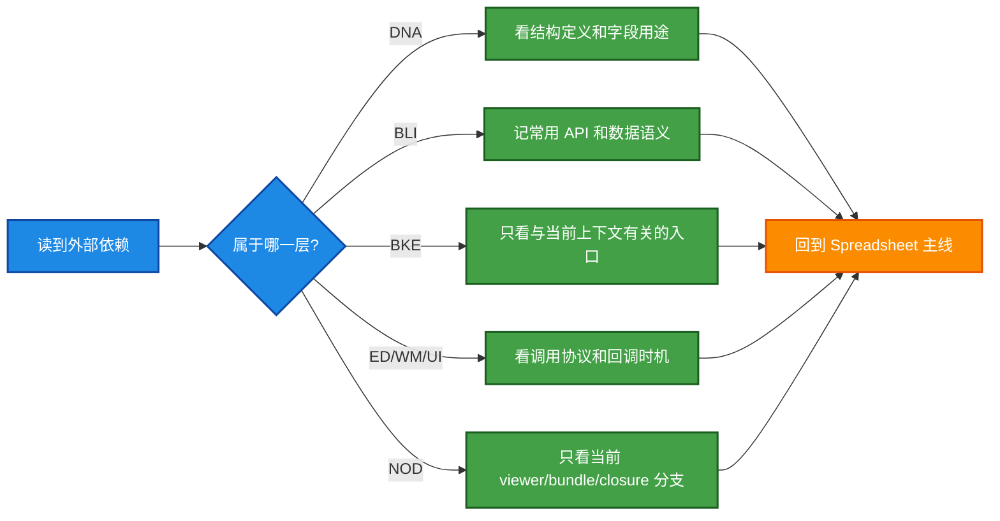

# Dependency Map

## 1. 先给一个总判断

学习 `space_spreadsheet` 时，外围依赖很多，但不是每个都要同等深度。

你真正需要建立的是“依赖分层意识”：

- 哪些是数据定义层
- 哪些是核心内核服务层
- 哪些是编辑器框架层
- 哪些是 UI 层
- 哪些只是通用工具层

## 2. 依赖分层图

## 3. 该学到什么深度

| 模块族 | 在 Spreadsheet 中的角色 | 学习深度建议 |
| --- | --- | --- |
| `DNA_*` | 结构体、枚举、持久化字段来源 | 必须会认字段和结构，不必背实现 |
| `BLI_*` | 容器、字符串、数学、泛型数组、资源作用域 | 高频 API 要熟，底层实现可延后 |
| `BKE_*` | geometry set、screen、viewer path、context | 理解职责和常用入口，按需深挖 |
| `DEG_*` | depsgraph 查询 | 知道 eval/orig 区别即可 |
| `ED_*` | 编辑器辅助与注册接口 | 必须理解调用位置和作用 |
| `WM_*` | operator、事件、notifier、keymap | 必须掌握基础心智模型 |
| `UI_*` | 按钮、布局、view2d、tree view | 必须会读，能定位交互来源 |
| `RNA_*` | operator 参数、属性暴露 | 会用即可 |
| `BLO_*` | blend 读写 | 知道是序列化边界即可 |
| `NOD_*` | Geometry Nodes viewer / bundle / closure | 按当前数据源用法理解即可 |

## 4. 哪些外部目录最值得补

### 第一优先级

- `source/blender/editors/include`
- `source/blender/editors/screen`
- `source/blender/editors/interface`
- `source/blender/windowmanager`
- `source/blender/blenkernel`

### 第二优先级

- `source/blender/nodes`
- `source/blender/depsgraph`
- `source/blender/makesdna`
- `source/blender/blenlib`

### 第三优先级

- `source/blender/blenloader`
- 与当前数据源无关的 geometry 具体实现目录

## 5. 你可以怎么理解跨目录调用

## 6. 什么时候必须跳出当前目录

下面这几种情况，值得立即跳出去看定义：

1. 你分不清 `orig` 和 `eval` 数据。
2. 你不知道 `ViewerPath` 在描述什么。
3. 你不知道 `ARegion` / `View2D` 对绘制裁切的影响。
4. 你不知道 `WM_event_add_notifier()` 为什么能触发 redraw。
5. 你不知道 `DNA_space_types.h` 里的字段最终由谁持有和序列化。

## 7. 一个实用的依赖学习策略

## 8. 结论

学这个目录时，不需要先把 Blender 基础库全学完。

更好的顺序是：

1. 先借这个目录建立 Blender 分层感。
2. 再把高频外部模块按需回补。
3. 最后才去补某些基础库的底层实现。

这样你会更快进入“能读、能改、能定位问题”的状态，而不是长期停留在“看过很多基础库但还不会拆具体模块”的状态。
