- [Class Relationships In `space_spreadsheet`](#class-relationships-in-space_spreadsheet)
  - [1. 一张总图先建立全局感觉](#1-一张总图先建立全局感觉)
  - [2. 核心状态类关系](#2-核心状态类关系)
    - [这一组最终在哪里用到](#这一组最终在哪里用到)
  - [3. `DataSource` 继承族](#3-datasource-继承族)
    - [`DataSource` 工厂与最终调用入口](#datasource-工厂与最终调用入口)
    - [这一组最终在哪里用到](#这一组最终在哪里用到-1)
  - [4. `ColumnValues`、`Layout`、`Drawer` 绘制族](#4-columnvalueslayoutdrawer-绘制族)
    - [从数据到绘制的调用链](#从数据到绘制的调用链)
    - [这一组最终在哪里用到](#这一组最终在哪里用到-2)
  - [5. Tree View 继承族](#5-tree-view-继承族)
    - [5.1 顶层 TreeView 类](#51-顶层-treeview-类)
    - [5.2 Tree Item 继承树](#52-tree-item-继承树)
    - [Tree View 最终从哪里被调用](#tree-view-最终从哪里被调用)
    - [这一组的最终调用点](#这一组的最终调用点)
  - [6. 交互与临时状态类](#6-交互与临时状态类)
    - [这一组最终在哪里用到](#这一组最终在哪里用到-3)
  - [7. “这些类最终在哪调用”的总入口图](#7-这些类最终在哪调用的总入口图)
  - [8. 学习时最值得盯住的 3 条类主线](#8-学习时最值得盯住的-3-条类主线)
    - [主线 1: 数据从哪来](#主线-1-数据从哪来)
    - [主线 2: UI 状态如何保存](#主线-2-ui-状态如何保存)
    - [主线 3: 左侧树如何驱动当前展示对象](#主线-3-左侧树如何驱动当前展示对象)
  - [9. 一句话总结](#9-一句话总结)

# Class Relationships In `space_spreadsheet`

这份文档专门回答 4 个问题：

1. 这个目录里有哪些核心类和结构体。
2. 它们之间有什么继承、依赖、组合关系。
3. 它们是如何被实例化的。
4. 它们最终从哪里被调用到。

为了避免把图画得过于拥挤，下面按 5 个类族拆开看：

- 核心状态类
- `DataSource` 继承族
- `Drawer` / `Layout` 绘制族
- Tree View 继承族
- 交互与临时状态类

## 1. 一张总图先建立全局感觉

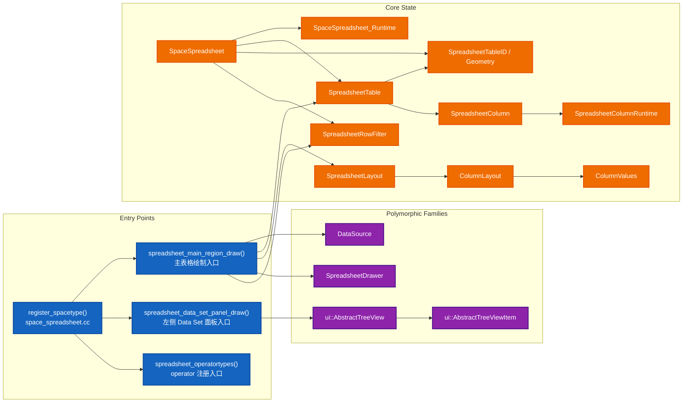

这张图里最重要的结论是：

- 真正的“运行时主线”在 `spreadsheet_main_region_draw()`。
- 真正的“树视图主线”在 `spreadsheet_data_set_panel_draw()`。
- 真正的“交互入口”在 `spreadsheet_operatortypes()` 注册出来的 operator。

## 2. 核心状态类关系

这一组不是以继承为主，而是以“谁持有谁”为主。

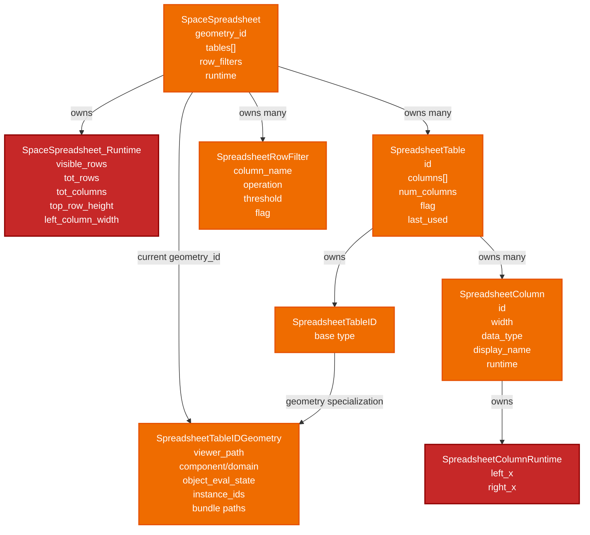

### 这一组最终在哪里用到

- `SpaceSpreadsheet` 在 [space_spreadsheet.cc:54](E:/blender-git/blender/source/blender/editors/space_spreadsheet/space_spreadsheet.cc#L54) 创建。
- `SpaceSpreadsheet_Runtime` 在 [space_spreadsheet.cc:57](E:/blender-git/blender/source/blender/editors/space_spreadsheet/space_spreadsheet.cc#L57) 创建，并在主绘制里回填可见行列、表头高度等运行时信息。
- `SpreadsheetTable` 和 `SpreadsheetTableID` 在 [space_spreadsheet.cc:441](E:/blender-git/blender/source/blender/editors/space_spreadsheet/space_spreadsheet.cc#L441) 到 [space_spreadsheet.cc:449](E:/blender-git/blender/source/blender/editors/space_spreadsheet/space_spreadsheet.cc#L449) 查找或新建。
- `SpreadsheetColumn` 在 `update_visible_columns()` 里被同步和复用，最终参与布局与绘制。
- `SpreadsheetRowFilter` 最终在 [spreadsheet_row_filter.cc:446](E:/blender-git/blender/source/blender/editors/space_spreadsheet/spreadsheet_row_filter.cc#L446) 的 `spreadsheet_filter_rows()` 中生效。

## 3. `DataSource` 继承族

这是整个目录里最重要的一组继承关系，因为它决定“当前到底显示什么数据”。

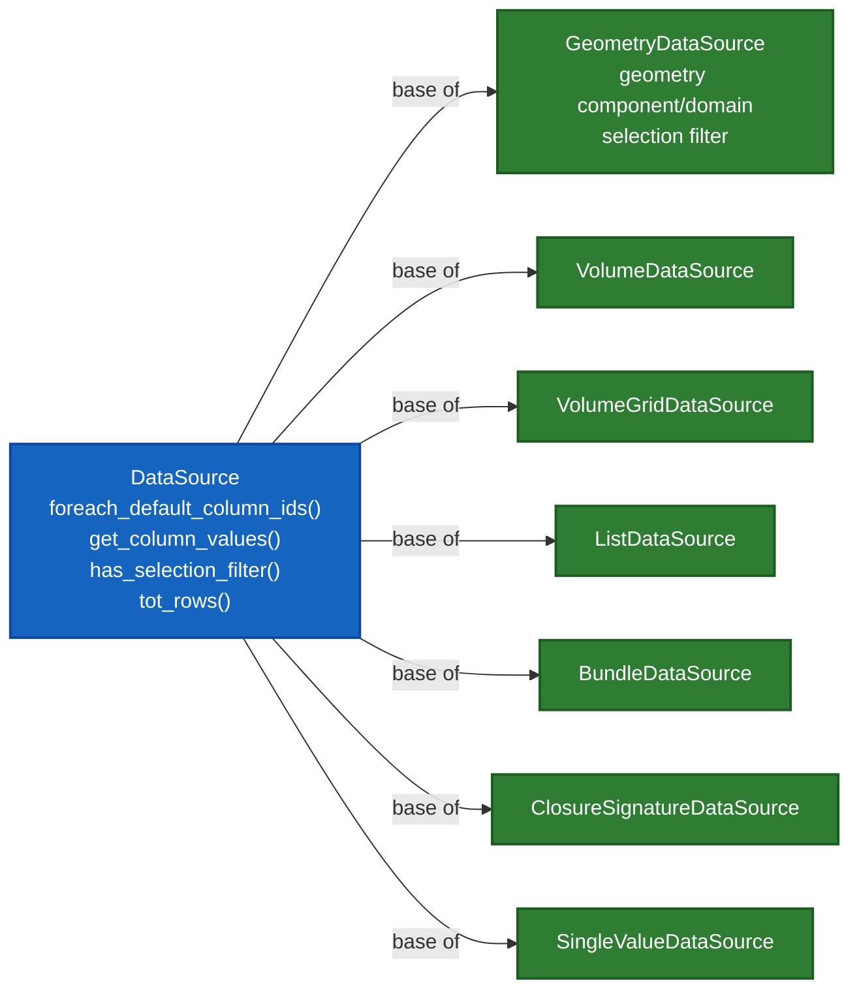

### `DataSource` 工厂与最终调用入口

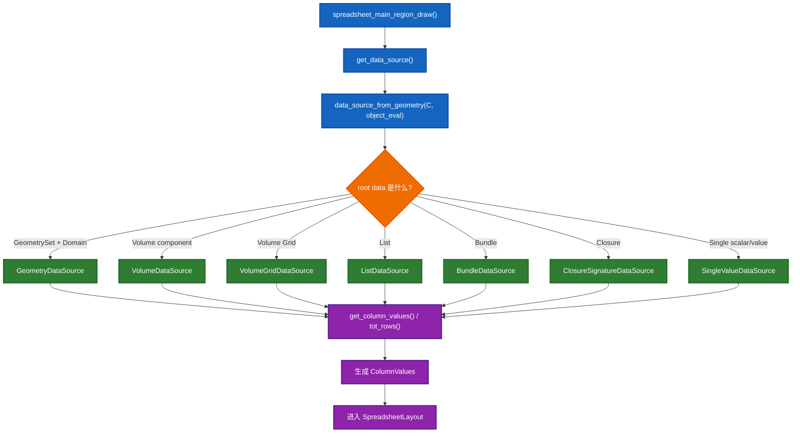

### 这一组最终在哪里用到

- 抽象入口：`get_data_source()` 在 [space_spreadsheet.cc:336](E:/blender-git/blender/source/blender/editors/space_spreadsheet/space_spreadsheet.cc#L336)。
- 工厂逻辑：`data_source_from_geometry()` 在 [spreadsheet_data_source_geometry.cc:1276](E:/blender-git/blender/source/blender/editors/space_spreadsheet/spreadsheet_data_source_geometry.cc#L1276) 和 [spreadsheet_data_source_geometry.cc:1315](E:/blender-git/blender/source/blender/editors/space_spreadsheet/spreadsheet_data_source_geometry.cc#L1315)。
- 直接消费点：
  - 主绘制在 [space_spreadsheet.cc:436](E:/blender-git/blender/source/blender/editors/space_spreadsheet/space_spreadsheet.cc#L436) 获取 `DataSource`
  - 列宽自适应 operator 在 [spreadsheet_ops.cc:288](E:/blender-git/blender/source/blender/editors/space_spreadsheet/spreadsheet_ops.cc#L288) 再取一次 `DataSource`
  - 行筛选里用 `dynamic_cast<GeometryDataSource>` 触发 selection filter，在 [spreadsheet_row_filter.cc:462](E:/blender-git/blender/source/blender/editors/space_spreadsheet/spreadsheet_row_filter.cc#L462) 左右

## 4. `ColumnValues`、`Layout`、`Drawer` 绘制族

这一组负责把“抽象数据”变成“屏幕上的表格”。

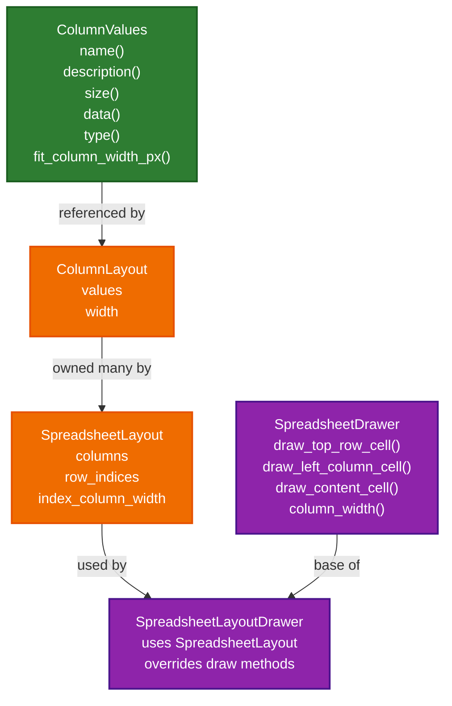

### 从数据到绘制的调用链

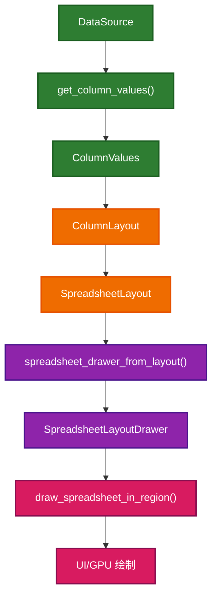

### 这一组最终在哪里用到

- `SpreadsheetLayout` 在主绘制 [space_spreadsheet.cc:467](E:/blender-git/blender/source/blender/editors/space_spreadsheet/space_spreadsheet.cc#L467) 开始构建。
- `ColumnValues` 由各个 `DataSource::get_column_values()` 返回，在主绘制 [space_spreadsheet.cc:473](E:/blender-git/blender/source/blender/editors/space_spreadsheet/space_spreadsheet.cc#L473) 左右被塞进 layout。
- `SpreadsheetLayoutDrawer` 由 [spreadsheet_layout.cc:805](E:/blender-git/blender/source/blender/editors/space_spreadsheet/spreadsheet_layout.cc#L805) 的工厂函数创建。
- `SpreadsheetDrawer` 最终由 [spreadsheet_draw.cc:345](E:/blender-git/blender/source/blender/editors/space_spreadsheet/spreadsheet_draw.cc#L345) 的 `draw_spreadsheet_in_region()` 调用其虚函数完成具体绘制。

## 5. Tree View 继承族

这一组主要都在 `spreadsheet_dataset_draw.cc` 里，而且大多数类都是“文件私有类”。它们的共同特点是：

- 不是从主绘制入口走
- 而是从左侧 `Data Set` 面板进入
- 最终都交给 `ui::TreeViewBuilder::build_tree_view()` 驱动

### 5.1 顶层 TreeView 类

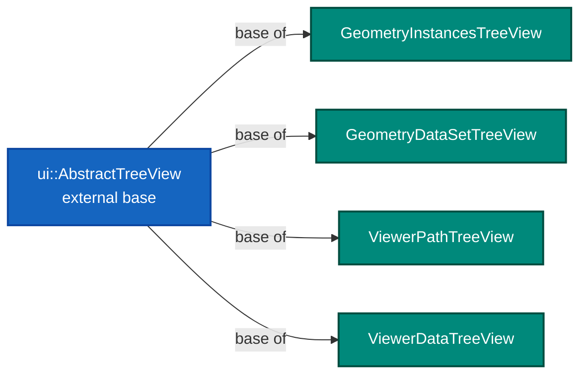

### 5.2 Tree Item 继承树

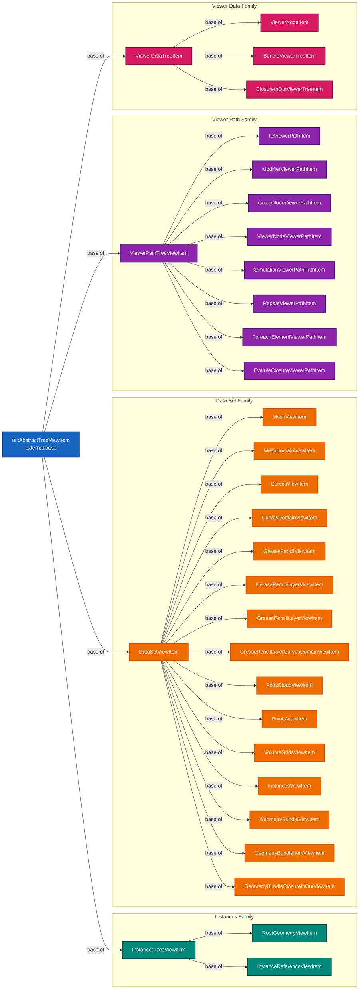

### Tree View 最终从哪里被调用

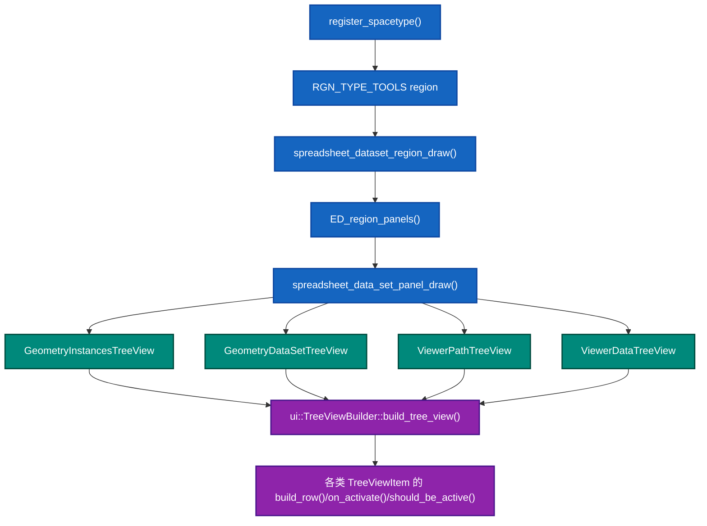

### 这一组的最终调用点

- 面板注册在 [space_spreadsheet.cc:858](E:/blender-git/blender/source/blender/editors/space_spreadsheet/space_spreadsheet.cc#L858)。
- 面板类型注册函数在 [spreadsheet_panels.cc:13](E:/blender-git/blender/source/blender/editors/space_spreadsheet/spreadsheet_panels.cc#L13)。
- 真正的面板绘制入口在 [spreadsheet_dataset_draw.cc:1498](E:/blender-git/blender/source/blender/editors/space_spreadsheet/spreadsheet_dataset_draw.cc#L1498) 的 `spreadsheet_data_set_panel_draw()`。
- 顶层 TreeView 的实例化点：
  - `ViewerPathTreeView` 在 [spreadsheet_dataset_draw.cc:1416](E:/blender-git/blender/source/blender/editors/space_spreadsheet/spreadsheet_dataset_draw.cc#L1416)
  - `ViewerDataTreeView` 在 [spreadsheet_dataset_draw.cc:1425](E:/blender-git/blender/source/blender/editors/space_spreadsheet/spreadsheet_dataset_draw.cc#L1425)
  - `GeometryInstancesTreeView` 在 [spreadsheet_dataset_draw.cc:1520](E:/blender-git/blender/source/blender/editors/space_spreadsheet/spreadsheet_dataset_draw.cc#L1520)
  - `GeometryDataSetTreeView` 在 [spreadsheet_dataset_draw.cc:1532](E:/blender-git/blender/source/blender/editors/space_spreadsheet/spreadsheet_dataset_draw.cc#L1532)

## 6. 交互与临时状态类

这一组主要不承担长期业务建模，而是服务于 operator 和交互过程。

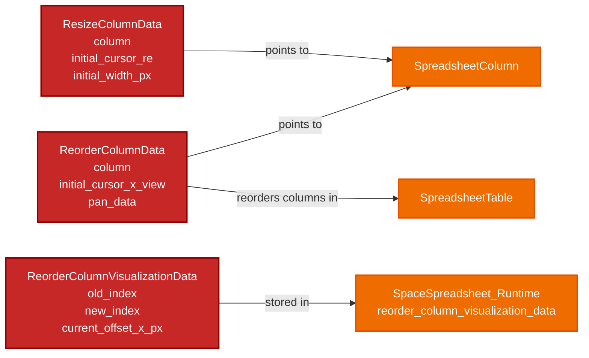

### 这一组最终在哪里用到

- `ResizeColumnData` 在 [spreadsheet_ops.cc:261](E:/blender-git/blender/source/blender/editors/space_spreadsheet/spreadsheet_ops.cc#L261) 创建，被 `resize_column_modal()` 消费。
- `ReorderColumnData` 在 [spreadsheet_ops.cc:371](E:/blender-git/blender/source/blender/editors/space_spreadsheet/spreadsheet_ops.cc#L371) 创建，被 `reorder_columns_modal()` 消费。
- `ReorderColumnVisualizationData` 存在 `SpaceSpreadsheet_Runtime` 里，最终由 [spreadsheet_draw.cc:358](E:/blender-git/blender/source/blender/editors/space_spreadsheet/spreadsheet_draw.cc#L358) 左右的绘制逻辑读取，用来显示拖拽列的可视化反馈。

## 7. “这些类最终在哪调用”的总入口图

如果你只记一张图，记下面这张。

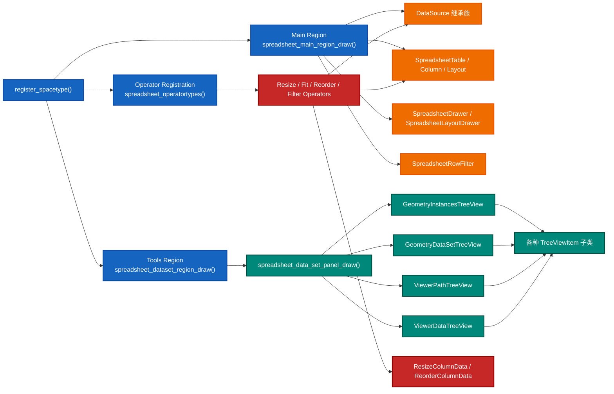

## 8. 学习时最值得盯住的 3 条类主线

### 主线 1: 数据从哪来

`DataSource -> ColumnValues -> SpreadsheetLayout -> SpreadsheetDrawer`

这一条主线最适合训练你理解“抽象层分离”。

### 主线 2: UI 状态如何保存

`SpaceSpreadsheet -> SpreadsheetTable -> SpreadsheetColumn`

这一条主线最适合训练你理解“当前上下文”和“持久 UI 状态”的区别。

### 主线 3: 左侧树如何驱动当前展示对象

`TreeView / TreeViewItem -> on_activate() -> geometry_id / viewer_path / bundle_path 改变 -> get_data_source() 结果改变`

这一条主线最适合训练你理解“面板交互怎样反过来驱动主绘制结果”。

## 9. 一句话总结

这个目录里的类关系并不是“深层继承层次特别复杂”，而是“少量继承 + 大量组合 + 明确入口函数”的工程结构。

真正该掌握的是：

- 抽象类如何隔离数据来源
- 状态类如何保存 UI 个性化结果
- TreeView 类如何把选择动作反馈回当前 `SpaceSpreadsheet`
- 最终所有东西怎样汇聚到 `spreadsheet_main_region_draw()` 和 `spreadsheet_data_set_panel_draw()`

如果你后面想继续补这一套文档，最自然的下一份就是：

- “逐类导读版”
- 或者“按函数串类关系版”
