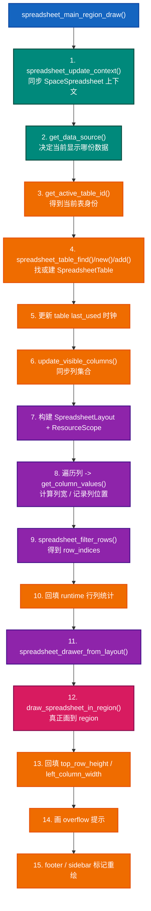
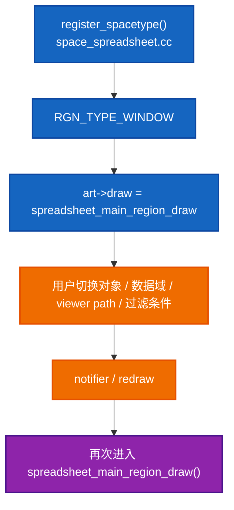
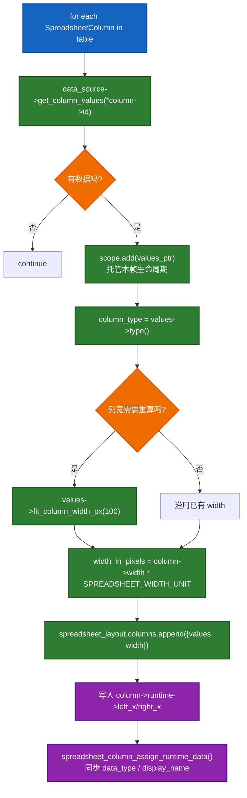
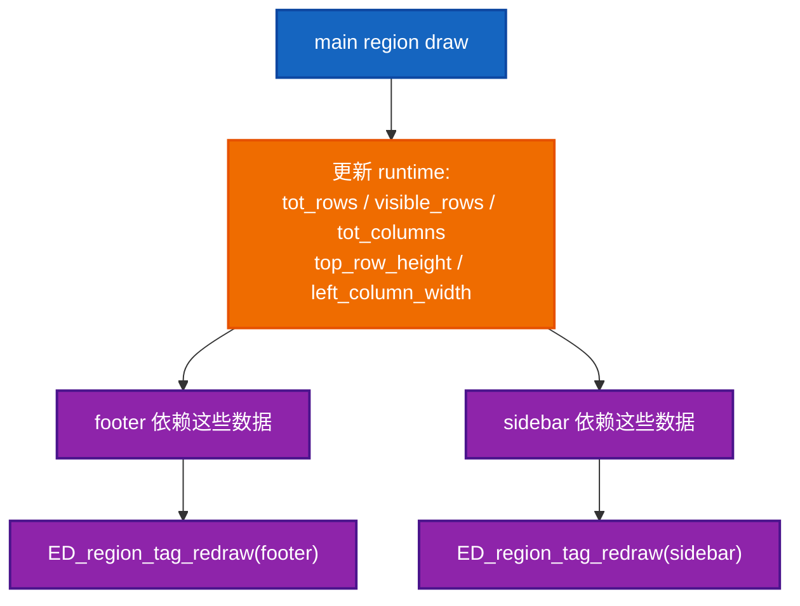
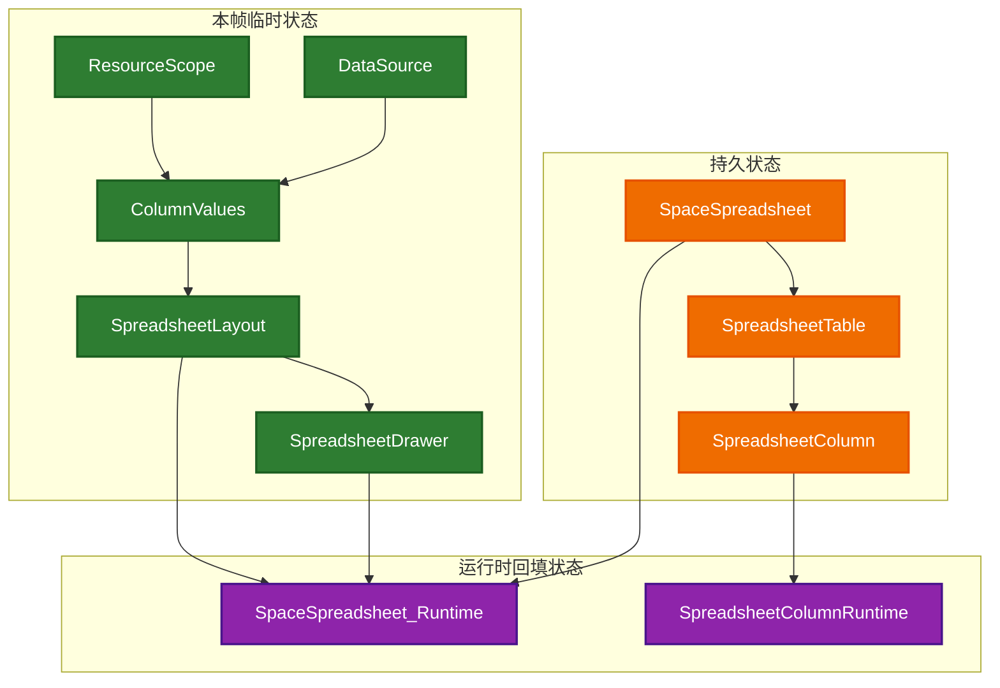
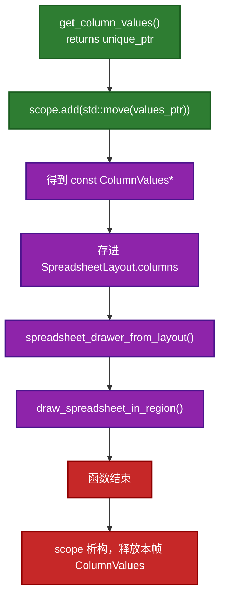

# `spreadsheet_main_region_draw()` Deep Dive

这份文档专门深读 [space_spreadsheet.cc:431](E:/blender-git/blender/source/blender/editors/space_spreadsheet/space_spreadsheet.cc#L431) 到 [space_spreadsheet.cc:521](E:/blender-git/blender/source/blender/editors/space_spreadsheet/space_spreadsheet.cc#L521) 的 `spreadsheet_main_region_draw()`。

目标不是“看懂大概”，而是尽量做到下面这个程度：

- 知道它为什么存在
- 知道它每一段在维护什么状态
- 知道它调用出去的函数分别负责什么
- 知道哪些对象是持久状态，哪些对象只是本帧临时数据
- 知道它最终怎样把数据落到屏幕上

如果你要先看速查表，再回到这里，可以搭配：

- [06-spreadsheet_main_region_draw依赖速查.md](./06-spreadsheet_main_region_draw依赖速查.md)

## 1. 先给一句话定义

`spreadsheet_main_region_draw()` 的职责可以概括成一句话：

> 先根据当前上下文选出“要显示的那份数据”，再找到或建立这份数据对应的表状态，之后生成本帧布局并执行绘制，最后把结果同步回 runtime 和其他 region。

它不是一个“纯绘制函数”。

它同时做了 4 件事：

1. 同步上下文
2. 选择数据源
3. 维护表格状态
4. 布局并绘制

## 2. 总体流程图



## 3. 它在整个 editor 生命周期里的位置

你可以把它理解成 Spreadsheet 主窗口 region 的“每帧主入口”。



这意味着：

- 它需要足够快，因为 redraw 会反复发生
- 它不能只依赖一次性初始化结果
- 它必须能处理“当前上下文已经变了”的情况

## 4. 分段读码

下面按代码块拆。

### 4.1 取 space，并同步上下文

对应代码：

- [space_spreadsheet.cc:431](E:/blender-git/blender/source/blender/editors/space_spreadsheet/space_spreadsheet.cc#L431)
- [space_spreadsheet.cc:432](E:/blender-git/blender/source/blender/editors/space_spreadsheet/space_spreadsheet.cc#L432)
- [space_spreadsheet.cc:227](E:/blender-git/blender/source/blender/editors/space_spreadsheet/space_spreadsheet.cc#L227)

这里先做两件事：

1. 从 context 里拿到当前 `SpaceSpreadsheet`
2. 调 `spreadsheet_update_context(C)`，把 `geometry_id.viewer_path`、pin 状态、object eval state 等上下文同步成“当前应该显示的状态”

最重要的理解是：

`spreadsheet_main_region_draw()` 不是盲目地拿旧状态来画，它会先纠正 state。

如果你不先理解 `spreadsheet_update_context()`，后面很多“为什么当前表 ID 会变”“为什么切对象后能自动刷新”的问题都会糊掉。

### 4.2 获取数据源

对应代码：

- [space_spreadsheet.cc:434](E:/blender-git/blender/source/blender/editors/space_spreadsheet/space_spreadsheet.cc#L434)
- [space_spreadsheet.cc:336](E:/blender-git/blender/source/blender/editors/space_spreadsheet/space_spreadsheet.cc#L336)

`get_data_source(*C)` 做的事情是：

- 先从 `SpaceSpreadsheet` 当前上下文里找到目标 object
- 再根据 Geometry / Bundle / Closure / Single Value 等情况，构造具体的 `DataSource` 子类

如果拿不到任何有效数据，就退回到一个空的 `DataSource`：

```cpp
if (!data_source) {
  data_source = std::make_unique<DataSource>();
}
```

这里的设计很值得学。

它没有在“无数据”时直接 return，而是给后面的逻辑提供一个“合法但为空”的对象。这样后面的代码还能统一走：

- `tot_rows()`
- `foreach_default_column_ids()`
- `get_column_values()`

只是这些调用会给出空结果。

这是一种很典型的“空对象模式”味道。

### 4.3 确定当前表身份，并找回历史表状态

对应代码：

- [space_spreadsheet.cc:441](E:/blender-git/blender/source/blender/editors/space_spreadsheet/space_spreadsheet.cc#L441)
- [space_spreadsheet.cc:348](E:/blender-git/blender/source/blender/editors/space_spreadsheet/space_spreadsheet.cc#L348)
- [spreadsheet_table.cc:281](E:/blender-git/blender/source/blender/editors/space_spreadsheet/spreadsheet_table.cc#L281)

主函数先问：

> 当前应该显示的是哪一张表？

这里的“哪一张表”不是指某个固定对象，而是 `SpreadsheetTableID` 标识的一类表视图。

这个 ID 里可能编码了：

- viewer path
- geometry component
- attribute domain
- object eval state
- instance path
- bundle path

然后它用这个 ID 去 `SpaceSpreadsheet::tables` 里找已有的 `SpreadsheetTable`。

### 4.4 如果没找到表，就新建一张

对应代码：

- [space_spreadsheet.cc:443](E:/blender-git/blender/source/blender/editors/space_spreadsheet/space_spreadsheet.cc#L443)
- [spreadsheet_table.cc:310](E:/blender-git/blender/source/blender/editors/space_spreadsheet/spreadsheet_table.cc#L310)
- [spreadsheet_table.cc:299](E:/blender-git/blender/source/blender/editors/space_spreadsheet/spreadsheet_table.cc#L299)

如果查不到对应表：

1. 先 `spreadsheet_table_remove_unused()` 做一轮垃圾回收
2. 再 `spreadsheet_table_new(spreadsheet_table_id_copy(...))`
3. 再 `spreadsheet_table_add()` 加到 `SpaceSpreadsheet` 里

这一步的核心思想是：

- `SpreadsheetTable` 保存的是 UI 个性化状态
- 比如列顺序、列宽、手工编辑痕迹
- 所以同一份“表身份”应该尽量复用旧表，而不是每次重建

### 4.5 把当前表移动到前面

对应代码：

- [space_spreadsheet.cc:448](E:/blender-git/blender/source/blender/editors/space_spreadsheet/space_spreadsheet.cc#L448)
- [spreadsheet_table.cc:401](E:/blender-git/blender/source/blender/editors/space_spreadsheet/spreadsheet_table.cc#L401)

这一步不是语义必须，而是性能优化：

> 既然这张表刚刚被用到，那下次大概率还会先被找到，所以把它移到前面，减少后续线性查找成本。

### 4.6 更新表的使用时钟

对应代码：

- [space_spreadsheet.cc:453](E:/blender-git/blender/source/blender/editors/space_spreadsheet/space_spreadsheet.cc#L453)

这一段很像 cache / LRU 的轻量版逻辑。

它维护 `table_use_clock` 和 `table->last_used`，目的是支持稍后垃圾回收：

- 太久不用的表可以被回收
- 但最近用过的表应该保留

还有一个细节：

```cpp
if (sspreadsheet->table_use_clock == 0) {
  ...
}
```

这是在处理 `uint32_t` 溢出。溢出后不去做复杂修复，而是把所有表时钟重置到当前值。

这说明作者更关心：

- 逻辑简单
- 不出错
- 溢出是极低频事件，简单恢复足够

### 4.7 同步可见列

对应代码：

- [space_spreadsheet.cc:465](E:/blender-git/blender/source/blender/editors/space_spreadsheet/space_spreadsheet.cc#L465)
- [space_spreadsheet.cc:376](E:/blender-git/blender/source/blender/editors/space_spreadsheet/space_spreadsheet.cc#L376)

`update_visible_columns(*table, *data_source)` 干的是非常关键的一步：

- 保留表里已有列
- 标记哪些列已经没有数据了
- 从 `DataSource::foreach_default_column_ids()` 里补上默认应该出现的新列
- 更新列使用时钟
- 必要时回收长期不可用的列

这一层把两种东西接上了：

- `DataSource`: 这份数据本来有哪些列
- `SpreadsheetTable`: 用户当前这张表保留了哪些列状态

如果没有这一层，你会遇到两种坏情况：

- 每帧都重建列，用户调的列宽和顺序全丢
- 或者列状态完全不更新，新数据源出现的新列永远进不来

### 4.8 创建本帧布局对象和资源作用域

对应代码：

- [space_spreadsheet.cc:467](E:/blender-git/blender/source/blender/editors/space_spreadsheet/space_spreadsheet.cc#L467)

这里创建了两个重要的临时对象：

- `SpreadsheetLayout spreadsheet_layout;`
- `ResourceScope scope;`

它们都是“本帧局部数据”，和 `SpreadsheetTable` 这种持久状态不同。

`SpreadsheetLayout` 描述的是：

- 这一帧有哪些列
- 这些列当前宽多少
- 哪些行最终可见
- 索引列宽度是多少

`ResourceScope` 则是为了安全地托管本帧生成出来的各种临时对象，尤其是 `ColumnValues`。

### 4.9 计算总行数和索引列宽

对应代码：

- [space_spreadsheet.cc:470](E:/blender-git/blender/source/blender/editors/space_spreadsheet/space_spreadsheet.cc#L470)
- [space_spreadsheet.cc:368](E:/blender-git/blender/source/blender/editors/space_spreadsheet/space_spreadsheet.cc#L368)

这里先从 `DataSource` 拿总行数：

```cpp
const int tot_rows = data_source->tot_rows();
```

再根据最大行号的数字宽度估算左侧索引列宽度。

这一步值得注意的是：

- 索引列宽度不是硬编码
- 而是取决于当前行数规模

比如：

- 9 行和 100000 行所需的索引列宽不一样

### 4.10 遍历列，生成每列数据与几何信息

对应代码：

- [space_spreadsheet.cc:475](E:/blender-git/blender/source/blender/editors/space_spreadsheet/space_spreadsheet.cc#L475)

这一段是本函数里信息密度最高的一段。它对每一列做了 6 件事：

1. 从 `DataSource` 拿这列的 `ColumnValues`
2. 放进 `scope` 托管生命周期
3. 取得这列的数据类型
4. 必要时重新估算列宽
5. 把列放进 `SpreadsheetLayout`
6. 更新 `SpreadsheetColumn` 的 runtime 几何和显示信息



#### 这里最容易忽略的 4 个点

##### 点 1: `ColumnValues` 是本帧临时数据，不是持久状态

持久的是 `SpreadsheetColumn`，不是 `ColumnValues`。

- `SpreadsheetColumn` 保存列宽、列 ID、可用性、runtime 位置等
- `ColumnValues` 保存的是这一帧这列真正的数据内容

##### 点 2: 列宽不一定每次都重算

只有下面两种情况会重算：

- 之前宽度无效
- 当前列类型和历史记录不兼容

这样避免每帧都做昂贵的列宽估计。

##### 点 3: `left_x/right_x` 是 runtime 几何

这不是为了持久化，而是为了后续交互：

- hover
- resize
- reorder

都要靠这个 runtime 位置。

##### 点 4: `spreadsheet_column_assign_runtime_data()` 会刷新显示信息

对应代码在 [spreadsheet_column.cc:126](E:/blender-git/blender/source/blender/editors/space_spreadsheet/spreadsheet_column.cc#L126)。

它会把：

- 数据类型
- 当前显示名

同步回 `SpreadsheetColumn`，供其他交互和 UI 使用。

### 4.11 对行做筛选

对应代码：

- [space_spreadsheet.cc:498](E:/blender-git/blender/source/blender/editors/space_spreadsheet/space_spreadsheet.cc#L498)
- [spreadsheet_row_filter.cc:446](E:/blender-git/blender/source/blender/editors/space_spreadsheet/spreadsheet_row_filter.cc#L446)

这一步把“原始总行数”进一步变成“真正可见的行索引集合”：

```cpp
spreadsheet_layout.row_indices = spreadsheet_filter_rows(
    *sspreadsheet, spreadsheet_layout, *data_source, scope);
```

注意它返回的不是简单的 `int visible_rows`，而是 `IndexMask`。

这表示：

- 可见行不一定是连续区间
- 筛选后可能是稀疏索引集合

### 4.12 回填 runtime 统计数据

对应代码：

- [space_spreadsheet.cc:501](E:/blender-git/blender/source/blender/editors/space_spreadsheet/space_spreadsheet.cc#L501)

这里把本帧算出来的结果写回 `SpaceSpreadsheet_Runtime`：

- `tot_columns`
- `tot_rows`
- `visible_rows`

这些值后面会被：

- footer
- sidebar
- 其他 UI 区域

拿去显示或使用。

### 4.13 生成 drawer，并真正执行绘制

对应代码：

- [space_spreadsheet.cc:505](E:/blender-git/blender/source/blender/editors/space_spreadsheet/space_spreadsheet.cc#L505)
- [spreadsheet_layout.cc:805](E:/blender-git/blender/source/blender/editors/space_spreadsheet/spreadsheet_layout.cc#L805)
- [spreadsheet_draw.cc:345](E:/blender-git/blender/source/blender/editors/space_spreadsheet/spreadsheet_draw.cc#L345)

这里的结构是：

1. `SpreadsheetLayout` 已经准备好
2. 用它构造一个 `SpreadsheetDrawer`
3. 调 `draw_spreadsheet_in_region()` 真正绘制

这体现了一层非常好的分离：

- `SpreadsheetLayout` 负责“摆什么”
- `SpreadsheetDrawer` 负责“怎么画”

### 4.14 回填绘制后才能知道的 runtime 信息

对应代码：

- [space_spreadsheet.cc:508](E:/blender-git/blender/source/blender/editors/space_spreadsheet/space_spreadsheet.cc#L508)

为什么 `top_row_height` 和 `left_column_width` 不在绘制前就完全写回？

因为这些值属于 drawer 视角下的实际绘制参数，绘制对象已经最终确定后，回填最稳。

这些值会被后续地方用来：

- 算 overflow mask
- hover / cursor / interaction
- 其他 UI 对齐

### 4.15 画 overflow 提示

对应代码：

- [space_spreadsheet.cc:511](E:/blender-git/blender/source/blender/editors/space_spreadsheet/space_spreadsheet.cc#L511)

这一段做的不是主体绘制，而是“收尾增强”：

- 从 region 的 `View2D` 里算 mask
- 把表头区域排除掉
- 调 `ED_region_draw_overflow_indication()` 画溢出提示

### 4.16 标记 footer 和 sidebar 重绘

对应代码：

- [space_spreadsheet.cc:517](E:/blender-git/blender/source/blender/editors/space_spreadsheet/space_spreadsheet.cc#L517)

最后一步非常关键：

主 region 在这次绘制过程中更新了很多 runtime 数据，所以 footer 和 sidebar 看到的数据已经变化了。

因此这里主动 tag：

- `RGN_TYPE_FOOTER`
- `RGN_TYPE_UI`

让它们下一次 redraw 能拿到新状态。



## 5. 这一个函数里最核心的 3 组状态



这张图要表达的核心是：

- `SpreadsheetTable` / `SpreadsheetColumn` 是跨帧存在的
- `DataSource` / `ColumnValues` / `SpreadsheetLayout` 是本帧临时构造的
- `runtime` 是“本帧计算结果对外暴露的缓存”

## 6. `ResourceScope` 在这里为什么重要

这是这个函数里非常值得专门讲的一点。

在循环里，`data_source->get_column_values()` 返回的是 `std::unique_ptr<ColumnValues>`。

但 `spreadsheet_layout.columns` 里存的不是 `unique_ptr`，而是 `const ColumnValues *`。

所以这里需要一个稳定的生命周期托管者：



如果没有 `ResourceScope`，这里很容易出现悬空指针。

## 7. 这个函数真正依赖你理解到什么深度

### 必须深懂

- `spreadsheet_update_context()`
- `get_data_source()`
- `update_visible_columns()`
- `spreadsheet_filter_rows()`
- `SpreadsheetLayout`
- `draw_spreadsheet_in_region()`

### 需要知道职责，但暂时不用深挖内部实现

- `get_index_column_width()`
- `spreadsheet_table_move_to_front()`
- `spreadsheet_table_remove_unused()`
- `ColumnValues::fit_column_width_px()`

### 只要知道这是框架辅助

- `ui::view2d_mask_from_win()`
- `ED_region_draw_overflow_indication()`
- `ED_region_tag_redraw()`

## 8. 读懂这一个函数后，你应该能回答的问题

1. 为什么 Spreadsheet 能记住不同上下文下的列顺序和列宽？
2. 为什么切对象或切 domain 后，不一定要从零开始？
3. 为什么 `ColumnValues` 不直接存在 `SpreadsheetColumn` 里？
4. 为什么 row filter 用的是 `IndexMask` 而不是简单的 visible row count？
5. 为什么 footer 和 sidebar 需要在主 region draw 后重新标记 redraw？

如果这 5 个问题你都能讲清楚，`spreadsheet_main_region_draw()` 你就真的已经吃下来了。

## 9. 建议你接着读哪几个点

最自然的下一步是：

1. 把 [06-spreadsheet_main_region_draw依赖速查.md](./06-spreadsheet_main_region_draw依赖速查.md) 看完
2. 回到 [space_spreadsheet.cc:376](E:/blender-git/blender/source/blender/editors/space_spreadsheet/space_spreadsheet.cc#L376) 精读 `update_visible_columns()`
3. 再去看 [spreadsheet_row_filter.cc:446](E:/blender-git/blender/source/blender/editors/space_spreadsheet/spreadsheet_row_filter.cc#L446) 的 `spreadsheet_filter_rows()`
4. 最后看 [spreadsheet_draw.cc:345](E:/blender-git/blender/source/blender/editors/space_spreadsheet/spreadsheet_draw.cc#L345) 的 `draw_spreadsheet_in_region()`
