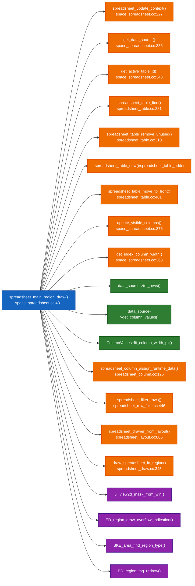
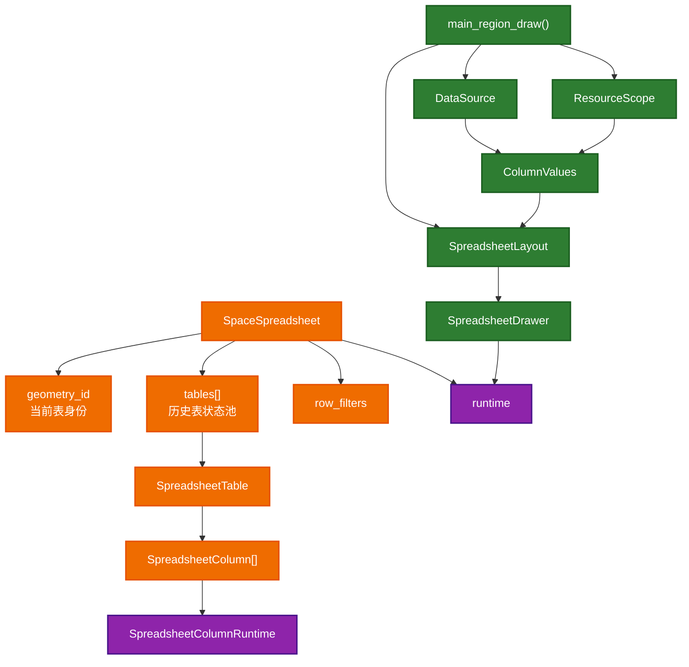
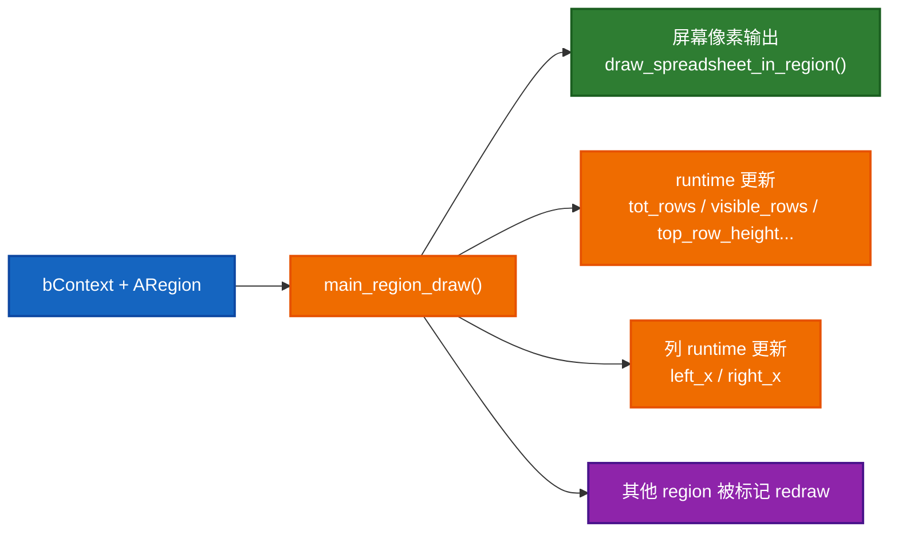

# `spreadsheet_main_region_draw()` 依赖速查

这份文档是 [05-spreadsheet_main_region_draw详解.md](./05-spreadsheet_main_region_draw详解.md) 的配套速查表。

如果主文档更像“讲故事”，这份更像“查字典”。

## 1. 直接调用关系图

## 2. 关键对象速查

| 对象 | 定义位置 | 在 `main_region_draw()` 里的角色 | 持久/临时 |
| --- | --- | --- | --- |
| `SpaceSpreadsheet` | `DNA_space_types.h` / 当前 space | 整个 editor 实例，持有 geometry_id、tables、row_filters、runtime | 持久 |
| `SpaceSpreadsheet_Runtime` | [spreadsheet_intern.hh](E:/blender-git/blender/source/blender/editors/space_spreadsheet/spreadsheet_intern.hh) | 当前帧统计与交互辅助缓存 | 持久但内容偏 runtime |
| `DataSource` | [spreadsheet_data_source.hh](E:/blender-git/blender/source/blender/editors/space_spreadsheet/spreadsheet_data_source.hh) | 抽象“当前显示的数据” | 本帧临时 |
| `SpreadsheetTable` | `DNA_space_types.h` + [spreadsheet_table.hh](E:/blender-git/blender/source/blender/editors/space_spreadsheet/spreadsheet_table.hh) | 保存这张表的列状态 | 持久 |
| `SpreadsheetColumn` | `DNA_space_types.h` + [spreadsheet_column.hh](E:/blender-git/blender/source/blender/editors/space_spreadsheet/spreadsheet_column.hh) | 保存列 ID、列宽、runtime 几何等 | 持久 |
| `ColumnValues` | [spreadsheet_column_values.hh](E:/blender-git/blender/source/blender/editors/space_spreadsheet/spreadsheet_column_values.hh) | 当前这一帧某一列的真实数据 | 本帧临时 |
| `SpreadsheetLayout` | [spreadsheet_layout.hh](E:/blender-git/blender/source/blender/editors/space_spreadsheet/spreadsheet_layout.hh) | 当前这一帧最终布局 | 本帧临时 |
| `SpreadsheetDrawer` | [spreadsheet_draw.hh](E:/blender-git/blender/source/blender/editors/space_spreadsheet/spreadsheet_draw.hh) | 基于布局实际执行绘制 | 本帧临时 |
| `ResourceScope` | `BLI_resource_scope.hh` | 托管本帧 `ColumnValues` 生命周期 | 本帧临时 |

## 3. 状态所有权图

## 4. 帮你把 helper 函数分层

### Layer 1: 上下文层

- `spreadsheet_update_context()`
- `get_data_source()`
- `get_active_table_id()`

这一层回答的问题是：

> 当前到底应该显示什么？

### Layer 2: 表状态层

- `spreadsheet_table_find()`
- `spreadsheet_table_add()`
- `spreadsheet_table_remove_unused()`
- `spreadsheet_table_move_to_front()`
- `update_visible_columns()`

这一层回答的问题是：

> 这张表过去积累的 UI 状态是什么？

### Layer 3: 本帧布局层

- `get_index_column_width()`
- `data_source->get_column_values()`
- `ColumnValues::fit_column_width_px()`
- `spreadsheet_filter_rows()`

这一层回答的问题是：

> 这一帧具体该怎么摆？

### Layer 4: 绘制层

- `spreadsheet_drawer_from_layout()`
- `draw_spreadsheet_in_region()`

这一层回答的问题是：

> 这些布局信息最后如何画出来？

### Layer 5: 框架收尾层

- `ui::view2d_mask_from_win()`
- `ED_region_draw_overflow_indication()`
- `BKE_area_find_region_type()`
- `ED_region_tag_redraw()`

这一层回答的问题是：

> 画完之后，怎样让别的 region 和 UI 表现保持正确？

## 5. `main_region_draw()` 的输入、输出、副作用

### 输入

- `const bContext *C`
- `ARegion *region`

### 直接输出

严格来说没有显式返回值，因为它是 `void`。

### 真正输出

- 主表格内容被画到 `region`
- `SpaceSpreadsheet_Runtime` 被更新
- `SpreadsheetColumnRuntime` 被更新
- footer / sidebar 被 tag redraw

### 副作用图

## 6. 5 个最重要的 helper，建议读到什么深度

| 函数 | 为什么重要 | 建议深度 |
| --- | --- | --- |
| `spreadsheet_update_context()` | 决定当前 space 的上下文是否合法、是否需要切换目标对象/路径 | 深读 |
| `get_data_source()` | 把 UI 上下文转成数据抽象 | 深读 |
| `update_visible_columns()` | 把数据列集合和用户列状态接起来 | 深读 |
| `spreadsheet_filter_rows()` | 把总行数转成可见行 mask | 深读 |
| `draw_spreadsheet_in_region()` | 真正的区域绘制执行器 | 深读 |

## 7. 很容易混淆的概念

### `SpreadsheetTable` 不是数据表本身

它更像：

> 某个“表视图身份”对应的 UI 状态容器

里面保存的是：

- 列顺序
- 列宽
- 用户手工改动痕迹
- 最近使用时间

### `ColumnValues` 不是持久列对象

`ColumnValues` 是本帧从 `DataSource` 拉出来的值视图。

### `tot_rows` 和 `visible_rows` 不一样

- `tot_rows`: 数据源本身有多少行
- `visible_rows`: 过滤后真正显示多少行

### `SpreadsheetColumnRuntime` 和 `SpaceSpreadsheet_Runtime` 不是一层东西

- `SpreadsheetColumnRuntime`: 单列几何信息
- `SpaceSpreadsheet_Runtime`: 整个 editor 级别的运行时统计

## 8. 自测问题

如果你读完这两份文档，建议用下面 8 个问题自测：

1. 为什么 `main_region_draw()` 先调 `spreadsheet_update_context()`，而不是直接读旧 `geometry_id`？
2. 为什么没有数据时要构造一个空 `DataSource`？
3. 为什么 `SpreadsheetTable` 要根据 `SpreadsheetTableID` 查找，而不是只存一张？
4. `update_visible_columns()` 为什么不直接用 `DataSource` 的默认列完全替换表里的列？
5. 为什么 `ColumnValues` 需要 `ResourceScope` 托管？
6. 为什么筛选返回的是 `IndexMask`？
7. 为什么要把当前 table move 到 front？
8. 为什么最后要 tag footer 和 sidebar redraw？

## 9. 建议的源码联读顺序

1. [space_spreadsheet.cc:431](E:/blender-git/blender/source/blender/editors/space_spreadsheet/space_spreadsheet.cc#L431)
2. [space_spreadsheet.cc:227](E:/blender-git/blender/source/blender/editors/space_spreadsheet/space_spreadsheet.cc#L227)
3. [space_spreadsheet.cc:336](E:/blender-git/blender/source/blender/editors/space_spreadsheet/space_spreadsheet.cc#L336)
4. [space_spreadsheet.cc:376](E:/blender-git/blender/source/blender/editors/space_spreadsheet/space_spreadsheet.cc#L376)
5. [spreadsheet_row_filter.cc:446](E:/blender-git/blender/source/blender/editors/space_spreadsheet/spreadsheet_row_filter.cc#L446)
6. [spreadsheet_layout.cc:805](E:/blender-git/blender/source/blender/editors/space_spreadsheet/spreadsheet_layout.cc#L805)
7. [spreadsheet_draw.cc:345](E:/blender-git/blender/source/blender/editors/space_spreadsheet/spreadsheet_draw.cc#L345)
