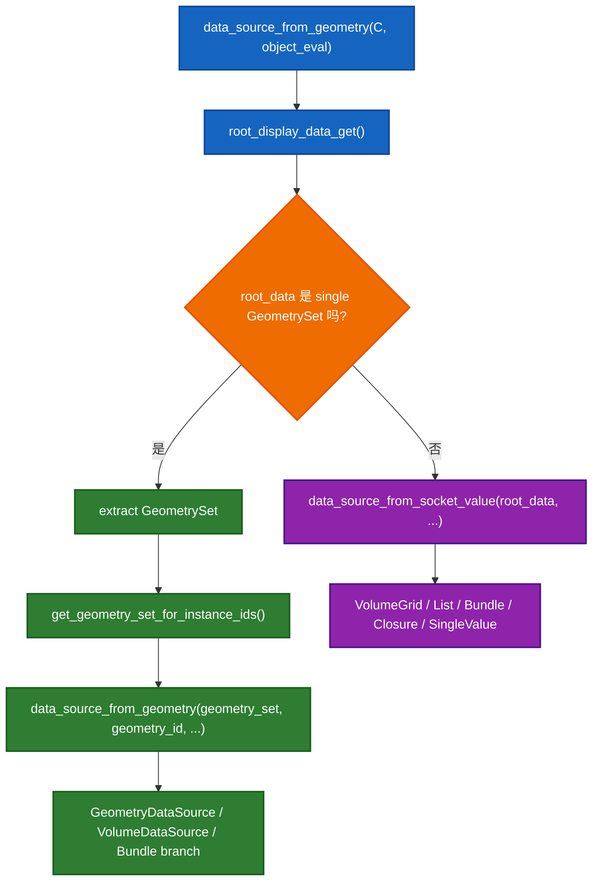

# `data_source_from_geometry(const bContext *C, Object *object_eval)` 讲解

这份文档整理的是下面这个函数的阅读说明：

- [spreadsheet_data_source_geometry.cc:1315](E:/blender-git/blender/source/blender/editors/space_spreadsheet/spreadsheet_data_source_geometry.cc#L1315)

你现在看的这个函数之所以容易让人晕，是因为它表面上只有二十几行，实际上是在做“类型分发”和“UI 状态到数据源对象的转换”。

这个函数的作用，我先用一句话说清楚：

> 根据当前 Spreadsheet 的 UI 选择状态 `geometry_id`，再结合当前 `object_eval`，构造出一个“这次表格真正应该显示什么”的 `DataSource` 对象。

也就是：
它不是在“拿数据直接画表格”，而是在“决定要用哪一种数据源类”。

## 1. 先看简化版逻辑

```cpp
std::unique_ptr<DataSource> data_source_from_geometry(const bContext *C, Object *object_eval)
{
  SpaceSpreadsheet *sspreadsheet = CTX_wm_space_spreadsheet(C);
  bke::SocketValueVariant root_data = root_display_data_get(sspreadsheet, object_eval);

  if (root_data.is_single()) {
    const GPointer ptr = root_data.get_single_ptr();
    if (ptr.is_type<bke::GeometrySet>()) {
      const bke::GeometrySet root_geometry_set = root_data.extract<bke::GeometrySet>();
      const bke::GeometrySet geometry_set = get_geometry_set_for_instance_ids(
          root_geometry_set,
          Span{sspreadsheet->geometry_id.instance_ids,
               sspreadsheet->geometry_id.instance_ids_num});
      return data_source_from_geometry(std::move(geometry_set),
                                       sspreadsheet->geometry_id,
                                       object_eval,
                                       sspreadsheet->flag &
                                           SPREADSHEET_FLAG_SHOW_INTERNAL_ATTRIBUTES);
    }
  }

  return data_source_from_socket_value(
      root_data,
      SpreadsheetClosureInputOutput(
          sspreadsheet->geometry_id.viewer_item_bundle_path.closure_input_output));
}
```

你可以把它理解成两大分支：

1. `root_data` 是一个 `GeometrySet`
2. `root_data` 不是 `GeometrySet`，而是别的值，比如 list、bundle、closure、单值、volume grid

这就是这个函数的主心骨。

## 2. 先讲这个函数“输入”和“输出”

输入：

- `const bContext *C`
- `Object *object_eval`

输出：

- `std::unique_ptr<DataSource>`

也就是：
输入是当前上下文和当前评估后的对象，
输出是一个多态的数据源对象，可能是：

- `GeometryDataSource`
- `VolumeDataSource`
- `VolumeGridDataSource`
- `ListDataSource`
- `BundleDataSource`
- `ClosureSignatureDataSource`
- `SingleValueDataSource`

这些类定义在：

- [spreadsheet_data_source_geometry.hh](E:/blender-git/blender/source/blender/editors/space_spreadsheet/spreadsheet_data_source_geometry.hh)

## 3. 先认识 4 个关键类型

理解这个函数，最重要的是先别卡在细节里，先把 4 个核心类型认清。

### 3.1 `SpaceSpreadsheet`

- 当前 Spreadsheet 编辑器实例
- 它里面存了用户当前在 UI 上选了什么
- 最关键的是 `geometry_id`

相关位置：

- [space_spreadsheet.cc:336](E:/blender-git/blender/source/blender/editors/space_spreadsheet/space_spreadsheet.cc#L336)
- [spreadsheet_dataset_draw.cc:843](E:/blender-git/blender/source/blender/editors/space_spreadsheet/spreadsheet_dataset_draw.cc#L843)
- [spreadsheet_dataset_draw.cc:860](E:/blender-git/blender/source/blender/editors/space_spreadsheet/spreadsheet_dataset_draw.cc#L860)

### 3.2 `SpreadsheetTableIDGeometry`，也就是 `sspreadsheet->geometry_id`

它描述“当前想看几何里的哪一部分”，里面会记录：

- 当前 instance 路径
- 当前看的是 `DOMAIN` 还是 `BUNDLE`
- 当前 component type
- 当前 attribute domain
- 当前 bundle path
- 当前 viewer item bundle path

这些字段在左侧树点击时会被改掉，代码在：

- [spreadsheet_dataset_draw.cc:850](E:/blender-git/blender/source/blender/editors/space_spreadsheet/spreadsheet_dataset_draw.cc#L850)
- [spreadsheet_dataset_draw.cc:882](E:/blender-git/blender/source/blender/editors/space_spreadsheet/spreadsheet_dataset_draw.cc#L882)
- [spreadsheet_dataset_draw.cc:898](E:/blender-git/blender/source/blender/editors/space_spreadsheet/spreadsheet_dataset_draw.cc#L898)

### 3.3 `bke::SocketValueVariant`

这是一个“变体类型”，你可以把它理解成：

> 一个运行时装不同种类值的盒子

它可能装的是：

- `GeometrySet`
- `List`
- `BundlePtr`
- `ClosurePtr`
- 单个值
- `VolumeGrid`

这个函数最难的地方之一，就是它先拿到的是这个“盒子”，然后再判断盒子里装的到底是什么。

相关代码：

- [spreadsheet_data_source_geometry.cc:1105](E:/blender-git/blender/source/blender/editors/space_spreadsheet/spreadsheet_data_source_geometry.cc#L1105)
- [spreadsheet_data_source_geometry.cc:1235](E:/blender-git/blender/source/blender/editors/space_spreadsheet/spreadsheet_data_source_geometry.cc#L1235)

### 3.4 `DataSource`

这是 Spreadsheet 的统一数据源抽象。

定义在：

- [spreadsheet_data_source.hh](E:/blender-git/blender/source/blender/editors/space_spreadsheet/spreadsheet_data_source.hh)

它对外统一提供几件事：

- `foreach_default_column_ids()`
- `get_column_values()`
- `tot_rows()`
- `has_selection_filter()`

也就是说：
后面的绘制代码不关心你到底是 mesh domain、bundle、list 还是单值。
它只认 `DataSource` 这个统一接口。

## 4. 逐行拆这个函数

### 4.1 第一步：拿到当前 Spreadsheet 实例

```cpp
SpaceSpreadsheet *sspreadsheet = CTX_wm_space_spreadsheet(C);
```

这里就是从 Blender 的 context 里拿当前这个 spreadsheet editor。

作用：
后面所有“当前用户在 UI 里选了什么”，都要从它里面读。

### 4.2 第二步：拿到根显示数据

```cpp
bke::SocketValueVariant root_data = root_display_data_get(sspreadsheet, object_eval);
```

这个是整个函数最关键的前置步骤。

`root_display_data_get()` 定义在：

- [spreadsheet_data_source_geometry.cc:1105](E:/blender-git/blender/source/blender/editors/space_spreadsheet/spreadsheet_data_source_geometry.cc#L1105)

它做的事不是“直接生成 DataSource”，而是：

> 先根据当前 viewer path / object eval state / 当前 viewer item，拿到最原始的显示值 `root_data`

这个 `root_data` 可能是：

- 一个完整 `GeometrySet`
- 一个 list
- 一个 bundle 里的某个值
- 一个 closure
- 一个 volume grid
- 一个普通单值

所以这一步之后，程序还不知道该用哪种 `DataSource`。

它只是知道：
“我手上有一团要显示的东西，但还没决定用哪种展示器来包它”。

### 4.3 第三步：如果 `root_data` 是单个值，再判断它是不是 `GeometrySet`

```cpp
if (root_data.is_single()) {
  const GPointer ptr = root_data.get_single_ptr();
  if (ptr.is_type<bke::GeometrySet>()) {
```

这里有两层判断：

1. `root_data.is_single()`
   表示这个 variant 里装的是“一个单值”，而不是 list、volume grid 之类的复合形态
2. `ptr.is_type<bke::GeometrySet>()`
   表示这个单值的实际类型是 `GeometrySet`

只有两层都成立，才进入“几何分支”。

这也是很多人第一次读时最迷糊的地方：

- `is_single()` 不等于“它就是 Geometry”
- `single` 只是说“里面是一个值”
- 这个值还要继续判断具体类型

### 4.4 第四步：把根几何取出来

```cpp
const bke::GeometrySet root_geometry_set = root_data.extract<bke::GeometrySet>();
```

如果确认里面真的是 `GeometrySet`，
就把它从 `SocketValueVariant` 里提取出来。

这里的 `root_geometry_set` 可以理解成：

> 当前 viewer / object 这一层能看到的最上层几何

但注意，它还不一定是最终要显示的那一层。

因为 Spreadsheet 可能不是在看 root geometry 本身，而是在看某个 instance 里面的几何。

### 4.5 第五步：沿着 instance 路径向下钻

```cpp
const bke::GeometrySet geometry_set = get_geometry_set_for_instance_ids(
    root_geometry_set,
    Span{sspreadsheet->geometry_id.instance_ids,
         sspreadsheet->geometry_id.instance_ids_num});
```

这个 helper 定义在：

- [spreadsheet_data_source_geometry.cc:1212](E:/blender-git/blender/source/blender/editors/space_spreadsheet/spreadsheet_data_source_geometry.cc#L1212)

它做的事情是：

> 如果用户在左侧实例树里点进了某个实例层级，就按 `instance_ids` 一层层往下走，拿到那个实例引用对应的几何

你可以把它理解成：

- `root_geometry_set` 是整棵树的根
- `instance_ids` 是“从根走到某个子节点”的路径
- `get_geometry_set_for_instance_ids()` 就是按路径走下去，得到最终那块几何

`instance_ids` 是在哪里设置的？
是在左侧实例树点击时设置的：

- [spreadsheet_dataset_draw.cc:843](E:/blender-git/blender/source/blender/editors/space_spreadsheet/spreadsheet_dataset_draw.cc#L843)
- [spreadsheet_dataset_draw.cc:850](E:/blender-git/blender/source/blender/editors/space_spreadsheet/spreadsheet_dataset_draw.cc#L850)

所以这一步其实是在把“左侧树选中的实例路径”翻译成“真正要看的几何对象”。

### 4.6 第六步：把几何和 UI 状态一起交给另一个重载函数

```cpp
return data_source_from_geometry(std::move(geometry_set),
                                 sspreadsheet->geometry_id,
                                 object_eval,
                                 sspreadsheet->flag &
                                     SPREADSHEET_FLAG_SHOW_INTERNAL_ATTRIBUTES);
```

这里调用的不是你当前在看的这个函数自己，
而是上面那个重载版本：

- [spreadsheet_data_source_geometry.cc:1276](E:/blender-git/blender/source/blender/editors/space_spreadsheet/spreadsheet_data_source_geometry.cc#L1276)

这个重载版本更像真正的“几何分派器”。

它会根据 `geometry_id.geometry_item_type` 决定：

- 如果当前看的是 `DOMAIN`
  - 可能返回 `GeometryDataSource`
  - 或 `VolumeDataSource`
- 如果当前看的是 `BUNDLE`
  - 先走 `lookup_bundle_path()`
  - 再进一步转成 `BundleDataSource` / `ClosureSignatureDataSource` / `SingleValueDataSource` 等

也就是说：

你当前看的这个函数只负责：

- 从 context 取状态
- 找到 root data
- 如果 root data 是 geometry，就进一步定位到具体实例几何
- 然后交给更细的几何分派逻辑

### 4.7 第七步：如果不是 `GeometrySet`，就走“非几何值分支”

```cpp
return data_source_from_socket_value(
    root_data,
    SpreadsheetClosureInputOutput(
        sspreadsheet->geometry_id.viewer_item_bundle_path.closure_input_output));
```

这部分对应：

- [spreadsheet_data_source_geometry.cc:1235](E:/blender-git/blender/source/blender/editors/space_spreadsheet/spreadsheet_data_source_geometry.cc#L1235)

它的含义是：

> 如果当前根显示值不是一个 `GeometrySet`，那就直接按它自己的类型去构造相应 `DataSource`

比如：

- `root_data.is_volume_grid()` -> `VolumeGridDataSource`
- `root_data.is_list()` -> `ListDataSource`
- `root_data` 是 `BundlePtr` -> `BundleDataSource`
- `root_data` 是 `ClosurePtr` -> `ClosureSignatureDataSource`
- `root_data` 是普通单值 -> `SingleValueDataSource`

这一步本质上是在处理：

- viewer node 输出的不是 geometry
- 而是 bundle / list / closure / scalar 之类值

这也是为什么 Spreadsheet 现在不只是“看 mesh attribute 表”，还能看更泛化的 Geometry Nodes 数据。

## 5. 为什么这个函数要分成“Geometry 分支”和“非 Geometry 分支”

因为 Spreadsheet 现在面对的“显示对象”已经不是单一类型了。

以前你可能直觉会觉得：

> Spreadsheet 不就是拿一个 geometry，然后按 domain 显示属性表吗？

但在这个模块里，真实情况已经变成：

- 有时根数据是 `GeometrySet`
- 有时根数据是 viewer item 的 bundle 值
- 有时是 list
- 有时是 closure
- 有时是 volume grid
- 有时只是一个单值

所以它必须先做一次“总分流”：



## 6. 把最容易卡住的几个名字翻成大白话

### `root_display_data_get()`

不是“最终 DataSource”，而是“当前要显示的原始值”。

### `SocketValueVariant`

不是 geometry 本身，而是“一个能装各种值的盒子”。

### `GeometrySet`

是 Blender 的几何容器，里面可能有 mesh、point cloud、instances、volume 等 component。

### `get_geometry_set_for_instance_ids()`

不是创建新几何，而是沿着 instance 路径选出当前目标几何。

### `DataSource`

不是数据本体，而是“Spreadsheet 展示适配器”。

## 7. 如果要真正看懂，建议按这个顺序联读

1. 当前函数
   - [spreadsheet_data_source_geometry.cc:1315](E:/blender-git/blender/source/blender/editors/space_spreadsheet/spreadsheet_data_source_geometry.cc#L1315)

2. 根数据从哪里来
   - [spreadsheet_data_source_geometry.cc:1105](E:/blender-git/blender/source/blender/editors/space_spreadsheet/spreadsheet_data_source_geometry.cc#L1105)

3. instance 路径如何切到子几何
   - [spreadsheet_data_source_geometry.cc:1212](E:/blender-git/blender/source/blender/editors/space_spreadsheet/spreadsheet_data_source_geometry.cc#L1212)

4. geometry 分支最终怎么选具体数据源类
   - [spreadsheet_data_source_geometry.cc:1276](E:/blender-git/blender/source/blender/editors/space_spreadsheet/spreadsheet_data_source_geometry.cc#L1276)

5. 非 geometry 值如何分派
   - [spreadsheet_data_source_geometry.cc:1235](E:/blender-git/blender/source/blender/editors/space_spreadsheet/spreadsheet_data_source_geometry.cc#L1235)

6. 左侧树是怎么改 `geometry_id` 的
   - [spreadsheet_dataset_draw.cc:843](E:/blender-git/blender/source/blender/editors/space_spreadsheet/spreadsheet_dataset_draw.cc#L843)
   - [spreadsheet_dataset_draw.cc:882](E:/blender-git/blender/source/blender/editors/space_spreadsheet/spreadsheet_dataset_draw.cc#L882)
   - [spreadsheet_dataset_draw.cc:898](E:/blender-git/blender/source/blender/editors/space_spreadsheet/spreadsheet_dataset_draw.cc#L898)

## 8. 一个“看完就能复述”的版本

你可以记这个口令：

> 先从 Spreadsheet 当前状态拿 `root_data`，
> 如果它其实是一份 `GeometrySet`，就按 instance 路径切到目标几何，再按当前 domain/bundle 选择合适的 Geometry 型 `DataSource`；
> 如果它根本不是 `GeometrySet`，就直接按 value 类型走非 Geometry 的 `DataSource` 分发。
