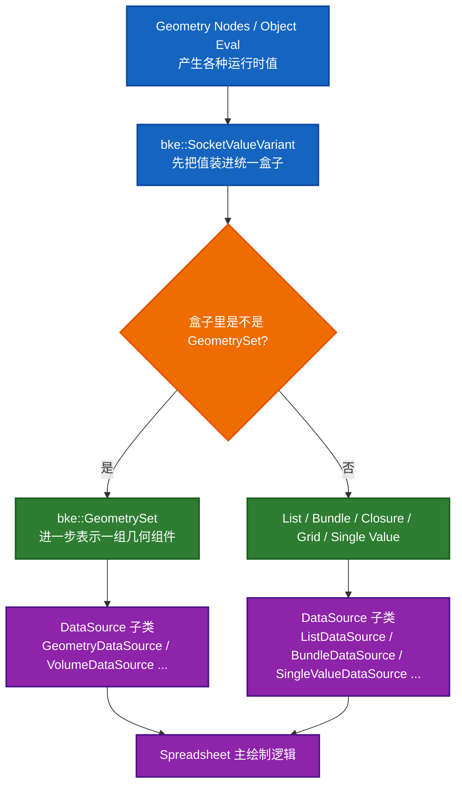
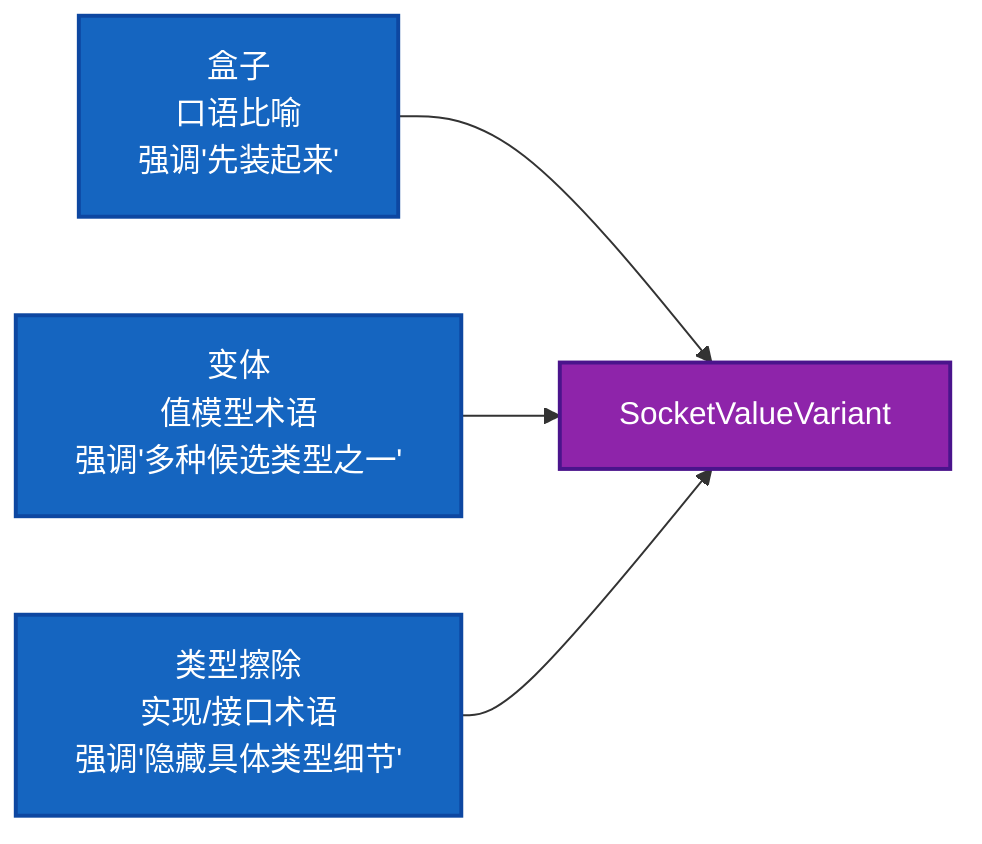
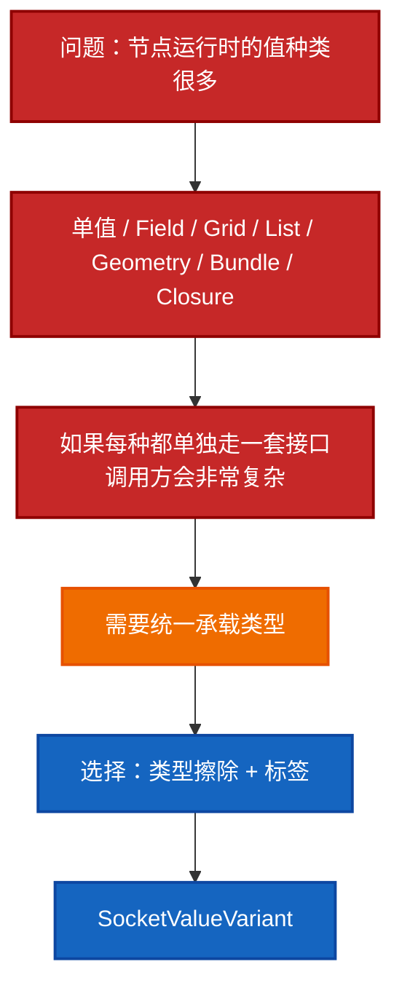
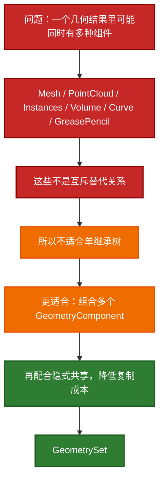
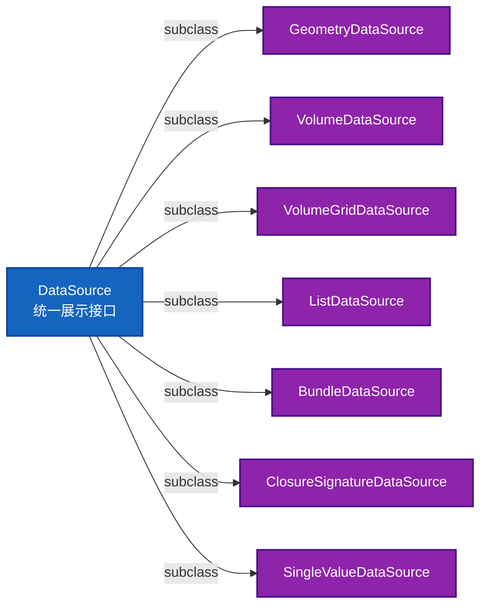
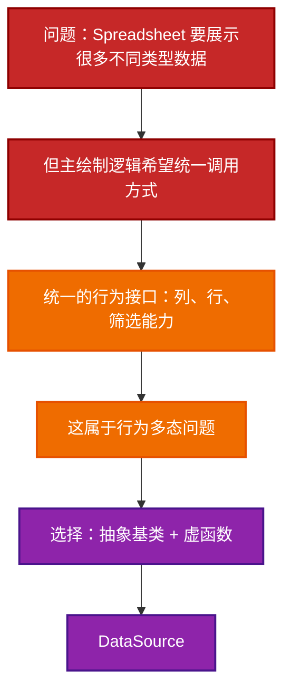
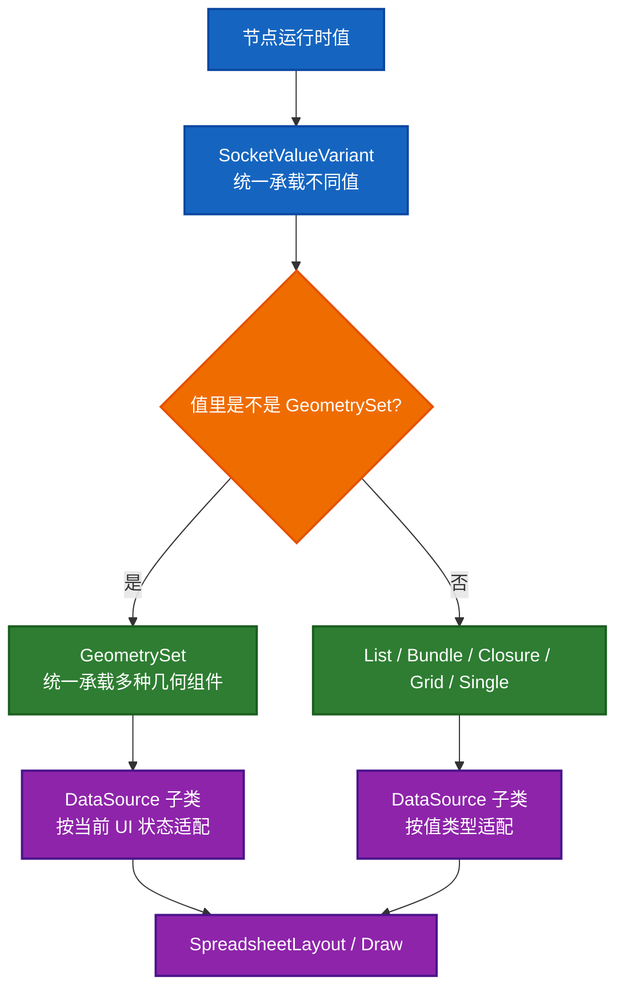

- [`bke::SocketValueVariant`、`bke::GeometrySet`、`DataSource` 设计讲解](#bkesocketvaluevariantbkegeometrysetdatasource-设计讲解)
  - [1. 先给一句话总览](#1-先给一句话总览)
  - [2. 先看它们在 Spreadsheet 里的配合关系](#2-先看它们在-spreadsheet-里的配合关系)
  - [2.5 “盒子 / 类型擦除 / 变体”是一回事吗](#25-盒子--类型擦除--变体是一回事吗)
    - [2.5.1 “盒子”是什么](#251-盒子是什么)
    - [2.5.2 “变体”是什么](#252-变体是什么)
    - [2.5.3 “类型擦除”是什么](#253-类型擦除是什么)
    - [2.5.4 三者关系](#254-三者关系)
    - [2.5.5 一张图区分三者](#255-一张图区分三者)
  - [3. `bke::SocketValueVariant` 是什么](#3-bkesocketvaluevariant-是什么)
    - [3.1 先用大白话理解](#31-先用大白话理解)
    - [3.2 为什么这里要用“盒子”](#32-为什么这里要用盒子)
    - [3.3 它内部是怎么做的](#33-它内部是怎么做的)
    - [3.4 为什么不是直接只用 `std::variant`](#34-为什么不是直接只用-stdvariant)
    - [3.4.1 先简单介绍一下 `std::variant`](#341-先简单介绍一下-stdvariant)
    - [3.4.2 `std::variant` 的优点](#342-stdvariant-的优点)
    - [3.4.3 为什么这里仍然没有选 `std::variant`](#343-为什么这里仍然没有选-stdvariant)
    - [3.4.4 一个对比表](#344-一个对比表)
    - [3.4.5 怎么记这件事](#345-怎么记这件事)
    - [3.5 它为什么还要存 `socket_type`](#35-它为什么还要存-socket_type)
    - [3.6 你可以把它理解成“值层的多态”](#36-你可以把它理解成值层的多态)
    - [3.7 总结：为什么 `SocketValueVariant` 用盒子](#37-总结为什么-socketvaluevariant-用盒子)
  - [4. `bke::GeometrySet` 是什么](#4-bkegeometryset-是什么)
    - [4.1 先用大白话理解](#41-先用大白话理解)
    - [4.2 为什么它不是继承树，而是组合容器](#42-为什么它不是继承树而是组合容器)
    - [4.3 它内部怎么存](#43-它内部怎么存)
    - [4.4 为什么 `GeometrySet` 里面还有 `GeometryComponent`](#44-为什么-geometryset-里面还有-geometrycomponent)
    - [4.5 为什么 `GeometrySet` 复制很便宜](#45-为什么-geometryset-复制很便宜)
    - [4.6 为什么 `GeometrySet` 这里适合“组合 + 隐式共享”](#46-为什么-geometryset-这里适合组合--隐式共享)
    - [4.7 总结：为什么 `GeometrySet` 用组合](#47-总结为什么-geometryset-用组合)
  - [5. `DataSource` 是什么](#5-datasource-是什么)
    - [5.1 先用大白话理解](#51-先用大白话理解)
    - [5.2 为什么这里要用继承](#52-为什么这里要用继承)
    - [5.3 这里为什么不直接继续用盒子](#53-这里为什么不直接继续用盒子)
    - [5.4 这里为什么不把所有逻辑塞进一个大类](#54-这里为什么不把所有逻辑塞进一个大类)
    - [5.5 这里是怎样的继承结构](#55-这里是怎样的继承结构)
    - [5.6 总结：为什么 `DataSource` 用继承](#56-总结为什么-datasource-用继承)
  - [6. 三者分别解决的问题不同](#6-三者分别解决的问题不同)
  - [7. 这三种设计为什么不能互相替代](#7-这三种设计为什么不能互相替代)
    - [7.1 为什么 `SocketValueVariant` 不适合替代 `DataSource`](#71-为什么-socketvaluevariant-不适合替代-datasource)
    - [7.2 为什么 `GeometrySet` 不适合替代 `SocketValueVariant`](#72-为什么-geometryset-不适合替代-socketvaluevariant)
    - [7.3 为什么 `GeometrySet` 也不适合替代 `DataSource`](#73-为什么-geometryset-也不适合替代-datasource)
  - [8. 把三者连起来看](#8-把三者连起来看)
  - [9. 站在工程设计角度的最终总结](#9-站在工程设计角度的最终总结)
    - [`SocketValueVariant`](#socketvaluevariant)
    - [`GeometrySet`](#geometryset)
    - [`DataSource`](#datasource)
  - [10. 一句话记忆法](#10-一句话记忆法)
  - [11. 建议联读源码顺序](#11-建议联读源码顺序)

# `bke::SocketValueVariant`、`bke::GeometrySet`、`DataSource` 设计讲解

这份文档讲三个在 Spreadsheet 和 Geometry Nodes 里都非常关键的类型：

- `bke::SocketValueVariant`
- `bke::GeometrySet`
- `ed::spreadsheet::DataSource`

重点不是只讲“它们是什么”，而是讲清楚：

1. 它们各自解决什么问题
2. 它们为什么会设计成现在这个样子
3. 为什么这里分别用了“盒子 / 变体”“组合”“继承抽象”
4. 它们之间怎么配合

---

## 1. 先给一句话总览

你可以先把这三个类记成下面这样：

- `SocketValueVariant`：一个“万能值盒子”，用来装运行时各种节点值
- `GeometrySet`：一个“几何组合容器”，用来装 mesh / point cloud / instances / volume 等不同几何组件
- `DataSource`：一个“表格展示抽象接口”，把不同类型的数据统一适配给 Spreadsheet

更短一点说：

- `SocketValueVariant` 解决“值的种类太多”
- `GeometrySet` 解决“几何组件太多”
- `DataSource` 解决“展示方式要统一”

---

## 2. 先看它们在 Spreadsheet 里的配合关系



这张图表达的核心是：

- `SocketValueVariant` 站在最前面，先统一“值”
- `GeometrySet` 是其中一种很重要的值
- `DataSource` 站在 Spreadsheet 这一侧，统一“展示接口”

---

## 2.5 “盒子 / 类型擦除 / 变体”是一回事吗

不是完全一回事，但它们经常在同一段讨论里一起出现，所以很容易混。

先给一个直接结论：

- “盒子”是偏口语化的说法
- “变体”强调一个对象可以装多种候选类型中的某一种
- “类型擦除”强调调用方不需要在编译期知道具体类型细节

它们有重叠，但关注点不同。

### 2.5.1 “盒子”是什么

“盒子”不是一个严格的 C++ 术语，它更像工程里常用的比喻。

说一个类是“盒子”，通常是指：

- 它能装某种值
- 外部先不用关心内部到底装的是什么
- 需要时再打开取值

所以我在文档里说 `SocketValueVariant` 是“值盒子”，是为了帮助建立直觉。

### 2.5.2 “变体”是什么

“变体”更接近技术语义。

它强调的是：

> 一个对象可以在若干候选类型中，当前持有其中一种。

例如：

- 现在装的是 `int`
- 下一次可能装的是 `GeometrySet`
- 再下一次可能装的是 `ListPtr`

这就是“variant”视角。

### 2.5.3 “类型擦除”是什么

类型擦除的重点不是“能装很多种值”，而是：

> 调用方不需要知道完整的具体类型定义，也能持有和转发这个对象。

也就是说，它更关心“接口面向外部时，类型信息被隐藏”。

比如：

- 头文件里不需要 include 所有具体类型
- 使用方只通过通用接口拿值、判 kind、extract

这是 `SocketValueVariant` 设计里非常重要的一层。

### 2.5.4 三者关系

对 `SocketValueVariant` 来说，更准确的说法是：

> 它是一个带标签的变体容器，并且通过 `Any` 和外部模板实现，具备明显的类型擦除特征。

所以如果你问：

“盒子 / 类型擦除 / 变体 是一种意思吗？”

更准确的回答是：

- 不是同义词
- 但在这个类身上三种描述都能部分成立

可以记成：

- 盒子：从直觉上怎么理解它
- 变体：从值模型上怎么理解它
- 类型擦除：从工程实现上怎么理解它

### 2.5.5 一张图区分三者



---

## 3. `bke::SocketValueVariant` 是什么

定义位置：

- [BKE_node_socket_value.hh](E:/blender-git/blender/source/blender/blenkernel/BKE_node_socket_value.hh)
- [node_socket_value.cc](E:/blender-git/blender/source/blender/blenkernel/intern/node_socket_value.cc)

### 3.1 先用大白话理解

它就是一个“运行时值盒子”。

这个盒子不是只装一种值，而是可以装很多种节点 socket 可能经过的数据：

- 单个值，比如 `int`、`float`、`float3`、`std::string`
- `Field`
- `VolumeGrid`
- `List`
- `GeometrySet`
- `BundlePtr`
- `ClosurePtr`

你可以把它想成：

> Geometry Nodes 在运行时传值时，不可能为每种值写一套完全独立的通道，所以需要一个统一容器。

### 3.2 为什么这里要用“盒子”

因为节点之间传递的值在运行时是变化的，而且代码很多地方并不知道下一站拿到的是什么。

比如一个 Spreadsheet viewer 看到的值，可能是：

- geometry
- list
- bundle
- closure
- 单个数值

如果不用盒子，会发生什么？

- 每一层代码都得模板化
- 或者到处 `if constexpr`
- 或者把所有类型头文件都 include 进来
- 编译依赖和调用复杂度都会爆炸

所以它这里选的是：

- 类型擦除
- 统一容器
- 按需解包

这就是“盒子”的意义。

### 3.3 它内部是怎么做的

`SocketValueVariant` 内部最关键的成员是：

```cpp
Any<void, 32, 16, AnyExtraData> value_;
```

和：

```cpp
enum class Kind {
  None,
  Single,
  Field,
  Grid,
  List,
};
```

这里有两个设计点特别重要：

1. 真正的数据放在 `Any` 里
2. 再额外存一个轻量标签 `Kind` 和 `socket_type`

这意味着它不是只靠 RTTI 或 `Any` 自己去猜类型，而是同时维护一个“更便宜的分类标签”。

### 3.4 为什么不是直接只用 `std::variant`

这是一个很好的问题。

大概率不直接用 `std::variant`，有几个原因：

1. 类型太多，而且未来可能继续扩展
2. 想做类型擦除，减少头文件依赖
3. `Field<T>`、`GField`、`VolumeGrid<T>`、`ListPtr` 这些体系并不都是一个简单固定列表
4. 这里还想统一支持“单值访问”“字段访问”“grid 访问”“列表访问”

`std::variant` 更适合：

- 类型集合稳定
- 编译期就知道所有候选类型

这里的问题更像：

- 运行时统一承载 heterogeneous values

所以 `Any + Kind + socket_type` 比单纯 `std::variant` 更灵活。

### 3.4.1 先简单介绍一下 `std::variant`

`std::variant` 是 C++17 标准库里的一个类型安全联合体。

你可以把它理解成：

> 一个对象在任意时刻，持有若干候选类型中的一种。

例如：

```cpp
std::variant<int, float, std::string> value;
value = 42;
value = std::string("hello");
```

它的特点是：

- 候选类型集合在编译期固定
- 编译器知道所有候选类型
- 访问时通常用 `std::get`、`std::holds_alternative`、`std::visit`

它适合下面这种场景：

- 类型种类有限
- 候选集合稳定
- 想要强类型、零开销风格访问

### 3.4.2 `std::variant` 的优点

`std::variant` 很强，优点包括：

- 类型安全很好
- 编译器能帮你检查分支覆盖
- `std::visit` 对一些代数数据类型风格建模很舒服
- 不需要自己额外维护太多底层存储逻辑

所以如果问题只是：

- “我有固定几种类型，运行时装其中一种”

那 `std::variant` 往往是很好的选择。

### 3.4.3 为什么这里仍然没有选 `std::variant`

这里不是说 `std::variant` 不好，而是它和当前问题的形状没有完全对上。

`SocketValueVariant` 这里还额外有几个诉求：

1. 想做比较强的类型擦除
2. 不想让所有使用方都依赖全部具体值类型定义
3. 需要在“single / field / grid / list”这种高层类别上做更快的运行时判断
4. 有一些访问路径不是简单地“按当前持有类型原样取出”，而是会发生转换
   - 比如 single 转 `GField`
   - field 转单值
   - grid 转对应基类型

而 `std::variant` 更擅长的是：

- 精确枚举固定候选类型
- 原样持有
- 原样访问

这里的需求更像是：

- 统一值语义
- 统一 socket 语义
- 允许一部分跨表示层的转换

所以 Blender 这里选了：

- `Any`
- `Kind`
- `socket_type`
- 模板 accessor

这套方案更贴合它的实际工程需求。

### 3.4.4 一个对比表

| 维度 | `std::variant` | `SocketValueVariant` 当前方案 |
| --- | --- | --- |
| 候选类型集合 | 编译期固定 | 工程上更灵活，靠 `Any` + 标签组织 |
| 访问方式 | `get` / `visit` | `get` / `extract` / `kind` / `socket_type` |
| 类型信息暴露 | 候选类型通常在接口层显式可见 | 类型擦除更强 |
| 高层类别标签 | 通常需要自己再包一层 | 内建 `Kind` |
| 跨表示转换 | 不是强项 | 明确支持 single/field/grid 等转换语义 |
| 适用问题 | 固定候选类型的值变体 | 几何节点 socket 值的统一承载与转换 |

### 3.4.5 怎么记这件事

不要把它理解成：

- “`std::variant` 落后，所以 Blender 没用”

更准确的理解是：

- `std::variant` 解决的是一种问题
- `SocketValueVariant` 这里要解决的问题更复杂、更偏工程整合

所以这里不是“会不会用标准库”的问题，而是“问题模型和工具是否匹配”的问题。

### 3.5 它为什么还要存 `socket_type`

头文件注释里写得很明白：为了快。

因为如果没有这个额外信息，想知道：

- 它是不是 single
- single 里的基础 socket 类型是什么

就要做更多 `Any` 层面的类型判断。

而现在只需要看：

- `kind()`
- `socket_type()`

这是一个典型的“为运行时分发加轻量 tag”的设计。

### 3.6 你可以把它理解成“值层的多态”

注意，这里它没用继承，而用了“变体盒子”。

为什么？

因为它的问题不是“行为多态”，而是“值类型多态”。

也就是：

- 这里要统一的是值的存储与传递
- 不是一组对象的虚函数行为

这类问题更适合：

- variant
- type erasure
- tagged union

而不是继承。

### 3.7 总结：为什么 `SocketValueVariant` 用盒子



一句话总结：

> `SocketValueVariant` 用“盒子”是因为这里要解决的是“多种值的统一存储与分发”，不是“对象行为的继承多态”。

---

## 4. `bke::GeometrySet` 是什么

定义位置：

- [BKE_geometry_set.hh](E:/blender-git/blender/source/blender/blenkernel/BKE_geometry_set.hh)
- [geometry_set.cc](E:/blender-git/blender/source/blender/blenkernel/intern/geometry_set.cc)

### 4.1 先用大白话理解

`GeometrySet` 不是一种具体几何。

它更像是：

> 一个几何“总容器”，里面可以同时带多种几何组件。

比如一个 `GeometrySet` 里可以有：

- Mesh component
- PointCloud component
- Instances component
- Volume component
- Curve component
- GreasePencil component

也就是说，它描述的不是“我是一个 mesh”，而是：

> 我是一组几何相关组件的集合。

### 4.2 为什么它不是继承树，而是组合容器

因为 Blender 这里面对的问题不是“几何对象有统一基类，大家互相替代”。

而是：

- 一个结果里可能同时有 mesh 和 instances
- 还可能同时带 volume、curve、grease pencil
- 这些组件是并列共存的，不是互斥替代的

所以这就不是继承最擅长的问题。

继承更适合：

- “一个对象是 A 或 B 或 C”

而 `GeometrySet` 更像：

- “一个对象里面可以同时有 A、B、C 多种组件”

这显然更适合组合。

### 4.3 它内部怎么存

核心成员：

```cpp
std::array<GeometryComponentPtr, GEO_COMPONENT_TYPE_ENUM_SIZE> components_;
nodes::BundlePtr bundle_;
std::string name_;
```

也就是说：

- `GeometrySet` 自己不直接持有 mesh/volume 原始数据
- 它持有的是多个 `GeometryComponent`
- 每个 component 再各自管理自己的那部分数据

这里是两层组合：

1. `GeometrySet` 组合多个 component
2. 每个 component 再引用或拥有具体几何数据

### 4.4 为什么 `GeometrySet` 里面还有 `GeometryComponent`

这是“组合再分层”的典型设计。

因为如果 `GeometrySet` 直接塞满所有几何字段，会很快变成大而乱的巨型结构：

- mesh 相关逻辑
- volume 相关逻辑
- point cloud 相关逻辑
- attribute 相关逻辑
- ownership / sharing 相关逻辑

全部搅在一起会非常难维护。

于是 Blender 这里拆成：

- `GeometrySet`: 负责“我有哪些组件”
- `GeometryComponent`: 负责“这一类组件自己怎么管理”

### 4.5 为什么 `GeometrySet` 复制很便宜

头文件注释里强调：

> `GeometrySet` 拷贝通常很便宜，因为不会直接深拷贝几何本体，而是共享 component。

这是因为它用的是：

- `ImplicitSharingPtr`
- `ImplicitSharingMixin`

也就是隐式共享。

这带来的好处是：

- 大量几何数据不必频繁深拷贝
- 读操作便宜
- 写的时候再 copy-on-write

### 4.6 为什么 `GeometrySet` 这里适合“组合 + 隐式共享”

因为它面对的是两个很现实的问题：

1. 一个结果里可能同时包含多种几何组件
2. 几何数据很大，不能随便深拷贝

所以最佳策略不是：

- 一个大继承树

而是：

- 组合多个组件
- 组件之间做共享
- 写时再复制

### 4.7 总结：为什么 `GeometrySet` 用组合



一句话总结：

> `GeometrySet` 用组合，是因为几何结果天然是“多组件并存”，不是“单一类型二选一”；再加上几何很重，所以必须配合共享机制。

---

## 5. `DataSource` 是什么

定义位置：

- [spreadsheet_data_source.hh](E:/blender-git/blender/source/blender/editors/space_spreadsheet/spreadsheet_data_source.hh)

具体子类定义位置：

- [spreadsheet_data_source_geometry.hh](E:/blender-git/blender/source/blender/editors/space_spreadsheet/spreadsheet_data_source_geometry.hh)

### 5.1 先用大白话理解

`DataSource` 不是数据本身。

它更像：

> Spreadsheet 的展示适配器接口。

Spreadsheet 最终要做的事情非常统一：

- 告诉我默认有哪些列
- 给我某列的数据
- 告诉我总共有多少行
- 是否支持 selection filter

但问题是，底层数据来源不统一：

- 有时是 mesh domain
- 有时是 volume
- 有时是 bundle
- 有时是 closure
- 有时是 list
- 有时只是一个 single value

所以 Spreadsheet 不应该直接把所有这些情况写死在主绘制函数里。

于是就有了 `DataSource`。

### 5.2 为什么这里要用继承

因为这里面对的是“行为多态”问题。

注意和 `SocketValueVariant` 不一样。

`DataSource` 要统一的是：

- `foreach_default_column_ids()`
- `get_column_values()`
- `tot_rows()`
- `has_selection_filter()`

也就是说，调用方关心的是：

> 不管你底层是什么类型，你都得提供这一组行为。

这正是继承 / 虚函数最擅长解决的问题。

### 5.3 这里为什么不直接继续用盒子

因为到了 Spreadsheet 这一层，问题已经变了。

上游的问题是：

- “这个值到底是哪种类型？”

下游的问题是：

- “不管这个值是哪种类型，你能不能像表格一样给我列和行？”

前者适合变体盒子。
后者适合接口继承。

所以：

- `SocketValueVariant` 统一“值类型”
- `DataSource` 统一“展示行为”

### 5.4 这里为什么不把所有逻辑塞进一个大类

如果不做 `DataSource` 继承层，主绘制代码就会变成巨大的 `if/else` 分发地狱：

- 如果是 GeometrySet domain，就……
- 如果是 Volume，就……
- 如果是 Bundle，就……
- 如果是 Closure，就……
- 如果是 List，就……
- 如果是 Single Value，就……

这样会带来几个问题：

1. 主绘制逻辑和数据类型逻辑耦合
2. 新增一种数据类型时，要改主绘制代码
3. 每个分支都要重新发明列/行的接口

所以这里用继承，本质是在做“开闭分离”：

- 主绘制逻辑只依赖抽象接口
- 新数据类型通过新子类接入

### 5.5 这里是怎样的继承结构

当前重要子类有：

- `GeometryDataSource`
- `VolumeDataSource`
- `VolumeGridDataSource`
- `ListDataSource`
- `BundleDataSource`
- `ClosureSignatureDataSource`
- `SingleValueDataSource`

可以画成这样：



### 5.6 总结：为什么 `DataSource` 用继承



一句话总结：

> `DataSource` 用继承，是因为 Spreadsheet 要统一的是“展示行为”，这正是接口继承的用武之地。

---

## 6. 三者分别解决的问题不同

这一点特别重要。

很多人第一次看会觉得：

- 既然都在做抽象，为什么不统一成一种方式？

答案是：

- 它们抽象的维度不同

| 类型 | 抽象的是什么 | 适合的技术 |
| --- | --- | --- |
| `SocketValueVariant` | 值类型很多，运行时统一承载 | 盒子 / 类型擦除 / 变体 |
| `GeometrySet` | 多种几何组件并存 | 组合 |
| `DataSource` | 不同数据的展示行为统一 | 继承 / 虚函数 |

你可以这样记：

- 值的多态 -> 盒子
- 组件的并存 -> 组合
- 行为的统一 -> 继承

---

## 7. 这三种设计为什么不能互相替代

### 7.1 为什么 `SocketValueVariant` 不适合替代 `DataSource`

因为它擅长的是“装值”，不擅长的是“提供表格行为接口”。

它能告诉你：

- 我里面装的是 geometry/list/closure/single value

但它不能天然回答：

- 默认应该显示哪些列？
- 某一列的 `ColumnValues` 是什么？
- 总行数是多少？

### 7.2 为什么 `GeometrySet` 不适合替代 `SocketValueVariant`

因为不是所有 viewer 输出都是 geometry。

有些输出根本就是：

- list
- bundle
- closure
- volume grid
- scalar value

所以必须先有一个更泛化的盒子把这些值都装住。

### 7.3 为什么 `GeometrySet` 也不适合替代 `DataSource`

因为 `GeometrySet` 只是几何容器，不是表格展示协议。

Spreadsheet 需要的是：

- 列名
- 列数据
- 总行数
- 过滤能力

这些是 UI 展示层语义，不是几何容器层语义。

---

## 8. 把三者连起来看



---

## 9. 站在工程设计角度的最终总结

### `SocketValueVariant`

为什么这样做：

- 节点值类型太多
- 调用方不应依赖所有具体类型头文件
- 需要运行时统一装箱和拆箱

所以选：

- 盒子
- 类型擦除
- `Kind + socket_type` 标签辅助

### `GeometrySet`

为什么这样做：

- 几何结果不是单类型，而是多组件并存
- 数据体积大，复制成本高

所以选：

- 组合多个 `GeometryComponent`
- 隐式共享
- 写时复制

### `DataSource`

为什么这样做：

- Spreadsheet 不想知道底层每种数据的细节
- 只想统一调用“列 / 行 / 筛选”接口

所以选：

- 抽象基类
- 子类实现行为
- 主绘制逻辑只依赖接口

---

## 10. 一句话记忆法

如果你只想记住最核心的一句：

> `SocketValueVariant` 统一“值”，`GeometrySet` 统一“几何组件”，`DataSource` 统一“表格展示行为”。

再压缩成三个词：

- 盒子：装值
- 组合：装组件
- 继承：装行为

---

## 11. 建议联读源码顺序

如果你想继续往下深挖，建议按这个顺序读：

1. [BKE_node_socket_value.hh](E:/blender-git/blender/source/blender/blenkernel/BKE_node_socket_value.hh)
2. [node_socket_value.cc](E:/blender-git/blender/source/blender/blenkernel/intern/node_socket_value.cc)
3. [BKE_geometry_set.hh](E:/blender-git/blender/source/blender/blenkernel/BKE_geometry_set.hh)
4. [geometry_set.cc](E:/blender-git/blender/source/blender/blenkernel/intern/geometry_set.cc)
5. [spreadsheet_data_source.hh](E:/blender-git/blender/source/blender/editors/space_spreadsheet/spreadsheet_data_source.hh)
6. [spreadsheet_data_source_geometry.hh](E:/blender-git/blender/source/blender/editors/space_spreadsheet/spreadsheet_data_source_geometry.hh)
7. [spreadsheet_data_source_geometry.cc](E:/blender-git/blender/source/blender/editors/space_spreadsheet/spreadsheet_data_source_geometry.cc)

如果你愿意，下一步我可以继续帮你写其中一个专题：

1. `SocketValueVariant` 的实现细读
2. `GeometrySet` 和 `GeometryComponent` 的关系细读
3. `DataSource` 子类体系如何接入 Spreadsheet 主绘制
