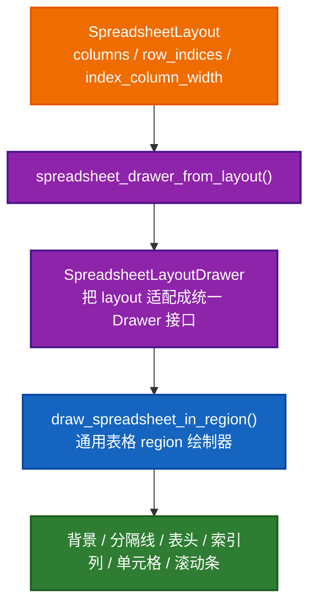
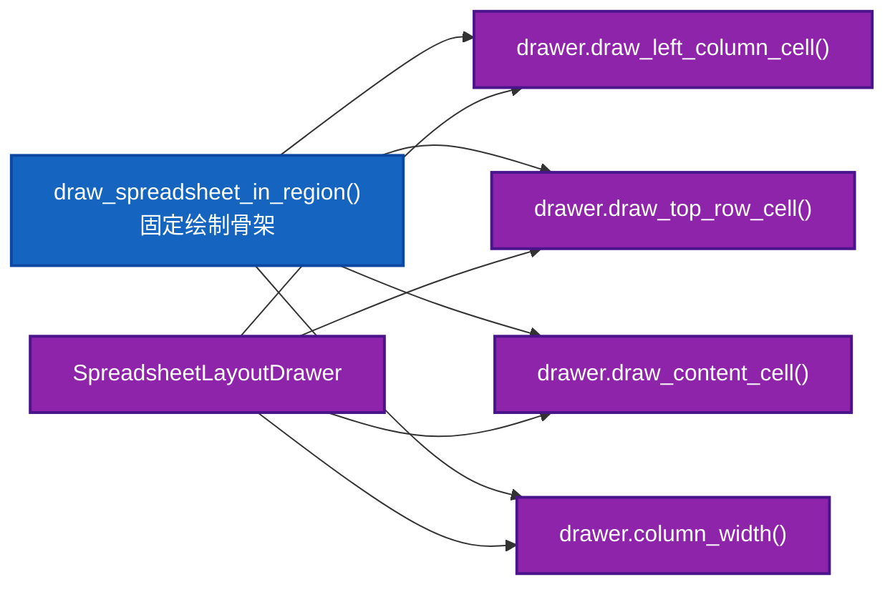
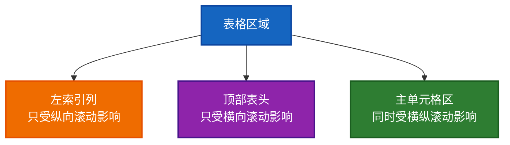

# `spreadsheet_drawer_from_layout()`、`draw_spreadsheet_in_region()` 设计与实现讲解

这份文档专门讲清楚下面三处代码为什么这样设计，以及 `draw_spreadsheet_in_region()` 这段代码到底在干什么：

- [spreadsheet_layout.cc:805](E:/blender-git/blender/source/blender/editors/space_spreadsheet/spreadsheet_layout.cc#L805)
- [space_spreadsheet.cc:505](E:/blender-git/blender/source/blender/editors/space_spreadsheet/space_spreadsheet.cc#L505)
- [spreadsheet_draw.cc:345](E:/blender-git/blender/source/blender/editors/space_spreadsheet/spreadsheet_draw.cc#L345)

也就是这一条链：

```cpp
std::unique_ptr<SpreadsheetDrawer> drawer = spreadsheet_drawer_from_layout(spreadsheet_layout);
draw_spreadsheet_in_region(C, region, *drawer);
```

很多人第一次看到这里会有两个问题：

1. 明明已经有 `SpreadsheetLayout` 了，为什么还要包一层 `SpreadsheetDrawer`？
2. 为什么不直接在 `space_spreadsheet.cc` 里把所有绘制写完？

这份文档就围绕这两个问题展开。

---

## 1. 先给一句话结论

一句话总结这套设计：

> `SpreadsheetLayout` 负责“这帧该怎么排”，`SpreadsheetDrawer` 负责“按统一接口提供怎么画”，`draw_spreadsheet_in_region()` 负责“把一个表格在 region 里完整画出来”。

再压缩一点：

- `layout`：算布局
- `drawer`：暴露绘制接口
- `draw_spreadsheet_in_region`：执行通用绘制流程

---

## 2. 先看三层职责分离



这张图表达的是：

- `SpreadsheetLayout` 只是描述数据，不直接决定绘制顺序
- `SpreadsheetLayoutDrawer` 是一个适配层
- `draw_spreadsheet_in_region()` 是真正的“表格绘制模板函数”

---

## 3. 为什么不直接用 `SpreadsheetLayout` 去画

这是最核心的问题。

### 3.1 `SpreadsheetLayout` 的职责很纯

`SpreadsheetLayout` 定义在：

- [spreadsheet_layout.hh](E:/blender-git/blender/source/blender/editors/space_spreadsheet/spreadsheet_layout.hh)

它只有这些核心数据：

- `columns`
- `row_indices`
- `index_column_width`

它表达的是：

- 有哪些列
- 列宽是多少
- 哪些行最终可见

它不表达：

- 表头怎么画
- 左侧索引怎么画
- 单元格里面的值怎么画
- 背景和分隔线怎么画
- 重排行时的视觉反馈怎么画

也就是说它是“布局数据结构”，不是“绘制协议”。

### 3.2 通用绘制流程需要一个稳定接口

`draw_spreadsheet_in_region()` 并不想知道你底层是不是 `SpreadsheetLayout`。

它只想知道几件统一的事情：

- 总共有几行几列
- 每列多宽
- 表头怎么画
- 左侧行号怎么画
- 某个单元格怎么画

这正是 `SpreadsheetDrawer` 提供的接口：

- `draw_top_row_cell()`
- `draw_left_column_cell()`
- `draw_content_cell()`
- `column_width()`

这意味着：

`draw_spreadsheet_in_region()` 依赖的是“表格绘制接口”，不是具体 layout 类型。

---

## 4. 为什么先 `spreadsheet_drawer_from_layout()`，再 `draw_spreadsheet_in_region()`

相关代码：

- [spreadsheet_layout.cc:805](E:/blender-git/blender/source/blender/editors/space_spreadsheet/spreadsheet_layout.cc#L805)
- [space_spreadsheet.cc:505](E:/blender-git/blender/source/blender/editors/space_spreadsheet/space_spreadsheet.cc#L505)

对应实现非常简单：

```cpp
std::unique_ptr<SpreadsheetDrawer> spreadsheet_drawer_from_layout(
    const SpreadsheetLayout &spreadsheet_layout)
{
  return std::make_unique<SpreadsheetLayoutDrawer>(spreadsheet_layout);
}
```

你可以把它理解成一个“适配器工厂”。

它在做的事情是：

> 把 `SpreadsheetLayout` 这种具体布局对象，适配成 `SpreadsheetDrawer` 这个统一绘制接口对象。

所以主调用变成：

1. 上层先把布局算出来
2. 再把布局转换成 Drawer
3. 通用绘制器只和 Drawer 打交道

### 4.1 这样设计的好处

#### 好处 1：主绘制函数更干净

`space_spreadsheet.cc` 里的主绘制只需要做：

- 准备数据源
- 准备表状态
- 生成 layout
- 调绘制器

它不需要关心 GPU 背景块、scissor、separator line、scroll mask 这些细节。

#### 好处 2：绘制流程可复用

如果以后有别的 layout，只要也能做成一个 `SpreadsheetDrawer`，就可以复用 `draw_spreadsheet_in_region()` 这一整套绘制逻辑。

#### 好处 3：布局逻辑和绘制流程分开

这非常重要。

“列宽怎么算”“行过滤结果是什么”“某列对应什么数据”
和
“背景先画还是表头先画”“scissor 怎么切”“scrollbar mask 怎么算”

其实是两个完全不同层次的问题。

分开以后，代码会更容易读，也更容易改。

---

## 5. 这一套设计本质上是“适配器 + 模板方法”

你可以把它看成两个设计思路叠在一起。

### 5.1 适配器

`SpreadsheetLayoutDrawer` 适配：

- 输入：`SpreadsheetLayout`
- 输出：`SpreadsheetDrawer` 接口

### 5.2 模板方法

`draw_spreadsheet_in_region()` 提供了一套固定绘制骨架：

1. 更新滚动总区域
2. 清背景
3. 画底层背景和线条
4. 画左列
5. 画表头
6. 画单元格
7. 画拖拽列反馈
8. 画滚动条

其中“具体某个 cell 怎么画”，交给 `drawer.draw_*` 虚函数。

这就是很典型的模板方法结构。



---

## 6. `draw_spreadsheet_in_region()` 逐段讲解

现在开始精讲：

- [spreadsheet_draw.cc:345](E:/blender-git/blender/source/blender/editors/space_spreadsheet/spreadsheet_draw.cc#L345)

代码如下：

```cpp
void draw_spreadsheet_in_region(const bContext *C,
                                ARegion *region,
                                const SpreadsheetDrawer &drawer)
{
  SpaceSpreadsheet &sspreadsheet = *CTX_wm_space_spreadsheet(C);

  update_view2d_tot_rect(drawer, region, drawer.tot_rows);

  ui::theme::frame_buffer_clear(TH_BACK);

  View2D *v2d = &region->v2d;
  const int scroll_offset_y = v2d->cur.ymax;
  const int scroll_offset_x = v2d->cur.xmin;
  bool is_reordering_columns = sspreadsheet.runtime->reorder_column_visualization_data.has_value();

  GPUVertFormat *format = immVertexFormat();
  uint pos = GPU_vertformat_attr_add(format, "pos", gpu::VertAttrType::SFLOAT_32_32);
  immBindBuiltinProgram(GPU_SHADER_3D_UNIFORM_COLOR);

  draw_index_column_background(pos, region, drawer);
  draw_alternating_row_overlay(pos, scroll_offset_y, region, drawer);
  draw_top_row_background(pos, region, drawer);
  if (is_reordering_columns) {
    draw_column_reorder_source(pos, *region, sspreadsheet, scroll_offset_x);
  }
  draw_separator_lines(pos, scroll_offset_x, region, drawer);

  immUnbindProgram();

  draw_left_column_content(scroll_offset_y, C, region, drawer);
  draw_top_row_content(C, region, drawer, scroll_offset_x);
  draw_cell_contents(C, region, drawer, scroll_offset_x, scroll_offset_y);

  if (is_reordering_columns) {
    draw_column_reorder_destination(*region, sspreadsheet, drawer, scroll_offset_x);
  }

  rcti scroller_mask;
  BLI_rcti_init(&scroller_mask,
                drawer.left_column_width,
                region->winx,
                0,
                region->winy - drawer.top_row_height);
  ui::view2d_scrollers_draw(v2d, &scroller_mask);
}
```

---

### 6.1 先拿 `SpaceSpreadsheet`

```cpp
SpaceSpreadsheet &sspreadsheet = *CTX_wm_space_spreadsheet(C);
```

这一步的主要作用不是为了拿布局数据，而是为了后面读 runtime 状态：

- 是否正在拖拽重排列
- 重排列的可视化数据在哪里

也就是说，这个函数虽然主要依赖 `drawer`，但仍然需要从 editor runtime 读一些交互态。

---

### 6.2 更新 `View2D` 的总可滚动区域

```cpp
update_view2d_tot_rect(drawer, region, drawer.tot_rows);
```

这个 helper 会根据：

- 总列宽
- 左索引列宽
- 总行数
- 行高
- 表头高度

去设置 `region->v2d` 的 total rect。

它的意思是：

> 告诉 `View2D`，这整个表格在逻辑上到底有多大，从而让滚动系统知道滚动范围。

如果不做这一步：

- 滚动条长度会错
- 横向/纵向滚动范围会错
- 表格大于当前窗口时，滚动表现会异常

所以它必须先于后面的绘制发生。

---

### 6.3 清理 frame buffer 背景

```cpp
ui::theme::frame_buffer_clear(TH_BACK);
```

这一句的作用很直接：

- 把当前 region 的背景先清掉
- 用主题色 `TH_BACK`

这一步相当于“整张画布先打底色”。

---

### 6.4 读取当前滚动偏移和交互状态

```cpp
View2D *v2d = &region->v2d;
const int scroll_offset_y = v2d->cur.ymax;
const int scroll_offset_x = v2d->cur.xmin;
bool is_reordering_columns = sspreadsheet.runtime->reorder_column_visualization_data.has_value();
```

这里提取了三个关键输入：

- `scroll_offset_y`
- `scroll_offset_x`
- `is_reordering_columns`

作用分别是：

- 当前竖向滚动到了哪里
- 当前横向滚动到了哪里
- 当前是否处于列拖拽重排交互中

后面的几乎所有绘制都依赖这些值。

---

### 6.5 绑定 GPU immediate mode 绘制程序

```cpp
GPUVertFormat *format = immVertexFormat();
uint pos = GPU_vertformat_attr_add(format, "pos", gpu::VertAttrType::SFLOAT_32_32);
immBindBuiltinProgram(GPU_SHADER_3D_UNIFORM_COLOR);
```

这一段是给后面的“简单几何背景绘制”做准备。

后面要画的这些东西：

- 左索引列背景
- 交替行底色
- 表头背景
- 分隔线
- 拖拽列的来源高亮

都属于简单矩形 / 线段。

所以这里先绑定一个统一颜色 shader，然后集中把这些基础背景层画掉。

这也说明一个设计点：

- 文字、按钮内容用 UI block 系统画
- 基础背景几何用 GPU immediate mode 画

这两种东西分层处理。

---

### 6.6 画底层背景和线条

```cpp
draw_index_column_background(pos, region, drawer);
draw_alternating_row_overlay(pos, scroll_offset_y, region, drawer);
draw_top_row_background(pos, region, drawer);
if (is_reordering_columns) {
  draw_column_reorder_source(pos, *region, sspreadsheet, scroll_offset_x);
}
draw_separator_lines(pos, scroll_offset_x, region, drawer);
```

这是第一层绘制：背景层。

顺序非常讲究。

#### `draw_index_column_background`

画左边索引列背景块。

#### `draw_alternating_row_overlay`

画斑马纹行底色。

这里依赖 `scroll_offset_y`，因为滚动后交替行的位置也要跟着平移。

#### `draw_top_row_background`

画表头背景。

#### `draw_column_reorder_source`

如果正在拖列，先画出原列位置的高亮遮罩。

#### `draw_separator_lines`

最后画分隔线，把视觉层次压实。

你可以把这一步理解成：

> 先把“桌面板子”画出来，再往上放内容。

---

### 6.7 为什么背景层要和内容层分开

因为这两类绘制对象很不一样：

背景层：

- 矩形
- 线段
- 半透明叠加
- 和具体单元格文本内容弱耦合

内容层：

- 按钮
- 标签
- tooltip
- 需要 block 生命周期管理
- 需要 scissor 精细裁切

如果把它们混在一起：

- GPU immediate 和 UI block 会相互缠绕
- 绘制顺序更难控制
- 可读性会明显下降

所以这里先画背景，再画内容，是一个很稳的分层。

---

### 6.8 解绑背景 shader

```cpp
immUnbindProgram();
```

这说明前面的 immediate mode 背景绘制阶段结束了。

接下来进入内容层。

---

### 6.9 画左索引列内容

```cpp
draw_left_column_content(scroll_offset_y, C, region, drawer);
```

这个 helper 做的事情是：

- 给左侧索引列设置 scissor
- 创建一个 `ui::Block`
- 只遍历当前可见行
- 调 `drawer.draw_left_column_cell(row_index, params)`

也就是说：

真正每一行左侧显示什么，不是 `draw_spreadsheet_in_region()` 自己决定的，
而是交给 `drawer`。

但“左索引列这一整块怎么裁切、怎么遍历可见区、怎么创建 block”这件事，
由通用绘制器统一负责。

---

### 6.10 画表头内容

```cpp
draw_top_row_content(C, region, drawer, scroll_offset_x);
```

这个 helper 负责：

- 只裁切表头区域
- 创建表头 block
- 遍历列
- 计算每列在当前滚动偏移下的 `xmin`
- 调 `drawer.draw_top_row_cell(column_index, params)`

注意这里依赖的是 `scroll_offset_x`，因为表头会跟着横向滚动。

---

### 6.11 画单元格内容

```cpp
draw_cell_contents(C, region, drawer, scroll_offset_x, scroll_offset_y);
```

这是内容层里最重的一步。

它做了：

- scissor 到主单元格区域
- 创建 block
- 先算当前可见的行
- 再遍历列
- 对可见列内，再遍历可见行
- 每个 cell 调 `drawer.draw_content_cell(row, col, params)`

也就是说：

`draw_spreadsheet_in_region()` 真正负责的是“遍历框架”。

而某个 cell 里到底是数字、矩阵、颜色块还是字符串，
那是 `SpreadsheetLayoutDrawer` 之类具体 drawer 的职责。

---

### 6.12 为什么内容绘制要分成左列 / 表头 / 主单元格三块

因为这三块的裁切逻辑不同：

- 左列：固定在左边，不跟横向内容区一起滚
- 表头：固定在上面，不跟纵向内容区一起滚
- 主单元格：同时受横向和纵向滚动影响

如果不拆开，滚动行为会很难正确表达。

这是典型的“冻结首行首列”表格结构。



---

### 6.13 画重排列的目标反馈

```cpp
if (is_reordering_columns) {
  draw_column_reorder_destination(*region, sspreadsheet, drawer, scroll_offset_x);
}
```

前面画的是原列位置的 source 遮罩。

这里画的是：

- 被拖动列当前偏移后的位置高亮
- 插入指示条

为什么这个在内容层之后画？

因为它本质上是一个交互覆盖层，要压在内容上面更清楚。

这也是很典型的绘制顺序：

1. 背景
2. 内容
3. 交互 overlay

---

### 6.14 画滚动条

```cpp
rcti scroller_mask;
BLI_rcti_init(&scroller_mask,
              drawer.left_column_width,
              region->winx,
              0,
              region->winy - drawer.top_row_height);
ui::view2d_scrollers_draw(v2d, &scroller_mask);
```

这是最后一步。

这里会构造一个 `scroller_mask`，特意避开：

- 左索引列
- 顶部表头

也就是说，滚动条只属于真正可滚动的主内容区，不覆盖冻结区域。

如果不这样做：

- 滚动条会压到索引列或表头上
- 视觉和交互都不合理

---

## 7. 把 `draw_spreadsheet_in_region()` 看成一个分层绘制管线

最适合记忆的方式，是把它当成一个 5 层绘制管线：

```mermaid
flowchart TD
    A["1. 预处理层<br/>update_view2d_tot_rect / clear / 取 scroll 状态"] --> B["2. 背景层<br/>索引列背景 / 交替行 / 表头背景 / 分隔线"]
    B --> C["3. 内容层<br/>左列内容 / 表头内容 / 主单元格内容"]
    C --> D["4. 交互覆盖层<br/>列重排目标反馈"]
    D --> E["5. 框架收尾层<br/>滚动条"]

    classDef prep fill:#1565c0,stroke:#0d47a1,color:#ffffff,stroke-width:2px;
    classDef bg fill:#ef6c00,stroke:#e65100,color:#ffffff,stroke-width:2px;
    classDef content fill:#2e7d32,stroke:#1b5e20,color:#ffffff,stroke-width:2px;
    classDef overlay fill:#8e24aa,stroke:#4a148c,color:#ffffff,stroke-width:2px;
    classDef end fill:#d81b60,stroke:#880e4f,color:#ffffff,stroke-width:2px;

    class A prep;
    class B bg;
    class C content;
    class D overlay;
    class E end;
```

这样看你就不会被具体 API 淹没。

---

## 8. 回答“为什么这样设计”

现在直接回答你最关心的设计问题。

### 8.1 为什么 `spreadsheet_layout.cc:805~809` 不直接返回 `SpreadsheetLayout`

因为 `SpreadsheetLayout` 是布局结果，不是绘制协议。

而 `draw_spreadsheet_in_region()` 需要的是一组稳定的“绘制虚接口”。

所以这里要先做适配：

- `SpreadsheetLayout` -> `SpreadsheetLayoutDrawer` -> `SpreadsheetDrawer`

### 8.2 为什么 `space_spreadsheet.cc:505~506` 不直接把绘制写在主函数里

因为主函数已经负责：

- 上下文同步
- 数据源选择
- table 状态维护
- 列同步
- row filter
- runtime 回填

如果再把 region 绘制细节塞进去，函数会变得非常臃肿。

拆开以后：

- `space_spreadsheet.cc` 管“准备什么”
- `spreadsheet_draw.cc` 管“怎么画”

### 8.3 为什么 `draw_spreadsheet_in_region()` 要依赖 `SpreadsheetDrawer`

因为它是通用表格绘制骨架。

它不应该绑定到：

- 某一种具体 layout 类型
- 某一种具体 cell 内容实现

它只该依赖统一接口。

### 8.4 为什么内容和背景分开画

因为：

- 背景更适合 immediate mode
- 内容更适合 UI block

分开能保持：

- 绘制顺序清晰
- scissor 清晰
- 交互覆盖层清晰

### 8.5 为什么左列 / 表头 / 主单元格分开

因为它们的滚动语义不同：

- 左列冻结
- 表头冻结
- 主区滚动

如果不拆，滚动和裁切会很别扭。

---

## 9. 一句话总结这套设计

如果你只记一句话，就记这个：

> `SpreadsheetLayout` 负责把数据排成表，`SpreadsheetLayoutDrawer` 负责把排好的表接到统一绘制接口上，`draw_spreadsheet_in_region()` 负责按固定流程把这个表画进一个可滚动的 Blender region。

再缩短成三个词：

- 算布局
- 做适配
- 执行绘制

---

## 10. 建议接下来联读的代码

如果你准备继续把这一块彻底吃透，我建议顺序是：

1. [spreadsheet_draw.hh](E:/blender-git/blender/source/blender/editors/space_spreadsheet/spreadsheet_draw.hh)
2. [spreadsheet_layout.cc:79](E:/blender-git/blender/source/blender/editors/space_spreadsheet/spreadsheet_layout.cc#L79) 附近的 `SpreadsheetLayoutDrawer`
3. [spreadsheet_layout.cc:805](E:/blender-git/blender/source/blender/editors/space_spreadsheet/spreadsheet_layout.cc#L805)
4. [spreadsheet_draw.cc:345](E:/blender-git/blender/source/blender/editors/space_spreadsheet/spreadsheet_draw.cc#L345)
5. [space_spreadsheet.cc:505](E:/blender-git/blender/source/blender/editors/space_spreadsheet/space_spreadsheet.cc#L505)

如果你愿意，我下一步可以继续补其中一个：

1. `SpreadsheetLayoutDrawer` 的逐函数讲解
2. `draw_left_column_content` / `draw_top_row_content` / `draw_cell_contents` 三兄弟的专门讲解
3. `View2D` 在 Spreadsheet 里的滚动与裁切机制专门讲解
