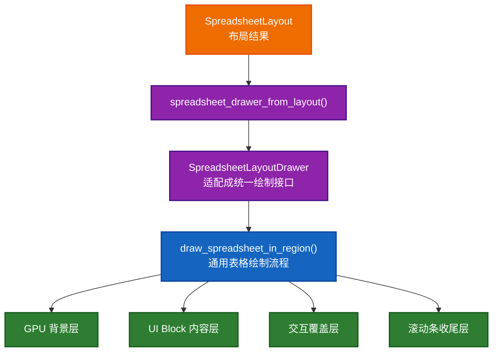
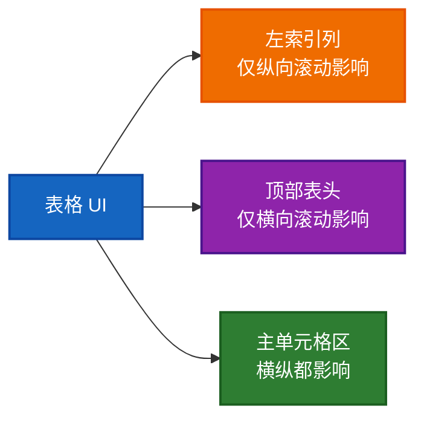

# `draw_spreadsheet_in_region()` 详细讲解

这份文档专门讲解下面这一段：

- [spreadsheet_draw.cc:345](E:/blender-git/blender/source/blender/editors/space_spreadsheet/spreadsheet_draw.cc#L345)

并把它前面的两个关键入口一起串起来：

- [spreadsheet_layout.cc:805](E:/blender-git/blender/source/blender/editors/space_spreadsheet/spreadsheet_layout.cc#L805)
- [space_spreadsheet.cc:505](E:/blender-git/blender/source/blender/editors/space_spreadsheet/space_spreadsheet.cc#L505)

目标不是只让你“知道它在画表格”，而是让你能真正回答：

1. 为什么先 `SpreadsheetLayout`，再 `SpreadsheetDrawer`，最后才 `draw_spreadsheet_in_region()`
2. `draw_spreadsheet_in_region()` 这一段代码分成了哪些层
3. 它直接依赖的类、helper、状态分别负责什么
4. 这段代码背后体现了哪些可迁移的工程思想

---

## 1. 先把三段代码连起来

实际调用链是这样的：

```cpp
std::unique_ptr<SpreadsheetDrawer> drawer = spreadsheet_drawer_from_layout(spreadsheet_layout);
draw_spreadsheet_in_region(C, region, *drawer);
```

你可以把这条链理解成：

1. 先把“这一帧表格怎么排”算出来
2. 再把“布局结果”适配成统一绘制接口
3. 最后让一个通用 region 绘制器执行完整绘制流程



---

## 2. 为什么这样设计

先直接回答你问的“为什么这样设计”。

### 2.1 为什么 `spreadsheet_layout.cc:805~809` 不直接返回 `SpreadsheetLayout`

因为 `SpreadsheetLayout` 是“描述结果”的数据结构，不是“绘制协议”。

`SpreadsheetLayout` 关心的是：

- 有哪些列
- 每列多宽
- 哪些行可见
- 索引列多宽

它不关心：

- 表头怎么画
- 左列怎么画
- 某个 cell 如何显示值
- 绘制时先画背景还是先画内容
- scissor 怎么切

所以 layout 不能直接承担 region 绘制器所需要的统一接口职责。

### 2.2 为什么还要有 `SpreadsheetDrawer`

因为 `draw_spreadsheet_in_region()` 不想知道具体 layout 的细节，它只想依赖一个统一协议：

- `column_width(column_index)`
- `draw_top_row_cell(column_index, params)`
- `draw_left_column_cell(row_index, params)`
- `draw_content_cell(row_index, column_index, params)`

这说明 `SpreadsheetDrawer` 的存在意义是：

> 把“具体表格数据”适配成“通用表格绘制接口”。

### 2.3 为什么 `space_spreadsheet.cc:505~506` 不直接画

因为 `space_spreadsheet.cc` 的主函数已经负责：

- 上下文同步
- 数据源选择
- table 复用与创建
- 列状态同步
- 行过滤
- runtime 回填

如果连具体 region 绘制步骤也塞进去，这个函数会同时承担：

- 数据准备
- 状态维护
- UI 绘制
- GPU 绘制顺序控制
- scissor 控制
- 交互 overlay 处理

这会让函数层次非常混乱。

所以这里明确拆成：

- `space_spreadsheet.cc`：准备“画什么”
- `spreadsheet_draw.cc`：决定“怎么画”

### 2.4 这背后其实是三种思想

1. 数据和表现分离
2. 适配器模式
3. 模板方法模式

一句话概括：

> 上层先算数据，中间层做适配，下层跑固定绘制骨架。

---

## 3. 先认识这段代码依赖的类

在真正精讲函数之前，先把直接相关的类过一遍。

### 3.1 `SpreadsheetDrawer`

定义在：

- [spreadsheet_draw.hh](E:/blender-git/blender/source/blender/editors/space_spreadsheet/spreadsheet_draw.hh)

这是一个抽象绘制接口类。

它有两类成员：

#### 结构参数

- `left_column_width`
- `top_row_height`
- `row_height`
- `tot_rows`
- `tot_columns`

这些是绘制器认为表格应该长什么样的基础几何参数。

#### 虚函数接口

- `draw_top_row_cell`
- `draw_left_column_cell`
- `draw_content_cell`
- `column_width`

这些是“具体单元怎么画”的行为接口。

它的职责不是保存数据，而是：

> 向通用绘制函数提供一个统一的表格绘制视图。

### 3.2 `SpreadsheetLayoutDrawer`

定义在：

- [spreadsheet_layout.cc:79](E:/blender-git/blender/source/blender/editors/space_spreadsheet/spreadsheet_layout.cc#L79)

它继承 `SpreadsheetDrawer`，把 `SpreadsheetLayout` 适配到绘制接口上。

构造时会做三件事：

- `tot_columns = spreadsheet_layout.columns.size();`
- `tot_rows = spreadsheet_layout.row_indices.size();`
- `left_column_width = spreadsheet_layout.index_column_width;`

也就是说，它把 layout 中已经算好的结果，填到 `SpreadsheetDrawer` 的统一接口字段中。

之后虚函数又会进一步把：

- layout 中的列
- layout 中的 row mask
- layout 中的 `ColumnValues`

转换成具体 UI button 的绘制。

### 3.3 `SpreadsheetLayout`

定义在：

- [spreadsheet_layout.hh](E:/blender-git/blender/source/blender/editors/space_spreadsheet/spreadsheet_layout.hh)

它只是一个布局结果对象，核心字段：

- `columns`
- `row_indices`
- `index_column_width`

它不参与 GPU 绘制顺序控制。

### 3.4 `SpaceSpreadsheet`

在这个函数里主要用来读 runtime：

- `reorder_column_visualization_data`

也就是判断当前是否正在做列拖拽重排，以及相关可视化信息。

### 3.5 `ARegion` 和 `View2D`

`region` 是当前编辑器区域。

`region->v2d` 表示当前 2D 视图的滚动、裁切、逻辑总区域信息。

这段绘制代码大量依赖它来：

- 获取当前滚动偏移
- 设置总可滚动范围
- 画滚动条

### 3.6 `CellDrawParams`

这是一个很小但很关键的桥梁结构：

- `ui::Block *block`
- `xmin`, `ymin`
- `width`, `height`

它把“当前格子要画在哪里”统一打包后，再交给 `drawer.draw_*`。

也就是说：

> 通用流程负责算格子矩形，具体 drawer 负责在这个矩形里画内容。

---

## 4. 再认识它直接调用的 helper

`draw_spreadsheet_in_region()` 直接调到的 helper 基本可以分成四组。

### 4.1 预处理

- [spreadsheet_draw.cc:258](E:/blender-git/blender/source/blender/editors/space_spreadsheet/spreadsheet_draw.cc#L258) `update_view2d_tot_rect`

作用：

- 根据总列宽、总行数、行高、表头高度，设置 `View2D` 的逻辑总区域

### 4.2 背景层

- [spreadsheet_draw.cc:60](E:/blender-git/blender/source/blender/editors/space_spreadsheet/spreadsheet_draw.cc#L60) `draw_index_column_background`
- [spreadsheet_draw.cc:68](E:/blender-git/blender/source/blender/editors/space_spreadsheet/spreadsheet_draw.cc#L68) `draw_alternating_row_overlay`
- [spreadsheet_draw.cc:90](E:/blender-git/blender/source/blender/editors/space_spreadsheet/spreadsheet_draw.cc#L90) `draw_top_row_background`
- [spreadsheet_draw.cc:98](E:/blender-git/blender/source/blender/editors/space_spreadsheet/spreadsheet_draw.cc#L98) `draw_separator_lines`

作用：

- 先把视觉背景和结构线条画出来

### 4.3 内容层

- [spreadsheet_draw.cc:138](E:/blender-git/blender/source/blender/editors/space_spreadsheet/spreadsheet_draw.cc#L138) `draw_left_column_content`
- [spreadsheet_draw.cc:171](E:/blender-git/blender/source/blender/editors/space_spreadsheet/spreadsheet_draw.cc#L171) `draw_top_row_content`
- [spreadsheet_draw.cc:208](E:/blender-git/blender/source/blender/editors/space_spreadsheet/spreadsheet_draw.cc#L208) `draw_cell_contents`

作用：

- 在不同 scissor 区域里，创建 UI block 并画出内容

### 4.4 交互 overlay

- [spreadsheet_draw.cc:275](E:/blender-git/blender/source/blender/editors/space_spreadsheet/spreadsheet_draw.cc#L275) `draw_column_reorder_source`
- [spreadsheet_draw.cc:297](E:/blender-git/blender/source/blender/editors/space_spreadsheet/spreadsheet_draw.cc#L297) `draw_column_reorder_destination`

作用：

- 给列拖拽重排画可视化反馈

---

## 5. `draw_spreadsheet_in_region()` 的代码

源码：

```cpp
void draw_spreadsheet_in_region(const bContext *C,
                                ARegion *region,
                                const SpreadsheetDrawer &drawer)
{
  SpaceSpreadsheet &sspreadsheet = *CTX_wm_space_spreadsheet(C);

  update_view2d_tot_rect(drawer, region, drawer.tot_rows);

  ui::theme::frame_buffer_clear(TH_BACK);

  View2D *v2d = &region->v2d;
  const int scroll_offset_y = v2d->cur.ymax;
  const int scroll_offset_x = v2d->cur.xmin;
  bool is_reordering_columns = sspreadsheet.runtime->reorder_column_visualization_data.has_value();

  GPUVertFormat *format = immVertexFormat();
  uint pos = GPU_vertformat_attr_add(format, "pos", gpu::VertAttrType::SFLOAT_32_32);
  immBindBuiltinProgram(GPU_SHADER_3D_UNIFORM_COLOR);

  draw_index_column_background(pos, region, drawer);
  draw_alternating_row_overlay(pos, scroll_offset_y, region, drawer);
  draw_top_row_background(pos, region, drawer);
  if (is_reordering_columns) {
    draw_column_reorder_source(pos, *region, sspreadsheet, scroll_offset_x);
  }
  draw_separator_lines(pos, scroll_offset_x, region, drawer);

  immUnbindProgram();

  draw_left_column_content(scroll_offset_y, C, region, drawer);
  draw_top_row_content(C, region, drawer, scroll_offset_x);
  draw_cell_contents(C, region, drawer, scroll_offset_x, scroll_offset_y);

  if (is_reordering_columns) {
    draw_column_reorder_destination(*region, sspreadsheet, drawer, scroll_offset_x);
  }

  rcti scroller_mask;
  BLI_rcti_init(&scroller_mask,
                drawer.left_column_width,
                region->winx,
                0,
                region->winy - drawer.top_row_height);
  ui::view2d_scrollers_draw(v2d, &scroller_mask);
}
```

---

## 6. 分层精讲：这段代码到底在干什么

最好的理解方式，是把它看成一个 5 层绘制管线。

```mermaid
flowchart TD
    A["1. 预处理层<br/>更新 View2D 总区域 / 清背景 / 取滚动状态"] --> B["2. 背景层<br/>索引列背景 / 交替行 / 表头背景 / 分隔线"]
    B --> C["3. 内容层<br/>左列内容 / 表头内容 / 单元格内容"]
    C --> D["4. 交互覆盖层<br/>列重排反馈"]
    D --> E["5. 滚动条收尾层"]

    classDef prep fill:#1565c0,stroke:#0d47a1,color:#ffffff,stroke-width:2px;
    classDef bg fill:#ef6c00,stroke:#e65100,color:#ffffff,stroke-width:2px;
    classDef content fill:#2e7d32,stroke:#1b5e20,color:#ffffff,stroke-width:2px;
    classDef overlay fill:#8e24aa,stroke:#4a148c,color:#ffffff,stroke-width:2px;
    classDef end fill:#d81b60,stroke:#880e4f,color:#ffffff,stroke-width:2px;

    class A prep;
    class B bg;
    class C content;
    class D overlay;
    class E end;
```

### 6.1 第一层：预处理层

#### 取 `SpaceSpreadsheet`

```cpp
SpaceSpreadsheet &sspreadsheet = *CTX_wm_space_spreadsheet(C);
```

作用：

- 读取 runtime 中是否有列重排可视化状态

#### 更新 `View2D` 总区域

```cpp
update_view2d_tot_rect(drawer, region, drawer.tot_rows);
```

作用：

- 告诉 `View2D` 整个表格逻辑尺寸有多大

为什么必须先做：

- 因为后面滚动偏移、滚动条绘制都依赖 `View2D`

#### 清背景

```cpp
ui::theme::frame_buffer_clear(TH_BACK);
```

作用：

- 给整张表格 region 先铺基础背景色

#### 读取滚动偏移

```cpp
View2D *v2d = &region->v2d;
const int scroll_offset_y = v2d->cur.ymax;
const int scroll_offset_x = v2d->cur.xmin;
```

作用：

- 后面所有背景、内容、分隔线都要根据滚动偏移换算位置

#### 判断是否处于列重排交互

```cpp
bool is_reordering_columns = sspreadsheet.runtime->reorder_column_visualization_data.has_value();
```

作用：

- 决定是否要额外画重排 overlay

### 6.2 第二层：背景层

#### 先绑定简单颜色 shader

```cpp
GPUVertFormat *format = immVertexFormat();
uint pos = GPU_vertformat_attr_add(format, "pos", gpu::VertAttrType::SFLOAT_32_32);
immBindBuiltinProgram(GPU_SHADER_3D_UNIFORM_COLOR);
```

这一步说明：

- 接下来画的是简单几何背景层
- 适合用 immediate mode 画矩形和线段

#### 画背景顺序

```cpp
draw_index_column_background(pos, region, drawer);
draw_alternating_row_overlay(pos, scroll_offset_y, region, drawer);
draw_top_row_background(pos, region, drawer);
if (is_reordering_columns) {
  draw_column_reorder_source(pos, *region, sspreadsheet, scroll_offset_x);
}
draw_separator_lines(pos, scroll_offset_x, region, drawer);
```

这里顺序很有讲究：

1. 先画左索引列背景
2. 再画交替行底色
3. 再画表头背景
4. 如果拖列中，再画原列位置的 source 遮罩
5. 最后画分隔线压住结构

这是一个典型的“先大色块，再细结构线”的绘制顺序。

#### 背景层为什么和内容层分开

因为背景层更适合：

- GPU immediate rect/line
- 统一颜色 shader
- 简单几何逻辑

内容层更适合：

- UI block
- tooltip
- button text/icon
- 更细的 scissor 管理

把两类东西混在一起，绘制流程会很难读。

### 6.3 第三层：内容层

背景层结束后：

```cpp
immUnbindProgram();
```

这表示 immediate mode 背景阶段结束。

下面开始 UI block 内容绘制。

#### 画左索引列内容

```cpp
draw_left_column_content(scroll_offset_y, C, region, drawer);
```

它的职责是：

- 用 scissor 裁出左列区域
- 创建 block
- 遍历当前可见行
- 调 `drawer.draw_left_column_cell()`

注意：

- 左列不参与横向滚动
- 只受纵向滚动影响

#### 画表头内容

```cpp
draw_top_row_content(C, region, drawer, scroll_offset_x);
```

它的职责是：

- 裁出顶部表头区域
- 创建 block
- 遍历列
- 调 `drawer.draw_top_row_cell()`

注意：

- 表头参与横向滚动
- 不参与纵向滚动

#### 画主单元格内容

```cpp
draw_cell_contents(C, region, drawer, scroll_offset_x, scroll_offset_y);
```

它的职责是：

- 裁出主内容区
- 创建 block
- 遍历可见列
- 遍历可见行
- 调 `drawer.draw_content_cell()`

这里是最重的绘制步骤。

#### 为什么内容必须分三块画

因为这三块的滚动语义不同：

- 左列：冻结列
- 表头：冻结行
- 主单元格：跟着横纵都滚

这本质上就是表格 UI 里“冻结首行首列”的经典结构。



### 6.4 第四层：交互覆盖层

```cpp
if (is_reordering_columns) {
  draw_column_reorder_destination(*region, sspreadsheet, drawer, scroll_offset_x);
}
```

这一层是 interaction overlay。

为什么它放在内容层之后：

- 因为它必须压在内容上面
- 否则拖动反馈不够清晰

也就是说，这里遵循的是：

- 背景
- 内容
- 交互覆盖

这样的经典 UI 绘制顺序。

### 6.5 第五层：滚动条收尾层

```cpp
rcti scroller_mask;
BLI_rcti_init(&scroller_mask,
              drawer.left_column_width,
              region->winx,
              0,
              region->winy - drawer.top_row_height);
ui::view2d_scrollers_draw(v2d, &scroller_mask);
```

这里会构造一个滚动条可绘制区域：

- 左边从 `drawer.left_column_width` 开始
- 上边截止到 `region->winy - drawer.top_row_height`

也就是说：

- 滚动条不会覆盖索引列
- 滚动条不会覆盖表头

这一步很细，但很重要。

它体现的是：

> 滚动条属于可滚动主内容区，而不属于冻结区域。

---

## 7. 这段代码能学到什么 helper 设计思路

`draw_spreadsheet_in_region()` 本身不长，但你能从它学到很多非常成熟的拆函数思路。

### 7.1 helper 的拆分不是随意的，而是按“层”拆

它不是简单地“一行一个 helper”，而是按职责分层：

- 背景层 helper
- 内容层 helper
- 交互层 helper
- 预处理 helper

这是一种很稳的拆法。

### 7.2 helper 既做“局部工作”，又维持统一骨架

比如：

- `draw_left_column_content`
- `draw_top_row_content`
- `draw_cell_contents`

这三个 helper 不是乱拆的，它们都共享同一种模式：

1. 设置 scissor
2. 创建 block
3. 算当前可见范围
4. 循环
5. 调 drawer 虚函数
6. block_end / block_draw

这说明 helper 之间本身也遵循一种小模板。

### 7.3 helper 名字就是层级说明书

这里函数名非常直白：

- `draw_*_background`
- `draw_*_content`
- `draw_*_source`
- `draw_*_destination`

这对读大工程很重要。

一个好的命名体系，会让“阅读函数调用链”本身变成理解结构的一部分。

---

## 8. 这段代码能学到什么工程思想

这是你问的另一个重点：除了看懂代码，还能学到什么思想。

### 8.1 分层

这是最核心的一点。

这里至少分了四层：

1. 数据层：`SpreadsheetLayout`
2. 适配层：`SpreadsheetLayoutDrawer`
3. 通用绘制层：`draw_spreadsheet_in_region`
4. 局部 helper 层：背景/内容/overlay helper

这是大型 UI 代码里非常重要的能力。

### 8.2 接口与实现分离

`SpreadsheetDrawer` 是接口，
`SpreadsheetLayoutDrawer` 是一种实现。

这说明：

- 通用绘制流程不依赖具体 layout 类型
- 具体数据展示方式可以独立扩展

### 8.3 数据准备和绘制执行分离

`space_spreadsheet.cc` 不直接画。

这让你能清楚地区分：

- “这一帧要画什么”
- “这一帧怎么画”

这在 UI 系统里非常关键。

### 8.4 背景层和内容层分离

这是图形代码里很常见但很有价值的思想：

- 背景结构块适合 GPU immediate
- 内容控件适合 UI block

每种技术做自己最擅长的事情。

### 8.5 先处理滚动语义，再处理视觉内容

`update_view2d_tot_rect()` 和滚动 offset 的读取都发生在前面。

这说明一个重要顺序：

> 滚动和裁切是表格 UI 的基础几何约束，先确定它们，再谈内容绘制。

### 8.6 冻结区域单独建模

左列和表头不是普通内容区的一部分，而是单独建模、单独裁切。

这告诉你：

- 表格 UI 的复杂度往往不在“画一个 cell”
- 而在“不同区域拥有不同坐标与滚动规则”

---

## 9. 如果你要真正吃透这段代码，建议按这个顺序看

1. [spreadsheet_draw.hh](E:/blender-git/blender/source/blender/editors/space_spreadsheet/spreadsheet_draw.hh)
2. [spreadsheet_layout.cc:79](E:/blender-git/blender/source/blender/editors/space_spreadsheet/spreadsheet_layout.cc#L79)
3. [spreadsheet_layout.cc:805](E:/blender-git/blender/source/blender/editors/space_spreadsheet/spreadsheet_layout.cc#L805)
4. [spreadsheet_draw.cc:60](E:/blender-git/blender/source/blender/editors/space_spreadsheet/spreadsheet_draw.cc#L60)
5. [spreadsheet_draw.cc:138](E:/blender-git/blender/source/blender/editors/space_spreadsheet/spreadsheet_draw.cc#L138)
6. [spreadsheet_draw.cc:345](E:/blender-git/blender/source/blender/editors/space_spreadsheet/spreadsheet_draw.cc#L345)
7. [space_spreadsheet.cc:505](E:/blender-git/blender/source/blender/editors/space_spreadsheet/space_spreadsheet.cc#L505)

---

## 10. 一句话总结

如果你只想记一句话，就记这个：

> `draw_spreadsheet_in_region()` 不是“画某一个具体 spreadsheet 内容”的函数，而是一个把表格绘制分成预处理、背景、内容、交互、滚动条五层来执行的通用 region 绘制模板；`SpreadsheetLayoutDrawer` 则是把具体 layout 数据接到这套模板上的适配器。

如果你愿意，我下一步可以继续帮你补下面三个之一：

1. `draw_left_column_content` / `draw_top_row_content` / `draw_cell_contents` 的逐函数深读
2. `SpreadsheetLayoutDrawer` 的逐函数深读
3. `View2D`、scroll offset、GPU scissor 在 Spreadsheet 里的配合专题
