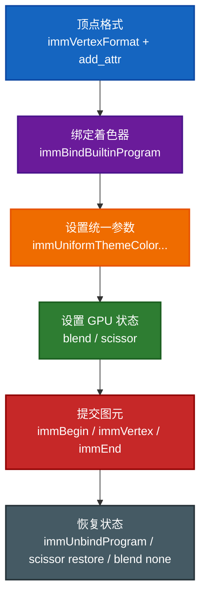
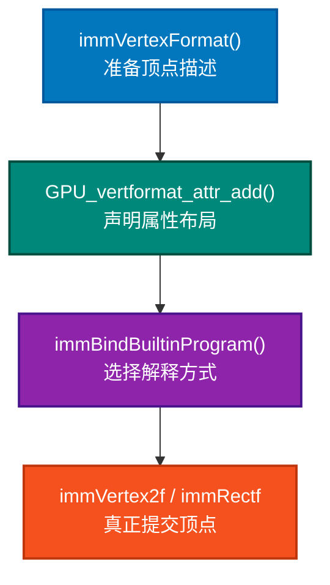
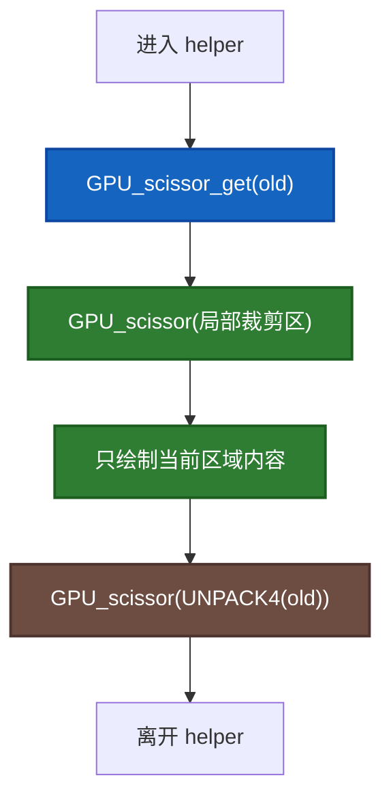
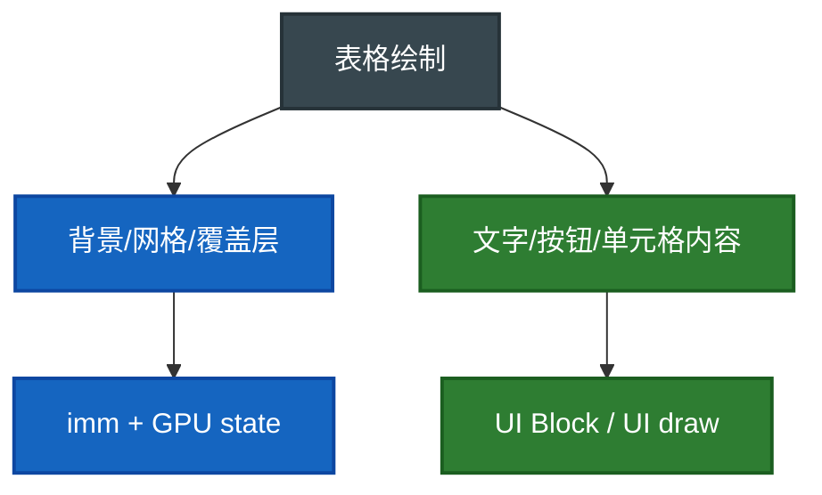

# `spreadsheet_draw.cc` 里的 GPU / imm / scissor / blend 搭配模式

这份文档专门回答一个非常关键的问题：

> Blender 里这些绘制 API 为什么总是要成组搭配使用，而不是零散地随便调？

重点分析：

- [spreadsheet_draw.cc](E:/blender-git/blender/source/blender/editors/space_spreadsheet/spreadsheet_draw.cc)
- [GPU_immediate.hh](E:/blender-git/blender/source/blender/gpu/GPU_immediate.hh)
- [GPU_immediate_util.hh](E:/blender-git/blender/source/blender/gpu/GPU_immediate_util.hh)
- [GPU_state.hh](E:/blender-git/blender/source/blender/gpu/GPU_state.hh)

尤其是你点名的这些调用：

```cpp
GPUVertFormat *format = immVertexFormat();
uint pos = GPU_vertformat_attr_add(format, "pos", gpu::VertAttrType::SFLOAT_32_32);
immBindBuiltinProgram(GPU_SHADER_3D_UNIFORM_COLOR);
immUnbindProgram();

immUniformThemeColorShade(TH_BACK, -11);
immBeginAtMost(GPU_PRIM_LINES, drawer.tot_columns * 2 + 4);
immEnd();

GPU_scissor_get(old_scissor);
GPU_scissor(...);
GPU_scissor(UNPACK4(old_scissor));

immUniformThemeColorShadeAlpha(TH_BACK, -20, -128);
GPU_blend(GPU_BLEND_ALPHA);
immRectf(pos, rect.xmin, rect.ymin, rect.xmax, rect.ymax);
GPU_blend(GPU_BLEND_NONE);
```

---

## 1. 先给你一个总图

这套代码本质上是在做四件事：

1. 描述顶点长什么样
2. 绑定一个能理解这些顶点的 shader
3. 设置这次绘制要用的 GPU 状态
4. 发出几何图元并绘制



你可以把它理解成一条固定模板：

> 先告诉 GPU “我要喂什么数据”，再告诉它“你用哪个程序处理”，然后再说“颜色、裁剪、混合怎么配”，最后才真的画。

如果顺序乱了，最常见的问题就是：

- 颜色不对
- 顶点解释错位
- 超出区域乱画
- 半透明效果不对
- 后续绘制被前面的状态污染

---

## 2. 为什么是 `immVertexFormat -> add_attr -> bind program`

先看这三句：

```cpp
GPUVertFormat *format = immVertexFormat();
uint pos = GPU_vertformat_attr_add(format, "pos", gpu::VertAttrType::SFLOAT_32_32);
immBindBuiltinProgram(GPU_SHADER_3D_UNIFORM_COLOR);
```

### 2.1 `immVertexFormat()` 在干什么

它返回一个“正在准备中的顶点格式对象”。

这个对象描述的不是“画什么”，而是：

> 每个顶点由哪些属性组成。

比如一个顶点可以有：

- 位置 `pos`
- 颜色 `color`
- 法线 `normal`
- 纹理坐标 `uv`

而这里的表格背景线框、矩形块，大多数只需要二维位置，所以这里只声明一个属性：

- `"pos"`：二维浮点坐标

### 2.2 为什么 `GPU_vertformat_attr_add(...)` 必须在前面

因为后面的 `immVertex2f(pos, x, y)` 需要一个“属性槽 id”。

这里的 `pos` 不是坐标值，它是：

> “顶点中的位置属性”在当前 format 里的编号。

于是后面才能这样写：

```cpp
immVertex2f(pos, x, y);
```

意思是：

> 往这个顶点的 `pos` 属性里写一个 2D 坐标。

### 2.3 为什么还要 `immBindBuiltinProgram`

因为只有“顶点长什么样”还不够，GPU 还需要知道：

> 用哪个 shader 来解释这些顶点，并输出最终像素。

`GPU_SHADER_3D_UNIFORM_COLOR` 的含义非常适合这里：

- 顶点有位置
- 颜色不是每个顶点单独带，而是整次 draw call 共用一个 uniform color

这正好对应 `spreadsheet_draw.cc` 的用途：

- 画背景矩形
- 画分隔线
- 画半透明遮罩

这些东西通常是一整批图元共用同一种颜色，不需要每个顶点单独携带颜色属性。

### 2.4 为什么这三句经常一起出现

因为它们分别负责三个层面：

- `immVertexFormat()`：数据结构
- `GPU_vertformat_attr_add()`：字段定义
- `immBindBuiltinProgram()`：执行程序

少一个都不完整。



---

## 3. 为什么 `immBindBuiltinProgram(...)` 后面要 `immUnbindProgram()`

`immBindBuiltinProgram(...)` 可以理解为：

> 当前立即模式绘制阶段，我把这个 shader 设为“活动程序”。

但 GPU 状态是全局状态机风格的，不是局部变量风格的。

这意味着如果你不解绑：

- 后面的绘制代码可能继续沿用这个 shader
- 其他绘制路径可能假设“当前没有 imm shader 绑定”
- 混合 immediate-mode 和 batch drawing 时更容易出错

所以 `immUnbindProgram()` 的设计目的不是“形式上收尾”，而是：

> 显式结束这一段 immediate-mode 绘制会话，避免把状态泄漏给后续代码。

在 [GPU_immediate.hh](E:/blender-git/blender/source/blender/gpu/GPU_immediate.hh) 里也有很直接的提示：

- `immBegin` 之前必须先绑定 program
- 最后一次 `immEnd` 之后应该 `immUnbindProgram`

这背后的工程思想是：

> 谁打开状态，谁负责关闭状态。

---

## 4. 为什么 `immUniformThemeColor...` 和 `GPU_SHADER_3D_UNIFORM_COLOR` 特别适合一起用

看这类调用：

```cpp
immUniformThemeColorShade(TH_BACK, -11);
immUniformThemeColorShadeAlpha(TH_BACK, -20, -128);
```

### 4.1 uniform color 的含义

这里用的是 `GPU_SHADER_3D_UNIFORM_COLOR`。

这个 shader 期待的是：

- 顶点提供位置
- 颜色由 uniform 给出

所以 `immUniformThemeColor...` 本质上是在设置：

> 这一次绘制批次统一使用什么颜色。

### 4.2 为什么不用每顶点颜色

因为这里画的是：

- 大背景
- 横竖分隔线
- 半透明高亮层

它们的颜色通常是整块统一的，不需要：

- 每个点不同色
- 顶点渐变
- 复杂材质

用 uniform color 有几个优点：

1. 顶点格式更简单
2. CPU 提交的数据更少
3. 代码更清楚
4. 更符合 UI 绘制“整块一色”的需求

### 4.3 为什么要从 Theme 取色

因为 Blender UI 颜色不是写死常量，而是主题驱动的。

所以这里不直接传 `RGBA(0.2, 0.2, 0.2, 1.0)`，而是传：

- `TH_BACK`
- 再加 shade 偏移
- 或 alpha 偏移

这让表格绘制自动跟随：

- 用户主题
- 深浅背景
- UI 统一视觉语言

所以：

> `GPU_SHADER_3D_UNIFORM_COLOR` 负责“统一颜色的 shader 机制”，`immUniformThemeColor...` 负责“这次统一颜色取什么值”。

---

## 4.5 `imm` 到底是什么

这是第一次看 Blender GPU 代码时最该先搞懂的问题。

`imm` 是 `immediate` 的缩写。

它来自“immediate mode”这个老概念，你可以先粗略理解成：

> 一边写代码，一边按当前批次把图元提交出去的一种绘制风格。

老 OpenGL 时代常见的写法是：

```cpp
glBegin(GL_LINES);
glVertex(...);
glVertex(...);
glEnd();
```

Blender 现在当然不是直接用老 OpenGL 的 API 了，但保留了一个“风格上像 immediate mode”的封装层，所以你会看到：

```cpp
immBegin(...);
immVertex2f(...);
immEnd();
```

而且 [gpu_immediate.cc](E:/blender-git/blender/source/blender/gpu/intern/gpu_immediate.cc) 的文件头就直接写了：

> Mimics old style opengl immediate mode drawing.

所以这里的 `imm` 不是神秘名词，就是：

> Blender 对“老式立即模式绘制习惯”的现代封装。

### 4.5.1 为什么 Blender 还保留这种风格

因为编辑器 UI 绘制里经常会出现很多“小而临时”的几何：

- 一条线
- 一个背景块
- 一个 overlay
- 一个拖拽提示区域

这类东西如果每次都走更完整、更偏底层的 batch 构建流程，代码会很重。

所以 `imm` 的优势是：

1. 写简单几何很顺手
2. 小批量绘制可读性高
3. 很适合编辑器和调试辅助图元

### 4.5.2 `imm` 不是“每写一个点就立刻出现在屏幕上”

这个名字容易让人误会，好像 `immVertex2f()` 一调用就真的马上画出来。

更准确地说，它是：

> 以 immediate-mode 风格组织代码，但内部仍然会把这一批顶点整理后再提交给现代 GPU 管线。

所以你可以记成：

- 写法像 old-school immediate mode
- 实现仍然是现代 GPU 封装

---

## 4.6 为什么这些命名看起来这么奇怪

比如：

- `immVertexFormat`
- `GPU_vertformat_attr_add`
- `GPU_PRIM_LINES`
- `GPU_SHADER_3D_UNIFORM_COLOR`

看起来像是几套风格混在一起：

- 有驼峰
- 有下划线
- 有全大写枚举
- 有 `GPU_` 前缀
- 有 `imm` 前缀

你的不习惯很正常，因为它确实不是一套“从零统一设计”的现代小库命名风格。

### 4.6.1 原因 1：这层 API 很接近底层图形接口风格

Blender 的 GPU 模块保留了比较强的 C 风格和图形 API 风格：

- `GPU_*` 常常表示 GPU 模块公共接口
- `GPU_PRIM_*` 表示图元类型
- `GPU_SHADER_*` 表示内建 shader
- `imm*` 表示 immediate-mode 这一组 helper

所以这套命名更像“底层渲染接口”，而不是“业务层 C++ 对象库”。

### 4.6.2 原因 2：它带着 Blender 多年演化的历史痕迹

Blender 是大型老项目，这层代码里同时叠着几种风格：

1. 传统 C 风格 API
2. 图形库常量命名风格
3. Blender 自己的前缀习惯
4. 新一些的 C++ namespace 和类型系统

所以你感受到的“怪”，本质上是多年演化留下来的混合风格。

### 4.6.3 怎么快速适应

不要按“语法形式”记，而是按“模块职责”记：

- `GPU_*`：GPU 模块状态、枚举、底层函数
- `imm*`：immediate-mode 风格 helper
- `GPU_PRIM_*`：图元拓扑
- `GPU_SHADER_*`：内建 shader 类别

这样一分层，就没那么乱了。

---

## 4.7 为什么用字符串硬编码 `"pos"`

这句第一次看很容易让人皱眉：

```cpp
uint pos = GPU_vertformat_attr_add(format, "pos", gpu::VertAttrType::SFLOAT_32_32);
```

你会很自然地问：

> 为什么不用枚举？为什么不用强类型字段？为什么用字符串 `"pos"`？

### 4.7.1 这里的 `"pos"` 本质上是 shader attribute 名

这个字符串不是随便起的，它表示：

> 当前声明的顶点属性，在 shader 输入侧对应的名字叫 `pos`。

它主要是给“顶点格式和 shader 输入怎么匹配”这件事服务的。

### 4.7.2 为什么这里用字符串反而合理

因为 shader 世界天然就是“按名字对属性”的。

你可以把它理解成一个协议：

- C++ 这边说：我声明一个属性，名字叫 `"pos"`
- shader 那边也期待一个名为 `pos` 的输入
- 于是两边匹配起来

如果改成枚举，最后往往还是得映射回 shader 里真实的名字。

### 4.7.3 它算不算“魔法字符串”

形式上像，但语义上不太一样。

这里的 `"pos"`、`"color"`、`"uv"` 这类名字，不是业务逻辑里的随意字符串，而是：

> 图形接口里非常稳定的属性名约定。

所以它更像 shader 接口字段名，而不是散落在业务里的 magic string。

### 4.7.4 它的缺点是什么

缺点也确实有：

- 拼错名字时，编译器不一定能直接帮你抓出来
- 编译期保护不如强类型字段

但在这层 GPU API 里，这种按 attribute 名来声明的方式很常见，也比较实用。

---

## 5. 为什么 `immBeginAtMost(...)` 和 `immEnd()` 必须成对

看这一段：

```cpp
immBeginAtMost(GPU_PRIM_LINES, drawer.tot_columns * 2 + 4);
...
immEnd();
```

### 5.1 `immBeginAtMost` 是什么

它的意思是：

> 我要开始提交一批图元，类型是 `GPU_PRIM_LINES`，最多会提交这么多个顶点。

这里是 “AtMost”，不是“Exactly”。

原因是列分隔线数量依赖：

- 当前列数
- 当前滚动位置
- 哪些线实际在可见范围内

所以先给一个最大上限，再在循环里按需要发顶点，更灵活。

### 5.2 为什么 `GPU_PRIM_LINES`

因为分隔线不是矩形填充，而是一条条独立线段。

对于 `GPU_PRIM_LINES`：

- 两个顶点组成一条线
- 再两个顶点组成下一条线

所以你会看到：

```cpp
immVertex2f(pos, x1, y1);
immVertex2f(pos, x2, y2);
```

一对就是一条线。

### 5.3 为什么必须 `immEnd()`

因为 `immBegin...()` 只是“开始录入顶点”。

真正的结束语义是：

1. 顶点提交完成
2. 把本批次图元收口
3. 触发实际 draw

不 `immEnd()`，这批图元就不完整。

### 5.4 这套 begin/end 模式为什么好

因为它把“构建一批图元”的边界写得很清楚：

- 从哪开始
- 中间提交多少顶点
- 到哪结束

这对于 UI 绘制尤其重要，因为 UI 经常是很多小批次：

- 一批背景
- 一批线条
- 一批覆盖层

每一批都需要一个明确边界。

---

## 5.5 为什么绘制竖线这里用了 `immBeginAtMost(GPU_PRIM_LINES, ...)`，而绘制别的地方没用

这是个特别好的问题，因为它能帮你分清楚：

- 这里画的到底是什么几何
- 哪些 helper 已经帮你封装了 begin/end

先看分隔线：

```cpp
immBeginAtMost(GPU_PRIM_LINES, drawer.tot_columns * 2 + 4);
...
immVertex2f(pos, ...);
immVertex2f(pos, ...);
...
immEnd();
```

而背景块经常是：

```cpp
immRectf(pos, x1, y1, x2, y2);
```

### 5.5.1 因为 `immRectf()` 已经把 begin/end 封装掉了

在 [gpu_immediate_util.cc](E:/blender-git/blender/source/blender/gpu/intern/gpu_immediate_util.cc) 里能直接看到：

```cpp
void immRectf(...)
{
  immBegin(GPU_PRIM_TRI_FAN, 4);
  ...
  immEnd();
}
```

也就是说：

> 矩形不是“不需要 begin/end”，而是 helper 已经替你写好了。

### 5.5.2 但分隔线这里不是“一个固定图元”，而是“一批数量动态的独立线段”

`draw_separator_lines()` 要画的是：

- 左索引列竖线
- 表头横线
- 每一列的分隔竖线

这不是一个固定形状，而是一批由循环决定数量的线段集合。

所以最自然的写法就是：

1. 自己 `immBeginAtMost(...)`
2. 在循环里不断 `immVertex2f(...)`
3. 最后 `immEnd()`

### 5.5.3 为什么用 `GPU_PRIM_LINES`

因为这里想表达的几何本来就是“线”。

对于 `GPU_PRIM_LINES`：

- 两个点就是一条独立线段
- 再两个点就是下一条

这跟分隔线的语义完全一致。

如果改成拿细长矩形去拼，也不是不行，但：

- 顶点更多
- 语义没那么直白
- 线的行为也不再是标准 line primitive

### 5.5.4 为什么这里还是 `AtMost`

因为它不是保证“正好会提交这么多顶点”，而是：

> 最多会用到这么多顶点。

这很适合当前场景，因为列分隔线里有些线可能由于可见性判断而不真的提交。

所以这里的 `AtMost` 本质上是在说：

- 我先报一个安全上限
- 实际顶点数可以小于它

### 5.5.5 一句话总结

矩形之所以看起来没写 `immBegin/immEnd`，不是因为矩形特殊，而是因为：

> `immRectf()` 已经内部帮你封装了 begin/end；而分隔线是“数量动态的一批独立线段”，没有一个更高层 helper 正好包住，所以这里就直接自己组织这一批 `GPU_PRIM_LINES`。

---

## 6. 为什么 `immRectf()` 看起来简单，但其实依赖前面的状态

看这句：

```cpp
immRectf(pos, rect.xmin, rect.ymin, rect.xmax, rect.ymax);
```

它看起来像“一句就画矩形”，但注意 [GPU_immediate_util.hh](E:/blender-git/blender/source/blender/gpu/GPU_immediate_util.hh) 里的说明：

> caller is responsible for vertex format & shader

也就是说 `immRectf()` 并不是一个“自带一切状态”的万能函数。

它只是一个便捷工具，帮你快速提交组成矩形的顶点。

它依赖你事先已经准备好：

- 顶点格式
- `pos` 属性 id
- 当前绑定 shader
- 当前 uniform color
- 当前 blend/scissor 等状态

所以 `immRectf()` 的真正角色不是“完整绘制系统”，而是：

> 在一个已经准备好的 immediate-mode 环境里，快速发出一个矩形。

这也是 Blender 这套 API 的常见设计思路：

- 底层状态由调用者掌控
- 高频几何图元提供便捷函数

这样比“一次函数全包”更灵活。

---

## 7. 为什么 `GPU_scissor_get -> GPU_scissor -> 恢复` 要成组出现

看这种模式：

```cpp
int old_scissor[4];
GPU_scissor_get(old_scissor);

GPU_scissor(...);
...
GPU_scissor(UNPACK4(old_scissor));
```

### 7.1 scissor 是什么

scissor 可以理解成一个“矩形裁剪窗口”。

启用后，只有这个矩形范围内的像素允许写入。

在表格里它主要用来解决：

- 左侧索引列内容不能画到右边
- 表头内容不能画到数据区外
- 数据单元格不能越过滚动区域

### 7.2 为什么不能直接设置了就不管

因为 scissor 也是 GPU 全局状态。

如果你在 `draw_left_column_content()` 里设置了裁剪框，不恢复的话，后面的：

- 顶部表头
- 内容区
- 重排覆盖层
- 滚动条

都可能被错误裁剪。

### 7.3 为什么先 `get` 再恢复，而不是写死一个默认值

因为当前调用点未必知道外层之前设置了什么 scissor。

可能调用链更上层已经配置了一个更大的裁剪窗口，或者 region draw 本来就在特定裁剪环境下。

所以正确做法不是：

- “我用完后恢复成某个我猜的默认值”

而是：

- “先保存进入前状态，结束时原样恢复”

这和 C++ 里保存旧值再恢复的思路完全一致。

### 7.4 这体现了什么思想

这是非常典型的状态作用域控制：

> 临时修改全局状态，但把影响范围压缩在一个局部绘制阶段里。



---

## 7.5 为什么不是每次都初始化成默认 scissor，而是保存旧状态再恢复

这正是 GPU 状态机最反直觉、但也最重要的点之一。

你看到这段会不习惯：

```cpp
int old_scissor[4];
GPU_scissor_get(old_scissor);
GPU_scissor(...);
...
GPU_scissor(UNPACK4(old_scissor));
```

你的直觉可能是：

> 为什么不在进入 helper 时直接清成默认值，用完再清空？

这个想法在普通局部业务代码里很自然，但在 GPU 全局状态里通常不对。

### 7.5.1 因为当前 helper 根本不知道“默认值”应该是什么

它只知道：

- 自己要临时改 scissor

但它不知道：

- 外层是不是已经设置了某个更大的 scissor
- 当前 frame-buffer 是否处在某种特定裁剪环境
- 后面的调用者是否依赖进入前的状态

所以对它来说，最可靠的“默认值”不是某个硬编码矩形，而是：

> 进入前的真实旧状态。

### 7.5.2 这是一种“局部改动、原样恢复”的纪律

它和下面这种普通代码习惯很像：

1. 先保存旧值
2. 临时修改
3. 用完恢复

目标不是“回到我猜的默认值”，而是：

> 回到调用我之前的真实现场。

### 7.5.3 为什么这比“统一清默认状态”更好

因为如果每个 helper 都假设自己能决定默认状态，就会出现两个问题：

1. 偷偷覆盖外层已经建立好的渲染上下文
2. 不同 helper 之间互相打架，谁都想定义“默认状态”

而保存并恢复旧状态的好处是：

- helper 更独立
- 可以被嵌套调用
- 可以安全复用到更大绘制流程中

### 7.5.4 为什么这里不用 RAII 包一层

理论上完全可以做成“构造时保存、析构时恢复”的对象。

但 Blender 这层 GPU API 历史上更偏：

- C 风格
- 显式步骤式状态控制
- 接近底层渲染接口的书写方式

所以你现在看到的是很直接的：

```cpp
get
set
draw
restore
```

它不一定最优雅，但有一个明显优点：

> 状态生命周期写在明面上，一眼就能看到从哪里开始、到哪里结束。

### 7.5.5 这其实是最值得养成的 GPU 习惯之一

你现在的不习惯感，恰恰说明你已经碰到了 GPU 编程的核心差异：

- 它的状态很多是全局的
- 它们会持续生效
- 它们不会自动回滚

所以必须非常主动地管理。

---

## 8. 为什么 `GPU_blend(GPU_BLEND_ALPHA)` 和 `GPU_BLEND_NONE` 要成对

看这段：

```cpp
immUniformThemeColorShadeAlpha(TH_BACK, -20, -128);
GPU_blend(GPU_BLEND_ALPHA);
immRectf(pos, rect.xmin, rect.ymin, rect.xmax, rect.ymax);
GPU_blend(GPU_BLEND_NONE);
```

### 8.1 blend 在解决什么问题

你设置了 alpha，不等于 GPU 就自动按透明度混合。

真正决定“源像素和目标像素怎么合成”的，是 blend state。

`GPU_BLEND_ALPHA` 代表常见的 alpha 混合模式：

> 按透明度把新颜色叠到已有背景上。

所以这里才会先：

1. 设置一个带 alpha 的颜色
2. 打开 alpha blending
3. 画矩形

### 8.2 为什么画完要恢复 `GPU_BLEND_NONE`

因为不是所有后续绘制都需要透明混合。

如果保持 alpha blend 开着，后面的很多普通实心绘制也会变成混合写入，导致：

- 颜色发灰
- 重复叠色
- 性能与结果都不稳定

所以这里的搭配不是“习惯写法”，而是逻辑上必须：

> 半透明绘制前打开混合，画完立即关掉。

### 8.3 为什么 `immUniformThemeColorShadeAlpha` 和 `GPU_BLEND_ALPHA` 经常一起出现

因为它们分别控制不同层面：

- `immUniformThemeColorShadeAlpha`：输出颜色里有 alpha
- `GPU_BLEND_ALPHA`：framebuffer 如何使用这个 alpha

只有两个都在，半透明效果才完整成立。

如果只有 alpha 颜色，没有 blend：

- 结果可能像“不透明写入”

如果只有 blend，没有 alpha：

- 结果可能没有明显透明效果

---

## 9. `spreadsheet_draw.cc` 为什么会混用 imm 绘制和 UI block 绘制

这是理解整个文件的关键。

文件里其实有两类绘制：

### 9.1 一类是“纯几何背景层”

比如：

- 背景矩形
- 交替行底色
- 分隔线
- 拖拽列时的半透明遮罩

这些东西的特点是：

- 简单几何
- 没有复杂文字布局
- 不需要按钮行为
- 用 immediate mode 很轻

所以用：

- `immRectf`
- `immBeginAtMost`
- `immVertex2f`

### 9.2 另一类是“内容层”

比如：

- 左侧索引文本
- 表头列名
- 单元格内容

这些东西通常涉及：

- 文本测量
- UI block
- widget 风格
- theme 字体/内边距

所以用：

- `block_begin`
- `drawer.draw_*_cell(...)`
- `block_end`
- `block_draw`

### 9.3 为什么要混用

因为这两类任务最适合的工具不同：

- 几何底图适合直接 GPU 立即绘制
- 文本和控件适合 UI 系统

如果全都塞进 UI block：

- 简单背景会显得重
- 不容易做批量线条与矩形

如果全都自己用 GPU 手写：

- 文本与控件会非常麻烦

这就是一个很经典的分层：

> 背景层走轻量 GPU，内容层走 UI 系统。



---

## 10. 把你点名的几个片段逐条翻译成人话

### 10.1 顶点格式 + shader

```cpp
GPUVertFormat *format = immVertexFormat();
uint pos = GPU_vertformat_attr_add(format, "pos", gpu::VertAttrType::SFLOAT_32_32);
immBindBuiltinProgram(GPU_SHADER_3D_UNIFORM_COLOR);
```

人话版：

> 我要开始画一批简单 2D 几何了。每个顶点只带一个二维位置属性，接下来都交给“统一颜色 shader”处理。

### 10.2 画分隔线

```cpp
immUniformThemeColorShade(TH_BACK, -11);
immBeginAtMost(GPU_PRIM_LINES, drawer.tot_columns * 2 + 4);
...
immEnd();
```

人话版：

> 这一批我要画线，颜色是主题背景色稍微压暗一点。先声明“最多要画这么多顶点的线段”，然后逐条喂顶点，最后一次性结束并提交。

### 10.3 局部裁剪

```cpp
GPU_scissor_get(old_scissor);
GPU_scissor(0, 0, drawer.left_column_width, region->winy - drawer.top_row_height);
...
GPU_scissor(UNPACK4(old_scissor));
```

人话版：

> 我现在只允许左边索引列这个矩形里真正落笔，先把旧裁剪窗口记下来，画完以后恢复现场。

### 10.4 半透明遮罩

```cpp
immUniformThemeColorShadeAlpha(TH_BACK, -20, -128);
GPU_blend(GPU_BLEND_ALPHA);
immRectf(pos, rect.xmin, rect.ymin, rect.xmax, rect.ymax);
GPU_blend(GPU_BLEND_NONE);
```

人话版：

> 我要画一个比背景更暗、而且半透明的遮罩。先设置带透明度的颜色，再打开 alpha 混合，画完矩形后立刻关闭混合，防止影响后面的绘制。

---

## 11. 这套搭配背后的几个大思想

### 11.1 immediate mode 不是“简单”，而是“边界清晰”

`immBegin/immEnd` 让你能清楚知道：

- 这一批图元从哪开始
- 用什么 shader
- 用什么颜色
- 在什么状态下画

对于 UI 这种大量小批次绘制，这是非常重要的。

### 11.2 GPU 是状态机，所以一定要养成“开了就关、改了就还原”的习惯

`spreadsheet_draw.cc` 非常适合拿来学这个习惯，因为里面反复出现：

- bind / unbind
- set / restore
- enable / disable

这不是样板代码，而是 GPU 编程最核心的纪律之一。

### 11.3 几何绘制和内容绘制应该分层

Blender 这里没有用一个万能系统包办所有绘制，而是按问题类型拆分：

- 简单几何走 imm
- 内容和文字走 UI block

这是很成熟的工程选择。

### 11.4 统一主题色比写死颜色更适合编辑器 UI

编辑器不是 demo，不是一次性页面。

Blender 这种长期维护的大型项目，需要：

- 可换主题
- 整体视觉一致
- 各面板风格统一

所以 `TH_BACK`、`TH_TEXT` 这种 theme id 才是长期正确的做法。

---

## 11.5 这里还可以顺手注意的几个“第一次看会别扭”的点

除了你已经提到的几个，我再补几个特别值得提前建立心智模型的点。

### 11.5.1 为什么明明是 2D UI，却经常看到 `3D` shader 名

比如：

```cpp
GPU_SHADER_3D_UNIFORM_COLOR
```

这不代表它只能给 3D 场景用，而更多是在说：

- 这是某一类内建 shader 的命名家族
- 它支持位置输入、矩阵、统一颜色

在 UI 场景里照样可以拿来画 2D 几何。

所以这里的 `3D` 不要机械理解成“只能三维”。

### 11.5.2 为什么很多 helper 不主动把所有状态都设一遍

因为不是每段绘制都需要完整重配所有状态。

状态设置本身也有成本，也会增加阅读噪音。

所以更常见的策略是：

- 只设置当前这段真正依赖的状态
- 对容易污染别人的状态做恢复

这是一种“最小必要状态修改”的思路。

### 11.5.3 为什么 `imm` 这套 API 看起来不像现代渲染引擎接口

因为它主要不是给大规模高吞吐场景绘制设计的，而是给：

- 编辑器辅助绘制
- UI 几何
- 调试可视化

设计的。

所以它更重视：

- 写起来顺手
- 小批量图元方便
- 和 Blender 现有 UI/GPU 系统易于衔接

### 11.5.4 为什么会觉得这一层“半 C 半 C++”

因为它确实是。

你会同时看到：

- `namespace blender`
- C++ 类型和引用
- C 风格前缀函数
- 大量枚举常量

这不是偶然，而是 Blender 作为长期演化的大型工程自然形成的混合风格。

最好的适应方式不是把它脑补成某个现代框架，而是接受：

> 这是一个长期维护的大工程在不同层次上混合出来的风格。

---

## 12. 你可以把这些 API 记成 5 个“固定配方”

### 配方 1：准备立即模式绘制

```cpp
GPUVertFormat *format = immVertexFormat();
uint pos = GPU_vertformat_attr_add(format, "pos", gpu::VertAttrType::SFLOAT_32_32);
immBindBuiltinProgram(GPU_SHADER_3D_UNIFORM_COLOR);
```

适用场景：

- 要画简单线条、矩形、overlay

### 配方 2：画一批统一颜色的线

```cpp
immUniformThemeColorShade(...);
immBeginAtMost(GPU_PRIM_LINES, ...);
immVertex2f(pos, ...);
immVertex2f(pos, ...);
immEnd();
```

适用场景：

- 分隔线
- 边框
- 参考线

### 配方 3：画一个统一颜色的实心矩形

```cpp
immUniformThemeColorShade(...);
immRectf(pos, x1, y1, x2, y2);
```

适用场景：

- 背景块
- 表头底色

### 配方 4：画一个半透明遮罩

```cpp
immUniformThemeColorShadeAlpha(...);
GPU_blend(GPU_BLEND_ALPHA);
immRectf(pos, ...);
GPU_blend(GPU_BLEND_NONE);
```

适用场景：

- hover
- 拖拽预览
- 禁用区域蒙层

### 配方 5：限制绘制区域

```cpp
GPU_scissor_get(old_scissor);
GPU_scissor(...);
...
GPU_scissor(UNPACK4(old_scissor));
```

适用场景：

- 只画某个子区域
- 滚动区裁剪
- 表头/左列/内容区分离

---

## 13. 学这一段代码，你最值得吸收什么

如果你的目标不是只看懂这一个文件，而是提高 Blender 代码阅读能力，那这份代码非常值得学，因为它同时训练你三件事：

1. 学会区分“数据对象、绘制接口、绘制流程”
2. 学会识别 GPU 状态的生命周期
3. 学会把复杂 UI 绘制拆成背景层、内容层、交互层

你以后再看别的编辑器代码时，就会更容易识别：

- 哪些函数是在准备绘制数据
- 哪些函数是在切 GPU 状态
- 哪些函数是在真正提交图元
- 哪些函数是在做 UI 文本/控件层

---

## 14. 建议的阅读顺序

如果你想把这一块真正吃透，我建议按下面顺序读：

1. [spreadsheet_draw.cc](E:/blender-git/blender/source/blender/editors/space_spreadsheet/spreadsheet_draw.cc)
2. [spreadsheet_draw.hh](E:/blender-git/blender/source/blender/editors/space_spreadsheet/spreadsheet_draw.hh)
3. [GPU_immediate.hh](E:/blender-git/blender/source/blender/gpu/GPU_immediate.hh)
4. [GPU_immediate_util.hh](E:/blender-git/blender/source/blender/gpu/GPU_immediate_util.hh)
5. [GPU_state.hh](E:/blender-git/blender/source/blender/gpu/GPU_state.hh)
6. [10-draw_spreadsheet_in_region详解篇.md](E:/blender-git/blender/.markdown/space_spreadsheet/10-draw_spreadsheet_in_region详解篇.md)

推荐你带着 3 个问题去读：

1. 这是在设置“数据格式”、还是设置“绘制状态”、还是“发图元”？
2. 这个状态是局部的还是全局的，谁负责恢复？
3. 这段逻辑属于背景层、内容层，还是交互覆盖层？

---

## 15. 一句话总结

`spreadsheet_draw.cc` 这套 API 搭配的核心，不是“Blender 恰好这么写”，而是：

> immediate mode 负责轻量提交几何，theme uniform 负责统一颜色，blend/scissor 负责控制像素写入规则，而 bind/unbind、save/restore 则负责把 GPU 这个全局状态机约束在一个安全的局部作用域里。
