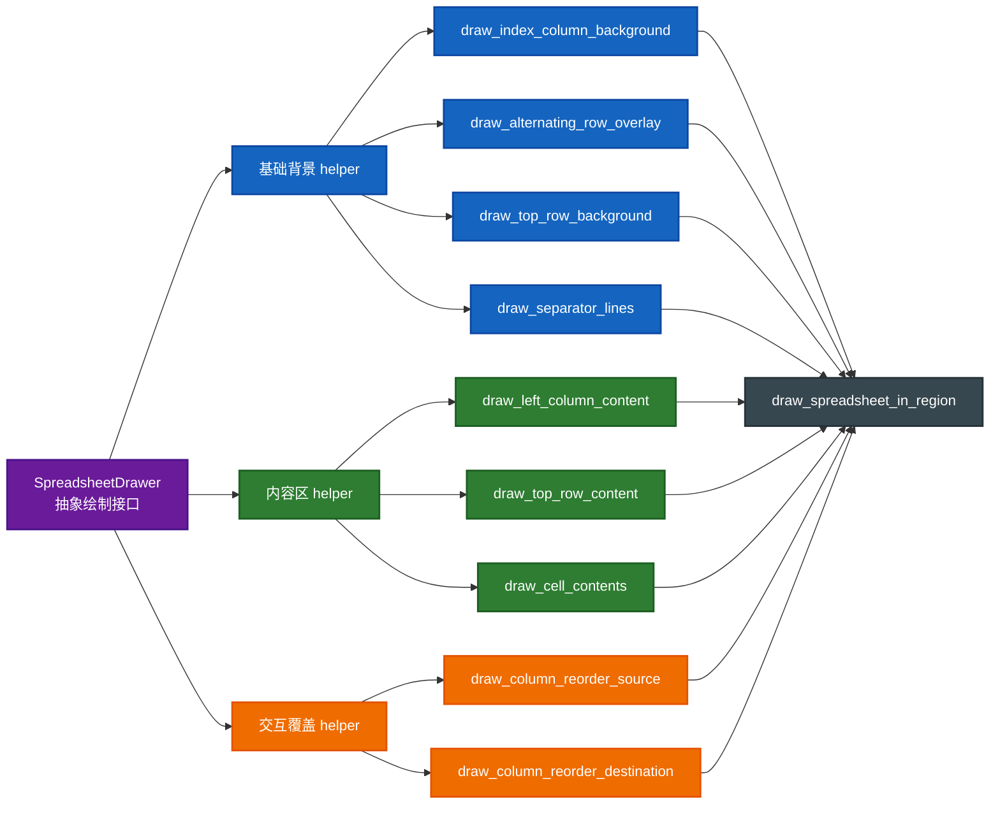
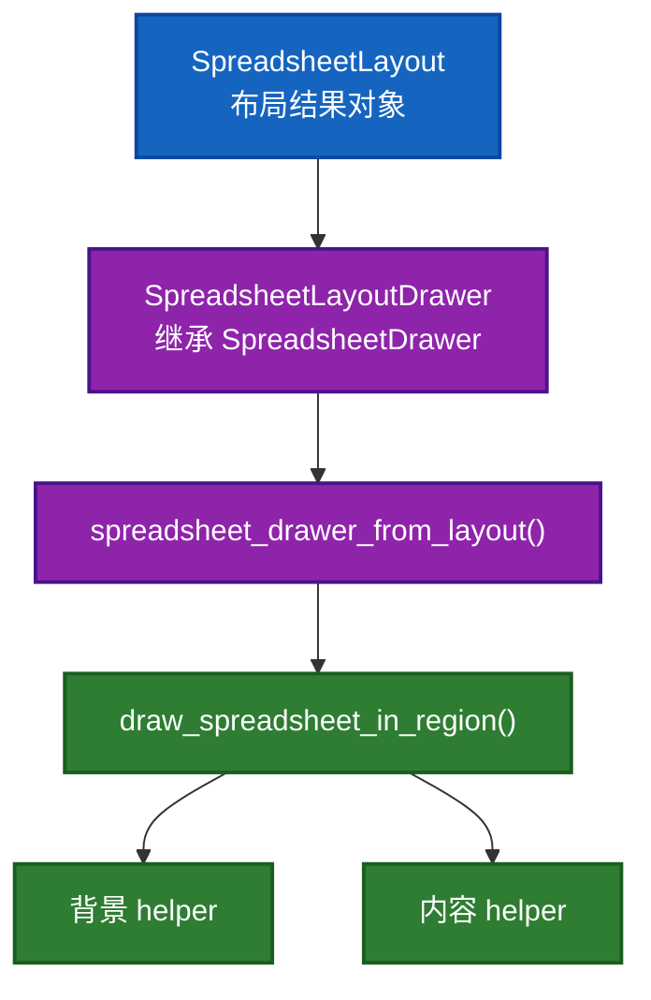
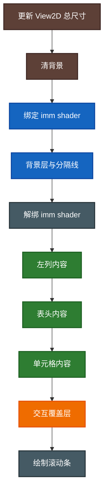

# `spreadsheet_draw.cc` 文件级绘制导读

这份文档从“整个文件是怎么分工的”来讲 [spreadsheet_draw.cc](E:/blender-git/blender/source/blender/editors/space_spreadsheet/spreadsheet_draw.cc)，适合和：

- [10-draw_spreadsheet_in_region详解篇.md](E:/blender-git/blender/.markdown/space_spreadsheet/10-draw_spreadsheet_in_region详解篇.md)
- [11-spreadsheet_draw的GPU状态与imm.md](E:/blender-git/blender/.markdown/space_spreadsheet/11-spreadsheet_draw的GPU状态与imm.md)

配套阅读。

---

## 1. 文件里有哪些层次

这个文件不是“杂乱地塞很多 draw helper”，而是很清楚地分成 4 层：



一句话理解：

- `SpreadsheetDrawer` 定义“单元格该怎么画”
- 各种 helper 定义“表格不同区域怎么组织绘制”
- `draw_spreadsheet_in_region()` 负责总调度

---

## 2. 文件开头的 `SpreadsheetDrawer` 为什么很空

文件最开始定义了：

- 构造函数
- 析构函数
- `draw_top_row_cell`
- `draw_left_column_cell`
- `draw_content_cell`
- `column_width`

而且默认实现几乎什么都没做。

这不是“没写完”，而是有意把它做成一套抽象协议。

它表达的是：

> 通用表格绘制器只知道“我会向你要列宽、要你画表头、画左列、画内容格”，但它不关心具体数据来自哪里。

所以这个文件的真正设计重心不是某个具体表格，而是：

> 一套通用的表格区域绘制骨架。

---

## 2.5 结合 `SpreadsheetLayoutDrawer` 看，这种设计到底好不好

如果只看 [spreadsheet_draw.hh](E:/blender-git/blender/source/blender/editors/space_spreadsheet/spreadsheet_draw.hh)，你会觉得：

- `SpreadsheetDrawer` 很抽象
- 默认实现很空
- 好像“真正有内容的代码”不在这里

这时候必须把视角再接到 [spreadsheet_layout.cc:79](E:/blender-git/blender/source/blender/editors/space_spreadsheet/spreadsheet_layout.cc#L79) 的 `SpreadsheetLayoutDrawer`，以及 [spreadsheet_layout.cc:805](E:/blender-git/blender/source/blender/editors/space_spreadsheet/spreadsheet_layout.cc#L805) 的 `spreadsheet_drawer_from_layout()`。

真正的关系是：



也就是说：

> `spreadsheet_draw.cc` 并不直接认识 `SpreadsheetLayout`，它只认识一个统一的绘制协议 `SpreadsheetDrawer`；而 `SpreadsheetLayoutDrawer` 这个子类负责把具体 layout 适配成这套协议。

这其实是“继承 + 适配”的组合。

### 2.5.1 这套做法的优点

#### 优点 1：`spreadsheet_draw.cc` 可以只关心绘制骨架

`draw_spreadsheet_in_region()` 不需要知道：

- layout 里列是怎么存的
- 行索引为什么是 `row_indices`
- 单元格值怎么从 `ColumnValues` 里取出来

它只需要调用：

- `column_width()`
- `draw_top_row_cell()`
- `draw_left_column_cell()`
- `draw_content_cell()`

这让 [spreadsheet_draw.cc](E:/blender-git/blender/source/blender/editors/space_spreadsheet/spreadsheet_draw.cc) 读起来更像“渲染流程脚本”，而不是“业务细节 + 绘制细节”混在一起。

#### 优点 2：布局数据和绘制流程被分开了

`SpreadsheetLayout` 负责：

- 哪些列存在
- 哪些行可见
- 索引列宽是多少

`SpreadsheetLayoutDrawer` 负责：

- 把这些布局结果翻译成 `SpreadsheetDrawer` 的接口

`draw_spreadsheet_in_region()` 负责：

- 按固定顺序把背景、内容、overlay 画出来

这就是比较标准的三层拆法：

1. 数据结果层
2. 适配层
3. 绘制骨架层

#### 优点 3：以后换数据来源时，理论上能复用同一套表格绘制框架

只要再来一个新的 `SpreadsheetDrawer` 子类，满足这几个虚函数接口，理论上就能继续复用：

- 区域裁剪
- 分隔线
- 表头绘制框架
- 单元格循环逻辑
- 拖拽列 overlay

也就是说，这种写法不是只服务当前 `SpreadsheetLayout`，而是在给未来的“别的表格实现”留扩展点。

#### 优点 4：单元格具体表现可以下沉到子类

你看 `SpreadsheetLayoutDrawer::draw_content_cell()` 会进一步根据值类型继续分发到不同绘制分支，这说明：

> 通用绘制器只负责“什么时候画第 N 行第 M 列”，而“这个格子里到底如何展示”交给具体子类。

这样职责边界会更清楚。

### 2.5.2 这套做法的缺点

#### 缺点 1：读代码时会“跳文件”

这是最直接的代价。

你在 [spreadsheet_draw.cc](E:/blender-git/blender/source/blender/editors/space_spreadsheet/spreadsheet_draw.cc) 里看到：

```cpp
drawer.draw_content_cell(row_index, column_index, params);
```

但真正画什么，并不在当前文件里，而要跳去：

- [spreadsheet_layout.cc](E:/blender-git/blender/source/blender/editors/space_spreadsheet/spreadsheet_layout.cc)

对于新读者来说，这会产生一种感觉：

> 当前函数很清楚，但“真相总在别处”。

这也是抽象层设计很常见的阅读成本。

#### 缺点 2：接口比较小，但隐藏的信息很多

`SpreadsheetDrawer` 表面上只暴露了几个虚函数和几个尺寸字段，但背后其实隐含了很多约定：

- 行索引和真实数据索引不一定相同
- `column_width()` 要和内容布局逻辑匹配
- `draw_*_cell()` 默认假设调用者已经处理好 scissor 和 block
- `tot_rows`、`tot_columns`、`left_column_width` 要和 layout 保持一致

也就是说：

> 接口看起来简单，不代表语义简单。

这会让初学者误以为自己“已经懂这个抽象了”，但实际上还没看到真正的约束条件。

#### 缺点 3：继承扩展点是灵活的，但也会让调试路径更长

如果绘制出了问题，比如：

- 某列宽度不对
- 某个 cell 文本错位
- 某些行没显示

你往往要同时检查：

1. `draw_spreadsheet_in_region()` 的循环逻辑
2. `SpreadsheetLayoutDrawer` 的接口实现
3. `SpreadsheetLayout` 里原始数据是不是就已经不对

也就是说，它减少了一个函数内部的复杂度，但把问题拆到了多层之间。

#### 缺点 4：这里更像“适配器模式”，但代码表面上首先表现成“继承”

这会让人一开始把注意力放在“面向对象继承”上，但真正重要的其实是：

> `SpreadsheetLayoutDrawer` 正在把 `SpreadsheetLayout` 适配为 `SpreadsheetDrawer` 接口。

所以如果只用“子类重写虚函数”去理解，容易低估它作为适配层的意义。

### 2.5.3 结论：这是一个很成熟、但对新手不够直白的设计

如果站在工程角度看，这个设计是挺好的，因为它成功做到了：

- 让 `spreadsheet_draw.cc` 保持为通用绘制骨架
- 让 `SpreadsheetLayoutDrawer` 承担布局结果到绘制接口的转换
- 让具体 cell 内容实现不污染总流程

但如果站在学习角度看，它的主要代价是：

- 入口函数看起来很清爽
- 真正理解时却必须跨越“抽象接口 -> 子类实现 -> 布局数据”三层

所以我建议你把它记成下面这句话：

> `SpreadsheetDrawer` 不是“最终实现”，而是绘制骨架依赖的协议；`SpreadsheetLayoutDrawer` 才是当前这套 spreadsheet 布局结果的具体适配器。

一旦你接受这个心智模型，整个文件会顺很多。

---

## 3. 每个 helper 到底在负责什么

### 3.1 `draw_index_column_background`

作用：

- 画左边索引列的底色

特点：

- 纯矩形
- 不涉及文本
- 用 `immRectf` 就够

它解决的是“先把视觉分区做出来”。

### 3.2 `draw_alternating_row_overlay`

作用：

- 画交替行底纹

特点：

- 依赖滚动偏移 `scroll_offset_y`
- 需要 alpha blend
- 通过循环画多个矩形实现条纹

它解决的是“滚动后条纹仍然和行对齐”。

### 3.3 `draw_top_row_background`

作用：

- 画表头背景

本质和左列背景一样，也是建立视觉分区。

### 3.4 `draw_separator_lines`

作用：

- 画左列分界线
- 画表头横线
- 画各列竖分隔线

特点：

- 用 `GPU_PRIM_LINES`
- 顶点数和列数相关
- 会考虑 `scroll_offset_x`

这一步不是内容层，而是表格骨架层。

### 3.5 `draw_left_column_content`

作用：

- 画左侧索引列中的每一行内容

特点：

- 使用 `GPU_scissor`
- 使用 `ui::Block`
- 调用 `drawer.draw_left_column_cell`

说明它已经进入“内容层”，不再是纯几何背景。

### 3.6 `draw_top_row_content`

作用：

- 画每一列的表头内容

特点：

- 独立 scissor
- 独立 UI block
- 循环列
- 调用 `drawer.draw_top_row_cell`

### 3.7 `draw_cell_contents`

作用：

- 画中间大表格区域所有可见单元格内容

特点：

- 先按列遍历，再按可见行遍历
- 水平和垂直都考虑滚动
- 仍然通过 `drawer.draw_content_cell` 把“具体怎么画”委托出去

这是文件里最核心的内容层 helper。

### 3.8 `update_view2d_tot_rect`

作用：

- 计算整个表格在滚动意义上的总尺寸

它不是直接绘图，但它决定：

- 滚动范围有多大
- 视图条怎么出现

所以它是“绘制之前的空间准备”。

### 3.9 `draw_column_reorder_source`

作用：

- 拖拽列重排时，给原始列位置画一个半透明源区域

这是交互覆盖层。

### 3.10 `draw_column_reorder_destination`

作用：

- 拖拽时画“当前拖动列”的浮动预览
- 画插入位置指示条

这一步用的是 `ui::draw_roundbox_4fv`，而不是 imm 直画矩形，因为这里更偏“交互提示外观”，需要更细一点的 UI 风格表达。

---

## 4. 总调度函数是怎么分阶段的

`draw_spreadsheet_in_region()` 的顺序非常讲究，可以总结成：



这个顺序不能随便调，原因很直接：

### 4.1 背景必须先画

否则后画的背景会把文字和内容盖住。

### 4.2 内容必须在背景之后

因为内容是最终用户要看的主体。

### 4.3 拖拽覆盖层必须在内容之后

因为它就是要“覆盖在上面”当提示。

### 4.4 滚动条最后画

因为滚动条通常是 UI 最上层装饰之一，不希望被中间区域覆盖。

---

## 5. 为什么文件里大量 helper 都只做“一小块事”

这是这个文件最值得学的地方之一。

例如它没有写成一个巨大的函数：

- 先画左背景
- 再画条纹
- 再画表头背景
- 再画线
- 再画左内容
- 再画表头
- 再画单元格
- 再画拖拽预览

而是拆成多个短 helper。

这样设计的好处是：

1. 每个 helper 只负责一种视觉层
2. 每个 helper 更容易单独理解
3. 以后改某一种效果时，不容易误伤其他层
4. 更容易让总调度函数读起来像“渲染脚本”

所以你看 `draw_spreadsheet_in_region()` 时，会有一种很舒服的感觉：

> 它不是在堆细节，而是在串步骤。

这就是好的 orchestration 函数该有的样子。

---

## 6. 这个文件里最重要的“接口边界”

如果你要真正学到工程思想，最关键的是看懂下面这条边界：

### 6.1 `spreadsheet_draw.cc` 决定区域组织与绘制阶段

它负责：

- 哪一层先画
- 哪个子区域要裁剪
- 哪些区域用 GPU、哪些用 UI
- 什么时候画交互覆盖

### 6.2 `SpreadsheetDrawer` 的派生类决定单元格内容

它负责：

- 表头文字是什么
- 左列显示什么
- 某个 cell 里值怎么渲染
- 每列多宽

换句话说：

> `spreadsheet_draw.cc` 关心“表格这个舞台怎么搭”，`SpreadsheetDrawer` 派生类关心“舞台上具体演什么”。

这个边界划分非常漂亮。

---

## 7. 为什么 `update_view2d_tot_rect()` 放在最前面

这一点很容易被忽略。

它不是在画东西，但却必须最先做，因为：

- 后面的滚动偏移基于 `View2D`
- scroller 绘制依赖总尺寸
- 哪些列/行可见，本质上和视图空间定义有关

所以它是“先把画布和相机关系定好”，后面才开始画。

这是一种很典型的渲染前准备步骤。

---

## 8. 为什么列拖拽可视化分成 source 和 destination 两步

文件里没有写一个统一的“拖拽重排全部效果”函数，而是拆成：

- `draw_column_reorder_source`
- `draw_column_reorder_destination`

这样拆是合理的，因为它们表达的是两种不同信息：

### 8.1 source

告诉你：

> 原来那一列从哪里被拿起来了。

### 8.2 destination

告诉你：

> 现在它会被插到哪里，并且拖动中的列本体会显示在哪里。

这两个视觉信号虽然都属于“重排提示”，但语义不同，拆开更清晰，也更方便以后单独调样式。

---

## 9. 读这个文件时最容易迷路的点

### 9.1 把 helper 当成“孤立函数”

其实它们不是孤立的，它们是一个固定分层流程的各个阶段。

### 9.2 把 `SpreadsheetDrawer` 当成“真正绘制都在这里”

实际上不是。

`SpreadsheetDrawer` 只定义接口和单格绘制委托，总体区域调度仍然在这个 `.cc` 文件里。

### 9.3 把 scissor / blend / bind 当成“样板代码”

它们不是样板，而是 GPU 状态作用域管理。

### 9.4 只盯着单个 cell 的绘制

你会错过更重要的内容：

- 区域划分
- 状态切换
- 背景层与内容层分工

---

## 10. 这个文件值得你迁移到别处的经验

### 10.1 把总流程写成“可读的阶段列表”

`draw_spreadsheet_in_region()` 很像一个小型渲染管线脚本。

### 10.2 把具体内容绘制下沉到接口

这样不同数据源/布局实现可以复用同一套区域框架。

### 10.3 让背景层和内容层使用最适合的工具

不用强行统一。

### 10.4 全局 GPU 状态一定要做局部封装

谁改，谁还原。

---

## 11. 一句话总结

`spreadsheet_draw.cc` 的厉害之处，不在于它会画矩形和线，而在于它把“表格区域组织、GPU 几何背景、UI 内容绘制、交互覆盖层”拆成了边界非常清楚的几层，所以你读起来虽然函数很多，但每个函数都只承担一种明确职责。
