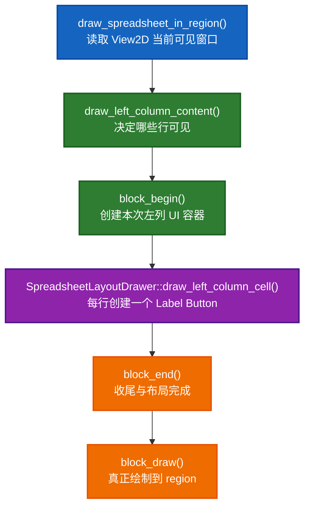
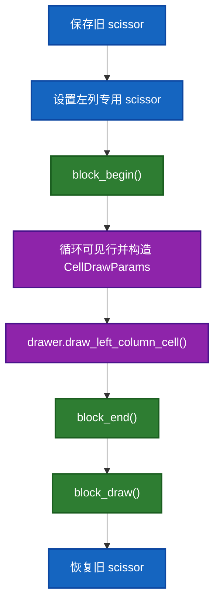

- [`View2D`、`ui::Block`、`ui::Button` 与左列内容绘制](#view2duiblockuibutton-与左列内容绘制)
  - [1. 先看完整链路](#1-先看完整链路)
  - [2. 从最上层开始：`draw_spreadsheet_in_region()` 为什么先读 `View2D`](#2-从最上层开始draw_spreadsheet_in_region-为什么先读-view2d)
    - [2.1 `View2D` 是什么](#21-view2d-是什么)
    - [2.2 为什么这里用 `v2d->cur.ymax` 和 `v2d->cur.xmin`](#22-为什么这里用-v2d-curymax-和-v2d-curxmin)
    - [2.2.1 为什么 `v2d->tot`、`v2d->cur` 的值看起来很奇怪](#221-为什么-v2d-totv2d-cur-的值看起来很奇怪)
    - [2.3 为什么一定要先有 `View2D`](#23-为什么一定要先有-view2d)
  - [2.4 `ARegion` 是什么，以及这里用到了哪些属性](#24-aregion-是什么以及这里用到了哪些属性)
    - [2.4.1 `region->v2d`](#241-region-v2d)
    - [2.4.2 `region->winx`](#242-region-winx)
    - [2.4.3 `region->winy`](#243-region-winy)
    - [2.4.4 `region->winrct`](#244-region-winrct)
  - [3. `draw_left_column_content()` 真正做了什么](#3-draw_left_column_content-真正做了什么)
    - [3.1 先保存旧 scissor](#31-先保存旧-scissor)
    - [3.2 设置左列 scissor](#32-设置左列-scissor)
    - [3.2.1 为什么别处会看到 `GPU_scissor(drawer.left_column_width + 1, ...)` 里的 `+1`](#321-为什么别处会看到-gpu_scissordrawerleft_column_width--1--里的-1)
    - [3.3 创建 `left_column_block`](#33-创建-left_column_block)
    - [3.4 算出可见行范围](#34-算出可见行范围)
    - [3.5 对每个可见行构造 `CellDrawParams`](#35-对每个可见行构造-celldrawparams)
    - [3.6 为什么 `ymin` 公式这么长](#36-为什么-ymin-公式这么长)
    - [3.7 为什么 `width` 要减 `CELL_RIGHT_PADDING`](#37-为什么-width-要减-cell_right_padding)
    - [3.8 `drawer.draw_left_column_cell(...)` 为什么不在当前文件里画](#38-drawerdraw_left_column_cell-为什么不在当前文件里画)
  - [4. `SpreadsheetLayoutDrawer::draw_left_column_cell()` 干了什么](#4-spreadsheetlayoutdrawerdraw_left_column_cell-干了什么)
    - [4.1 为什么先取 `real_index`](#41-为什么先取-real_index)
    - [4.2 `uiDefIconTextBut(...)` 在这里到底创建了什么](#42-uideficontextbut-在这里到底创建了什么)
    - [4.3 为什么要保存 `ui::Button *but`](#43-为什么要保存-uibutton-but)
    - [4.4 为什么左列数字要右对齐](#44-为什么左列数字要右对齐)
  - [5. `ui::Button` 在这个文件夹里最相关的属性](#5-uibutton-在这个文件夹里最相关的属性)
    - [5.1 `type`](#51-type)
    - [5.2 `drawflag`](#52-drawflag)
    - [5.3 `str` / `drawstr`](#53-str--drawstr)
    - [5.4 `rect`](#54-rect)
    - [5.5 `func / apply_func`](#55-func--apply_func)
  - [6. `ui::Block` 在这个文件夹里最相关的属性](#6-uiblock-在这个文件夹里最相关的属性)
    - [6.1 `buttons_ptrs`](#61-buttons_ptrs)
    - [6.2 `name`](#62-name)
    - [6.3 `emboss`](#63-emboss)
    - [6.4 `winmat` / `aspect`](#64-winmat--aspect)
  - [7. `block_begin / block_end / block_draw` 分别在做什么](#7-block_begin--block_end--block_draw-分别在做什么)
    - [7.1 `block_begin(...)`](#71-block_begin)
    - [7.2 `block_end(...)`](#72-block_end)
    - [7.3 `block_draw(...)`](#73-block_draw)
  - [8. 为什么 spreadsheet 左列不用“直接画文字”](#8-为什么-spreadsheet-左列不用直接画文字)
  - [9. 这三段代码各自的职责边界](#9-这三段代码各自的职责边界)
    - [9.1 `draw_spreadsheet_in_region()`](#91-draw_spreadsheet_in_region)
    - [9.2 `draw_left_column_content()`](#92-draw_left_column_content)
    - [9.3 `SpreadsheetLayoutDrawer::draw_left_column_cell()`](#93-spreadsheetlayoutdrawerdraw_left_column_cell)
  - [10. 一句话总结](#10-一句话总结)
  - [11. 五个常见“为什么”](#11-五个常见为什么)
    - [11.1 为什么 `GPU_scissor(drawer.left_column_width + 1, ...)` 要 `+1`](#111-为什么-gpu_scissordrawerleft_column_width--1--要-1)
    - [11.2 为什么 `region->winy - drawer.top_row_height` 没提成变量](#112-为什么-region-winy---drawertop_row_height-没提成变量)
    - [11.3 为什么是 `row_index + 1`](#113-为什么是-row_index--1)
    - [11.4 为什么要减去 `CELL_RIGHT_PADDING`](#114-为什么要减去-cell_right_padding)
    - [11.5 为什么不直接只调 `block_draw()`，而要先 `block_end()`](#115-为什么不直接只调-block_draw而要先-block_end)

# `View2D`、`ui::Block`、`ui::Button` 与左列内容绘制

这份文档专门串起来讲下面三段代码：

- [spreadsheet_draw.cc:138](E:/blender-git/blender/source/blender/editors/space_spreadsheet/spreadsheet_draw.cc#L138)
- [spreadsheet_draw.cc:355](E:/blender-git/blender/source/blender/editors/space_spreadsheet/spreadsheet_draw.cc#L355)
- [spreadsheet_layout.cc:121](E:/blender-git/blender/source/blender/editors/space_spreadsheet/spreadsheet_layout.cc#L121)

以及这几个 UI API：

- `block_begin(...)`
- `block_end(...)`
- `block_draw(...)`
- `uiDefIconTextBut(...)`

目标不是只翻译代码，而是把一条完整链路讲清楚：

> `draw_spreadsheet_in_region()` 先从 `View2D` 取到当前视口偏移，再由 `draw_left_column_content()` 把“当前可见的左列行”转换成一批 `ui::Button`，这些按钮被装进 `ui::Block`，最后 `block_draw()` 真正把它们绘制到 region 里。

---

## 1. 先看完整链路

你关心的三段代码，其实是同一条链上的三个位置：



如果把它翻译成人话：

1. 先知道“当前表格滚动到了哪里”
2. 再知道“左侧索引列现在该显示哪些行”
3. 创建一个临时的 UI 容器 `Block`
4. 给每个可见行创建一个 `Button`
5. 结束这个 block 的构建
6. 一次性绘制整个 block

---

## 2. 从最上层开始：`draw_spreadsheet_in_region()` 为什么先读 `View2D`

看这段：

- [spreadsheet_draw.cc:355](E:/blender-git/blender/source/blender/editors/space_spreadsheet/spreadsheet_draw.cc#L355)

核心几句是：

```cpp
View2D *v2d = &region->v2d;
const int scroll_offset_y = v2d->cur.ymax;
const int scroll_offset_x = v2d->cur.xmin;
```

### 2.1 `View2D` 是什么

`View2D` 定义在：

- [DNA_view2d_types.h:125](E:/blender-git/blender/source/blender/makesdna/DNA_view2d_types.h#L125)

最关键的几个字段是：

- `tot`
- `cur`
- `vert`
- `hor`
- `mask`

其中你现在最应该盯住的是：

- `tot`: 整个可滚动内容的总区域
- `cur`: 当前视口实际看到的是 `tot` 的哪一块

也就是说：

> `View2D` 不是“画什么”的对象，而是“当前通过一个可滚动窗口看到了哪一块内容”的对象。

### 2.2 为什么这里用 `v2d->cur.ymax` 和 `v2d->cur.xmin`

这个看着会有点反直觉。

它不是在说：

- `ymax` 是顶部像素坐标
- `xmin` 是左边像素坐标

更准确地说，它表示：

> 当前 View2D 可见窗口在逻辑内容坐标系中的偏移位置。

在 spreadsheet 这里：

- `scroll_offset_x` 用来决定列内容整体往左平移多少
- `scroll_offset_y` 用来决定行内容整体往下平移多少

所以这两个值不是 GPU 屏幕坐标，而是：

> 当前“内容世界”相对窗口的偏移量。

### 2.2.1 为什么 `v2d->tot`、`v2d->cur` 的值看起来很奇怪

这是 `View2D` 最容易让人不适应的地方。

你看到的典型值会像这样：

```text
tot = {xmin=0 xmax=1740 ymin=-3296 ymax=0}
cur = {xmin=0 xmax=711 ymin=-499 ymax=0}
```

或者滚到右下角后：

```text
tot = {xmin=0 xmax=1740 ymin=-3296 ymax=0}
cur = {xmin=1029 xmax=1740 ymin=-3296 ymax=-2797}
```

最简短的理解方式是：

- `tot`：整个可滚动内容矩形
- `cur`：当前可见窗口矩形
- 顶部常常取 `y = 0`
- 往下不是正数，而是越来越负

所以这里不是“屏幕左上角像素坐标系”，而是：

> 一套为滚动内容服务的逻辑坐标系，顶部为 `0`，向下扩展为负数。

于是这些值就不奇怪了：

- `tot.ymax = 0`：总内容顶部在 0
- `tot.ymin = -3296`：总内容底部在 -3296
- 左上角时 `cur.ymax = 0`：当前视口贴着顶部
- 右下角时 `cur.ymin = -3296`：当前视口贴着底部

你可以把它记成一句话：

> `tot` 是整张地图，`cur` 是你现在用窗口看到地图的哪一块。

### 2.3 为什么一定要先有 `View2D`

因为后面所有“只画可见内容”的逻辑都依赖这个前提。

如果没有 `View2D`：

- 你不知道滚动到哪了
- 不知道第一行该从哪一行开始
- 不知道哪些列已经滑出屏幕
- 不知道滚动条该怎么画

所以 `View2D` 是整个 spreadsheet 内容绘制的“相机”。

---

## 2.4 `ARegion` 是什么，以及这里用到了哪些属性

`ARegion` 可以先粗略理解成：

> Blender 编辑器中的一个可独立绘制、可独立事件处理的子区域。

在 spreadsheet 这里，主表格区就是一个 `ARegion`。

当前文件里最常用到的几个字段是：

- `region->v2d`
- `region->winx`
- `region->winy`
- `region->winrct`

### 2.4.1 `region->v2d`

这是本篇最核心的字段。

它把这个 region 变成一个“可滚动的 2D 内容窗口”。

### 2.4.2 `region->winx`

当前 region 的像素宽度。

在 spreadsheet 里常用于：

- 判断一列是否已经滚出屏幕
- 计算右边界
- 计算 scroller mask

### 2.4.3 `region->winy`

当前 region 的像素高度。

在 spreadsheet 里常用于：

- 从顶部往下推算每个 cell 的 `y`
- 计算顶部表头区域
- 设置 scissor 的高度

### 2.4.4 `region->winrct`

这是 region 在窗口中的实际矩形。

这一篇里它不是主角，但当 `block_draw()` 最终把按钮映射到窗口像素空间时，会间接依赖这类 region 几何信息。

所以你可以把 `ARegion` 简单记成：

> `ARegion` 给你“这个区域有多大、滚动窗口是什么、最终画到哪块屏幕上”的上下文。

---

## 3. `draw_left_column_content()` 真正做了什么

看这段：

- [spreadsheet_draw.cc:138](E:/blender-git/blender/source/blender/editors/space_spreadsheet/spreadsheet_draw.cc#L138)

它不是简单地“画左列”，而是拆成 6 步：



### 3.1 先保存旧 scissor

```cpp
int old_scissor[4];
GPU_scissor_get(old_scissor);
```

这一步不是“画 UI”，而是准备一个局部绘制作用域。

意思是：

> 左列内容接下来只允许在自己的矩形区域里绘制，画完后要把外面的 GPU 状态恢复回去。

### 3.2 设置左列 scissor

```cpp
GPU_scissor(0, 0, drawer.left_column_width, region->winy - drawer.top_row_height);
```

这一步定义了左列实际允许落笔的像素区域。

它的意图非常明确：

- `x = 0`：从 region 左边缘开始
- `width = drawer.left_column_width`：只允许左列宽度这么宽
- `height = region->winy - drawer.top_row_height`：不要画到顶部标题行

所以这里的 scissor 是：

> 用 GPU 级裁剪把“左列内容区”切出来。

### 3.2.1 为什么别处会看到 `GPU_scissor(drawer.left_column_width + 1, ...)` 里的 `+1`

你在这个文件里还会看到：

```cpp
GPU_scissor(drawer.left_column_width + 1,
            region->winy - drawer.top_row_height,
            region->winx - drawer.left_column_width,
            drawer.top_row_height);
```

或者：

```cpp
GPU_scissor(drawer.left_column_width + 1,
            0,
            region->winx - drawer.left_column_width,
            region->winy - drawer.top_row_height);
```

这个 `+1` 的目的很实用：

> 让内容区 scissor 从左侧索引列分隔线的右边一个像素开始，避免内容刚好压到分隔线上。

因为左列和主内容区之间本来就有一条竖分隔线：

- 左列背景和左列内容在分隔线左边
- 主表头和主单元格内容应该从分隔线右边开始

如果不加这 `1` 个像素，常见风险是：

- 文本或按钮边缘和分隔线重叠
- 刚好画到边界线上，视觉上发糊
- 左列和内容区看起来“粘”在一起

所以这不是随手写的 magic number，而是：

> 给分隔线留一个明确的像素缓冲区。

### 3.3 创建 `left_column_block`

```cpp
ui::Block *left_column_block = block_begin(C, region, __func__, ui::EmbossType::None);
```

这一句非常关键。

它不是“立刻画一个 UI 元素”，而是在说：

> 我要开始构建一批属于左列内容的 UI 按钮了，这一批按钮都装进同一个 `Block` 里。

你可以把 `Block` 先理解成：

> 一次 UI 构建和绘制的容器。

在 spreadsheet 左列这里，它里面会放很多个 label button，每个 button 对应一个可见行索引。

### 3.4 算出可见行范围

```cpp
get_visible_rows(drawer, region, scroll_offset_y, &first_row, &max_visible_rows);
```

这里的逻辑非常朴素，但很重要：

- `first_row`：当前滚动后，左列第一条可见行是哪一行
- `max_visible_rows`：最多有多少行可能落进当前窗口

这说明 spreadsheet 并不是“把所有行都生成一遍再裁掉”，而是：

> 只为当前可见区附近的行创建 UI 按钮。

这是一种典型的“视口驱动绘制”。

### 3.5 对每个可见行构造 `CellDrawParams`

循环里最关键的几句是：

```cpp
CellDrawParams params;
params.block = left_column_block;
params.xmin = 0;
params.ymin = region->winy - drawer.top_row_height - (row_index + 1) * drawer.row_height -
              scroll_offset_y;
params.width = drawer.left_column_width - CELL_RIGHT_PADDING;
params.height = drawer.row_height;
```

这个结构体把“画一个 cell 最少需要什么几何信息”压成一个统一包：

- `block`: 这个 cell 要往哪个 UI block 里追加 button
- `xmin`, `ymin`: 左下角位置
- `width`, `height`: 尺寸

也就是说，`draw_left_column_content()` 并不直接创建 button，而是先把“当前这个 cell 的绘制上下文”准备好，再交给 `drawer.draw_left_column_cell(...)`。

### 3.6 为什么 `ymin` 公式这么长

```cpp
region->winy - drawer.top_row_height - (row_index + 1) * drawer.row_height - scroll_offset_y
```

可以拆成四层意思：

1. `region->winy`
   - 从 region 顶部开始
2. `- drawer.top_row_height`
   - 先跳过顶部表头
3. `- (row_index + 1) * drawer.row_height`
   - 再向下走到第 `row_index` 行对应的单元格底边
4. `- scroll_offset_y`
   - 再减去当前滚动带来的垂直偏移

### 3.7 为什么 `width` 要减 `CELL_RIGHT_PADDING`

因为如果把内容宽度直接撑满整列，文本和边线会显得太挤。

所以这里不是列本身变窄了，而是：

> 单元格内容绘制区域，比整列视觉宽度略小一点，给右边留出内边距。

### 3.8 `drawer.draw_left_column_cell(...)` 为什么不在当前文件里画

因为 [spreadsheet_draw.cc](E:/blender-git/blender/source/blender/editors/space_spreadsheet/spreadsheet_draw.cc) 负责的是：

- 区域分层
- 可见行计算
- UI block 生命周期

而不是：

- 当前这个 cell 具体显示什么文字
- 文字对齐方式是什么

所以具体 cell 内容被下沉到 `SpreadsheetDrawer` 子类。

---

## 4. `SpreadsheetLayoutDrawer::draw_left_column_cell()` 干了什么

现在接第三段：

- [spreadsheet_layout.cc:121](E:/blender-git/blender/source/blender/editors/space_spreadsheet/spreadsheet_layout.cc#L121)

代码核心是：

```cpp
const int real_index = spreadsheet_layout_.row_indices[row_index];
std::string index_str = std::to_string(real_index);
ui::Button *but = uiDefIconTextBut(params.block,
                                   ui::ButtonType::Label,
                                   ICON_NONE,
                                   index_str,
                                   params.xmin,
                                   params.ymin,
                                   params.width,
                                   params.height,
                                   nullptr,
                                   std::nullopt);
button_drawflag_enable(but, ui::BUT_TEXT_RIGHT);
button_drawflag_disable(but, ui::BUT_TEXT_LEFT);
```

### 4.1 为什么先取 `real_index`

`row_index` 是“当前表格里的第几行”，但过滤和排序后，屏幕行号未必等于原始数据行号。

所以 `row_indices[row_index]` 的含义是：

> 当前可见第 `row_index` 行，实际对应原始数据里的哪一行。

左侧索引列显示的是这个 `real_index`。

### 4.2 `uiDefIconTextBut(...)` 在这里到底创建了什么

它声明在：

- [UI_interface_c.hh:1532](E:/blender-git/blender/source/blender/editors/include/UI_interface_c.hh#L1532)

你可以把它理解成：

> 向 `params.block` 里追加一个“带图标和文本的按钮”，不过当前这里图标为空，只拿它当文本 label 用。

这里各参数的含义是：

- `params.block`: 当前按钮属于哪个 block
- `ui::ButtonType::Label`: 这是 label，不是编辑控件
- `ICON_NONE`: 不画图标
- `index_str`: 显示的文字
- `params.xmin/ymin/width/height`: 这个 button 占据的矩形
- `nullptr`: 没有关联的可编辑数据指针
- `std::nullopt`: 没有额外数值参数

### 4.3 为什么要保存 `ui::Button *but`

因为创建完还要继续调样式：

```cpp
button_drawflag_enable(but, ui::BUT_TEXT_RIGHT);
button_drawflag_disable(but, ui::BUT_TEXT_LEFT);
```

所以这里不是“立即画文字”，而是：

> 先创建一个 button 对象，再给它设置绘制行为。

### 4.4 为什么左列数字要右对齐

这是一个很细但很有 UI 感觉的决定。

行索引列如果右对齐：

- 个位数、十位数、百位数的尾部更整齐
- 更像传统表格的行号列
- 更贴近数字列表的阅读习惯

所以这里虽然只是两句 drawflag 设置，但其实体现了作者对表格视觉语义的判断。

---

## 5. `ui::Button` 在这个文件夹里最相关的属性

`Button` 定义在：

- [interface_intern.hh:188](E:/blender-git/blender/source/blender/editors/interface/interface_intern.hh#L188)

你不需要一下子吃掉全部字段，先抓这几个和 spreadsheet 最相关的：

- `type`
- `flag`
- `drawflag`
- `str`
- `drawstr`
- `rect`
- `func / apply_func`

### 5.1 `type`

这里是：

```cpp
ui::ButtonType::Label
```

说明它是纯显示用途。

### 5.2 `drawflag`

这是 spreadsheet 里最直观被使用的字段。

这里用到：

- `ui::BUT_TEXT_RIGHT`
- `ui::BUT_TEXT_LEFT`

它们控制文本在按钮内部的对齐方式。

### 5.3 `str` / `drawstr`

- `str`: 原始文本
- `drawstr`: 更接近最终绘制结果的文本表示

对当前文档来说，先把它理解成：

> `index_str` 进入按钮系统后，会成为这个 label button 最终显示的文字。

### 5.4 `rect`

按钮自己的矩形范围。

也就是说 `params.xmin/ymin/width/height` 最终会进入 button 的几何定义。

### 5.5 `func / apply_func`

很多 button 是有点击、编辑、回调行为的。

但 spreadsheet 左列这里没有设置这些回调，所以它更像：

> 借用按钮系统来画文本，而不是为了交互编辑。

---

## 6. `ui::Block` 在这个文件夹里最相关的属性

`Block` 定义在：

- [interface_intern.hh:650](E:/blender-git/blender/source/blender/editors/interface/interface_intern.hh#L650)

你现在最需要关注的字段是：

- `buttons_ptrs`
- `name`
- `winmat`
- `rect`
- `aspect`
- `emboss`

### 6.1 `buttons_ptrs`

这是最核心的字段。

它表示：

> 这个 block 里存放的所有按钮对象。

所以 spreadsheet 左列每循环一行，就往当前 block 里追加一个新的 label button。

### 6.2 `name`

`block_begin(C, region, __func__, ...)` 把 `__func__` 作为 block 名字传进去。

这有助于：

- 调试
- 重绘时识别 block
- 和旧 block 建立关联

### 6.3 `emboss`

当前这里传的是：

```cpp
ui::EmbossType::None
```

意思是：

> 不要把这些 cell 按钮画成传统凸起按钮。

这很适合 spreadsheet，因为左列索引看上去更像表格内容，而不是普通工具按钮。

### 6.4 `winmat` / `aspect`

这两个字段跟 block 的窗口变换和缩放有关。

你现在不必深入矩阵细节，但要记住：

> block 不是纯数据数组，它还携带了把按钮正确映射到当前 region/window 的绘制上下文。

---

## 7. `block_begin / block_end / block_draw` 分别在做什么

声明在：

- [UI_interface_c.hh:1040](E:/blender-git/blender/source/blender/editors/include/UI_interface_c.hh#L1040)

实现主要在：

- [interface.cc:3899](E:/blender-git/blender/source/blender/editors/interface/interface.cc#L3899)
- [interface.cc:2186](E:/blender-git/blender/source/blender/editors/interface/interface.cc#L2186)
- [interface.cc:2230](E:/blender-git/blender/source/blender/editors/interface/interface.cc#L2230)

你可以把它们理解成一个固定生命周期。

### 7.1 `block_begin(...)`

作用：

- 新建一个 block
- 记录名字、emboss 样式
- 绑定 region/window/scene 上下文
- 更新 block 的窗口矩阵

所以它不是“开始绘制”，而是：

> 开始构建这一批 UI 元素的容器和坐标环境。

### 7.2 `block_end(...)`

作用：

- 对 block 内容做收尾
- 计算和修正布局范围
- 完成绘制前准备

所以它不是销毁，而是：

> 宣布“这一批按钮我已经加完了，现在可以准备画了”。

### 7.3 `block_draw(...)`

作用：

- 如果 block 还没 end，就先补 `block_end()`
- 准备样式和字体缩放
- 遍历 block 里的按钮
- 真正把它们画到当前 region

所以 `block_draw()` 才是最终“上屏”的那一步。

---

## 8. 为什么 spreadsheet 左列不用“直接画文字”

看起来左列只是：

- `0`
- `1`
- `2`

为什么不直接调用字体 API，而要绕一层 `Button` 和 `Block`？

因为作者想复用 Blender UI 系统现成的能力：

- 文本样式
- DPI/缩放
- region 坐标变换
- 对齐规则
- 和 Blender 其他 UI 一致的绘制路径

所以这里不是追求“最短代码”，而是追求：

> 让 spreadsheet 内容层尽量复用 Blender UI 基础设施。

---

## 9. 这三段代码各自的职责边界

### 9.1 `draw_spreadsheet_in_region()`

负责：

- 读 `View2D`
- 算当前滚动偏移
- 驱动整个区域绘制总流程

### 9.2 `draw_left_column_content()`

负责：

- 切出左列绘制区域
- 计算哪些行可见
- 为每个可见行准备 `CellDrawParams`
- 管理 `Block` 生命周期

### 9.3 `SpreadsheetLayoutDrawer::draw_left_column_cell()`

负责：

- 把当前布局行映射到真实数据索引
- 创建当前 cell 对应的 label button
- 设置文本对齐方式

---

## 10. 一句话总结

这三段代码连起来的核心，不是“画一个左列数字”这么简单，而是：

> `View2D` 先定义当前用户看到了数据世界的哪一块，`draw_left_column_content()` 再把这块视口里可见的行批量组织成一个 `ui::Block`，`SpreadsheetLayoutDrawer::draw_left_column_cell()` 为每行生成一个右对齐的 `ui::Button::Label`，最后 `block_draw()` 把整批按钮统一绘制到 spreadsheet region 中。

---

## 11. 五个常见“为什么”

这一组问题都来自 [spreadsheet_draw.cc](E:/blender-git/blender/source/blender/editors/space_spreadsheet/spreadsheet_draw.cc) 的内容区绘制公式，下面给一个便于回查的精简答案。

### 11.1 为什么 `GPU_scissor(drawer.left_column_width + 1, ...)` 要 `+1`

因为主内容区应该从左侧索引列分隔线的右边一个像素开始画。

这个 `+1` 的作用是：

- 避免内容压到分隔线
- 给左右区域留一个清晰边界
- 防止文字或按钮边缘和线条重叠发糊

一句话：

> `+1` 是给分隔线留出的一个像素缓冲。

### 11.2 为什么 `region->winy - drawer.top_row_height` 没提成变量

因为这段表达式本身已经很有几何语义：

> “从 region 顶部减去表头高度，得到内容区顶部”

作者选择原地展开，读起来也还算直接，所以没有强行抽成局部变量。

### 11.3 为什么是 `row_index + 1`

因为这里算的是单元格底边 `ymin`，不是顶边。

- 第 0 行底边 = 顶部基准线下移 1 个行高
- 第 1 行底边 = 顶部基准线下移 2 个行高

所以自然是：

> `(row_index + 1) * row_height`

### 11.4 为什么要减去 `CELL_RIGHT_PADDING`

因为列宽不等于内容宽度。

这里减掉右内边距，是为了：

- 不让文本贴着右边分隔线
- 给单元格内容留呼吸空间
- 让表格视觉更整齐

一句话：

> 列本身不变窄，只是内容区略微缩一点。

### 11.5 为什么不直接只调 `block_draw()`，而要先 `block_end()`

虽然 `block_draw()` 内部可以兜底调用 `block_end()`，但显式写出来更清楚：

- 先结束 block 构建
- 再执行绘制

这样能把 UI block 的生命周期写在明面上，更符合 Blender 这套 UI 代码的常见写法。
